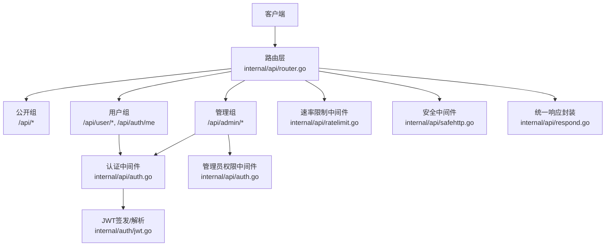
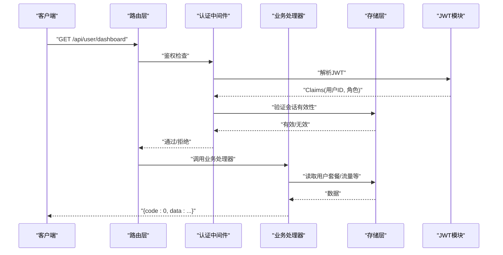
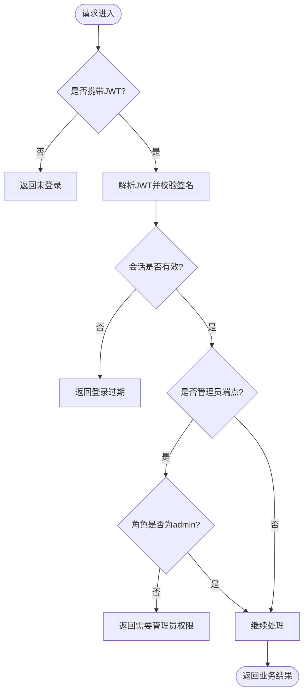
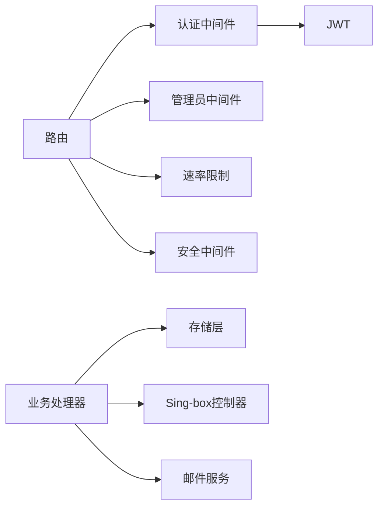

# API接口文档

<cite>
**本文引用的文件**
- [router.go](file://internal/api/router.go)
- [auth.go](file://internal/api/auth.go)
- [jwt.go](file://internal/auth/jwt.go)
- [respond.go](file://internal/api/respond.go)
- [safehttp.go](file://internal/api/safehttp.go)
- [ratelimit.go](file://internal/api/ratelimit.go)
- [user.go](file://internal/api/user.go)
- [admin.go](file://internal/api/admin.go)
- [monitor.go](file://internal/api/monitor.go)
- [shop.go](file://internal/api/shop.go)
- [stats.go](file://internal/api/stats.go)
- [help.go](file://internal/api/help.go)
- [email.go](file://internal/api/email.go)
- [subinfo.go](file://internal/api/subinfo.go)
- [egresslink.go](file://internal/api/egresslink.go)
</cite>

## 目录
1. [简介](#简介)
2. [项目结构](#项目结构)
3. [核心组件](#核心组件)
4. [架构总览](#架构总览)
5. [详细组件分析](#详细组件分析)
6. [依赖关系分析](#依赖关系分析)
7. [性能与限流](#性能与限流)
8. [故障排查指南](#故障排查指南)
9. [结论](#结论)
10. [附录：完整API参考](#附录完整api参考)

## 简介
本文件为轻舟面板的RESTful API接口文档，覆盖认证授权、用户端与管理端全部HTTP端点，包含URL路径、HTTP方法、请求参数、响应格式、状态码、数据校验规则、速率限制与安全策略，并提供客户端集成示例与最佳实践。所有端点统一返回JSON信封：成功时code=0，错误时code为HTTP状态码并附带msg字段。

## 项目结构
后端采用Go语言，路由由Chi框架注册，按权限分组：公开端点、已登录用户端点、管理员端点。中间件提供请求ID、恢复、压缩、超时、最大请求体大小限制等通用能力；认证通过JWT令牌（Cookie或Authorization头）实现；管理端额外要求管理员角色。

**图表来源**
- [router.go:132-386](file://internal/api/router.go#L132-L386)
- [auth.go:179-213](file://internal/api/auth.go#L179-L213)
- [jwt.go:16-42](file://internal/auth/jwt.go#L16-L42)
- [ratelimit.go:54-64](file://internal/api/ratelimit.go#L54-L64)
- [safehttp.go:58-85](file://internal/api/safehttp.go#L58-L85)
- [respond.go:11-25](file://internal/api/respond.go#L11-L25)

**章节来源**
- [router.go:132-386](file://internal/api/router.go#L132-L386)

## 核心组件
- 路由与分组：按公开、已登录、管理员三类分组，集中注册端点。
- 认证与授权：JWT令牌，支持Cookie与Authorization头；会话持久化支持登出与撤销。
- 速率限制：基于IP或用户的固定窗口限流，防止暴力破解与滥用。
- 安全中间件：限制请求体大小、禁止内网访问的外部请求、URL白名单校验。
- 统一响应：所有接口返回{code,msg,data}信封。

**章节来源**
- [auth.go:179-213](file://internal/api/auth.go#L179-L213)
- [jwt.go:16-42](file://internal/auth/jwt.go#L16-L42)
- [ratelimit.go:9-64](file://internal/api/ratelimit.go#L9-L64)
- [safehttp.go:12-85](file://internal/api/safehttp.go#L12-L85)
- [respond.go:11-25](file://internal/api/respond.go#L11-L25)

## 架构总览
下图展示一次受保护的用户端请求从进入路由到鉴权、业务处理、再到统一响应的流程。

**图表来源**
- [router.go:177-208](file://internal/api/router.go#L177-L208)
- [auth.go:179-201](file://internal/api/auth.go#L179-L201)
- [jwt.go:30-42](file://internal/auth/jwt.go#L30-L42)
- [respond.go:17-25](file://internal/api/respond.go#L17-L25)

## 详细组件分析

### 认证与授权
- 登录/注册/密码重置/邮箱验证：使用邮箱+密码或注册码完成账号创建与激活。
- 令牌机制：JWT HS256签名，携带用户ID、角色、唯一jti；有效期7天；支持Cookie与Authorization头两种方式传递。
- 会话控制：登录时创建会话，登出删除会话；重置密码会撤销所有会话。
- 权限控制：普通用户可访问用户组端点；管理员需具备admin角色。

**图表来源**
- [auth.go:179-213](file://internal/api/auth.go#L179-L213)
- [jwt.go:16-42](file://internal/auth/jwt.go#L16-L42)

**章节来源**
- [auth.go:112-177](file://internal/api/auth.go#L112-L177)
- [auth.go:179-213](file://internal/api/auth.go#L179-L213)
- [jwt.go:16-42](file://internal/auth/jwt.go#L16-L42)

### 用户端API
- 获取配置：公开，返回站点配置与注册模式。
- 用户信息：已登录，返回当前用户基本信息。
- 仪表盘：已登录，返回用户名、积分、流量统计、套餐列表、到期时间等。
- 订阅信息：已登录，返回订阅地址及多格式链接（默认、clash、singbox、surge、base64）。
- 代理凭据：已登录，返回混合代理（HTTP/SOCKS5）的可用节点凭据。
- 更新代理凭据：已登录，设置某桶的自定义代理用户名/密码与可选过期时间。
- 套餐列表：已登录，返回可见商品列表。
- 购买套餐：已登录，提交package_id与duration_days，支持幂等键。
- 订单列表：已登录，返回最近订单。
- 积分流水：已登录，返回余额与交易记录。
- 流量统计：已登录，返回近N日上下行用量。
- 修改密码：已登录，提交新密码。
- 重发验证邮件：已登录，发送邮箱验证链接。
- 绑定邮箱：已登录，绑定或更换邮箱并发送验证邮件。
- 帮助文档：已登录，返回已发布帮助文档。
- 会话管理：已登录，列出与撤销会话。
- 节点管理：已登录，查询、Ping、切换、批量操作、禁用/启用全部节点。

**章节来源**
- [router.go:149-208](file://internal/api/router.go#L149-L208)
- [user.go:25-173](file://internal/api/user.go#L25-L173)
- [user.go:285-555](file://internal/api/user.go#L285-L555)
- [shop.go:11-124](file://internal/api/shop.go#L11-L124)
- [stats.go:79-89](file://internal/api/stats.go#L79-L89)
- [help.go:11-19](file://internal/api/help.go#L11-L19)
- [email.go:176-260](file://internal/api/email.go#L176-L260)

### 管理端API
- 设置管理：获取/保存系统设置（敏感字段遮蔽，不可变设置不可写）。
- 重建Sing-box：触发配置重建与分发。
- 备份：导出备份。
- Sing-box管理：Reality密钥对、TLS配置、ACME证书、Inbounds/Egresses管理、预览与端口检查、远程导入等。
- 服务器管理：增删改查、测试连接、重建、清除主机密钥、监控开关。
- 监控看板：仪表盘、服务器列表、指标查询、热力图、告警列表与标记已读。
- 节点与分组：节点CRUD、排序、导入；节点分组CRUD；节点来源CRUD与抓取。
- 用户与群组：用户CRUD；用户组CRUD与成员管理。
- 统计概览：总览、流量、Top、分布、套餐统计、用户统计、用量分析。
- 注册码管理：生成、查看、更新、删除。
- 公告管理：增删改查。

**章节来源**
- [router.go:210-375](file://internal/api/router.go#L210-L375)
- [admin.go:47-133](file://internal/api/admin.go#L47-L133)
- [monitor.go:183-373](file://internal/api/monitor.go#L183-L373)
- [stats.go:91-199](file://internal/api/stats.go#L91-L199)

### 公共与探针端点
- 健康检查：返回服务状态、时间与版本。
- 配置：返回前端所需站点配置。
- 邮箱验证：点击邮件中的链接完成邮箱验证。
- 订阅地址：通过子cription token获取订阅内容（支持多种格式）。
- 监控公共页面：无需登录，返回服务器状态、迷你曲线、热力图等。
- 探针上报：带探针token的POST上报指标，用于服务器监控。
- 下载探针与安装脚本：按架构下载探针二进制与一键安装脚本。

**章节来源**
- [router.go:149-175](file://internal/api/router.go#L149-L175)
- [monitor.go:20-73](file://internal/api/monitor.go#L20-L73)
- [monitor.go:781-820](file://internal/api/monitor.go#L781-L820)
- [subinfo.go:14-49](file://internal/api/subinfo.go#L14-L49)

## 依赖关系分析
- 路由依赖认证中间件、管理员权限中间件、速率限制器、安全中间件与统一响应封装。
- 业务处理器依赖存储层进行数据读写，必要时触发Sing-box控制器重建。
- 外部请求必须通过安全客户端，禁止访问内网地址，防止SSRF。

**图表来源**
- [router.go:132-386](file://internal/api/router.go#L132-L386)
- [auth.go:179-213](file://internal/api/auth.go#L179-L213)
- [safehttp.go:27-56](file://internal/api/safehttp.go#L27-L56)

**章节来源**
- [router.go:132-386](file://internal/api/router.go#L132-L386)

## 性能与限流
- 全局中间件：请求ID、恢复、Gzip压缩、30秒超时、最大请求体8MiB。
- 速率限制：
  - 认证相关端点：每IP每分钟最多20次。
  - 邮箱重发：每用户每10分钟最多3次。
  - 探针上报：每IP每分钟最多60次。
  - 订阅地址更换：每用户每10分钟最多5次。
- 外部请求防护：仅允许http/https，且目标IP不得为内网地址（含CGNAT），避免DNS重绑定与重定向攻击。

**章节来源**
- [router.go:132-148](file://internal/api/router.go#L132-L148)
- [ratelimit.go:9-64](file://internal/api/ratelimit.go#L9-L64)
- [safehttp.go:27-85](file://internal/api/safehttp.go#L27-L85)

## 故障排查指南
- 常见错误码：
  - 400 请求格式错误：JSON解析失败或参数不合法。
  - 401 未登录/登录过期：JWT缺失或会话失效。
  - 403 需要管理员权限/账号被封禁：角色不足或状态异常。
  - 404 资源不存在：用户/服务器/商品等不存在。
  - 409 冲突：用户名/邮箱已被占用、库存不足等。
  - 429 请求过于频繁：触发速率限制。
  - 500 服务器错误：内部异常。
- 排查建议：
  - 检查Authorization头或Cookie中是否携带有效JWT。
  - 确认管理员端点是否以admin角色访问。
  - 关注速率限制提示，稍后重试。
  - 对于外部请求（如导入远端配置），确保URL为http/https且非内网地址。

**章节来源**
- [respond.go:17-25](file://internal/api/respond.go#L17-L25)
- [auth.go:179-213](file://internal/api/auth.go#L179-L213)
- [ratelimit.go:54-64](file://internal/api/ratelimit.go#L54-L64)
- [safehttp.go:71-85](file://internal/api/safehttp.go#L71-L85)

## 结论
本API以JWT为核心认证机制，结合会话管理与管理员权限控制，提供完整的用户端与管理端功能。通过统一的响应信封、严格的速率限制与安全中间件，保障接口的稳定性与安全性。建议客户端遵循幂等键、合理重试与错误处理策略，并在生产环境部署反向代理与可信代理以正确识别源IP。

## 附录：完整API参考

### 统一响应格式
- 成功：{code:0, msg:"", data:...}
- 错误：{code:HTTP状态码, msg:"错误描述", data:null}

**章节来源**
- [respond.go:11-25](file://internal/api/respond.go#L11-L25)

### 认证与授权
- POST /api/auth/login
  - 请求体：username, password
  - 成功：返回token与用户视图
  - 错误：400/401/500
- POST /api/auth/register
  - 请求体：username, email, password, code（当注册模式为code）
  - 校验：用户名3-32位字母数字下划线；密码至少6位；邮箱唯一；注册码有效
  - 成功：可能返回need_verify=true；或返回token与用户视图
  - 错误：400/401/409/500
- GET /api/auth/verify?token=...
  - 作用：邮箱验证
  - 成功：HTML页面提示验证成功
  - 错误：400/500
- POST /api/auth/forgot
  - 请求体：email
  - 成功：若邮箱已注册则发送邮件
  - 错误：400/500
- POST /api/auth/reset
  - 请求体：token, new_password（至少6位）
  - 成功：重置密码并撤销所有会话
  - 错误：400/500
- GET /api/auth/me
  - 需登录：返回当前用户视图
  - 错误：401/404/500
- POST /api/auth/logout
  - 需登录：删除会话并清空Cookie
  - 成功：空数据
  - 错误：401

**章节来源**
- [auth.go:112-177](file://internal/api/auth.go#L112-L177)
- [email.go:60-153](file://internal/api/email.go#L60-L153)
- [router.go:149-162](file://internal/api/router.go#L149-L162)

### 用户端
- GET /api/config
  - 公开：返回站点配置（注册模式、邮箱验证要求、积分汇率、站点名称与描述、首页模式与URL、应用版本）
- GET /api/user/dashboard
  - 需登录：返回用户名、邮箱、积分、状态、流量统计、套餐列表、到期时间
- GET /api/user/plans
  - 需登录：返回用户套餐视图（含剩余流量、状态、开始/结束时间）
- GET /api/user/subscription
  - 需登录：返回订阅地址与多格式链接（default/clash/singbox/surge/base64）
- GET /api/user/proxies
  - 需登录：返回混合代理节点凭据
- PUT /api/user/proxies/{bucket}
  - 需登录：设置某桶的代理用户名/密码与可选过期时间
- POST /api/user/reset-sub
  - 需登录：更换订阅地址（限频）
- POST /api/user/reset-node-creds
  - 需登录：重置节点凭据（限频与冷却期）
- GET /api/user/packages
  - 需登录：返回可见商品列表
- POST /api/user/purchase
  - 需登录：购买套餐（package_id, duration_days, idempotency_key）
- GET /api/user/orders
  - 需登录：返回最近订单
- GET /api/user/points
  - 需登录：返回余额与交易记录
- GET /api/user/stats/traffic?range=7d|30d
  - 需登录：返回近N日流量趋势
- POST /api/user/password
  - 需登录：修改密码
- POST /api/user/resend-verify
  - 需登录：重发邮箱验证（限频）
- POST /api/user/email
  - 需登录：绑定或更换邮箱并发送验证（限频）
- GET /api/user/announcements
  - 需登录：获取公告
- POST /api/user/announcements/read
  - 需登录：标记公告已读
- GET /api/help
  - 需登录：获取已发布帮助文档
- GET /api/user/sessions
  - 需登录：列出会话
- POST /api/user/sessions/{id}/revoke
  - 需登录：撤销指定会话
- GET /api/user/nodes
  - 需登录：列出节点
- GET /api/user/nodes/ping
  - 需登录：Ping节点
- POST /api/user/nodes/toggle
  - 需登录：切换节点状态
- POST /api/user/nodes/bulk
  - 需登录：批量操作节点
- POST /api/user/nodes/disable-all
  - 需登录：禁用全部节点
- POST /api/user/nodes/enable-all
  - 需登录：启用全部节点

**章节来源**
- [router.go:149-208](file://internal/api/router.go#L149-L208)
- [user.go:285-555](file://internal/api/user.go#L285-L555)
- [shop.go:11-124](file://internal/api/shop.go#L11-L124)
- [stats.go:79-89](file://internal/api/stats.go#L79-L89)
- [help.go:11-19](file://internal/api/help.go#L11-L19)
- [email.go:176-260](file://internal/api/email.go#L176-L260)

### 管理端
- GET /api/admin/settings
  - 需管理员：获取设置（敏感字段遮蔽）
- PUT /api/admin/settings
  - 需管理员：保存设置（不可变设置不可写）
- GET /api/admin/settings/default-templates
  - 需管理员：获取内置模板
- POST /api/admin/settings/test-smtp
  - 需管理员：测试SMTP
- GET /api/admin/settings/detect-node-host
  - 需管理员：检测节点主机
- POST /api/admin/rebuild
  - 需管理员：触发重建
- GET /api/admin/backup
  - 需管理员：导出备份
- GET /api/admin/nodes/singbox
  - 需管理员：查询各节点Sing-box版本
- POST /api/admin/nodes/singbox/refresh
  - 需管理员：刷新版本信息
- POST /api/admin/nodes/{id}/singbox/upgrade
  - 需管理员：升级节点Sing-box
- GET /api/admin/update/check
  - 需管理员：检查更新
- GET /api/admin/update/status
  - 需管理员：更新状态
- GET /api/admin/update/releases
  - 需管理员：获取发布列表
- GET /api/admin/update/rollback
  - 需管理员：回滚状态
- POST /api/admin/update/rollback
  - 需管理员：执行回滚
- POST /api/admin/update/apply
  - 需管理员：应用更新
- GET /api/admin/help
  - 需管理员：获取所有帮助文档
- POST /api/admin/help
  - 需管理员：创建帮助文档
- PUT /api/admin/help/{id}
  - 需管理员：更新帮助文档
- DELETE /api/admin/help/{id}
  - 需管理员：删除帮助文档
- DELETE /api/admin/users/{id}
  - 需管理员：删除用户
- POST /api/admin/users/{id}/points
  - 需管理员：充值积分
- POST /api/admin/users/{id}/assign-plan
  - 需管理员：分配套餐
- POST /api/admin/users/{id}/reset-node-creds
  - 需管理员：重置节点凭据
- GET /api/admin/packages
  - 需管理员：列出商品
- POST /api/admin/packages
  - 需管理员：创建商品
- POST /api/admin/packages/reorder
  - 需管理员：重新排序
- PUT /api/admin/packages/{id}
  - 需管理员：更新商品
- POST /api/admin/packages/{id}/retire
  - 需管理员：下架商品
- POST /api/admin/packages/{id}/enable
  - 需管理员：上架商品
- DELETE /api/admin/packages/{id}
  - 需管理员：删除商品
- GET /api/admin/orders
  - 需管理员：列出订单
- GET /api/admin/users/{id}/orders
  - 需管理员：用户订单
- GET /api/admin/users/{id}/plans
  - 需管理员：用户套餐
- DELETE /api/admin/users/{id}/plans/{planID}
  - 需管理员：删除用户套餐
- GET /api/admin/orders/{id}/refund-preview
  - 需管理员：退款预览
- POST /api/admin/orders/{id}/refund
  - 需管理员：执行退款
- DELETE /api/admin/orders/{id}
  - 需管理员：删除订单
- Sing-box管理：
  - POST /api/admin/sb/reality-keypair
  - GET /api/admin/sb/sni-test
  - GET /api/admin/sb/tls
  - POST /api/admin/sb/tls
  - POST /api/admin/sb/tls/reality
  - PUT /api/admin/sb/tls/reality/{id}
  - POST /api/admin/sb/tls/self-signed
  - POST /api/admin/sb/tls/quick-selfsigned
  - POST /api/admin/sb/tls/acme
  - POST /api/admin/sb/tls/cert
  - POST /api/admin/sb/tls/reorder
  - PUT /api/admin/sb/tls/cert/{id}
  - PUT /api/admin/sb/tls/{id}
  - DELETE /api/admin/sb/tls/{id}
- 证书中心：
  - GET /api/admin/certs
  - POST /api/admin/certs/acme
  - POST /api/admin/certs/paste
  - POST /api/admin/certs/self-signed
  - POST /api/admin/certs/{id}/renew
  - GET /api/admin/certs/{id}/export
  - PUT /api/admin/certs/{id}
  - DELETE /api/admin/certs/{id}
- Egresses：
  - GET /api/admin/sb/egresses
  - POST /api/admin/sb/egresses
  - POST /api/admin/sb/egresses/parse
  - POST /api/admin/sb/egresses/{id}/clone
  - PUT /api/admin/sb/egresses/{id}
  - DELETE /api/admin/sb/egresses/{id}
  - POST /api/admin/sb/egresses/{id}/test
  - GET /api/admin/sb/sync-status
  - POST /api/admin/sb/resync
- Inbounds：
  - GET /api/admin/sb/inbounds
  - POST /api/admin/sb/inbounds
  - POST /api/admin/sb/inbounds/reorder
  - PUT /api/admin/sb/inbounds/{id}
  - DELETE /api/admin/sb/inbounds/{id}
  - POST /api/admin/sb/inbounds/{id}/ack-upstream
- 预览与检查：
  - GET /api/admin/sb/preview
  - GET /api/admin/sb/check
  - GET /api/admin/sb/port-check
  - GET /api/admin/sb/import-remote/list-files
  - GET /api/admin/sb/import-remote/preview
- 服务器管理：
  - GET /api/admin/servers
  - POST /api/admin/servers
  - PUT /api/admin/servers/{id}
  - DELETE /api/admin/servers/{id}
  - POST /api/admin/servers/{id}/test
  - POST /api/admin/servers/{id}/rebuild
  - POST /api/admin/servers/{id}/clear-host-key
  - PUT /api/admin/servers/{id}/monitor
- 监控：
  - GET /api/admin/monitor/dashboard
  - GET /api/admin/monitor/servers
  - GET /api/admin/monitor/servers/{id}/metrics
  - GET /api/admin/monitor/heatmap
  - GET /api/admin/monitor/alerts
  - POST /api/admin/monitor/alerts/{id}/read
  - POST /api/admin/monitor/alerts/read-all
- 节点与分组：
  - GET /api/admin/inbounds
  - GET /api/admin/nodes
  - POST /api/admin/nodes
  - POST /api/admin/nodes/reorder
  - POST /api/admin/nodes/import
  - PUT /api/admin/nodes/{id}
  - DELETE /api/admin/nodes/{id}
  - GET /api/admin/node-groups
  - POST /api/admin/node-groups
  - PUT /api/admin/node-groups/{id}
  - DELETE /api/admin/node-groups/{id}
  - GET /api/admin/node-sources
  - POST /api/admin/node-sources
  - PUT /api/admin/node-sources/{id}
  - POST /api/admin/node-sources/{id}/fetch
  - DELETE /api/admin/node-sources/{id}
- 用户与群组：
  - GET /api/admin/users
  - POST /api/admin/users
  - PUT /api/admin/users/{id}
  - GET /api/admin/user-groups
  - POST /api/admin/user-groups
  - PUT /api/admin/user-groups/{id}
  - DELETE /api/admin/user-groups/{id}
  - GET /api/admin/user-groups/{id}/members
  - PUT /api/admin/user-groups/{id}/members
- 统计：
  - GET /api/admin/stats/overview
  - GET /api/admin/stats/traffic
  - GET /api/admin/stats/top
  - GET /api/admin/stats/distribution
  - GET /api/admin/stats/packages
  - GET /api/admin/stats/users
  - GET /api/admin/stats/user/{id}/traffic
  - GET /api/admin/stats/usage
  - GET /api/admin/stats/usage/users
  - GET /api/admin/stats/usage/packages
- 注册码：
  - GET /api/admin/reg-codes
  - POST /api/admin/reg-codes/generate
  - PUT /api/admin/reg-codes/{id}
  - DELETE /api/admin/reg-codes/{id}
- 公告：
  - GET /api/admin/announcements
  - POST /api/admin/announcements
  - PUT /api/admin/announcements/{id}
  - DELETE /api/admin/announcements/{id}

**章节来源**
- [router.go:210-375](file://internal/api/router.go#L210-L375)
- [admin.go:47-133](file://internal/api/admin.go#L47-L133)
- [monitor.go:183-373](file://internal/api/monitor.go#L183-L373)
- [stats.go:91-199](file://internal/api/stats.go#L91-L199)

### 公共与探针
- GET /api/health
  - 公开：返回状态、时间戳、版本
- GET /api/config
  - 公开：返回站点配置
- GET /sub/{token}
  - 公开：根据订阅token返回订阅内容（支持format参数）
- POST /api/monitor/report
  - 需探针token：上报指标
- GET /api/monitor/agent/{arch}
  - 公开：下载探针二进制（linux-amd64/linux-arm64）
- GET /api/monitor/install.sh
  - 公开：下载一键安装脚本
- GET /api/monitor/public
  - 公开：监控看板（脱敏）
- GET /api/monitor/public/sparklines
  - 公开：迷你曲线
- GET /api/monitor/public/heatmap
  - 公开：热力图

**章节来源**
- [router.go:149-175](file://internal/api/router.go#L149-L175)
- [monitor.go:20-73](file://internal/api/monitor.go#L20-L73)
- [monitor.go:781-820](file://internal/api/monitor.go#L781-L820)
- [subinfo.go:14-49](file://internal/api/subinfo.go#L14-L49)

### 数据验证与约束
- 用户名：3-32位字母、数字或下划线。
- 密码：至少6位。
- 邮箱：格式校验，唯一性检查，防注入（拒绝CR/LF/NUL）。
- 注册码：仅在code模式下需要，且原子消费。
- URL：仅支持http/https，且目标IP不得为内网地址。
- 请求体：最大8MiB。
- 幂等键：长度不超过80字符。

**章节来源**
- [user.go:25-76](file://internal/api/user.go#L25-L76)
- [email.go:155-174](file://internal/api/email.go#L155-L174)
- [safehttp.go:71-85](file://internal/api/safehttp.go#L71-L85)
- [router.go:144-148](file://internal/api/router.go#L144-L148)
- [shop.go:37-50](file://internal/api/shop.go#L37-L50)

### 速率限制与安全
- 认证端点：每IP每分钟最多20次。
- 邮箱重发：每用户每10分钟最多3次。
- 探针上报：每IP每分钟最多60次。
- 订阅地址更换：每用户每10分钟最多5次。
- 外部请求：仅允许http/https，禁止内网地址，防止SSRF与DNS重绑定。

**章节来源**
- [ratelimit.go:9-64](file://internal/api/ratelimit.go#L9-L64)
- [safehttp.go:27-56](file://internal/api/safehttp.go#L27-L56)

### 客户端集成示例与最佳实践
- 认证：
  - 登录后保存返回的token，后续请求在Authorization头或Cookie中携带。
  - 登出时调用logout并清理本地状态。
- 订阅：
  - 使用/api/user/subscription获取订阅地址与多格式链接，按需选择format。
  - 在浏览器打开订阅链接将显示用量信息页；在代理客户端中直接导入。
- 幂等购买：
  - 购买套餐时传入idempotency_key以避免重复下单。
- 错误处理：
  - 根据code与HTTP状态码处理错误，提示用户并重试（注意429限流）。
- 安全：
  - 使用HTTPS；在生产环境配置可信代理以正确识别源IP。
  - 不要将敏感信息（如订阅token）暴露在日志或截图中。

**章节来源**
- [auth.go:112-177](file://internal/api/auth.go#L112-L177)
- [user.go:460-492](file://internal/api/user.go#L460-L492)
- [shop.go:31-94](file://internal/api/shop.go#L31-L94)
- [subinfo.go:14-49](file://internal/api/subinfo.go#L14-L49)
