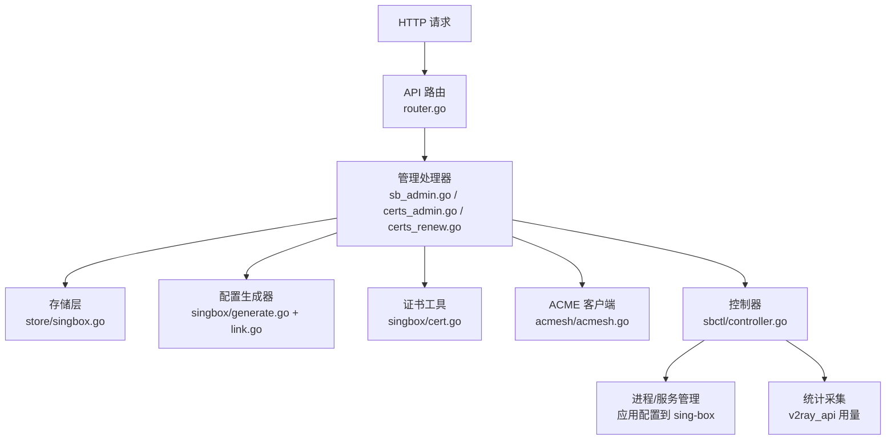
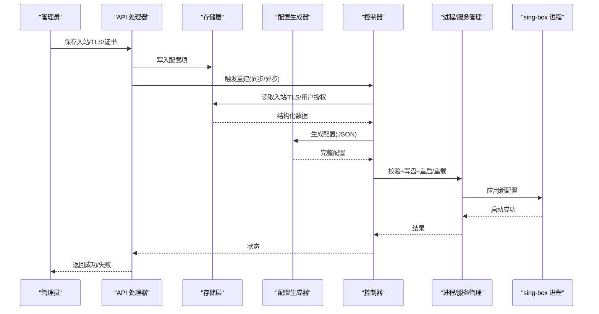
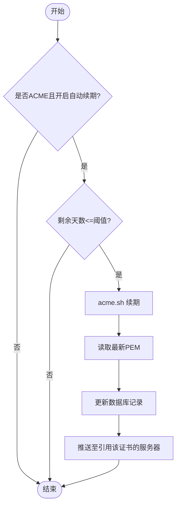
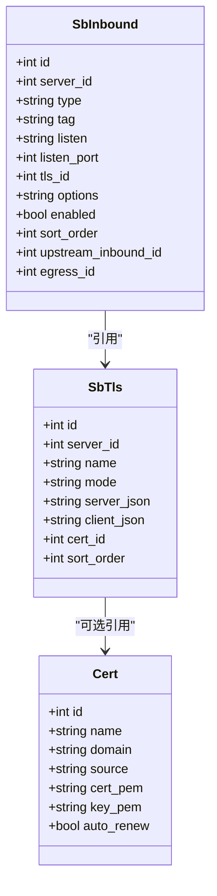
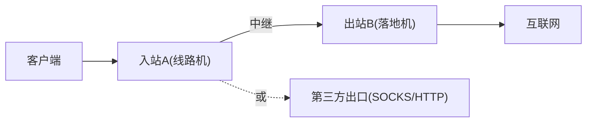
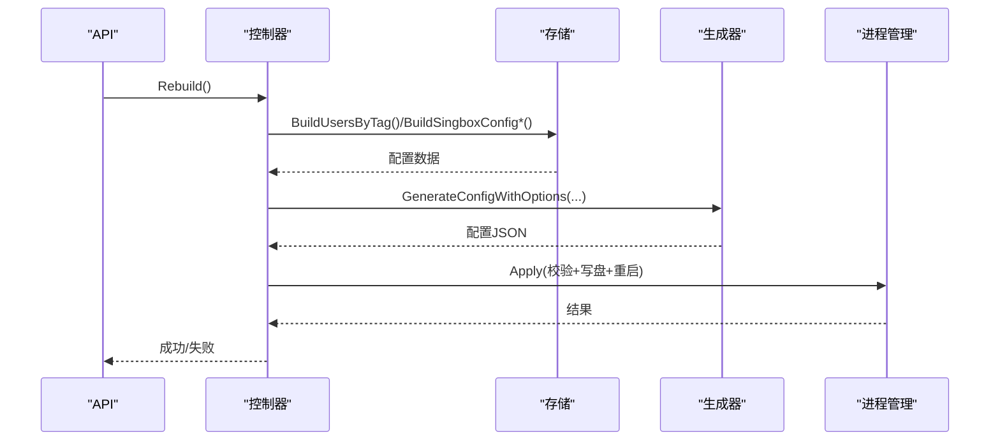
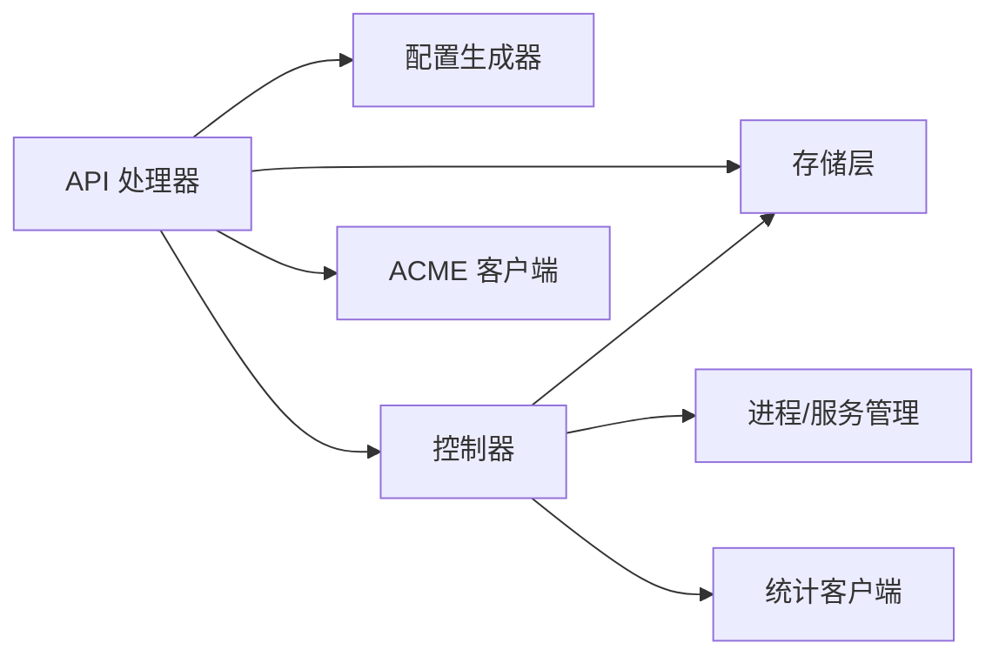

# Sing-box管理API

<cite>
**本文引用的文件**
- [main.go](file://main.go)
- [router.go](file://internal/api/router.go)
- [sb_admin.go](file://internal/api/sb_admin.go)
- [certs_admin.go](file://internal/api/certs_admin.go)
- [certs_renew.go](file://internal/api/certs_renew.go)
- [generate.go](file://internal/singbox/generate.go)
- [link.go](file://internal/singbox/link.go)
- [cert.go](file://internal/singbox/cert.go)
- [controller.go](file://internal/sbctl/controller.go)
- [singbox.go](file://internal/store/singbox.go)
- [acmesh.go](file://internal/acmesh/acmesh.go)
</cite>

## 目录
1. [简介](#简介)
2. [项目结构](#项目结构)
3. [核心组件](#核心组件)
4. [架构总览](#架构总览)
5. [详细组件分析](#详细组件分析)
6. [依赖关系分析](#依赖关系分析)
7. [性能与可靠性](#性能与可靠性)
8. [故障排查指南](#故障排查指南)
9. [结论](#结论)
10. [附录：接口参考与示例](#附录接口参考与示例)

## 简介
本文件面向管理员，提供轻舟面板对 Sing-box 的完整管理 API 文档。内容覆盖：
- 证书管理（自签、ACME 申请/续期、粘贴证书）
- 入站/出站配置（协议、TLS/Reality、传输层、端口冲突检测）
- 代理链路管理（落地机/中继/第三方出口）
- 配置文件生成与应用机制（本地与远程节点下发、校验、重载）
- 配置预览与验证（check、端口占用检查、SNI 连通性测试）
- TLS 证书自动申请与续期流程
- 完整的接口清单与使用示例

## 项目结构
Sing-box 管理能力由以下模块协作完成：
- API 路由与处理器：定义并实现所有管理端点
- 配置生成器：将数据库中的入站/TLS/用户等数据组装为 sing-box 配置
- 控制器：周期性地收集用量、重建并下发配置到本地或远程节点
- 证书中心：集中管理 ACME/自签/粘贴证书，支持自动续期
- 存储层：持久化入站、TLS、证书、服务器等信息

图表来源
- [router.go:132-386](file://internal/api/router.go#L132-L386)
- [sb_admin.go:33-790](file://internal/api/sb_admin.go#L33-L790)
- [certs_admin.go:70-329](file://internal/api/certs_admin.go#L70-L329)
- [certs_renew.go:19-123](file://internal/api/certs_renew.go#L19-L123)
- [generate.go:137-295](file://internal/singbox/generate.go#L137-L295)
- [controller.go:353-455](file://internal/sbctl/controller.go#L353-L455)

章节来源
- [router.go:132-386](file://internal/api/router.go#L132-L386)
- [main.go:85-207](file://main.go#L85-L207)

## 核心组件
- 控制器（Controller）：负责“构建配置 → 校验 → 应用”的闭环，支持本地与远程节点并发下发，周期性收集用量并触发重建。
- 配置生成器（GenerateConfigWithOptions）：从基础模板、入站列表、用户授权映射、中继/出口规则拼装最终配置，注入 v2ray_api 统计块，并清理旧字段以保证新版 sing-box 兼容。
- 证书中心（Certs）：统一存储证书元数据与 PEM，支持 ACME/DNS-01、Webroot、HTTP-01、自签、粘贴；后台定时续期并推送变更。
- 存储层（Store）：维护 sb_inbounds、sb_tls、certificates 等表，提供构建配置所需的数据聚合与一致性约束（如端口冲突、引用保护）。
- 链接渲染（LinkParams.BuildShareLink）：根据入站参数生成各协议的分享链接（vless/tuic/hysteria2/vmess/shadowsocks/anytls），携带 TLS、Reality、传输、拥塞控制、NoUDP 等能力。

章节来源
- [controller.go:353-455](file://internal/sbctl/controller.go#L353-L455)
- [generate.go:137-295](file://internal/singbox/generate.go#L137-L295)
- [certs_admin.go:70-329](file://internal/api/certs_admin.go#L70-L329)
- [singbox.go:562-679](file://internal/store/singbox.go#L562-L679)
- [link.go:206-418](file://internal/singbox/link.go#L206-L418)

## 架构总览
Sing-box 管理的端到端流程如下：

图表来源
- [router.go:254-300](file://internal/api/router.go#L254-L300)
- [sb_admin.go:415-473](file://internal/api/sb_admin.go#L415-L473)
- [controller.go:353-455](file://internal/sbctl/controller.go#L353-L455)
- [generate.go:137-295](file://internal/singbox/generate.go#L137-L295)

## 详细组件分析

### 证书管理
- 自签证书：支持按域名/IP 生成 ECDSA P-256 自签证书，设置 SAN，有效期上限限制。
- ACME 申请：通过 acme.sh 在面板主机执行 DNS-01/Webroot/HTTP-01 挑战，安装到稳定路径，并将 PEM 存入数据库；可配置 reload 命令以便系统级服务自动重载。
- 粘贴证书：校验证书与私钥匹配后入库，支持导出原始 PEM。
- 自动续期：后台定时扫描即将过期的 ACME 证书，调用续期接口刷新 PEM 并仅向引用该证书的服务器触发重建。

图表来源
- [certs_renew.go:19-123](file://internal/api/certs_renew.go#L19-L123)
- [acmesh.go:189-240](file://internal/acmesh/acmesh.go#L189-L240)
- [certs_admin.go:90-161](file://internal/api/certs_admin.go#L90-L161)

章节来源
- [sb_admin.go:46-221](file://internal/api/sb_admin.go#L46-L221)
- [certs_admin.go:70-329](file://internal/api/certs_admin.go#L70-L329)
- [certs_renew.go:19-123](file://internal/api/certs_renew.go#L19-L123)
- [acmesh.go:189-240](file://internal/acmesh/acmesh.go#L189-L240)
- [cert.go:19-140](file://internal/singbox/cert.go#L19-L140)

### 入站与出站配置
- 入站类型：vless、vmess、trojan、tuic、hysteria2、shadowsocks、anytls、mixed 等，支持 TCP/UDP 协议组合与端口冲突检测。
- TLS/Reality：支持内联 PEM、文件路径、引用证书中心；Reality 支持短 ID、握手目标、utls 指纹。
- 传输层：ws/httpupgrade/grpc 等，支持 early data、host/path/serviceName。
- 出站/出口：支持第三方 SOCKS/HTTP 代理作为 egress，并可拒绝 UDP 或劫持 DNS。
- 中继/落地：可将某入站流量转发到另一台落地机的入站，形成“客户端→线路机→落地机→互联网”的链路。

图表来源
- [singbox.go:15-73](file://internal/store/singbox.go#L15-L73)
- [singbox.go:184-239](file://internal/store/singbox.go#L184-L239)

章节来源
- [sb_admin.go:346-790](file://internal/api/sb_admin.go#L346-L790)
- [singbox.go:442-527](file://internal/store/singbox.go#L442-L527)
- [generate.go:137-295](file://internal/singbox/generate.go#L137-L295)

### 代理链路管理
- 链路形态：直出、中继（upstream_inbound_id）、第三方出口（egress_id）三者组合。
- 链路拓扑：删除落地入站会标记上游入站的“链路断裂”，避免静默降级为直出。
- 出口解析：支持多种供应商格式的一键解析（URL/裸串），自动推断协议与认证信息。

图表来源
- [singbox.go:52-73](file://internal/store/singbox.go#L52-L73)
- [singbox.go:353-420](file://internal/store/singbox.go#L353-L420)
- [egresslink.go:14-216](file://internal/api/egresslink.go#L14-L216)

章节来源
- [singbox.go:353-420](file://internal/store/singbox.go#L353-L420)
- [egresslink.go:14-216](file://internal/api/egresslink.go#L14-L216)

### 配置生成与应用
- 生成：基于基础模板、入站列表、用户授权映射、中继/出口规则生成完整 JSON；注入 v2ray_api 统计块；清理旧字段确保新版本兼容。
- 校验：使用 sing-box check 对临时文件进行语法校验，通过后写盘并重启/重载 systemd unit。
- 下发：本地直接应用；远程通过 SSH 并发下发，超时保护与重试策略。
- 周期：控制器周期收集用量并重建，保证配额超限用户及时下线。

图表来源
- [controller.go:353-455](file://internal/sbctl/controller.go#L353-L455)
- [generate.go:137-295](file://internal/singbox/generate.go#L137-L295)

章节来源
- [controller.go:353-455](file://internal/sbctl/controller.go#L353-L455)
- [generate.go:137-295](file://internal/singbox/generate.go#L137-L295)
- [main.go:171-207](file://main.go#L171-L207)

### 配置预览与验证
- 配置预览：GET /api/admin/sb/preview 返回即将下发的配置快照，便于核对。
- 配置校验：GET /api/admin/sb/check 调用 sing-box check 验证当前配置合法性。
- 端口检查：GET /api/admin/sb/port-check 检测端口占用与冲突。
- SNI 连通性：GET /api/admin/sb/sni-test 探测目标 SNI 的 TCP 握手时延与可达性。

章节来源
- [router.go:291-300](file://internal/api/router.go#L291-L300)
- [sb_admin.go:233-344](file://internal/api/sb_admin.go#L233-L344)

### 订阅与分享链接
- 分享链接：根据入站与 TLS/Reality/传输等参数生成 vless/tuic/hysteria2/vmess/shadowsocks/anytls 链接，携带拥塞控制、早数据、NoUDP 等能力。
- 订阅：面板不再依赖 sing-box 子服务器，直接基于自身数据生成订阅内容。

章节来源
- [link.go:12-117](file://internal/singbox/link.go#L12-L117)
- [link.go:206-418](file://internal/singbox/link.go#L206-L418)

## 依赖关系分析
- API 层依赖存储层获取入站/TLS/证书/服务器信息，依赖配置生成器产出 JSON，依赖控制器执行下发。
- 控制器依赖存储层、进程管理器、统计客户端，以及 SSH 远程管理器（多节点场景）。
- 证书中心依赖 acme.sh 外部工具，通过 Runner 抽象在本地或远端执行。
- 配置生成器依赖 store 提供的入站与 TLS 解析逻辑，确保引用完整性与安全默认（阻止私有网段出站）。

图表来源
- [router.go:21-52](file://internal/api/router.go#L21-L52)
- [controller.go:36-115](file://internal/sbctl/controller.go#L36-L115)
- [acmesh.go:27-77](file://internal/acmesh/acmesh.go#L27-L77)

章节来源
- [router.go:21-52](file://internal/api/router.go#L21-L52)
- [controller.go:36-115](file://internal/sbctl/controller.go#L36-L115)

## 性能与可靠性
- 并发下发：远程节点配置下发并发执行，单节点超时保护，避免不可达节点阻塞整体重建。
- 幂等重建：控制器串行化 Rebuild，避免并发导致的不一致。
- 配置去重：若磁盘配置与待下发一致则跳过重启，减少不必要重载。
- 统计采集：周期轮询本地与远程节点的 v2ray_api，合并增量并批量落库，降低锁竞争。
- 安全默认：阻止代理流量访问私有地址，防止泄露到云元数据或内网。

章节来源
- [controller.go:353-455](file://internal/sbctl/controller.go#L353-L455)
- [generate.go:407-468](file://internal/singbox/generate.go#L407-L468)

## 故障排查指南
- 证书无法解密：提示确认 QZ_SECRET_KEY 是否与加密时一致；否则相关 TLS 入站将被拒绝下发，避免降级为明文。
- ACME 申请失败：常见为 80 端口被占用，建议改用 DNS-01 或 Webroot；查看错误输出定位原因。
- 端口冲突：保存入站时会检测同服务器同端口且协议重叠的冲突，需调整监听地址或协议。
- 链路断裂：删除落地入站会标记上游入站“链路断裂”，需重新指定落地或出口，或确认接受直出。
- 远程节点无统计：若节点未编译 v2ray_api 插件，将无法计量流量；升级节点或调整配置以启用。

章节来源
- [sb_admin.go:69-71](file://internal/api/sb_admin.go#L69-L71)
- [certs_admin.go:268-277](file://internal/api/certs_admin.go#L268-L277)
- [acmesh.go:223-228](file://internal/acmesh/acmesh.go#L223-L228)
- [singbox.go:501-527](file://internal/store/singbox.go#L501-L527)
- [controller.go:303-343](file://internal/sbctl/controller.go#L303-L343)

## 结论
本系统提供了完整的 Sing-box 管理能力：从证书全生命周期、入站/出站与链路编排，到配置生成、校验、下发与周期重建，再到自动续期与可视化预览/验证。通过严格的默认安全策略与完善的错误提示，帮助管理员高效、安全地运维多节点代理网络。

## 附录：接口参考与示例

### 路由总览（与管理相关）
- 健康与公开：/api/health, /api/config, /api/auth/verify, /sub/{token}
- 认证：/api/auth/login, /api/auth/register, /api/auth/forgot, /api/auth/reset
- 监控：/api/monitor/report, /api/monitor/public*, /api/monitor/agent/*
- 管理员（部分与 Sing-box 相关）：
  - 证书中心：/api/admin/certs*, /api/admin/certs/{id}/renew, /api/admin/certs/{id}/export
  - Sing-box TLS/Reality：/api/admin/sb/reality-keypair, /api/admin/sb/sni-test, /api/admin/sb/tls*
  - 入站/出站：/api/admin/sb/inbounds*, /api/admin/sb/egresses*, /api/admin/sb/egresses/parse
  - 预览/校验/端口检查：/api/admin/sb/preview, /api/admin/sb/check, /api/admin/sb/port-check
  - 同步/重发：/api/admin/sb/sync-status, /api/admin/sb/resync

章节来源
- [router.go:149-386](file://internal/api/router.go#L149-L386)

### 证书管理接口
- POST /api/admin/certs/acme：在面板主机申请 ACME 证书（DNS-01/Webroot/HTTP-01），保存到数据库并开启自动续期。
- POST /api/admin/certs/paste：粘贴已签发证书与私钥，自动提取域名。
- POST /api/admin/certs/self-signed：生成自签证书并入库。
- PUT /api/admin/certs/{id}：编辑名称与自动续期开关。
- POST /api/admin/certs/{id}/renew：手动立即续期（仅 ACME）。
- GET /api/admin/certs/{id}/export：导出 PEM 用于下载或手工部署。
- DELETE /api/admin/certs/{id}：删除未被引用的证书。

章节来源
- [certs_admin.go:90-329](file://internal/api/certs_admin.go#L90-L329)

### TLS/Reality 接口
- POST /api/admin/sb/reality-keypair：生成 Reality 私钥/公钥与 short_id。
- POST /api/admin/sb/tls/self-signed：生成自签证书（PEM）。
- POST /api/admin/sb/tls/quick-selfsigned：一键生成自签并保存为可用 TLS 条目。
- POST /api/admin/sb/tls/acme：在线申请真实证书并保存为 TLS 条目（仅本机）。
- POST /api/admin/sb/tls/cert：保存常规 TLS 条目（内联 PEM 或引用证书中心）。
- PUT /api/admin/sb/tls/reality/{id}：编辑 Reality 条目的 SNI/握手目标/short_ids 等。
- GET /api/admin/sb/tls：列出所有 TLS 条目（含有效期信息）。
- PUT /api/admin/sb/tls/{id}：更新 TLS 条目。
- DELETE /api/admin/sb/tls/{id}：删除未被引用的 TLS 条目。
- GET /api/admin/sb/sni-test：测试 SNI 连通性与延迟。

章节来源
- [sb_admin.go:33-221](file://internal/api/sb_admin.go#L33-L221)
- [sb_admin.go:346-790](file://internal/api/sb_admin.go#L346-L790)

### 入站/出站接口
- GET /api/admin/sb/inbounds：列出入站。
- POST /api/admin/sb/inbounds：新增入站。
- PUT /api/admin/sb/inbounds/{id}：更新入站。
- DELETE /api/admin/sb/inbounds/{id}：删除入站（级联清理关联节点与链路）。
- POST /api/admin/sb/inbounds/reorder：调整显示顺序。
- POST /api/admin/sb/inbounds/{id}/ack-upstream：确认并接受链路降级为直出。
- GET /api/admin/sb/egresses：列出出口。
- POST /api/admin/sb/egresses：新增出口。
- POST /api/admin/sb/egresses/parse：解析供应商链接/凭据。
- PUT /api/admin/sb/egresses/{id}：更新出口。
- DELETE /api/admin/sb/egresses/{id}：删除出口。
- POST /api/admin/sb/egresses/{id}/test：测试出口连通性。
- POST /api/admin/sb/egresses/{id}/clone：克隆出口配置。

章节来源
- [router.go:280-298](file://internal/api/router.go#L280-L298)
- [sb_admin.go:791-800](file://internal/api/sb_admin.go#L791-L800)
- [egresslink.go:14-216](file://internal/api/egresslink.go#L14-L216)

### 配置预览与验证
- GET /api/admin/sb/preview：获取即将下发的完整配置快照。
- GET /api/admin/sb/check：运行 sing-box check 验证配置合法性。
- GET /api/admin/sb/port-check：检测端口占用与冲突。

章节来源
- [router.go:291-300](file://internal/api/router.go#L291-L300)

### 同步与重发
- GET /api/admin/sb/sync-status：查询各节点最近一次同步状态。
- POST /api/admin/sb/resync：对上次同步失败的机器重新排队下发（不阻塞响应）。

章节来源
- [router.go:288-290](file://internal/api/router.go#L288-L290)

### 自动续期流程
- 后台任务：StartCertRenew 定时扫描到期临近的 ACME 证书，调用 acmesh.Renew 续期，读取最新 PEM 回写数据库，并向引用该证书的服务器触发重建。
- 手动续期：POST /api/admin/certs/{id}/renew。

章节来源
- [certs_renew.go:19-123](file://internal/api/certs_renew.go#L19-L123)
- [acmesh.go:258-283](file://internal/acmesh/acmesh.go#L258-L283)

### 配置生成与应用机制（内部流程）
- 生成：BuildSingboxConfig/BuildSingboxConfigForServer 聚合入站/TLS/用户/中继/出口，调用 singbox.GenerateConfigWithOptions 生成 JSON。
- 校验：控制器在本地先写临时文件并执行 sing-box check，通过后写盘并 systemctl restart 单元。
- 下发：本地直接应用；远程通过 SSH 并发下发，带超时与重试跟踪。

章节来源
- [singbox.go:562-679](file://internal/store/singbox.go#L562-L679)
- [controller.go:204-280](file://internal/sbctl/controller.go#L204-L280)
- [controller.go:353-455](file://internal/sbctl/controller.go#L353-L455)

### 完整管理示例（步骤）
- 创建 TLS 条目：
  - 自签：POST /api/admin/sb/tls/self-signed，拿到 PEM 后保存为 TLS 条目。
  - ACME：POST /api/admin/sb/tls/acme，选择方法并填写必要参数，成功后保存为 TLS 条目。
  - 引用证书中心：POST /api/admin/sb/tls/cert，选择 cert_id，系统将注入 PEM 并固定 SNI。
- 创建入站：
  - 选择协议与端口，绑定 TLS 条目，按需配置传输层（ws/grpc/httpupgrade）。
  - 如需中继：设置 upstream_inbound_id；如需第三方出口：设置 egress_id。
- 预览与校验：
  - GET /api/admin/sb/preview 查看配置；GET /api/admin/sb/check 校验；GET /api/admin/sb/port-check 检查端口。
- 下发与观察：
  - 保存后自动触发重建；通过 /api/admin/sb/sync-status 查看各节点状态。
- 自动续期：
  - 为 ACME 证书开启自动续期；后台会在到期前续期并推送至节点。

章节来源
- [sb_admin.go:46-221](file://internal/api/sb_admin.go#L46-L221)
- [certs_admin.go:90-329](file://internal/api/certs_admin.go#L90-L329)
- [router.go:254-300](file://internal/api/router.go#L254-L300)
- [controller.go:353-455](file://internal/sbctl/controller.go#L353-L455)
