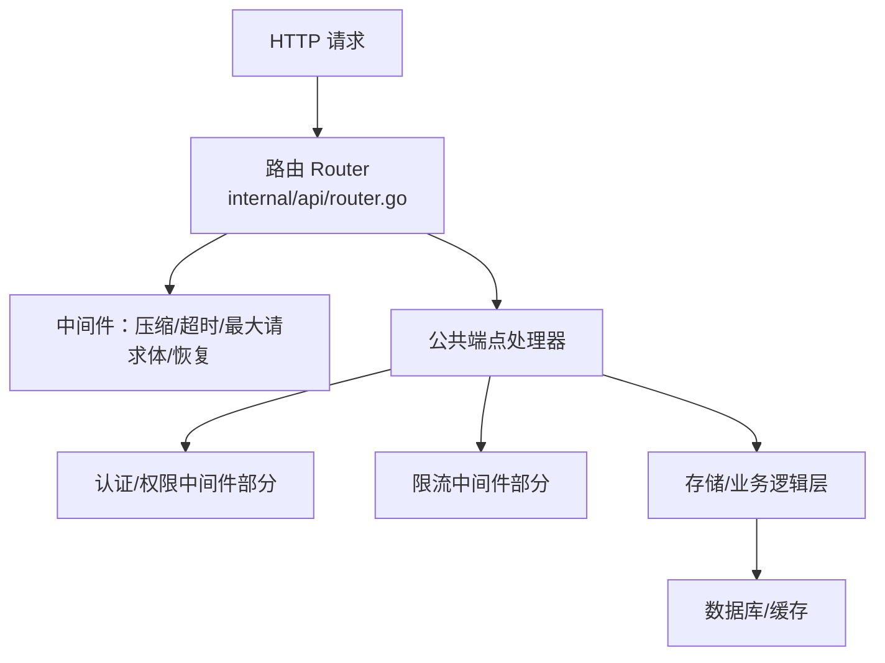
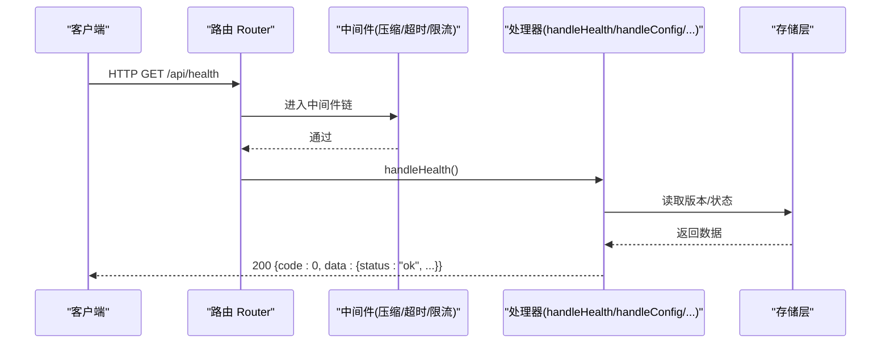
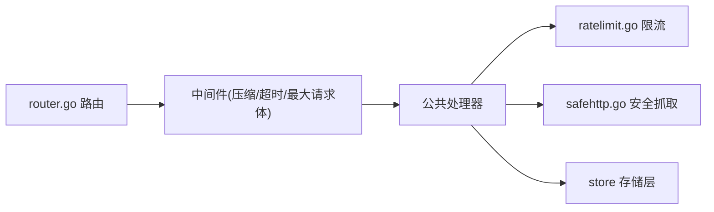

# 公共API接口

<cite>
**本文引用的文件**
- [router.go](file://internal/api/router.go)
- [auth.go](file://internal/api/auth.go)
- [subinfo.go](file://internal/api/subinfo.go)
- [user.go](file://internal/api/user.go)
- [monitor.go](file://internal/api/monitor.go)
- [ratelimit.go](file://internal/api/ratelimit.go)
- [safehttp.go](file://internal/api/safehttp.go)
- [respond.go](file://internal/api/respond.go)
- [helpers.go](file://internal/api/helpers.go)
- [version.go](file://internal/version/version.go)
</cite>

## 目录
1. [简介](#简介)
2. [项目结构](#项目结构)
3. [核心组件](#核心组件)
4. [架构总览](#架构总览)
5. [详细接口说明](#详细接口说明)
6. [依赖关系分析](#依赖关系分析)
7. [性能与速率限制](#性能与速率限制)
8. [安全与防护措施](#安全与防护措施)
9. [客户端集成示例与最佳实践](#客户端集成示例与最佳实践)
10. [故障排查指南](#故障排查指南)
11. [结论](#结论)

## 简介
本章节面向第三方开发者与前端工程师，提供无需认证的公开API参考。涵盖健康检查、站点配置获取、订阅链接（含信息页）、监控数据公开等能力。所有接口遵循统一的响应格式，便于快速集成。

## 项目结构
后端采用基于路由的HTTP服务，公共端点集中在路由器中注册，并通过中间件统一处理请求体大小、压缩、超时、恢复等横切关注点。认证、限流、安全抓取等能力由独立模块提供。

图表来源
- [router.go:132-175](file://internal/api/router.go#L132-L175)

章节来源
- [router.go:132-175](file://internal/api/router.go#L132-L175)

## 核心组件
- 路由与分组：集中定义公共、认证、管理员三类路由组，并挂载对应处理器。
- 响应封装：统一成功/失败响应信封，简化客户端解析。
- 限流器：按IP或用户维度的固定窗口限流，防止暴力破解与滥用。
- 安全抓取：对外发起HTTP请求时拒绝内网地址，防SSRF。
- 版本信息：暴露当前构建版本用于健康检查与升级判断。

章节来源
- [router.go:132-175](file://internal/api/router.go#L132-L175)
- [respond.go:11-25](file://internal/api/respond.go#L11-L25)
- [ratelimit.go:9-65](file://internal/api/ratelimit.go#L9-L65)
- [safehttp.go:12-85](file://internal/api/safehttp.go#L12-L85)
- [version.go:18-22](file://internal/version/version.go#L18-L22)

## 架构总览
下图展示从浏览器到处理器再到存储的调用路径，突出公共端点的无鉴权特性与关键中间件的作用。

图表来源
- [router.go:132-175](file://internal/api/router.go#L132-L175)
- [auth.go:67-69](file://internal/api/auth.go#L67-L69)
- [respond.go:11-25](file://internal/api/respond.go#L11-L25)

## 详细接口说明

### 通用约定
- 基础URL：请替换为实际部署域名，例如 https://your-domain.com
- 统一响应信封
  - 成功：{ code: 0, msg: "", data: <任意> }
  - 错误：{ code: <HTTP状态码>, msg: "<人类可读消息>", data: null }
- 内容类型：JSON 接口默认 application/json；订阅接口根据格式返回不同MIME。
- 缓存控制：订阅与信息页使用 no-store，避免CDN缓存导致旧令牌继续生效。

章节来源
- [respond.go:11-25](file://internal/api/respond.go#L11-L25)
- [user.go:853-866](file://internal/api/user.go#L853-L866)
- [subinfo.go:237-251](file://internal/api/subinfo.go#L237-L251)

### 健康检查
- 方法：GET
- 路径：/api/health
- 认证：不需要
- 查询参数：无
- 响应字段
  - status: 字符串，固定为 ok
  - time: 整数，服务器时间戳（秒）
  - version: 字符串，当前构建版本
- 状态码
  - 200：正常
- 示例
  - 请求：GET /api/health
  - 响应：{ "code": 0, "data": { "status": "ok", "time": 1710000000, "version": "v0.2.1" }, "msg": "" }

章节来源
- [auth.go:67-69](file://internal/api/auth.go#L67-L69)
- [version.go:18-22](file://internal/version/version.go#L18-L22)

### 站点配置
- 方法：GET
- 路径：/api/config
- 认证：不需要
- 查询参数：无
- 响应字段
  - register_mode: 字符串，open/code/closed
  - registration_open: 布尔，是否开放注册
  - email_verify_required: 布尔，是否要求邮箱验证
  - points_per_cny: 整数，每元积分
  - site_name: 字符串，站点名称
  - site_description: 字符串，站点描述
  - homepage_mode: 字符串，首页模式
  - homepage_url: 字符串，首页跳转地址
  - app_version: 字符串，应用版本
- 状态码
  - 200：成功
- 示例
  - 请求：GET /api/config
  - 响应：{ "code": 0, "data": { "register_mode": "open", "registration_open": true, "email_verify_required": false, "points_per_cny": 10, "site_name": "轻舟", "site_description": "...", "homepage_mode": "monitor", "homepage_url": "/monitor", "app_version": "v0.2.1" }, "msg": "" }

章节来源
- [auth.go:84-110](file://internal/api/auth.go#L84-L110)

### 订阅链接（节点配置下载）
- 方法：GET
- 路径：/sub/{token}
- 认证：不需要（基于订阅令牌）
- 路径参数
  - token: 字符串，用户的订阅令牌
- 查询参数
  - format: 可选，指定输出格式。支持 clash、singbox、surge、base64、info。未指定时根据 User-Agent 自动选择。
- 行为
  - 当 format=info 或浏览器访问时，返回订阅信息HTML页面，包含用量、到期时间、可用节点数等。
  - 否则返回对应格式的配置文件（如 YAML/JSON/conf/txt）。
  - 若账号被封禁，返回 403；过期或未达流量阈值将返回空节点列表但保持合法配置。
- 响应头
  - Cache-Control: no-store
  - Subscription-Userinfo: upload=<已上传>; download=<已下载>; total=<总量>; expire=<到期时间>
  - Profile-Update-Interval: 12（分钟）
  - Content-Disposition: attachment; filename="subscription.<ext>"（含UTF-8扩展名）
  - Content-Type: 随格式变化（如 application/yaml、application/json 等）
- 状态码
  - 200：成功
  - 403：账号被封禁
  - 404：令牌不存在
  - 502：渲染失败
- 示例
  - 请求：GET /sub/abc123?format=singbox
  - 响应：二进制配置文件（JSON），头部包含上述安全与提示头

章节来源
- [user.go:777-867](file://internal/api/user.go#L777-L867)
- [subinfo.go:14-49](file://internal/api/subinfo.go#L14-L49)
- [subinfo.go:237-251](file://internal/api/subinfo.go#L237-L251)
- [subinfo.go:253-308](file://internal/api/subinfo.go#L253-L308)

### 订阅信息页（浏览器友好）
- 方法：GET
- 路径：/sub/{token}?format=info 或通过浏览器访问（自动检测）
- 认证：不需要
- 响应
  - 文本/html，显示站点名、订阅地址、已用/总量/剩余、到期时间、可用节点数、用量进度条、以及各格式快捷链接。
- 状态码
  - 200：成功
- 示例
  - 请求：GET /sub/abc123?format=info
  - 响应：HTML 页面

章节来源
- [subinfo.go:14-49](file://internal/api/subinfo.go#L14-L49)
- [subinfo.go:157-251](file://internal/api/subinfo.go#L157-L251)

### 探针上报（Agent 指标上报）
- 方法：POST
- 路径：/api/monitor/report
- 认证：需要 Bearer Token（探针令牌，非JWT）
- 请求头
  - Authorization: Bearer <probe_token>
- 请求体
  - JSON，包含服务器指标（CPU、内存、磁盘、网络等）
- 响应
  - { code: 0, data: { ok: true }, msg: "" }
- 状态码
  - 200：成功
  - 400：请求格式错误
  - 401：缺少认证 token
  - 403：无效 token 或探针未启用
  - 500：写入指标失败
- 示例
  - 请求：POST /api/monitor/report，Header: Authorization: Bearer xxx
  - 请求体：{ "cpu_percent": 12.3, "mem_used": 1024, "mem_total": 8192, ... }
  - 响应：{ "code": 0, "data": { "ok": true }, "msg": "" }

章节来源
- [monitor.go:20-55](file://internal/api/monitor.go#L20-L55)

### 探针安装脚本
- 方法：GET
- 路径：/api/monitor/install.sh
- 认证：不需要
- 响应
  - text/x-shellscript，一键安装探针并配置 systemd
- 状态码
  - 200：成功
- 用法
  - bash <(curl -sL https://your-domain.com/api/monitor/install.sh) <probe_token>

章节来源
- [monitor.go:75-179](file://internal/api/monitor.go#L75-L179)

### 公开监控仪表盘
- 方法：GET
- 路径：/api/monitor/public
- 认证：不需要
- 响应字段（摘要）
  - total_servers、online、offline、expiring_soon、alerts_unread
  - summary.total_cpu、summary.total_mem_used、summary.total_mem_total、summary.total_disk_used、summary.total_disk_total
- 状态码
  - 200：成功
- 示例
  - 请求：GET /api/monitor/public
  - 响应：{ "code": 0, "data": { "total_servers": 10, "online": 8, ... }, "msg": "" }

章节来源
- [monitor.go:781-800](file://internal/api/monitor.go#L781-L800)

### 公开迷你图（Sparklines）
- 方法：GET
- 路径：/api/monitor/public/sparklines
- 认证：不需要
- 查询参数
  - range: 1h（默认）、6h、24h
- 响应字段
  - servers: 数组，每项包含 name、cpu[]、net_up[]、net_down[]
  - range: 字符串
  - points: 点数（固定32）
- 状态码
  - 200：成功
- 示例
  - 请求：GET /api/monitor/public/sparklines?range=24h
  - 响应：{ "code": 0, "data": { "servers": [...], "range": "24h", "points": 32 }, "msg": "" }

章节来源
- [monitor.go:430-526](file://internal/api/monitor.go#L430-L526)

### 公开热力图
- 方法：GET
- 路径：/api/monitor/heatmap
- 认证：不需要
- 查询参数
  - range: 1h、6h、24h（默认）、7d
- 响应字段
  - servers: 仅名称（不含ID）
  - buckets: 时间桶起始时间戳数组
  - matrix: 二维矩阵，值含义 0=正常、1=高负载、2=离线/无数据
  - range: 字符串
  - bucket_sec: 每个桶的秒数
- 状态码
  - 200：成功
- 示例
  - 请求：GET /api/monitor/heatmap?range=24h
  - 响应：{ "code": 0, "data": { "servers": [...], "buckets": [...], "matrix": [[...]], "range": "24h", "bucket_sec": 1800 }, "msg": "" }

章节来源
- [monitor.go:375-428](file://internal/api/monitor.go#L375-L428)
- [monitor.go:541-647](file://internal/api/monitor.go#L541-L647)

## 依赖关系分析
- 路由注册：公共端点在路由初始化阶段注册，确保优先于SPA捕获规则。
- 中间件链：请求先经过压缩、超时、最大请求体限制、恢复等中间件，再进入具体处理器。
- 限流：登录、注册、忘记密码、重置密码等认证相关POST端点受IP级限流保护；探针上报也有限流。
- 安全抓取：任何服务端主动拉取外部资源的请求均通过安全客户端，禁止连接内网地址。

图表来源
- [router.go:132-175](file://internal/api/router.go#L132-L175)
- [ratelimit.go:53-65](file://internal/api/ratelimit.go#L53-L65)
- [safehttp.go:27-56](file://internal/api/safehttp.go#L27-L56)

章节来源
- [router.go:132-175](file://internal/api/router.go#L132-L175)
- [ratelimit.go:9-65](file://internal/api/ratelimit.go#L9-L65)
- [safehttp.go:12-85](file://internal/api/safehttp.go#L12-L85)

## 性能与速率限制
- 全局优化
  - 响应压缩：对JSON与静态资源启用gzip，降低带宽占用。
  - 请求体上限：限制最大请求体大小，防止恶意大Payload造成内存压力。
  - 超时保护：统一请求超时，避免长连接拖垮资源。
- 速率限制策略
  - 认证相关POST：每IP每分钟最多20次，防止暴力破解与邮件轰炸。
  - 验证码重发：每用户每10分钟最多3次。
  - 探针上报：每IP每分钟最多60次。
  - 订阅地址切换：每用户每10分钟最多5次，防止频繁失效循环。
- 订阅缓存
  - 节点列表计算结果按用户缓存约30秒，减少重复计算与数据库压力。

章节来源
- [router.go:132-148](file://internal/api/router.go#L132-L148)
- [ratelimit.go:22-65](file://internal/api/ratelimit.go#L22-L65)
- [account.go:52-83](file://internal/api/account.go#L52-L83)
- [user.go:889-913](file://internal/api/user.go#L889-L913)

## 安全与防护措施
- 身份与令牌
  - 订阅令牌：通过 /sub/{token} 访问，令牌泄露即被他人使用；建议定期重置。
  - 探针令牌：通过 Authorization: Bearer 传递，仅用于探针上报。
- 速率限制
  - 针对认证与探针上报等高频接口实施严格限流。
- 请求体限制
  - 统一限制最大请求体大小，避免内存耗尽。
- SSRF防护
  - 服务端发起的外部HTTP请求拒绝连接内网地址（回环、私有、链路本地、CGNAT等），并在DNS解析后直连首个白名单IP，防止DNS重绑定。
- 安全响应头
  - 订阅与信息页设置 no-store，避免CDN缓存敏感内容。
  - 订阅下载设置 Content-Disposition 以规范文件名，避免泄露令牌。
  - 信息页设置 nosniff、DENY、no-referrer 等安全头。
- 可信代理
  - 仅在可信代理下信任 X-Forwarded-* 头，防止伪造源IP绕过限流。

章节来源
- [safehttp.go:12-85](file://internal/api/safehttp.go#L12-L85)
- [ratelimit.go:53-65](file://internal/api/ratelimit.go#L53-L65)
- [subinfo.go:237-251](file://internal/api/subinfo.go#L237-L251)
- [helpers.go:67-102](file://internal/api/helpers.go#L67-L102)

## 客户端集成示例与最佳实践

### 健康检查
- 目的：探测服务可用性、获取版本信息。
- 步骤
  - 定时 GET /api/health
  - 解析响应中的 status 与 version
- 注意
  - 若连续多次失败，触发告警或降级策略。

章节来源
- [auth.go:67-69](file://internal/api/auth.go#L67-L69)

### 站点配置
- 目的：在登录前获取站点行为与展示信息。
- 步骤
  - GET /api/config
  - 根据 register_mode 决定是否显示注册入口
  - 根据 homepage_mode/homepage_url 决定首页跳转
- 注意
  - 缓存该配置一段时间以减少请求频率。

章节来源
- [auth.go:84-110](file://internal/api/auth.go#L84-L110)

### 订阅链接
- 目的：获取客户端可用的节点配置。
- 步骤
  - 构造 URL：https://your-domain.com/sub/{token}
  - 如需指定格式，添加 ?format=singbox|clash|surge|base64
  - 浏览器访问可得到信息页，便于用户查看用量与到期时间
- 注意事项
  - 不要缓存订阅内容（no-store）
  - 尊重 Subscription-Userinfo 与 Profile-Update-Interval 头
  - 令牌泄露应立即重置

章节来源
- [user.go:777-867](file://internal/api/user.go#L777-L867)
- [subinfo.go:14-49](file://internal/api/subinfo.go#L14-L49)

### 公开监控
- 目的：展示服务器在线情况与资源使用趋势。
- 步骤
  - GET /api/monitor/public 获取概览
  - GET /api/monitor/public/sparklines?range=24h 获取迷你图
  - GET /api/monitor/heatmap?range=24h 获取热力图
- 注意
  - 公开接口不包含敏感标识（如服务器ID）

章节来源
- [monitor.go:781-800](file://internal/api/monitor.go#L781-L800)
- [monitor.go:430-526](file://internal/api/monitor.go#L430-L526)
- [monitor.go:375-428](file://internal/api/monitor.go#L375-L428)

### 最佳实践
- 重试与退避：对失败请求采用指数退避重试，避免雪崩。
- 超时与取消：为HTTP请求设置合理超时，并在页面卸载时取消未完成请求。
- 安全传输：始终使用HTTPS，避免明文传输令牌。
- 最小权限：仅请求必要的数据，减少暴露面。
- 缓存策略：对只读且稳定的数据（如配置）进行短期缓存。

[本节为通用指导，不直接分析具体文件]

## 故障排查指南
- 401 未登录/令牌无效
  - 检查订阅令牌是否正确
  - 检查探针令牌是否有效
- 403 禁止访问
  - 账号被封禁时将无法获取订阅
- 404 未找到
  - 订阅令牌不存在或被删除
- 429 请求过于频繁
  - 触发限流，等待一段时间后重试
- 500/502 服务器错误
  - 可能是渲染失败或写入指标失败，稍后重试或联系运维

章节来源
- [ratelimit.go:53-65](file://internal/api/ratelimit.go#L53-L65)
- [monitor.go:20-55](file://internal/api/monitor.go#L20-L55)
- [user.go:777-867](file://internal/api/user.go#L777-L867)

## 结论
本公共API提供了健康检查、站点配置、订阅链接与公开监控等核心能力，具备完善的限流与安全机制。开发者可据此快速集成前端与第三方工具，实现稳定、安全的接入体验。建议在集成过程中遵循最佳实践，合理使用缓存与重试策略，保障用户体验与服务稳定性。
