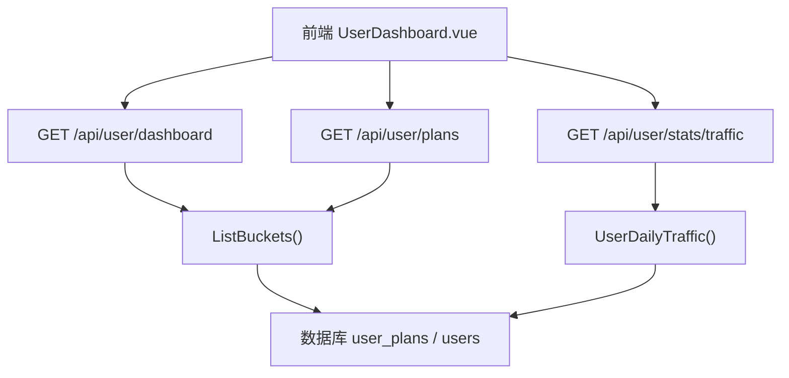
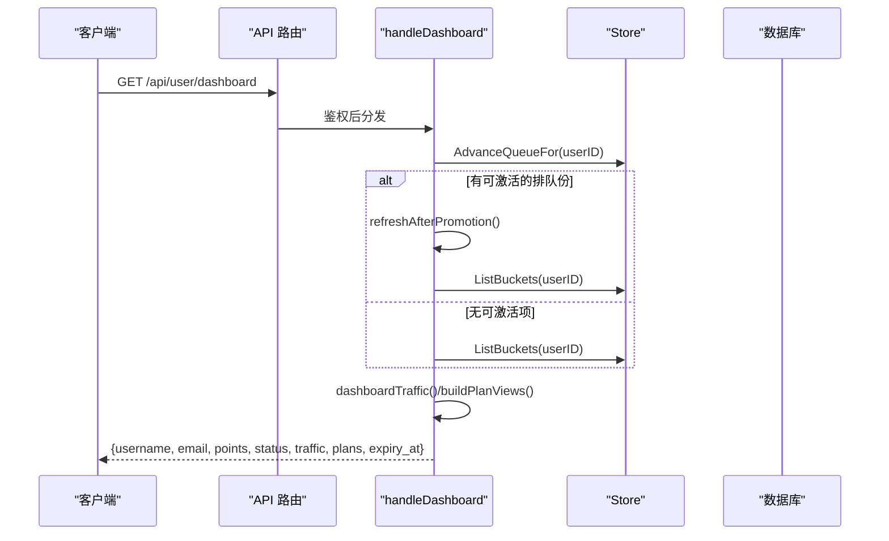
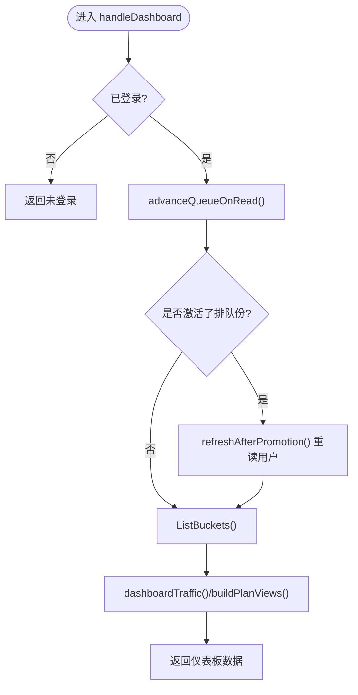
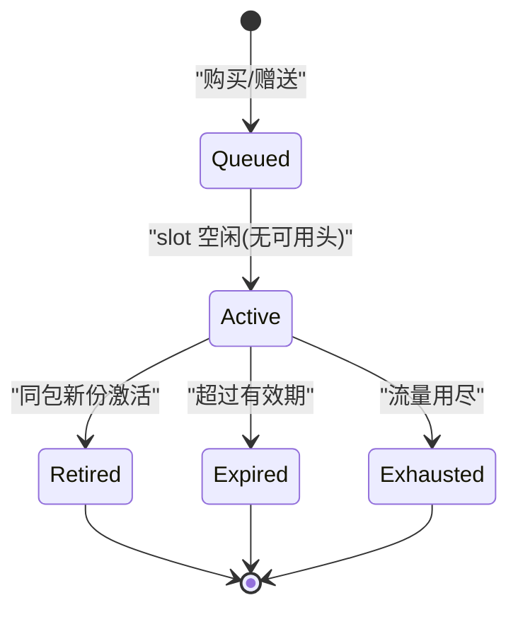
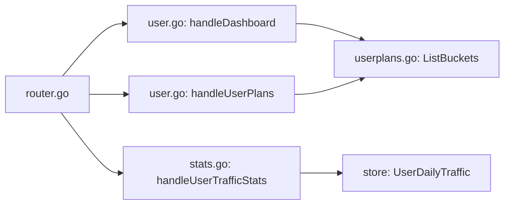

# 用户仪表板接口

<cite>
**本文引用的文件**
- [router.go](file://internal/api/router.go)
- [user.go](file://internal/api/user.go)
- [stats.go](file://internal/api/stats.go)
- [usage.go](file://internal/api/usage.go)
- [users.go](file://internal/store/users.go)
- [userplans.go](file://internal/store/userplans.go)
- [dashboard_test.go](file://internal/api/dashboard_test.go)
- [UserDashboard.vue](file://frontend/src/views/UserDashboard.vue)
</cite>

## 目录
1. [简介](#简介)
2. [项目结构](#项目结构)
3. [核心组件](#核心组件)
4. [架构总览](#架构总览)
5. [详细组件分析](#详细组件分析)
6. [依赖关系分析](#依赖关系分析)
7. [性能考量](#性能考量)
8. [故障排查指南](#故障排查指南)
9. [结论](#结论)
10. [附录：数据结构与示例](#附录：数据结构与示例)

## 简介
本文件面向开发者，系统化梳理“用户仪表板”相关后端接口、数据模型与业务逻辑，覆盖：
- 用户信息获取、套餐状态查询、流量使用情况统计
- 套餐队列机制、流量池管理、设备限制等
- 套餐激活队列的处理逻辑与状态转换规则
- 异常场景（套餐到期、流量用尽）的响应与前端展示约定
- 完整的数据结构说明与调用流程

## 项目结构
与用户仪表板相关的代码主要分布在以下模块：
- API 路由与处理器：定义并实现用户端仪表板、订阅、用量等接口
- Store 层：封装用户、套餐、流量池、队列推进等持久化与聚合逻辑
- 前端视图：渲染仪表盘、环形进度、趋势图、告警提示等

图表来源
- [router.go:177-208](file://internal/api/router.go#L177-L208)
- [user.go:285-316](file://internal/api/user.go#L285-L316)
- [stats.go:79-89](file://internal/api/stats.go#L79-L89)
- [userplans.go:709-725](file://internal/store/userplans.go#L709-L725)

章节来源
- [router.go:177-208](file://internal/api/router.go#L177-L208)

## 核心组件
- 用户仪表板主入口：GET /api/user/dashboard
  - 返回用户基本信息、积分、状态、汇总流量（含不限额标识）、套餐列表、到期时间
- 套餐明细：GET /api/user/plans
  - 返回每个桶（plan/pool/free）的配额、已用、剩余、过期时间、状态（active/queued/expired/exhausted）
- 流量趋势：GET /api/user/stats/traffic?range=7d|30d
  - 返回近 N 天每日上下行流量，用于趋势图
- 订阅地址：GET /api/user/subscription
  - 返回订阅链接及格式（default/clash/singbox/base64），以及是否允许重置节点凭据
- 订阅地址更换：POST /api/user/reset-sub
  - 快速更换订阅地址（仅面板可用，不吊销已下发的节点链接）
- 节点凭据重置：POST /api/user/reset-node-creds
  - 旋转 sing-box 凭据，吊销旧链接；受冷却时间与开关控制

章节来源
- [router.go:177-208](file://internal/api/router.go#L177-L208)
- [user.go:285-316](file://internal/api/user.go#L285-L316)
- [user.go:460-492](file://internal/api/user.go#L460-L492)
- [user.go:318-355](file://internal/api/user.go#L318-L355)
- [user.go:387-412](file://internal/api/user.go#L387-L412)
- [stats.go:79-89](file://internal/api/stats.go#L79-L89)

## 架构总览
用户仪表板的请求在认证中间件后进入对应处理器，处理器读取当前用户、必要时推进套餐队列、拉取桶列表并计算汇总指标，最终返回 JSON。

图表来源
- [router.go:177-208](file://internal/api/router.go#L177-L208)
- [user.go:285-316](file://internal/api/user.go#L285-L316)
- [user.go:240-265](file://internal/api/user.go#L240-L265)
- [userplans.go:317-328](file://internal/store/userplans.go#L317-L328)

## 详细组件分析

### 用户仪表板主接口：GET /api/user/dashboard
- 功能要点
  - 校验登录态
  - 在读路径上推进套餐队列（若当前份已到期或用尽，且存在排队份则激活）
  - 拉取用户所有桶（plan/pool/free），计算汇总流量与套餐视图
  - 返回用户基本信息、积分、状态、汇总流量、套餐列表、到期时间
- 关键处理
  - 队列推进：AdvanceQueueFor → 可能改变用户有效期与流量上限，需刷新用户对象
  - 汇总流量：dashboardTraffic 将“有额度份”和“不限额份”分开统计，避免被不限额份污染比例
  - 套餐视图：buildPlanViews 按桶维度输出，包含状态（active/queued/expired/exhausted）与预计激活时间

图表来源
- [user.go:285-316](file://internal/api/user.go#L285-L316)
- [user.go:240-265](file://internal/api/user.go#L240-L265)
- [user.go:682-710](file://internal/api/user.go#L682-L710)
- [user.go:729-770](file://internal/api/user.go#L729-L770)

章节来源
- [user.go:285-316](file://internal/api/user.go#L285-L316)
- [user.go:240-265](file://internal/api/user.go#L240-L265)
- [user.go:682-710](file://internal/api/user.go#L682-L710)
- [user.go:729-770](file://internal/api/user.go#L729-L770)

### 套餐详情接口：GET /api/user/plans
- 功能要点
  - 返回用户所有桶（plan/pool/free）的详细信息，包括名称、配额、已用、剩余、过期时间、状态、订单号、持续天数、开始时间等
  - 对 plan 类型，支持计算预计激活时间（ActivateBy）
- 业务规则
  - free 桶不对外展示
  - 空 pool（无余额）不对外展示
  - 状态判定：queued/active/expired/exhausted

章节来源
- [user.go:543-555](file://internal/api/user.go#L543-L555)
- [user.go:557-590](file://internal/api/user.go#L557-L590)
- [user.go:597-643](file://internal/api/user.go#L597-L643)
- [user.go:729-770](file://internal/api/user.go#L729-L770)

### 流量趋势接口：GET /api/user/stats/traffic?range=7d|30d
- 功能要点
  - 返回近 N 天的每日上下行流量，填充连续日期序列，便于前端绘制折线图
- 使用方式
  - range=7d 或 30d，默认 7d
  - 返回数组，每项包含 date/up/down

章节来源
- [stats.go:79-89](file://internal/api/stats.go#L79-L89)
- [stats.go:20-38](file://internal/api/stats.go#L20-L38)

### 订阅与凭据管理
- GET /api/user/subscription
  - 返回订阅基础 URL 与各格式链接（default/clash/singbox/base64），以及是否允许重置节点凭据
- POST /api/user/reset-sub
  - 更换订阅地址（仅面板可用），立即生效，不影响已下发的节点链接
- POST /api/user/reset-node-creds
  - 旋转节点凭据，吊销旧链接；受冷却期（30 天）与开关控制；成功后告知新凭据生效延迟

章节来源
- [user.go:460-492](file://internal/api/user.go#L460-L492)
- [user.go:318-355](file://internal/api/user.go#L318-L355)
- [user.go:387-412](file://internal/api/user.go#L387-L412)

### 套餐队列机制与状态转换
- 队列推进时机
  - 读路径：每次读取仪表板或订阅时尝试推进（确保用户看到最新可用份）
  - 后台任务：定时扫描所有用户的排队份，批量推进
- 推进条件
  - 同一 package 下不存在“可用头”（active 且未过期且有配额）
  - 从 oldest queued 中提升一个为 active，并设置新的 expiry（duration_days 决定）
- 状态转换
  - queued → active：当 slot 空闲时
  - active → retired：当新的同包份激活时，原 active 标记为 retired
  - active → expired：超过有效期
  - active → exhausted：流量用尽
- 特殊桶
  - free：始终 active，不计入配额
  - pool：有余额才 active，空池视为记账身份

图表来源
- [userplans.go:141-153](file://internal/store/userplans.go#L141-L153)
- [userplans.go:154-226](file://internal/store/userplans.go#L154-L226)
- [userplans.go:228-302](file://internal/store/userplans.go#L228-L302)
- [userplans.go:317-328](file://internal/store/userplans.go#L317-L328)

章节来源
- [userplans.go:141-153](file://internal/store/userplans.go#L141-L153)
- [userplans.go:154-226](file://internal/store/userplans.go#L154-L226)
- [userplans.go:228-302](file://internal/store/userplans.go#L228-L302)
- [userplans.go:317-328](file://internal/store/userplans.go#L317-L328)

### 流量池管理与免费桶
- 流量池（pool）
  - 每个用户拥有一个通用流量池桶，用于充值/退款等场景
  - 空池（limit=0）不参与仪表板展示，也不被视为“不限额”
- 免费桶（free）
  - 独立计量身份，不计入用户配额，始终 active
  - 注册时创建，用于承载免费组流量，避免与付费池耦合

章节来源
- [userplans.go:394-434](file://internal/store/userplans.go#L394-L434)
- [userplans.go:479-554](file://internal/store/userplans.go#L479-L554)
- [userplans.go:556-572](file://internal/store/userplans.go#L556-L572)
- [user.go:682-710](file://internal/api/user.go#L682-L710)

### 设备限制
- 用户模型中包含 device_limit 字段，表示该用户允许同时在线的设备数
- 注册时可配置默认设备限制；具体限制策略由接入侧/节点侧执行，仪表板通过用户信息暴露

章节来源
- [users.go:22-51](file://internal/store/users.go#L22-L51)
- [user.go:98-107](file://internal/api/user.go#L98-L107)

## 依赖关系分析
- 路由层：统一注册用户端接口，位于认证中间件之后
- 处理器层：负责参数校验、权限检查、业务编排
- 存储层：提供用户、套餐、流量池、队列推进、用量统计等能力
- 前端层：消费仪表板、套餐、流量趋势等接口进行渲染

图表来源
- [router.go:177-208](file://internal/api/router.go#L177-L208)
- [user.go:285-316](file://internal/api/user.go#L285-L316)
- [user.go:543-555](file://internal/api/user.go#L543-L555)
- [stats.go:79-89](file://internal/api/stats.go#L79-L89)

章节来源
- [router.go:177-208](file://internal/api/router.go#L177-L208)

## 性能考量
- 读路径上的队列推进仅在确实有需要时打开写事务，常见情况为只读检查，开销低
- 批量推进采用“先查因，再分事务”的策略，避免阻塞其他写入
- 订阅链接缓存与异步重建：凭据变更后通过调度器异步推送配置，避免阻塞 HTTP 响应
- 流量趋势数据以日粒度聚合，前端通过 fillDays 补齐连续日期，减少断点

章节来源
- [user.go:240-265](file://internal/api/user.go#L240-L265)
- [userplans.go:228-302](file://internal/store/userplans.go#L228-L302)
- [stats.go:20-38](file://internal/api/stats.go#L20-L38)

## 故障排查指南
- 套餐已全部到期或用尽
  - 现象：仪表板显示“套餐已全部到期或用尽”，环形图显示“无额度”或“已用尽”
  - 原因：无 active 且未过期的 plan 桶；或所有 plan 桶均 exhausted
  - 处理：购买新套餐或等待排队份激活；检查队列推进是否成功
- 流量已用尽但仍有不限额份
  - 现象：仪表板显示“不限额”，不报“流量已用尽”
  - 原因：dashboardTraffic 将不限额份排除在比例之外，单独上报 unmetered_used
  - 参考测试用例验证行为
- 订阅地址泄露
  - 处理：调用 reset-sub 更换地址；如需吊销节点链接，调用 reset-node-creds（注意冷却期）
- 节点凭据重置频繁
  - 现象：返回“冷却中”错误
  - 处理：等待冷却期结束；管理员可通过管理员接口绕过冷却

章节来源
- [dashboard_test.go:10-38](file://internal/api/dashboard_test.go#L10-L38)
- [dashboard_test.go:40-60](file://internal/api/dashboard_test.go#L40-L60)
- [dashboard_test.go:62-84](file://internal/api/dashboard_test.go#L62-L84)
- [dashboard_test.go:86-133](file://internal/api/dashboard_test.go#L86-L133)
- [user.go:387-412](file://internal/api/user.go#L387-L412)

## 结论
用户仪表板围绕“桶”这一核心抽象，将套餐、流量池、免费额度统一建模，并通过队列机制保证多份并存时的正确激活顺序。仪表板在读取时主动推进队列，确保用户看到的总是“已生效”的状态。流量统计与趋势接口提供可视化支撑，配合前端的环形图与告警提示，形成完整的用户体验闭环。

## 附录：数据结构与示例

### 用户仪表板响应（简化）
- username：用户名
- email：邮箱（可为空）
- points：积分
- status：账户状态（如 active/banned）
- traffic：
  - used：已用流量（仅统计有额度份）
  - total：总额度（仅统计有额度份；0 表示无额度或不限量，需结合 unlimited 判断）
  - remaining：剩余流量（仅统计有额度份）
  - unlimited：是否存在不限额份
  - unmetered_used：不限额份的实际用量
- plans：套餐列表（见下方）
- expiry_at：账户级到期时间（综合各 plan 桶的最大值）

章节来源
- [user.go:285-316](file://internal/api/user.go#L285-L316)
- [user.go:682-710](file://internal/api/user.go#L682-L710)

### 套餐视图（planView）
- id：桶 ID
- kind：类型（plan/pool/free）
- package_id：套餐 ID（plan 类型）
- name：名称（动态取自当前套餐名快照或系统名称）
- traffic_limit：配额（0 表示不限额）
- used：已用流量
- remaining：剩余（-1 表示不限额）
- expiry_at：到期时间（0 表示永不过期）
- status：状态（active/queued/expired/exhausted）
- activate_by：排队份预计最晚激活时间（仅 queued）
- created_at：创建时间
- order_id：订单 ID（0 表示非订单来源）
- duration_days：持续时间（天）
- started_at：开始倒计时时间（推导值）

章节来源
- [user.go:557-590](file://internal/api/user.go#L557-L590)
- [user.go:729-770](file://internal/api/user.go#L729-L770)

### 流量趋势响应
- 数组项：
  - date：日期（YYYY-MM-DD）
  - up：上行字节数
  - down：下行字节数
- 特点：连续日期填充，缺失日为 0

章节来源
- [stats.go:79-89](file://internal/api/stats.go#L79-L89)
- [stats.go:20-38](file://internal/api/stats.go#L20-L38)

### 订阅接口响应
- url：订阅基础地址
- formats：各格式链接（default/clash/singbox/base64）
- creds_reset_enabled：是否允许重置节点凭据

章节来源
- [user.go:460-492](file://internal/api/user.go#L460-L492)

### 用户模型（简化）
- id、username、email、role、status、email_verified、points
- client_*：sing-box 客户端标识
- sub_token：订阅令牌
- current_plan_id：当前计划（历史兼容）
- traffic_limit、device_limit：流量与设备限制
- used_up、used_down：累计上下行
- expiry_at：到期时间
- creds_reset_at：上次重置凭据时间
- last_online_at：最后在线时间

章节来源
- [users.go:22-51](file://internal/store/users.go#L22-L51)

### 桶模型（Bucket）
- id、user_id、kind（plan/pool/free）、package_id、name
- client_name/uuid/secret：sing-box 身份
- traffic_limit、used_up、used_down
- expiry_at、order_id、created_at、updated_at
- status（plan 专用：active/queued；pool/free 始终 active）
- duration_days（plan 专用）
- proxy_*：混合代理凭据（可选）

章节来源
- [userplans.go:574-607](file://internal/store/userplans.go#L574-L607)
- [userplans.go:609-636](file://internal/store/userplans.go#L609-L636)
- [userplans.go:641-659](file://internal/store/userplans.go#L641-L659)

### 队列推进与状态规则（摘要）
- 推进触发：读路径（dashboard/subscription）与后台定时任务
- 推进条件：同包无可用头（active 且未过期且有配额）
- 状态变化：
  - queued → active：激活并开始倒计时
  - active → retired：被同包新份取代
  - active → expired：超期
  - active → exhausted：流量耗尽
- 空池与免费桶：不参与配额统计，不影响“不限额”判定

章节来源
- [userplans.go:141-153](file://internal/store/userplans.go#L141-L153)
- [userplans.go:154-226](file://internal/store/userplans.go#L154-L226)
- [userplans.go:228-302](file://internal/store/userplans.go#L228-L302)
- [userplans.go:317-328](file://internal/store/userplans.go#L317-L328)

### 前端交互要点
- 环形图：根据 metered/unlimited 切换显示；不限额时显示“∞ 不限量”，无额度显示“— 暂无额度”
- 告警：基于套餐维度判断“全部到期/用尽”、“即将到期”、“流量已用尽”
- 趋势图：支持 7d/30d 切换，自动填充连续日期

章节来源
- [UserDashboard.vue:170-215](file://frontend/src/views/UserDashboard.vue#L170-L215)
- [UserDashboard.vue:238-265](file://frontend/src/views/UserDashboard.vue#L238-L265)
- [UserDashboard.vue:282-302](file://frontend/src/views/UserDashboard.vue#L282-L302)
