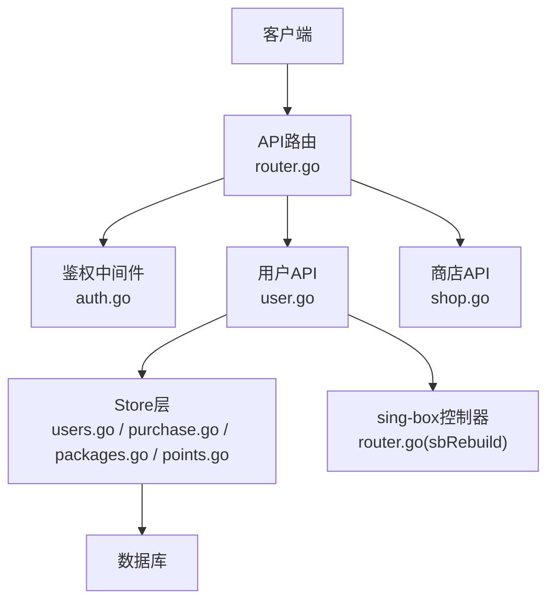
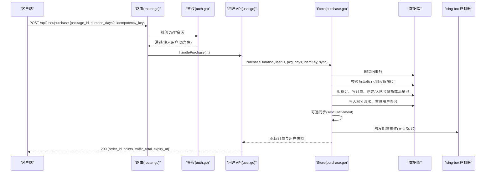
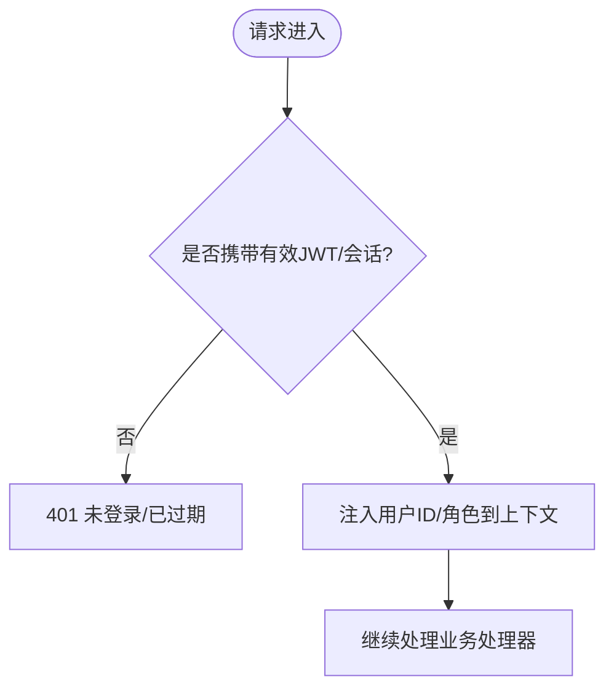
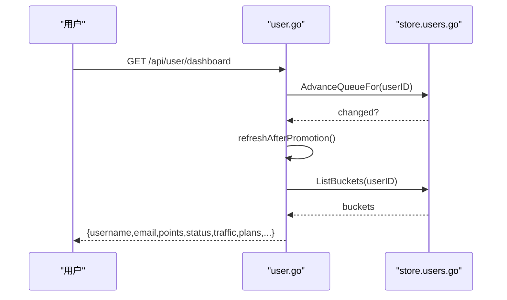
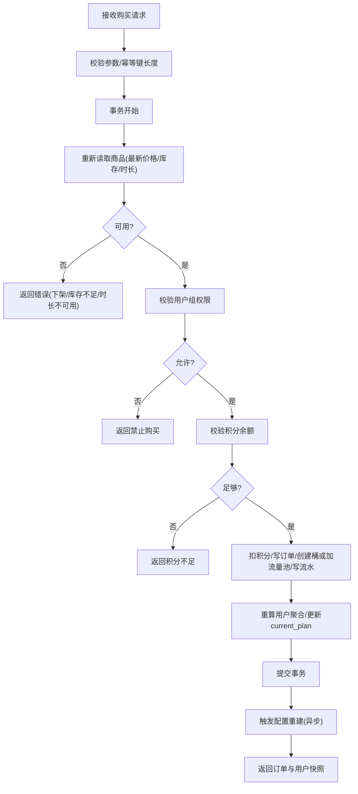
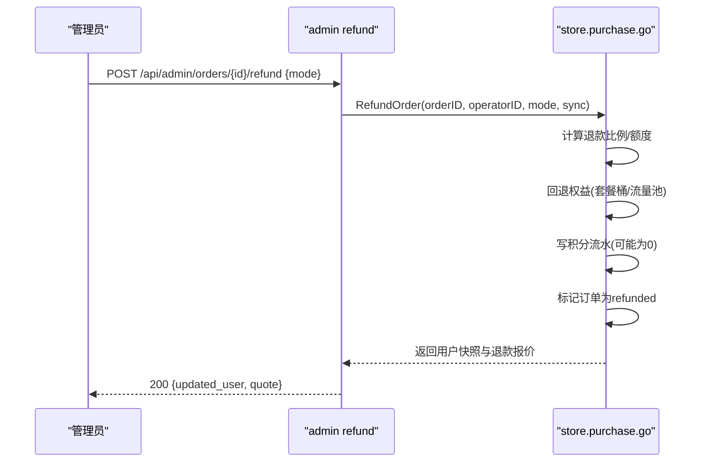
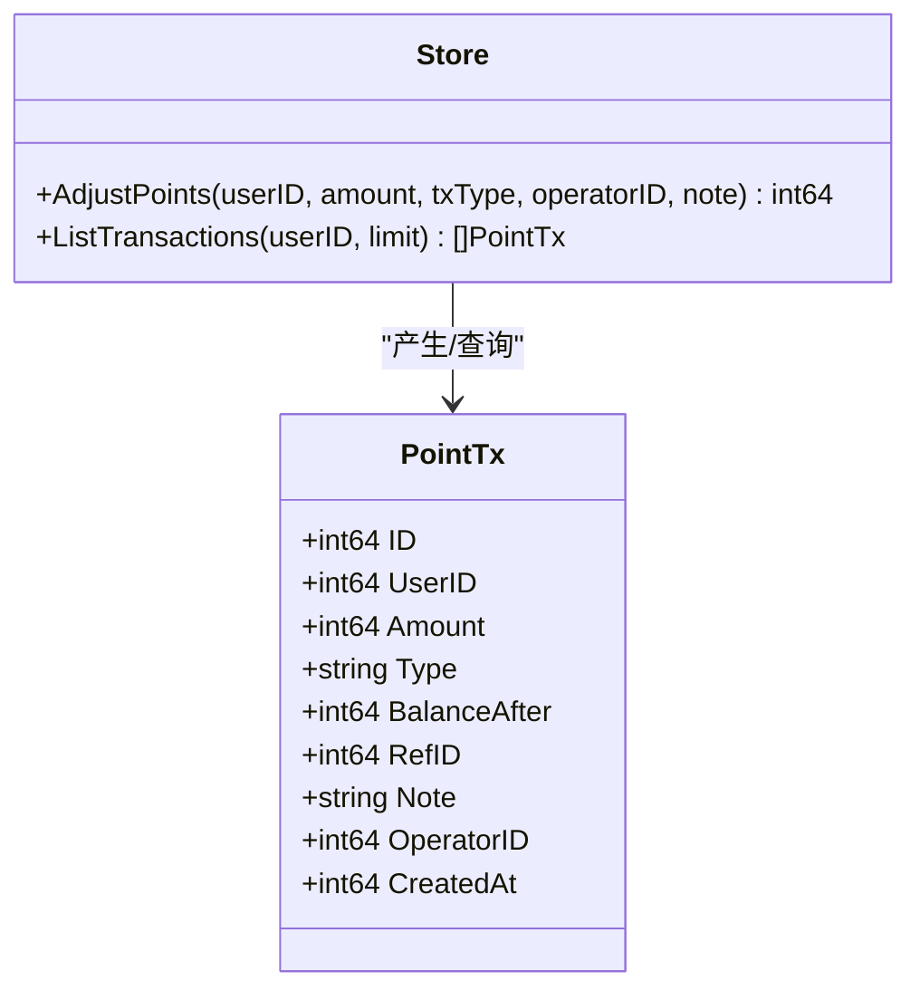
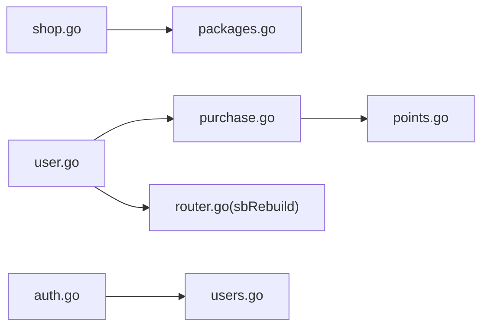

# 用户管理API

<cite>
**本文引用的文件**
- [internal/api/router.go](file://internal/api/router.go)
- [internal/api/auth.go](file://internal/api/auth.go)
- [internal/api/user.go](file://internal/api/user.go)
- [internal/api/shop.go](file://internal/api/shop.go)
- [internal/store/users.go](file://internal/store/users.go)
- [internal/store/purchase.go](file://internal/store/purchase.go)
- [internal/store/packages.go](file://internal/store/packages.go)
- [internal/store/points.go](file://internal/store/points.go)
</cite>

## 目录
1. [简介](#简介)
2. [项目结构](#项目结构)
3. [核心组件](#核心组件)
4. [架构总览](#架构总览)
5. [详细组件分析](#详细组件分析)
6. [依赖关系分析](#依赖关系分析)
7. [性能考虑](#性能考虑)
8. [故障排查指南](#故障排查指南)
9. [结论](#结论)
10. [附录：接口参考与示例](#附录接口参考与示例)

## 简介
本文件面向开发者，系统化梳理“用户管理”相关API，覆盖用户信息获取、套餐购买、订单管理、积分系统等能力。文档包含数据模型、业务逻辑、请求/响应约定、数据验证规则、错误处理策略，以及完整的操作示例（如套餐购买流程与订单处理）。目标是让读者在不深入源码的情况下也能正确集成和使用这些接口。

## 项目结构
后端采用分层设计：
- API层：路由注册、鉴权中间件、HTTP处理器
- Store层：数据库访问、事务、领域逻辑（购买、退款、积分流水等）
- 外部集成：sing-box配置重建、邮件发送、自更新等

图表来源
- [internal/api/router.go:132-208](file://internal/api/router.go#L132-L208)
- [internal/api/auth.go:179-202](file://internal/api/auth.go#L179-L202)
- [internal/api/user.go:285-316](file://internal/api/user.go#L285-L316)
- [internal/api/shop.go:13-25](file://internal/api/shop.go#L13-L25)

章节来源
- [internal/api/router.go:132-208](file://internal/api/router.go#L132-L208)
- [internal/api/auth.go:179-202](file://internal/api/auth.go#L179-L202)

## 核心组件
- 认证与会话：JWT签发、会话管理、登录/登出、当前用户上下文注入
- 用户信息：注册、仪表盘、订阅链接、代理凭据、套餐列表
- 商店与购买：商品可见性、购买下单、幂等键、库存与组权限校验
- 订单与退款：订单查询、管理员退款预览与执行
- 积分系统：余额查询、流水记录、充值/扣减原子性保证

章节来源
- [internal/api/auth.go:112-163](file://internal/api/auth.go#L112-L163)
- [internal/api/user.go:285-316](file://internal/api/user.go#L285-L316)
- [internal/api/shop.go:13-124](file://internal/api/shop.go#L13-L124)
- [internal/store/purchase.go:423-567](file://internal/store/purchase.go#L423-L567)
- [internal/store/points.go:26-65](file://internal/store/points.go#L26-L65)

## 架构总览
下图展示了从HTTP请求到Store事务再到sing-box配置重建的完整链路，重点体现购买流程中的事务边界与一致性保障。

图表来源
- [internal/api/router.go:177-192](file://internal/api/router.go#L177-L192)
- [internal/api/auth.go:179-202](file://internal/api/auth.go#L179-L202)
- [internal/api/shop.go:31-94](file://internal/api/shop.go#L31-L94)
- [internal/store/purchase.go:61-250](file://internal/store/purchase.go#L61-L250)
- [internal/api/user.go:216-221](file://internal/api/user.go#L216-L221)

## 详细组件分析

### 认证与会话
- 登录：POST /api/auth/login，校验用户名密码，封禁账号拒绝，签发JWT并设置Cookie
- 当前用户：GET /api/auth/me，返回用户基本信息视图
- 登出：POST /api/auth/logout，撤销会话并清除Cookie
- 鉴权中间件：解析Bearer/Cookie中的JWT，校验会话有效性，注入用户ID/角色到上下文

图表来源
- [internal/api/auth.go:179-202](file://internal/api/auth.go#L179-L202)
- [internal/api/auth.go:112-163](file://internal/api/auth.go#L112-L163)

章节来源
- [internal/api/auth.go:112-163](file://internal/api/auth.go#L112-L163)
- [internal/api/auth.go:179-202](file://internal/api/auth.go#L179-L202)

### 用户信息与仪表盘
- 注册：POST /api/auth/register，支持开放/邀请码/关闭模式；邮箱验证开关；创建用户后生成订阅令牌、默认流量/设备/有效期；必要时发送邮件验证
- 仪表盘：GET /api/user/dashboard，汇总流量、套餐状态、到期时间；自动推进队列中即将生效的套餐
- 订阅链接：GET /api/user/subscription，返回多种格式订阅地址；支持重置订阅地址
- 节点凭据重置：POST /api/user/reset-node-creds，受冷却期限制，影响所有节点并重载配置

图表来源
- [internal/api/user.go:240-316](file://internal/api/user.go#L240-L316)
- [internal/store/users.go:152-165](file://internal/store/users.go#L152-L165)

章节来源
- [internal/api/user.go:25-173](file://internal/api/user.go#L25-L173)
- [internal/api/user.go:285-316](file://internal/api/user.go#L285-L316)
- [internal/api/user.go:329-355](file://internal/api/user.go#L329-L355)
- [internal/api/user.go:387-412](file://internal/api/user.go#L387-L412)

### 商店与套餐购买
- 商品可见：GET /api/user/packages，仅展示当前用户可购买的启用商品（含公开与用户组绑定）
- 购买下单：POST /api/user/purchase，参数 package_id、duration_days（可选）、idempotency_key（幂等键）
  - 在事务内重新读取商品以锁定最新价格/库存/时长选项
  - 校验用户组权限、库存、积分余额
  - 扣积分、写订单、创建/入队套餐桶或流量池、写入积分流水、重算用户聚合
  - 失败时整体回滚，确保积分安全
- 订单查询：GET /api/user/orders，返回最近N条订单

图表来源
- [internal/api/shop.go:31-94](file://internal/api/shop.go#L31-L94)
- [internal/store/purchase.go:61-250](file://internal/store/purchase.go#L61-L250)
- [internal/store/packages.go:119-139](file://internal/store/packages.go#L119-L139)

章节来源
- [internal/api/shop.go:13-124](file://internal/api/shop.go#L13-L124)
- [internal/store/packages.go:218-245](file://internal/store/packages.go#L218-L245)
- [internal/store/purchase.go:61-250](file://internal/store/purchase.go#L61-L250)

### 订单管理与退款
- 订单查询：GET /api/user/orders（用户），管理员端提供全量订单查询
- 退款：管理员端对成功订单进行按比例或全额退款，内部计算退款额度、回滚权益、标记订单为已退款，并写入积分流水

图表来源
- [internal/store/purchase.go:423-567](file://internal/store/purchase.go#L423-L567)

章节来源
- [internal/store/purchase.go:369-649](file://internal/store/purchase.go#L369-L649)

### 积分系统
- 余额与流水：GET /api/user/points，返回余额与最近交易记录
- 调整积分：管理员端对用户进行充值/调整，底层使用原子事务保证余额不出现负数，并写入流水

图表来源
- [internal/store/points.go:14-88](file://internal/store/points.go#L14-L88)

章节来源
- [internal/api/shop.go:111-124](file://internal/api/shop.go#L111-L124)
- [internal/store/points.go:26-88](file://internal/store/points.go#L26-L88)

## 依赖关系分析
- API层依赖Store层完成所有持久化与事务逻辑
- 购买流程在事务内调用sync回调，用于将权益变更同步至sing-box（异步调度避免阻塞响应）
- 订阅链接与节点凭据分离：订阅地址可独立轮换，节点凭据旋转会吊销旧链接并重启sing-box

图表来源
- [internal/api/user.go:216-221](file://internal/api/user.go#L216-L221)
- [internal/api/shop.go:31-94](file://internal/api/shop.go#L31-L94)
- [internal/store/purchase.go:61-250](file://internal/store/purchase.go#L61-L250)

章节来源
- [internal/api/router.go:45-75](file://internal/api/router.go#L45-L75)
- [internal/store/users.go:167-296](file://internal/store/users.go#L167-L296)

## 性能考虑
- 购买事务内重读商品与库存，避免竞态导致超卖或价格不一致
- 幂等键防止网络重试重复扣款
- sing-box配置重建采用异步调度，避免长耗时阻塞HTTP响应
- 订阅地址轮换限流，防止频繁更换导致客户端无法导入
- 节点凭据重置冷却期减少全局影响范围

[本节为通用指导，无需特定文件引用]

## 故障排查指南
- 注册失败
  - 检查注册模式（开放/邀请码/关闭）与邮箱验证要求
  - 用户名/邮箱唯一性校验
  - 邀请码是否仍可用
- 购买失败
  - 常见错误：所选时长不可用、商品已下架、库存不足、积分不足、仅限指定用户组购买
  - 确认幂等键长度限制与重复提交保护
- 订阅链接问题
  - 订阅地址泄露可通过“重置订阅地址”快速更换
  - 节点凭据泄露需“重置节点凭据”，注意冷却期与影响面
- 退款异常
  - 已退款订单不可再次退款
  - 退款金额按策略计算，查看流水与订单状态

章节来源
- [internal/api/user.go:25-173](file://internal/api/user.go#L25-L173)
- [internal/api/shop.go:31-94](file://internal/api/shop.go#L31-L94)
- [internal/store/purchase.go:423-567](file://internal/store/purchase.go#L423-L567)

## 结论
该用户管理API围绕“账户—套餐—订单—积分”的主线构建，强调事务一致性与幂等性，兼顾用户体验与安全控制（组权限、库存、冷却期、凭据轮换）。通过清晰的错误码与消息，便于前端与第三方集成。建议在生产环境开启必要的监控与审计日志，关注购买与退款路径的一致性。

[本节为总结，无需特定文件引用]

## 附录：接口参考与示例

### 认证与会话
- POST /api/auth/login
  - 请求体：{ username, password }
  - 响应：{ token, user }
  - 错误：400 请求格式错误；401 用户名或密码错误；403 账号已被封禁
- GET /api/auth/me
  - 响应：{ id, username, email, email_verified, role, is_admin, status, points }
- POST /api/auth/logout
  - 响应：空

章节来源
- [internal/api/auth.go:112-163](file://internal/api/auth.go#L112-L163)
- [internal/api/auth.go:179-202](file://internal/api/auth.go#L179-L202)

### 用户信息
- POST /api/auth/register
  - 请求体：{ username, email, password, code? }
  - 行为：根据注册模式校验；创建用户；可选发送验证邮件；成功后签发登录令牌
  - 错误：400 请求格式/用户名/密码/邮箱验证；403 注册关闭；409 用户名或邮箱占用；500 服务器错误
- GET /api/user/dashboard
  - 响应：{ username, email, points, status, traffic{used,total,remaining,unlimited,unmetered_used}, plans[], expiry_at }
- GET /api/user/subscription
  - 响应：{ url, formats{default,clash,singbox,base64}, creds_reset_enabled }
- POST /api/user/reset-sub
  - 响应：{ url }
- POST /api/user/reset-node-creds
  - 响应：{ applies_in_seconds }
  - 错误：403 功能禁用；429 冷却期内；500 重置失败

章节来源
- [internal/api/user.go:25-173](file://internal/api/user.go#L25-L173)
- [internal/api/user.go:285-316](file://internal/api/user.go#L285-L316)
- [internal/api/user.go:329-355](file://internal/api/user.go#L329-L355)
- [internal/api/user.go:387-412](file://internal/api/user.go#L387-L412)

### 商店与购买
- GET /api/user/packages
  - 响应：[{ id, type, name, description, highlights, price_points, traffic_bytes, device_add, duration_days, options[], stock, enabled, sort_order }]
- POST /api/user/purchase
  - 请求体：{ package_id, duration_days?, idempotency_key? }
  - 响应：{ order_id, points, traffic_total, expiry_at }
  - 错误：400 请求格式/时长不可用/商品下架；401 未登录；403 仅限指定用户组；409 库存不足；402 积分不足；404 商品不存在；502 购买失败（已回滚）
- GET /api/user/orders
  - 响应：订单列表

章节来源
- [internal/api/shop.go:13-124](file://internal/api/shop.go#L13-L124)
- [internal/store/packages.go:218-245](file://internal/store/packages.go#L218-L245)
- [internal/store/purchase.go:61-250](file://internal/store/purchase.go#L61-L250)

### 订单与退款（管理员）
- GET /api/admin/orders
  - 响应：订单列表（跨用户）
- GET /api/admin/orders/{id}/refund-preview
  - 响应：退款预估（比例、退回积分、退回流量）
- POST /api/admin/orders/{id}/refund
  - 请求体：{ mode: "" | "prorated" | "full" }
  - 响应：{ updated_user, quote }
  - 错误：404 订单不存在；409 已退款；500 服务器错误

章节来源
- [internal/store/purchase.go:423-567](file://internal/store/purchase.go#L423-L567)
- [internal/store/purchase.go:569-649](file://internal/store/purchase.go#L569-L649)

### 积分系统
- GET /api/user/points
  - 响应：{ balance, transactions[] }
- 管理员充值/调整（管理员端）
  - 行为：原子扣/加积分，写入流水，余额不得为负

章节来源
- [internal/api/shop.go:111-124](file://internal/api/shop.go#L111-L124)
- [internal/store/points.go:26-88](file://internal/store/points.go#L26-L88)

### 数据模型概览
- 用户：包含基础信息、积分、流量限额、设备限额、到期时间、凭据重置时间等
- 套餐：类型（流量/套餐/设备）、名称、描述、亮点、价格、流量、设备加成、时长、选项、库存、排序、启用状态
- 订单：用户、套餐快照、价格、状态、创建时间、退款信息
- 积分流水：用户、变动额、类型、变更后余额、关联ID、备注、操作者、时间

章节来源
- [internal/store/users.go:22-51](file://internal/store/users.go#L22-L51)
- [internal/store/packages.go:23-41](file://internal/store/packages.go#L23-L41)
- [internal/store/purchase.go:22-41](file://internal/store/purchase.go#L22-L41)
- [internal/store/points.go:14-24](file://internal/store/points.go#L14-L24)

### 典型业务流程示例

#### 套餐购买流程
1. 前端调用 GET /api/user/packages 获取可购商品
2. 选择 package_id 与 duration_days（若支持多时长）
3. 生成幂等键 idempotency_key（防重复提交）
4. 调用 POST /api/user/purchase
5. 服务端在事务内校验商品、库存、组权限、积分余额
6. 扣积分、写订单、创建/入队套餐桶或流量池、写积分流水、重算用户聚合
7. 触发sing-box配置重建（异步）
8. 返回订单与用户快照

章节来源
- [internal/api/shop.go:31-94](file://internal/api/shop.go#L31-L94)
- [internal/store/purchase.go:61-250](file://internal/store/purchase.go#L61-L250)

#### 订单处理（退款）
1. 管理员调用退款预览接口获取预估
2. 调用退款接口，传入模式（按比例或全额）
3. 服务端计算退款额度、回退权益、写积分流水、标记订单为已退款
4. 返回更新后的用户快照与退款报价

章节来源
- [internal/store/purchase.go:423-567](file://internal/store/purchase.go#L423-L567)

### 数据验证规则与业务约束
- 用户名：字母数字下划线，3-32位
- 密码：至少6位
- 邮箱：可选但可强制要求验证
- 邀请码：仅在邀请模式下需要且必须有效
- 幂等键：最大长度限制，防止滥用存储
- 商品：必须启用、有库存（或无限）、时长选项存在
- 用户组：购买受限商品需属于绑定的用户组
- 积分：余额不得为负
- 节点凭据重置：冷却期限制，避免频繁重启影响其他用户

章节来源
- [internal/api/user.go:21-76](file://internal/api/user.go#L21-L76)
- [internal/api/shop.go:42-50](file://internal/api/shop.go#L42-L50)
- [internal/store/purchase.go:61-142](file://internal/store/purchase.go#L61-L142)
- [internal/store/points.go:26-65](file://internal/store/points.go#L26-L65)

### 错误处理策略
- 统一使用fail/ok封装响应，明确HTTP状态码
- 区分业务错误（如库存不足、积分不足、组权限不足）与系统错误
- 购买失败时事务回滚，确保积分与权益一致性
- 退款幂等：已退款订单不可再次退款
- 节点凭据重置：冷却期内返回明确的等待提示

章节来源
- [internal/api/shop.go:61-83](file://internal/api/shop.go#L61-L83)
- [internal/store/purchase.go:423-567](file://internal/store/purchase.go#L423-L567)
- [internal/api/user.go:387-412](file://internal/api/user.go#L387-L412)
