# 用户认证接口

<cite>
**本文引用的文件**
- [internal/api/auth.go](file://internal/api/auth.go)
- [internal/api/user.go](file://internal/api/user.go)
- [internal/api/email.go](file://internal/api/email.go)
- [internal/api/sessions.go](file://internal/api/sessions.go)
- [internal/auth/jwt.go](file://internal/auth/jwt.go)
- [internal/auth/password.go](file://internal/auth/password.go)
- [internal/store/users.go](file://internal/store/users.go)
- [internal/store/sessions.go](file://internal/store/sessions.go)
- [internal/store/email_tokens.go](file://internal/store/email_tokens.go)
- [internal/store/regcodes.go](file://internal/store/regcodes.go)
- [internal/config/config.go](file://internal/config/config.go)
</cite>

## 目录
1. [简介](#简介)
2. [项目结构](#项目结构)
3. [核心组件](#核心组件)
4. [架构总览](#架构总览)
5. [详细组件分析](#详细组件分析)
6. [依赖关系分析](#依赖关系分析)
7. [性能与安全考量](#性能与安全考量)
8. [故障排查指南](#故障排查指南)
9. [结论](#结论)
10. [附录：API 参考与流程示例](#附录api-参考与流程示例)

## 简介
本文件面向开发者，系统化梳理“轻舟”面板的用户认证能力，覆盖注册、登录、邮箱验证、密码重置、会话管理、JWT 签发与校验、注册码机制、防暴力破解与敏感信息防护等。文档以代码为依据，提供流程图与时序图，帮助快速理解并集成认证功能。

## 项目结构
认证相关代码主要分布在以下模块：
- API 层：路由处理、请求校验、响应封装、中间件鉴权、会话与配置暴露
- 认证库：JWT 签发/解析、密码哈希/比对、计时侧信道防护
- 存储层：用户、会话、邮箱令牌、注册码的持久化与原子操作
- 配置：运行期配置加载（监听地址、数据库路径、管理员初始凭据）

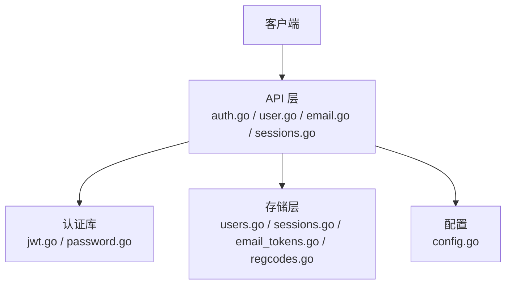

**图表来源**
- [internal/api/auth.go:17-26](file://internal/api/auth.go#L17-L26)
- [internal/auth/jwt.go:10-42](file://internal/auth/jwt.go#L10-L42)
- [internal/auth/password.go:5-23](file://internal/auth/password.go#L5-L23)
- [internal/store/users.go:22-51](file://internal/store/users.go#L22-L51)
- [internal/store/sessions.go:5-13](file://internal/store/sessions.go#L5-L13)
- [internal/store/email_tokens.go:7-83](file://internal/store/email_tokens.go#L7-L83)
- [internal/store/regcodes.go:9-28](file://internal/store/regcodes.go#L9-L28)
- [internal/config/config.go:5-28](file://internal/config/config.go#L5-L28)

**章节来源**
- [internal/api/auth.go:17-26](file://internal/api/auth.go#L17-L26)
- [internal/config/config.go:5-28](file://internal/config/config.go#L5-L28)

## 核心组件
- 登录与会话
  - 登录成功后创建会话记录，签发 JWT（含 jti），设置安全 Cookie
  - 鉴权中间件校验 Bearer/Cookie 中的 Token，校验会话存在并续活 last_seen
- 注册与邮箱验证
  - 支持 open/code/closed 三种注册模式；可选强制邮箱验证
  - 注册码预检查与原子消耗，绑定用户组（若配置）
  - 邮箱验证链接一次性使用，失败时友好提示
- 密码重置
  - 发送一次性重置令牌邮件；重置后清空所有会话，防止劫持会话继续访问
- 会话管理
  - 列出当前设备在线会话（按 IP+UA 去重），支持单设备注销与全部登出
  - 定期清理过期会话行，避免膨胀

**章节来源**
- [internal/api/auth.go:49-65](file://internal/api/auth.go#L49-L65)
- [internal/api/auth.go:112-149](file://internal/api/auth.go#L112-L149)
- [internal/api/auth.go:165-201](file://internal/api/auth.go#L165-L201)
- [internal/api/sessions.go:10-42](file://internal/api/sessions.go#L10-L42)
- [internal/store/sessions.go:15-122](file://internal/store/sessions.go#L15-L122)
- [internal/api/user.go:25-173](file://internal/api/user.go#L25-L173)
- [internal/api/email.go:60-153](file://internal/api/email.go#L60-L153)

## 架构总览
下图展示一次“注册→邮箱验证→自动登录”的端到端调用链。

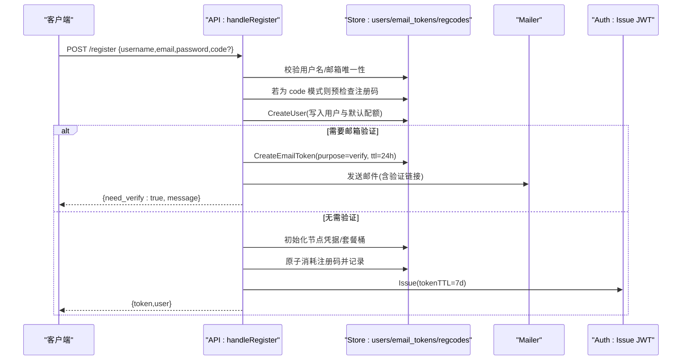

**图表来源**
- [internal/api/user.go:25-173](file://internal/api/user.go#L25-L173)
- [internal/store/email_tokens.go:7-46](file://internal/store/email_tokens.go#L7-L46)
- [internal/store/regcodes.go:141-179](file://internal/store/regcodes.go#L141-L179)
- [internal/auth/jwt.go:16-28](file://internal/auth/jwt.go#L16-L28)

## 详细组件分析

### 登录与鉴权
- 登录流程
  - 校验请求体，按用户名查询用户
  - 不存在时执行 DummyCompare 以恒定耗时，防止枚举用户名
  - 校验密码、账号状态（封禁拒绝）
  - 创建会话、签发 JWT 并设置 HttpOnly Cookie
- 鉴权中间件
  - 优先从 Authorization: Bearer 或 Cookie 中取 token
  - 解析 JWT，校验签名与有效期
  - 校验会话仍存在（支持远程撤销），并续活 last_seen
  - 将用户 ID、角色、jti 注入上下文供后续处理器使用

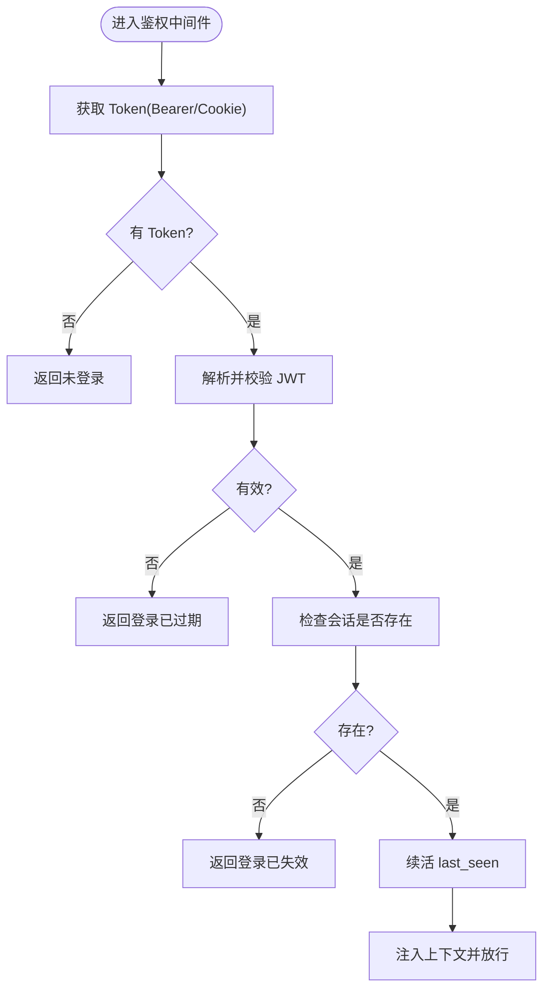

**图表来源**
- [internal/api/auth.go:179-201](file://internal/api/auth.go#L179-L201)
- [internal/auth/jwt.go:30-42](file://internal/auth/jwt.go#L30-L42)
- [internal/store/sessions.go:25-36](file://internal/store/sessions.go#L25-L36)

**章节来源**
- [internal/api/auth.go:112-149](file://internal/api/auth.go#L112-L149)
- [internal/api/auth.go:165-201](file://internal/api/auth.go#L165-L201)
- [internal/auth/password.go:14-23](file://internal/auth/password.go#L14-L23)

### 注册与注册码机制
- 注册模式
  - 通过配置决定 open/code/closed；兼容旧开关 registration_open
- 输入校验
  - 用户名：仅字母数字下划线，长度 3-32
  - 密码：至少 6 位
  - 邮箱：可选但可强制要求
  - 唯一性：用户名、邮箱不可重复
- 注册码
  - 预检查不消耗额度；账户创建成功后再原子消耗并记录
  - 可绑定用户组，使兑换者获得相应资格
- 邮箱验证
  - 若开启强制验证，先创建 verify 令牌并发送邮件，返回 need_verify
  - 验证成功后激活账号，必要时完成节点开通
- 资源配额
  - 默认流量、设备数、有效期从配置读取并写入用户与桶

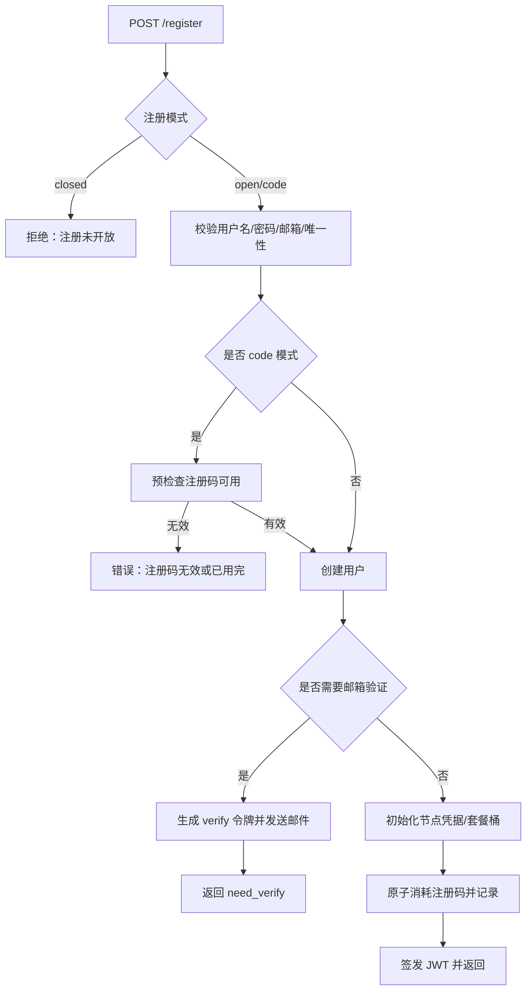

**图表来源**
- [internal/api/user.go:25-173](file://internal/api/user.go#L25-L173)
- [internal/store/regcodes.go:141-179](file://internal/store/regcodes.go#L141-L179)
- [internal/store/email_tokens.go:7-46](file://internal/store/email_tokens.go#L7-L46)

**章节来源**
- [internal/api/user.go:25-173](file://internal/api/user.go#L25-L173)
- [internal/store/regcodes.go:141-179](file://internal/store/regcodes.go#L141-L179)

### 邮箱验证与密码重置
- 邮箱验证
  - GET /api/auth/verify?token=... 一次性使用，成功标记 verified 并可能触发节点开通
  - 对重复点击/预抓取场景给出“已验证”友好页面
- 密码重置
  - POST /api/auth/forgot：根据邮箱发送 reset 令牌（1 小时有效）
  - POST /api/auth/reset：校验令牌并更新密码，同时删除该用户所有会话，防止劫持
- 绑定/更换邮箱
  - 绑定新邮箱会清除旧的 verify 令牌，避免令牌复用风险
  - 支持重发验证邮件，带频率限制

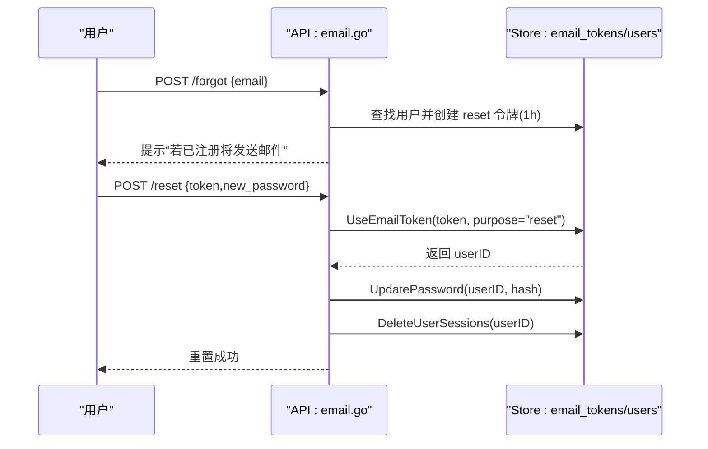

**图表来源**
- [internal/api/email.go:94-153](file://internal/api/email.go#L94-L153)
- [internal/store/email_tokens.go:16-59](file://internal/store/email_tokens.go#L16-L59)

**章节来源**
- [internal/api/email.go:60-153](file://internal/api/email.go#L60-L153)
- [internal/store/email_tokens.go:16-83](file://internal/store/email_tokens.go#L16-L83)

### 会话管理与设备控制
- 查看设备
  - 列出当前用户的活跃会话（按 IP+UA 去重），标记当前设备
  - 列表前清理过期会话行
- 注销设备
  - 支持按 id 注销指定设备，或全局登出（清除 Cookie 并删除当前 jti 对应会话）

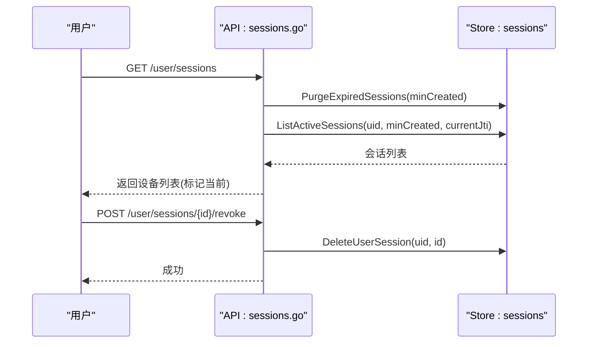

**图表来源**
- [internal/api/sessions.go:10-42](file://internal/api/sessions.go#L10-L42)
- [internal/store/sessions.go:56-116](file://internal/store/sessions.go#L56-L116)

**章节来源**
- [internal/api/sessions.go:10-42](file://internal/api/sessions.go#L10-L42)
- [internal/store/sessions.go:15-122](file://internal/store/sessions.go#L15-L122)

### JWT 令牌机制
- 签发
  - 包含用户 ID、角色、jti（会话标识）、签发时间、过期时间
  - 使用 HS256 对称签名，密钥来自运行配置
- 校验
  - 校验签名方法、有效性
  - 结合会话存在性判断是否仍有效（支持远程撤销）
- 过期与刷新
  - 默认 7 天有效期；过期后需重新登录
  - 刷新策略：当前实现未提供无感刷新接口，建议前端在过期前引导重新登录或使用长会话刷新方案

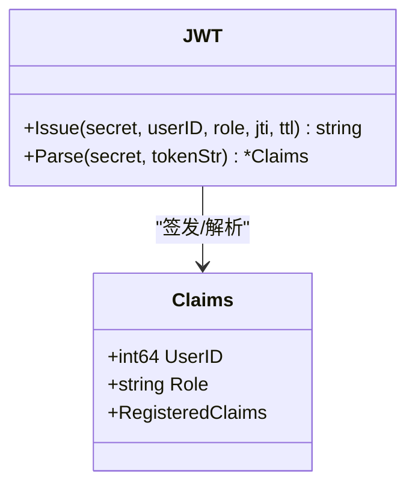

**图表来源**
- [internal/auth/jwt.go:10-42](file://internal/auth/jwt.go#L10-L42)
- [internal/api/auth.go:49-65](file://internal/api/auth.go#L49-L65)
- [internal/config/config.go:5-28](file://internal/config/config.go#L5-L28)

**章节来源**
- [internal/auth/jwt.go:10-42](file://internal/auth/jwt.go#L10-L42)
- [internal/api/auth.go:49-65](file://internal/api/auth.go#L49-L65)

## 依赖关系分析
- API 层依赖认证库进行密码哈希/比对与 JWT 签发/解析
- API 层依赖存储层完成用户、会话、邮箱令牌、注册码的持久化
- 配置模块提供运行期参数（如监听地址、数据库路径、管理员初始凭据）
- 会话表通过 jti 与 JWT 的 jti 关联，支撑远程撤销与设备管理

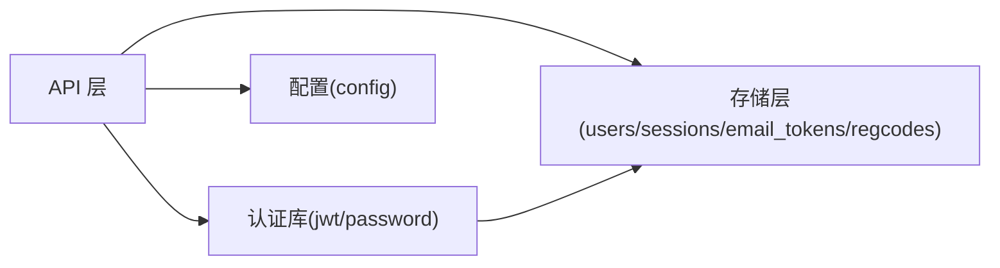

**图表来源**
- [internal/api/auth.go:1-26](file://internal/api/auth.go#L1-L26)
- [internal/auth/jwt.go:1-42](file://internal/auth/jwt.go#L1-L42)
- [internal/auth/password.go:1-23](file://internal/auth/password.go#L1-L23)
- [internal/store/users.go:1-51](file://internal/store/users.go#L1-L51)
- [internal/store/sessions.go:1-13](file://internal/store/sessions.go#L1-L13)
- [internal/store/email_tokens.go:1-83](file://internal/store/email_tokens.go#L1-L83)
- [internal/store/regcodes.go:1-28](file://internal/store/regcodes.go#L1-L28)
- [internal/config/config.go:1-28](file://internal/config/config.go#L1-L28)

**章节来源**
- [internal/api/auth.go:1-26](file://internal/api/auth.go#L1-L26)
- [internal/config/config.go:5-28](file://internal/config/config.go#L5-L28)

## 性能与安全考量
- 性能
  - 会话列表查询前清理过期行，减少无用数据
  - 会话 last_seen 限频更新（每分钟最多一次），降低写放大
  - 注册码原子消耗避免并发竞争导致超卖
- 安全
  - 密码采用 bcrypt 哈希存储，登录时对“用户不存在”分支执行 DummyCompare 恒定耗时，抵御时序攻击
  - 登录失败统一返回“用户名或密码错误”，不泄露用户名是否存在
  - 邮箱验证与重置令牌一次性使用，且具备 TTL
  - 重置密码后强制登出所有设备，防止劫持会话继续访问
  - 注册码支持启用/禁用与次数上限，配合用户组授予细粒度权限
  - 节点凭据重置具备 30 天冷却与开关控制，避免大规模重启影响
  - 邮箱地址输入过滤 CR/LF，防止 SMTP 头注入

[本节为通用指导，不直接分析具体文件]

## 故障排查指南
- 登录失败
  - 检查用户名/密码是否正确；确认账号未被封禁
  - 检查 JWT 是否过期或会话是否被撤销
- 注册失败
  - 用户名/邮箱冲突：检查唯一性
  - 注册码无效：确认码未用尽且启用
  - 邮箱验证失败：检查链接是否过期或被重复使用
- 邮箱问题
  - 未收到验证/重置邮件：检查 SMTP 配置与发信日志
  - 频繁重发受限：检查速率限制
- 会话异常
  - 设备列表为空：检查是否已登出或会话已过期
  - 无法注销设备：检查会话 id 是否属于当前用户

**章节来源**
- [internal/api/auth.go:112-149](file://internal/api/auth.go#L112-L149)
- [internal/api/user.go:25-173](file://internal/api/user.go#L25-L173)
- [internal/api/email.go:60-153](file://internal/api/email.go#L60-L153)
- [internal/api/sessions.go:10-42](file://internal/api/sessions.go#L10-L42)

## 结论
本系统实现了完整的用户认证闭环：注册（含注册码与邮箱验证）、登录（含防枚举与封禁控制）、会话管理（设备级注销与过期清理）、密码重置（一次性令牌与强制登出）、JWT 签发与校验（含会话绑定）。通过严格的输入校验、原子操作、速率限制与审计日志，兼顾了安全性与可用性。建议在接入时遵循最小权限原则，并结合业务需求实现前端刷新策略与风控策略。

[本节为总结性内容，不直接分析具体文件]

## 附录：API 参考与流程示例

### 关键接口一览
- 配置与注册
  - GET /api/config：获取站点配置（注册模式、是否强制邮箱验证等）
  - POST /register：注册用户（支持 open/code/closed 模式）
- 登录与个人信息
  - POST /login：用户名+密码登录，返回 JWT 与用户信息
  - GET /me：获取当前登录用户信息
  - POST /logout：登出（删除当前会话并清 Cookie）
- 邮箱与密码
  - GET /api/auth/verify?token=...：邮箱验证
  - POST /api/auth/forgot：发送重置密码邮件
  - POST /api/auth/reset：使用令牌重置密码
  - POST /api/user/email：绑定/更换邮箱（发送验证）
  - POST /api/user/resend-verify：重发验证邮件
- 会话管理
  - GET /api/user/sessions：列出当前设备的活跃会话
  - POST /api/user/sessions/{id}/revoke：注销指定设备

**章节来源**
- [internal/api/auth.go:84-110](file://internal/api/auth.go#L84-L110)
- [internal/api/auth.go:112-177](file://internal/api/auth.go#L112-L177)
- [internal/api/email.go:60-260](file://internal/api/email.go#L60-L260)
- [internal/api/sessions.go:10-42](file://internal/api/sessions.go#L10-L42)

### 典型流程示例

#### 新用户注册（需邮箱验证）
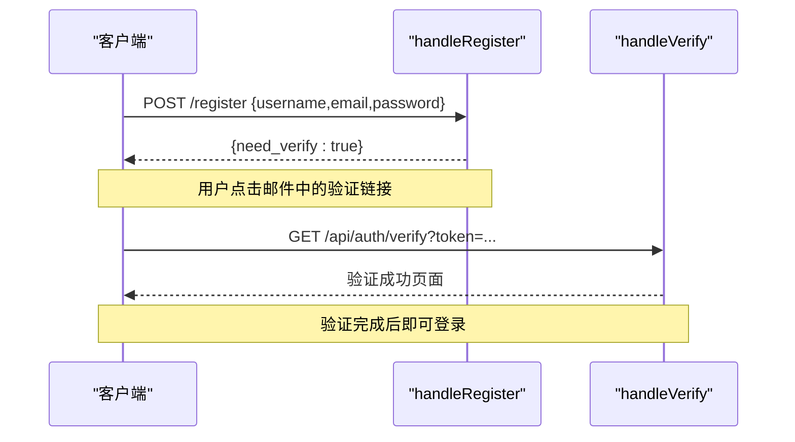

**图表来源**
- [internal/api/user.go:25-173](file://internal/api/user.go#L25-L173)
- [internal/api/email.go:60-92](file://internal/api/email.go#L60-L92)

#### 密码重置
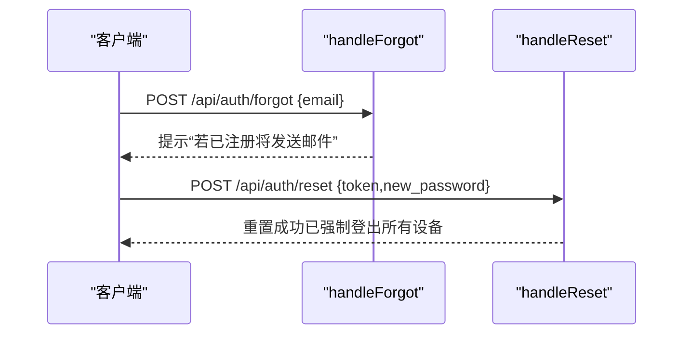

**图表来源**
- [internal/api/email.go:94-153](file://internal/api/email.go#L94-L153)

#### 会话管理与设备注销
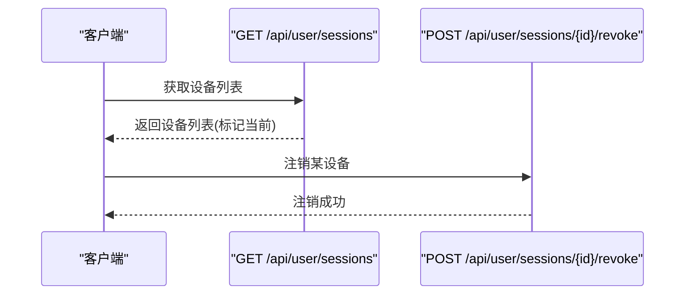

**图表来源**
- [internal/api/sessions.go:10-42](file://internal/api/sessions.go#L10-L42)
