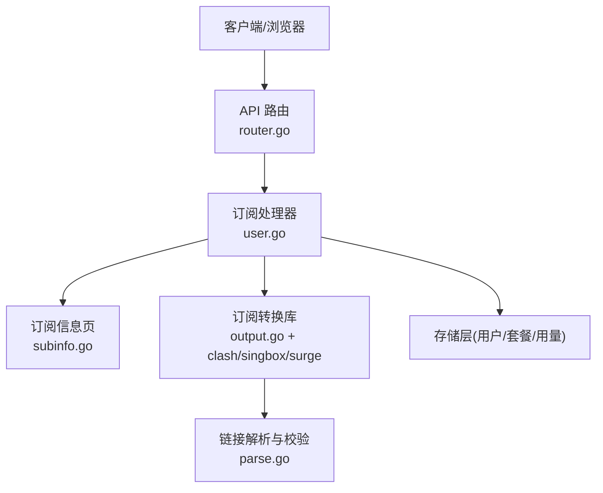
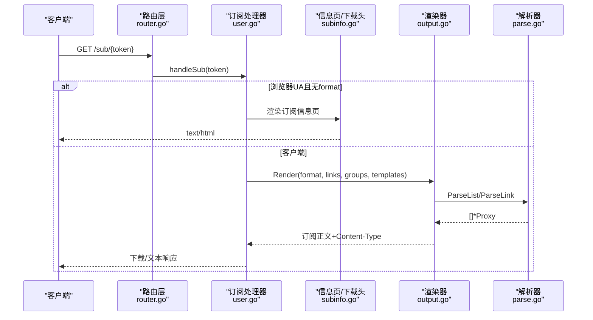
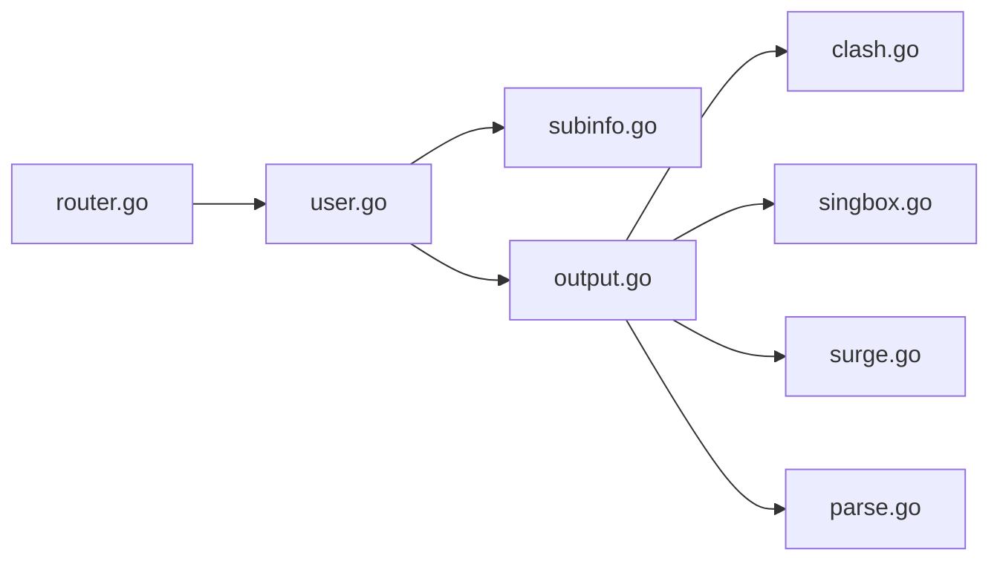

# 订阅管理接口

<cite>
**本文引用的文件**
- [router.go](file://internal/api/router.go)
- [subinfo.go](file://internal/api/subinfo.go)
- [user.go](file://internal/api/user.go)
- [account.go](file://internal/api/account.go)
- [output.go](file://internal/subconv/output.go)
- [clash.go](file://internal/subconv/clash.go)
- [singbox.go](file://internal/subconv/singbox.go)
- [surge.go](file://internal/subconv/surge.go)
- [parse.go](file://internal/subconv/parse.go)
</cite>

## 目录
1. [简介](#简介)
2. [项目结构](#项目结构)
3. [核心组件](#核心组件)
4. [架构总览](#架构总览)
5. [详细组件分析](#详细组件分析)
6. [依赖关系分析](#依赖关系分析)
7. [性能考虑](#性能考虑)
8. [故障排查指南](#故障排查指南)
9. [结论](#结论)
10. [附录：完整示例与最佳实践](#附录：完整示例与最佳实践)

## 简介
本文件面向开发者，系统化说明“订阅管理”相关接口的能力、流程与安全策略。内容覆盖：
- 订阅链接生成与访问（/sub/{token}）
- 格式自动识别与强制指定（Clash、Sing-box、Surge、base64）
- 凭据重置（用户侧 /api/user/reset-sub 等）
- 订阅令牌机制与轮换安全
- 防泄露模板注入与访问控制
- 错误处理与异常场景
- 端到端使用示例（获取订阅、切换格式、重置凭据）

## 项目结构
订阅功能横跨 API 路由层、业务处理器、订阅转换库与存储层。关键路径如下：
- 路由注册：公开订阅入口 /sub/{token}；用户态订阅查询与重置
- 订阅渲染：根据 UA 或 ?format= 选择输出格式，并注入反泄露模板
- 协议解析：统一解析多种分享链接为内部节点模型
- 多格式输出：Clash YAML、Sing-box JSON、Surge conf、通用 base64

**图示来源**
- [router.go:132-188](file://internal/api/router.go#L132-L188)
- [user.go:774-840](file://internal/api/user.go#L774-L840)
- [subinfo.go:14-49](file://internal/api/subinfo.go#L14-L49)
- [output.go:83-101](file://internal/subconv/output.go#L83-L101)
- [parse.go:146-172](file://internal/subconv/parse.go#L146-L172)

**章节来源**
- [router.go:132-188](file://internal/api/router.go#L132-L188)

## 核心组件
- 订阅路由与限流
  - 公开订阅入口：GET /sub/{token}
  - 用户态订阅查询：GET /api/user/subscription
  - 用户态重置订阅：POST /api/user/reset-sub
  - 每用户地址交换限流：10 分钟内最多 5 次
- 订阅信息页与下载头
  - 浏览器打开订阅链接时返回信息页（流量、到期、可用节点数）
  - 按格式设置 Content-Disposition，避免暴露 token 作为文件名
- 格式识别与渲染
  - UA 自动识别：Clash/Mihomo、Sing-box、Surge、其他回退到 base64
  - 显式 ?format= 覆盖 UA 判断
  - 内置反泄露模板：DNS fake-ip、TUN、规则集、嗅探器
- 链接解析与校验
  - 支持 vless/vmess/ss/trojan/hysteria/hysteria2/tuic/anytls 等
  - 严格校验端口、密码、加密方法等，拒绝破坏性配置
- 多格式输出
  - Clash YAML：代理组、url-test、TUN 排除、域名注入
  - Sing-box JSON：outbounds、inbounds(tun/mixed)、dns/route 注入
  - Surge conf：受管配置头、代理组、规则
  - base64：通用链接列表

**章节来源**
- [router.go:149-188](file://internal/api/router.go#L149-L188)
- [subinfo.go:14-49](file://internal/api/subinfo.go#L14-L49)
- [subinfo.go:253-308](file://internal/api/subinfo.go#L253-L308)
- [output.go:16-36](file://internal/subconv/output.go#L16-L36)
- [output.go:52-76](file://internal/subconv/output.go#L52-L76)
- [output.go:83-101](file://internal/subconv/output.go#L83-L101)
- [parse.go:120-144](file://internal/subconv/parse.go#L120-L144)
- [parse.go:78-104](file://internal/subconv/parse.go#L78-L104)

## 架构总览
订阅请求从路由进入，经鉴权/限流后聚合可服务节点，再根据 UA 或 ?format= 渲染为目标格式，同时注入反泄露模板与路由修正。

**图示来源**
- [router.go:153-153](file://internal/api/router.go#L153-L153)
- [user.go:774-840](file://internal/api/user.go#L774-L840)
- [subinfo.go:14-49](file://internal/api/subinfo.go#L14-L49)
- [output.go:83-101](file://internal/subconv/output.go#L83-L101)
- [parse.go:146-172](file://internal/subconv/parse.go#L146-L172)

## 详细组件分析

### 订阅链接访问与信息页
- 行为
  - 当请求来自浏览器（Accept 含 text/html、User-Agent 匹配主流引擎）且未显式指定 format，返回订阅信息页，展示站点名、已用/总量、剩余、到期时间、可用节点数及提示
  - 信息页提供一键复制订阅地址与常用格式跳转链接
- 安全
  - 禁止缓存（no-store）、禁止被嵌入（X-Frame-Options DENY）、Referrer-Policy no-referrer
  - 文件名通过 RFC 5987 转义，避免 token 暴露为配置文件名

**章节来源**
- [subinfo.go:14-49](file://internal/api/subinfo.go#L14-L49)
- [subinfo.go:157-251](file://internal/api/subinfo.go#L157-L251)
- [subinfo.go:253-308](file://internal/api/subinfo.go#L253-L308)

### 格式识别与渲染
- UA 自动识别
  - 优先匹配 Clash/Mihomo/Stash → Clash
  - 其次 sing-box/SFA/SFI/SFM/SFT → Sing-box
  - 再次 Surge → Surge
  - 其余 → base64 链接列表
- 显式覆盖
  - ?format=clash|singbox|surge|base64 直接生效
- 渲染要点
  - Clash：合并自定义分组、注入 TUN 排除、域名注入、url-test 组
  - Sing-box：默认 inbounds(tun/mixed)，注入 DNS/Routing 规则，域名直连解析
  - Surge：MANAGED-CONFIG 自动更新、代理组、规则
  - base64：原始分享链接列表

**章节来源**
- [output.go:16-36](file://internal/subconv/output.go#L16-L36)
- [output.go:52-76](file://internal/subconv/output.go#L52-L76)
- [output.go:83-101](file://internal/subconv/output.go#L83-L101)
- [clash.go:11-65](file://internal/subconv/clash.go#L11-L65)
- [singbox.go:10-112](file://internal/subconv/singbox.go#L10-L112)
- [surge.go:10-58](file://internal/subconv/surge.go#L10-L58)

### 链接解析与校验
- 支持的协议：vless、vmess、ss、trojan、hysteria/hysteria2、tuic、anytls
- 校验策略
  - 必填字段检查（server、port、密码等）
  - Shadowsocks 加密方法白名单
  - anytls 必须携带密码
  - 端口范围限制
- 兼容性与健壮性
  - 忽略不稳定的调优参数以稳定节点标识
  - 对不可用节点静默丢弃，避免污染整份配置

**章节来源**
- [parse.go:120-144](file://internal/subconv/parse.go#L120-L144)
- [parse.go:78-104](file://internal/subconv/parse.go#L78-L104)
- [parse.go:324-386](file://internal/subconv/parse.go#L324-L386)

### 多格式输出细节
- Clash
  - 自动生成主选择组与全局 url-test，以及按面板节点组的 url-test
  - 注入 TUN route-exclude-address 防止路由环
  - 将域名型节点主机名加入 fake-ip-filter，避免解析死循环
- Sing-box
  - 默认开启 tun 与 mixed inbound，设置 IPv6 前缀确保 AAAA 可达
  - 注入 DNS 规则使域名型节点走本地解析并直连
  - 对 UDP 阻断的节点在出站上标记 network=tcp
- Surge
  - 仅支持部分协议（如 ss/trojan/vmess/ws/hysteria2/anytls），不支持的节点会被跳过
  - 生成 MANAGED-CONFIG 自动更新头与规则

**章节来源**
- [clash.go:11-65](file://internal/subconv/clash.go#L11-L65)
- [clash.go:432-492](file://internal/subconv/clash.go#L432-L492)
- [singbox.go:10-112](file://internal/subconv/singbox.go#L10-L112)
- [singbox.go:150-172](file://internal/subconv/singbox.go#L150-L172)
- [singbox.go:444-491](file://internal/subconv/singbox.go#L444-L491)
- [surge.go:10-58](file://internal/subconv/surge.go#L10-L58)

### 订阅令牌与凭据重置
- 令牌访问
  - 公开路径 /sub/{token} 基于订阅令牌鉴权，无需登录态
  - 每用户地址交换限流：10 分钟 5 次，防止频繁换址导致订阅失效
- 凭据重置
  - 用户可通过 POST /api/user/reset-sub 重置订阅令牌
  - 重置后旧令牌立即失效，新令牌即时生效
- 安全策略
  - 重置频率受限，避免滥用
  - 信息页与订阅体均禁用缓存，防止 CDN 缓存过期令牌
  - 文件名采用 RFC 5987 编码，避免 token 泄露

**章节来源**
- [router.go:149-188](file://internal/api/router.go#L149-L188)
- [account.go:70-83](file://internal/api/account.go#L70-L83)
- [subinfo.go:237-251](file://internal/api/subinfo.go#L237-L251)
- [subinfo.go:267-308](file://internal/api/subinfo.go#L267-L308)

### 安全防护与访问控制
- 防泄露模板注入
  - 默认模板包含 DNS fake-ip、TUN、规则集与嗅探器，避免真实流量泄漏
  - 动态注入节点 IP 到 TUN 排除列表，避免路由环
  - 域名型节点强制本地解析并直连，避免解析死锁
- 访问控制
  - 公开订阅仅依赖令牌，不暴露会话
  - 用户态订阅查询需登录态
  - 重置操作受速率限制
- 响应头安全
  - no-store 防缓存
  - X-Frame-Options DENY 防嵌入
  - Referrer-Policy no-referrer 防 Referer 泄露

**章节来源**
- [output.go:125-365](file://internal/subconv/output.go#L125-L365)
- [clash.go:432-492](file://internal/subconv/clash.go#L432-L492)
- [singbox.go:150-172](file://internal/subconv/singbox.go#L150-L172)
- [subinfo.go:237-251](file://internal/api/subinfo.go#L237-L251)

### 错误处理与异常场景
- 解析失败
  - 未知协议、非法端口、不支持的加密方法将被丢弃或报错
  - 单个坏节点不会导致整份配置失败（解析阶段过滤）
- 渲染失败
  - 若模板或渲染出错，返回相应错误码
- 访问控制
  - 未授权/被封禁账户直接返回 403
  - 重置频率超限返回限流错误
- 兼容性
  - 对未知 UA 或格式回退到 base64，保证可用性

**章节来源**
- [parse.go:78-104](file://internal/subconv/parse.go#L78-L104)
- [output.go:16-36](file://internal/subconv/output.go#L16-L36)
- [subinfo.go:132-146](file://internal/api/subinfo.go#L132-L146)

## 依赖关系分析
订阅功能的关键依赖链：
- router.go 注册路由与中间件（压缩、超时、最大请求体、IP 限流）
- user.go 实现订阅聚合与渲染调度
- subinfo.go 负责信息页与下载头
- output.go 统一格式化入口
- clash/singbox/surge 各自实现对应格式渲染与反泄露注入
- parse.go 统一解析与校验

**图示来源**
- [router.go:132-188](file://internal/api/router.go#L132-L188)
- [user.go:774-840](file://internal/api/user.go#L774-L840)
- [subinfo.go:14-49](file://internal/api/subinfo.go#L14-L49)
- [output.go:83-101](file://internal/subconv/output.go#L83-L101)
- [clash.go:11-65](file://internal/subconv/clash.go#L11-L65)
- [singbox.go:10-112](file://internal/subconv/singbox.go#L10-L112)
- [surge.go:10-58](file://internal/subconv/surge.go#L10-L58)
- [parse.go:146-172](file://internal/subconv/parse.go#L146-L172)

**章节来源**
- [router.go:132-188](file://internal/api/router.go#L132-L188)
- [output.go:83-101](file://internal/subconv/output.go#L83-L101)

## 性能考虑
- 响应压缩：启用 gzip，减少 JSON/YAML/HTML 体积
- 请求体上限：限制最大请求体，防止内存压力
- 渲染优化：先转换再去重，保证组名唯一；对域名型节点进行最小化注入
- 缓存策略：订阅与信息页禁用缓存，避免 CDN 缓存过期令牌
- 限流：认证、重发、探针、订阅地址交换分别限流，保护后端资源

**章节来源**
- [router.go:132-148](file://internal/api/router.go#L132-L148)
- [account.go:70-83](file://internal/api/account.go#L70-L83)
- [subinfo.go:237-251](file://internal/api/subinfo.go#L237-L251)

## 故障排查指南
- 现象：浏览器打开订阅链接显示乱码或大量 Base64
  - 原因：客户端误用浏览器访问
  - 解决：使用代理客户端导入；或在 URL 追加 ?format=clash|singbox|surge 查看对应格式
- 现象：某节点无法连接
  - 可能原因：协议不被目标客户端支持（如 Surge 不支持 VLESS/TUIC）
  - 解决：更换客户端或格式；查看日志确认是否被解析阶段丢弃
- 现象：IPv6 不通
  - 可能原因：客户端未启用 IPv6 或节点仅有 AAAA 记录
  - 解决：启用 IPv6；确保节点有 A 记录或使用支持 IPv6 的节点
- 现象：重置订阅后仍使用旧令牌
  - 可能原因：客户端缓存了旧订阅
  - 解决：清除客户端缓存并重新导入新订阅

**章节来源**
- [parse.go:78-104](file://internal/subconv/parse.go#L78-L104)
- [surge.go:10-58](file://internal/subconv/surge.go#L10-L58)
- [output.go:125-365](file://internal/subconv/output.go#L125-L365)

## 结论
本订阅管理系统通过统一的链接解析、严格的校验与多格式渲染，结合反泄露模板与访问控制，提供了安全、稳定、易用的订阅能力。开发者可基于此文档快速集成与扩展，确保在不同客户端与网络环境下获得一致的体验。

## 附录：完整示例与最佳实践
- 获取订阅链接
  - 登录后调用 GET /api/user/subscription 获取当前用户的订阅地址
  - 或直接访问公开路径 GET /sub/{token}
- 切换格式
  - 在订阅地址后追加 ?format=clash|singbox|surge|base64 强制指定
  - 或通过 UA 自动识别（推荐）
- 重置凭据
  - 调用 POST /api/user/reset-sub 重置订阅令牌
  - 重置后立即使用新令牌导入客户端
- 最佳实践
  - 使用官方客户端 UA，以获得最优配置（fake-ip、TUN、规则集）
  - 避免在浏览器中直接打开订阅链接
  - 定期重置订阅令牌以提升安全性
  - 遇到异常时优先检查 UA、格式与节点协议支持情况

**章节来源**
- [router.go:149-188](file://internal/api/router.go#L149-L188)
- [output.go:16-36](file://internal/subconv/output.go#L16-L36)
- [output.go:52-76](file://internal/subconv/output.go#L52-L76)
- [account.go:70-83](file://internal/api/account.go#L70-L83)
