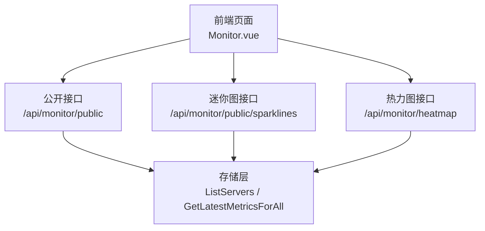
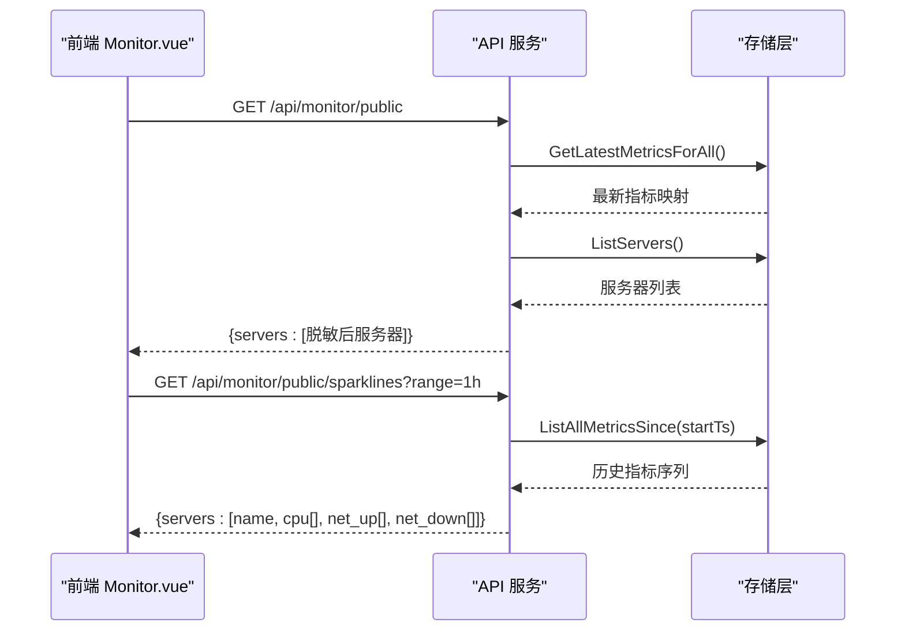
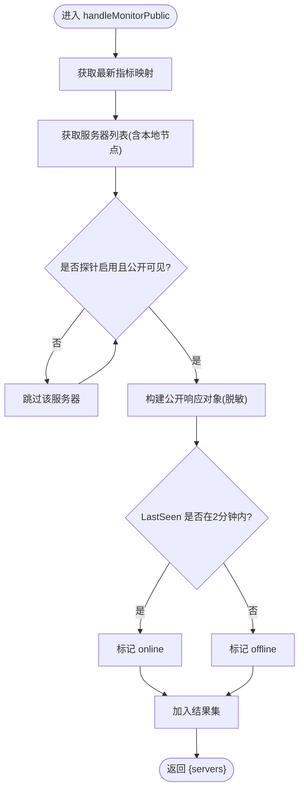
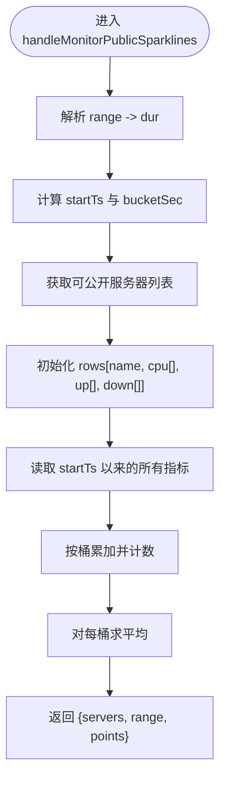
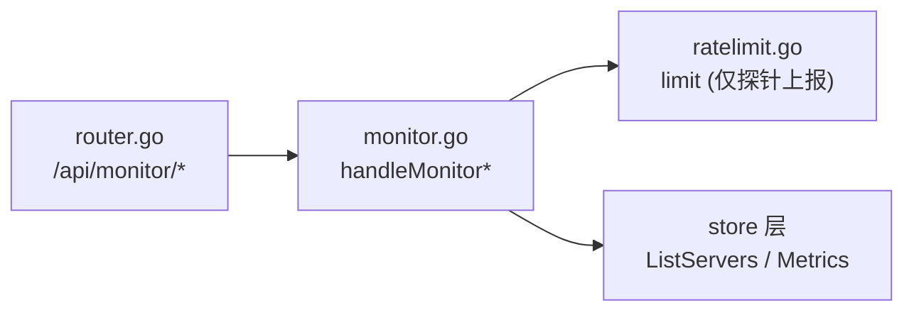

# 公开监控

<cite>
**本文引用的文件**
- [internal/api/monitor.go](file://internal/api/monitor.go)
- [internal/api/monitor_local.go](file://internal/api/monitor_local.go)
- [internal/api/ratelimit.go](file://internal/api/ratelimit.go)
- [internal/api/router.go](file://internal/api/router.go)
- [internal/api/helpers.go](file://internal/api/helpers.go)
- [internal/api/server_admin.go](file://internal/api/server_admin.go)
- [frontend/src/views/Monitor.vue](file://frontend/src/views/Monitor.vue)
- [frontend/src/components/TrafficTrendChart.vue](file://frontend/src/components/TrafficTrendChart.vue)
</cite>

## 目录
1. [简介](#简介)
2. [项目结构](#项目结构)
3. [核心组件](#核心组件)
4. [架构总览](#架构总览)
5. [详细组件分析](#详细组件分析)
6. [依赖关系分析](#依赖关系分析)
7. [性能考量](#性能考量)
8. [故障排查指南](#故障排查指南)
9. [结论](#结论)
10. [附录](#附录)

## 简介
本文件面向“公开监控”能力，围绕以下目标展开：
- 说明 handleMonitorPublic 接口的公开服务器列表查询逻辑、敏感信息过滤与权限控制。
- 记录 handleMonitorPublicSparklines 接口的迷你图表数据生成，包括 CPU 和网络流量的降采样算法。
- 阐述公开监控的数据安全策略与信息脱敏机制。
- 提供前端集成方案与用户体验优化建议。
- 给出访问频率限制与安全防护措施。

## 项目结构
公开监控由后端 API 与前端页面共同实现：
- 后端 API 暴露无鉴权的公开接口，负责筛选可公开服务器、聚合指标并返回脱敏数据。
- 前端页面定时拉取公开数据，渲染汇总卡片、可用性热力图与服务器卡片（含迷你趋势图）。

**图示来源**
- [internal/api/monitor.go:786-887](file://internal/api/monitor.go#L786-L887)
- [internal/api/monitor.go:430-526](file://internal/api/monitor.go#L430-L526)
- [internal/api/monitor.go:404-428](file://internal/api/monitor.go#L404-L428)
- [internal/api/router.go:172-175](file://internal/api/router.go#L172-L175)

**章节来源**
- [internal/api/router.go:172-175](file://internal/api/router.go#L172-L175)
- [frontend/src/views/Monitor.vue:374-386](file://frontend/src/views/Monitor.vue#L374-L386)

## 核心组件
- 公开服务器列表接口：handleMonitorPublic
- 迷你图接口：handleMonitorPublicSparklines
- 本地节点采集：StartLocalMetrics / localMonitorServer
- 限流中间件：limit
- 路由注册：/api/monitor/public, /api/monitor/public/sparklines, /api/monitor/heatmap

**章节来源**
- [internal/api/monitor.go:786-887](file://internal/api/monitor.go#L786-L887)
- [internal/api/monitor.go:430-526](file://internal/api/monitor.go#L430-L526)
- [internal/api/monitor_local.go:33-70](file://internal/api/monitor_local.go#L33-L70)
- [internal/api/ratelimit.go:53-64](file://internal/api/ratelimit.go#L53-L64)
- [internal/api/router.go:172-175](file://internal/api/router.go#L172-L175)

## 架构总览
公开监控采用“后端聚合 + 前端展示”的解耦设计：
- 后端统一从存储层获取最新指标与历史指标，按时间窗口进行桶化聚合与降采样，仅输出必要字段。
- 前端通过并行请求加载列表与迷你图，使用 ECharts 渲染热力图，SVG 绘制迷你面积图。

**图示来源**
- [internal/api/monitor.go:786-887](file://internal/api/monitor.go#L786-L887)
- [internal/api/monitor.go:430-526](file://internal/api/monitor.go#L430-L526)
- [frontend/src/views/Monitor.vue:374-386](file://frontend/src/views/Monitor.vue#L374-L386)

## 详细组件分析

### 公开服务器列表：handleMonitorPublic
- 功能：返回可公开的探针服务器列表及最新指标摘要，无需鉴权。
- 权限控制：仅包含 ProbeEnabled 且 PublicVisible 为真的服务器；本地面板机器默认不公开，需显式开启。
- 敏感信息过滤：
  - 不返回 SSH 密钥、探针 Token、主机 IP 等敏感字段。
  - 通过专用响应结构只暴露名称、状态、位置、供应商、规格、剩余天数、指标摘要与最后在线时间。
- 在线判定：以最近 2 分钟有数据视为 online。
- 数据来源：GetLatestMetricsForAll + ListServers，合并本地节点（若启用公开）。

**图示来源**
- [internal/api/monitor.go:786-887](file://internal/api/monitor.go#L786-L887)
- [internal/api/monitor_local.go:87-118](file://internal/api/monitor_local.go#L87-L118)

**章节来源**
- [internal/api/monitor.go:786-887](file://internal/api/monitor.go#L786-L887)
- [internal/api/server_admin.go:21-37](file://internal/api/server_admin.go#L21-L37)
- [internal/api/monitor_local.go:87-118](file://internal/api/monitor_local.go#L87-L118)

### 迷你图表数据：handleMonitorPublicSparklines
- 功能：为每个可公开服务器返回固定点数（points=32）的 CPU、上行、下行时序数据，用于前端迷你面积图。
- 时间范围：支持 1h/6h/24h，默认 1h。
- 降采样算法：
  - 计算起始时间与桶大小 bucketSec = dur.Seconds()/points。
  - 遍历历史指标，将每条指标归入对应时间桶，累加 CPU、NetTx、NetRx 并计数。
  - 对每个桶求平均值，得到平滑后的时序数组。
- 过滤规则：仅包含 ProbeEnabled 且 PublicVisible 为真的服务器，顺序稳定。

**图示来源**
- [internal/api/monitor.go:430-526](file://internal/api/monitor.go#L430-L526)

**章节来源**
- [internal/api/monitor.go:430-526](file://internal/api/monitor.go#L430-L526)

### 本地节点采集与公开开关
- 本地节点自动采集系统指标，周期为 30 秒，写入统一指标表。
- 本地节点在公开页是否显示受设置项 monitor_local_public 控制，默认关闭。
- 本地节点没有探针二进制与 Token，UI 不应展示安装命令。

**章节来源**
- [internal/api/monitor_local.go:33-70](file://internal/api/monitor_local.go#L33-L70)
- [internal/api/monitor_local.go:72-77](file://internal/api/monitor_local.go#L72-L77)
- [internal/api/monitor_local.go:87-118](file://internal/api/monitor_local.go#L87-L118)

### 安全与脱敏
- 敏感字段屏蔽：SSH 密钥、密码、Token 等在返回前被替换为占位符，避免泄露。
- 公开视图最小化：公开接口仅返回业务所需字段，不包含内部标识或连接信息。
- 本地节点默认隐藏：降低被指纹识别的风险。

**章节来源**
- [internal/api/server_admin.go:21-37](file://internal/api/server_admin.go#L21-L37)
- [internal/api/monitor.go:786-887](file://internal/api/monitor.go#L786-L887)
- [internal/api/monitor_local.go:27-31](file://internal/api/monitor_local.go#L27-L31)

### 前端集成与体验优化
- 数据加载：
  - 并发请求 /api/monitor/public 与 /api/monitor/public/sparklines?range=1h，将迷你图数据按服务器名称关联到列表。
  - 每 30 秒自动刷新一次，提供手动刷新按钮。
- 可视化：
  - 汇总卡片展示服务器总数、在线数、平均 CPU/内存/磁盘、总上下行速率。
  - 热力图使用 ECharts 渲染 server×time-bucket 矩阵，支持 1h/6h/24h/7d 切换。
  - 服务器卡片内嵌 SVG 迷你面积图，展示近 1 小时 CPU 趋势。
- 交互优化：
  - 数字滚动动画提升观感。
  - 空状态提示与错误容错。
  - 响应式布局适配不同屏幕尺寸。

**章节来源**
- [frontend/src/views/Monitor.vue:374-386](file://frontend/src/views/Monitor.vue#L374-L386)
- [frontend/src/views/Monitor.vue:395-479](file://frontend/src/views/Monitor.vue#L395-L479)
- [frontend/src/components/TrafficTrendChart.vue:21-76](file://frontend/src/components/TrafficTrendChart.vue#L21-L76)

## 依赖关系分析
- 路由注册：公开接口在路由中直接挂载，无需鉴权中间件。
- 限流保护：探针上报接口受限流中间件保护；公开接口未内置限流，建议在上层网关或反向代理处配置。
- 存储层：统一通过 store 层读取服务器与指标数据，保证一致性。

**图示来源**
- [internal/api/router.go:164-175](file://internal/api/router.go#L164-L175)
- [internal/api/ratelimit.go:53-64](file://internal/api/ratelimit.go#L53-L64)

**章节来源**
- [internal/api/router.go:164-175](file://internal/api/router.go#L164-L175)
- [internal/api/ratelimit.go:53-64](file://internal/api/ratelimit.go#L53-L64)

## 性能考量
- 降采样减少前端渲染压力：固定 32 点时序，避免大数据量传输。
- 桶化聚合降低数据库查询复杂度：按时间桶聚合 CPU/网络流量，减少重复计算。
- 本地节点采集间隔与探针一致：保持数据分辨率一致，便于对比。
- 建议：
  - 在反向代理层对公开接口实施基于 IP 的限流（如每分钟 N 次），防止滥用。
  - 对热点时间范围（如 24h）增加缓存层（如 Redis），减轻 DB 压力。
  - 定期清理历史指标，避免数据膨胀影响查询性能。

[本节为通用指导，不直接分析具体文件]

## 故障排查指南
- 公开列表为空：
  - 检查服务器是否启用探针与公开可见。
  - 确认本地节点是否开启公开显示。
- 迷你图为空或断点：
  - 检查时间范围参数是否正确。
  - 确认历史指标是否存在（探针上报是否正常）。
- 频繁请求被拒：
  - 若已在上层网关配置限流，请调整阈值或白名单。
- 数据异常：
  - 核对指标采集间隔与桶大小计算逻辑。
  - 检查存储层写入与查询是否成功。

**章节来源**
- [internal/api/monitor.go:786-887](file://internal/api/monitor.go#L786-L887)
- [internal/api/monitor.go:430-526](file://internal/api/monitor.go#L430-L526)
- [internal/api/ratelimit.go:53-64](file://internal/api/ratelimit.go#L53-L64)

## 结论
公开监控通过严格的权限控制与敏感信息脱敏，确保对外暴露的数据安全可控；通过降采样与桶化聚合，兼顾了性能与可视化效果。前端采用并发请求与丰富的可视化组件，提供了良好的用户体验。建议在网关层补充限流与缓存策略，进一步提升系统的稳定性与可扩展性。

[本节为总结，不直接分析具体文件]

## 附录

### 接口定义与行为
- GET /api/monitor/public
  - 返回：{ servers: [{ name, status, location, provider, spec, days_left, metrics, last_seen }] }
  - 行为：仅返回探针启用且公开可见的服务器；指标为最新快照。
- GET /api/monitor/public/sparklines?range=1h|6h|24h
  - 返回：{ servers: [{ name, cpu[], net_up[], net_down[] }], range, points }
  - 行为：按时间桶聚合并平均，固定 points=32。
- GET /api/monitor/heatmap?range=1h|6h|24h|7d
  - 返回：{ servers:[{name}], buckets:[ts...], matrix:[[class...]], range, bucket_sec }
  - 行为：server×时间桶矩阵，类值 0=正常,1=高负载,2=离线/无数据。

**章节来源**
- [internal/api/monitor.go:786-887](file://internal/api/monitor.go#L786-L887)
- [internal/api/monitor.go:430-526](file://internal/api/monitor.go#L430-L526)
- [internal/api/monitor.go:404-428](file://internal/api/monitor.go#L404-L428)

### 前端集成要点
- 并发请求：同时拉取列表与迷你图，按名称对齐数据。
- 刷新策略：30 秒轮询，支持手动刷新。
- 可视化：ECharts 热力图 + SVG 迷你面积图。
- 错误处理：空数据与网络异常时降级展示。

**章节来源**
- [frontend/src/views/Monitor.vue:374-386](file://frontend/src/views/Monitor.vue#L374-L386)
- [frontend/src/views/Monitor.vue:395-479](file://frontend/src/views/Monitor.vue#L395-L479)
- [frontend/src/components/TrafficTrendChart.vue:21-76](file://frontend/src/components/TrafficTrendChart.vue#L21-L76)
