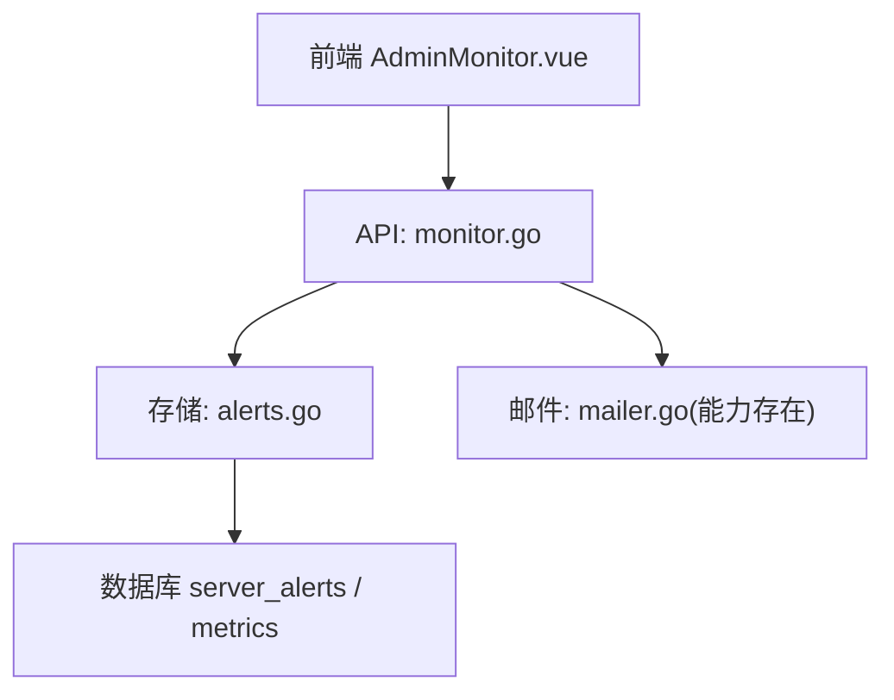
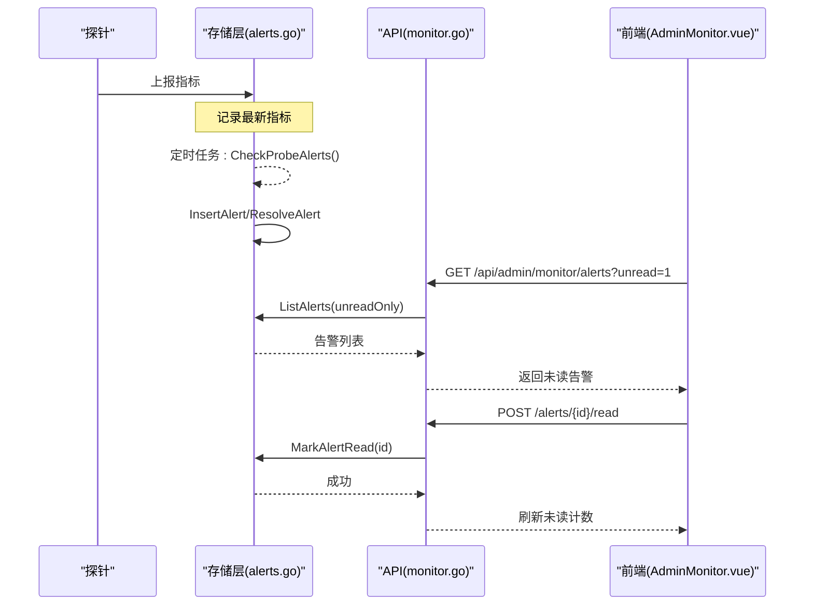
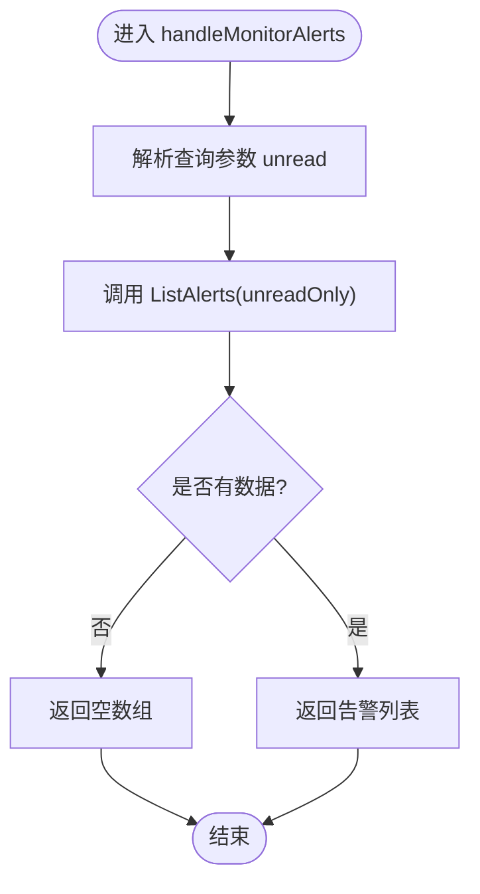
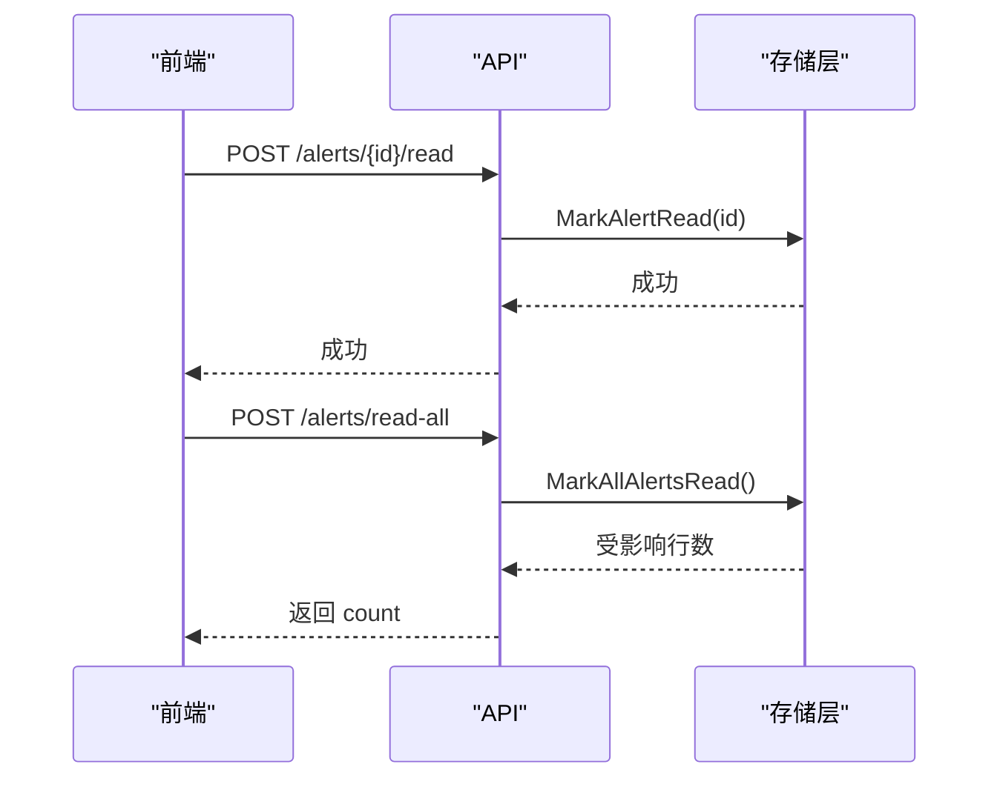
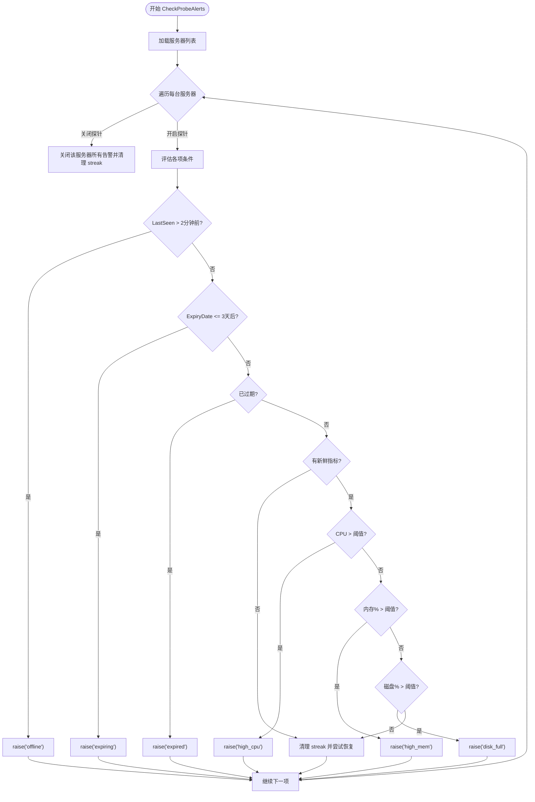
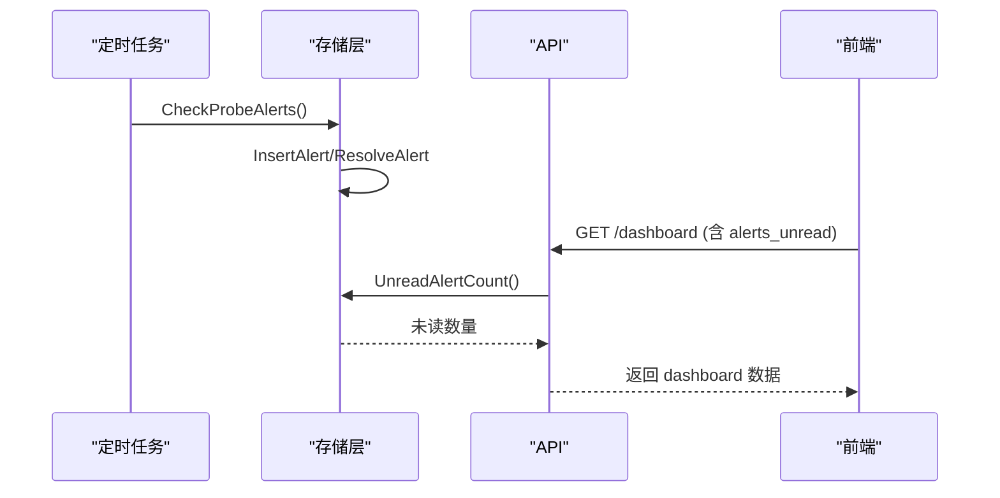
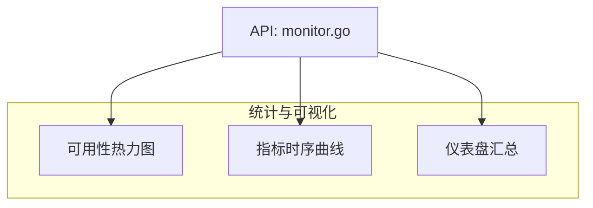
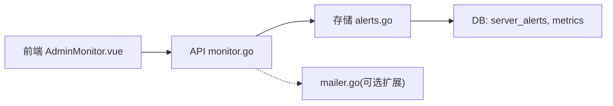

# 告警管理

<cite>
**本文引用的文件**
- [internal/api/monitor.go](file://internal/api/monitor.go)
- [internal/store/alerts.go](file://internal/store/alerts.go)
- [frontend/src/views/AdminMonitor.vue](file://frontend/src/views/AdminMonitor.vue)
- [frontend/src/views/AdminSettings.vue](file://frontend/src/views/AdminSettings.vue)
- [internal/mailer/mailer.go](file://internal/mailer/mailer.go)
</cite>

## 目录
1. [简介](#简介)
2. [项目结构](#项目结构)
3. [核心组件](#核心组件)
4. [架构总览](#架构总览)
5. [详细组件分析](#详细组件分析)
6. [依赖关系分析](#依赖关系分析)
7. [性能考量](#性能考量)
8. [故障排查指南](#故障排查指南)
9. [结论](#结论)
10. [附录](#附录)

## 简介
本章节面向“告警管理”功能，覆盖以下要点：
- handleMonitorAlerts 接口的告警列表查询：支持未读过滤、排序与限制条数。
- 告警状态管理：单条标记已读、批量全部标记已读。
- 告警规则配置与触发机制：离线、即将到期、已过期、CPU/内存/磁盘高负载等；连续命中策略与阈值配置。
- 告警通知渠道与消息格式：当前实现为面板内展示；邮件通道具备能力但未在告警流程中直接调用。
- 业务流程与自动化响应：后台定时任务周期性评估并生成/恢复告警。
- 历史查询与统计分析：告警列表、热力图、指标时序数据用于统计与可视化。

## 项目结构
告警相关代码主要分布在三层：
- API 层：提供监控与告警的 HTTP 接口（列表、标记已读、仪表盘汇总）。
- 存储层：定义告警数据结构、写入/读取、自动检查与恢复逻辑。
- 前端页面：展示未读告警、支持忽略（标记已读）、查看服务器指标与可用性热力图。

图表来源
- [internal/api/monitor.go:362-373](file://internal/api/monitor.go#L362-L373)
- [internal/store/alerts.go:138-216](file://internal/store/alerts.go#L138-L216)
- [frontend/src/views/AdminMonitor.vue:386-401](file://frontend/src/views/AdminMonitor.vue#L386-L401)

章节来源
- [internal/api/monitor.go:183-373](file://internal/api/monitor.go#L183-L373)
- [internal/store/alerts.go:10-216](file://internal/store/alerts.go#L10-L216)
- [frontend/src/views/AdminMonitor.vue:59-87](file://frontend/src/views/AdminMonitor.vue#L59-L87)

## 核心组件
- 告警数据模型：包含服务器ID、类型、消息、时间戳、首次触发时间、命中次数、是否已读、是否已自动恢复。
- 告警写入与合并：同一服务器同一类型的持续问题会合并到一条事件，避免刷屏。
- 告警查询与过滤：支持按“仅未读”过滤，按最近时间倒序，限制返回条数。
- 告警状态更新：单条/批量标记已读。
- 告警评估与恢复：后台定时任务周期性扫描服务器状态，生成或恢复告警。
- 前端交互：展示未读告警、支持忽略单条或全部忽略。

章节来源
- [internal/store/alerts.go:10-24](file://internal/store/alerts.go#L10-L24)
- [internal/store/alerts.go:138-160](file://internal/store/alerts.go#L138-L160)
- [internal/store/alerts.go:172-216](file://internal/store/alerts.go#L172-L216)
- [internal/api/monitor.go:362-373](file://internal/api/monitor.go#L362-L373)
- [frontend/src/views/AdminMonitor.vue:386-401](file://frontend/src/views/AdminMonitor.vue#L386-L401)

## 架构总览
告警系统由“采集—评估—持久化—展示—操作”闭环构成：
- 探针上报指标，存储层维护最新指标。
- 后台定时任务周期性执行 CheckProbeAlerts，根据规则生成或恢复告警。
- API 暴露告警列表与标记已读接口。
- 前端拉取未读告警并允许管理员忽略。

图表来源
- [internal/store/alerts.go:247-356](file://internal/store/alerts.go#L247-L356)
- [internal/api/monitor.go:362-373](file://internal/api/monitor.go#L362-L373)
- [frontend/src/views/AdminMonitor.vue:386-401](file://frontend/src/views/AdminMonitor.vue#L386-L401)

## 详细组件分析

### 告警列表查询：handleMonitorAlerts
- 功能：获取告警列表，支持通过查询参数 unread=1 仅返回未读告警。
- 行为：
  - 解析查询参数 unread。
  - 调用存储层 ListAlerts 获取数据，若为空则返回空数组。
  - 统一封装响应。
- 前端使用：
  - 页面加载时请求 /api/admin/monitor/alerts?unread=1，渲染未读告警卡片。
  - 支持展开/收起与排序显示。

图表来源
- [internal/api/monitor.go:362-373](file://internal/api/monitor.go#L362-L373)
- [internal/store/alerts.go:172-193](file://internal/store/alerts.go#L172-L193)
- [frontend/src/views/AdminMonitor.vue:490-505](file://frontend/src/views/AdminMonitor.vue#L490-L505)

章节来源
- [internal/api/monitor.go:362-373](file://internal/api/monitor.go#L362-L373)
- [internal/store/alerts.go:172-193](file://internal/store/alerts.go#L172-L193)
- [frontend/src/views/AdminMonitor.vue:59-87](file://frontend/src/views/AdminMonitor.vue#L59-L87)

### 告警状态管理：handleMarkAlertRead 与 handleMarkAllAlertsRead
- 单条标记已读：
  - 从 URL 路径参数读取告警ID。
  - 调用存储层 MarkAlertRead 将 read 置为 1。
  - 返回成功响应。
- 全部标记已读：
  - 调用存储层 MarkAllAlertsRead 批量更新所有未读告警。
  - 返回受影响行数。
- 前端交互：
  - “忽略”按钮调用单条标记已读接口。
  - “全部忽略”调用批量标记已读接口，并清空本地未读列表。

图表来源
- [internal/api/monitor.go:649-665](file://internal/api/monitor.go#L649-L665)
- [internal/store/alerts.go:195-209](file://internal/store/alerts.go#L195-L209)
- [frontend/src/views/AdminMonitor.vue:386-401](file://frontend/src/views/AdminMonitor.vue#L386-L401)

章节来源
- [internal/api/monitor.go:649-665](file://internal/api/monitor.go#L649-L665)
- [internal/store/alerts.go:195-209](file://internal/store/alerts.go#L195-L209)
- [frontend/src/views/AdminMonitor.vue:386-401](file://frontend/src/views/AdminMonitor.vue#L386-L401)

### 告警规则配置与触发机制
- 支持的告警类型：
  - offline：最后上报超过2分钟。
  - expiring：将在3天内到期。
  - expired：已过期。
  - high_cpu：CPU 使用率超过阈值。
  - high_mem：内存使用率超过阈值。
  - disk_full：磁盘使用率超过阈值。
- 阈值配置：
  - CPU/内存/磁盘阈值通过设置项读取，默认值分别为 90/90/85。
  - 连续命中次数（alert_consecutive）控制抖动抑制，默认2次，范围钳制在1-10。
- 触发与恢复：
  - 对采样类条件（offline、high_cpu、high_mem、disk_full）采用连续命中策略，避免瞬时抖动导致误报。
  - 日期类条件（expiring、expired）不延迟，立即生效。
  - 当条件不再满足时，自动恢复（resolved=1），并从面板消失。
- 配置入口：
  - 前端“监控告警阈值”表单可修改 CPU/内存/磁盘阈值与连续命中次数。
  - 后端读取设置项并在下次检查周期生效。

图表来源
- [internal/store/alerts.go:247-356](file://internal/store/alerts.go#L247-L356)
- [internal/store/alerts.go:99-112](file://internal/store/alerts.go#L99-L112)
- [frontend/src/views/AdminSettings.vue:217-233](file://frontend/src/views/AdminSettings.vue#L217-L233)

章节来源
- [internal/store/alerts.go:30-43](file://internal/store/alerts.go#L30-L43)
- [internal/store/alerts.go:99-112](file://internal/store/alerts.go#L99-L112)
- [internal/store/alerts.go:247-356](file://internal/store/alerts.go#L247-L356)
- [frontend/src/views/AdminSettings.vue:217-233](file://frontend/src/views/AdminSettings.vue#L217-L233)

### 告警通知渠道与消息格式
- 当前实现：
  - 告警以“面板内事件”形式呈现，存储在 server_alerts 表中，前端拉取并展示。
  - 未提供直接的短信/IM/电话等通知渠道集成。
- 邮件能力：
  - 邮件模块具备 SMTP 发送能力（隐式 TLS 与 STARTTLS），可用于扩展告警通知。
  - 当前告警流程未直接调用邮件发送，如需外部通知可在后续扩展中接入。
- 消息内容：
  - 每条告警包含类型、消息文本、时间戳、首次触发时间、命中次数、是否已读、是否已恢复。
  - 前端根据类型映射中文标签与严重度等级。

章节来源
- [internal/store/alerts.go:10-24](file://internal/store/alerts.go#L10-L24)
- [internal/mailer/mailer.go:1-161](file://internal/mailer/mailer.go#L1-161)
- [frontend/src/views/AdminMonitor.vue:217-231](file://frontend/src/views/AdminMonitor.vue#L217-L231)

### 告警处理的业务流程与自动化响应方案
- 自动化：
  - 后台每小时执行一次 CheckProbeAlerts，同时清理旧指标与流量样本，保证数据库规模可控。
  - 对于关闭探针的服务器，自动关闭其所有告警并清理 streak，避免残留。
  - 对于不再满足条件的告警，自动恢复（resolved=1），从面板消失。
- 人工干预：
  - 管理员可通过“忽略”将告警标记为已读，但不会改变 resolved 状态；再次触发仍会重新生成事件。
  - 全部忽略用于快速清屏。

图表来源
- [internal/api/monitor.go:891-919](file://internal/api/monitor.go#L891-L919)
- [internal/store/alerts.go:211-216](file://internal/store/alerts.go#L211-L216)
- [internal/api/monitor.go:183-241](file://internal/api/monitor.go#L183-L241)

章节来源
- [internal/api/monitor.go:891-919](file://internal/api/monitor.go#L891-L919)
- [internal/store/alerts.go:211-216](file://internal/store/alerts.go#L211-L216)
- [internal/api/monitor.go:183-241](file://internal/api/monitor.go#L183-L241)

### 告警历史查询与统计分析
- 历史查询：
  - 告警列表按最近时间倒序，最多返回200条，便于快速定位近期问题。
  - 支持仅未读过滤，减少历史已读告警干扰。
- 统计分析：
  - 可用性热力图：服务器×时间桶矩阵，展示正常/高负载/离线无数据三类状态。
  - 指标时序：支持按1h/6h/24h/7d/30d范围拉取 CPU/内存/网络等指标，用于趋势分析。
  - 仪表盘汇总：在线/离线/即将到期/未读告警数量及资源汇总。

图表来源
- [internal/api/monitor.go:375-428](file://internal/api/monitor.go#L375-L428)
- [internal/api/monitor.go:323-360](file://internal/api/monitor.go#L323-L360)
- [internal/api/monitor.go:183-241](file://internal/api/monitor.go#L183-L241)

章节来源
- [internal/api/monitor.go:323-428](file://internal/api/monitor.go#L323-L428)
- [internal/store/alerts.go:172-193](file://internal/store/alerts.go#L172-L193)
- [frontend/src/views/AdminMonitor.vue:268-359](file://frontend/src/views/AdminMonitor.vue#L268-L359)

## 依赖关系分析
- API 层依赖存储层进行告警读写与评估。
- 存储层依赖数据库表 server_alerts 与 metrics。
- 前端依赖 API 提供的监控与告警接口。
- 邮件模块独立存在，可作为未来告警通知扩展点。

图表来源
- [internal/api/monitor.go:362-373](file://internal/api/monitor.go#L362-L373)
- [internal/store/alerts.go:138-216](file://internal/store/alerts.go#L138-L216)
- [frontend/src/views/AdminMonitor.vue:386-401](file://frontend/src/views/AdminMonitor.vue#L386-L401)
- [internal/mailer/mailer.go:42-58](file://internal/mailer/mailer.go#L42-L58)

章节来源
- [internal/api/monitor.go:362-373](file://internal/api/monitor.go#L362-L373)
- [internal/store/alerts.go:138-216](file://internal/store/alerts.go#L138-L216)
- [frontend/src/views/AdminMonitor.vue:386-401](file://frontend/src/views/AdminMonitor.vue#L386-L401)
- [internal/mailer/mailer.go:42-58](file://internal/mailer/mailer.go#L42-L58)

## 性能考量
- 告警合并：同一服务器同一类型的问题合并为一条事件，降低面板噪音与数据库压力。
- 连续命中：对采样类条件采用连续命中策略，避免瞬时抖动造成误报。
- 列表限制：告警列表限制返回200条，防止大数据量影响前端渲染。
- 定时清理：每小时清理旧指标与流量样本，避免数据库膨胀。
- 热区计算：热力图按固定列数（48列）聚合，降低查询与渲染成本。

章节来源
- [internal/store/alerts.go:138-160](file://internal/store/alerts.go#L138-L160)
- [internal/store/alerts.go:172-193](file://internal/store/alerts.go#L172-L193)
- [internal/api/monitor.go:891-919](file://internal/api/monitor.go#L891-L919)
- [internal/api/monitor.go:541-647](file://internal/api/monitor.go#L541-L647)

## 故障排查指南
- 告警不出现：
  - 确认探针已启用且能上报指标。
  - 检查阈值与连续命中次数设置是否过高。
  - 查看后台日志中 CheckProbeAlerts 执行情况。
- 告警无法恢复：
  - 确认条件确实不再满足（如指标恢复正常）。
  - 检查 ResolveAlert 是否被调用（自动恢复逻辑）。
- 标记已读无效：
  - 确认接口调用成功且数据库 read 字段已更新。
  - 前端是否正确刷新未读列表。
- 邮件通知未送达：
  - 当前告警流程未直接发送邮件，需自行扩展。
  - 若扩展后失败，检查 SMTP 配置、STARTTLS/SSL 与安全策略。

章节来源
- [internal/store/alerts.go:247-356](file://internal/store/alerts.go#L247-L356)
- [internal/api/monitor.go:649-665](file://internal/api/monitor.go#L649-L665)
- [internal/mailer/mailer.go:42-58](file://internal/mailer/mailer.go#L42-L58)

## 结论
本系统的告警管理以“面板内事件”为核心，结合后台定时评估与前端交互，实现了稳定的告警生成、合并、恢复与展示。通过可配置的阈值与连续命中策略，有效平衡了灵敏度与稳定性。未来可扩展外部通知渠道（如邮件）以满足更广泛的告警触达需求。

## 附录
- 关键接口路径（参考前端调用）：
  - 告警列表：GET /api/admin/monitor/alerts?unread=1
  - 单条标记已读：POST /api/admin/monitor/alerts/{id}/read
  - 全部标记已读：POST /api/admin/monitor/alerts/read-all
  - 仪表盘汇总：GET /api/admin/monitor/dashboard
  - 可用性热力图：GET /api/admin/monitor/heatmap?range=...
  - 指标时序：GET /api/admin/monitor/servers/{id}/metrics?range=...

章节来源
- [frontend/src/views/AdminMonitor.vue:386-401](file://frontend/src/views/AdminMonitor.vue#L386-L401)
- [frontend/src/views/AdminMonitor.vue:490-505](file://frontend/src/views/AdminMonitor.vue#L490-L505)
- [internal/api/monitor.go:183-428](file://internal/api/monitor.go#L183-L428)
