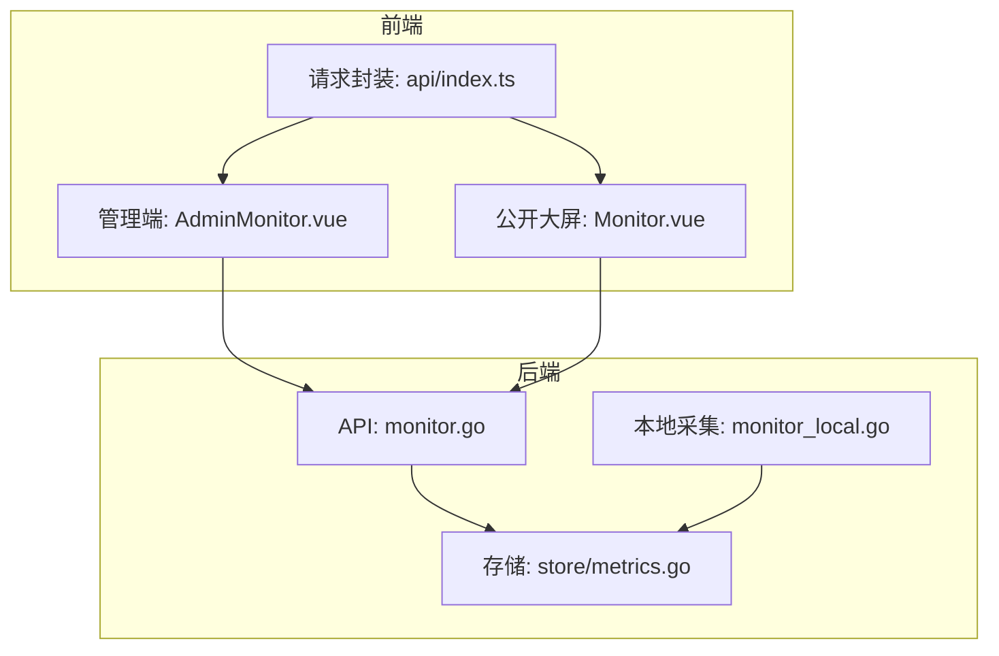
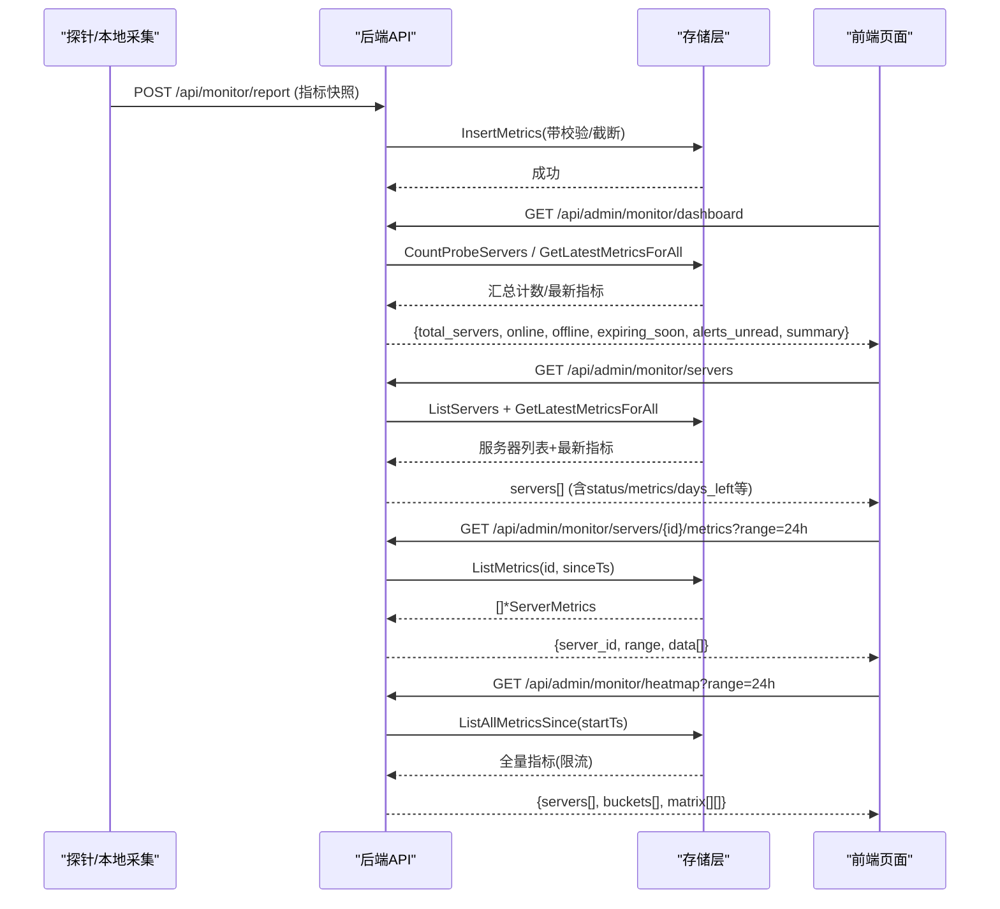
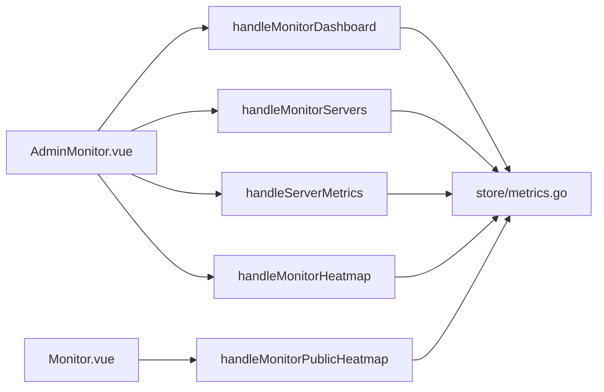

# 指标仪表板

<cite>
**本文引用的文件**
- [monitor.go](file://internal/api/monitor.go)
- [monitor_local.go](file://internal/api/monitor_local.go)
- [metrics.go](file://internal/store/metrics.go)
- [AdminMonitor.vue](file://frontend/src/views/AdminMonitor.vue)
- [Monitor.vue](file://frontend/src/views/Monitor.vue)
- [index.ts](file://frontend/src/api/index.ts)
</cite>

## 目录
1. [简介](#简介)
2. [项目结构](#项目结构)
3. [核心组件](#核心组件)
4. [架构总览](#架构总览)
5. [详细组件分析](#详细组件分析)
6. [依赖关系分析](#依赖关系分析)
7. [性能考虑](#性能考虑)
8. [故障排查指南](#故障排查指南)
9. [结论](#结论)
10. [附录：前端集成与图表渲染方案](#附录前端集成与图表渲染方案)

## 简介
本文件面向“指标仪表板”相关 API，覆盖以下能力：
- 服务器状态概览接口（handleMonitorDashboard）的数据结构与统计口径
- 服务器列表查询接口（handleMonitorServers）的返回字段、过滤逻辑与在线判定
- 性能指标历史查询接口（handleServerMetrics）的时间范围参数与数据格式
- 热力图接口（handleMonitorHeatmap / handleMonitorPublicHeatmap）的矩阵数据结构与时间分桶算法
- 前端集成示例与图表渲染方案（管理端与公开大屏）
- 实时数据更新策略与缓存要点

## 项目结构
后端监控相关代码集中在 internal/api 与 internal/store；前端在 frontend/src/views 提供管理端与公开大屏页面。

**图示来源**
- [monitor.go:183-428](file://internal/api/monitor.go#L183-L428)
- [monitor_local.go:34-130](file://internal/api/monitor_local.go#L34-L130)
- [metrics.go:9-33](file://internal/store/metrics.go#L9-L33)
- [AdminMonitor.vue:185-538](file://frontend/src/views/AdminMonitor.vue#L185-L538)
- [Monitor.vue:255-479](file://frontend/src/views/Monitor.vue#L255-L479)
- [index.ts:9-85](file://frontend/src/api/index.ts#L9-L85)

**章节来源**
- [monitor.go:183-428](file://internal/api/monitor.go#L183-L428)
- [monitor_local.go:34-130](file://internal/api/monitor_local.go#L34-L130)
- [metrics.go:9-33](file://internal/store/metrics.go#L9-L33)
- [AdminMonitor.vue:185-538](file://frontend/src/views/AdminMonitor.vue#L185-L538)
- [Monitor.vue:255-479](file://frontend/src/views/Monitor.vue#L255-L479)
- [index.ts:9-85](file://frontend/src/api/index.ts#L9-L85)

## 核心组件
- 服务器状态概览：handleMonitorDashboard
- 服务器列表：handleMonitorServers
- 指标历史：handleServerMetrics
- 热力图：handleMonitorHeatmap / handleMonitorPublicHeatmap
- 本地机器自采集：StartLocalMetrics / localMonitorServer
- 数据存储与聚合：store/metrics.go

**章节来源**
- [monitor.go:183-428](file://internal/api/monitor.go#L183-L428)
- [monitor_local.go:34-130](file://internal/api/monitor_local.go#L34-L130)
- [metrics.go:106-193](file://internal/store/metrics.go#L106-L193)

## 架构总览
监控数据由探针或本地采集器定时上报至服务端，写入数据库；前端通过 REST API 拉取最新快照、历史序列与聚合矩阵进行可视化。

**图示来源**
- [monitor.go:22-55](file://internal/api/monitor.go#L22-L55)
- [monitor.go:183-428](file://internal/api/monitor.go#L183-L428)
- [metrics.go:88-193](file://internal/store/metrics.go#L88-L193)

## 详细组件分析

### 服务器状态概览接口 handleMonitorDashboard
- 功能：返回面板全局监控概览，包括服务器总数、在线数、离线数、即将到期数、未读告警数以及资源使用汇总。
- 数据来源：
  - 服务器计数与在线/即将到期：CountProbeServers（仅探针启用服务器）
  - 本地机器补充：若本地机器有最新指标且满足在线窗口，则计入 total/online/expiring
  - 资源汇总：遍历所有探针服务器的最新指标，累加 CPU%、内存/磁盘已用与总量
- 响应字段（摘要）：
  - total_servers: 整数，包含本地机器的额外计数
  - online/offline: 在线/离线数量
  - expiring_soon: 3天内到期的探针服务器数量
  - alerts_unread: 未读告警条数
  - summary.total_cpu: 所有探针服务器CPU%之和
  - summary.total_mem_used/total_mem_total: 内存已用/总量之和
  - summary.total_disk_used/total_disk_total: 磁盘已用/总量之和
- 在线判定：last_seen 在“当前时间-2分钟”之内视为在线
- 即将到期判定：expiry_date 在当前时间与“当前时间+3天”之间

**章节来源**
- [monitor.go:183-241](file://internal/api/monitor.go#L183-L241)
- [monitor_local.go:87-118](file://internal/api/monitor_local.go#L87-L118)
- [metrics.go:195-208](file://internal/store/metrics.go#L195-L208)

### 服务器列表查询接口 handleMonitorServers
- 功能：返回全部服务器（含本地机器），用于管理端展示与探针管理。
- 过滤条件：
  - 无服务端过滤；前端支持按名称/位置/提供商搜索，以及按状态、位置、提供商筛选
  - 在线判定：last_seen >= now - 2分钟
- 返回字段（关键字段）：
  - id/name/host/local/enabled/probe_enabled/probe_token/public_visible/provider/location/spec/price
  - expiry_date/days_left/status/last_seen/metrics/notes
- 说明：
  - 本地机器会排在首位，便于管理员优先查看
  - days_left 为剩余天数（>=0）
  - metrics 仅在 probe_enabled 时附带最新指标

**章节来源**
- [monitor.go:243-321](file://internal/api/monitor.go#L243-L321)
- [AdminMonitor.vue:238-258](file://frontend/src/views/AdminMonitor.vue#L238-L258)

### 性能指标历史查询接口 handleServerMetrics
- 功能：获取指定服务器在指定时间范围内的指标历史序列。
- 时间范围参数：
  - range: 1h | 6h | 24h | 7d | 30d（默认 24h）
  - 内部转换为 since = now - duration，再查询 ts >= since 的记录
- 数据格式：
  - server_id: 服务器ID
  - range: 请求的 range 字符串
  - data: []*ServerMetrics（按时间正序返回，最多限制行数，避免大响应）
- 注意：
  - 单服务器查询会限制返回行数上限，防止高频探针导致响应过大

**章节来源**
- [monitor.go:323-360](file://internal/api/monitor.go#L323-L360)
- [metrics.go:136-158](file://internal/store/metrics.go#L136-L158)

### 热力图接口 handleMonitorHeatmap / handleMonitorPublicHeatmap
- 功能：生成“服务器×时间桶”的状态矩阵，用于可用性热力图展示。
- 时间范围参数：
  - range: 1h | 6h | 24h | 7d（默认 24h）
- 矩阵数据结构：
  - servers: 行定义（管理端含 id/name，公开端仅 name）
  - buckets: 时间桶起始时间戳数组（长度固定为列数）
  - matrix: 二维数组，matrix[row][col] 取值：
    - 0: 正常
    - 1: 高负载
    - 2: 离线/无数据
  - range/bucket_sec: 时间范围与每列时长（秒）
- 时间分桶算法：
  - 固定列数 cols=48
  - bucketSec = round(dur.Seconds() / cols)，最小为1
  - 将每个指标点映射到对应列 b = floor((ts - startTs) / bucketSec)
  - 对每个桶内同一服务器的指标计算 CPU%/内存%/磁盘% 占比，取最严重等级作为该单元格值
  - 无数据的桶初始化为哨兵值，最终统一折叠为 2（离线/无数据）
- 公开版与管理版差异：
  - 公开版仅返回服务器名称，不暴露 ID
  - 公开版仅包含 public_visible=true 的探针服务器

**章节来源**
- [monitor.go:375-428](file://internal/api/monitor.go#L375-L428)
- [monitor.go:541-647](file://internal/api/monitor.go#L541-L647)

### 本地机器自采集 StartLocalMetrics
- 功能：在不安装探针的情况下，直接读取本机系统指标并写入 metrics 表，使用专用 LocalNodeID。
- 采样间隔：30秒（与探针默认上报间隔一致）
- 写入字段：CPU、内存、交换分区、磁盘、网络速率、负载、TCP连接数、进程数、运行时长、主机名、平台、内核、架构
- 对外可见性：可通过设置控制是否在公开状态页显示本机

**章节来源**
- [monitor_local.go:34-70](file://internal/api/monitor_local.go#L34-L70)
- [monitor_local.go:87-118](file://internal/api/monitor_local.go#L87-L118)

### 数据模型 ServerMetrics
- 字段涵盖：CPU、内存、交换分区、磁盘、网络收发、负载、TCP连接数、进程数、运行时长、主机信息、平台与架构
- 安全处理：插入前对异常值进行截断（如负数归零、百分比限制在0-100、使用量不超过总量等）

**章节来源**
- [metrics.go:9-33](file://internal/store/metrics.go#L9-L33)
- [metrics.go:52-86](file://internal/store/metrics.go#L52-L86)

## 依赖关系分析
- API 层依赖存储层进行指标读写与聚合
- 本地采集模块独立于探针，但复用相同存储结构
- 前端通过统一的请求封装自动携带认证头，并在401时跳转登录

**图示来源**
- [AdminMonitor.vue:487-538](file://frontend/src/views/AdminMonitor.vue#L487-L538)
- [Monitor.vue:374-479](file://frontend/src/views/Monitor.vue#L374-L479)
- [monitor.go:183-428](file://internal/api/monitor.go#L183-L428)
- [metrics.go:106-193](file://internal/store/metrics.go#L106-L193)

**章节来源**
- [AdminMonitor.vue:487-538](file://frontend/src/views/AdminMonitor.vue#L487-L538)
- [Monitor.vue:374-479](file://frontend/src/views/Monitor.vue#L374-L479)
- [monitor.go:183-428](file://internal/api/monitor.go#L183-L428)
- [metrics.go:106-193](file://internal/store/metrics.go#L106-L193)

## 性能考虑
- 单次查询行数限制：
  - 单服务器历史查询限制最大返回行数，避免大响应阻塞
  - 热力图全量查询限制最大行数，防止匿名接口被滥用
- 聚合优化：
  - 使用一次查询获取所有服务器最新指标，避免 N+1 查询
  - 热力图采用固定列数与桶化聚合，降低前端渲染压力
- 本地采集与探针一致性：
  - 采样间隔对齐，保证数据分辨率一致，便于统一保留策略

[本节为通用性能建议，无需特定文件引用]

## 故障排查指南
- 探针上报失败：
  - 检查 Authorization 头是否携带有效 token
  - 确认服务器已启用探针且 token 匹配
- 指标缺失或异常：
  - 检查探针是否正常运行、网络连通性
  - 检查存储写入是否成功（日志中是否有错误）
  - 注意数据截断规则，异常值会被修正
- 热力图无数据：
  - 确认至少有一个探针服务器开启并上报
  - 检查 range 参数与时间窗口是否合理
- 前端鉴权问题：
  - 401 会自动登出并重定向到登录页
  - 确保请求路径正确，部分公开接口无需鉴权

**章节来源**
- [monitor.go:22-55](file://internal/api/monitor.go#L22-L55)
- [metrics.go:52-86](file://internal/store/metrics.go#L52-L86)
- [index.ts:28-47](file://frontend/src/api/index.ts#L28-L47)

## 结论
该指标仪表板通过探针与本地采集双通道汇聚系统指标，提供从概览、列表、历史到热力图的完整监控能力。后端以聚合与限流保障性能，前端以 ECharts 实现丰富的可视化体验。结合合理的刷新频率与缓存策略，可在多场景下稳定运行。

[本节为总结性内容，无需特定文件引用]

## 附录：前端集成与图表渲染方案

### 管理端集成（AdminMonitor.vue）
- 概览与列表：
  - 调用 /api/admin/monitor/dashboard 获取汇总卡片数据
  - 调用 /api/admin/monitor/servers 获取服务器列表与最新指标
- 历史趋势：
  - 调用 /api/admin/monitor/servers/{id}/metrics?range=... 获取时序数据
  - 使用 ECharts 折线图绘制 CPU、内存、网络上下行
- 热力图：
  - 调用 /api/admin/monitor/heatmap?range=... 获取矩阵
  - 使用 ECharts heatmap 渲染，Y轴为服务器，X轴为时间桶
- 刷新策略：
  - 页面加载后启动定时器，每30秒刷新一次概览与列表
  - 图表按需懒加载，首次只渲染前若干台服务器，点击切换范围时再加载
  - 窗口尺寸变化时触发图表 resize

**章节来源**
- [AdminMonitor.vue:487-538](file://frontend/src/views/AdminMonitor.vue#L487-L538)
- [AdminMonitor.vue:284-359](file://frontend/src/views/AdminMonitor.vue#L284-L359)
- [AdminMonitor.vue:445-485](file://frontend/src/views/AdminMonitor.vue#L445-L485)

### 公开大屏集成（Monitor.vue）
- 数据源：
  - 公开服务器列表：/api/monitor/public
  - 迷你趋势：/api/monitor/public/sparklines?range=1h
  - 热力图：/api/monitor/heatmap?range=...
- 刷新策略：
  - 每30秒轮询公开接口，保持大屏实时更新
  - 热力图根据用户选择的时间范围动态加载
- 渲染方案：
  - 使用 SVG 仪表盘与迷你面积图展示关键指标
  - 热力图同样基于 ECharts heatmap，颜色映射区分正常/高负载/离线

**章节来源**
- [Monitor.vue:374-479](file://frontend/src/views/Monitor.vue#L374-L479)
- [Monitor.vue:410-461](file://frontend/src/views/Monitor.vue#L410-L461)

### 请求封装与认证
- 自动注入 Authorization 头
- 401 时清除会话并跳转登录
- 列表接口统一返回数组，对象接口返回 data 字段

**章节来源**
- [index.ts:9-85](file://frontend/src/api/index.ts#L9-L85)
