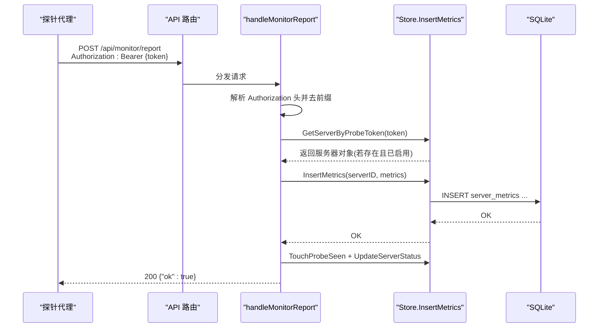
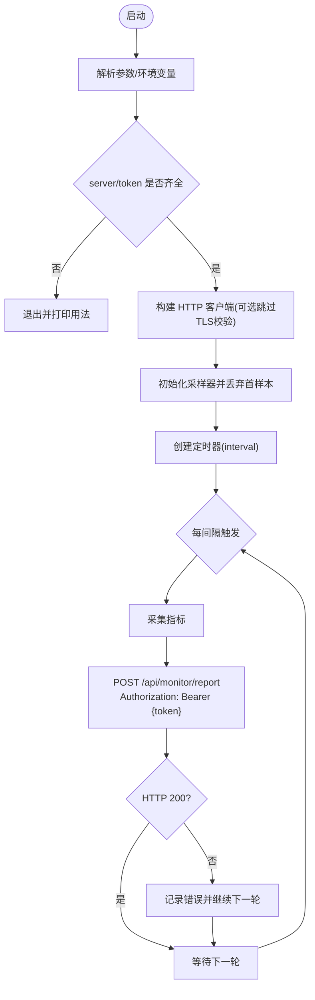
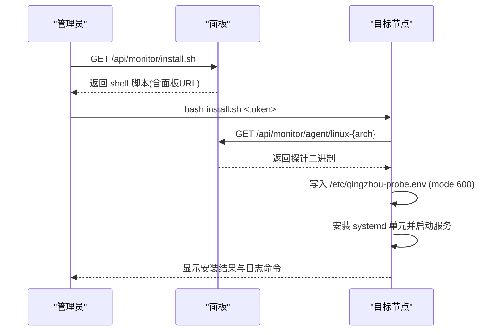
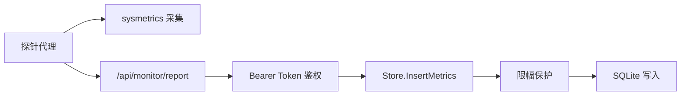

# 探针数据采集

<cite>
**本文引用的文件**
- [cmd/probe/main.go](file://cmd/probe/main.go)
- [internal/api/monitor.go](file://internal/api/monitor.go)
- [internal/api/monitor_local.go](file://internal/api/monitor_local.go)
- [internal/api/router.go](file://internal/api/router.go)
- [internal/sysmetrics/sysmetrics.go](file://internal/sysmetrics/sysmetrics.go)
- [internal/store/metrics.go](file://internal/store/metrics.go)
- [internal/idgen/idgen.go](file://internal/idgen/idgen.go)
- [internal/store/servers.go](file://internal/store/servers.go)
- [deploy/qingzhou.env.example](file://deploy/qingzhou.env.example)
- [docs/部署与配置手册.md](file://docs/部署与配置手册.md)
</cite>

## 目录
1. [简介](#简介)
2. [项目结构](#项目结构)
3. [核心组件](#核心组件)
4. [架构总览](#架构总览)
5. [详细组件分析](#详细组件分析)
6. [依赖关系分析](#依赖关系分析)
7. [性能考量](#性能考量)
8. [故障排查指南](#故障排查指南)
9. [结论](#结论)
10. [附录](#附录)

## 简介
本文件聚焦“探针数据采集”能力，覆盖探针代理的部署、配置、数据上报机制；详细说明 handleMonitorReport 接口的认证方式、数据格式和错误处理；解释探针二进制下载与安装流程（含一键脚本）；说明探针令牌（token）的生成与管理；提供完整的部署示例与故障排查指南；并给出探针状态监控与服务管理命令。

## 项目结构
探针采集由两部分组成：
- 探针代理（Linux 可执行文件）：定时采集系统指标并通过 HTTP POST 上报到面板。
- 面板端接口：接收探针上报、校验 token、持久化指标并提供监控查询与下载能力。

```mermaid
graph TB
subgraph "探针侧"
P["qingzhou-probe<br/>定时采集 /proc"]
end
subgraph "面板端"
R["路由注册<br/>/api/monitor/*"]
H["handleMonitorReport<br/>鉴权+落库"]
D["handleDownloadAgent<br/>提供二进制"]
I["handleDownloadInstallScript<br/>一键安装脚本"]
L["本地采样器<br/>StartLocalMetrics"]
end
DB["SQLite<br/>server_metrics 表"]
P --> |POST /api/monitor/report<br/>Authorization: Bearer {token}| R
R --> H
H --> DB
P --> |GET /api/monitor/agent/{arch}| D
P --> |GET /api/monitor/install.sh| I
L --> DB
```

图表来源
- [internal/api/router.go:164-170](file://internal/api/router.go#L164-L170)
- [internal/api/monitor.go:20-55](file://internal/api/monitor.go#L20-L55)
- [internal/api/monitor.go:57-73](file://internal/api/monitor.go#L57-L73)
- [internal/api/monitor.go:75-179](file://internal/api/monitor.go#L75-L179)
- [internal/api/monitor_local.go:33-70](file://internal/api/monitor_local.go#L33-L70)
- [internal/store/metrics.go:88-104](file://internal/store/metrics.go#L88-L104)

章节来源
- [internal/api/router.go:164-170](file://internal/api/router.go#L164-L170)
- [internal/api/monitor.go:20-179](file://internal/api/monitor.go#L20-L179)
- [internal/api/monitor_local.go:33-70](file://internal/api/monitor_local.go#L33-L70)

## 核心组件
- 探针代理进程：负责读取系统指标并周期性上报。
- 面板监控接口：负责鉴权、写入指标、更新在线状态。
- 指标存储层：对指标进行限幅保护与持久化。
- 本地采样器：面板自身也作为一台机器被监控，无需探针。
- 令牌生成与管理：启用探针时自动生成安全随机令牌。

章节来源
- [cmd/probe/main.go:34-92](file://cmd/probe/main.go#L34-L92)
- [internal/api/monitor.go:20-55](file://internal/api/monitor.go#L20-L55)
- [internal/store/metrics.go:52-104](file://internal/store/metrics.go#L52-L104)
- [internal/api/monitor_local.go:33-70](file://internal/api/monitor_local.go#L33-L70)
- [internal/api/monitor.go:667-779](file://internal/api/monitor.go#L667-L779)

## 架构总览
探针通过 HTTP 将 JSON 指标上报至面板，面板在写入前进行参数限幅，避免恶意或异常值影响仪表盘聚合。探针令牌基于服务器记录中的哈希匹配，确保即使数据库泄露也无法直接复用明文令牌。



图表来源
- [internal/api/router.go:164-168](file://internal/api/router.go#L164-L168)
- [internal/api/monitor.go:20-55](file://internal/api/monitor.go#L20-L55)
- [internal/store/metrics.go:88-104](file://internal/store/metrics.go#L88-L104)
- [internal/store/servers.go:158-167](file://internal/store/servers.go#L158-L167)

## 详细组件分析

### 探针代理（qingzhou-probe）
- 启动参数与环境变量
  - 支持命令行参数 -server、-token、-interval、-insecure。
  - 同时支持环境变量 QZ_PROBE_SERVER、QZ_PROBE_TOKEN（推荐用于 systemd EnvironmentFile）。
- 采集与上报
  - 使用 sysmetrics.Sampler 采集 CPU、内存、磁盘、网络、负载等指标。
  - 首次采样丢弃（因为 CPU/网络速度为差值），随后按 interval 周期上报。
  - 上报目标：{server}/api/monitor/report，Content-Type: application/json，Authorization: Bearer {token}。
- 安全提示
  - 命令行传入 -token 会暴露于 ps/proc，建议使用环境变量。
  - -insecure 跳过 TLS 证书校验，仅用于本地测试。



图表来源
- [cmd/probe/main.go:34-92](file://cmd/probe/main.go#L34-L92)
- [cmd/probe/main.go:94-118](file://cmd/probe/main.go#L94-L118)

章节来源
- [cmd/probe/main.go:27-92](file://cmd/probe/main.go#L27-L92)
- [cmd/probe/main.go:94-118](file://cmd/probe/main.go#L94-L118)

### 面板端：handleMonitorReport
- 认证方式
  - 从请求头 Authorization 提取 Bearer token，去除前缀并去空白。
  - 使用 GetServerByProbeToken 根据 token 查找服务器（数据库中存储的是 token 的哈希，匹配 probe_enabled=1 的记录）。
- 数据格式
  - 请求体为 JSON，映射到 store.ServerMetrics（字段见下方“数据模型”）。
- 处理逻辑
  - 校验失败返回 401/400/403/500。
  - 成功则写入指标、更新 last_seen、设置状态为 online，返回 200 {"ok": true}。
- 速率限制
  - 该组路由应用了 per-IP 的 rate limiter（默认 60 次/分钟）。

```mermaid
flowchart TD
A["收到 POST /api/monitor/report"] --> B["提取 Authorization 头并去前缀"]
B --> C{"token 是否为空"}
C -- 是 --> E["401 缺少认证 token"]
C -- 否 --> D["GetServerByProbeToken(token)"]
D --> F{"找到且启用?"}
F -- 否 --> G["403 无效 token 或未启用"]
F -- 是 --> H["解码 JSON 到 ServerMetrics"]
H --> I{"解码成功?"}
I -- 否 --> J["400 请求格式错误"]
I -- 是 --> K["InsertMetrics 写入(带限幅)"]
K --> L["TouchProbeSeen + UpdateServerStatus('online')"]
L --> M["200 {\"ok\": true}"]
```

图表来源
- [internal/api/monitor.go:20-55](file://internal/api/monitor.go#L20-L55)
- [internal/store/servers.go:158-167](file://internal/store/servers.go#L158-L167)
- [internal/store/metrics.go:52-104](file://internal/store/metrics.go#L52-L104)

章节来源
- [internal/api/monitor.go:20-55](file://internal/api/monitor.go#L20-L55)
- [internal/api/router.go:164-168](file://internal/api/router.go#L164-L168)
- [internal/store/servers.go:158-167](file://internal/store/servers.go#L158-L167)

### 指标数据模型
探针与面板共享同一份指标结构，JSON 标签与存储结构一致。关键字段包括：
- cpu_percent、mem_used、mem_total、swap_used、swap_total
- disk_used、disk_total、net_rx、net_tx
- load1、load5、load15
- tcp_connections、process_count、uptime
- hostname、platform、kernel、arch

面板在写入前会对数值进行限幅（clamp），防止负数或越界值污染仪表盘与热力图分类。

章节来源
- [internal/sysmetrics/sysmetrics.go:16-38](file://internal/sysmetrics/sysmetrics.go#L16-L38)
- [internal/store/metrics.go:9-33](file://internal/store/metrics.go#L9-L33)
- [internal/store/metrics.go:52-86](file://internal/store/metrics.go#L52-L86)

### 探针令牌（token）的生成与管理
- 生成时机
  - 当管理员在服务器上启用探针（probe_enabled=true）且当前无 token 时，系统自动生成一个 URL-safe 随机 token（约 24 字节熵）。
- 存储与验证
  - token 以加密形式存储，验证时使用其 SHA-256 哈希与数据库中的 probe_token_hash 匹配。
  - 只有 probe_enabled=1 的服务器才允许报告。
- 获取与使用
  - 管理员可在“监控管理”页面查看每台机器的探针 token，并在安装脚本中传入。

章节来源
- [internal/api/monitor.go:667-779](file://internal/api/monitor.go#L667-L779)
- [internal/idgen/idgen.go:42-49](file://internal/idgen/idgen.go#L42-L49)
- [internal/store/servers.go:158-167](file://internal/store/servers.go#L158-L167)

### 探针二进制下载与安装流程
- 二进制下载
  - 面板提供 /api/monitor/agent/{arch}，其中 arch 为 linux-amd64 或 linux-arm64。
  - 实际路径来自环境变量 QZ_PROBE_DIR（默认相对路径 cmd/probe/dist）。
- 一键安装脚本
  - 面板提供 /api/monitor/install.sh，动态注入面板地址并输出脚本。
  - 脚本步骤：
    1) 检测架构并下载对应二进制到临时文件，成功后原子替换到 /usr/local/bin/qingzhou-probe。
    2) 创建 /etc/qingzhou-probe.env（mode 600），写入 QZ_PROBE_SERVER 与 QZ_PROBE_TOKEN。
    3) 创建 systemd 单元 qingzhou-probe.service，指定 EnvironmentFile 并设置重启策略。
    4) 启动服务并检查运行状态，提供日志查看命令。
- 注意事项
  - 二进制部署时需确保 QZ_PROBE_DIR 指向包含探针二进制的目录，否则安装会 404。
  - 安装脚本优先使用 curl，回退 wget；若无两者则报错退出。



图表来源
- [internal/api/monitor.go:57-73](file://internal/api/monitor.go#L57-L73)
- [internal/api/monitor.go:75-179](file://internal/api/monitor.go#L75-L179)
- [deploy/qingzhou.env.example:15-19](file://deploy/qingzhou.env.example#L15-L19)

章节来源
- [internal/api/monitor.go:57-179](file://internal/api/monitor.go#L57-L179)
- [deploy/qingzhou.env.example:15-19](file://deploy/qingzhou.env.example#L15-L19)
- [docs/部署与配置手册.md:210-221](file://docs/部署与配置手册.md#L210-L221)

### 面板本地监控（无需探针）
- 面板自身也作为一台机器被监控，直接调用 sysmetrics 采集并写入 store.LocalNodeID。
- 不依赖探针二进制、token 或 systemd 单元。
- 可通过设置控制是否在公共状态页展示本机。

章节来源
- [internal/api/monitor_local.go:12-20](file://internal/api/monitor_local.go#L12-L20)
- [internal/api/monitor_local.go:33-70](file://internal/api/monitor_local.go#L33-L70)
- [internal/api/monitor_local.go:72-118](file://internal/api/monitor_local.go#L72-L118)

## 依赖关系分析
- 探针代理依赖 sysmetrics 采集指标，并通过 HTTP 上报。
- 面板路由将 /api/monitor/report 绑定到 handleMonitorReport，并应用 per-IP 速率限制。
- 指标写入前经过 clamp 限幅，保证数据合理性。
- 令牌验证基于哈希匹配，增强安全性。



图表来源
- [cmd/probe/main.go:24-25](file://cmd/probe/main.go#L24-L25)
- [internal/api/router.go:164-168](file://internal/api/router.go#L164-L168)
- [internal/store/metrics.go:52-104](file://internal/store/metrics.go#L52-L104)

章节来源
- [internal/api/router.go:164-168](file://internal/api/router.go#L164-L168)
- [internal/store/metrics.go:52-104](file://internal/store/metrics.go#L52-L104)

## 性能考量
- 采集频率：探针默认 30 秒一次，最小 5 秒；面板本地采样固定 30 秒。
- 数据限幅：写入前对 CPU%、内存/交换/磁盘用量、网络流量等进行边界约束，避免异常值放大。
- 查询优化：最新指标采用单查询聚合（GetLatestMetricsForAll），历史查询限制行数（ListMetrics 上限 5000），热力图聚合限制最大行数（maxHeatmapRows=200000）。
- 速率限制：探针上报接口按 IP 限速（60 次/分钟），防止滥用。

章节来源
- [cmd/probe/main.go:52-55](file://cmd/probe/main.go#L52-L55)
- [internal/api/monitor_local.go:22-25](file://internal/api/monitor_local.go#L22-L25)
- [internal/store/metrics.go:136-193](file://internal/store/metrics.go#L136-L193)
- [internal/api/router.go:94-105](file://internal/api/router.go#L94-L105)

## 故障排查指南
- 无法下载探针二进制
  - 确认 QZ_PROBE_DIR 已设置为包含探针二进制的绝对路径，并确保文件名不变。
  - 检查面板对外访问地址（QZ_PUBLIC_BASE）是否正确，安装脚本会使用该地址拼接下载 URL。
- 安装后服务未运行
  - 查看 systemd 日志：journalctl -u qingzhou-probe -n 20 --no-pager
  - 检查环境文件权限与内容：/etc/qingzhou-probe.env（mode 600）
- 上报失败
  - 检查 Authorization 头是否正确携带 Bearer token。
  - 确认服务器已启用探针（probe_enabled=1）且 token 有效。
  - 查看面板日志与数据库写入情况。
- 仪表盘无数据
  - 确认探针进程正在运行且能访问面板 HTTPS 地址。
  - 检查网络连通性与防火墙规则。
- 本地监控无数据
  - 非 Linux 平台可能不支持 /proc 采集；面板会静默跳过。

章节来源
- [internal/api/monitor.go:57-73](file://internal/api/monitor.go#L57-L73)
- [internal/api/monitor.go:75-179](file://internal/api/monitor.go#L75-L179)
- [internal/api/monitor.go:20-55](file://internal/api/monitor.go#L20-L55)
- [internal/api/monitor_local.go:33-70](file://internal/api/monitor_local.go#L33-L70)

## 结论
探针采集方案通过轻量级代理与面板端严格鉴权与限幅，实现了跨多服务器的系统指标统一收集与可视化。令牌基于哈希匹配提升安全性，一键安装脚本简化部署，配合面板内置的监控与告警能力，形成完整的可观测性闭环。

## 附录

### 完整部署示例
- 在面板“监控管理”页面获取安装命令，形如：
  - bash <(curl -sL https://<面板域名>/api/monitor/install.sh) <探针Token>
- 若需手动配置：
  - 将探针二进制放入 QZ_PROBE_DIR 指定目录。
  - 在目标节点创建 /etc/qingzhou-probe.env，写入 QZ_PROBE_SERVER 与 QZ_PROBE_TOKEN。
  - 创建 systemd 单元并启动服务。

章节来源
- [docs/部署与配置手册.md:210-221](file://docs/部署与配置手册.md#L210-L221)
- [internal/api/monitor.go:75-179](file://internal/api/monitor.go#L75-L179)

### 探针状态监控与服务管理命令
- 查看服务状态：systemctl status qingzhou-probe
- 启动/停止/重启：systemctl start/stop/restart qingzhou-probe
- 开机自启：systemctl enable qingzhou-probe
- 查看实时日志：journalctl -u qingzhou-probe -f
- 卸载清理：systemctl disable --now qingzhou-probe && rm /usr/local/bin/qingzhou-probe /etc/qingzhou-probe.env /etc/systemd/system/qingzhou-probe.service

章节来源
- [internal/api/monitor.go:75-179](file://internal/api/monitor.go#L75-L179)
