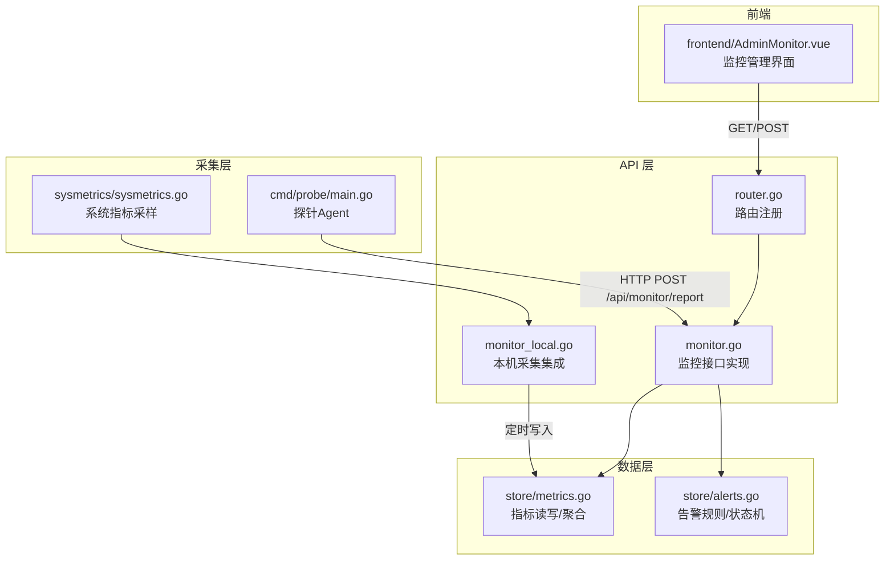
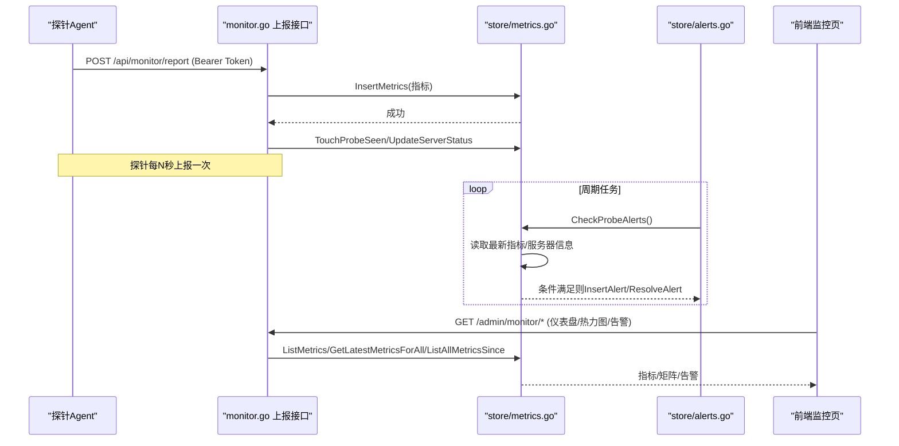
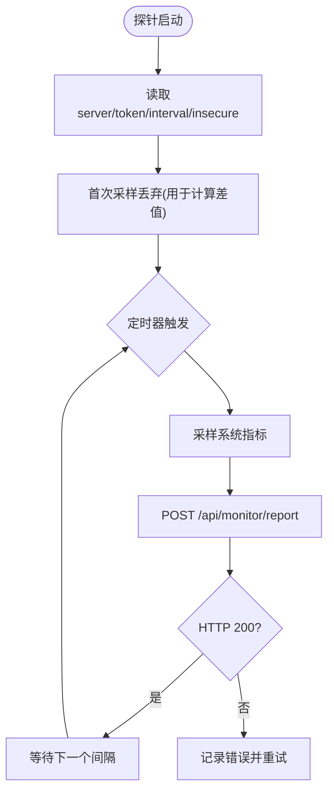
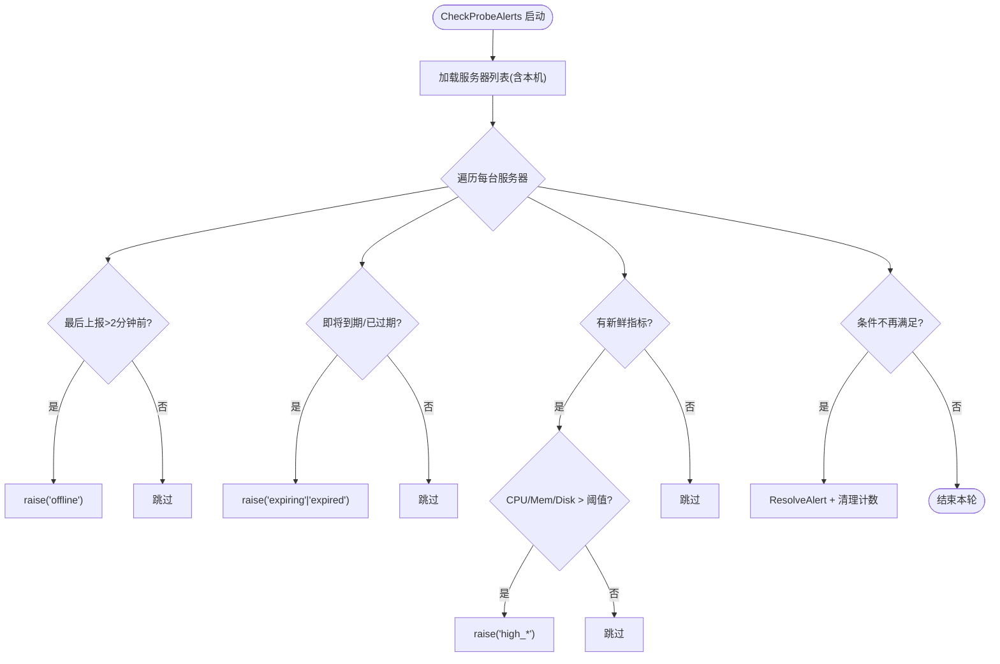
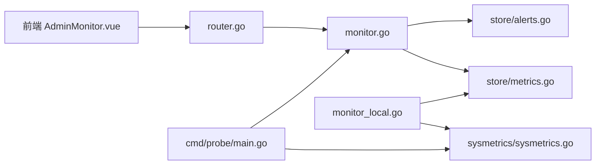

# 监控API

<cite>
**本文引用的文件**
- [monitor.go](file://internal/api/monitor.go)
- [monitor_local.go](file://internal/api/monitor_local.go)
- [router.go](file://internal/api/router.go)
- [alerts.go](file://internal/store/alerts.go)
- [metrics.go](file://internal/store/metrics.go)
- [sysmetrics.go](file://internal/sysmetrics/sysmetrics.go)
- [main.go（探针）](file://cmd/probe/main.go)
- [AdminMonitor.vue](file://frontend/src/views/AdminMonitor.vue)
</cite>

## 目录
1. [简介](#简介)
2. [项目结构](#项目结构)
3. [核心组件](#核心组件)
4. [架构总览](#架构总览)
5. [详细组件分析](#详细组件分析)
6. [依赖关系分析](#依赖关系分析)
7. [性能与容量特性](#性能与容量特性)
8. [故障排查指南](#故障排查指南)
9. [结论](#结论)
10. [附录：接口参考与示例](#附录接口参考与示例)

## 简介
本文件为“轻舟”面板的监控系统 API 完整参考，覆盖以下能力：
- 探针数据采集与上报机制（含本地采集）
- 性能指标存储、查询与可视化
- 告警规则、状态聚合与通知入口
- 统计报表与热力图
- 实时监控与历史数据分析
- 面向运维人员的接口清单与调用示例

## 项目结构
监控相关代码主要分布在以下模块：
- API 层：路由注册与 HTTP 处理逻辑
- Store 层：指标与告警的数据存取、阈值判定、聚合计算
- Sysmetrics：系统指标采样（CPU/内存/磁盘/网络/负载等）
- 探针 Agent：独立二进制，周期性采集并上报
- 前端：监控管理页面、热力图、迷你趋势图

图表来源
- [router.go:164-175](file://internal/api/router.go#L164-L175)
- [monitor.go:22-55](file://internal/api/monitor.go#L22-L55)
- [monitor_local.go:34-70](file://internal/api/monitor_local.go#L34-L70)
- [metrics.go:88-104](file://internal/store/metrics.go#L88-L104)
- [alerts.go:247-356](file://internal/store/alerts.go#L247-L356)
- [sysmetrics.go:16-38](file://internal/sysmetrics/sysmetrics.go#L16-L38)
- [main.go（探针）:34-91](file://cmd/probe/main.go#L34-L91)

章节来源
- [router.go:164-175](file://internal/api/router.go#L164-L175)
- [monitor.go:22-55](file://internal/api/monitor.go#L22-L55)
- [monitor_local.go:34-70](file://internal/api/monitor_local.go#L34-L70)
- [metrics.go:88-104](file://internal/store/metrics.go#L88-L104)
- [alerts.go:247-356](file://internal/store/alerts.go#L247-L356)
- [sysmetrics.go:16-38](file://internal/sysmetrics/sysmetrics.go#L16-L38)
- [main.go（探针）:34-91](file://cmd/probe/main.go#L34-L91)

## 核心组件
- 探针上报接口：接收探针通过 Bearer Token 认证的指标上报，校验 token、落库、更新在线状态。
- 本机采集：面板直接读取系统指标，按固定间隔写入同一指标表，统一视图。
- 指标存储与查询：支持单服务器时间序列、全量最新快照、按范围聚合、限制返回行数防放大。
- 告警引擎：基于最近一次指标与过期时间判断离线/CPU/内存/磁盘/到期等告警；支持连续触发次数配置与静默窗口。
- 热力图与公开看板：将指标按时间桶聚合为矩阵，提供管理员与公开两种视图。
- 安装脚本与探针下载：一键安装脚本与多架构探针二进制分发。

章节来源
- [monitor.go:22-55](file://internal/api/monitor.go#L22-L55)
- [monitor.go:57-179](file://internal/api/monitor.go#L57-L179)
- [monitor_local.go:34-70](file://internal/api/monitor_local.go#L34-L70)
- [metrics.go:106-193](file://internal/store/metrics.go#L106-L193)
- [alerts.go:247-356](file://internal/store/alerts.go#L247-L356)

## 架构总览
监控数据流从探针或本机采集开始，经 API 层持久化到数据库，再由查询接口供前端渲染仪表盘、热力图与告警列表。告警引擎周期性扫描服务器与指标，生成或关闭告警事件。

图表来源
- [monitor.go:22-55](file://internal/api/monitor.go#L22-L55)
- [metrics.go:88-104](file://internal/store/metrics.go#L88-L104)
- [alerts.go:247-356](file://internal/store/alerts.go#L247-L356)
- [router.go:315-322](file://internal/api/router.go#L315-L322)

## 详细组件分析

### 探针数据采集与上报
- 认证方式：Authorization: Bearer <probe_token>，服务端根据 token 查找服务器并校验启用状态。
- 数据模型：与服务端 store.ServerMetrics 一致，包含 CPU/内存/磁盘/网络/负载/TCP/进程数/运行时长/主机信息等。
- 安全与限流：上报接口受 IP 级速率限制；指标写入前进行数值裁剪，防止恶意或异常探针污染仪表板。
- 探针安装：提供一键安装脚本与多架构二进制下载，自动创建 systemd 服务与环境变量。

图表来源
- [main.go（探针）:34-91](file://cmd/probe/main.go#L34-L91)
- [monitor.go:22-55](file://internal/api/monitor.go#L22-L55)
- [metrics.go:52-86](file://internal/store/metrics.go#L52-L86)

章节来源
- [main.go（探针）:34-91](file://cmd/probe/main.go#L34-L91)
- [monitor.go:22-55](file://internal/api/monitor.go#L22-L55)
- [metrics.go:52-86](file://internal/store/metrics.go#L52-L86)

### 本机采集（无需探针）
- 面板在 Linux 上直接读取 /proc 获取系统指标，按 30 秒间隔写入指标表，使用特殊 LocalNodeID 标识。
- 本机不参与 servers 行管理，但会出现在所有监控列表中，且可控制是否在公开状态页显示。
- 告警引擎同样对待本机，确保面板自身资源耗尽也能被感知。

章节来源
- [monitor_local.go:34-70](file://internal/api/monitor_local.go#L34-L70)
- [monitor_local.go:79-131](file://internal/api/monitor_local.go#L79-L131)
- [alerts.go:229-245](file://internal/store/alerts.go#L229-L245)

### 指标存储与查询
- 写入：InsertMetrics 对输入进行裁剪，避免负数或越界值影响聚合。
- 最新快照：GetLatestMetricsForAll 单次查询每个服务器的最新一行，避免 N+1 问题。
- 时间序列：ListMetrics 限制最大返回行数，防止大区间高频上报导致响应过大。
- 全量历史：ListAllMetricsSince 用于热力图聚合，限制最大行数以保护匿名接口。

章节来源
- [metrics.go:88-104](file://internal/store/metrics.go#L88-L104)
- [metrics.go:106-193](file://internal/store/metrics.go#L106-L193)

### 告警规则与状态机
- 告警类型：offline、high_cpu、high_mem、disk_full、expiring、expired。
- 连续触发：flappy 类型需连续多次检查仍成立才触发，避免瞬时抖动误报。
- 静默窗口：已确认但未恢复的告警在一天内不再重复提醒。
- 自动恢复：当条件不再满足时自动关闭告警。
- 阈值配置：CPU/内存/磁盘阈值可通过设置项调整。

图表来源
- [alerts.go:247-356](file://internal/store/alerts.go#L247-L356)

章节来源
- [alerts.go:10-43](file://internal/store/alerts.go#L10-L43)
- [alerts.go:131-170](file://internal/store/alerts.go#L131-L170)
- [alerts.go:247-356](file://internal/store/alerts.go#L247-L356)

### 热力图与公开看板
- 管理员热力图：返回服务器×时间桶的状态矩阵，支持 1h/6h/24h/7d 范围。
- 公开热力图：仅返回服务器名称，隐藏敏感信息。
- 公共迷你趋势：按服务器维度返回 CPU/上下行带宽的降采样曲线，用于公开状态页。

章节来源
- [monitor.go:375-428](file://internal/api/monitor.go#L375-L428)
- [monitor.go:430-526](file://internal/api/monitor.go#L430-L526)
- [monitor.go:528-647](file://internal/api/monitor.go#L528-L647)

### 安装脚本与探针下载
- 安装脚本：自动生成探针二进制下载 URL、环境配置文件与 systemd 单元，并启动服务。
- 探针下载：根据架构参数提供 linux-amd64 或 linux-arm64 二进制。

章节来源
- [monitor.go:57-179](file://internal/api/monitor.go#L57-L179)

## 依赖关系分析
- API 层依赖 store 层完成指标与告警的读写；monitor_local 依赖 sysmetrics 进行本机采样。
- 探针依赖 sysmetrics 进行指标采集，并通过 HTTP 上报至 API。
- 前端通过路由暴露的接口获取监控数据，渲染仪表盘、热力图与告警列表。

图表来源
- [router.go:164-175](file://internal/api/router.go#L164-L175)
- [monitor.go:22-55](file://internal/api/monitor.go#L22-L55)
- [monitor_local.go:34-70](file://internal/api/monitor_local.go#L34-L70)
- [metrics.go:88-104](file://internal/store/metrics.go#L88-L104)
- [alerts.go:247-356](file://internal/store/alerts.go#L247-L356)
- [sysmetrics.go:16-38](file://internal/sysmetrics/sysmetrics.go#L16-L38)
- [main.go（探针）:34-91](file://cmd/probe/main.go#L34-L91)

章节来源
- [router.go:164-175](file://internal/api/router.go#L164-L175)
- [monitor.go:22-55](file://internal/api/monitor.go#L22-L55)
- [monitor_local.go:34-70](file://internal/api/monitor_local.go#L34-L70)
- [metrics.go:88-104](file://internal/store/metrics.go#L88-L104)
- [alerts.go:247-356](file://internal/store/alerts.go#L247-L356)
- [sysmetrics.go:16-38](file://internal/sysmetrics/sysmetrics.go#L16-L38)
- [main.go（探针）:34-91](file://cmd/probe/main.go#L34-L91)

## 性能与容量特性
- 指标写入裁剪：拒绝非法值，避免仪表板失真。
- 查询限制：ListMetrics 限制最大返回行数；ListAllMetricsSince 限制最大行数，保护匿名接口。
- 最新快照优化：GetLatestMetricsForAll 使用单次聚合查询，减少 N+1 问题。
- 热力图聚合：固定列数（48 列），按时间桶取最大值，降低前端渲染压力。
- 告警去抖：连续触发次数与静默窗口减少告警风暴。

章节来源
- [metrics.go:52-86](file://internal/store/metrics.go#L52-L86)
- [metrics.go:136-193](file://internal/store/metrics.go#L136-L193)
- [monitor.go:528-647](file://internal/api/monitor.go#L528-L647)
- [alerts.go:45-112](file://internal/store/alerts.go#L45-L112)

## 故障排查指南
- 探针无法上报
  - 检查 Authorization 头是否携带有效 token
  - 检查网络连通性与 TLS 配置（insecure 仅用于测试）
  - 查看服务端日志中的 rate limit 与解析错误
- 指标不更新
  - 确认探针进程存活与 systemd 服务状态
  - 检查面板本机采集是否支持当前平台
  - 核对指标写入是否被裁剪为 0（异常值）
- 告警不触发
  - 检查连续触发次数配置是否过高
  - 确认服务器 last_seen 是否超过离线判定窗口
  - 查看阈值配置是否合理
- 热力图为空
  - 确认 range 参数与时间范围
  - 检查是否有探针-enabled 服务器
  - 验证 ListAllMetricsSince 是否返回数据

章节来源
- [monitor.go:22-55](file://internal/api/monitor.go#L22-L55)
- [monitor.go:375-428](file://internal/api/monitor.go#L375-L428)
- [alerts.go:247-356](file://internal/store/alerts.go#L247-L356)
- [metrics.go:136-193](file://internal/store/metrics.go#L136-L193)

## 结论
本监控系统通过探针与本机双通道采集，结合严格的指标裁剪、查询限制与告警去抖策略，提供了稳定可靠的性能观测与告警能力。管理员与用户均可通过公开或受保护的接口获取实时与历史数据，支撑运维决策与对外透明展示。

## 附录：接口参考与示例

### 路由总览（监控相关）
- 探针上报（限流、Token 认证）
  - POST /api/monitor/report
- 探针安装与下载
  - GET /api/monitor/agent/{arch}
  - GET /api/monitor/install.sh
- 公开监控（无需登录）
  - GET /api/monitor/public
  - GET /api/monitor/public/sparklines
  - GET /api/monitor/heatmap
- 管理员监控（需登录+管理员权限）
  - GET /api/admin/monitor/dashboard
  - GET /api/admin/monitor/servers
  - GET /api/admin/monitor/servers/{id}/metrics?range=1h|6h|24h|7d|30d
  - GET /api/admin/monitor/heatmap?range=1h|6h|24h|7d
  - GET /api/admin/monitor/alerts?unread=1
  - POST /api/admin/monitor/alerts/{id}/read
  - POST /api/admin/monitor/alerts/read-all
  - PUT /api/admin/servers/{id}/monitor

章节来源
- [router.go:164-175](file://internal/api/router.go#L164-L175)
- [router.go:315-322](file://internal/api/router.go#L315-L322)

### 探针上报接口
- 方法：POST
- 路径：/api/monitor/report
- 认证：Authorization: Bearer <probe_token>
- 请求体：JSON，字段与 store.ServerMetrics 一致
- 响应：成功返回 ok=true；失败返回错误码与消息
- 行为：写入指标、更新探针可见时间、标记服务器在线

章节来源
- [monitor.go:22-55](file://internal/api/monitor.go#L22-L55)

### 指标查询接口
- 服务器指标历史
  - 方法：GET
  - 路径：/api/admin/monitor/servers/{id}/metrics
  - 参数：range=1h|6h|24h|7d|30d（默认 24h）
  - 响应：包含 server_id、range、data（指标数组）
- 全部服务器最新指标
  - 方法：GET
  - 路径：/api/admin/monitor/dashboard
  - 响应：汇总统计与服务器列表（含最新指标）

章节来源
- [monitor.go:323-360](file://internal/api/monitor.go#L323-L360)
- [monitor.go:183-241](file://internal/api/monitor.go#L183-L241)

### 热力图接口
- 管理员热力图
  - 方法：GET
  - 路径：/api/admin/monitor/heatmap
  - 参数：range=1h|6h|24h|7d（默认 24h）
  - 响应：servers、buckets、matrix、range、bucket_sec
- 公开热力图
  - 方法：GET
  - 路径：/api/monitor/heatmap
  - 参数：同上
  - 响应：仅服务器名称

章节来源
- [monitor.go:375-428](file://internal/api/monitor.go#L375-L428)
- [monitor.go:528-647](file://internal/api/monitor.go#L528-L647)

### 告警接口
- 获取告警
  - 方法：GET
  - 路径：/api/admin/monitor/alerts
  - 参数：unread=1（仅未读）
  - 响应：告警数组
- 标记已读
  - 方法：POST
  - 路径：/api/admin/monitor/alerts/{id}/read
- 全部标记已读
  - 方法：POST
  - 路径：/api/admin/monitor/alerts/read-all

章节来源
- [monitor.go:362-373](file://internal/api/monitor.go#L362-L373)
- [monitor.go:649-665](file://internal/api/monitor.go#L649-L665)
- [alerts.go:172-216](file://internal/store/alerts.go#L172-L216)

### 服务器监控配置
- 更新服务器监控属性
  - 方法：PUT
  - 路径：/api/admin/servers/{id}/monitor
  - 请求体：可选字段 probe_enabled、public_visible、expiry_date、provider、location、spec、price、notes
  - 行为：启用探针时自动生成 token；本机通过设置项控制公开可见性

章节来源
- [monitor.go:667-779](file://internal/api/monitor.go#L667-L779)

### 探针安装与下载
- 下载探针二进制
  - 方法：GET
  - 路径：/api/monitor/agent/{arch}
  - 参数：arch=linux-amd64|linux-arm64
- 下载一键安装脚本
  - 方法：GET
  - 路径：/api/monitor/install.sh
  - 用法：bash <(curl -sL <panel>/api/monitor/install.sh) <probe_token>

章节来源
- [monitor.go:57-179](file://internal/api/monitor.go#L57-L179)

### 前端交互要点
- 监控管理页展示仪表盘、热力图、告警条与服务器卡片
- 支持筛选、搜索、编辑资产信息、切换公开可见性
- 点击服务器进入详情查看历史趋势

章节来源
- [AdminMonitor.vue:1-200](file://frontend/src/views/AdminMonitor.vue#L1-L200)
