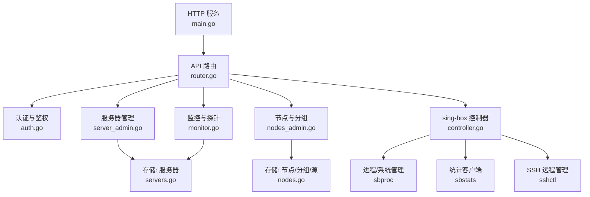
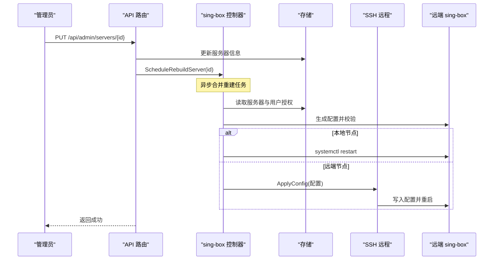
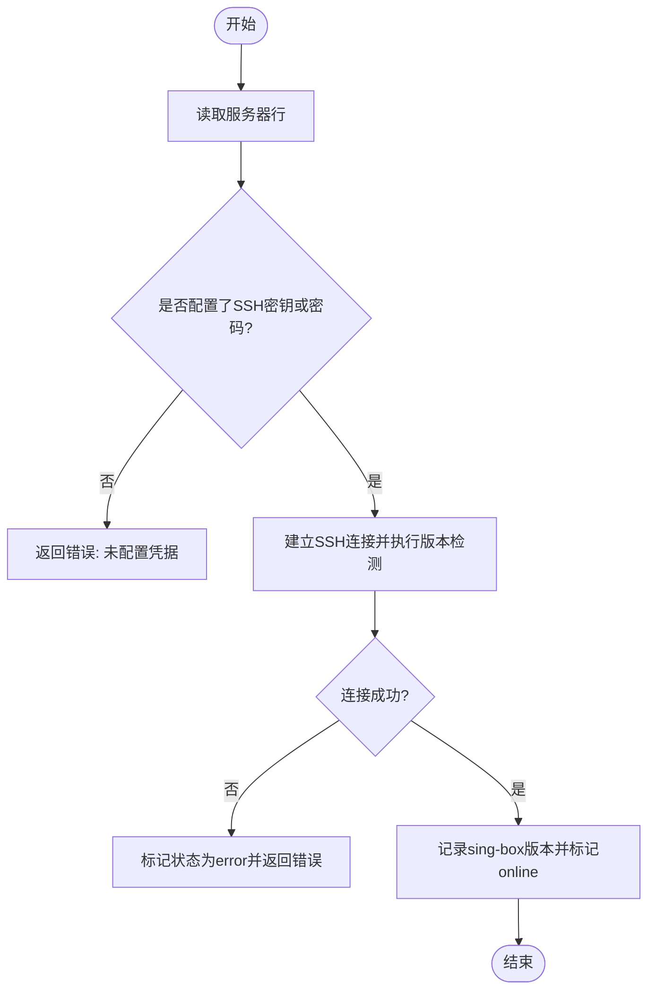
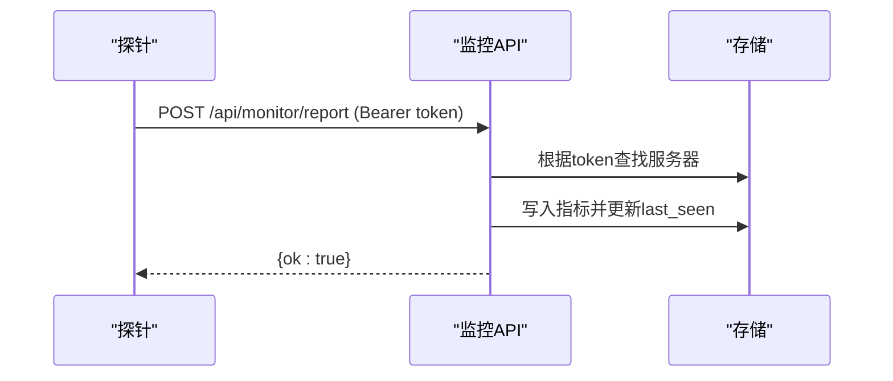
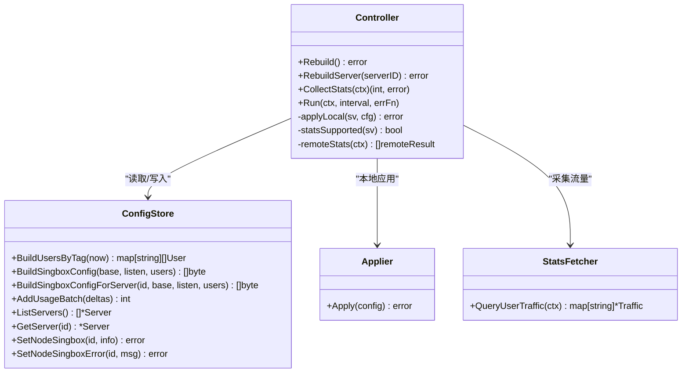
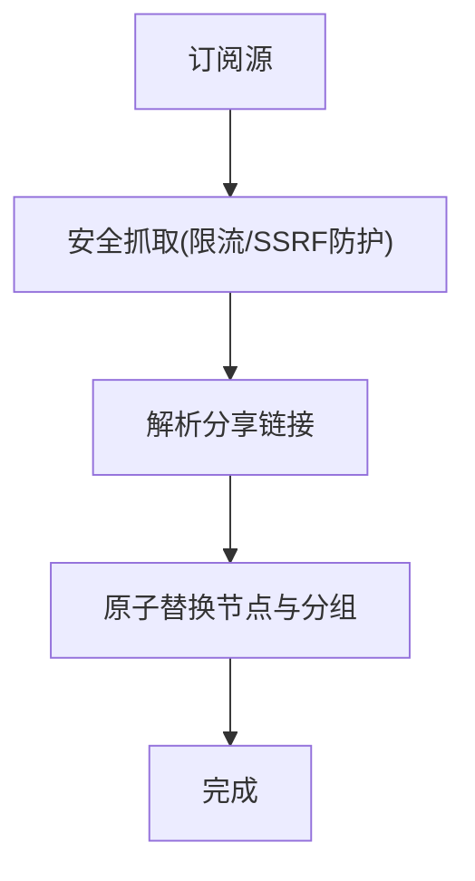
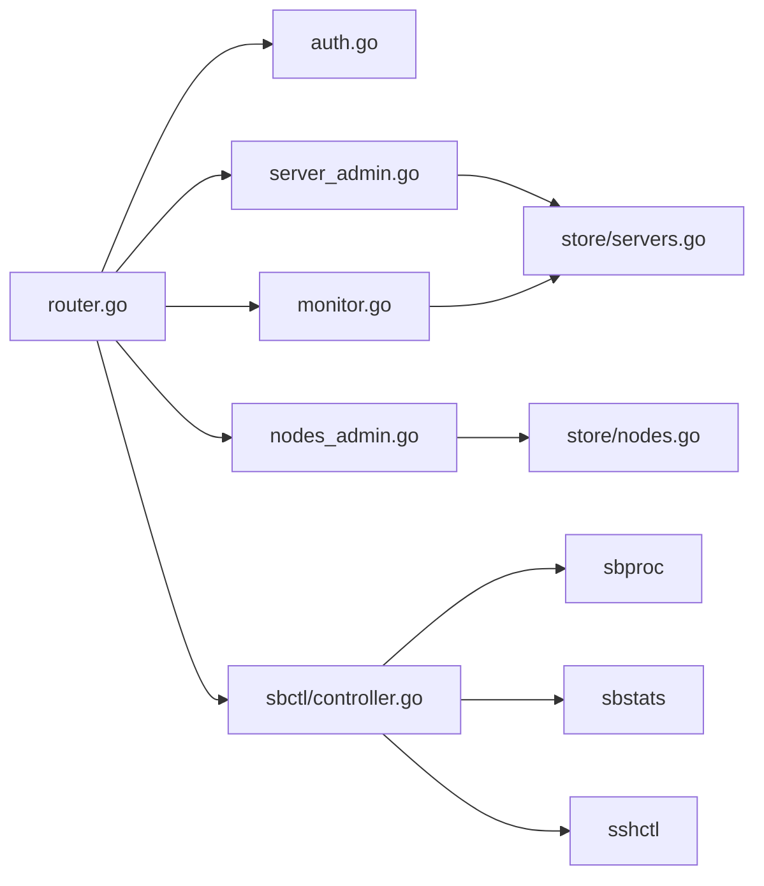

# 服务器管理

<cite>
**本文引用的文件**
- [main.go](file://main.go)
- [router.go](file://internal/api/router.go)
- [config.go](file://internal/config/config.go)
- [server_admin.go](file://internal/api/server_admin.go)
- [servers.go](file://internal/store/servers.go)
- [monitor.go](file://internal/api/monitor.go)
- [auth.go](file://internal/api/auth.go)
- [controller.go](file://internal/sbctl/controller.go)
- [nodes.go](file://internal/store/nodes.go)
- [nodes_admin.go](file://internal/api/nodes_admin.go)
</cite>

## 目录
1. [简介](#简介)
2. [项目结构](#项目结构)
3. [核心组件](#核心组件)
4. [架构总览](#架构总览)
5. [详细组件分析](#详细组件分析)
6. [依赖关系分析](#依赖关系分析)
7. [性能与容量规划](#性能与容量规划)
8. [故障排查指南](#故障排查指南)
9. [结论](#结论)
10. [附录：管理员API参考](#附录管理员api参考)

## 简介
本文件面向系统管理员，提供“轻舟”面板的服务器管理能力说明。内容覆盖多节点 sing-box 集群的注册、配置、监控、维护接口；资源管理与扩展策略；负载均衡与故障转移思路；节点间通信协议、数据同步机制与安全认证；并提供完整的管理员 API 参考路径与调用要点。

## 项目结构
- Web 服务入口负责加载配置、初始化存储、启动邮件、sing-box 控制器、定时任务与 HTTP 服务。
- API 路由集中定义公开、用户与管理端点，按权限分组。
- 存储层封装服务器、节点、指标、告警等数据的持久化与加解密。
- sing-box 控制器负责配置生成、校验、下发（本地或远程 SSH）、统计采集与周期重建。
- 监控探针通过专用接口上报指标，支持一键安装脚本与 systemd 托管。

**图表来源**
- [main.go:25-142](file://main.go#L25-L142)
- [router.go:132-387](file://internal/api/router.go#L132-L387)
- [server_admin.go:39-302](file://internal/api/server_admin.go#L39-L302)
- [monitor.go:22-179](file://internal/api/monitor.go#L22-L179)
- [nodes_admin.go:19-354](file://internal/api/nodes_admin.go#L19-L354)
- [controllers.go:357-699](file://internal/sbctl/controller.go#L357-L699)

**章节来源**
- [main.go:25-142](file://main.go#L25-L142)
- [router.go:132-387](file://internal/api/router.go#L132-L387)

## 核心组件
- 配置与启动：监听地址、数据库路径、管理员账号由环境变量注入；首次运行自动创建管理员并记录密码提示。
- 安全与会话：JWT 会话绑定 IP/UA，支持登出撤销；登录失败防枚举；受信任代理才信任转发头。
- 服务器管理：CRUD 远端 sing-box 节点，SSH 连接测试、主机密钥固定与恢复、单节点重建。
- 监控探针：Token 鉴权的指标上报、公共监控视图、热力图、迷你折线；一键安装脚本与 systemd 服务。
- sing-box 控制器：周期性收集流量、生成配置、校验并应用（本地/systemd 或 SSH），并发下发，能力探测与缓存。
- 节点与分组：自构建/外部节点、分组、订阅源抓取与同步，用于订阅与入站映射。

**章节来源**
- [config.go:5-29](file://internal/config/config.go#L5-L29)
- [auth.go:17-241](file://internal/api/auth.go#L17-L241)
- [server_admin.go:21-302](file://internal/api/server_admin.go#L21-L302)
- [monitor.go:22-179](file://internal/api/monitor.go#L22-L179)
- [controller.go:60-141](file://internal/sbctl/controller.go#L60-L141)
- [nodes.go:11-160](file://internal/store/nodes.go#L11-L160)
- [nodes_admin.go:19-354](file://internal/api/nodes_admin.go#L19-L354)

## 架构总览
系统采用分层设计：HTTP 路由层 → 业务处理层 → 存储层；sing-box 控制器作为独立编排器，协调配置生成、进程管理、统计采集与远程下发。

**图表来源**
- [router.go:304-313](file://internal/api/router.go#L304-L313)
- [server_admin.go:78-153](file://internal/api/server_admin.go#L78-L153)
- [controller.go:357-455](file://internal/sbctl/controller.go#L357-L455)

## 详细组件分析

### 服务器管理（注册/配置/维护）
- 列表/创建/更新/删除：提供服务器基本信息、SSH 凭据、systemd unit、二进制路径、监听端口、启用状态、状态与最后在线时间等字段；更新时保留未发送字段，避免误清空敏感信息。
- SSH 连接测试：使用与真实下发相同的认证路径，成功后记录版本并标记在线。
- 主机密钥恢复：当远端机器重装导致 host key 变化时，可清除固定密钥并立即重连以重新 TOFU 固定。
- 单节点重建：触发 sing-box 控制器为指定服务器重建并下发配置。

**图表来源**
- [server_admin.go:186-224](file://internal/api/server_admin.go#L186-L224)

**章节来源**
- [server_admin.go:39-302](file://internal/api/server_admin.go#L39-L302)
- [servers.go:22-210](file://internal/store/servers.go#L22-L210)

### 监控与探针（数据采集/可视化）
- 探针上报：Bearer Token 鉴权，接收 CPU/内存/磁盘/网络等指标，写入存储并更新最后在线时间与在线状态。
- 公共监控：无需登录即可查看启用的服务器名称、CPU/网络迷你图、可用性热力图。
- 管理监控：仪表盘汇总、服务器列表（含指标）、指标历史查询、告警列表与已读标记。
- 一键安装：提供 install.sh 脚本，下载对应架构探针、写入环境变量、创建 systemd 服务并启动。

**图表来源**
- [monitor.go:22-55](file://internal/api/monitor.go#L22-L55)

**章节来源**
- [monitor.go:22-179](file://internal/api/monitor.go#L22-L179)
- [monitor.go:181-800](file://internal/api/monitor.go#L181-L800)

### sing-box 控制器（配置编排/统计/下发）
- 周期任务：每间隔收集各节点流量，聚合后批量写入用户用量；随后重建配置并下发到本地或远端节点。
- 配置生成：基于当前用户授权与入站配置生成 sing-box JSON，先校验再应用；本地通过 systemctl 重启单元，远端通过 SSH 下发。
- 能力探测：对远端节点探测是否支持 v2ray_api 插件，结果缓存以避免频繁探测；不支持则不注入统计块。
- 并发下发：每个远端节点独立 goroutine 下发，超时保护，失败不影响其他节点。

**图表来源**
- [controller.go:36-141](file://internal/sbctl/controller.go#L36-L141)
- [controller.go:357-699](file://internal/sbctl/controller.go#L357-L699)

**章节来源**
- [controller.go:60-141](file://internal/sbctl/controller.go#L60-L141)
- [controller.go:357-699](file://internal/sbctl/controller.go#L357-L699)

### 节点与分组（负载均衡/扩展）
- 节点类型：自构建（self_built）与外部（external）；支持导入分享链接批量创建。
- 分组与排序：节点分组用于订阅与入站映射；全局排序影响展示与订阅顺序。
- 订阅源：支持从外部 URL 抓取节点列表并替换，支持组绑定与错误记录。
- 周期同步：后台定时刷新启用的订阅源，保持节点列表最新。

**图表来源**
- [nodes_admin.go:301-326](file://internal/api/nodes_admin.go#L301-L326)
- [nodes.go:403-547](file://internal/store/nodes.go#L403-L547)

**章节来源**
- [nodes_admin.go:19-354](file://internal/api/nodes_admin.go#L19-L354)
- [nodes.go:11-160](file://internal/store/nodes.go#L11-L160)
- [nodes.go:403-547](file://internal/store/nodes.go#L403-L547)

## 依赖关系分析
- API 路由依赖认证中间件与管理员权限检查，所有管理端点位于 /api/admin/*。
- 服务器管理依赖存储层进行加密存储与解密读取，SSH 远程管理通过 sshctl 实现。
- 监控模块依赖存储层指标表与服务器元数据，公共接口无鉴权但限制可见性。
- sing-box 控制器依赖进程管理、统计客户端与 SSH 管理器，具备并发与容错能力。

**图表来源**
- [router.go:132-387](file://internal/api/router.go#L132-L387)
- [server_admin.go:39-302](file://internal/api/server_admin.go#L39-L302)
- [monitor.go:22-179](file://internal/api/monitor.go#L22-L179)
- [nodes_admin.go:19-354](file://internal/api/nodes_admin.go#L19-L354)
- [controller.go:357-699](file://internal/sbctl/controller.go#L357-L699)

**章节来源**
- [router.go:132-387](file://internal/api/router.go#L132-L387)
- [controller.go:357-699](file://internal/sbctl/controller.go#L357-L699)

## 性能与容量规划
- 并发下发：sing-box 控制器对远端节点并发下发配置，单个节点失败不影响整体；每个节点有超时保护，避免阻塞。
- 统计采集：按分钟级周期采集，聚合后批量写入，减少锁竞争与 WAL 写入次数。
- 能力探测缓存：对远端节点 v2ray_api 能力探测结果缓存，降低 SSH 命令开销。
- 请求体限制：全局限制请求体大小，防止恶意大负载造成内存压力。
- 容量规划建议：
  - 节点规模：根据并发与带宽需求评估 sing-box 实例数量；通过分组与订阅源动态扩容。
  - 指标粒度：调整统计采集间隔与指标保留策略，平衡精度与存储成本。
  - 网络拓扑：将高延迟节点分片至不同区域，结合分组实现就近接入与负载均衡。
  - 安全加固：严格限制 QZ_SECRET_KEY 与 SSH 凭据访问；启用 HTTPS 反向代理与可信代理白名单。

[本节为通用指导，不直接分析具体文件]

## 故障排查指南
- SSH 连接失败：
  - 检查服务器凭据是否正确；使用“测试连接”接口验证；若主机密钥变化，使用“清除主机密钥”恢复。
  - 关注返回的错误信息与日志，必要时在远端检查 sing-box 二进制与 systemd unit。
- 配置下发失败：
  - 查看控制器日志中的 build/apply 错误；确认 sing-box 版本与能力；必要时升级节点 sing-box。
  - 对于无 v2ray_api 插件的节点，无法采集流量，需升级或移除统计块。
- 监控数据缺失：
  - 确认探针已安装并运行；检查 Token 与网络连通性；查看公共监控页面是否可见。
  - 若探针长时间离线，检查 systemd 服务状态与日志。
- 认证问题：
  - 检查 JWT 是否过期或被撤销；确认受信任代理设置正确；避免伪造 X-Forwarded-For。

**章节来源**
- [server_admin.go:186-282](file://internal/api/server_admin.go#L186-L282)
- [controller.go:303-343](file://internal/sbctl/controller.go#L303-L343)
- [monitor.go:57-179](file://internal/api/monitor.go#L57-L179)
- [auth.go:28-47](file://internal/api/auth.go#L28-L47)

## 结论
本系统提供了完善的多节点 sing-box 集群管理能力：安全的服务器注册与凭据管理、可靠的配置生成与下发、全面的监控与可视化、灵活的节点分组与扩展机制。通过周期化的统计采集与重建流程，确保配额控制与服务一致性。管理员可通过统一的 API 完成日常运维与故障处理。

[本节为总结，不直接分析具体文件]

## 附录：管理员API参考
以下列出服务器管理相关的关键管理员接口路径与作用，便于快速定位与调用。

- 服务器管理
  - GET /api/admin/servers — 列出服务器（隐藏敏感字段）
  - POST /api/admin/servers — 创建服务器
  - PUT /api/admin/servers/{id} — 更新服务器
  - DELETE /api/admin/servers/{id} — 删除服务器
  - POST /api/admin/servers/{id}/test — 测试SSH连接并记录版本
  - POST /api/admin/servers/{id}/rebuild — 重建单节点配置
  - POST /api/admin/servers/{id}/clear-host-key — 清除固定主机密钥并重连
  - PUT /api/admin/servers/{id}/monitor — 更新监控相关字段（启用探针、到期日、供应商、位置、规格、价格、备注）

- 监控与告警
  - GET /api/admin/monitor/dashboard — 监控仪表盘
  - GET /api/admin/monitor/servers — 服务器列表（含指标）
  - GET /api/admin/monitor/servers/{id}/metrics?range=1h|6h|24h|7d|30d — 指标历史
  - GET /api/admin/monitor/heatmap?range=... — 可用性热力图
  - GET /api/admin/monitor/alerts — 告警列表
  - POST /api/admin/monitor/alerts/{id}/read — 标记已读
  - POST /api/admin/monitor/alerts/read-all — 全部标记已读

- 节点与分组
  - GET /api/admin/inbounds — 列出本机入站（用于绑定自构建节点）
  - GET /api/admin/nodes — 列出节点
  - POST /api/admin/nodes — 创建节点
  - POST /api/admin/nodes/reorder — 保存节点显示顺序
  - POST /api/admin/nodes/import — 批量导入分享链接
  - PUT /api/admin/nodes/{id} — 更新节点
  - DELETE /api/admin/nodes/{id} — 删除节点
  - GET /api/admin/node-groups — 列出分组
  - POST /api/admin/node-groups — 创建分组
  - PUT /api/admin/node-groups/{id} — 更新分组
  - DELETE /api/admin/node-groups/{id} — 删除分组
  - GET /api/admin/node-sources — 列出订阅源
  - POST /api/admin/node-sources — 创建订阅源
  - PUT /api/admin/node-sources/{id} — 更新订阅源
  - POST /api/admin/node-sources/{id}/fetch — 抓取并替换节点

- sing-box 管理
  - POST /api/admin/sb/rebuild — 全量重建
  - GET /api/admin/sb/sync-status — 同步状态
  - POST /api/admin/sb/resync — 重试失败节点的配置下发
  - GET /api/admin/sb/inbounds — 列出入站
  - POST /api/admin/sb/inbounds — 创建入站
  - PUT /api/admin/sb/inbounds/{id} — 更新入站
  - DELETE /api/admin/sb/inbounds/{id} — 删除入站
  - POST /api/admin/sb/inbounds/{id}/ack-upstream — 确认上游断开
  - GET /api/admin/sb/preview — 预览配置
  - GET /api/admin/sb/check — 检查配置
  - GET /api/admin/sb/port-check — 端口占用检查
  - GET /api/admin/sb/tls — 列出TLS配置
  - POST /api/admin/sb/tls — 保存TLS配置
  - POST /api/admin/sb/tls/reality — 创建Reality TLS
  - PUT /api/admin/sb/tls/reality/{id} — 更新Reality TLS
  - POST /api/admin/sb/tls/self-signed — 自签证书
  - POST /api/admin/sb/tls/quick-selfsigned — 快速自签
  - POST /api/admin/sb/tls/acme — ACME申请
  - POST /api/admin/sb/tls/cert — 上传证书
  - PUT /api/admin/sb/tls/cert/{id} — 更新证书
  - DELETE /api/admin/sb/tls/{id} — 删除TLS配置
  - GET /api/admin/sb/egresses — 列出出站
  - POST /api/admin/sb/egresses — 创建出站
  - POST /api/admin/sb/egresses/parse — 解析出站链接
  - POST /api/admin/sb/egresses/{id}/clone — 克隆出站
  - PUT /api/admin/sb/egresses/{id} — 更新出站
  - DELETE /api/admin/sb/egresses/{id} — 删除出站
  - POST /api/admin/sb/egresses/{id}/test — 测试出站

- 认证与会话
  - POST /api/auth/login — 登录
  - GET /api/auth/me — 当前用户信息
  - POST /api/auth/logout — 登出

- 健康与配置
  - GET /api/health — 健康检查
  - GET /api/config — 站点配置

**章节来源**
- [router.go:149-387](file://internal/api/router.go#L149-L387)
- [server_admin.go:39-302](file://internal/api/server_admin.go#L39-L302)
- [monitor.go:181-800](file://internal/api/monitor.go#L181-L800)
- [nodes_admin.go:19-354](file://internal/api/nodes_admin.go#L19-L354)
- [auth.go:67-241](file://internal/api/auth.go#L67-L241)
