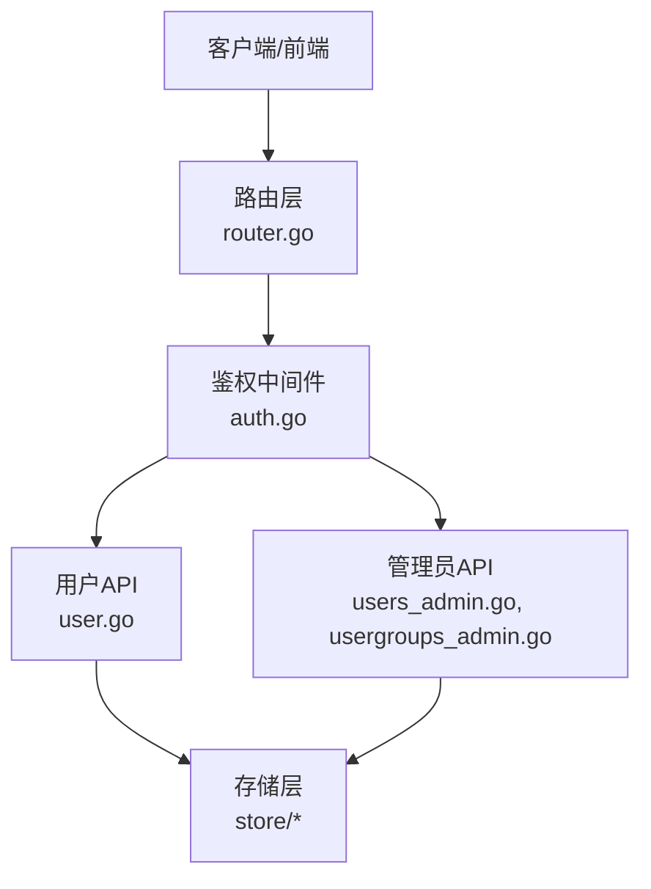
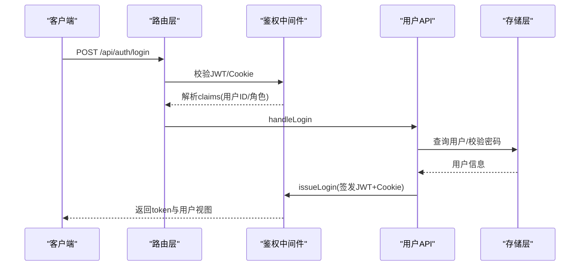
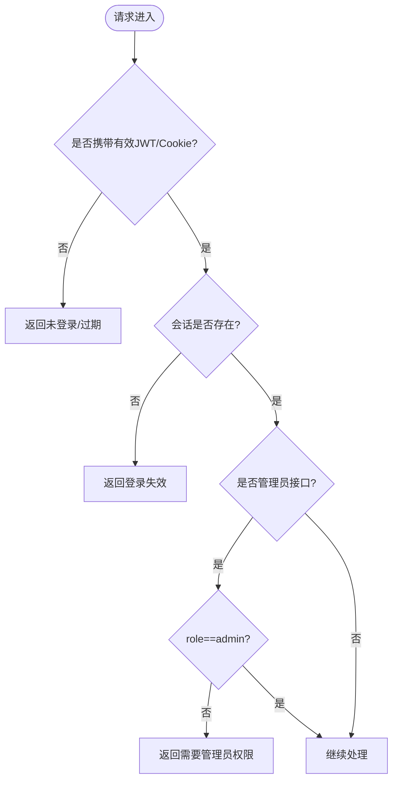
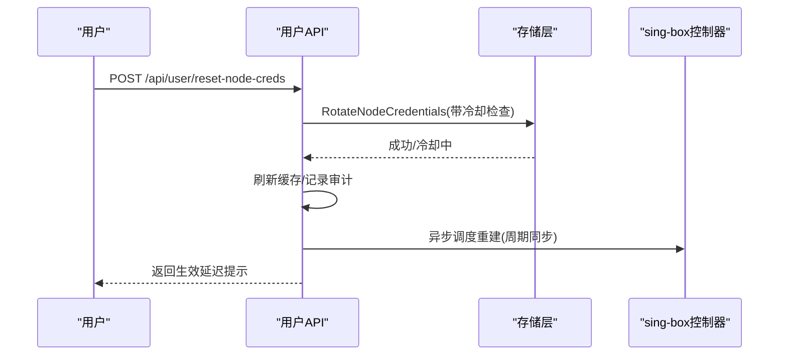
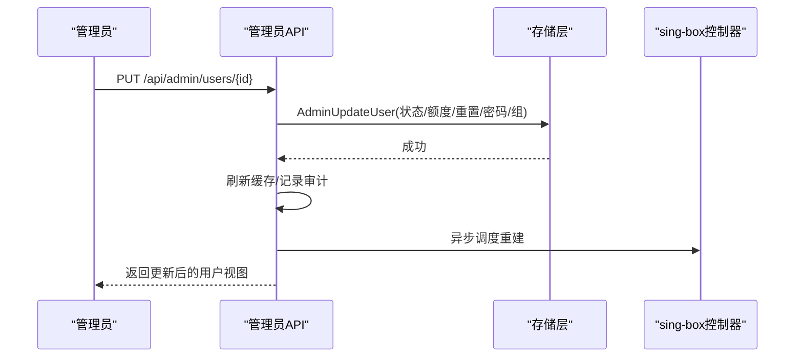
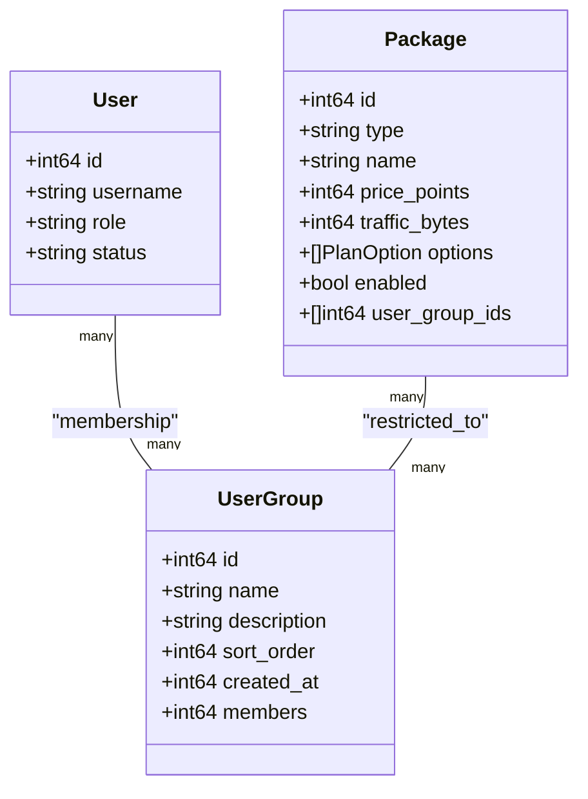
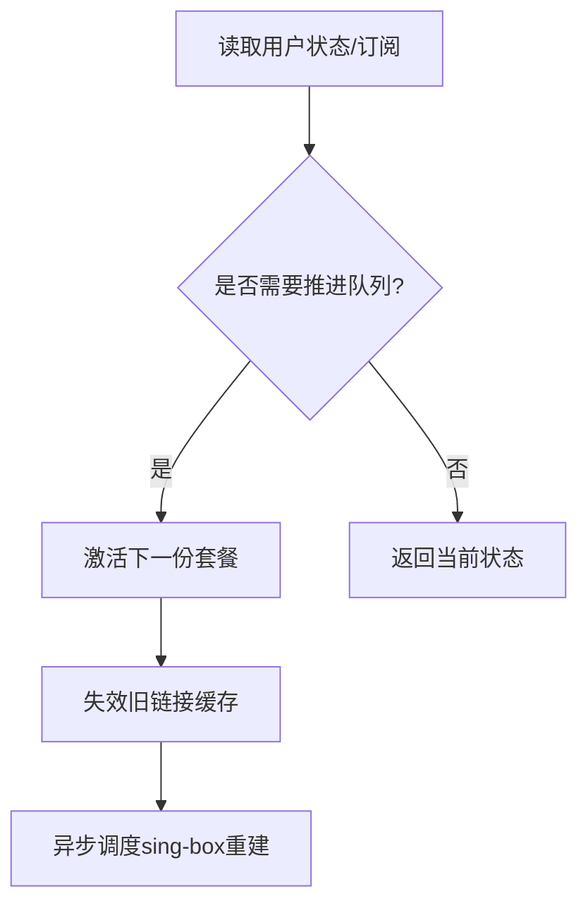
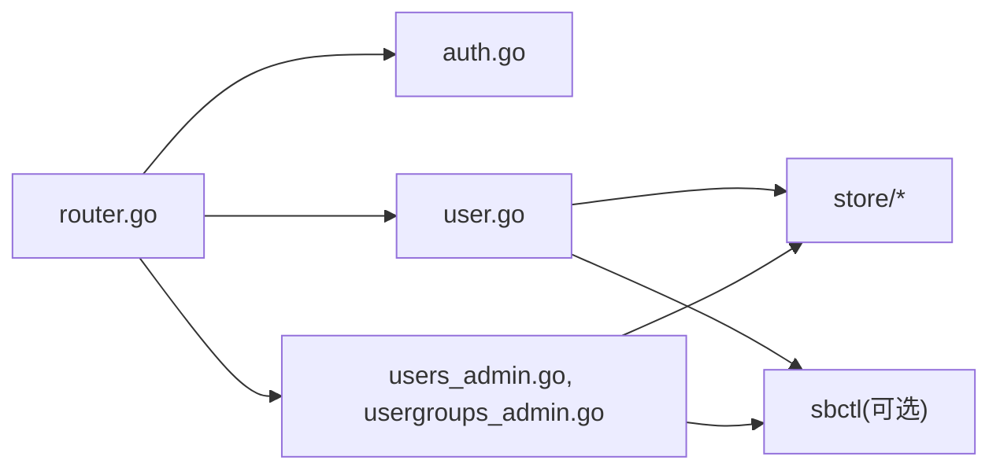

# 用户管理

<cite>
**本文引用的文件**
- [internal/api/router.go](file://internal/api/router.go)
- [internal/api/auth.go](file://internal/api/auth.go)
- [internal/api/user.go](file://internal/api/user.go)
- [internal/api/users_admin.go](file://internal/api/users_admin.go)
- [internal/api/usergroups_admin.go](file://internal/api/usergroups_admin.go)
- [internal/store/users.go](file://internal/store/users.go)
- [internal/store/usergroups.go](file://internal/store/usergroups.go)
- [internal/store/packages.go](file://internal/store/packages.go)
</cite>

## 目录
1. [简介](#简介)
2. [项目结构](#项目结构)
3. [核心组件](#核心组件)
4. [架构总览](#架构总览)
5. [详细组件分析](#详细组件分析)
6. [依赖关系分析](#依赖关系分析)
7. [性能与可用性考虑](#性能与可用性考虑)
8. [故障排查指南](#故障排查指南)
9. [结论](#结论)
10. [附录：管理员接口参考](#附录管理员接口参考)

## 简介
本文件面向管理员与集成方，提供“轻舟”系统的用户管理API完整文档。内容覆盖：
- 用户的注册、登录、资料与订阅管理
- 管理员对用户的增删改查、权限分配、组管理与批量操作
- 角色体系、权限控制模型与访问策略
- 用户生命周期示例（注册审批、套餐分配、使用统计）
- 数据安全、隐私保护与合规要点
- 为管理员提供的账户管理接口参考清单

## 项目结构
后端采用分层设计：路由层负责HTTP端点与中间件；API层实现业务处理；Store层封装数据持久化与事务。用户管理相关能力分布在以下模块：
- 路由与鉴权：router.go、auth.go
- 用户自助服务：user.go
- 管理员用户与组：users_admin.go、usergroups_admin.go
- 数据模型与事务：store/users.go、store/usergroups.go、store/packages.go

**图表来源**
- [internal/api/router.go:132-387](file://internal/api/router.go#L132-L387)
- [internal/api/auth.go:179-213](file://internal/api/auth.go#L179-L213)
- [internal/api/user.go:25-173](file://internal/api/user.go#L25-L173)
- [internal/api/users_admin.go:164-446](file://internal/api/users_admin.go#L164-L446)
- [internal/api/usergroups_admin.go:17-185](file://internal/api/usergroups_admin.go#L17-L185)

**章节来源**
- [internal/api/router.go:132-387](file://internal/api/router.go#L132-L387)
- [internal/api/auth.go:179-213](file://internal/api/auth.go#L179-L213)

## 核心组件
- 认证与会话：JWT签发、Cookie注入、会话校验、管理员角色校验
- 用户自助：注册、登录、查看仪表盘、订阅链接、流量与套餐视图、重置订阅地址、节点凭据轮换、自定义代理凭据
- 管理员用户管理：创建用户、编辑配额/状态/密码、分配套餐、重置节点凭据、删除用户、充值积分、批量查询
- 用户组管理：创建/更新/删除用户组、设置组成员、查询成员、限制套餐购买范围
- 套餐与购买：套餐定义、选项（时长/流量/价格）、按组可见性、队列激活机制

**章节来源**
- [internal/api/auth.go:49-213](file://internal/api/auth.go#L49-L213)
- [internal/api/user.go:25-800](file://internal/api/user.go#L25-L800)
- [internal/api/users_admin.go:164-446](file://internal/api/users_admin.go#L164-L446)
- [internal/api/usergroups_admin.go:17-185](file://internal/api/usergroups_admin.go#L17-L185)
- [internal/store/packages.go:11-139](file://internal/store/packages.go#L11-L139)

## 架构总览
系统通过Chi路由器组织REST API，统一鉴权中间件校验JWT并注入用户上下文；管理员接口额外要求admin角色。用户自助与管理端共享同一套数据模型，但权限边界清晰。

**图表来源**
- [internal/api/router.go:155-162](file://internal/api/router.go#L155-L162)
- [internal/api/auth.go:112-149](file://internal/api/auth.go#L112-L149)
- [internal/api/auth.go:49-65](file://internal/api/auth.go#L49-L65)

## 详细组件分析

### 认证与授权
- 登录：支持用户名/密码登录，失败时进行恒定时间比较防止枚举攻击；封禁账号拒绝登录；成功后签发JWT并写入Cookie
- 会话：记录会话IP与UA，支持按JTI撤销；登出时删除会话并清除Cookie
- 鉴权：所有受保护接口需携带有效JWT或Cookie；管理员接口需role=admin
- 配置：公开配置接口暴露注册模式、邮箱验证要求、站点信息等

**图表来源**
- [internal/api/auth.go:179-213](file://internal/api/auth.go#L179-L213)
- [internal/api/auth.go:112-149](file://internal/api/auth.go#L112-L149)

**章节来源**
- [internal/api/auth.go:49-213](file://internal/api/auth.go#L49-L213)

### 用户自助API
- 注册：支持开放/邀请码/关闭三种模式；可选邮箱验证；自动创建订阅令牌、默认流量/设备上限/有效期；邀请码可绑定用户组并授予购买资格
- 仪表盘：聚合流量、套餐视图、到期时间；读取时推进排队套餐
- 订阅：返回多格式订阅链接；支持更换订阅地址（限频）
- 节点凭据：支持用户自助轮换（开关+冷却期），管理员可强制轮换并立即生效
- 自定义代理：为每个桶设置独立混合代理凭据（可设过期）
- 套餐与订单：查看套餐、购买、订单、积分、流量统计等

**图表来源**
- [internal/api/user.go:387-412](file://internal/api/user.go#L387-L412)
- [internal/store/users.go:167-296](file://internal/store/users.go#L167-L296)
- [internal/api/router.go:177-208](file://internal/api/router.go#L177-L208)

**章节来源**
- [internal/api/user.go:25-800](file://internal/api/user.go#L25-L800)
- [internal/api/router.go:177-208](file://internal/api/router.go#L177-L208)

### 管理员用户管理API
- 创建用户：跳过注册门控与邮箱验证，直接开通节点并可选赠送积分与用户组
- 编辑用户：支持修改状态、手动额度（流量/到期）、重置用量、重置密码、调整用户组；封禁会踢出在线会话
- 分配套餐：以管理员身份为用户授予套餐（不扣积分），支持选择时长；若用户未开通节点则先开通
- 重置节点凭据：管理员路径无冷却限制，立即触发重建
- 删除用户：清理关联数据（会话、令牌、计划、用量样本等）
- 列表与详情：批量加载用户组与桶，展示流量汇总与套餐摘要

**图表来源**
- [internal/api/users_admin.go:239-347](file://internal/api/users_admin.go#L239-L347)
- [internal/store/users.go:392-441](file://internal/store/users.go#L392-L441)
- [internal/api/router.go:210-365](file://internal/api/router.go#L210-L365)

**章节来源**
- [internal/api/users_admin.go:164-446](file://internal/api/users_admin.go#L164-L446)
- [internal/store/users.go:392-441](file://internal/store/users.go#L392-L441)

### 用户组与权限控制
- 用户组：用于限制“谁可以购买某套餐”，与“节点组”（决定套餐授予哪些节点）分离
- 组CRUD：创建、更新、删除；删除前检测是否导致某些套餐变为公开
- 组成员：原子替换组成员；支持从用户侧或组侧双向维护
- 套餐可见性：未绑定用户组的套餐为公开；否则仅所属组用户可见并可购买

**图表来源**
- [internal/store/usergroups.go:14-21](file://internal/store/usergroups.go#L14-L21)
- [internal/store/packages.go:23-41](file://internal/store/packages.go#L23-L41)
- [internal/store/users.go:22-51](file://internal/store/users.go#L22-L51)

**章节来源**
- [internal/api/usergroups_admin.go:17-185](file://internal/api/usergroups_admin.go#L17-L185)
- [internal/store/usergroups.go:119-180](file://internal/store/usergroups.go#L119-L180)
- [internal/store/usergroups.go:244-324](file://internal/store/usergroups.go#L244-L324)

### 套餐与队列激活
- 套餐选项：同一套餐可售卖多种时长/流量/价格组合；购买时选择具体选项
- 队列模型：用户可同时持有多个套餐份，按顺序激活；读请求时会推进队列，避免“已过期但未激活下一份”的卡顿
- 流量计量：按桶独立计量；免费桶不计入用户可见套餐；池桶用于通用余额

**图表来源**
- [internal/api/user.go:223-283](file://internal/api/user.go#L223-L283)
- [internal/api/user.go:592-643](file://internal/api/user.go#L592-L643)

**章节来源**
- [internal/api/user.go:223-283](file://internal/api/user.go#L223-L283)
- [internal/store/packages.go:11-139](file://internal/store/packages.go#L11-L139)

## 依赖关系分析
- 路由到API：router.go集中注册所有端点，区分公开、已认证、管理员三类
- 鉴权中间件：auth.go提供JWT解析、会话校验、管理员角色检查
- API到Store：user.go、users_admin.go、usergroups_admin.go调用store层的用户、组、套餐、用量等方法
- sing-box控制器：在需要时触发配置重建，支持立即或异步调度

**图表来源**
- [internal/api/router.go:132-387](file://internal/api/router.go#L132-L387)
- [internal/api/auth.go:179-213](file://internal/api/auth.go#L179-L213)
- [internal/api/user.go:25-800](file://internal/api/user.go#L25-L800)
- [internal/api/users_admin.go:164-446](file://internal/api/users_admin.go#L164-L446)
- [internal/api/usergroups_admin.go:17-185](file://internal/api/usergroups_admin.go#L17-L185)

**章节来源**
- [internal/api/router.go:132-387](file://internal/api/router.go#L132-L387)

## 性能与可用性考虑
- 速率限制：登录/注册/重发验证码/探针上报/订阅地址更换均有限流，防暴力破解与滥用
- 批量优化：管理员列表一次性批量加载用户组与桶，减少N+1查询
- 异步重建：sing-box配置重建走异步调度，避免阻塞HTTP响应；失败自愈
- 队列推进：在读路径推进队列，提升用户体验，降低后台任务压力
- 缓存失效：关键变更（如凭据轮换、套餐激活）主动失效链接缓存，保证一致性

[本节为通用指导，不直接分析具体文件]

## 故障排查指南
- 登录失败：检查用户名/密码、封禁状态、会话有效性；注意恒定时间比较不会泄露用户名存在性
- 订阅不可用：确认用户状态非封禁、套餐未过期且未耗尽；必要时触发队列推进
- 节点凭据轮换失败：检查冷却期、并发冲突；管理员路径可绕过冷却
- 用户组删除冲突：若套餐仅绑定该组，删除会导致套餐公开；需先解绑或使用强制参数
- 配置不同步：检查sing-box控制器是否启用；关注异步重建状态与日志

**章节来源**
- [internal/api/auth.go:112-149](file://internal/api/auth.go#L112-L149)
- [internal/api/user.go:387-412](file://internal/api/user.go#L387-L412)
- [internal/api/usergroups_admin.go:84-119](file://internal/api/usergroups_admin.go#L84-L119)
- [internal/api/router.go:45-92](file://internal/api/router.go#L45-L92)

## 结论
本系统提供了完整的用户管理能力：从自助注册到管理员全量管控，从组级权限到套餐队列激活，兼顾安全、可用与性能。管理员可通过标准化接口完成用户账户的全生命周期管理，并结合组与套餐策略实现精细化的资源分配与访问控制。

[本节为总结，不直接分析具体文件]

## 附录：管理员接口参考
以下为管理员相关的用户与组管理接口清单（基于路由注册）。所有管理员接口均需管理员角色。

- 用户管理
  - GET /api/admin/users — 列出用户（支持搜索q=）
  - POST /api/admin/users — 创建用户（无需注册门控，直接开通节点）
  - PUT /api/admin/users/{id} — 编辑用户（状态、手动额度、重置用量、密码、用户组）
  - DELETE /api/admin/users/{id} — 删除用户
  - POST /api/admin/users/{id}/points — 充值积分
  - POST /api/admin/users/{id}/assign-plan — 分配套餐（可选duration_days）
  - POST /api/admin/users/{id}/reset-node-creds — 重置节点凭据（管理员路径无冷却）
  - GET /api/admin/users/{id}/orders — 查看用户订单
  - GET /api/admin/users/{id}/plans — 查看用户套餐

- 用户组管理
  - GET /api/admin/user-groups — 列出用户组
  - POST /api/admin/user-groups — 创建用户组
  - PUT /api/admin/user-groups/{id} — 更新用户组
  - DELETE /api/admin/user-groups/{id}[?force=1] — 删除用户组（可能影响套餐可见性）
  - GET /api/admin/user-groups/{id}/members — 查看组成员
  - PUT /api/admin/user-groups/{id}/members — 批量设置组成员

- 其他相关
  - POST /api/admin/rebuild — 重建sing-box配置并刷新链接缓存
  - GET /api/admin/stats/... — 各类统计接口（流量、分布、套餐、用户等）

**章节来源**
- [internal/api/router.go:210-365](file://internal/api/router.go#L210-L365)
