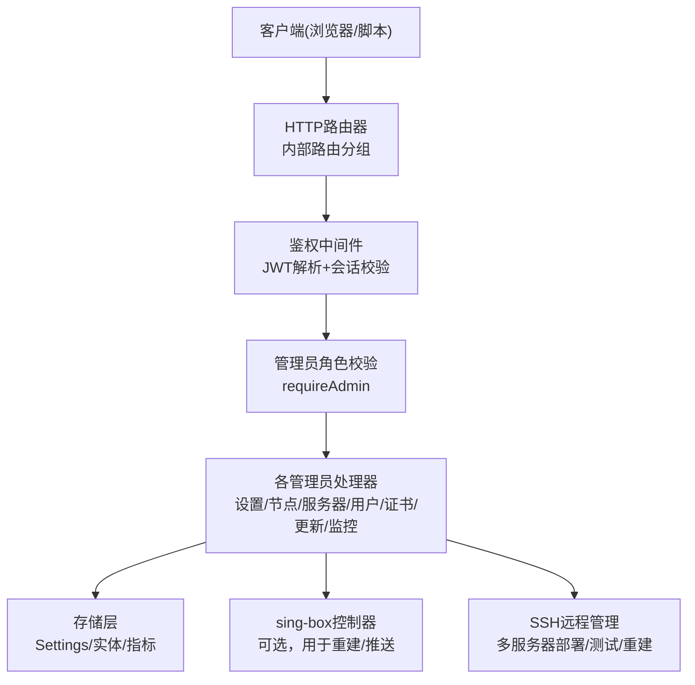
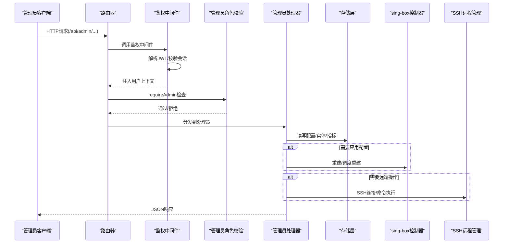
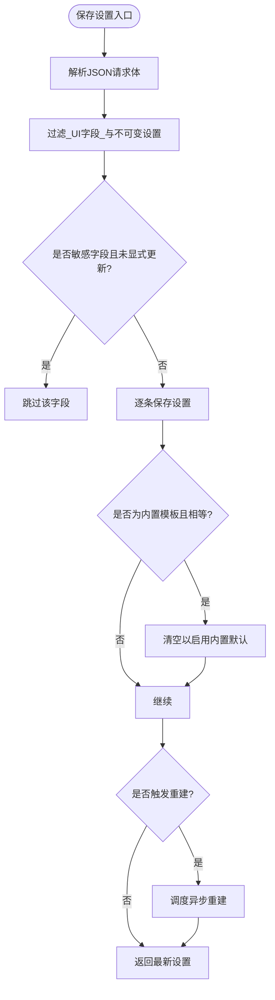
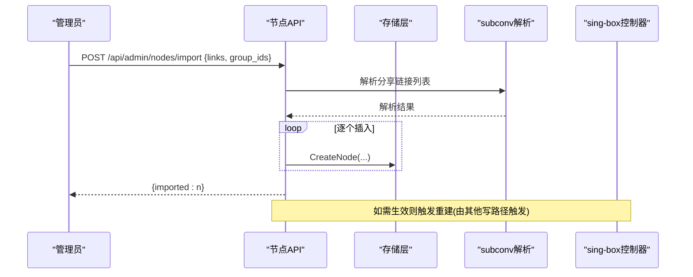
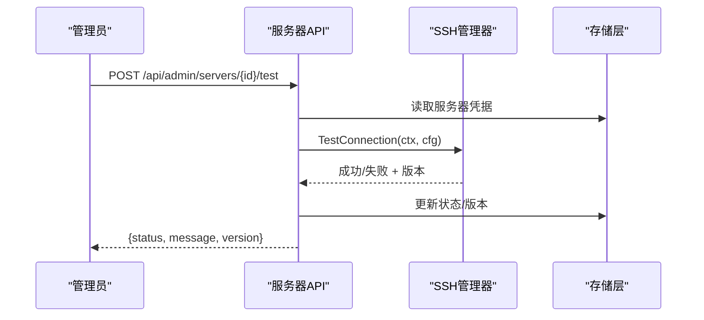
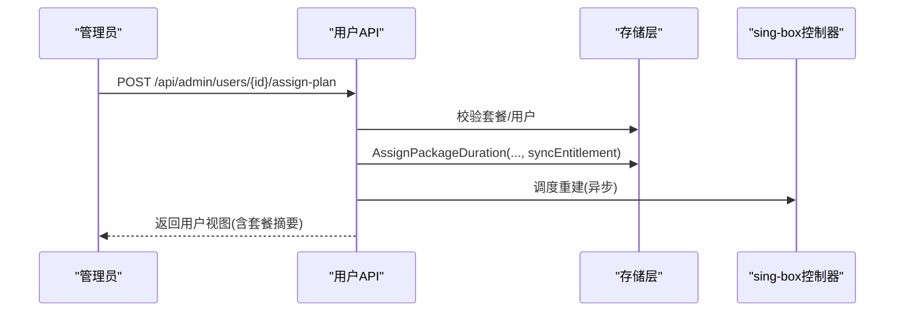
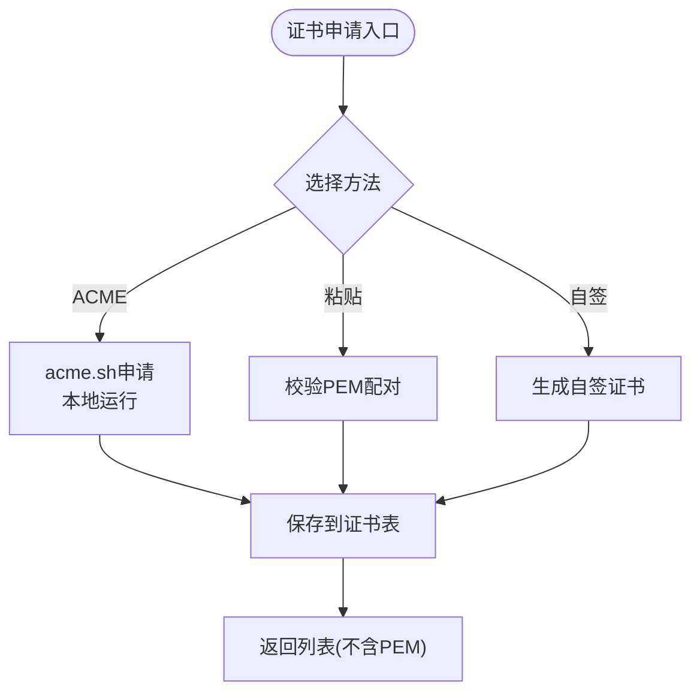
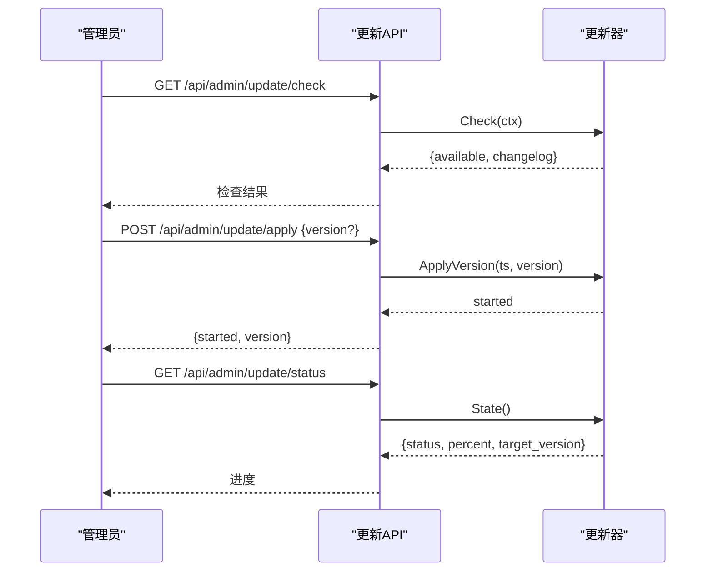
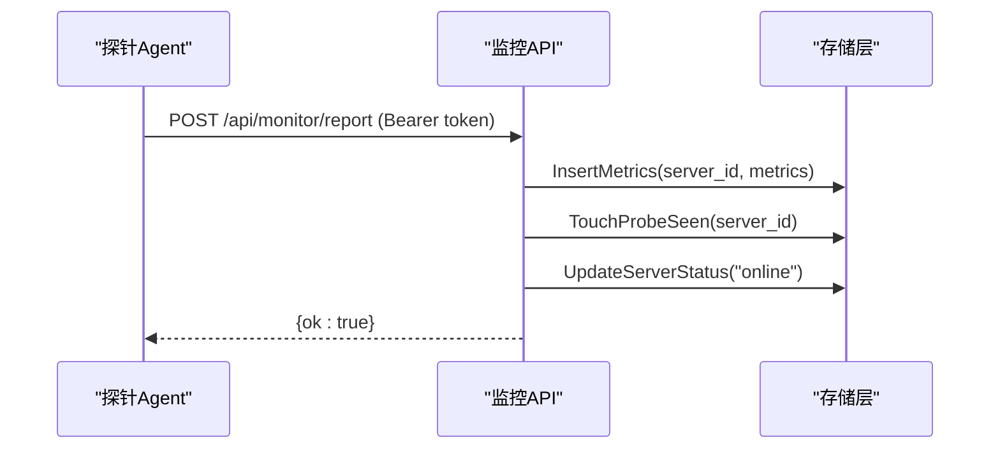
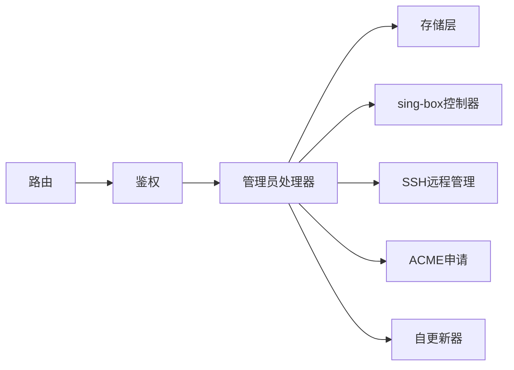

# 管理员API

<cite>
**本文引用的文件**
- [router.go](file://internal/api/router.go)
- [admin.go](file://internal/api/admin.go)
- [auth.go](file://internal/api/auth.go)
- [nodes_admin.go](file://internal/api/nodes_admin.go)
- [server_admin.go](file://internal/api/server_admin.go)
- [users_admin.go](file://internal/api/users_admin.go)
- [sb_admin.go](file://internal/api/sb_admin.go)
- [certs_admin.go](file://internal/api/certs_admin.go)
- [update_admin.go](file://internal/api/update_admin.go)
- [monitor.go](file://internal/api/monitor.go)
- [queue_advance.go](file://internal/api/queue_advance.go)
- [settings.go](file://internal/store/settings.go)
- [jwt.go](file://internal/auth/jwt.go)
</cite>

## 目录
1. [简介](#简介)
2. [项目结构](#项目结构)
3. [核心组件](#核心组件)
4. [架构总览](#架构总览)
5. [详细组件分析](#详细组件分析)
6. [依赖关系分析](#依赖关系分析)
7. [性能与并发特性](#性能与并发特性)
8. [故障排查指南](#故障排查指南)
9. [结论](#结论)
10. [附录：管理员接口参考](#附录管理员接口参考)

## 简介
本文件为“轻舟”面板的管理员API完整文档，覆盖系统设置、节点管理、服务器管理、用户管理、证书中心、单点更新、监控告警等管理员专用能力。重点说明管理员权限验证与访问控制机制，提供批量操作与异步任务处理说明，并给出错误处理策略与日志记录要点，帮助管理员高效完成系统运维与资源编排。

## 项目结构
管理员API基于HTTP路由注册，统一通过鉴权中间件与管理员角色校验后进入具体处理器。关键组织方式如下：
- 路由层：集中定义公开、普通用户、管理员三类路由组，管理员路由组强制启用鉴权与角色校验。
- 鉴权层：JWT令牌签发与解析、会话校验、IP限流、请求体大小限制、超时与恢复中间件。
- 业务层：按功能域拆分（节点、服务器、用户、TLS/Reality、证书、更新、监控等）。
- 存储层：配置项加密缓存、设置读写、实体CRUD与统计聚合。

图表来源
- [router.go:132-386](file://internal/api/router.go#L132-L386)
- [auth.go:179-213](file://internal/api/auth.go#L179-L213)
- [server_admin.go:167-184](file://internal/api/server_admin.go#L167-L184)

章节来源
- [router.go:132-386](file://internal/api/router.go#L132-L386)
- [auth.go:179-213](file://internal/api/auth.go#L179-L213)

## 核心组件
- 路由与中间件
  - 统一使用请求ID、恢复、压缩、超时、最大请求体限制等通用中间件。
  - 管理员路由组挂载鉴权与管理员角色校验中间件。
- 鉴权与会话
  - 登录成功后签发JWT并写入Cookie；后续请求支持Bearer或Cookie两种认证方式。
  - 每次鉴权会校验会话有效性，支持远端注销与撤销。
- 配置与模板
  - 设置读取时自动合并环境变量覆盖值；敏感字段返回掩码；不可变设置禁止通过API修改。
- sing-box集成
  - 可选的本地控制器用于重建配置并推送到节点；支持按服务器增量调度与去重。
- 多服务器管理
  - 通过SSH连接远端机器执行测试、重建、主机密钥信任与清理等操作。
- 监控与探针
  - 接收探针上报指标，提供仪表盘、热力图、告警列表与标记已读等能力。
- 队列推进
  - 后台定时推进排队套餐，变更身份后触发配置重建。

章节来源
- [router.go:132-148](file://internal/api/router.go#L132-L148)
- [auth.go:49-65](file://internal/api/auth.go#L49-L65)
- [auth.go:179-213](file://internal/api/auth.go#L179-L213)
- [admin.go:47-121](file://internal/api/admin.go#L47-L121)
- [router.go:77-92](file://internal/api/router.go#L77-L92)
- [server_admin.go:167-184](file://internal/api/server_admin.go#L167-L184)
- [monitor.go:18-55](file://internal/api/monitor.go#L18-L55)
- [queue_advance.go:32-69](file://internal/api/queue_advance.go#L32-L69)

## 架构总览
管理员API采用分层设计：路由层负责URL到处理器的映射与中间件装配；鉴权层确保请求合法且具备管理员权限；业务层实现领域逻辑；存储层提供数据持久化与缓存；外部子系统包括sing-box控制器、SSH远程管理、ACME证书申请、自更新器等。

图表来源
- [router.go:210-375](file://internal/api/router.go#L210-L375)
- [auth.go:179-213](file://internal/api/auth.go#L179-L213)
- [server_admin.go:186-224](file://internal/api/server_admin.go#L186-L224)
- [router.go:45-92](file://internal/api/router.go#L45-L92)

## 详细组件分析

### 系统设置管理
- 获取设置：返回全部设置，合并环境变量覆盖值，敏感字段掩码显示，内置模板默认值回退。
- 保存设置：过滤UI字段与不可变设置；当模板等于内置默认值时清空以保留“用内置”语义；部分设置变更触发异步重建。
- 默认模板：提供内置Clash与sing-box订阅模板供前端加载编辑。

图表来源
- [admin.go:79-121](file://internal/api/admin.go#L79-L121)
- [admin.go:47-77](file://internal/api/admin.go#L47-L77)
- [router.go:45-92](file://internal/api/router.go#L45-L92)

章节来源
- [admin.go:47-121](file://internal/api/admin.go#L47-L121)
- [settings.go:7-85](file://internal/store/settings.go#L7-L85)

### 节点管理
- 列表与排序：列出所有节点；支持批量调整显示顺序，影响订阅渲染但不触发sing-box重建。
- 创建/更新/删除：创建节点时支持从分享链接解析协议与名称；更新时避免覆盖未提交字段；删除后触发重建。
- 导入节点：批量导入多个分享链接，支持绑定分组。
- 分组与来源：分组CRUD；订阅源CRUD与抓取，抓取前进行安全校验与SSRF防护，失败状态落库。
- 同步任务：后台定时轮询启用状态的订阅源，拉取并替换节点集合。

图表来源
- [nodes_admin.go:111-133](file://internal/api/nodes_admin.go#L111-L133)
- [nodes_admin.go:301-326](file://internal/api/nodes_admin.go#L301-L326)
- [nodes_admin.go:328-354](file://internal/api/nodes_admin.go#L328-L354)

章节来源
- [nodes_admin.go:19-133](file://internal/api/nodes_admin.go#L19-L133)
- [nodes_admin.go:137-200](file://internal/api/nodes_admin.go#L137-L200)
- [nodes_admin.go:213-299](file://internal/api/nodes_admin.go#L213-L299)
- [nodes_admin.go:301-354](file://internal/api/nodes_admin.go#L301-L354)

### 服务器管理（多服务器sing-box编排）
- 列表/创建/更新/删除：列表返回时屏蔽SSH密钥等敏感字段；更新采用“就地解码”避免覆盖未提交字段；删除时若被引用则拒绝。
- 测试连接：使用与真实部署相同的SSH路径进行连通性测试，成功则更新状态并记录版本。
- 主机密钥管理：支持清除固定主机密钥并立即重新建立信任，防止因重装/更换机器导致连接失败。
- 重建配置：对指定服务器触发sing-box配置重建（需控制器可用）。

图表来源
- [server_admin.go:186-224](file://internal/api/server_admin.go#L186-L224)
- [server_admin.go:226-282](file://internal/api/server_admin.go#L226-L282)
- [server_admin.go:284-301](file://internal/api/server_admin.go#L284-L301)

章节来源
- [server_admin.go:39-165](file://internal/api/server_admin.go#L39-L165)
- [server_admin.go:167-184](file://internal/api/server_admin.go#L167-L184)
- [server_admin.go:186-301](file://internal/api/server_admin.go#L186-L301)

### 用户管理
- 创建用户：绕过注册门控与邮箱验证，直接创建并开通节点；可赠送积分；预置流量/设备数/过期时间等默认值。
- 更新用户：支持重置密码（登出所有会话）、封禁/解封、重置用量、调整配额与有效期、修改用户组；封禁时主动撤销会话。
- 分配套餐：管理员免费为用户分配套餐时长，自动保证存在代理身份后再授予，并触发配置重建。
- 列表用户：批量查询用户组与套餐桶，计算在线状态与用量汇总。

图表来源
- [users_admin.go:349-411](file://internal/api/users_admin.go#L349-L411)
- [users_admin.go:164-237](file://internal/api/users_admin.go#L164-L237)
- [users_admin.go:239-347](file://internal/api/users_admin.go#L239-L347)

章节来源
- [users_admin.go:164-237](file://internal/api/users_admin.go#L164-L237)
- [users_admin.go:239-347](file://internal/api/users_admin.go#L239-L347)
- [users_admin.go:349-411](file://internal/api/users_admin.go#L349-L411)
- [users_admin.go:413-446](file://internal/api/users_admin.go#L413-L446)

### TLS/Reality与证书中心
- TLS/Reality配置：生成Reality密钥对、快速自签并一键绑定、ACME申请、粘贴证书、结构化保存TLS条目、排序与删除。
- 证书中心：ACME申请（支持DNS-01/HTTP-01/Webroot）、粘贴证书、自签证书、元信息编辑、强制续期、导出PEM、删除保护。
- 列表展示：附带证书有效期、即将过期、解密失败等状态；自签证书指纹便于客户端固定。

图表来源
- [certs_admin.go:90-161](file://internal/api/certs_admin.go#L90-L161)
- [certs_admin.go:163-207](file://internal/api/certs_admin.go#L163-L207)
- [certs_admin.go:209-245](file://internal/api/certs_admin.go#L209-L245)
- [certs_admin.go:247-329](file://internal/api/certs_admin.go#L247-L329)
- [sb_admin.go:35-68](file://internal/api/sb_admin.go#L35-L68)
- [sb_admin.go:146-221](file://internal/api/sb_admin.go#L146-L221)

章节来源
- [sb_admin.go:35-68](file://internal/api/sb_admin.go#L35-L68)
- [sb_admin.go:146-221](file://internal/api/sb_admin.go#L146-L221)
- [sb_admin.go:374-473](file://internal/api/sb_admin.go#L374-L473)
- [sb_admin.go:475-659](file://internal/api/sb_admin.go#L475-L659)
- [sb_admin.go:661-789](file://internal/api/sb_admin.go#L661-L789)
- [certs_admin.go:19-81](file://internal/api/certs_admin.go#L19-L81)
- [certs_admin.go:90-329](file://internal/api/certs_admin.go#L90-L329)

### 单点更新
- 检查更新：查询最新版本与变更日志。
- 更新状态：查看下载/安装进度、目标版本、当前运行版本。
- 发布列表：列出最近N个版本以便回滚或选择特定版本。
- 应用更新：后台异步执行下载、校验、替换、重启流程，立即返回。
- 回滚：检测并切换回上一版本二进制。

图表来源
- [update_admin.go:13-116](file://internal/api/update_admin.go#L13-L116)

章节来源
- [update_admin.go:13-116](file://internal/api/update_admin.go#L13-L116)

### 监控与告警
- 探针上报：带Bearer Token认证，写入指标并更新在线状态。
- 仪表盘：汇总在线/离线/即将到期数量与资源总量。
- 服务器列表：包含探针开关、可见性、到期日、状态、最新指标等。
- 指标查询：按范围查询CPU/内存/网络历史。
- 热力图：服务器×时间桶矩阵，区分正常/高负载/离线。
- 告警：列表、标记单个/全部已读。

图表来源
- [monitor.go:18-55](file://internal/api/monitor.go#L18-L55)
- [monitor.go:183-241](file://internal/api/monitor.go#L183-L241)
- [monitor.go:243-360](file://internal/api/monitor.go#L243-L360)
- [monitor.go:362-428](file://internal/api/monitor.go#L362-L428)
- [monitor.go:541-647](file://internal/api/monitor.go#L541-L647)
- [monitor.go:649-779](file://internal/api/monitor.go#L649-L779)

章节来源
- [monitor.go:18-55](file://internal/api/monitor.go#L18-L55)
- [monitor.go:183-779](file://internal/api/monitor.go#L183-L779)

### 批量操作与异步任务
- 批量导入节点：一次性解析并插入多条记录，返回成功计数。
- 订阅源抓取：周期任务拉取启用源的链接并替换节点集，失败原因落库。
- 队列推进：后台定时推进排队套餐，变更后触发配置重建。
- sing-box重建：支持全量与按服务器调度，避免阻塞HTTP响应。

章节来源
- [nodes_admin.go:111-133](file://internal/api/nodes_admin.go#L111-L133)
- [nodes_admin.go:328-354](file://internal/api/nodes_admin.go#L328-L354)
- [queue_advance.go:32-69](file://internal/api/queue_advance.go#L32-L69)
- [router.go:45-92](file://internal/api/router.go#L45-L92)

## 依赖关系分析
- 路由依赖：所有管理员接口均位于同一路由组，共享鉴权与角色校验中间件。
- 存储依赖：设置、实体、指标均通过Store访问；设置具有内存缓存与加密存储。
- 外部依赖：
  - sing-box控制器：可选，用于重建配置与推送。
  - SSH远程管理：用于多服务器连接、测试、重建与主机密钥管理。
  - ACME：本地申请证书，支持多种验证方式。
  - 自更新器：GitHub发布源，支持版本检查、下载、回滚。

图表来源
- [router.go:210-375](file://internal/api/router.go#L210-L375)
- [server_admin.go:167-184](file://internal/api/server_admin.go#L167-L184)
- [certs_admin.go:90-161](file://internal/api/certs_admin.go#L90-L161)
- [update_admin.go:13-116](file://internal/api/update_admin.go#L13-L116)

章节来源
- [router.go:210-375](file://internal/api/router.go#L210-L375)
- [server_admin.go:167-184](file://internal/api/server_admin.go#L167-L184)
- [certs_admin.go:90-161](file://internal/api/certs_admin.go#L90-L161)
- [update_admin.go:13-116](file://internal/api/update_admin.go#L13-L116)

## 性能与并发特性
- 请求限制：全局超时30秒，最大请求体8MiB，防止大POST导致内存压力。
- 速率限制：登录、验证码重发、探针上报、订阅地址交换等接口按IP或用户维度限流。
- 异步重建：sing-box配置重建通过调度器去重与延迟合并，避免阻塞响应。
- 批量优化：用户列表批量查询用户组与套餐桶，减少数据库往返。
- 指标聚合：热力图与公共迷你图对指标进行桶化平均，降低前端渲染压力。

章节来源
- [router.go:132-148](file://internal/api/router.go#L132-L148)
- [router.go:94-130](file://internal/api/router.go#L94-L130)
- [router.go:77-92](file://internal/api/router.go#L77-L92)
- [users_admin.go:413-446](file://internal/api/users_admin.go#L413-L446)
- [monitor.go:541-647](file://internal/api/monitor.go#L541-L647)

## 故障排查指南
- 鉴权失败
  - 现象：返回未登录/登录过期/登录失效。
  - 排查：确认Authorization或Cookie携带正确JWT；检查会话是否存在；必要时重新登录。
- 管理员权限不足
  - 现象：需要管理员权限。
  - 排查：确认当前用户角色为admin。
- 设置保存失败
  - 现象：保存配置失败。
  - 排查：检查请求格式；确认未尝试修改不可变设置；确认敏感字段未误传空值。
- 节点导入失败
  - 现象：导入数量为0或报错。
  - 排查：检查分享链接格式；确认分组ID有效；查看订阅源抓取失败原因。
- 服务器连接失败
  - 现象：SSH连接失败。
  - 排查：检查SSH凭据；必要时清除固定主机密钥并重新信任；确认端口与防火墙。
- 证书申请失败
  - 现象：证书申请失败。
  - 排查：根据方法检查域名解析、Webroot路径或Cloudflare Token；查看错误信息。
- 更新服务不可用
  - 现象：更新服务未启用。
  - 排查：确认更新器已初始化；检查网络与仓库可达性。
- 监控无数据
  - 现象：仪表盘或热力图为空。
  - 排查：确认探针已启用并上报；检查Token与网络；查看最近一次上报时间。

章节来源
- [auth.go:112-177](file://internal/api/auth.go#L112-L177)
- [auth.go:179-213](file://internal/api/auth.go#L179-L213)
- [admin.go:79-121](file://internal/api/admin.go#L79-L121)
- [nodes_admin.go:111-133](file://internal/api/nodes_admin.go#L111-L133)
- [server_admin.go:186-224](file://internal/api/server_admin.go#L186-L224)
- [certs_admin.go:90-161](file://internal/api/certs_admin.go#L90-L161)
- [update_admin.go:13-116](file://internal/api/update_admin.go#L13-L116)
- [monitor.go:18-55](file://internal/api/monitor.go#L18-L55)

## 结论
本管理员API提供了完整的系统管理能力，涵盖设置、节点、服务器、用户、证书、更新与监控等核心场景。通过严格的鉴权与角色控制、安全的敏感数据处理、高效的批量与异步机制，以及完善的错误处理与日志记录，管理员可以安全、稳定地维护多服务器环境下的sing-box集群与用户生态。建议在生产环境中合理配置环境变量与限额，定期巡检证书与更新通道，结合监控与告警保障系统可用性。

## 附录：管理员接口参考
以下为管理员专用接口清单（仅列出路径与方法，具体参数与响应请参考对应处理器实现）：
- 系统设置
  - GET /api/admin/settings
  - PUT /api/admin/settings
  - GET /api/admin/settings/default-templates
  - POST /api/admin/settings/test-smtp
  - GET /api/admin/settings/detect-node-host
- 重建与备份
  - POST /api/admin/rebuild
  - GET /api/admin/backup
- sing-box相关
  - GET /api/admin/nodes/singbox
  - POST /api/admin/nodes/singbox/refresh
  - POST /api/admin/nodes/{id}/singbox/upgrade
  - GET /api/admin/sb/inbounds
  - POST /api/admin/sb/inbounds
  - POST /api/admin/sb/inbounds/reorder
  - PUT /api/admin/sb/inbounds/{id}
  - DELETE /api/admin/sb/inbounds/{id}
  - POST /api/admin/sb/inbounds/{id}/ack-upstream
  - GET /api/admin/sb/preview
  - GET /api/admin/sb/check
  - GET /api/admin/sb/port-check
  - GET /api/admin/sb/egresses
  - POST /api/admin/sb/egresses
  - POST /api/admin/sb/egresses/parse
  - POST /api/admin/sb/egresses/{id}/clone
  - PUT /api/admin/sb/egresses/{id}
  - DELETE /api/admin/sb/egresses/{id}
  - POST /api/admin/sb/egresses/{id}/test
  - GET /api/admin/sb/sync-status
  - POST /api/admin/sb/resync
  - POST /api/admin/sb/reality-keypair
  - GET /api/admin/sb/sni-test
  - GET /api/admin/sb/tls
  - POST /api/admin/sb/tls
  - POST /api/admin/sb/tls/reality
  - PUT /api/admin/sb/tls/reality/{id}
  - POST /api/admin/sb/tls/self-signed
  - POST /api/admin/sb/tls/quick-selfsigned
  - POST /api/admin/sb/tls/acme
  - POST /api/admin/sb/tls/cert
  - POST /api/admin/sb/tls/reorder
  - PUT /api/admin/sb/tls/cert/{id}
  - PUT /api/admin/sb/tls/{id}
  - DELETE /api/admin/sb/tls/{id}
- 证书中心
  - GET /api/admin/certs
  - POST /api/admin/certs/acme
  - POST /api/admin/certs/paste
  - POST /api/admin/certs/self-signed
  - POST /api/admin/certs/{id}/renew
  - GET /api/admin/certs/{id}/export
  - PUT /api/admin/certs/{id}
  - DELETE /api/admin/certs/{id}
- 服务器管理
  - GET /api/admin/servers
  - POST /api/admin/servers
  - PUT /api/admin/servers/{id}
  - DELETE /api/admin/servers/{id}
  - POST /api/admin/servers/{id}/test
  - POST /api/admin/servers/{id}/rebuild
  - POST /api/admin/servers/{id}/clear-host-key
  - PUT /api/admin/servers/{id}/monitor
- 节点与分组
  - GET /api/admin/inbounds
  - GET /api/admin/nodes
  - POST /api/admin/nodes
  - POST /api/admin/nodes/reorder
  - POST /api/admin/nodes/import
  - PUT /api/admin/nodes/{id}
  - DELETE /api/admin/nodes/{id}
  - GET /api/admin/node-groups
  - POST /api/admin/node-groups
  - PUT /api/admin/node-groups/{id}
  - DELETE /api/admin/node-groups/{id}
  - GET /api/admin/node-sources
  - POST /api/admin/node-sources
  - PUT /api/admin/node-sources/{id}
  - POST /api/admin/node-sources/{id}/fetch
  - DELETE /api/admin/node-sources/{id}
- 用户与套餐
  - GET /api/admin/users
  - POST /api/admin/users
  - PUT /api/admin/users/{id}
  - DELETE /api/admin/users/{id}
  - POST /api/admin/users/{id}/points
  - POST /api/admin/users/{id}/assign-plan
  - POST /api/admin/users/{id}/reset-node-creds
  - GET /api/admin/packages
  - POST /api/admin/packages
  - POST /api/admin/packages/reorder
  - PUT /api/admin/packages/{id}
  - POST /api/admin/packages/{id}/retire
  - POST /api/admin/packages/{id}/enable
  - DELETE /api/admin/packages/{id}
  - GET /api/admin/orders
  - GET /api/admin/users/{id}/orders
  - GET /api/admin/users/{id}/plans
  - DELETE /api/admin/users/{id}/plans/{planID}
  - GET /api/admin/orders/{id}/refund-preview
  - POST /api/admin/orders/{id}/refund
  - DELETE /api/admin/orders/{id}
- 用户组（购买资格）
  - GET /api/admin/user-groups
  - POST /api/admin/user-groups
  - PUT /api/admin/user-groups/{id}
  - DELETE /api/admin/user-groups/{id}
  - GET /api/admin/user-groups/{id}/members
  - PUT /api/admin/user-groups/{id}/members
- 统计与分析
  - GET /api/admin/stats/overview
  - GET /api/admin/stats/traffic
  - GET /api/admin/stats/top
  - GET /api/admin/stats/distribution
  - GET /api/admin/stats/packages
  - GET /api/admin/stats/users
  - GET /api/admin/stats/user/{id}/traffic
  - GET /api/admin/stats/usage
  - GET /api/admin/stats/usage/users
  - GET /api/admin/stats/usage/packages
- 公告与帮助
  - GET /api/admin/announcements
  - POST /api/admin/announcements
  - PUT /api/admin/announcements/{id}
  - DELETE /api/admin/announcements/{id}
  - GET /api/admin/help
  - POST /api/admin/help
  - PUT /api/admin/help/{id}
  - DELETE /api/admin/help/{id}
- 更新
  - GET /api/admin/update/check
  - GET /api/admin/update/status
  - GET /api/admin/update/releases
  - GET /api/admin/update/rollback
  - POST /api/admin/update/rollback
  - POST /api/admin/update/apply
- 监控
  - GET /api/admin/monitor/dashboard
  - GET /api/admin/monitor/servers
  - GET /api/admin/monitor/servers/{id}/metrics
  - GET /api/admin/monitor/heatmap
  - GET /api/admin/monitor/alerts
  - POST /api/admin/monitor/alerts/{id}/read
  - POST /api/admin/monitor/alerts/read-all

章节来源
- [router.go:210-375](file://internal/api/router.go#L210-L375)
