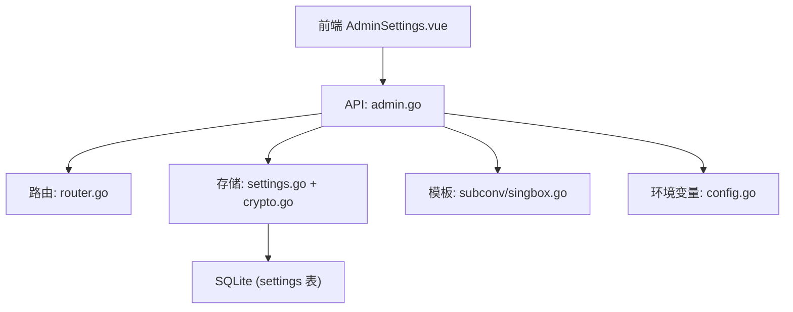
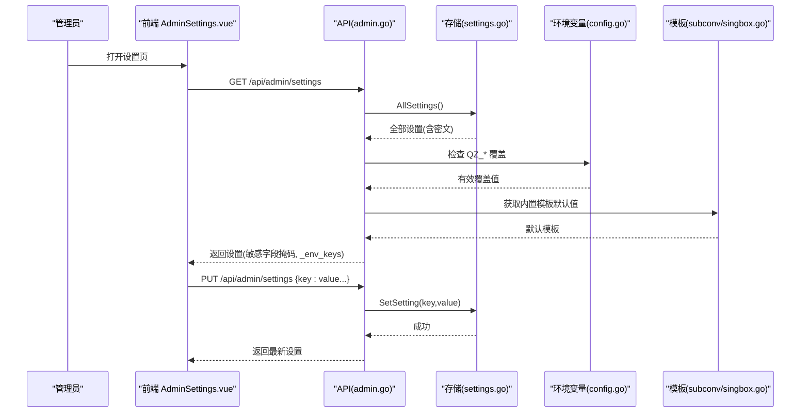
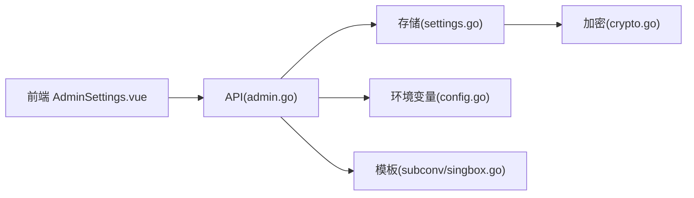

# 系统设置管理

<cite>
**本文引用的文件**
- [internal/api/admin.go](file://internal/api/admin.go)
- [internal/api/router.go](file://internal/api/router.go)
- [internal/store/settings.go](file://internal/store/settings.go)
- [internal/store/crypto.go](file://internal/store/crypto.go)
- [internal/config/config.go](file://internal/config/config.go)
- [internal/subconv/singbox.go](file://internal/subconv/singbox.go)
- [frontend/src/views/AdminSettings.vue](file://frontend/src/views/AdminSettings.vue)
- [main.go](file://main.go)
</cite>

## 目录
1. [简介](#简介)
2. [项目结构](#项目结构)
3. [核心组件](#核心组件)
4. [架构总览](#架构总览)
5. [详细组件分析](#详细组件分析)
6. [依赖关系分析](#依赖关系分析)
7. [性能考虑](#性能考虑)
8. [故障排查指南](#故障排查指南)
9. [结论](#结论)
10. [附录：API 参考与示例](#附录api-参考与示例)

## 简介
本文件为“轻舟”面板的系统设置管理 API 文档，面向管理员。内容涵盖：
- 配置项的读取与更新接口
- 敏感信息保护机制（如 JWT 密钥、SMTP 密码、Cloudflare API Token）
- 不可变设置项的保护策略
- 环境变量覆盖机制与生效方式
- 内置模板管理（Clash / sing-box 订阅模板）
- 完整的配置操作示例（安全设置、邮件服务、订阅模板等）
- 配置验证规则与错误处理策略

## 项目结构
系统设置相关代码主要分布在以下模块：
- API 层：提供 REST 接口，负责鉴权、参数校验、调用存储层
- 存储层：SQLite 持久化，含内存缓存与加密/解密能力
- 配置层：进程级运行时配置（监听地址、数据库路径、管理员账号等）
- 前端界面：AdminSettings 页面，提供可视化编辑与测试能力
- 子模块：内置订阅模板默认值与渲染逻辑

图表来源
- [internal/api/admin.go:47-134](file://internal/api/admin.go#L47-L134)
- [internal/api/router.go:210-220](file://internal/api/router.go#L210-L220)
- [internal/store/settings.go:7-139](file://internal/store/settings.go#L7-L139)
- [internal/store/crypto.go:14-46](file://internal/store/crypto.go#L14-L46)
- [internal/subconv/singbox.go:13-16](file://internal/subconv/singbox.go#L13-L16)
- [internal/config/config.go:14-29](file://internal/config/config.go#L14-L29)

章节来源
- [internal/api/admin.go:47-134](file://internal/api/admin.go#L47-L134)
- [internal/api/router.go:210-220](file://internal/api/router.go#L210-L220)
- [internal/store/settings.go:7-139](file://internal/store/settings.go#L7-L139)
- [internal/store/crypto.go:14-46](file://internal/store/crypto.go#L14-L46)
- [internal/config/config.go:14-29](file://internal/config/config.go#L14-L29)
- [internal/subconv/singbox.go:13-16](file://internal/subconv/singbox.go#L13-L16)

## 核心组件
- 设置读取/写入：通过 AllSettings/SetSetting/GetSetting 系列方法实现，支持布尔/整型便捷读写
- 敏感字段保护：对特定 key 进行落盘加密（AES-GCM），读取时透明解密；返回给前端时掩码显示
- 不可变设置：某些关键设置禁止通过 API 修改（如 update_repo、jwt_secret）
- 环境变量覆盖：部分设置可由 QZ_* 环境变量覆盖，并在响应中暴露受控字段列表
- 内置模板：当未设置自定义模板时，返回内置默认模板供编辑或恢复

章节来源
- [internal/store/settings.go:7-139](file://internal/store/settings.go#L7-L139)
- [internal/store/crypto.go:14-46](file://internal/store/crypto.go#L14-L46)
- [internal/api/admin.go:13-45](file://internal/api/admin.go#L13-L45)
- [internal/subconv/singbox.go:13-16](file://internal/subconv/singbox.go#L13-L16)

## 架构总览
管理员通过前端页面发起请求，经鉴权后由 API 层处理：
- GET /api/admin/settings：读取所有设置，应用环境变量覆盖，掩码敏感字段，注入内置模板默认值
- PUT /api/admin/settings：批量更新设置，跳过不可变键，保留空/掩码的敏感字段，保存后返回最新状态
- POST /api/admin/settings/test-smtp：使用当前 SMTP 配置发送测试邮件
- GET /api/admin/settings/default-templates：获取内置模板内容

图表来源
- [internal/api/admin.go:47-134](file://internal/api/admin.go#L47-L134)
- [internal/store/settings.go:7-139](file://internal/store/settings.go#L7-L139)
- [internal/config/config.go:14-29](file://internal/config/config.go#L14-L29)
- [internal/subconv/singbox.go:13-16](file://internal/subconv/singbox.go#L13-L16)

## 详细组件分析

### 设置读取接口 GET /api/admin/settings
- 功能：返回所有设置项，包含：
  - 环境变量覆盖后的有效值
  - 敏感字段掩码（显示 "***" 表示已设置）
  - 内置模板默认值（当 DB 为空时）
  - _env_keys：哪些字段被环境变量锁定
- 行为要点：
  - 若某 key 在 settingEnv 映射中存在且对应环境变量非空，则以环境变量为准
  - 敏感字段（jwt_secret、smtp_pass、cf_api_token）不会以明文返回
  - 若 sub_clash_template 或 sub_singbox_template 为空，则填充内置默认模板

章节来源
- [internal/api/admin.go:47-77](file://internal/api/admin.go#L47-L77)
- [internal/store/settings.go:122-139](file://internal/store/settings.go#L122-L139)
- [internal/subconv/singbox.go:13-16](file://internal/subconv/singbox.go#L13-L16)

### 设置更新接口 PUT /api/admin/settings
- 功能：批量更新设置项
- 规则：
  - 忽略以 "_" 开头的 UI 字段
  - 忽略不可变设置（immutableSettings）
  - 对于敏感字段，若值为空或 "***"，则保持现有值不变
  - 若提交的模板等于内置默认，则存为空，保留“留空用内置”语义
  - 特殊键 store.SettingBlockPrivateEgress 变更会触发节点侧重建（sbRebuildLog）
- 成功后返回最新设置（再次调用 handleGetSettings）

章节来源
- [internal/api/admin.go:79-121](file://internal/api/admin.go#L79-L121)
- [internal/store/settings.go:73-95](file://internal/store/settings.go#L73-L95)

### 内置模板管理 GET /api/admin/settings/default-templates
- 功能：返回内置 Clash 与 sing-box 订阅模板
- 用途：前端可载入内置模板进行编辑，或清空以恢复“使用内置”

章节来源
- [internal/api/admin.go:123-134](file://internal/api/admin.go#L123-L134)
- [internal/subconv/singbox.go:13-16](file://internal/subconv/singbox.go#L13-L16)

### 邮件服务测试 POST /api/admin/settings/test-smtp
- 功能：使用当前 SMTP 配置向指定邮箱发送测试邮件
- 前置条件：必须配置 SMTP 主机（否则返回错误）
- 行为：currentMailer() 优先使用环境变量覆盖，再回退到数据库设置

章节来源
- [internal/api/email.go:17-58](file://internal/api/email.go#L17-L58)
- [internal/api/email.go:262-282](file://internal/api/email.go#L262-L282)

### 环境变量覆盖机制
- 覆盖范围：public_base、smtp_host/port/user/pass/from/from_name/security
- 生效方式：
  - 读取设置时，若环境变量存在则覆盖数据库值
  - 返回 _env_keys 告知前端哪些字段由环境变量控制
  - currentMailer() 同样遵循环境变量优先策略

章节来源
- [internal/api/admin.go:34-45](file://internal/api/admin.go#L34-L45)
- [internal/api/email.go:17-46](file://internal/api/email.go#L17-L46)
- [internal/config/config.go:14-29](file://internal/config/config.go#L14-L29)

### 敏感信息保护机制
- 落盘加密：smtp_pass、cf_api_token 等 key 在写入时使用 AES-GCM 加密，读取时透明解密
- 传输保护：API 返回时对这些字段进行掩码（***），避免泄露
- 启动自检：CountUndecryptableSecrets() 检测无法解密的敏感数据，防止静默降级

章节来源
- [internal/store/crypto.go:14-46](file://internal/store/crypto.go#L14-L46)
- [internal/store/crypto.go:79-130](file://internal/store/crypto.go#L79-L130)
- [internal/api/admin.go:13-18](file://internal/api/admin.go#L13-L18)
- [main.go:51-71](file://main.go#L51-L71)

### 不可变设置项
- 定义：jwt_secret、update_repo 等不允许通过 API 修改
- 原因：防止会话劫持或 XSS 导致恶意更改，尤其是 update_repo 可能引发远程代码执行风险
- 替代方案：通过环境变量或宿主机权限控制

章节来源
- [internal/api/admin.go:20-32](file://internal/api/admin.go#L20-L32)

## 依赖关系分析
- API 层依赖存储层进行配置的持久化与缓存
- 存储层依赖加密模块对敏感数据进行保护
- 前端依赖 API 提供的设置与模板接口
- 环境变量作为最高优先级覆盖源，影响 SMTP 与公开地址等行为

图表来源
- [internal/api/admin.go:47-134](file://internal/api/admin.go#L47-L134)
- [internal/store/settings.go:7-139](file://internal/store/settings.go#L7-L139)
- [internal/store/crypto.go:14-46](file://internal/store/crypto.go#L14-L46)
- [internal/config/config.go:14-29](file://internal/config/config.go#L14-L29)
- [internal/subconv/singbox.go:13-16](file://internal/subconv/singbox.go#L13-L16)

章节来源
- [internal/api/admin.go:47-134](file://internal/api/admin.go#L47-L134)
- [internal/store/settings.go:7-139](file://internal/store/settings.go#L7-L139)
- [internal/store/crypto.go:14-46](file://internal/store/crypto.go#L14-L46)
- [internal/config/config.go:14-29](file://internal/config/config.go#L14-L29)
- [internal/subconv/singbox.go:13-16](file://internal/subconv/singbox.go#L13-L16)

## 性能考虑
- 设置表采用内存缓存，首次加载全表，写操作后失效，减少重复查询
- 读多写少场景下性能良好，适合高频读取设置（如订阅生成）
- 加密/解密开销较小，但应避免频繁切换密钥

章节来源
- [internal/store/settings.go:16-21](file://internal/store/settings.go#L16-L21)
- [internal/store/settings.go:41-71](file://internal/store/settings.go#L41-L71)

## 故障排查指南
- 无法解密敏感数据：检查 QZ_SECRET_KEY 是否一致，查看 CountUndecryptableSecrets 日志
- SMTP 测试失败：确认 SMTP 主机已配置，端口/用户/密码正确，网络可达
- 环境变量覆盖不生效：确认变量名与 settingEnv 映射一致，重启服务使新环境变量生效
- 模板未生效：确认未提交与内置默认完全相同的值（会被视为空），如需固定版本请显式保存

章节来源
- [internal/store/crypto.go:79-130](file://internal/store/crypto.go#L79-L130)
- [internal/api/email.go:262-282](file://internal/api/email.go#L262-L282)
- [internal/api/admin.go:34-45](file://internal/api/admin.go#L34-L45)
- [internal/api/admin.go:95-103](file://internal/api/admin.go#L95-L103)

## 结论
系统设置管理提供了安全、灵活且易用的配置能力：
- 通过环境变量实现高优先级覆盖，便于部署期注入敏感信息
- 敏感数据落盘加密、传输掩码，降低泄露风险
- 不可变设置保护关键安全边界
- 内置模板简化初始体验，同时允许高级定制
- 完善的错误处理与自检机制保障稳定性

## 附录：API 参考与示例

### 接口清单
- GET /api/admin/settings
  - 描述：读取所有设置，应用环境变量覆盖，掩码敏感字段，返回 _env_keys
  - 鉴权：管理员
  - 响应：键值对对象，包含所有设置项
- PUT /api/admin/settings
  - 描述：批量更新设置，遵循不可变与敏感字段规则
  - 鉴权：管理员
  - 请求体：键值对对象
  - 响应：最新设置（同 GET）
- GET /api/admin/settings/default-templates
  - 描述：获取内置 Clash 与 sing-box 模板
  - 鉴权：管理员
  - 响应：{ clash: string, singbox: string }
- POST /api/admin/settings/test-smtp
  - 描述：发送测试邮件
  - 鉴权：管理员
  - 请求体：{ to: string }
  - 响应：消息提示

章节来源
- [internal/api/router.go:210-220](file://internal/api/router.go#L210-L220)
- [internal/api/admin.go:47-134](file://internal/api/admin.go#L47-L134)
- [internal/api/email.go:262-282](file://internal/api/email.go#L262-L282)

### 配置操作示例

- 安全设置
  - 目标：确保 JWT 密钥与 SMTP 密码安全
  - 步骤：
    - 设置 QZ_SECRET_KEY 环境变量（推荐），用于加密敏感设置
    - 在设置页填写 smtp_pass 或 cf_api_token，保存后显示为 "***"
    - 若需重置，直接提交新值；留空或 "***" 将保持现有值
  - 注意：jwt_secret 为不可变设置，禁止通过 API 修改

  章节来源
  - [internal/store/crypto.go:14-46](file://internal/store/crypto.go#L14-L46)
  - [internal/api/admin.go:13-32](file://internal/api/admin.go#L13-L32)
  - [main.go:51-71](file://main.go#L51-L71)

- 邮件服务配置
  - 目标：启用并验证 SMTP
  - 步骤：
    - 在设置页填写 smtp_host、smtp_port、smtp_user、smtp_pass、smtp_from、smtp_from_name、smtp_security
    - 可通过环境变量 QZ_SMTP_* 覆盖，此时字段将被锁定（_env_keys 包含该键）
    - 点击“发送测试”，输入收件邮箱，验证连通性
  - 行为：currentMailer() 优先使用环境变量，再回退数据库设置

  章节来源
  - [internal/api/email.go:17-46](file://internal/api/email.go#L17-L46)
  - [internal/api/email.go:262-282](file://internal/api/email.go#L262-L282)
  - [internal/api/admin.go:34-45](file://internal/api/admin.go#L34-L45)

- 订阅模板管理
  - 目标：自定义或恢复内置模板
  - 步骤：
    - 在设置页编辑 sub_clash_template 或 sub_singbox_template
    - 点击“载入内置默认”获取当前内置模板进行微调
    - 点击“恢复内置默认”清空覆盖，重新跟随内置
    - 保存后，若值等于内置默认，后端将存为空，保留“留空用内置”语义
  - 行为：GET 时若为空则返回内置默认；PUT 时相等即清空

  章节来源
  - [internal/api/admin.go:67-74](file://internal/api/admin.go#L67-L74)
  - [internal/api/admin.go:95-103](file://internal/api/admin.go#L95-L103)
  - [internal/subconv/singbox.go:13-16](file://internal/subconv/singbox.go#L13-L16)

- 环境变量覆盖
  - 目标：通过环境变量锁定或覆盖关键设置
  - 步骤：
    - 设置 QZ_PUBLIC_BASE、QZ_SMTP_* 等环境变量
    - 在设置页查看 _env_keys，确认受控字段
    - 前端会对受控字段禁用编辑，提示需移除环境变量后重启
  - 行为：读取时覆盖数据库值；currentMailer() 同样优先环境变量

  章节来源
  - [internal/api/admin.go:34-45](file://internal/api/admin.go#L34-L45)
  - [frontend/src/views/AdminSettings.vue:298-300](file://frontend/src/views/AdminSettings.vue#L298-L300)

- 节点出口安全
  - 目标：阻断内网与元数据访问
  - 步骤：
    - 在设置页开启“阻断内网/元数据”（sb_block_private）
    - 保存后自动触发节点侧重建，下发新路由规则
  - 行为：该键变更会调用 sbRebuildLog，确保节点立即生效

  章节来源
  - [internal/api/admin.go:108-118](file://internal/api/admin.go#L108-L118)
  - [frontend/src/views/AdminSettings.vue:175-190](file://frontend/src/views/AdminSettings.vue#L175-L190)

### 错误处理策略
- 请求格式错误：返回 400，提示“请求格式错误”
- 读取失败：返回 500，提示“读取配置失败”
- 保存失败：返回 500，提示“保存配置失败”
- SMTP 未配置：返回 400，提示“SMTP 未配置（请先填写服务器地址）”
- 发送失败：返回 502，附带错误信息

章节来源
- [internal/api/admin.go:47-106](file://internal/api/admin.go#L47-L106)
- [internal/api/email.go:262-282](file://internal/api/email.go#L262-L282)
