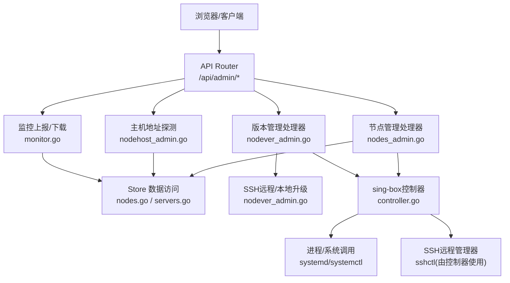
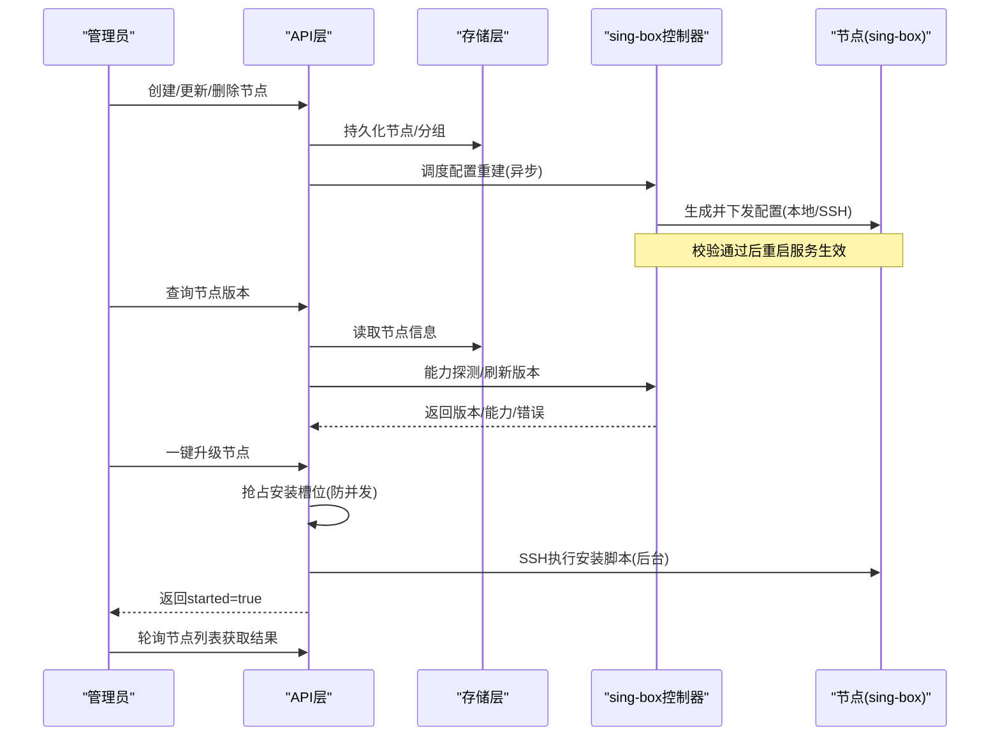
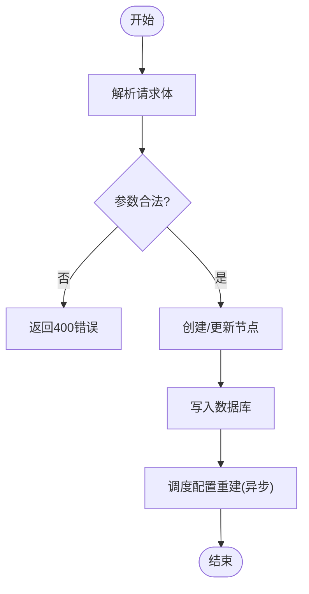
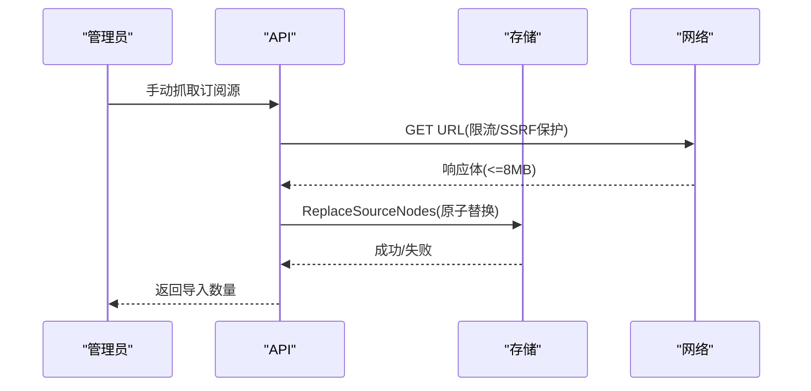
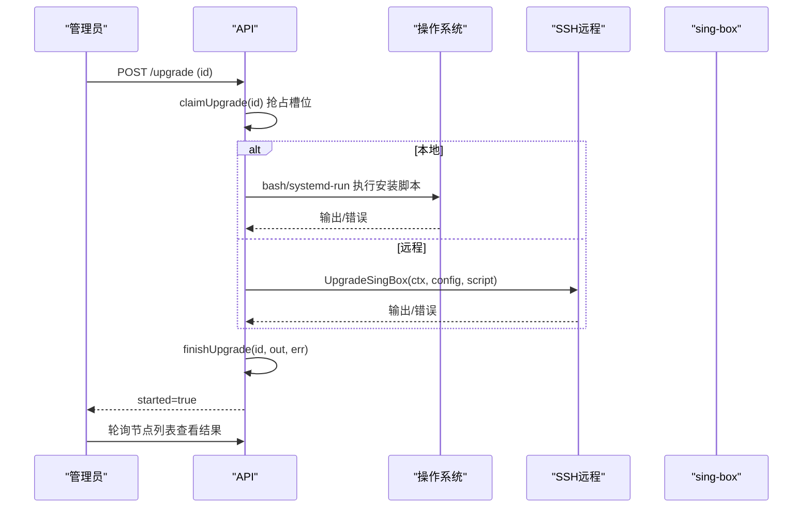
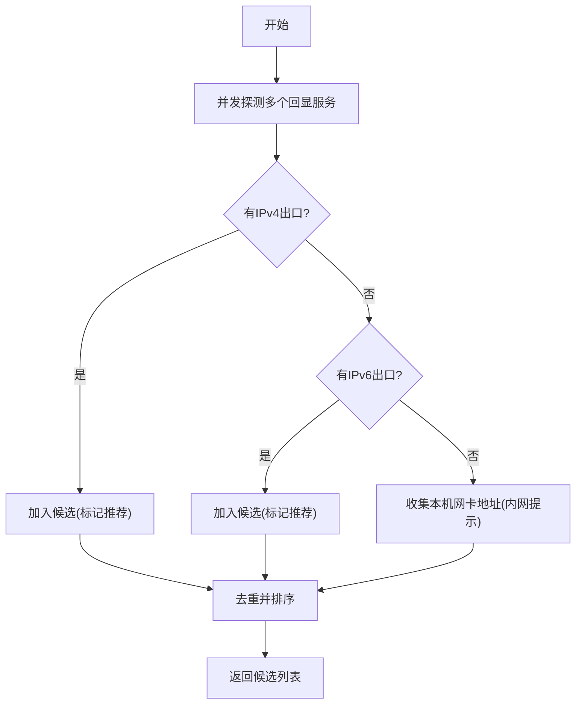
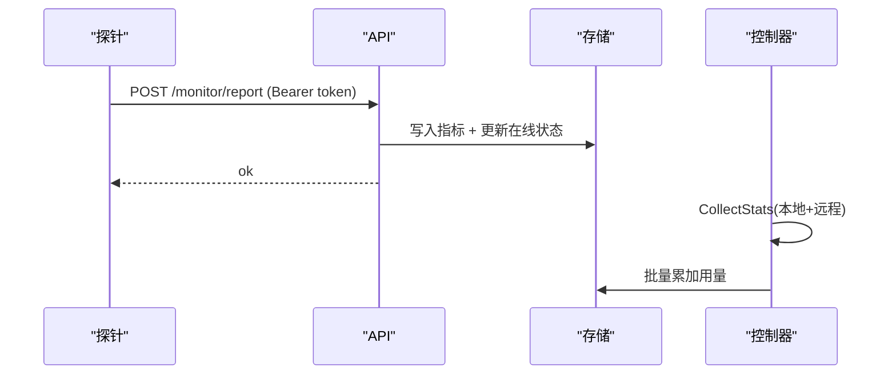
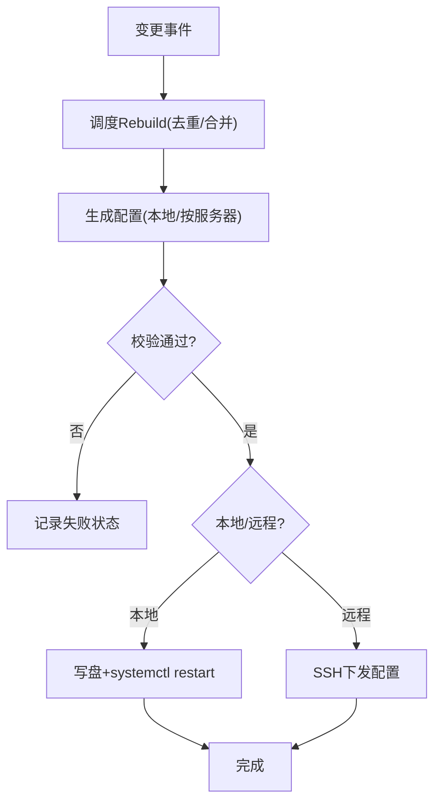
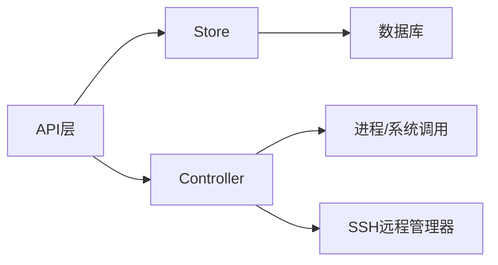

# 节点管理

<cite>
**本文引用的文件**
- [nodes_admin.go](file://internal/api/nodes_admin.go)
- [nodever_admin.go](file://internal/api/nodever_admin.go)
- [nodehost_admin.go](file://internal/api/nodehost_admin.go)
- [router.go](file://internal/api/router.go)
- [monitor.go](file://internal/api/monitor.go)
- [controller.go](file://internal/sbctl/controller.go)
- [nodes.go](file://internal/store/nodes.go)
- [servers.go](file://internal/store/servers.go)
- [localnode.go](file://internal/store/localnode.go)
</cite>

## 目录
1. [简介](#简介)
2. [项目结构](#项目结构)
3. [核心组件](#核心组件)
4. [架构总览](#架构总览)
5. [详细组件分析](#详细组件分析)
6. [依赖关系分析](#依赖关系分析)
7. [性能与容量](#性能与容量)
8. [故障排查指南](#故障排查指南)
9. [结论](#结论)
10. [附录：管理员接口参考](#附录管理员接口参考)

## 简介
本文件面向管理员，提供“轻舟”面板中节点管理的完整API文档。覆盖节点的增删改查、分组与批量导入、版本管理与一键升级、健康监控与探针上报、配置下发与重建、负载均衡与故障转移、通信协议与安全、以及性能优化建议。目标是帮助管理员高效完成节点全生命周期管理。

## 项目结构
节点管理涉及三层：
- API层：HTTP路由与请求处理（节点CRUD、分组、订阅源、版本查询/升级、主机地址探测、监控上报等）
- 编排层：sing-box控制器（配置生成、校验、下发、统计采集、能力探测）
- 存储层：节点、分组、服务器、指标、本地节点资产等持久化

图表来源
- [router.go:132-200](file://internal/api/router.go#L132-L200)
- [nodes_admin.go:19-133](file://internal/api/nodes_admin.go#L19-L133)
- [nodever_admin.go:62-223](file://internal/api/nodever_admin.go#L62-L223)
- [nodehost_admin.go:52-68](file://internal/api/nodehost_admin.go#L52-L68)
- [monitor.go:22-79](file://internal/api/monitor.go#L22-L79)
- [controller.go:357-455](file://internal/sbctl/controller.go#L357-L455)

章节来源
- [router.go:132-200](file://internal/api/router.go#L132-L200)

## 核心组件
- 节点与分组：支持自建节点与外部节点，分组聚合与排序，订阅源自动同步
- 版本管理：查询各节点 sing-box 版本、能力探测、一键重装（本地或远程）
- 主机地址探测：自动发现面板出口IP，辅助填写“节点对外地址”
- 监控与探针：探针定时上报CPU/内存/带宽，面板展示在线状态与指标
- 配置下发：基于用户权限与入站绑定，生成并下发 sing-box 配置，支持并发与超时控制
- 安全：SSH密钥/密码加密存储、探针Token鉴权、SSRF防护、只读路径检测

章节来源
- [nodes.go:11-23](file://internal/store/nodes.go#L11-L23)
- [nodes.go:164-210](file://internal/store/nodes.go#L164-L210)
- [nodever_admin.go:30-54](file://internal/api/nodever_admin.go#L30-L54)
- [nodehost_admin.go:29-68](file://internal/api/nodehost_admin.go#L29-L68)
- [monitor.go:22-79](file://internal/api/monitor.go#L22-L79)
- [controller.go:60-115](file://internal/sbctl/controller.go#L60-L115)

## 架构总览
节点管理的核心流程如下：
- 节点CRUD与分组：通过API接收请求，写入数据库，触发异步配置重建
- 版本管理：查询本地与远程节点 sing-box 版本与能力，支持一键升级（后台任务）
- 监控：探针通过Token认证上报指标，面板更新在线状态与指标
- 配置下发：控制器根据用户授权与入站绑定生成配置，校验后通过本地或SSH下发到目标节点

图表来源
- [nodes_admin.go:48-109](file://internal/api/nodes_admin.go#L48-L109)
- [nodever_admin.go:183-223](file://internal/api/nodever_admin.go#L183-L223)
- [controller.go:357-455](file://internal/sbctl/controller.go#L357-L455)

## 详细组件分析

### 节点CRUD与分组
- 列出节点：返回所有节点及所属分组ID
- 创建节点：支持自建与外部类型；外部节点可从分享链接解析协议与名称
- 更新节点：增量字段更新，避免覆盖未提交字段
- 删除节点：级联清理分组关联
- 分组管理：创建/更新/删除分组；节点可归属多组
- 排序：全局排序影响页面与订阅渲染顺序
- 批量导入：从分享链接批量创建外部节点并可指定分组

图表来源
- [nodes_admin.go:48-109](file://internal/api/nodes_admin.go#L48-L109)
- [nodes.go:98-160](file://internal/store/nodes.go#L98-L160)

章节来源
- [nodes_admin.go:19-133](file://internal/api/nodes_admin.go#L19-L133)
- [nodes.go:40-160](file://internal/store/nodes.go#L40-L160)
- [nodes.go:164-258](file://internal/store/nodes.go#L164-L258)

### 订阅源与自动同步
- 订阅源：维护外部节点来源URL，支持base64等格式
- 抓取：限制大小、TLS校验、SSRF防护，解析为节点列表
- 替换：原子替换该源的节点集合，并记录最近抓取结果
- 定时同步：周期性刷新启用的订阅源，失败记录日志

图表来源
- [nodes_admin.go:272-326](file://internal/api/nodes_admin.go#L272-L326)
- [nodes.go:508-547](file://internal/store/nodes.go#L508-L547)

章节来源
- [nodes_admin.go:215-354](file://internal/api/nodes_admin.go#L215-L354)
- [nodes.go:405-547](file://internal/store/nodes.go#L405-L547)

### 版本管理与一键升级
- 版本查询：列出本机与各远程节点的 sing-box 版本、是否具备v2ray_api能力、最小支持版本
- 刷新：后台刷新所有节点版本
- 一键升级：
  - 本地：仅Linux支持；若面板受ProtectSystem限制，尝试通过systemd-run以临时单元运行安装脚本
  - 远程：通过SSH执行安装脚本，下载二进制并安装
  - 并发控制：同一节点同时只能一个安装任务
  - 结果：后台任务完成后，再次刷新版本显示新值

图表来源
- [nodever_admin.go:183-223](file://internal/api/nodever_admin.go#L183-L223)
- [nodever_admin.go:237-271](file://internal/api/nodever_admin.go#L237-L271)
- [nodever_admin.go:300-338](file://internal/api/nodever_admin.go#L300-L338)

章节来源
- [nodever_admin.go:62-223](file://internal/api/nodever_admin.go#L62-L223)
- [nodever_admin.go:225-369](file://internal/api/nodever_admin.go#L225-L369)

### 主机地址探测
- 目的：为“节点对外地址”提供候选值，避免误填反向代理域名导致客户端无法直连
- 方法：并发探测多个公网回显服务，按IPv4/IPv6分别取首个有效结果；若无公网出口则回退到本机网卡地址
- 推荐：优先推荐实测到的公网出口地址；面板访问地址仅在无其他候选时作为备选

图表来源
- [nodehost_admin.go:52-68](file://internal/api/nodehost_admin.go#L52-L68)
- [nodehost_admin.go:73-127](file://internal/api/nodehost_admin.go#L73-L127)
- [nodehost_admin.go:272-342](file://internal/api/nodehost_admin.go#L272-L342)

章节来源
- [nodehost_admin.go:29-342](file://internal/api/nodehost_admin.go#L29-L342)

### 监控与健康检查
- 探针上报：通过Bearer Token鉴权，上报CPU/内存/磁盘/带宽等指标，面板更新在线状态
- 公开监控：无需登录即可查看已启用探针的服务器状态（默认隐藏面板本机）
- 指标采集：控制器周期采集本地与远程 sing-box 的用户流量，累计至用户用量
- 能力探测：探测远程节点是否支持v2ray_api，决定能否计量与是否注入相关配置块

图表来源
- [monitor.go:22-79](file://internal/api/monitor.go#L22-L79)
- [controller.go:537-589](file://internal/sbctl/controller.go#L537-L589)
- [controller.go:600-649](file://internal/sbctl/controller.go#L600-L649)

章节来源
- [monitor.go:22-79](file://internal/api/monitor.go#L22-L79)
- [monitor.go:781-795](file://internal/api/monitor.go#L781-L795)
- [controller.go:537-649](file://internal/sbctl/controller.go#L537-L649)

### 配置下发与重建
- 触发：节点/分组/入站/TLS变更时，API调度异步重建，避免阻塞HTTP响应
- 生成：根据用户授权与入站绑定生成配置，区分本地与远程节点
- 校验：先校验配置再写入，失败不替换
- 下发：本地直接写盘并重启systemd单元；远程通过SSH下发
- 并发：每个远程节点独立goroutine，设置超时防止卡死
- 能力缓存：对远程节点v2ray_api能力进行缓存与过期重试

图表来源
- [router.go:41-92](file://internal/api/router.go#L41-L92)
- [controller.go:357-455](file://internal/sbctl/controller.go#L357-L455)
- [controller.go:457-522](file://internal/sbctl/controller.go#L457-L522)

章节来源
- [router.go:41-92](file://internal/api/router.go#L41-L92)
- [controller.go:357-522](file://internal/sbctl/controller.go#L357-L522)

### 负载均衡与故障转移
- 分组选择：客户端侧按分组进行url-test自动选择（如“✈️ 节点选择”、“♻️ 自动选择”），实现同组内负载均衡
- 故障转移：当某节点不可用时，url-test会切换到同组内其他可用节点
- 服务端视角：分组由管理员在面板中组织，节点启用/禁用直接影响可用性

章节来源
- [nodes.go:335-401](file://internal/store/nodes.go#L335-L401)
- [subconv/groups.go:1-32](file://internal/subconv/groups.go#L1-L32)

### 通信协议与数据安全
- 节点通信协议：sing-box支持的多种出站协议（由节点类型与协议字段决定）
- 数据传输安全：
  - 探针Token：Bearer鉴权，存储在数据库中加密，查询使用哈希匹配
  - SSH凭据：密钥/密码加密存储，首次连接TOFU记录HostKey
  - SSRF防护：抓取订阅源时限制大小、校验TLS、拒绝内网地址
  - 只读路径：本地安装时检测只读文件系统，必要时通过systemd-run绕过

章节来源
- [servers.go:22-56](file://internal/store/servers.go#L22-L56)
- [servers.go:158-182](file://internal/store/servers.go#L158-L182)
- [nodes_admin.go:301-326](file://internal/api/nodes_admin.go#L301-L326)
- [nodever_admin.go:255-338](file://internal/api/nodever_admin.go#L255-L338)

## 依赖关系分析
- API层依赖Store进行数据读写，依赖Controller进行配置下发与统计
- Controller依赖进程管理器与SSH远程管理器，负责本地与远程节点的配置应用
- Store对敏感字段（SSH、探针Token）进行加密存储，并提供按Token查找的能力

图表来源
- [router.go:21-39](file://internal/api/router.go#L21-L39)
- [controller.go:60-115](file://internal/sbctl/controller.go#L60-L115)
- [servers.go:22-56](file://internal/store/servers.go#L22-L56)

章节来源
- [router.go:21-39](file://internal/api/router.go#L21-L39)
- [controller.go:60-115](file://internal/sbctl/controller.go#L60-L115)
- [servers.go:22-56](file://internal/store/servers.go#L22-L56)

## 性能与容量
- 配置下发并发：远程节点并行下发，单节点超时90秒，避免整体阻塞
- 统计采集并发：远程节点统计采集并发进行，单次采集超时30秒
- 请求体限制：最大8MB，防止恶意大请求造成内存压力
- 版本刷新：后台刷新，避免长耗时阻塞HTTP响应
- 订阅源抓取：限制响应体大小，减少内存占用

[本节为通用指导，不直接分析具体文件]

## 故障排查指南
- 节点不可用：检查探针是否启用且Token正确；查看公开监控页是否可见；确认节点启用状态
- 配置下发失败：查看控制器日志中的失败原因；确认SSH凭据与HostKey；检查本地systemd单元状态
- 一键升级失败：查看升级输出与错误；本地环境是否为Linux；是否存在只读文件系统；远程是否可达
- 订阅源同步失败：检查URL是否可达；是否被SSRF拦截；响应体是否过大；查看最近抓取错误

章节来源
- [monitor.go:22-79](file://internal/api/monitor.go#L22-L79)
- [controller.go:357-455](file://internal/sbctl/controller.go#L357-L455)
- [nodever_admin.go:255-338](file://internal/api/nodever_admin.go#L255-L338)
- [nodes_admin.go:301-326](file://internal/api/nodes_admin.go#L301-L326)

## 结论
本节点管理方案通过清晰的API分层、可靠的配置下发机制、完善的监控与版本管理能力，为管理员提供了完整的节点生命周期管理工具。结合分组与url-test，可实现高效的负载均衡与故障转移；通过严格的安全措施与性能优化，保障大规模节点集群的稳定运行。

[本节为总结性内容，不直接分析具体文件]

## 附录：管理员接口参考
以下接口均位于 /api/admin 前缀下，需管理员登录态。

- 节点管理
  - GET /api/admin/nodes — 列出所有节点
  - POST /api/admin/nodes — 创建节点
  - PUT /api/admin/nodes/{id} — 更新节点
  - DELETE /api/admin/nodes/{id} — 删除节点
  - POST /api/admin/nodes/reorder — 批量调整节点顺序
  - POST /api/admin/nodes/import — 批量导入外部节点（links, group_ids）

- 分组管理
  - GET /api/admin/groups — 列出分组（含节点计数）
  - POST /api/admin/groups — 创建分组
  - PUT /api/admin/groups/{id} — 更新分组
  - DELETE /api/admin/groups/{id} — 删除分组

- 订阅源
  - GET /api/admin/node-sources — 列出订阅源
  - POST /api/admin/node-sources — 创建订阅源
  - PUT /api/admin/node-sources/{id} — 更新订阅源
  - DELETE /api/admin/node-sources/{id} — 删除订阅源
  - POST /api/admin/node-sources/{id}/fetch — 抓取订阅源（可选group_ids）

- 版本管理
  - GET /api/admin/nodes/singbox — 列出节点 sing-box 版本与能力
  - POST /api/admin/nodes/singbox/refresh — 刷新版本探测
  - POST /api/admin/nodes/{id}/singbox/upgrade — 一键升级节点（本地或远程）

- 主机地址探测
  - GET /api/admin/settings/detect-node-host — 探测面板出口IP，返回候选值

- 监控
  - POST /api/monitor/report — 探针上报指标（Bearer Token）
  - GET /api/monitor/agent/{arch} — 下载探针二进制
  - GET /api/monitor/install.sh — 下载一键安装脚本
  - GET /api/monitor/public — 公开监控页（无需登录）

章节来源
- [nodes_admin.go:19-354](file://internal/api/nodes_admin.go#L19-L354)
- [nodever_admin.go:62-223](file://internal/api/nodever_admin.go#L62-L223)
- [nodehost_admin.go:52-68](file://internal/api/nodehost_admin.go#L52-L68)
- [monitor.go:22-79](file://internal/api/monitor.go#L22-L79)
- [monitor.go:781-795](file://internal/api/monitor.go#L781-L795)
