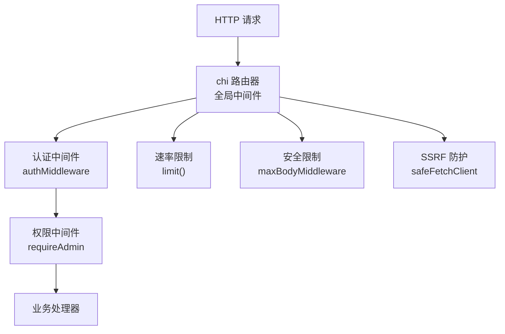
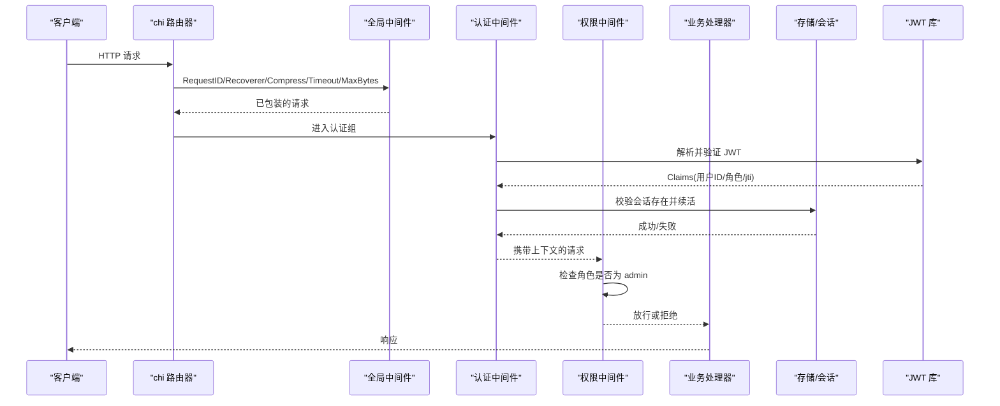
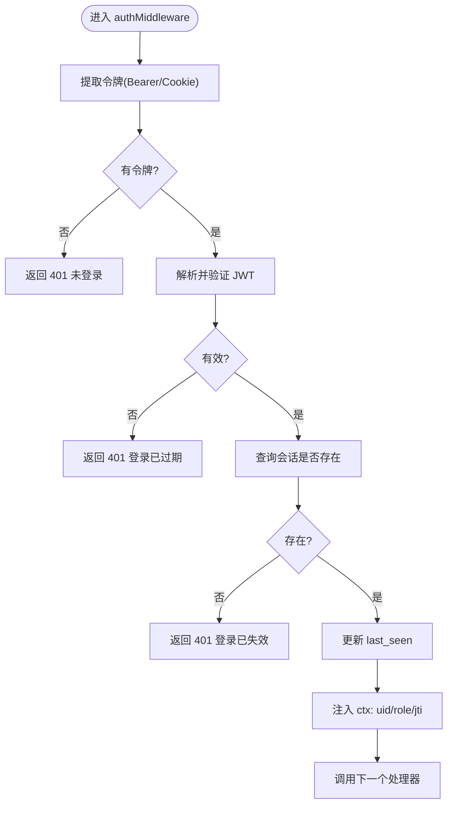
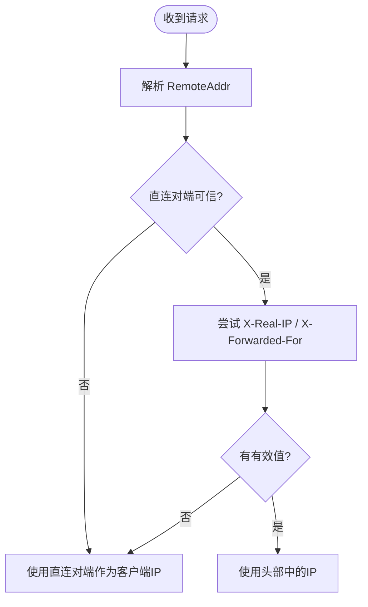
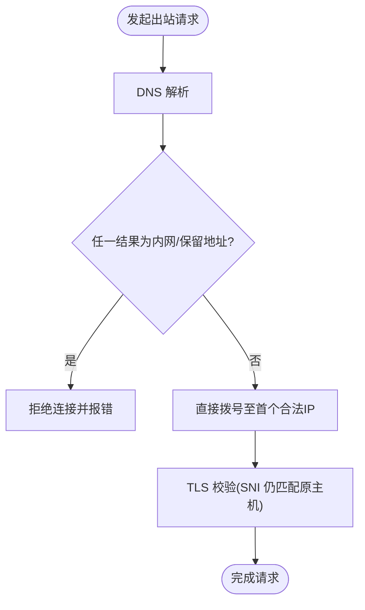
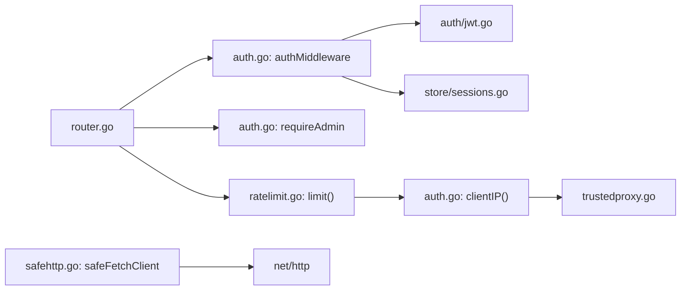

# 中间件与安全控制

<cite>
**本文引用的文件**
- [internal/api/auth.go](file://internal/api/auth.go)
- [internal/api/router.go](file://internal/api/router.go)
- [internal/api/safehttp.go](file://internal/api/safehttp.go)
- [internal/api/trustedproxy.go](file://internal/api/trustedproxy.go)
- [internal/api/ratelimit.go](file://internal/api/ratelimit.go)
- [internal/auth/jwt.go](file://internal/auth/jwt.go)
- [internal/auth/password.go](file://internal/auth/password.go)
- [internal/store/sessions.go](file://internal/store/sessions.go)
- [internal/api/subinfo.go](file://internal/api/subinfo.go)
- [main.go](file://main.go)
</cite>

## 目录
1. [简介](#简介)
2. [项目结构](#项目结构)
3. [核心组件](#核心组件)
4. [架构总览](#架构总览)
5. [详细组件分析](#详细组件分析)
6. [依赖关系分析](#依赖关系分析)
7. [性能考虑](#性能考虑)
8. [故障排查指南](#故障排查指南)
9. [结论](#结论)
10. [附录：使用示例与自定义中间件指南](#附录使用示例与自定义中间件指南)

## 简介
本文件聚焦于系统的中间件与安全控制机制，围绕以下目标展开：
- 解析 authMiddleware 的实现原理：JWT 令牌解析、会话校验、用户上下文注入。
- 说明 requireAdmin 权限控制中间件的实现逻辑。
- 解释 trusted proxy 识别机制与客户端 IP 获取的安全策略。
- 梳理 safehttp 中的安全响应头与请求处理方法（如 SSRF 防护、最大请求体限制、URL 白名单）。
- 提供中间件使用示例与自定义中间件开发指南。
- 记录安全防护措施：XSS/点击劫持防护、CSRF 保护思路、速率限制等。
- 给出安全配置最佳实践与常见问题解决方案。

## 项目结构
安全相关能力主要分布在以下模块：
- 路由与全局中间件：router.go
- 认证与会话：auth.go、store/sessions.go
- JWT 签发与校验：auth/jwt.go
- 密码哈希与防时序泄露：auth/password.go
- 可信代理与真实 IP：trustedproxy.go
- 安全 HTTP 工具：safehttp.go
- 速率限制：ratelimit.go
- 订阅页面安全响应头：subinfo.go
- 应用启动与服务器配置：main.go

图表来源
- [internal/api/router.go:132-147](file://internal/api/router.go#L132-L147)
- [internal/api/auth.go:179-201](file://internal/api/auth.go#L179-L201)
- [internal/api/ratelimit.go:53-64](file://internal/api/ratelimit.go#L53-L64)
- [internal/api/safehttp.go:58-69](file://internal/api/safehttp.go#L58-L69)
- [internal/api/safehttp.go:27-56](file://internal/api/safehttp.go#L27-L56)

章节来源
- [internal/api/router.go:132-147](file://internal/api/router.go#L132-L147)
- [internal/api/auth.go:179-201](file://internal/api/auth.go#L179-L201)
- [internal/api/ratelimit.go:53-64](file://internal/api/ratelimit.go#L53-L64)
- [internal/api/safehttp.go:27-69](file://internal/api/safehttp.go#L27-L69)

## 核心组件
- 认证中间件 authMiddleware：从请求中读取 JWT（支持 Authorization: Bearer 或 Cookie），校验签名与有效期，检查会话是否仍然有效，更新会话最后访问时间，并将用户 ID、角色、jti 注入到请求上下文。
- 管理员权限中间件 requireAdmin：从上下文中读取角色，仅允许 admin 角色访问受保护路由。
- 可信代理与真实 IP：仅在直连对端为可信代理时，才信任 X-Real-IP / X-Forwarded-For；否则回退到直连对端地址，防止伪造。
- 安全 HTTP：限制请求体大小、对外发起的出站连接进行内网地址拦截（含 DNS 重绑定防护）、对用户提供的 URL 做协议白名单校验。
- 速率限制：基于固定时间窗口的每 IP 限流，用于登录、注册、重置密码、探针上报等敏感接口。
- 会话管理：JWT 绑定 jti，持久化会话并支持查看、撤销、清理过期会话。
- 密码安全：bcrypt 哈希与比较；不存在用户时也执行耗时比较以抵御枚举攻击。

章节来源
- [internal/api/auth.go:179-213](file://internal/api/auth.go#L179-L213)
- [internal/api/trustedproxy.go:22-64](file://internal/api/trustedproxy.go#L22-L64)
- [internal/api/safehttp.go:15-56](file://internal/api/safehttp.go#L15-L56)
- [internal/api/ratelimit.go:9-64](file://internal/api/ratelimit.go#L9-L64)
- [internal/store/sessions.go:15-36](file://internal/store/sessions.go#L15-L36)
- [internal/auth/password.go:5-23](file://internal/auth/password.go#L5-L23)

## 架构总览
下图展示了请求进入后的处理链路：全局中间件统一设置请求 ID、恢复、压缩、超时与请求体大小限制；随后按路由分组挂载认证与权限中间件；敏感接口通过速率限制器；需要外发请求的处理器使用安全的出站客户端。

图表来源
- [internal/api/router.go:132-147](file://internal/api/router.go#L132-L147)
- [internal/api/auth.go:179-201](file://internal/api/auth.go#L179-L201)
- [internal/auth/jwt.go:16-41](file://internal/auth/jwt.go#L16-L41)
- [internal/store/sessions.go:25-36](file://internal/store/sessions.go#L25-L36)

## 详细组件分析

### 认证中间件 authMiddleware
- 令牌来源：优先 Authorization: Bearer，其次 Cookie qz_token。
- 令牌解析：使用 HS256 算法校验签名与有效期。
- 会话校验：根据 jti 查询会话是否存在，若不存在则视为失效；每次命中会更新 last_seen。
- 上下文注入：将用户 ID、角色、jti 写入请求上下文，供后续处理器使用。
- 错误处理：未携带令牌、签名无效、会话失效均返回未授权。

图表来源
- [internal/api/auth.go:179-201](file://internal/api/auth.go#L179-L201)
- [internal/auth/jwt.go:16-41](file://internal/auth/jwt.go#L16-L41)
- [internal/store/sessions.go:25-36](file://internal/store/sessions.go#L25-L36)

章节来源
- [internal/api/auth.go:179-201](file://internal/api/auth.go#L179-L201)
- [internal/auth/jwt.go:16-41](file://internal/auth/jwt.go#L16-L41)
- [internal/store/sessions.go:25-36](file://internal/store/sessions.go#L25-L36)

### 管理员权限中间件 requireAdmin
- 从请求上下文读取角色字段。
- 非 admin 直接拒绝，返回禁止访问。
- 与认证中间件配合，确保只有已登录且具备管理员角色的请求可进入管理路由组。

章节来源
- [internal/api/auth.go:204-213](file://internal/api/auth.go#L204-L213)
- [internal/api/router.go:210-214](file://internal/api/router.go#L210-L214)

### 可信代理识别与客户端 IP 获取
- 可信代理列表：默认包含本地回环 IPv4/IPv6，可通过环境变量 QZ_TRUSTED_PROXIES 追加 CIDR。
- peerTrusted：判断直连 TCP 对端是否属于可信代理。
- clientIP：仅当直连对端可信时，才信任 X-Real-IP 与 X-Forwarded-For；否则使用直连对端地址。
- 安全意义：防止恶意客户端伪造头部绕过限速、Host 污染等。

图表来源
- [internal/api/trustedproxy.go:22-64](file://internal/api/trustedproxy.go#L22-L64)
- [internal/api/auth.go:28-47](file://internal/api/auth.go#L28-L47)

章节来源
- [internal/api/trustedproxy.go:22-64](file://internal/api/trustedproxy.go#L22-L64)
- [internal/api/auth.go:28-47](file://internal/api/auth.go#L28-L47)

### safehttp 安全响应头与请求处理
- 出站 SSRF 防护：safeFetchClient 在拨号前解析域名并检查所有解析结果，拒绝回环、私有、链路本地、未指定及 CGNAT 地址；直接使用首个合法 IP 拨号以避免 DNS 重绑定窗口。
- 请求体限制：maxBodyMiddleware 使用 MaxBytesReader 限制请求体大小，避免内存压力。
- URL 白名单：validFetchURL 仅允许 http/https，并要求主机名存在。
- 订阅页面安全响应头：Cache-Control=no-store、X-Content-Type-Options=nosniff、X-Frame-Options=DENY、Referrer-Policy=no-referrer，降低缓存与点击劫持风险。

图表来源
- [internal/api/safehttp.go:15-56](file://internal/api/safehttp.go#L15-L56)
- [internal/api/safehttp.go:71-85](file://internal/api/safehttp.go#L71-L85)
- [internal/api/subinfo.go:240-246](file://internal/api/subinfo.go#L240-L246)

章节来源
- [internal/api/safehttp.go:15-85](file://internal/api/safehttp.go#L15-L85)
- [internal/api/subinfo.go:240-246](file://internal/api/subinfo.go#L240-L246)

### 速率限制
- 固定窗口计数器：每个 key（通常为客户端 IP）维护计数与窗口重置时间。
- 按组挂载：登录、注册、忘记密码、重置密码等接口使用 per-IP 限流；探针上报与订阅地址交换也有独立限流器。
- 超限响应：返回“请求过于频繁”。

章节来源
- [internal/api/ratelimit.go:9-64](file://internal/api/ratelimit.go#L9-L64)
- [internal/api/router.go:155-168](file://internal/api/router.go#L155-L168)

### 会话管理与令牌生命周期
- 登录流程：生成 jti，创建会话（合并同设备重复登录），签发 JWT 并设置 Cookie。
- 会话校验：JWT 中的 jti 必须仍在会话表中；每次命中续活 last_seen。
- 登出：删除当前 jti 对应会话并清空 Cookie。
- 会话列表与撤销：支持列出设备会话、撤销指定会话、批量清理过期会话。

章节来源
- [internal/api/auth.go:49-65](file://internal/api/auth.go#L49-L65)
- [internal/api/auth.go:165-177](file://internal/api/auth.go#L165-L177)
- [internal/store/sessions.go:15-36](file://internal/store/sessions.go#L15-L36)
- [internal/store/sessions.go:38-132](file://internal/store/sessions.go#L38-L132)

### 密码安全与防枚举
- 使用 bcrypt 哈希与比较。
- 用户名不存在时执行 dummy 比较，使响应时间与正确路径相近，抵御用户名枚举。

章节来源
- [internal/auth/password.go:5-23](file://internal/auth/password.go#L5-L23)
- [internal/api/auth.go:122-137](file://internal/api/auth.go#L122-L137)

## 依赖关系分析
- 路由层依赖 chi 中间件：RequestID、Recoverer、Compress、Timeout、自定义 maxBodyMiddleware。
- 认证依赖 JWT 库与存储层会话表。
- 可信代理依赖环境变量与网络包。
- 安全出站依赖 net/http.Transport 的 DialContext 钩子。
- 速率限制依赖内置 map 与互斥锁。

图表来源
- [internal/api/router.go:132-147](file://internal/api/router.go#L132-L147)
- [internal/api/auth.go:179-213](file://internal/api/auth.go#L179-L213)
- [internal/api/ratelimit.go:53-64](file://internal/api/ratelimit.go#L53-L64)
- [internal/auth/jwt.go:16-41](file://internal/auth/jwt.go#L16-L41)
- [internal/store/sessions.go:25-36](file://internal/store/sessions.go#L25-L36)
- [internal/api/trustedproxy.go:22-64](file://internal/api/trustedproxy.go#L22-L64)
- [internal/api/safehttp.go:27-56](file://internal/api/safehttp.go#L27-L56)

章节来源
- [internal/api/router.go:132-147](file://internal/api/router.go#L132-L147)
- [internal/api/auth.go:179-213](file://internal/api/auth.go#L179-L213)
- [internal/api/ratelimit.go:53-64](file://internal/api/ratelimit.go#L53-L64)
- [internal/auth/jwt.go:16-41](file://internal/auth/jwt.go#L16-L41)
- [internal/store/sessions.go:25-36](file://internal/store/sessions.go#L25-L36)
- [internal/api/trustedproxy.go:22-64](file://internal/api/trustedproxy.go#L22-L64)
- [internal/api/safehttp.go:27-56](file://internal/api/safehttp.go#L27-L56)

## 性能考虑
- 全局压缩：对 JSON API 与静态资源启用 gzip，带宽收益显著。
- 请求体限制：防止大体积 POST 导致内存压力。
- 会话续活节流：last_seen 最多每分钟更新一次，减少写放大。
- 速率限制：固定窗口简单高效，适合面板流量特征。
- 出站连接：DNS 解析后直接拨号首个合法 IP，避免重解析窗口，同时保持 TLS 校验。

[本节为通用性能讨论，不直接分析具体文件]

## 故障排查指南
- 无法获取真实 IP：确认反向代理直连对端是否在可信代理列表中；检查环境变量 QZ_TRUSTED_PROXIES。
- 登录立即失效：检查会话是否被撤销或过期；确认 JWT 的 jti 与存储一致。
- 管理员接口 403：确认已通过认证且角色为 admin。
- 出站请求被拒：检查目标是否解析到内网/保留地址；确认 URL 协议为 http/https。
- 订阅页面被缓存：确认响应头包含 no-store；必要时清除 CDN/浏览器缓存。
- 速率限制触发：检查同一 IP 的登录/重置等接口频率，适当放宽或优化客户端重试策略。

章节来源
- [internal/api/trustedproxy.go:22-64](file://internal/api/trustedproxy.go#L22-L64)
- [internal/api/auth.go:179-201](file://internal/api/auth.go#L179-L201)
- [internal/api/safehttp.go:71-85](file://internal/api/safehttp.go#L71-L85)
- [internal/api/subinfo.go:240-246](file://internal/api/subinfo.go#L240-L246)
- [internal/api/ratelimit.go:53-64](file://internal/api/ratelimit.go#L53-L64)

## 结论
本系统通过分层中间件实现了完整的认证、鉴权、速率限制与安全输入输出控制。JWT + 会话表结合，既支持无状态校验又具备细粒度撤销能力；可信代理模型确保真实 IP 不被伪造；safehttp 提供了 SSRF 防护与最小化的响应头暴露；整体设计兼顾安全性与性能，适用于多租户面板场景。

[本节为总结性内容，不直接分析具体文件]

## 附录：使用示例与自定义中间件指南

### 中间件使用示例
- 公开接口：无需认证，可直接注册路由。
- 需登录接口：在路由组上挂载认证中间件。
- 管理员接口：在认证基础上再挂载权限中间件。
- 敏感接口：在路由组上挂载速率限制中间件。

章节来源
- [internal/api/router.go:149-214](file://internal/api/router.go#L149-L214)

### 自定义中间件开发指南
- 插入位置：在全局中间件之后、业务处理器之前；如需影响所有请求，放在 router.Use 链中。
- 常见职责：日志记录、请求 ID、超时控制、请求体大小限制、安全头设置、来源校验、限流等。
- 注意事项：
  - 不要无条件信任 X-Forwarded-For/X-Real-IP，应通过可信代理判断。
  - 对敏感操作增加速率限制。
  - 对出站请求使用安全客户端，避免 SSRF。
  - 对响应设置必要的安全头（如 nosniff、no-store、DENY 等）。

章节来源
- [internal/api/router.go:132-147](file://internal/api/router.go#L132-L147)
- [internal/api/safehttp.go:58-69](file://internal/api/safehttp.go#L58-L69)
- [internal/api/subinfo.go:240-246](file://internal/api/subinfo.go#L240-L246)

### 安全防护措施清单
- XSS/点击劫持：
  - 设置 X-Content-Type-Options: nosniff。
  - 设置 X-Frame-Options: DENY。
  - 设置 Referrer-Policy: no-referrer。
  - 对动态渲染内容做好转义（前端框架通常自带）。
- CSRF 保护：
  - 表单提交建议采用 SameSite Cookie 策略与一次性令牌；本项目以 JWT + 会话为主，API 侧应避免跨站伪造。
- 速率限制：
  - 登录/注册/重置密码等接口按 IP 限流。
  - 探针上报与订阅地址交换按各自维度限流。
- SSRF 防护：
  - 出站连接拒绝内网/保留地址，并在拨号阶段校验，抵御 DNS 重绑定。
- 请求体限制：
  - 全局限制请求体大小，防止内存耗尽。

章节来源
- [internal/api/subinfo.go:240-246](file://internal/api/subinfo.go#L240-L246)
- [internal/api/ratelimit.go:53-64](file://internal/api/ratelimit.go#L53-L64)
- [internal/api/safehttp.go:15-69](file://internal/api/safehttp.go#L15-L69)

### 安全配置最佳实践
- JWT 密钥：
  - 使用强随机密钥并通过环境变量注入；生产环境建议与数据库分离存放。
- 可信代理：
  - 仅将受信任的反向代理加入 QZ_TRUSTED_PROXIES；默认仅信任本地回环。
- 会话策略：
  - 合理设置令牌 TTL；定期清理过期会话；支持远程撤销。
- 出站安全：
  - 所有外部请求使用 safeFetchClient；严格校验 URL 协议与主机。
- 响应头：
  - 对所有敏感页面设置 no-store、nosniff、DENY 等安全头。
- 密码安全：
  - 使用 bcrypt；登录失败路径统一耗时，防止枚举。

章节来源
- [main.go:51-71](file://main.go#L51-L71)
- [internal/api/trustedproxy.go:22-40](file://internal/api/trustedproxy.go#L22-L40)
- [internal/store/sessions.go:56-132](file://internal/store/sessions.go#L56-L132)
- [internal/api/safehttp.go:71-85](file://internal/api/safehttp.go#L71-L85)
- [internal/api/subinfo.go:240-246](file://internal/api/subinfo.go#L240-L246)
- [internal/auth/password.go:14-23](file://internal/auth/password.go#L14-L23)
