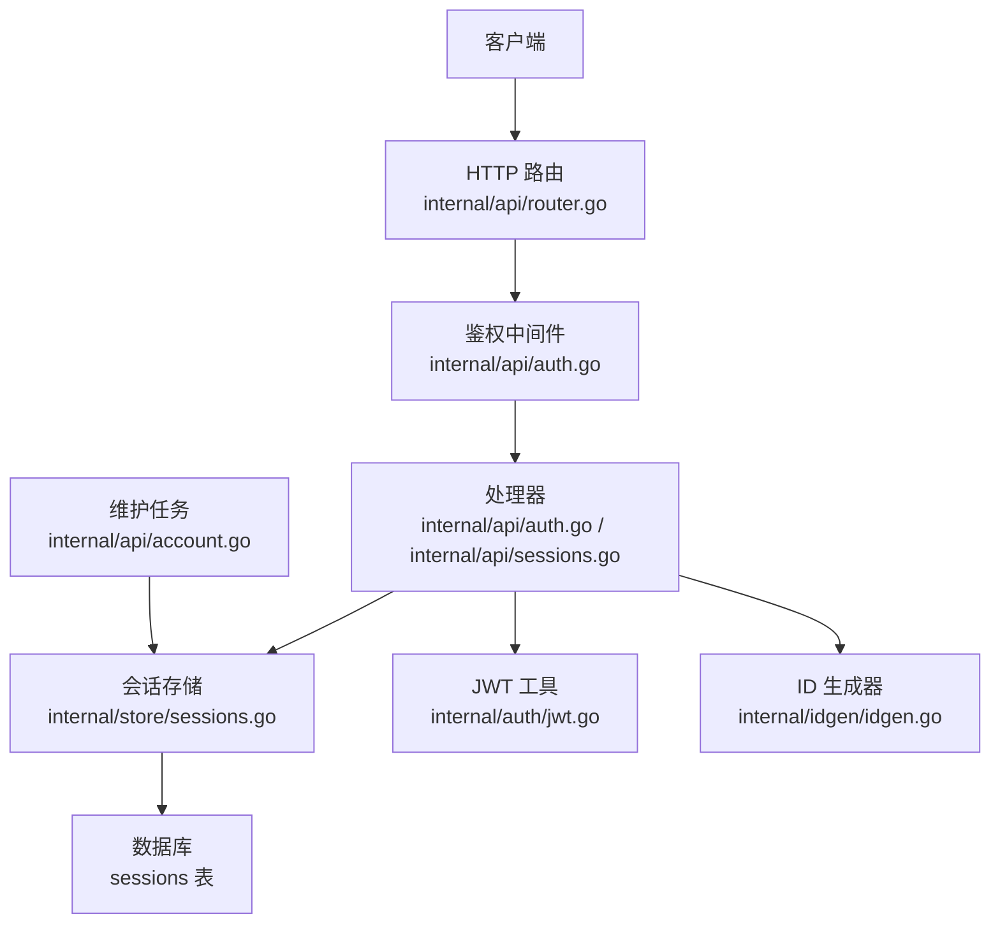
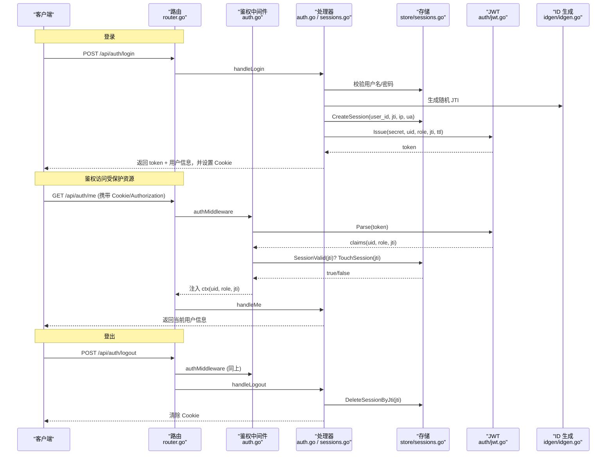
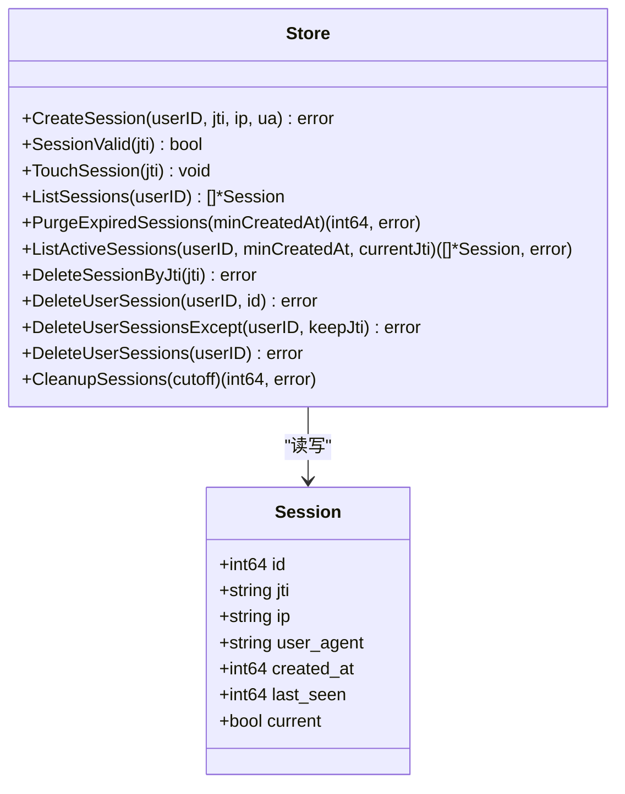
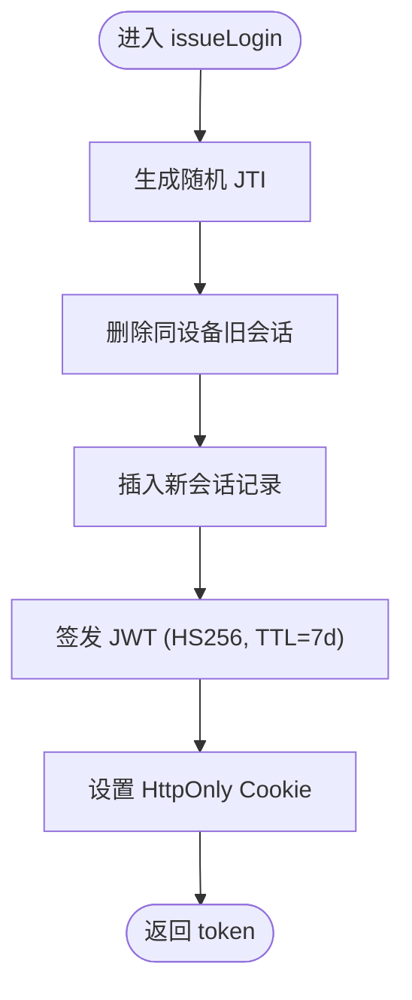
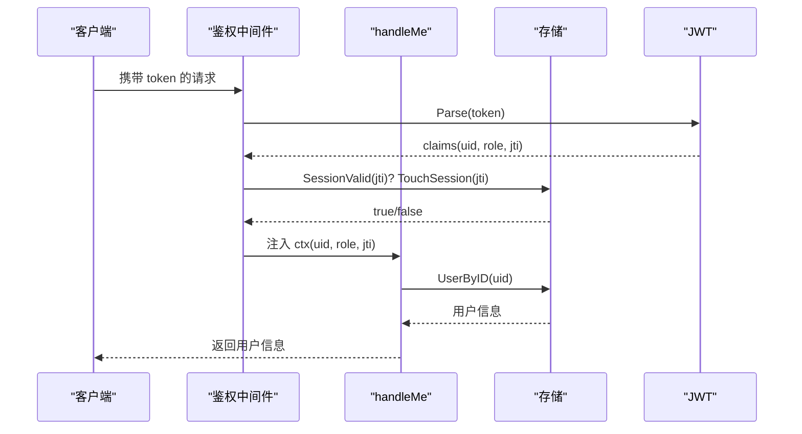
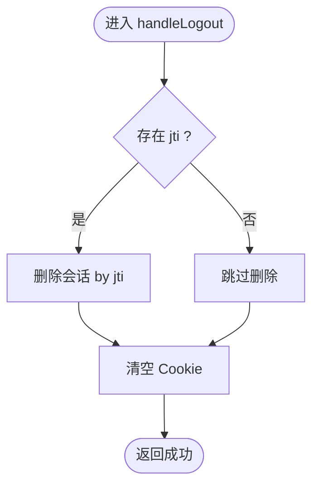
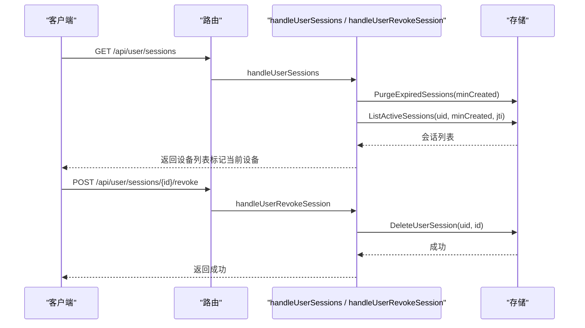
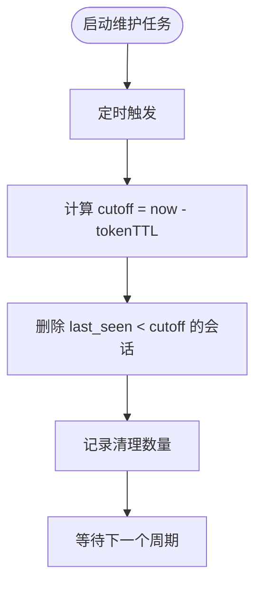
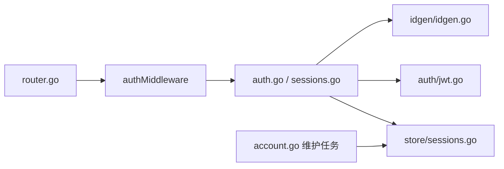

# 会话管理

<cite>
**本文引用的文件**
- [internal/api/auth.go](file://internal/api/auth.go)
- [internal/api/sessions.go](file://internal/api/sessions.go)
- [internal/store/sessions.go](file://internal/store/sessions.go)
- [internal/auth/jwt.go](file://internal/auth/jwt.go)
- [internal/idgen/idgen.go](file://internal/idgen/idgen.go)
- [internal/api/router.go](file://internal/api/router.go)
- [internal/store/migrate.go](file://internal/store/migrate.go)
- [internal/api/account.go](file://internal/api/account.go)
</cite>

## 目录
1. [简介](#简介)
2. [项目结构](#项目结构)
3. [核心组件](#核心组件)
4. [架构总览](#架构总览)
5. [详细组件分析](#详细组件分析)
6. [依赖关系分析](#依赖关系分析)
7. [性能考虑](#性能考虑)
8. [故障排查指南](#故障排查指南)
9. [结论](#结论)
10. [附录：API 调用示例](#附录api-调用示例)

## 简介
本章节面向“会话管理”功能，覆盖以下目标：
- 会话的创建、验证、更新与销毁机制
- issueLogin 如何生成唯一 JTI 并创建会话记录
- handleMe 与 handleLogout 的实现逻辑
- 会话存储结构、过期策略与清理机制
- 会话管理的 API 调用示例（获取当前用户信息、登出）
- 安全特性与防重放措施
- 多设备登录管理与远程会话吊销使用指南

## 项目结构
与会话相关的代码主要分布在以下模块：
- API 层：路由定义与请求处理（登录、获取当前用户、登出、列出/吊销会话）
- 认证层：JWT 签发与解析
- 存储层：会话表结构与 CRUD 操作
- ID 生成：JTI 等随机标识符
- 维护任务：定期清理过期会话

图表来源
- [internal/api/router.go:170-208](file://internal/api/router.go#L170-L208)
- [internal/api/auth.go:179-202](file://internal/api/auth.go#L179-L202)
- [internal/api/sessions.go:13-42](file://internal/api/sessions.go#L13-L42)
- [internal/store/sessions.go:15-133](file://internal/store/sessions.go#L15-L133)
- [internal/auth/jwt.go:16-42](file://internal/auth/jwt.go#L16-L42)
- [internal/idgen/idgen.go:42-49](file://internal/idgen/idgen.go#L42-L49)
- [internal/api/account.go:52-83](file://internal/api/account.go#L52-L83)

章节来源
- [internal/api/router.go:170-208](file://internal/api/router.go#L170-L208)
- [internal/api/auth.go:179-202](file://internal/api/auth.go#L179-L202)
- [internal/store/migrate.go:211-221](file://internal/store/migrate.go#L211-L221)

## 核心组件
- 会话模型与存储：Session 结构体及 Create/List/Purge/Touch/Delete 等方法
- 鉴权中间件：从 Cookie/Authorization 头提取 Token，校验签名与存在性，注入上下文
- 登录流程：issueLogin 生成 JTI、写入会话、签发 JWT、设置 Cookie
- 会话管理接口：列出在线设备、按设备吊销
- 维护任务：周期性清理过期会话

章节来源
- [internal/store/sessions.go:5-133](file://internal/store/sessions.go#L5-L133)
- [internal/api/auth.go:51-65](file://internal/api/auth.go#L51-L65)
- [internal/api/auth.go:151-177](file://internal/api/auth.go#L151-L177)
- [internal/api/sessions.go:13-42](file://internal/api/sessions.go#L13-L42)
- [internal/api/account.go:52-83](file://internal/api/account.go#L52-L83)

## 架构总览
下图展示了从登录到鉴权再到会话管理的完整链路。

图表来源
- [internal/api/router.go:170-208](file://internal/api/router.go#L170-L208)
- [internal/api/auth.go:112-177](file://internal/api/auth.go#L112-L177)
- [internal/api/auth.go:179-202](file://internal/api/auth.go#L179-L202)
- [internal/store/sessions.go:15-36](file://internal/store/sessions.go#L15-L36)
- [internal/auth/jwt.go:16-42](file://internal/auth/jwt.go#L16-L42)
- [internal/idgen/idgen.go:42-49](file://internal/idgen/idgen.go#L42-L49)

## 详细组件分析

### 会话数据模型与存储
- 表结构：sessions 包含 id、user_id、jti（唯一）、ip、user_agent、created_at、last_seen，并建立 user_id 与 jti 索引
- 关键方法：
  - CreateSession：先删除同设备的旧行（相同 IP+UA），再插入新行，避免重复累积
  - SessionValid：检查 jti 是否存在（用于支持远程吊销）
  - TouchSession：每分钟最多更新一次 last_seen，减少写放大
  - ListActiveSessions：按 created_at >= minCreatedAt 过滤有效会话，并按设备去重（IP+UA），优先保留当前设备行
  - PurgeExpiredSessions/CleanupSessions：分别基于 created_at 与 last_seen 清理过期/长期不活跃会话
  - DeleteUserSession/DeleteSessionByJti/DeleteUserSessionsExcept/DeleteUserSessions：多种粒度注销

图表来源
- [internal/store/sessions.go:5-133](file://internal/store/sessions.go#L5-L133)
- [internal/store/migrate.go:211-221](file://internal/store/migrate.go#L211-L221)

章节来源
- [internal/store/sessions.go:5-133](file://internal/store/sessions.go#L5-L133)
- [internal/store/migrate.go:211-221](file://internal/store/migrate.go#L211-L221)

### 登录与会话创建：issueLogin
- 生成唯一 JTI：通过 idgen.RandToken(12) 产生高熵随机字符串作为 JWT 的 ID（即 JTI）
- 写入会话：调用 CreateSession 将 user_id、jti、ip、ua 持久化；若同一设备已存在则先删后插，保证每设备一行
- 签发 JWT：调用 auth.Issue 以 HS256 签名，claims 中嵌入 uid、role、jti、issued_at、expires_at（TTL 为 7 天）
- 设置 Cookie：将 token 写入名为 qz_token 的 HttpOnly Cookie（HTTPS 时启用 Secure）

图表来源
- [internal/api/auth.go:51-65](file://internal/api/auth.go#L51-L65)
- [internal/idgen/idgen.go:42-49](file://internal/idgen/idgen.go#L42-L49)
- [internal/auth/jwt.go:16-28](file://internal/auth/jwt.go#L16-L28)

章节来源
- [internal/api/auth.go:51-65](file://internal/api/auth.go#L51-L65)
- [internal/idgen/idgen.go:42-49](file://internal/idgen/idgen.go#L42-L49)
- [internal/auth/jwt.go:16-28](file://internal/auth/jwt.go#L16-L28)

### 鉴权中间件与 handleMe
- 鉴权中间件：
  - 从 Authorization 或 Cookie 读取 token
  - 解析 JWT，校验签名与有效期
  - 校验会话是否仍存在（支持远程吊销）
  - 每次请求更新 last_seen（节流至每分钟一次）
  - 将 uid、role、jti 注入请求上下文
- handleMe：
  - 从上下文取 uid，查询用户信息并返回

图表来源
- [internal/api/auth.go:179-202](file://internal/api/auth.go#L179-L202)
- [internal/api/auth.go:151-163](file://internal/api/auth.go#L151-L163)
- [internal/store/sessions.go:25-36](file://internal/store/sessions.go#L25-L36)
- [internal/auth/jwt.go:30-42](file://internal/auth/jwt.go#L30-L42)

章节来源
- [internal/api/auth.go:151-202](file://internal/api/auth.go#L151-L202)
- [internal/store/sessions.go:25-36](file://internal/store/sessions.go#L25-L36)
- [internal/auth/jwt.go:30-42](file://internal/auth/jwt.go#L30-L42)

### 登出：handleLogout
- 若上下文中存在 jti，则删除对应会话记录
- 清空 Cookie（MaxAge=-1），使客户端失效
- 返回成功响应

图表来源
- [internal/api/auth.go:165-177](file://internal/api/auth.go#L165-L177)

章节来源
- [internal/api/auth.go:165-177](file://internal/api/auth.go#L165-L177)

### 会话列表与设备级吊销
- 列出会话：
  - 清理过期会话（created_at < minCreated）
  - 查询当前用户的活跃会话（created_at >= minCreated），按设备去重，标记当前设备
- 吊销会话：
  - 根据会话 id 与用户 id 删除指定会话，实现“单设备下线”

图表来源
- [internal/api/sessions.go:13-42](file://internal/api/sessions.go#L13-L42)
- [internal/store/sessions.go:56-110](file://internal/store/sessions.go#L56-L110)

章节来源
- [internal/api/sessions.go:13-42](file://internal/api/sessions.go#L13-L42)
- [internal/store/sessions.go:56-110](file://internal/store/sessions.go#L56-L110)

### 过期策略与清理机制
- 过期策略：
  - JWT TTL 为 7 天；令牌过期后无法通过鉴权
  - 会话表通过 created_at 与 last_seen 双重维度控制有效性
- 清理机制：
  - 列出会话时主动清理 created_at < minCreated 的“死会话”
  - 维护任务定时执行 CleanupSessions(last_seen < cutoff)，cutoff = now - tokenTTL
  - TouchSession 限制每分钟一次更新，降低写放大

图表来源
- [internal/api/account.go:52-83](file://internal/api/account.go#L52-L83)
- [internal/store/sessions.go:124-133](file://internal/store/sessions.go#L124-L133)

章节来源
- [internal/api/account.go:52-83](file://internal/api/account.go#L52-L83)
- [internal/store/sessions.go:56-66](file://internal/store/sessions.go#L56-L66)
- [internal/store/sessions.go:124-133](file://internal/store/sessions.go#L124-L133)

## 依赖关系分析
- 路由依赖：/api/auth/* 与 /api/user/sessions/* 由 router.go 注册
- 鉴权依赖：authMiddleware 依赖 JWT 解析与会话存在性检查
- 存储依赖：所有会话操作均通过 store/sessions.go 访问数据库
- 维护任务：account.go 中的维护任务驱动会话清理

图表来源
- [internal/api/router.go:170-208](file://internal/api/router.go#L170-L208)
- [internal/api/auth.go:179-202](file://internal/api/auth.go#L179-L202)
- [internal/api/sessions.go:13-42](file://internal/api/sessions.go#L13-L42)
- [internal/store/sessions.go:15-133](file://internal/store/sessions.go#L15-L133)
- [internal/auth/jwt.go:16-42](file://internal/auth/jwt.go#L16-L42)
- [internal/idgen/idgen.go:42-49](file://internal/idgen/idgen.go#L42-L49)
- [internal/api/account.go:52-83](file://internal/api/account.go#L52-L83)

章节来源
- [internal/api/router.go:170-208](file://internal/api/router.go#L170-L208)
- [internal/api/auth.go:179-202](file://internal/api/auth.go#L179-L202)
- [internal/api/account.go:52-83](file://internal/api/account.go#L52-L83)

## 性能考虑
- 写优化：
  - CreateSession 先删后插，避免同设备重复累积
  - TouchSession 限频至每分钟一次，降低写放大
- 读优化：
  - ListActiveSessions 在内存中对设备去重，减少前端展示冗余
  - 列表前主动 PurgeExpiredSessions，保持结果集轻量
- 清理优化：
  - 维护任务批量删除 last_seen 过期的会话，避免无限增长

[本节为通用性能建议，不直接分析具体文件]

## 故障排查指南
- 登录失败：
  - 检查用户名/密码校验逻辑与封禁状态
  - 确认 issueLogin 是否成功写入会话与签发 JWT
- 鉴权失败：
  - 检查 Token 是否过期或签名无效
  - 检查 SessionValid 是否返回 false（可能被远程吊销）
  - 确认 Cookie/Authorization 头是否正确传递
- 会话未更新：
  - 检查 TouchSession 是否被调用（鉴权中间件内）
  - 确认数据库连接与 SQL 执行正常
- 会话未清理：
  - 检查维护任务是否启动且间隔合理
  - 核对 cutoff 计算与 CleanupSessions 执行日志

章节来源
- [internal/api/auth.go:112-177](file://internal/api/auth.go#L112-L177)
- [internal/api/auth.go:179-202](file://internal/api/auth.go#L179-L202)
- [internal/store/sessions.go:25-36](file://internal/store/sessions.go#L25-L36)
- [internal/api/account.go:52-83](file://internal/api/account.go#L52-L83)

## 结论
该会话管理方案通过“JWT + 服务端会话表”的双保险设计，实现了：
- 可追踪的设备级会话（IP+UA 去重）
- 支持远程吊销与多设备管理
- 严格的过期与清理策略，保障数据安全与存储可控
- 简洁易用的 API，便于前后端集成

[本节为总结性内容，不直接分析具体文件]

## 附录：API 调用示例
以下为常用会话管理接口的调用方式说明（不含具体代码片段）：

- 获取当前用户信息
  - 方法：GET
  - 路径：/api/auth/me
  - 认证：需要有效的 Cookie 或 Authorization: Bearer <token>
  - 返回：当前用户基本信息（id、username、email、role、is_admin、status、points）

- 登出
  - 方法：POST
  - 路径：/api/auth/logout
  - 认证：需要有效的 Cookie 或 Authorization: Bearer <token>
  - 行为：删除当前会话记录并清空 Cookie

- 列出当前用户在线设备
  - 方法：GET
  - 路径：/api/user/sessions
  - 认证：需要有效的 Cookie 或 Authorization: Bearer <token>
  - 行为：清理过期会话，返回去重后的设备列表，并标记当前设备

- 吊销指定设备会话
  - 方法：POST
  - 路径：/api/user/sessions/{id}/revoke
  - 认证：需要有效的 Cookie 或 Authorization: Bearer <token>
  - 行为：删除指定 id 的会话，实现单设备下线

章节来源
- [internal/api/router.go:170-208](file://internal/api/router.go#L170-L208)
- [internal/api/auth.go:151-177](file://internal/api/auth.go#L151-L177)
- [internal/api/sessions.go:13-42](file://internal/api/sessions.go#L13-L42)
