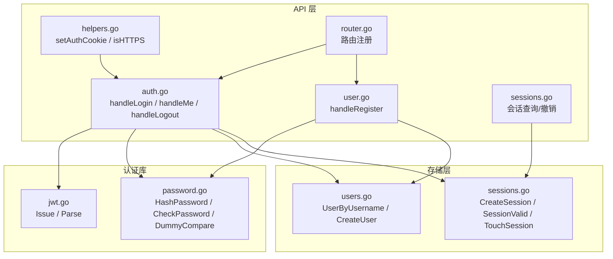
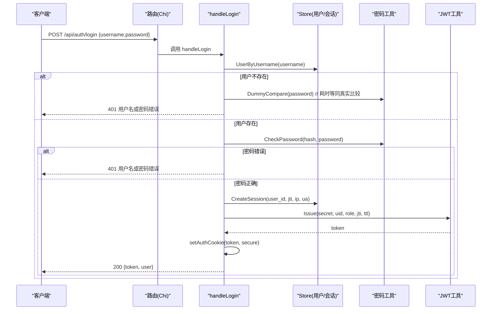
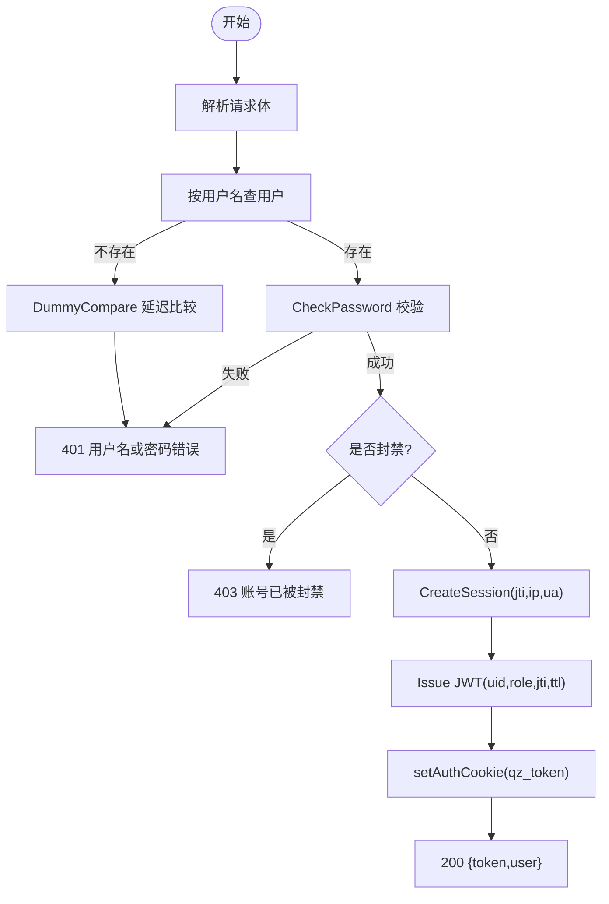
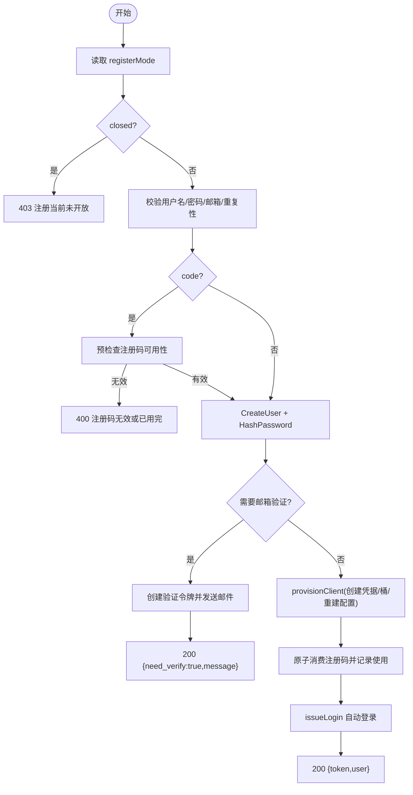
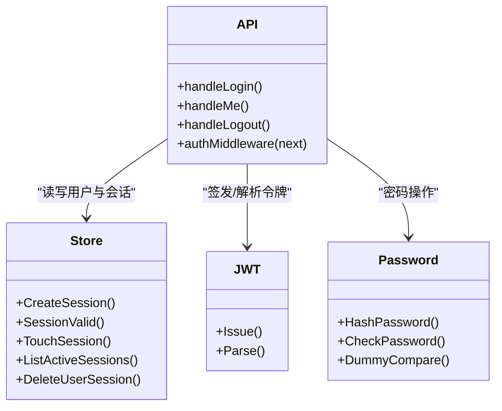
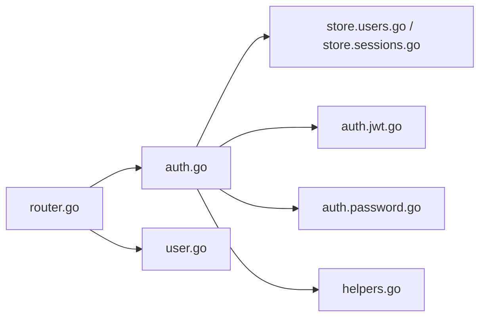

# 用户认证接口

<cite>
**本文引用的文件**
- [internal/api/auth.go](file://internal/api/auth.go)
- [internal/api/user.go](file://internal/api/user.go)
- [internal/api/sessions.go](file://internal/api/sessions.go)
- [internal/api/helpers.go](file://internal/api/helpers.go)
- [internal/api/router.go](file://internal/api/router.go)
- [internal/auth/jwt.go](file://internal/auth/jwt.go)
- [internal/auth/password.go](file://internal/auth/password.go)
- [internal/store/users.go](file://internal/store/users.go)
- [internal/store/sessions.go](file://internal/store/sessions.go)
</cite>

## 目录
1. [简介](#简介)
2. [项目结构](#项目结构)
3. [核心组件](#核心组件)
4. [架构总览](#架构总览)
5. [详细组件分析](#详细组件分析)
6. [依赖关系分析](#依赖关系分析)
7. [性能与安全性考虑](#性能与安全性考虑)
8. [故障排查指南](#故障排查指南)
9. [结论](#结论)
10. [附录：请求/响应示例与客户端集成](#附录请求响应示例与客户端集成)

## 简介
本文件面向“轻舟”面板的用户认证子系统，聚焦登录、注册、密码验证与会话管理。重点说明 handleLogin 的完整流程（用户名/密码校验、账号状态检查、会话创建与 JWT 签发），以及 registerMode 配置对注册流程的影响。文档同时给出错误处理、异常场景、安全注意事项与客户端集成最佳实践。

## 项目结构
认证相关代码主要分布在以下模块：
- API 层：路由与处理器（登录、注册、登出、会话列表等）
- 认证库：JWT 签发/解析、密码哈希/比较
- 存储层：用户与会话持久化
- 辅助工具：Cookie 设置、HTTPS 判断、公共基础 URL 推导

图表来源
- [internal/api/auth.go:112-149](file://internal/api/auth.go#L112-L149)
- [internal/api/user.go:25-173](file://internal/api/user.go#L25-L173)
- [internal/api/sessions.go:13-42](file://internal/api/sessions.go#L13-L42)
- [internal/api/helpers.go:104-125](file://internal/api/helpers.go#L104-L125)
- [internal/api/router.go:155-162](file://internal/api/router.go#L155-L162)
- [internal/auth/jwt.go:16-41](file://internal/auth/jwt.go#L16-L41)
- [internal/auth/password.go:5-23](file://internal/auth/password.go#L5-L23)
- [internal/store/users.go:76-121](file://internal/store/users.go#L76-L121)
- [internal/store/sessions.go:15-36](file://internal/store/sessions.go#L15-L36)

章节来源
- [internal/api/router.go:155-162](file://internal/api/router.go#L155-L162)
- [internal/api/auth.go:17-26](file://internal/api/auth.go#L17-L26)

## 核心组件
- 登录处理器 handleLogin：负责解析请求、查找用户、防枚举延迟比较、密码校验、封禁状态检查、创建会话并签发 JWT，返回 token 与用户视图。
- 注册处理器 handleRegister：根据 registerMode 控制开放策略（open/code/closed），校验用户名/邮箱/密码，必要时要求邮箱验证，支持注册码模式，成功后自动登录并返回 token。
- 会话管理：每次登录生成唯一 jti，写入 sessions 表；鉴权中间件校验 JWT 并检查会话是否有效，支持按设备列出与撤销。
- 密码与 JWT：使用 bcrypt 进行密码哈希与比较；使用 HS256 签发包含用户 ID、角色、jti 和过期时间的 JWT。
- Cookie 与安全：通过 setAuthCookie 将 JWT 写入 qz_token Cookie，并根据外部可见协议决定是否设置 Secure 标志。

章节来源
- [internal/api/auth.go:112-149](file://internal/api/auth.go#L112-L149)
- [internal/api/user.go:25-173](file://internal/api/user.go#L25-L173)
- [internal/api/sessions.go:13-42](file://internal/api/sessions.go#L13-L42)
- [internal/auth/jwt.go:16-41](file://internal/auth/jwt.go#L16-L41)
- [internal/auth/password.go:5-23](file://internal/auth/password.go#L5-L23)
- [internal/api/helpers.go:104-125](file://internal/api/helpers.go#L104-L125)

## 架构总览
下图展示一次登录请求从进入路由到返回响应的关键交互，包括防枚举延迟比较、会话创建与 JWT 签发。

图表来源
- [internal/api/auth.go:112-149](file://internal/api/auth.go#L112-L149)
- [internal/auth/password.go:10-23](file://internal/auth/password.go#L10-L23)
- [internal/store/users.go:76-78](file://internal/store/users.go#L76-L78)
- [internal/store/sessions.go:15-23](file://internal/store/sessions.go#L15-L23)
- [internal/auth/jwt.go:16-28](file://internal/auth/jwt.go#L16-L28)
- [internal/api/helpers.go:115-125](file://internal/api/helpers.go#L115-L125)

## 详细组件分析

### 登录流程 handleLogin
- 输入校验：解析 JSON 请求体，失败返回 400。
- 用户查找：按用户名查询用户；若不存在，执行 DummyCompare 以消耗与真实密码比较相近的时间，防止通过响应时间推断用户名是否存在。
- 密码校验：使用 bcrypt 比较哈希值，失败返回 401。
- 状态检查：若用户状态为 banned，返回 403。
- 会话与令牌：生成随机 jti，创建会话记录（去重同一设备），签发 JWT（HS256，含 uid、role、jti、exp），写入 Cookie（qz_token）。
- 响应：返回 token 与用户视图（id、username、email、email_verified、role、is_admin、status、points）。

图表来源
- [internal/api/auth.go:112-149](file://internal/api/auth.go#L112-L149)
- [internal/auth/password.go:10-23](file://internal/auth/password.go#L10-L23)
- [internal/store/sessions.go:15-23](file://internal/store/sessions.go#L15-L23)
- [internal/auth/jwt.go:16-28](file://internal/auth/jwt.go#L16-L28)
- [internal/api/helpers.go:115-125](file://internal/api/helpers.go#L115-L125)

章节来源
- [internal/api/auth.go:112-149](file://internal/api/auth.go#L112-L149)

### 注册流程 handleRegister 与 registerMode
- registerMode 取值：
  - open：允许任何人注册
  - code：需要有效的注册码
  - closed：关闭注册
  - 兼容旧字段 registration_open
- 校验规则：
  - 用户名：字母数字下划线，长度 3-32
  - 密码：至少 6 位
  - 邮箱：可选，但若开启 email_verify_required 则必须提供
  - 重复性：用户名/邮箱不可重复
- 注册码模式：
  - 预检查注册码是否可用（不消耗名额）
  - 账户持久化后，再原子消费注册码并记录使用，同时赋予注册码绑定的用户组权限
- 邮箱验证：
  - 若要求邮箱验证，则创建一次性验证令牌并通过邮件发送链接，返回 need_verify=true
- 自动开通：
  - 无需验证时，立即 provisionClient（创建代理身份、流量池桶、免费桶、欢迎额度），并重建 sing-box 配置
- 自动登录：
  - 注册成功后直接 issueLogin，返回 token 与用户信息

图表来源
- [internal/api/user.go:25-173](file://internal/api/user.go#L25-L173)
- [internal/api/auth.go:71-82](file://internal/api/auth.go#L71-L82)
- [internal/store/users.go:92-121](file://internal/store/users.go#L92-L121)

章节来源
- [internal/api/user.go:25-173](file://internal/api/user.go#L25-L173)
- [internal/api/auth.go:71-82](file://internal/api/auth.go#L71-L82)

### 会话管理与鉴权中间件
- 会话创建：每次登录生成唯一 jti，按 IP+UA 合并重复登录，避免会话堆积。
- 鉴权中间件：
  - 从 Authorization(Bearer) 或 Cookie(qz_token) 取令牌
  - 解析 JWT，校验签名与有效期
  - 检查会话是否仍存在（支持远程注销/吊销）
  - 更新 last_seen（节流至每分钟一次）
  - 将 uid、role、jti 注入上下文供后续处理器使用
- 会话查询与撤销：
  - 列出当前活跃设备（按 IP+UA 去重，标记当前设备）
  - 撤销指定设备会话

图表来源
- [internal/api/auth.go:179-201](file://internal/api/auth.go#L179-L201)
- [internal/api/sessions.go:13-42](file://internal/api/sessions.go#L13-L42)
- [internal/store/sessions.go:15-36](file://internal/store/sessions.go#L15-L36)
- [internal/auth/jwt.go:16-41](file://internal/auth/jwt.go#L16-L41)
- [internal/auth/password.go:5-23](file://internal/auth/password.go#L5-L23)

章节来源
- [internal/api/auth.go:179-201](file://internal/api/auth.go#L179-L201)
- [internal/api/sessions.go:13-42](file://internal/api/sessions.go#L13-L42)
- [internal/store/sessions.go:15-36](file://internal/store/sessions.go#L15-L36)

## 依赖关系分析
- API 层依赖：
  - store.Store：用户与会话数据访问
  - auth.JWT：令牌签发与解析
  - auth.Password：密码哈希与比较
  - helpers：Cookie 设置与 HTTPS 判断
- 路由注册：
  - /api/auth/login、/api/auth/register、/api/auth/forgot、/api/auth/reset 受每 IP 速率限制
  - 受保护路径由 authMiddleware 统一鉴权

图表来源
- [internal/api/router.go:155-162](file://internal/api/router.go#L155-L162)
- [internal/api/auth.go:112-149](file://internal/api/auth.go#L112-L149)
- [internal/api/user.go:25-173](file://internal/api/user.go#L25-L173)

章节来源
- [internal/api/router.go:155-162](file://internal/api/router.go#L155-L162)

## 性能与安全性考虑
- 防用户枚举攻击：
  - 用户不存在时执行 DummyCompare，使响应时间与真实密码比较接近，避免通过时序侧信道泄露用户名是否存在
- 会话有效性：
  - 鉴权时不仅校验 JWT，还检查会话是否存在，支持管理员远程注销或吊销
- Cookie 安全：
  - 根据外部可见协议决定 Secure 标志，确保在 HTTPS 下传输
- 速率限制：
  - 认证相关接口按 IP 限流，抵御暴力破解与邮件轰炸
- 密码安全：
  - 使用 bcrypt 默认成本进行哈希与比较
- 令牌生命周期：
  - JWT 带过期时间，配合会话表实现可吊销的短期会话

章节来源
- [internal/auth/password.go:14-23](file://internal/auth/password.go#L14-L23)
- [internal/api/auth.go:179-201](file://internal/api/auth.go#L179-L201)
- [internal/api/helpers.go:104-125](file://internal/api/helpers.go#L104-L125)
- [internal/api/router.go:155-162](file://internal/api/router.go#L155-L162)
- [internal/auth/jwt.go:16-41](file://internal/auth/jwt.go#L16-L41)

## 故障排查指南
- 登录失败
  - 400 请求格式错误：检查 JSON 结构与字段名
  - 401 用户名或密码错误：确认用户名与密码；注意该错误对用户不存在与密码错误统一返回，避免枚举
  - 403 账号已被封禁：联系管理员解封
  - 500 服务器错误：检查数据库与日志
- 注册失败
  - 403 注册当前未开放：检查 register_mode 配置
  - 400 用户名/邮箱/密码校验失败：遵循命名与长度规则
  - 409 用户名/邮箱已被占用：更换用户名或邮箱
  - 400 注册码无效或已用完：确认注册码有效且未被使用
  - 500 创建用户失败：检查数据库与并发冲突
- 会话问题
  - 401 登录已过期/失效：重新登录；检查 Cookie 是否被浏览器策略拦截
  - 无法列出设备：检查鉴权中间件是否生效

章节来源
- [internal/api/auth.go:112-149](file://internal/api/auth.go#L112-L149)
- [internal/api/user.go:25-173](file://internal/api/user.go#L25-L173)
- [internal/api/sessions.go:13-42](file://internal/api/sessions.go#L13-L42)

## 结论
本认证系统通过严格的输入校验、防枚举延迟比较、会话与 JWT 双重校验，提供了安全的登录与注册体验。registerMode 灵活控制注册策略，支持注册码与邮箱验证。结合速率限制与 Cookie 安全策略，能有效抵御常见攻击面。建议在生产环境启用 HTTPS、合理配置 register_mode 与邮箱验证，并在前端妥善保存与携带认证令牌。

## 附录：请求/响应示例与客户端集成

### 登录
- 请求
  - 方法：POST
  - 路径：/api/auth/login
  - 内容类型：application/json
  - 请求体：{ username, password }
- 成功响应
  - 状态码：200
  - 响应体：{ token, user }
  - Cookie：Set-Cookie: qz_token=...; Path=/; HttpOnly; Secure(当外部为 HTTPS); SameSite=Lax; Expires=7天后
- 失败响应
  - 400：请求格式错误
  - 401：用户名或密码错误
  - 403：账号已被封禁
  - 500：服务器错误

章节来源
- [internal/api/auth.go:112-149](file://internal/api/auth.go#L112-L149)
- [internal/api/helpers.go:115-125](file://internal/api/helpers.go#L115-L125)

### 注册
- 请求
  - 方法：POST
  - 路径：/api/auth/register
  - 内容类型：application/json
  - 请求体：{ username, email?, password, code? }
- 成功响应
  - 无需邮箱验证：200 { token, user }
  - 需要邮箱验证：200 { need_verify: true, message: "注册成功，请查收验证邮件后激活账号" }
- 失败响应
  - 400：请求格式错误或参数校验失败或注册码无效
  - 403：注册当前未开放
  - 409：用户名或邮箱已被占用
  - 500：服务器错误

章节来源
- [internal/api/user.go:25-173](file://internal/api/user.go#L25-L173)
- [internal/api/auth.go:71-82](file://internal/api/auth.go#L71-L82)

### 获取当前用户信息
- 请求
  - 方法：GET
  - 路径：/api/auth/me
  - 认证：Bearer Token 或 Cookie(qz_token)
- 成功响应
  - 状态码：200
  - 响应体：用户视图对象（id、username、email、email_verified、role、is_admin、status、points）
- 失败响应
  - 401：未登录或登录已过期/失效

章节来源
- [internal/api/auth.go:151-163](file://internal/api/auth.go#L151-L163)
- [internal/api/auth.go:179-201](file://internal/api/auth.go#L179-L201)

### 登出
- 请求
  - 方法：POST
  - 路径：/api/auth/logout
  - 认证：Bearer Token 或 Cookie(qz_token)
- 成功响应
  - 状态码：200
  - 行为：删除服务端会话，清空 Cookie
- 失败响应
  - 401：未登录或登录已过期/失效

章节来源
- [internal/api/auth.go:165-177](file://internal/api/auth.go#L165-L177)

### 查看在线设备与撤销
- 列出设备
  - 方法：GET
  - 路径：/api/user/sessions
  - 认证：Bearer Token 或 Cookie(qz_token)
  - 响应：当前活跃设备列表（去重 IP+UA，标记当前设备）
- 撤销设备
  - 方法：POST
  - 路径：/api/user/sessions/{id}/revoke
  - 认证：Bearer Token 或 Cookie(qz_token)
  - 响应：成功无内容

章节来源
- [internal/api/sessions.go:13-42](file://internal/api/sessions.go#L13-L42)

### 客户端集成最佳实践
- 令牌传递
  - 优先使用 Cookie（qz_token）；如需跨域或单页应用，可使用 Authorization: Bearer <token>
- Cookie 安全
  - 生产环境务必使用 HTTPS，以便 Secure Cookie 生效
- 错误处理
  - 401 时提示重新登录；403 时提示账号受限；400/500 时提示重试或联系管理员
- 会话管理
  - 提供“退出登录”功能，调用登出接口清理本地状态与服务端会话
  - 支持“查看设备并撤销”，提升用户体验与安全性
- 注册流程
  - 根据 /api/config 返回的 register_mode 与 email_verify_required 动态调整 UI 与流程
  - 需要邮箱验证时，引导用户点击邮件中的验证链接

章节来源
- [internal/api/auth.go:179-201](file://internal/api/auth.go#L179-L201)
- [internal/api/helpers.go:104-125](file://internal/api/helpers.go#L104-L125)
- [internal/api/user.go:25-173](file://internal/api/user.go#L25-L173)
