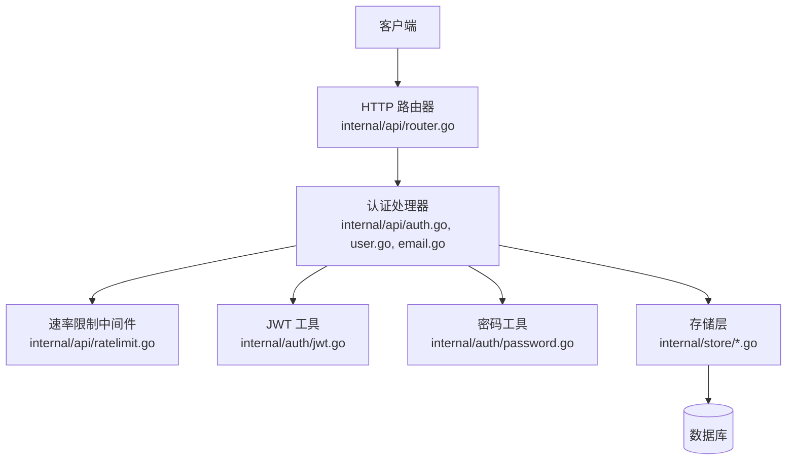
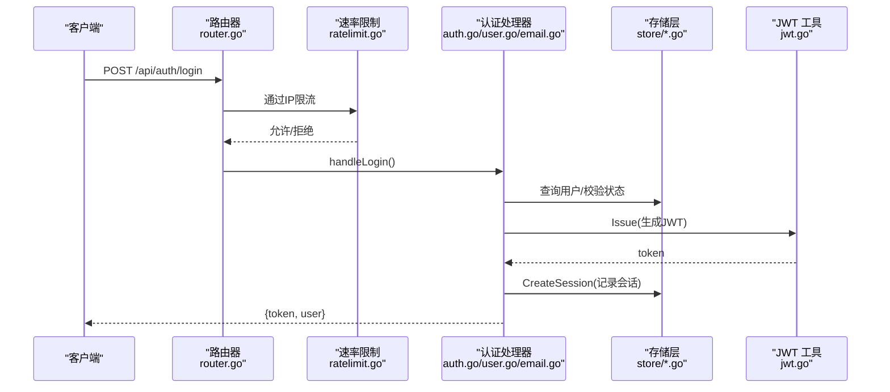
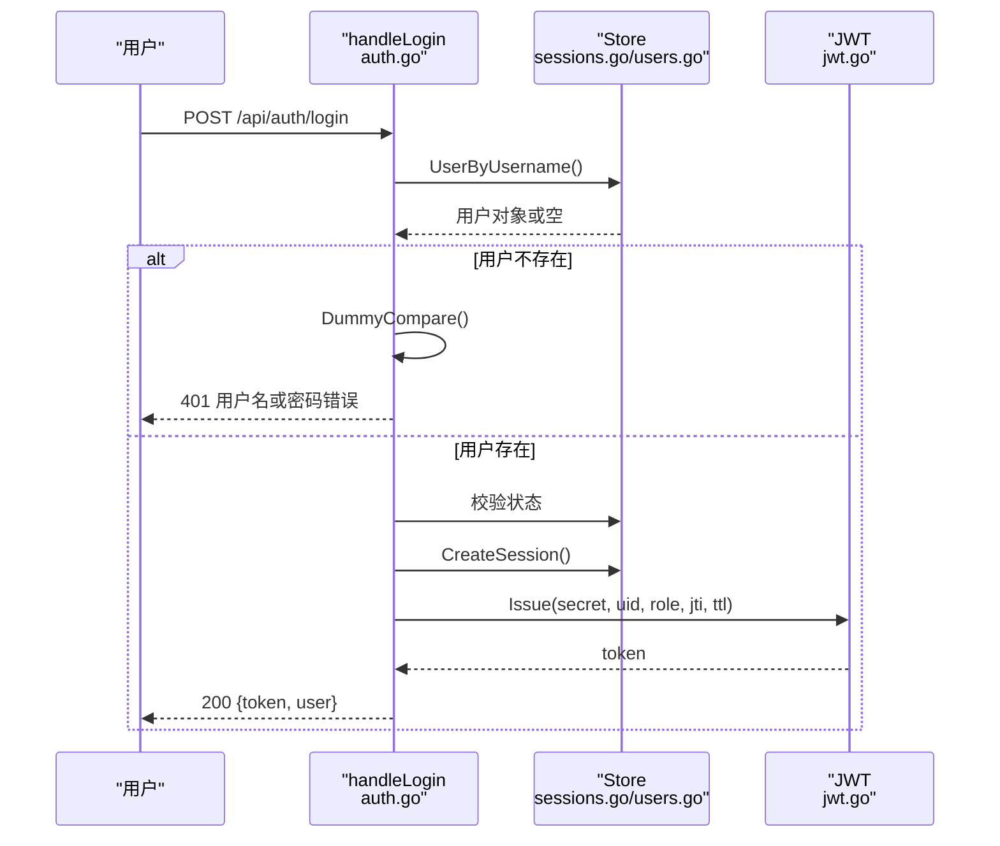
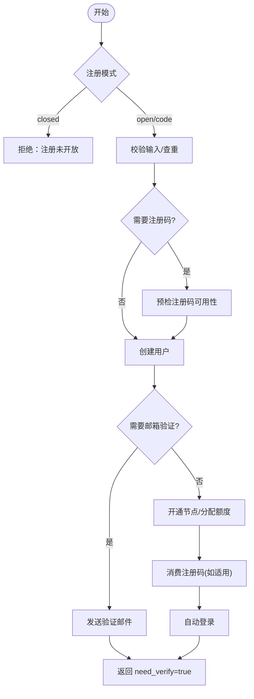
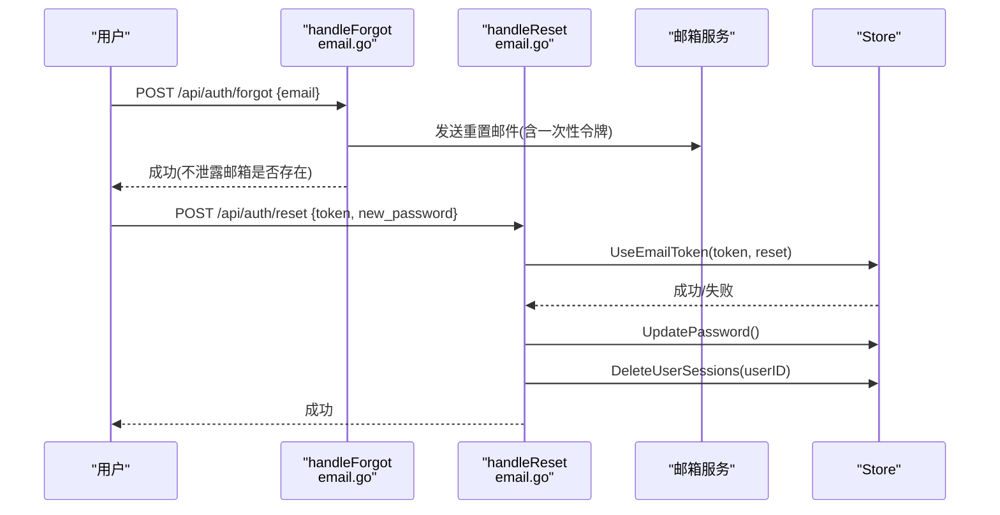
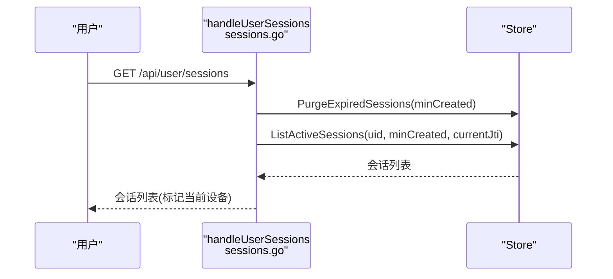
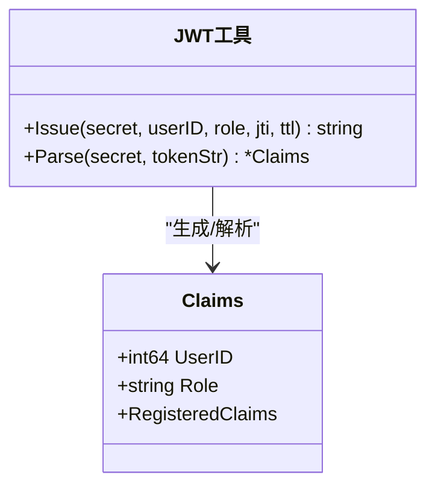
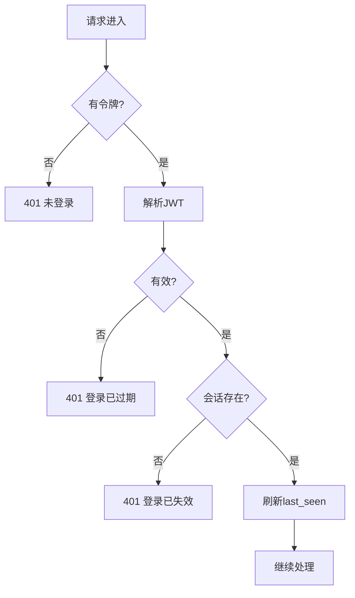
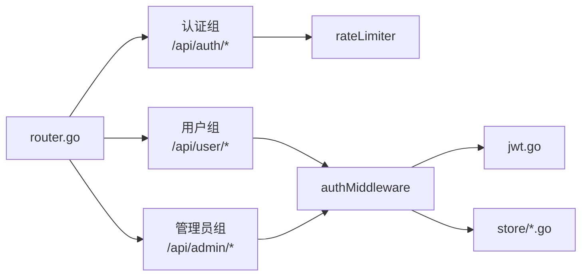

# 认证授权API

<cite>
**本文引用的文件**
- [internal/api/auth.go](file://internal/api/auth.go)
- [internal/api/router.go](file://internal/api/router.go)
- [internal/api/sessions.go](file://internal/api/sessions.go)
- [internal/api/ratelimit.go](file://internal/api/ratelimit.go)
- [internal/api/email.go](file://internal/api/email.go)
- [internal/api/user.go](file://internal/api/user.go)
- [internal/api/helpers.go](file://internal/api/helpers.go)
- [internal/api/respond.go](file://internal/api/respond.go)
- [internal/auth/jwt.go](file://internal/auth/jwt.go)
- [internal/auth/password.go](file://internal/auth/password.go)
- [internal/store/sessions.go](file://internal/store/sessions.go)
- [internal/store/users.go](file://internal/store/users.go)
- [internal/config/config.go](file://internal/config/config.go)
</cite>

## 目录
1. [简介](#简介)
2. [项目结构](#项目结构)
3. [核心组件](#核心组件)
4. [架构总览](#架构总览)
5. [详细组件分析](#详细组件分析)
6. [依赖关系分析](#依赖关系分析)
7. [性能考虑](#性能考虑)
8. [故障排查指南](#故障排查指南)
9. [结论](#结论)
10. [附录](#附录)

## 简介
本文件为“轻舟”面板的认证与授权子系统提供完整参考文档，覆盖用户注册、登录、密码重置、会话管理、JWT 签发/校验/续期策略、权限控制中间件、速率限制与安全加固措施。同时给出端到端认证流程示例、错误处理与异常场景说明，以及客户端集成建议与最佳实践。

## 项目结构
认证相关能力分布在以下模块：
- API 路由与处理器：负责 HTTP 接口定义、请求解析、响应封装、鉴权中间件挂载
- 认证库：JWT 签发与解析、密码哈希与比对
- 存储层：用户与会话持久化、邮箱令牌、配额与凭据等
- 配置：运行参数与环境变量

**图示来源**
- [internal/api/router.go:132-208](file://internal/api/router.go#L132-L208)
- [internal/api/auth.go:179-213](file://internal/api/auth.go#L179-L213)
- [internal/api/ratelimit.go:53-65](file://internal/api/ratelimit.go#L53-L65)
- [internal/auth/jwt.go:16-42](file://internal/auth/jwt.go#L16-L42)
- [internal/auth/password.go:5-23](file://internal/auth/password.go#L5-L23)
- [internal/store/sessions.go:15-133](file://internal/store/sessions.go#L15-L133)

**章节来源**
- [internal/api/router.go:132-208](file://internal/api/router.go#L132-L208)
- [internal/config/config.go:14-29](file://internal/config/config.go#L14-L29)

## 核心组件
- 认证中间件：从 Cookie 或 Authorization 头提取令牌，校验签名与有效期，并验证会话是否仍有效（支持远程注销/撤销）
- 管理员权限中间件：在已认证基础上检查角色是否为 admin
- 会话管理：记录登录设备、列出在线设备、按设备撤销会话、清理过期会话
- 密码安全：bcrypt 哈希与比较；防枚举的时间恒定比较
- JWT：HS256 签名，包含用户ID、角色、jti、签发与过期时间
- 速率限制：基于固定窗口的每 IP 限流，保护登录、注册、找回密码等敏感接口
- 邮箱验证与密码重置：一次性令牌、邮件链接、冷却与频率限制

**章节来源**
- [internal/api/auth.go:179-213](file://internal/api/auth.go#L179-L213)
- [internal/api/sessions.go:10-43](file://internal/api/sessions.go#L10-L43)
- [internal/auth/jwt.go:10-42](file://internal/auth/jwt.go#L10-L42)
- [internal/auth/password.go:5-23](file://internal/auth/password.go#L5-L23)
- [internal/api/ratelimit.go:9-65](file://internal/api/ratelimit.go#L9-L65)
- [internal/api/email.go:60-153](file://internal/api/email.go#L60-L153)

## 架构总览
认证授权的整体调用链如下：
- 公开接口：健康检查、站点配置、邮箱验证、订阅地址
- 认证接口：登录、注册、忘记密码、重置密码（受速率限制）
- 受保护接口：用户信息、会话管理、套餐、订单、节点管理等（需登录）
- 管理员接口：系统设置、节点管理、用户管理等（需管理员）

**图示来源**
- [internal/api/router.go:155-162](file://internal/api/router.go#L155-L162)
- [internal/api/auth.go:112-149](file://internal/api/auth.go#L112-L149)
- [internal/auth/jwt.go:16-28](file://internal/auth/jwt.go#L16-L28)
- [internal/store/sessions.go:15-23](file://internal/store/sessions.go#L15-L23)

## 详细组件分析

### 登录与登出
- 登录
  - 接收用户名与密码，进行格式校验
  - 查询用户，若不存在则执行恒定时间比较以防御枚举攻击
  - 校验密码、账号状态（封禁拦截）
  - 创建会话、签发 JWT，写入 Cookie（HttpOnly、Secure、SameSite=Lax），返回 token 与用户视图
- 登出
  - 根据当前 jti 删除会话
  - 清空 Cookie

**图示来源**
- [internal/api/auth.go:112-149](file://internal/api/auth.go#L112-L149)
- [internal/auth/password.go:14-23](file://internal/auth/password.go#L14-L23)
- [internal/store/sessions.go:15-23](file://internal/store/sessions.go#L15-L23)
- [internal/auth/jwt.go:16-28](file://internal/auth/jwt.go#L16-L28)

**章节来源**
- [internal/api/auth.go:112-177](file://internal/api/auth.go#L112-L177)
- [internal/api/helpers.go:104-125](file://internal/api/helpers.go#L104-L125)

### 注册
- 支持三种模式：开放、需要注册码、关闭
- 校验用户名、密码长度、邮箱必填（可配置）
- 查重：用户名、邮箱
- 可选注册码预检与最终消费（原子性保证）
- 创建用户、签发初始订阅令牌、按需发送验证邮件或直接开通节点
- 成功后自动登录并返回 token

**图示来源**
- [internal/api/user.go:25-173](file://internal/api/user.go#L25-L173)
- [internal/api/email.go:176-223](file://internal/api/email.go#L176-L223)

**章节来源**
- [internal/api/user.go:25-173](file://internal/api/user.go#L25-L173)

### 密码重置与邮箱验证
- 忘记密码
  - 接收邮箱，若存在且已绑定邮箱，生成一次性重置令牌，发送邮件链接
  - 无论邮箱是否存在均返回成功，防止枚举
- 重置密码
  - 校验令牌有效性、新密码长度
  - 更新密码后，撤销该用户所有会话（防止旧会话继续访问）
- 邮箱验证
  - 点击邮件中的链接，使用一次性令牌标记邮箱已验证
  - 首次验证时可为非管理员用户自动开通节点

**图示来源**
- [internal/api/email.go:94-153](file://internal/api/email.go#L94-L153)
- [internal/store/sessions.go:118-122](file://internal/store/sessions.go#L118-L122)

**章节来源**
- [internal/api/email.go:60-153](file://internal/api/email.go#L60-L153)

### 会话管理
- 列出设备：返回当前用户的活跃会话（按设备去重，标记当前设备）
- 撤销设备：按会话 ID 删除指定设备的会话
- 清理过期：按令牌 TTL 清理过期会话行

**图示来源**
- [internal/api/sessions.go:10-27](file://internal/api/sessions.go#L10-L27)
- [internal/store/sessions.go:56-99](file://internal/store/sessions.go#L56-L99)

**章节来源**
- [internal/api/sessions.go:10-43](file://internal/api/sessions.go#L10-L43)
- [internal/store/sessions.go:15-133](file://internal/store/sessions.go#L15-L133)

### JWT 机制
- 签发：包含用户ID、角色、jti、签发时间与过期时间，使用 HS256 签名
- 解析：强制 HMAC 算法，校验签名与有效期
- 结合会话：即使 JWT 未过期，若会话被撤销则无法通过鉴权

**图示来源**
- [internal/auth/jwt.go:10-42](file://internal/auth/jwt.go#L10-L42)

**章节来源**
- [internal/auth/jwt.go:10-42](file://internal/auth/jwt.go#L10-L42)

### 权限控制与中间件
- 认证中间件：从 Cookie 或 Authorization 头读取令牌，校验签名与有效期，检查会话存在并刷新 last_seen，将用户ID、角色、jti 注入上下文
- 管理员中间件：仅允许角色为 admin 的请求进入

**图示来源**
- [internal/api/auth.go:179-213](file://internal/api/auth.go#L179-L213)

**章节来源**
- [internal/api/auth.go:179-213](file://internal/api/auth.go#L179-L213)

### 速率限制与安全加固
- 登录/注册/找回密码：按 IP 固定窗口限流（例如每分钟 20 次）
- 邮箱重发：按用户 ID 限流（例如每 10 分钟 3 次）
- 代理探针上报：按 IP 限流
- 订阅地址切换：按用户限流，避免频繁切换导致旧链接长期无效
- 安全要点：
  - 登录路径对“用户不存在”分支采用恒定时间比较，防止枚举
  - Cookie 设置 HttpOnly、Secure（HTTPS）、SameSite=Lax
  - 重置密码后撤销全部会话，防止劫持会话继续访问
  - 仅信任可信反向代理的转发头，避免伪造 IP 绕过限流

**章节来源**
- [internal/api/ratelimit.go:9-65](file://internal/api/ratelimit.go#L9-L65)
- [internal/api/router.go:155-168](file://internal/api/router.go#L155-L168)
- [internal/api/helpers.go:104-125](file://internal/api/helpers.go#L104-L125)
- [internal/auth/password.go:14-23](file://internal/auth/password.go#L14-L23)

## 依赖关系分析
- API 层依赖：
  - store 层：用户与会话、邮箱令牌、凭据与配额
  - auth 层：JWT 与密码工具
  - mailer：邮件发送（可选）
  - sbctl：节点配置重建（可选）
- 路由层：
  - 公共组：健康检查、站点配置、邮箱验证、订阅
  - 认证组：登录、注册、忘记密码、重置密码（带速率限制）
  - 认证组：用户数据与会话管理（需登录）
  - 管理员组：系统设置、节点、用户、统计等（需管理员）

**图示来源**
- [internal/api/router.go:149-208](file://internal/api/router.go#L149-L208)
- [internal/api/auth.go:179-213](file://internal/api/auth.go#L179-L213)
- [internal/api/ratelimit.go:53-65](file://internal/api/ratelimit.go#L53-L65)

**章节来源**
- [internal/api/router.go:149-208](file://internal/api/router.go#L149-L208)

## 性能考虑
- 会话 last_seen 更新限制为每分钟一次，减少写放大
- 会话列表按设备去重，降低前端展示压力
- 过期会话懒清理，仅在列出时触发
- 全局请求体大小限制，防止恶意大负载造成内存压力
- 压缩响应体，提升小带宽环境下的传输效率

**章节来源**
- [internal/store/sessions.go:32-36](file://internal/store/sessions.go#L32-L36)
- [internal/store/sessions.go:56-99](file://internal/store/sessions.go#L56-L99)
- [internal/api/router.go:143-147](file://internal/api/router.go#L143-L147)

## 故障排查指南
- 常见错误码与含义
  - 400：请求格式错误或参数不合法（如密码过短、邮箱格式错误）
  - 401：未登录、登录已过期、登录已失效
  - 403：账号被封禁、需要管理员权限
  - 409：用户名/邮箱已被占用
  - 429：请求过于频繁（触发速率限制）
  - 500：服务器内部错误（数据库、签发失败等）
- 定位步骤
  - 检查请求是否携带正确令牌（Cookie 或 Authorization）
  - 确认会话是否仍存在（可能被撤销或过期）
  - 查看速率限制日志与阈值
  - 检查 SMTP 配置与邮件发送结果
  - 核对环境变量与系统设置（监听地址、数据库路径、管理员账户等）

**章节来源**
- [internal/api/respond.go:11-25](file://internal/api/respond.go#L11-L25)
- [internal/api/email.go:94-153](file://internal/api/email.go#L94-L153)
- [internal/config/config.go:14-29](file://internal/config/config.go#L14-L29)

## 结论
本认证授权系统以 JWT 为核心，结合会话管理与严格的速率限制，提供了安全的登录、注册、密码重置与会话管理能力。通过中间件实现统一的鉴权与权限控制，配合存储层的会话与用户数据，形成完整的认证闭环。部署时应确保 HTTPS、合理配置限速与邮件服务，并在客户端侧遵循最佳实践。

## 附录

### API 清单（认证相关）
- 公开
  - GET /api/health
  - GET /api/config
  - GET /api/auth/verify?token=...
  - GET /sub/{token}
- 认证（受速率限制）
  - POST /api/auth/login
  - POST /api/auth/register
  - POST /api/auth/forgot
  - POST /api/auth/reset
- 用户（需登录）
  - GET /api/auth/me
  - POST /api/auth/logout
  - GET /api/user/sessions
  - POST /api/user/sessions/{id}/revoke
  - POST /api/user/email
  - POST /api/user/resend-verify
  - POST /api/user/password
  - POST /api/user/reset-sub
  - POST /api/user/reset-node-creds
- 管理员（需管理员）
  - GET/PUT /api/admin/settings
  - POST /api/admin/settings/test-smtp
  - 其他管理接口见路由定义

**章节来源**
- [internal/api/router.go:149-208](file://internal/api/router.go#L149-L208)

### 客户端集成示例（最佳实践）
- 登录
  - 调用 POST /api/auth/login，保存返回的 token（优先使用 Cookie）
  - 后续请求携带 Authorization: Bearer <token> 或依赖 Cookie
- 获取当前用户
  - 调用 GET /api/auth/me，校验返回的用户信息与角色
- 会话管理
  - 调用 GET /api/user/sessions 查看在线设备
  - 调用 POST /api/user/sessions/{id}/revoke 撤销特定设备
- 密码重置
  - 调用 POST /api/auth/forgot 提交邮箱
  - 打开邮件中的链接完成验证
  - 调用 POST /api/auth/reset 提交令牌与新密码
- 安全建议
  - 始终通过 HTTPS 访问
  - 不要在前端明文存储敏感信息
  - 遇到 401/403/429 时提示用户并重试或引导重新登录
  - 重置密码后应主动退出所有设备

**章节来源**
- [internal/api/auth.go:112-177](file://internal/api/auth.go#L112-L177)
- [internal/api/sessions.go:10-43](file://internal/api/sessions.go#L10-L43)
- [internal/api/email.go:94-153](file://internal/api/email.go#L94-L153)
- [internal/api/helpers.go:104-125](file://internal/api/helpers.go#L104-L125)
