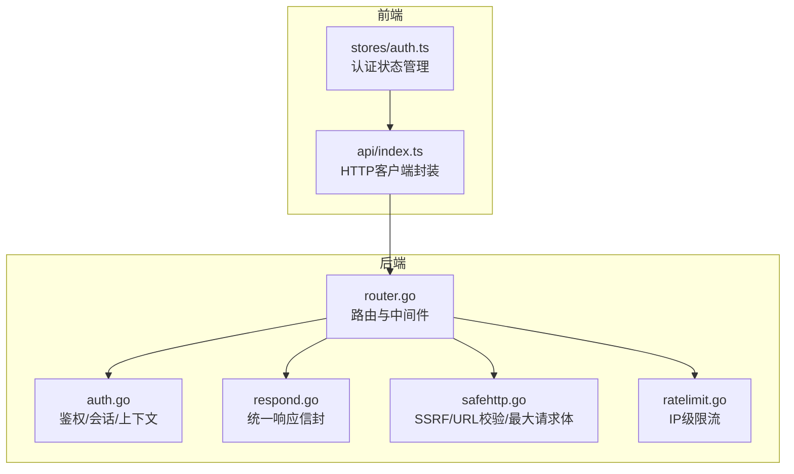
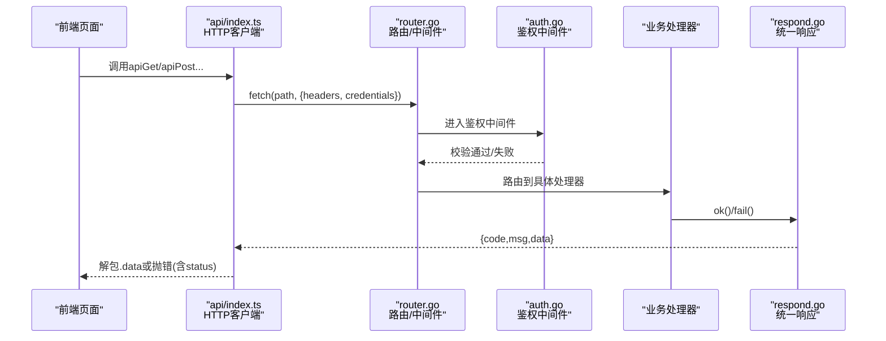
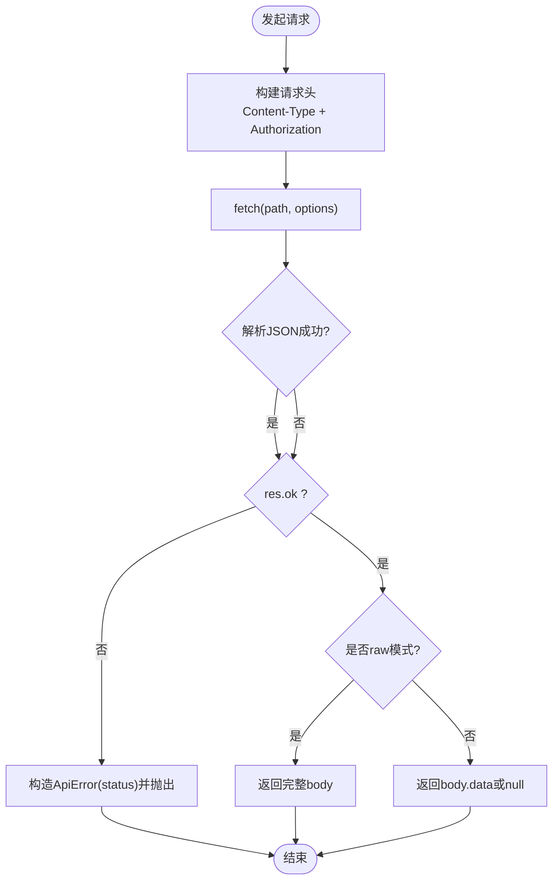
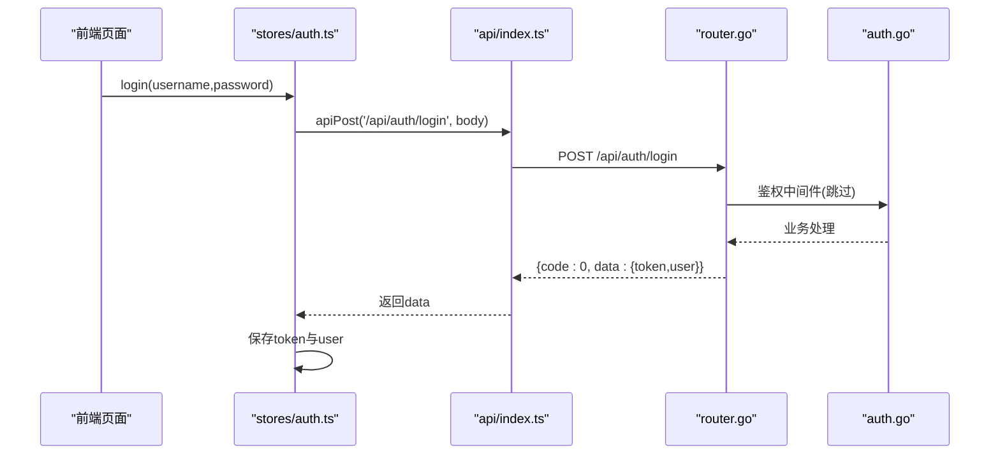
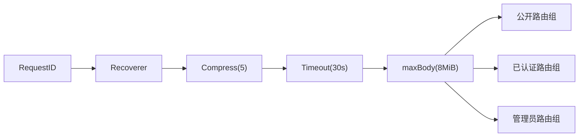
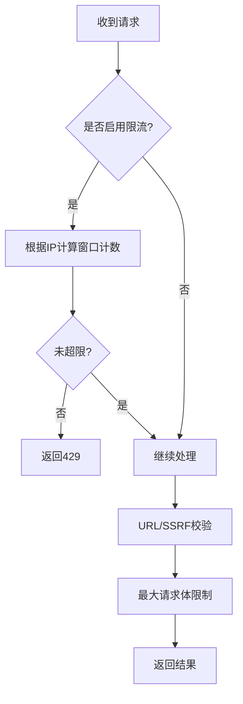
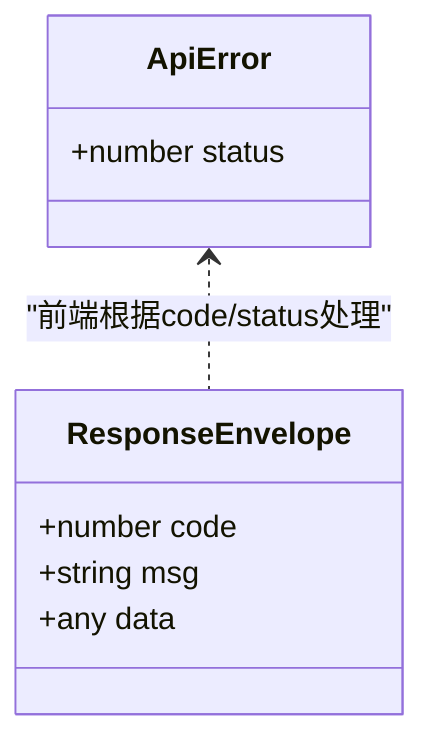
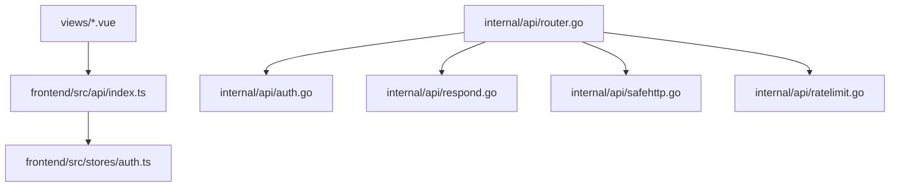

# API集成

<cite>
**本文引用的文件**
- [frontend/src/api/index.ts](file://frontend/src/api/index.ts)
- [frontend/src/stores/auth.ts](file://frontend/src/stores/auth.ts)
- [internal/api/router.go](file://internal/api/router.go)
- [internal/api/auth.go](file://internal/api/auth.go)
- [internal/api/respond.go](file://internal/api/respond.go)
- [internal/api/ratelimit.go](file://internal/api/ratelimit.go)
- [internal/api/safehttp.go](file://internal/api/safehttp.go)
</cite>

## 目录
1. [简介](#简介)
2. [项目结构](#项目结构)
3. [核心组件](#核心组件)
4. [架构总览](#架构总览)
5. [详细组件分析](#详细组件分析)
6. [依赖关系分析](#依赖关系分析)
7. [性能考虑](#性能考虑)
8. [故障排查指南](#故障排查指南)
9. [结论](#结论)
10. [附录](#附录)

## 简介
本文件面向API集成开发者，系统说明前后端数据交互的设计与实现：前端HTTP客户端封装、请求拦截器（鉴权头注入、统一错误处理）、后端路由与中间件、限流与安全控制、统一响应信封、以及版本兼容策略。文档同时给出调用方法、参数约定、错误与重试建议、取消与防抖节流实践、类型定义与接口文档生成思路，并附带Mock与调试建议，帮助快速对接与稳定运行。

## 项目结构
- 前端
  - HTTP客户端封装位于 frontend/src/api/index.ts，提供统一的GET/POST/PUT/DELETE、列表包装、原始响应获取与二进制下载能力。
  - 认证状态管理位于 frontend/src/stores/auth.ts，负责登录、注册、会话恢复、登出与权限判断。
- 后端
  - 路由与分组位于 internal/api/router.go，按公开、已认证、管理员等分组挂载处理器，并配置通用中间件（压缩、超时、最大请求体）。
  - 鉴权与用户上下文在 internal/api/auth.go，支持Bearer/Cookie双通道鉴权、会话校验、管理员角色校验。
  - 统一响应信封在 internal/api/respond.go，所有成功/失败返回统一格式。
  - 安全与防护在 internal/api/safehttp.go，包含SSRF防护、URL白名单校验、最大请求体限制。
  - 限流在 internal/api/ratelimit.go，基于IP的固定窗口限流。

**图示来源**
- [frontend/src/api/index.ts:9-48](file://frontend/src/api/index.ts#L9-L48)
- [frontend/src/stores/auth.ts:16-73](file://frontend/src/stores/auth.ts#L16-L73)
- [internal/api/router.go:132-148](file://internal/api/router.go#L132-L148)
- [internal/api/auth.go:179-213](file://internal/api/auth.go#L179-L213)
- [internal/api/respond.go:11-25](file://internal/api/respond.go#L11-L25)
- [internal/api/safehttp.go:27-85](file://internal/api/safehttp.go#L27-L85)
- [internal/api/ratelimit.go:53-64](file://internal/api/ratelimit.go#L53-L64)

**章节来源**
- [frontend/src/api/index.ts:9-124](file://frontend/src/api/index.ts#L9-L124)
- [internal/api/router.go:132-386](file://internal/api/router.go#L132-L386)

## 核心组件
- 前端HTTP客户端
  - 统一request函数：自动附加Authorization头、携带Cookie、解析JSON、非2xx抛出带status的错误对象；对多数接口自动解包.data，raw模式返回完整body。
  - apiList/apiGet/apiPost/apiPut/apiDelete：简化常用方法，列表方法保证返回数组。
  - apiDownload：通过fetch+Blob触发浏览器下载，兼容服务端文件名。
- 后端路由与中间件
  - 全局中间件：RequestID、Recoverer、Compress(5)、Timeout(30s)、最大请求体8MiB。
  - 分组：公开、已认证、管理员；认证组使用鉴权中间件，管理员组额外要求admin角色。
- 鉴权与会话
  - 支持Authorization: Bearer与Cookie双通道；JWT签发、会话创建、过期与撤销；上下文注入用户ID、角色、JTI。
- 统一响应信封
  - 成功：{code:0, msg:"", data:...}
  - 失败：{code:状态码, msg:"错误信息", data:null}
- 安全与限流
  - SSRF防护：拒绝内网地址连接，仅允许http/https。
  - IP级限流：针对敏感接口（如登录、验证码重发、探针上报）进行固定窗口限流。

**章节来源**
- [frontend/src/api/index.ts:9-124](file://frontend/src/api/index.ts#L9-L124)
- [internal/api/router.go:132-208](file://internal/api/router.go#L132-L208)
- [internal/api/auth.go:49-65](file://internal/api/auth.go#L49-L65)
- [internal/api/auth.go:179-213](file://internal/api/auth.go#L179-L213)
- [internal/api/respond.go:11-25](file://internal/api/respond.go#L11-L25)
- [internal/api/safehttp.go:27-85](file://internal/api/safehttp.go#L27-L85)
- [internal/api/ratelimit.go:53-64](file://internal/api/ratelimit.go#L53-L64)

## 架构总览
下图展示一次受保护接口的端到端调用流程：前端发起请求→携带Token→后端鉴权中间件校验→业务处理器→统一响应信封→前端统一错误处理。

**图示来源**
- [frontend/src/api/index.ts:9-48](file://frontend/src/api/index.ts#L9-L48)
- [internal/api/router.go:177-208](file://internal/api/router.go#L177-L208)
- [internal/api/auth.go:179-213](file://internal/api/auth.go#L179-L213)
- [internal/api/respond.go:11-25](file://internal/api/respond.go#L11-L25)

## 详细组件分析

### 前端HTTP客户端封装
- 设计要点
  - 自动注入Authorization头与Cookie，确保跨域会话可用。
  - 统一错误模型：抛出ApiError，包含status字段，便于上层区分401等场景。
  - 统一解包：大多数接口返回{data}，自动提取；raw模式用于直接返回JSON文档的接口。
  - 列表包装：apiList保证返回数组，避免空对象导致UI异常。
  - 二进制下载：通过Blob+临时URL触发下载，兼容服务端文件名。
- 典型用法
  - GET单个对象：apiGet('/api/user/dashboard')
  - GET列表：apiList('/api/admin/users')
  - POST提交：apiPost('/api/auth/login', {username,password})
  - 原始响应：apiGetRaw('/api/admin/sb/preview')
  - 下载附件：apiDownload('/api/admin/backup', 'backup.zip')

**图示来源**
- [frontend/src/api/index.ts:9-48](file://frontend/src/api/index.ts#L9-L48)

**章节来源**
- [frontend/src/api/index.ts:9-124](file://frontend/src/api/index.ts#L9-L124)

### 认证与会话
- 前端
  - 登录后将token写入localStorage，并在后续请求中自动附加Authorization头。
  - 初始化时尝试拉取当前用户信息，若401则清理本地状态。
- 后端
  - 登录成功后签发JWT并设置Cookie；鉴权中间件优先读取Authorization头，其次回退到Cookie。
  - 校验JWT有效且会话存在，更新会话时间戳，注入用户上下文。
  - 登出时删除会话并清空Cookie。

**图示来源**
- [frontend/src/stores/auth.ts:25-30](file://frontend/src/stores/auth.ts#L25-L30)
- [internal/api/auth.go:112-149](file://internal/api/auth.go#L112-L149)
- [internal/api/router.go:156-162](file://internal/api/router.go#L156-L162)

**章节来源**
- [frontend/src/stores/auth.ts:16-73](file://frontend/src/stores/auth.ts#L16-L73)
- [internal/api/auth.go:49-65](file://internal/api/auth.go#L49-L65)
- [internal/api/auth.go:179-213](file://internal/api/auth.go#L179-L213)

### 路由与中间件
- 全局中间件
  - RequestID、Recoverer、Compress(5)、Timeout(30s)、最大请求体8MiB。
- 分组
  - 公开：健康检查、站点配置、订阅链接、监控公共数据。
  - 已认证：用户面板、套餐、订单、节点、公告等。
  - 管理员：系统设置、证书中心、节点管理、统计等。
- 安全
  - 外部URL访问限制为http/https，并拒绝内网地址（SSRF防护）。

**图示来源**
- [internal/api/router.go:132-148](file://internal/api/router.go#L132-L148)
- [internal/api/router.go:149-208](file://internal/api/router.go#L149-L208)
- [internal/api/safehttp.go:71-85](file://internal/api/safehttp.go#L71-L85)

**章节来源**
- [internal/api/router.go:132-386](file://internal/api/router.go#L132-L386)
- [internal/api/safehttp.go:27-85](file://internal/api/safehttp.go#L27-L85)

### 限流与安全防护
- 限流
  - 基于IP的固定窗口限流，适用于登录、验证码重发、探针上报等敏感接口。
  - 达到阈值返回429与友好提示。
- 安全
  - safeFetchClient：强制TLS校验，解析域名后拒绝内网IP直连，防止DNS重绑定。
  - validFetchURL：仅允许http/https，拒绝危险协议。
  - maxBodyMiddleware：限制请求体大小，防止内存压力。

**图示来源**
- [internal/api/ratelimit.go:53-64](file://internal/api/ratelimit.go#L53-L64)
- [internal/api/safehttp.go:27-85](file://internal/api/safehttp.go#L27-L85)

**章节来源**
- [internal/api/ratelimit.go:9-64](file://internal/api/ratelimit.go#L9-L64)
- [internal/api/safehttp.go:27-85](file://internal/api/safehttp.go#L27-L85)

### 统一响应信封与错误模型
- 后端统一信封
  - 成功：{code:0, msg:"", data:...}
  - 失败：{code:状态码, msg:"错误信息", data:null}
- 前端错误处理
  - 非2xx抛出ApiError，包含status字段；401时触发登出与跳转。
  - 列表接口保证返回数组，避免空对象导致的UI问题。

**图示来源**
- [frontend/src/api/index.ts:5-48](file://frontend/src/api/index.ts#L5-L48)
- [internal/api/respond.go:11-25](file://internal/api/respond.go#L11-L25)

**章节来源**
- [frontend/src/api/index.ts:5-48](file://frontend/src/api/index.ts#L5-L48)
- [internal/api/respond.go:11-25](file://internal/api/respond.go#L11-L25)

### API调用方法与参数处理
- GET
  - 单个对象：apiGet(path)，返回data字段内容。
  - 列表：apiList(path)，保证返回数组。
  - 原始响应：apiGetRaw(path)，用于直接返回JSON文档的接口。
- POST/PUT/DELETE
  - 提交JSON：apiPost(path, body)/apiPut(path, body)。
  - 删除：apiDelete(path)。
- 二进制下载
  - apiDownload(path, fallbackName)：通过Blob触发下载，优先使用服务端文件名。

**章节来源**
- [frontend/src/api/index.ts:50-124](file://frontend/src/api/index.ts#L50-L124)

### 错误处理与重试机制
- 错误分类
  - 网络错误：捕获并提示。
  - 业务错误：根据code/msg提示。
  - 认证失效：401时清除本地状态并重定向至登录页。
- 重试建议
  - 幂等GET可加指数退避重试（最多2次），注意去抖与取消。
  - 非幂等POST不建议自动重试，应提示用户重试。
- 取消请求
  - 可使用AbortController在组件卸载或导航时取消未完成请求，避免状态污染。

**章节来源**
- [frontend/src/api/index.ts:28-48](file://frontend/src/api/index.ts#L28-L48)
- [frontend/src/stores/auth.ts:42-58](file://frontend/src/stores/auth.ts#L42-L58)

### 请求取消与防抖节流
- 取消
  - 在Vue组合式函数中使用AbortController，配合onUnmounted取消请求。
- 防抖
  - 搜索输入框使用防抖，减少频繁请求。
- 节流
  - 高频刷新按钮使用节流，限制单位时间内请求次数。

[本节为通用实践建议，不直接分析具体文件]

### 类型定义与接口文档生成
- 类型定义
  - 前端User接口：id、username、email、role、is_admin、status、points等。
  - ApiError：扩展Error，增加status字段。
- 接口文档生成
  - 建议在后端导出OpenAPI/Swagger描述，前端基于类型定义生成API Client与类型提示。
  - 保持前后端契约一致，变更时同步更新文档。

**章节来源**
- [frontend/src/stores/auth.ts:5-14](file://frontend/src/stores/auth.ts#L5-L14)
- [frontend/src/api/index.ts:5-7](file://frontend/src/api/index.ts#L5-L7)

### Mock数据与开发调试工具
- 前端Mock
  - 使用Vite代理或MSW拦截/api/*，返回模拟数据，加速联调。
- 后端调试
  - 开启RequestID日志，结合浏览器Network面板查看请求/响应。
  - 使用健康检查接口确认服务可用性。

**章节来源**
- [internal/api/router.go:150-153](file://internal/api/router.go#L150-L153)

### API版本管理与兼容性处理
- 版本策略
  - 当前路由以/api前缀组织，未来可通过/api/v1等路径演进。
  - 站点配置接口暴露app_version，前端可按版本适配行为。
- 兼容性
  - 新增可选字段，保持向后兼容；废弃字段保留一段时间并记录日志。
  - 重大变更通过版本路由迁移，旧版本逐步下线。

**章节来源**
- [internal/api/auth.go:84-110](file://internal/api/auth.go#L84-L110)

## 依赖关系分析
- 前端依赖
  - api/index.ts依赖stores/auth.ts获取token。
  - 视图组件通过api模块调用后端接口。
- 后端依赖
  - router.go聚合各功能模块，使用auth.go鉴权、respond.go统一响应、safehttp.go安全控制、ratelimit.go限流。

**图示来源**
- [frontend/src/api/index.ts:3-48](file://frontend/src/api/index.ts#L3-L48)
- [frontend/src/stores/auth.ts:1-73](file://frontend/src/stores/auth.ts#L1-L73)
- [internal/api/router.go:132-208](file://internal/api/router.go#L132-L208)

**章节来源**
- [frontend/src/api/index.ts:3-48](file://frontend/src/api/index.ts#L3-L48)
- [internal/api/router.go:132-208](file://internal/api/router.go#L132-L208)

## 性能考虑
- 压缩：启用gzip压缩，降低带宽占用。
- 超时：全局30秒超时，避免长连接阻塞。
- 请求体限制：8MiB上限，防止恶意大请求。
- 列表接口：前端保证数组返回，减少空对象分支逻辑。
- 缓存：静态资源与服务端响应合理设置缓存策略。

[本节为通用优化建议，不直接分析具体文件]

## 故障排查指南
- 401未登录
  - 检查Authorization头或Cookie是否正确传递。
  - 确认会话是否被撤销或过期。
- 429请求过于频繁
  - 检查是否触发限流，适当延长请求间隔。
- 下载失败
  - 检查服务端Content-Disposition与Blob处理逻辑。
- 网络错误
  - 检查代理、CORS与证书配置。

**章节来源**
- [frontend/src/api/index.ts:28-48](file://frontend/src/api/index.ts#L28-L48)
- [internal/api/ratelimit.go:53-64](file://internal/api/ratelimit.go#L53-L64)
- [frontend/src/api/index.ts:93-124](file://frontend/src/api/index.ts#L93-L124)

## 结论
本项目的前后端API集成采用清晰的分层与统一规范：前端封装简洁易用的HTTP客户端，后端通过路由分组与中间件实现鉴权、限流与安全控制，统一响应信封简化错误处理。遵循本文档的调用方式、错误处理与性能建议，可实现稳定高效的API对接。

## 附录
- 常用接口示例
  - 登录：POST /api/auth/login
  - 获取当前用户：GET /api/auth/me
  - 用户控制台：GET /api/user/dashboard
  - 管理员设置：GET/PUT /api/admin/settings
- 最佳实践
  - 始终使用统一客户端封装，避免分散的fetch调用。
  - 对敏感操作添加防抖/节流，提升用户体验。
  - 关注版本兼容，渐进式升级API。

[本节为补充信息，不直接分析具体文件]
