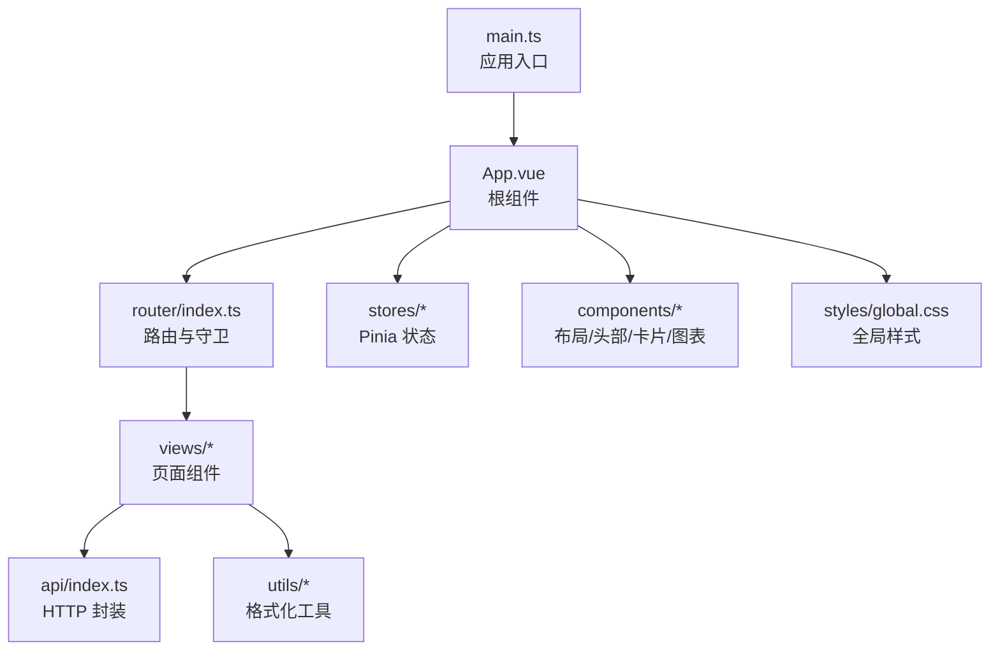
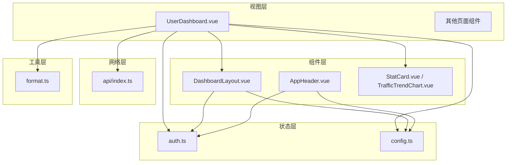
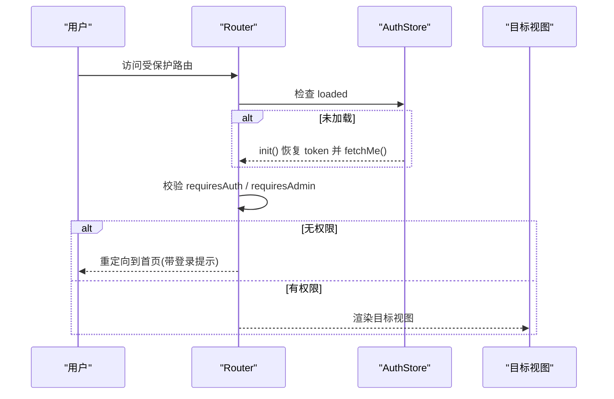
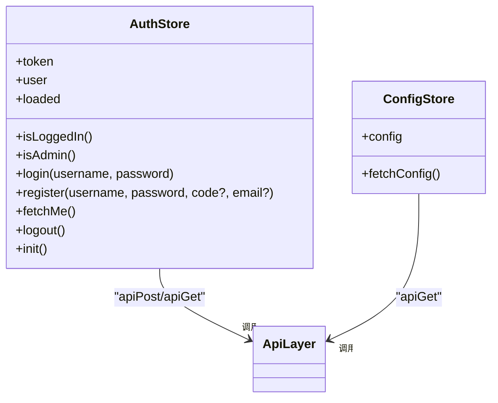
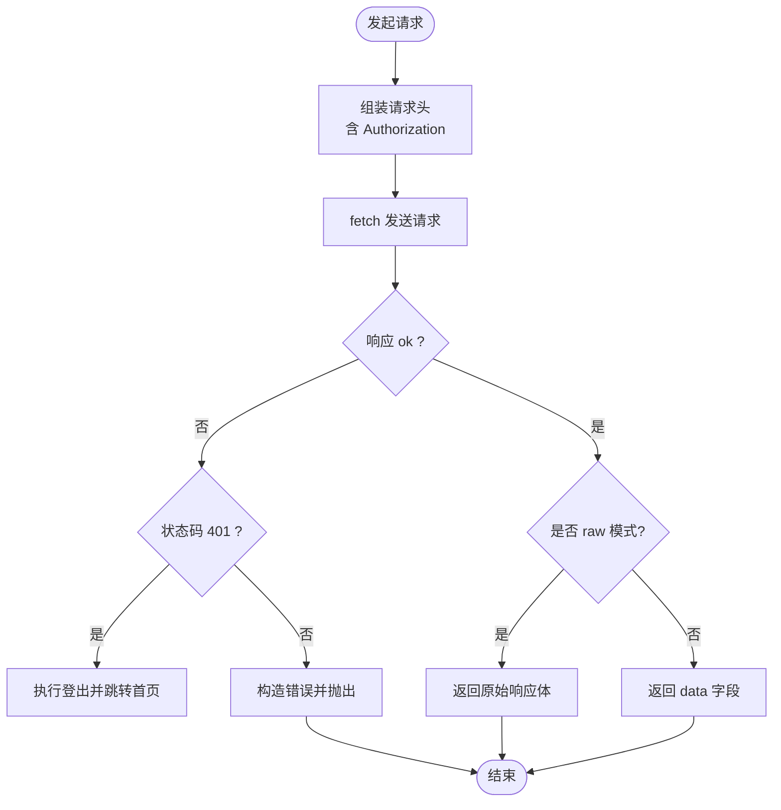
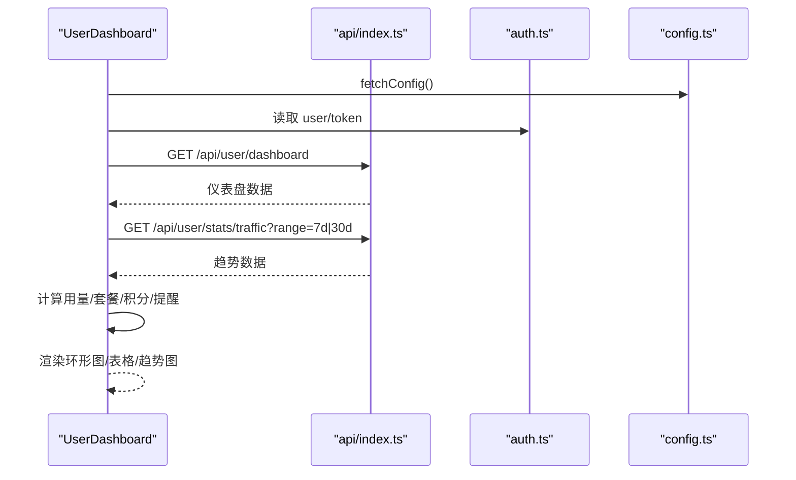
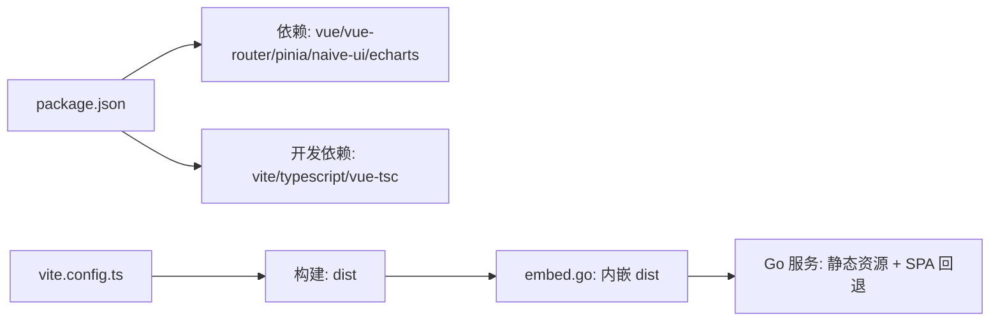

# 前端应用

<cite>
**本文引用的文件**
- [frontend/package.json](file://frontend/package.json)
- [frontend/vite.config.ts](file://frontend/vite.config.ts)
- [frontend/tsconfig.json](file://frontend/tsconfig.json)
- [frontend/src/main.ts](file://frontend/src/main.ts)
- [frontend/src/App.vue](file://frontend/src/App.vue)
- [frontend/src/router/index.ts](file://frontend/src/router/index.ts)
- [frontend/src/stores/auth.ts](file://frontend/src/stores/auth.ts)
- [frontend/src/stores/config.ts](file://frontend/src/stores/config.ts)
- [frontend/src/api/index.ts](file://frontend/src/api/index.ts)
- [frontend/src/styles/global.css](file://frontend/src/styles/global.css)
- [frontend/src/components/DashboardLayout.vue](file://frontend/src/components/DashboardLayout.vue)
- [frontend/src/components/AppHeader.vue](file://frontend/src/components/AppHeader.vue)
- [frontend/src/views/UserDashboard.vue](file://frontend/src/views/UserDashboard.vue)
- [frontend/src/utils/format.ts](file://frontend/src/utils/format.ts)
- [frontend/embed.go](file://frontend/embed.go)
</cite>

## 目录
1. [简介](#简介)
2. [项目结构](#项目结构)
3. [核心组件](#核心组件)
4. [架构总览](#架构总览)
5. [详细组件分析](#详细组件分析)
6. [依赖关系分析](#依赖关系分析)
7. [性能考量](#性能考量)
8. [故障排查指南](#故障排查指南)
9. [结论](#结论)
10. [附录](#附录)

## 简介
本前端应用基于 Vue 3 + TypeScript 构建，采用 Vite 作为开发与构建工具，使用 Naive UI 作为 UI 组件库，Pinia 进行全局状态管理，Vue Router 实现页面路由与权限控制。整体遵循“基础组件 + 业务组件 + 页面组件”的组件化组织方式，并通过统一的 API 封装层处理请求、鉴权与错误。后端通过 Go 程序将构建产物内嵌并静态托管，提供 SPA 路由回退与资源缓存策略。

## 项目结构
前端代码位于 frontend 目录，主要结构如下：
- src/main.ts：应用入口，挂载 Pinia、Router 与全局样式
- src/App.vue：根组件，配置 Naive UI 主题与语言，初始化站点配置
- src/router/index.ts：路由定义与守卫（登录/管理员校验）
- src/stores：Pinia 状态模块（auth 认证、config 站点配置）
- src/api：统一 HTTP 封装（GET/POST/PUT/DELETE、列表、下载、错误处理）
- src/components：可复用组件（布局、头部、统计卡片、图表、弹窗等）
- src/views：页面级组件（用户端与管理端各功能页）
- src/utils：通用工具函数（格式化、Markdown、计数动画等）
- src/styles：全局样式与主题变量
- vite.config.ts：Vite 开发服务器代理、别名、构建输出
- package.json：脚本与依赖
- embed.go：Go 侧嵌入 dist 资源并提供 SPA 回退与缓存头

图示来源
- [frontend/src/main.ts:1-11](file://frontend/src/main.ts#L1-L11)
- [frontend/src/App.vue:1-30](file://frontend/src/App.vue#L1-L30)
- [frontend/src/router/index.ts:1-66](file://frontend/src/router/index.ts#L1-L66)
- [frontend/src/api/index.ts:1-124](file://frontend/src/api/index.ts#L1-L124)

章节来源
- [frontend/package.json:1-27](file://frontend/package.json#L1-L27)
- [frontend/vite.config.ts:1-32](file://frontend/vite.config.ts#L1-L32)
- [frontend/tsconfig.json:1-25](file://frontend/tsconfig.json#L1-L25)

## 核心组件
- 应用壳与导航
  - DashboardLayout：桌面侧边栏 + 移动端抽屉菜单，动态生成菜单项，响应式切换；顶部显示当前标题与用户/管理快捷入口。
  - AppHeader：轻量头部，展示品牌、控制台入口、管理员快捷菜单、用户下拉与登录弹窗触发。
- 数据与状态
  - auth Store：维护 token、用户信息、登录/注册/登出、首次加载恢复与会话刷新；提供 isLoggedIn/isAdmin 计算属性。
  - config Store：拉取站点配置（名称、描述、注册模式、积分汇率等），供全局渲染。
- 页面
  - UserDashboard：控制台首页，聚合流量用量环形图、套餐状态、积分、趋势图、公告等，组合 StatCard、TrafficTrendChart 等组件。
- 通用
  - StatCard、TrafficTrendChart、LoginDialog、RefundDialog、Toast 等基础/业务组件用于拼装页面。

章节来源
- [frontend/src/components/DashboardLayout.vue:1-249](file://frontend/src/components/DashboardLayout.vue#L1-L249)
- [frontend/src/components/AppHeader.vue:1-110](file://frontend/src/components/AppHeader.vue#L1-L110)
- [frontend/src/stores/auth.ts:1-75](file://frontend/src/stores/auth.ts#L1-L75)
- [frontend/src/stores/config.ts:1-37](file://frontend/src/stores/config.ts#L1-L37)
- [frontend/src/views/UserDashboard.vue:1-360](file://frontend/src/views/UserDashboard.vue#L1-L360)

## 架构总览
前端采用“视图层（Views）— 组件层（Components）— 状态层（Stores）— 网络层（API）— 工具层（Utils）”的分层设计，配合路由守卫完成鉴权与跳转。Naive UI 提供主题与国际化，全局 CSS 变量统一视觉风格。

图示来源
- [frontend/src/views/UserDashboard.vue:1-360](file://frontend/src/views/UserDashboard.vue#L1-L360)
- [frontend/src/components/DashboardLayout.vue:1-249](file://frontend/src/components/DashboardLayout.vue#L1-L249)
- [frontend/src/components/AppHeader.vue:1-110](file://frontend/src/components/AppHeader.vue#L1-L110)
- [frontend/src/stores/auth.ts:1-75](file://frontend/src/stores/auth.ts#L1-L75)
- [frontend/src/stores/config.ts:1-37](file://frontend/src/stores/config.ts#L1-L37)
- [frontend/src/api/index.ts:1-124](file://frontend/src/api/index.ts#L1-L124)
- [frontend/src/utils/format.ts:1-73](file://frontend/src/utils/format.ts#L1-L73)

## 详细组件分析

### 路由与导航
- 路由模式：Hash 模式，便于部署与回退。
- 路由表：公共页（监控）、受保护页（requiresAuth）、管理页（requiresAdmin）。
- 守卫逻辑：首次进入时等待 auth 初始化；根据 meta 判断是否需要登录或管理员权限，不满足则重定向到首页并携带登录提示。

图示来源
- [frontend/src/router/index.ts:1-66](file://frontend/src/router/index.ts#L1-L66)
- [frontend/src/stores/auth.ts:1-75](file://frontend/src/stores/auth.ts#L1-L75)

章节来源
- [frontend/src/router/index.ts:1-66](file://frontend/src/router/index.ts#L1-L66)

### 状态管理（Pinia）
- auth Store
  - 字段：token、user、loaded；计算：isLoggedIn、isAdmin
  - 方法：login、register、fetchMe、logout、init
  - 行为：从 localStorage 恢复 token；首次加载调用 fetchMe；401 自动登出并清理本地状态。
- config Store
  - 字段：config（站点配置）
  - 方法：fetchConfig 拉取 /api/config 并合并到默认值

图示来源
- [frontend/src/stores/auth.ts:1-75](file://frontend/src/stores/auth.ts#L1-L75)
- [frontend/src/stores/config.ts:1-37](file://frontend/src/stores/config.ts#L1-L37)
- [frontend/src/api/index.ts:1-124](file://frontend/src/api/index.ts#L1-L124)

章节来源
- [frontend/src/stores/auth.ts:1-75](file://frontend/src/stores/auth.ts#L1-L75)
- [frontend/src/stores/config.ts:1-37](file://frontend/src/stores/config.ts#L1-L37)

### API 封装与错误处理
- request 统一处理：
  - 注入 Authorization 头（Bearer token）
  - 统一读取 JSON 体
  - 非 2xx 时抛出带 status 的错误对象；401 触发登出并跳转到首页带登录参数
  - 对标准信封响应解包 data；支持 raw 模式返回完整体
- 便捷方法：apiList、apiGet、apiGetRaw、apiPost、apiPut、apiDelete
- 二进制下载：apiDownload 通过 Blob + Object URL 触发下载，兼容鉴权场景

图示来源
- [frontend/src/api/index.ts:1-124](file://frontend/src/api/index.ts#L1-L124)

章节来源
- [frontend/src/api/index.ts:1-124](file://frontend/src/api/index.ts#L1-L124)

### 布局与页面组件
- DashboardLayout
  - 桌面端侧边栏 + 移动端抽屉菜单
  - 动态菜单：按角色（普通/管理员）生成分组与选项
  - 标题映射：根据路由路径显示中文标题
  - 响应式：监听窗口尺寸切换布局
- AppHeader
  - 展示品牌、控制台入口、管理员快捷菜单、用户下拉
  - 登录后显示用户名，未登录显示登录按钮并打开 LoginDialog
- UserDashboard
  - 聚合指标：剩余流量、生效中套餐、积分、近 N 天用量趋势
  - 环形进度条与颜色阈值：根据用量百分比动态着色
  - 公告列表与详情弹窗
  - 数据加载：并行获取仪表盘与趋势数据

图示来源
- [frontend/src/views/UserDashboard.vue:1-360](file://frontend/src/views/UserDashboard.vue#L1-L360)
- [frontend/src/api/index.ts:1-124](file://frontend/src/api/index.ts#L1-L124)
- [frontend/src/stores/auth.ts:1-75](file://frontend/src/stores/auth.ts#L1-L75)
- [frontend/src/stores/config.ts:1-37](file://frontend/src/stores/config.ts#L1-L37)

章节来源
- [frontend/src/components/DashboardLayout.vue:1-249](file://frontend/src/components/DashboardLayout.vue#L1-L249)
- [frontend/src/components/AppHeader.vue:1-110](file://frontend/src/components/AppHeader.vue#L1-L110)
- [frontend/src/views/UserDashboard.vue:1-360](file://frontend/src/views/UserDashboard.vue#L1-L360)

### 样式与主题
- 全局 CSS 变量：背景、文字、强调色、圆角、阴影、字体栈等
- Markdown 渲染样式：标题、段落、列表、代码块、引用、表格、图片
- 通用布局类：page-title、page-toolbar、card-grid、list-card、stat-row
- Naive UI 主题覆盖：主色、悬停/按下态、圆角等
- 响应式：移动端标题与间距调整

章节来源
- [frontend/src/styles/global.css:1-131](file://frontend/src/styles/global.css#L1-L131)
- [frontend/src/App.vue:1-30](file://frontend/src/App.vue#L1-L30)

## 依赖关系分析
- 运行时依赖：Vue 3、Vue Router、Pinia、Naive UI、ECharts、二维码库等
- 开发依赖：Vite、TypeScript、vue-tsc、@vitejs/plugin-vue
- 构建与部署：Vite 输出至 dist；Go 程序通过 embed 内嵌 dist 并处理 SPA 路由回退与缓存头

图示来源
- [frontend/package.json:1-27](file://frontend/package.json#L1-L27)
- [frontend/vite.config.ts:1-32](file://frontend/vite.config.ts#L1-L32)
- [frontend/embed.go:1-79](file://frontend/embed.go#L1-L79)

章节来源
- [frontend/package.json:1-27](file://frontend/package.json#L1-L27)
- [frontend/vite.config.ts:1-32](file://frontend/vite.config.ts#L1-L32)
- [frontend/embed.go:1-79](file://frontend/embed.go#L1-L79)

## 性能考量
- 路由懒加载：页面组件按需 import，减少首屏体积
- 列表与图表：ECharts 按需渲染，避免频繁重绘
- 样式优化：CSS 变量与局部样式，减少重复计算
- 缓存策略：Go 侧对 assets 设置长期不可变缓存，index.html 强制不缓存
- 网络请求：统一封装减少重复逻辑，失败快速降级与友好提示

[本节为通用指导，无需特定文件来源]

## 故障排查指南
- 401 未授权
  - 现象：接口返回 401，自动登出并跳转首页
  - 定位：检查 token 是否存在、是否过期；查看 api 层的 401 处理
- 路由守卫导致无法进入页面
  - 现象：访问受保护路由被重定向到首页
  - 定位：检查 router 守卫逻辑与 auth.loaded 初始化
- 构建后白屏
  - 现象：浏览器加载 index.html 但无内容
  - 定位：确认已执行 npm run build 且 dist 存在；Go 侧若缺失会返回明确错误信息
- 开发环境跨域
  - 现象：本地开发请求后端失败
  - 定位：检查 vite.config.ts 的 proxy 配置与后端监听地址

章节来源
- [frontend/src/api/index.ts:1-124](file://frontend/src/api/index.ts#L1-L124)
- [frontend/src/router/index.ts:1-66](file://frontend/src/router/index.ts#L1-L66)
- [frontend/embed.go:1-79](file://frontend/embed.go#L1-L79)
- [frontend/vite.config.ts:1-32](file://frontend/vite.config.ts#L1-L32)

## 结论
该前端工程以清晰的层次划分与模块化组织实现了用户端与管理端的完整功能。通过 Pinia 集中管理状态、Vue Router 实现权限控制、统一 API 封装简化网络交互，结合 Naive UI 与全局样式规范保证了良好的用户体验与一致性。构建与部署流程简洁可靠，适合持续集成与快速迭代。

[本节为总结性内容，无需特定文件来源]

## 附录

### 开发环境搭建与调试
- 安装依赖：在 frontend 目录下执行包管理器安装命令
- 启动开发服务器：运行 dev 脚本，默认端口 5173，自动代理 /api 与 /sub 到后端
- 类型检查与构建：build 脚本先执行类型检查再构建；preview 预览生产构建
- 环境变量与别名：tsconfig 与 vite.config 配置 @ 路径别名
- 调试建议：利用浏览器开发者工具观察网络请求与状态变化；关注 401 与路由守卫行为

章节来源
- [frontend/package.json:1-27](file://frontend/package.json#L1-L27)
- [frontend/vite.config.ts:1-32](file://frontend/vite.config.ts#L1-L32)
- [frontend/tsconfig.json:1-25](file://frontend/tsconfig.json#L1-L25)

### 构建与部署流程
- 构建产物：Vite 输出到 dist
- 内嵌与托管：Go 程序在编译时将 dist 内嵌，提供静态资源与 SPA 回退；assets 长期缓存，index.html 不缓存
- 环境变量：QZ_WEB_DIR 可在开发时指向磁盘目录，跳过内嵌直接读取

章节来源
- [frontend/vite.config.ts:1-32](file://frontend/vite.config.ts#L1-L32)
- [frontend/embed.go:1-79](file://frontend/embed.go#L1-L79)

### 最佳实践
- 组件职责单一：页面组件聚焦数据编排与交互，基础/业务组件负责展示与通用逻辑
- 状态最小化：仅在全局存储必要状态，页面内部状态尽量使用本地 ref/computed
- 错误边界：API 层统一捕获与提示，页面层做降级与空态处理
- 可访问性与可读性：保持语义化结构与合理的对比度，遵循全局样式变量
- 性能优先：懒加载、按需引入、减少不必要的重渲染

[本节为通用指导，无需特定文件来源]
