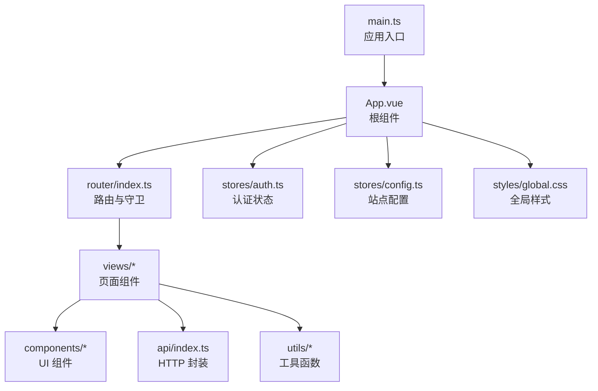
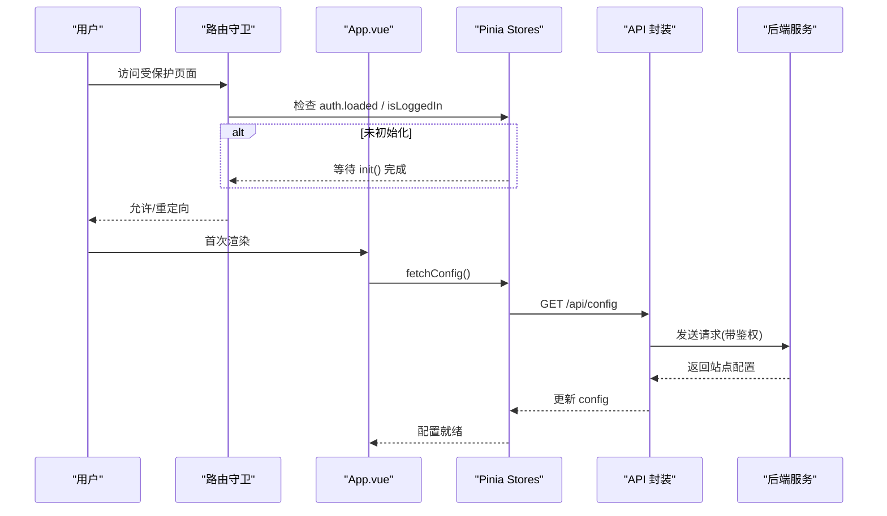
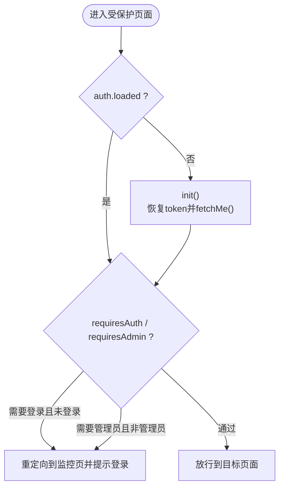
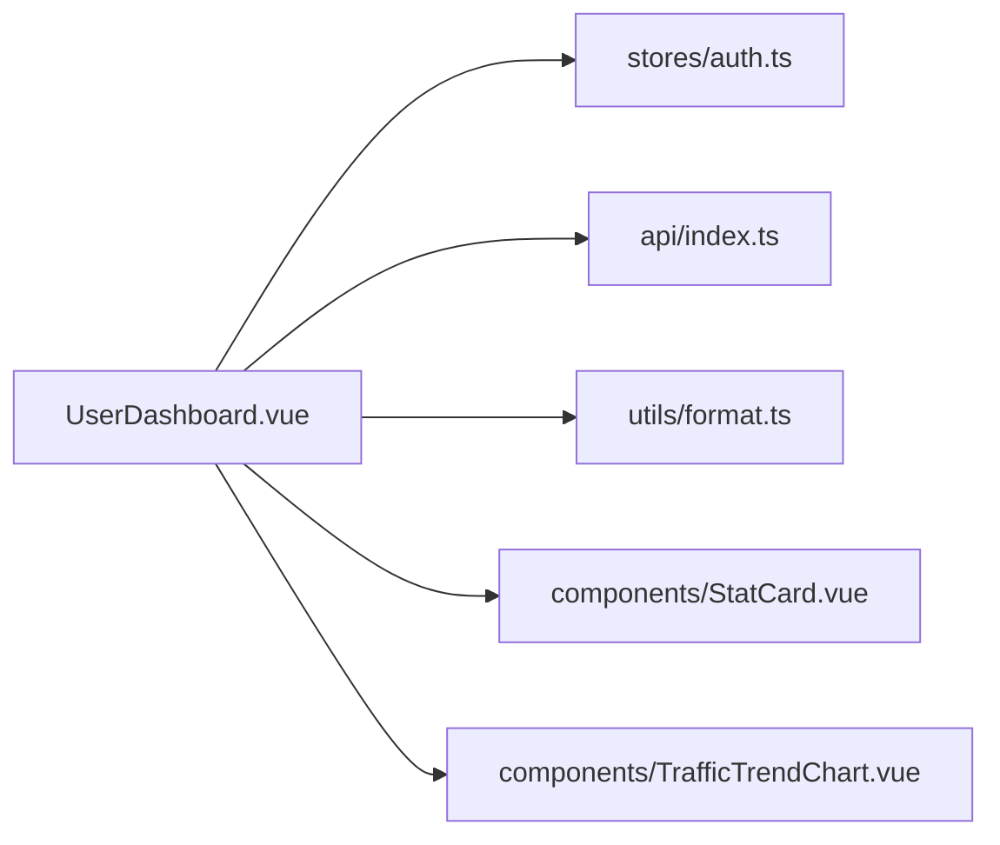
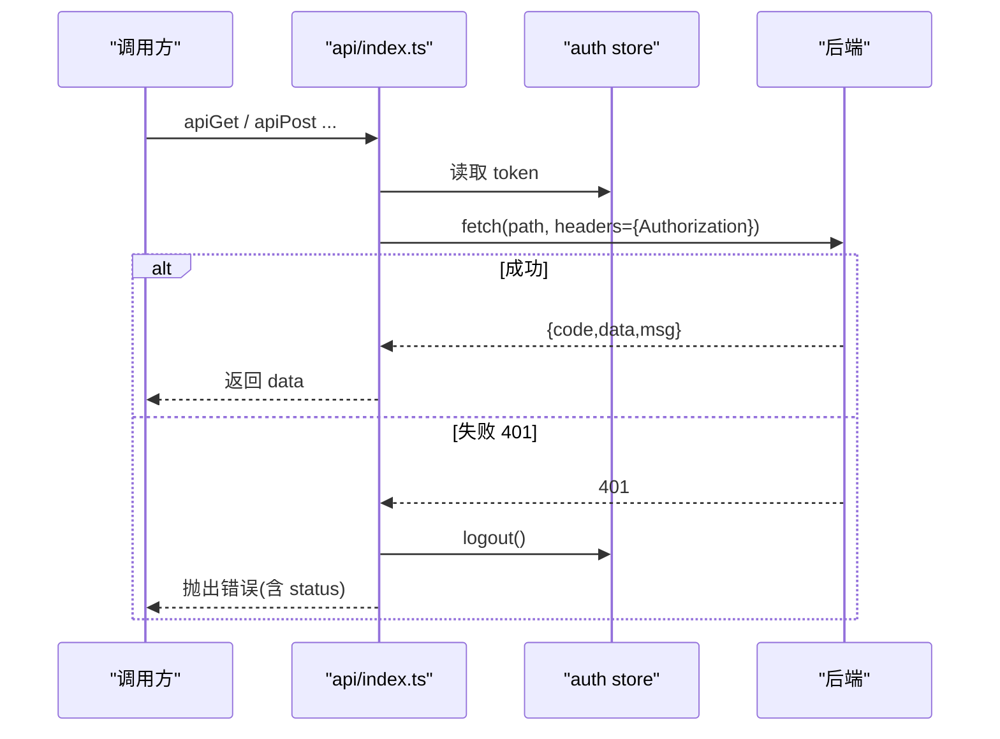
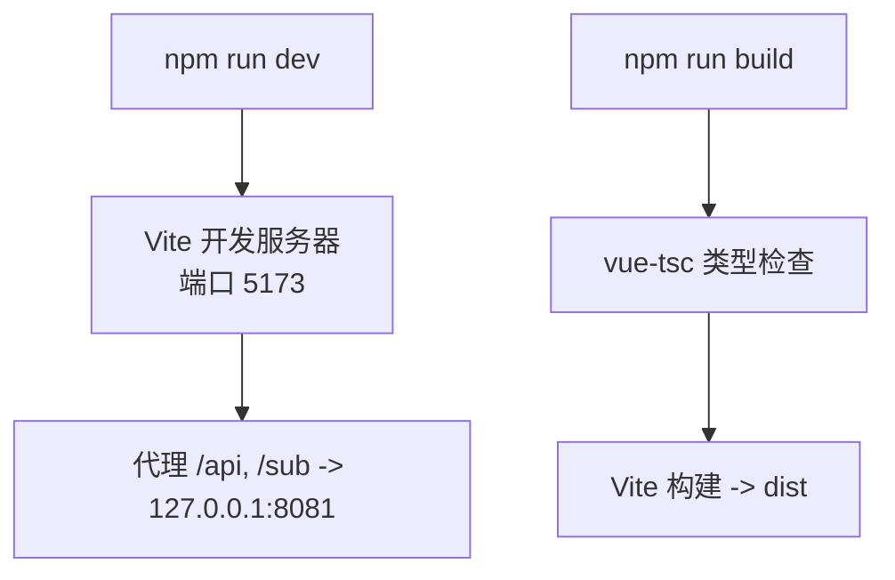

# 前端架构设计

<cite>
**本文引用的文件**
- [frontend/package.json](file://frontend/package.json)
- [frontend/vite.config.ts](file://frontend/vite.config.ts)
- [frontend/tsconfig.json](file://frontend/tsconfig.json)
- [frontend/src/main.ts](file://frontend/src/main.ts)
- [frontend/src/App.vue](file://frontend/src/App.vue)
- [frontend/src/router/index.ts](file://frontend/src/router/index.ts)
- [frontend/src/stores/auth.ts](file://frontend/src/stores/auth.ts)
- [frontend/src/stores/config.ts](file://frontend/src/stores/config.ts)
- [frontend/src/api/index.ts](file://frontend/src/api/index.ts)
- [frontend/src/views/UserDashboard.vue](file://frontend/src/views/UserDashboard.vue)
- [frontend/src/utils/format.ts](file://frontend/src/utils/format.ts)
- [frontend/src/styles/global.css](file://frontend/src/styles/global.css)
</cite>

## 目录
1. [简介](#简介)
2. [项目结构](#项目结构)
3. [核心组件](#核心组件)
4. [架构总览](#架构总览)
5. [详细组件分析](#详细组件分析)
6. [依赖与版本管理](#依赖与版本管理)
7. [构建与开发配置](#构建与开发配置)
8. [代码规范与质量](#代码规范与质量)
9. [性能优化策略](#性能优化策略)
10. [故障排查指南](#故障排查指南)
11. [结论](#结论)

## 简介
本项目为基于 Vue 3 + TypeScript 的前端工程，采用 Vite 作为构建工具，Pinia 进行状态管理，Vue Router 实现路由与鉴权守卫。整体遵循“模块化、职责单一”的设计原则：视图层按业务域组织在 views，通用 UI 组件集中在 components，数据流通过 stores 统一维护，网络请求封装在 api，工具函数与样式分别归入 utils 与 styles。该架构便于扩展与维护，适合中后台管理与用户控制台场景。

## 项目结构
前端源码位于 frontend/src，采用功能分层与领域划分相结合的目录组织方式：
- src/main.ts：应用入口，创建 Vue 实例并挂载 Pinia、Router 与全局样式
- src/App.vue：根组件，提供 Naive UI 主题与消息/对话框上下文，并在启动时拉取站点配置
- src/router/index.ts：路由定义与前置守卫（登录态、管理员权限）
- src/stores：Pinia Store，auth 负责认证与会话，config 负责站点配置
- src/api：统一的 HTTP 请求封装，处理鉴权头、错误与下载等
- src/components：可复用 UI 组件（布局、卡片、图表、弹窗等）
- src/views：页面级组件，按用户域与管理域划分
- src/utils：格式化、Markdown、计数动画等工具
- src/styles：全局样式与主题变量

**图示来源**
- [frontend/src/main.ts:1-11](file://frontend/src/main.ts#L1-L11)
- [frontend/src/App.vue:1-30](file://frontend/src/App.vue#L1-L30)
- [frontend/src/router/index.ts:1-66](file://frontend/src/router/index.ts#L1-L66)
- [frontend/src/stores/auth.ts:1-75](file://frontend/src/stores/auth.ts#L1-L75)
- [frontend/src/stores/config.ts:1-37](file://frontend/src/stores/config.ts#L1-L37)
- [frontend/src/api/index.ts:1-124](file://frontend/src/api/index.ts#L1-L124)
- [frontend/src/styles/global.css:1-131](file://frontend/src/styles/global.css#L1-L131)

**章节来源**
- [frontend/src/main.ts:1-11](file://frontend/src/main.ts#L1-L11)
- [frontend/src/App.vue:1-30](file://frontend/src/App.vue#L1-L30)
- [frontend/src/router/index.ts:1-66](file://frontend/src/router/index.ts#L1-L66)

## 核心组件
- 应用初始化与装配：在 main.ts 中创建应用、安装 Pinia 与 Router，并挂载到 DOM；App.vue 提供 Naive UI 主题覆盖与国际化，同时调用配置 store 获取站点信息
- 路由与鉴权：使用 Hash 模式路由，集中定义用户域与管理域路由；beforeEach 守卫根据 meta.requiresAuth 与 requiresAdmin 控制访问，未登录或无管理员权限时重定向
- 状态管理：auth store 维护 token、用户信息与加载状态，提供登录、注册、登出、获取当前用户与防重复初始化；config store 维护站点配置并提供拉取方法
- API 封装：统一 request 函数注入 Authorization 头、处理 401 跳转登录、解包后端信封响应；提供 GET/POST/PUT/DELETE、列表保证数组、原始响应与二进制下载能力

**章节来源**
- [frontend/src/main.ts:1-11](file://frontend/src/main.ts#L1-L11)
- [frontend/src/App.vue:1-30](file://frontend/src/App.vue#L1-L30)
- [frontend/src/router/index.ts:1-66](file://frontend/src/router/index.ts#L1-L66)
- [frontend/src/stores/auth.ts:1-75](file://frontend/src/stores/auth.ts#L1-L75)
- [frontend/src/stores/config.ts:1-37](file://frontend/src/stores/config.ts#L1-L37)
- [frontend/src/api/index.ts:1-124](file://frontend/src/api/index.ts#L1-L124)

## 架构总览
下图展示了从浏览器发起请求到后端返回数据的完整链路，包括路由守卫、状态初始化、API 封装与错误处理。

**图示来源**
- [frontend/src/router/index.ts:46-63](file://frontend/src/router/index.ts#L46-L63)
- [frontend/src/stores/auth.ts:60-71](file://frontend/src/stores/auth.ts#L60-L71)
- [frontend/src/stores/config.ts:28-33](file://frontend/src/stores/config.ts#L28-L33)
- [frontend/src/api/index.ts:9-48](file://frontend/src/api/index.ts#L9-L48)

## 详细组件分析

### 认证与会话流程（auth store）
- 职责：维护 token、用户信息、加载状态；提供登录、注册、登出、获取当前用户、初始化恢复
- 关键点：
  - 从 localStorage 恢复 token，避免刷新后丢失会话
  - init() 防重复调用，确保路由守卫等待完成
  - 401 自动登出并清理本地状态
  - 计算属性 isLoggedIn、isAdmin 用于路由守卫与界面展示

**图示来源**
- [frontend/src/router/index.ts:46-63](file://frontend/src/router/index.ts#L46-L63)
- [frontend/src/stores/auth.ts:16-75](file://frontend/src/stores/auth.ts#L16-L75)

**章节来源**
- [frontend/src/stores/auth.ts:1-75](file://frontend/src/stores/auth.ts#L1-L75)
- [frontend/src/router/index.ts:1-66](file://frontend/src/router/index.ts#L1-L66)

### 站点配置加载（config store）
- 职责：维护站点配置（名称、描述、注册模式、积分汇率等），提供 fetchConfig 拉取并合并
- 关键点：默认值兜底，异常静默处理，避免影响首屏渲染

**章节来源**
- [frontend/src/stores/config.ts:1-37](file://frontend/src/stores/config.ts#L1-L37)

### 控制台页面（UserDashboard）
- 职责：聚合流量用量、套餐状态、公告与趋势图，驱动统计卡片与图表
- 关键点：
  - 组合多个 store 与工具函数（格式化工具、Markdown 转换、计数动画）
  - 通过 API 拉取仪表盘数据与趋势数据
  - 使用组件 StatCard、TrafficTrendChart 提升复用性

**图示来源**
- [frontend/src/views/UserDashboard.vue:1-200](file://frontend/src/views/UserDashboard.vue#L1-L200)
- [frontend/src/stores/auth.ts:1-75](file://frontend/src/stores/auth.ts#L1-L75)
- [frontend/src/api/index.ts:1-124](file://frontend/src/api/index.ts#L1-L124)
- [frontend/src/utils/format.ts:1-73](file://frontend/src/utils/format.ts#L1-L73)

**章节来源**
- [frontend/src/views/UserDashboard.vue:1-200](file://frontend/src/views/UserDashboard.vue#L1-L200)

### 网络请求与错误处理（API 封装）
- 职责：统一请求构造、鉴权头注入、错误处理、响应体解包、二进制下载
- 关键点：
  - 自动附加 Authorization 头
  - 401 触发登出并跳转到公共页的登录提示，避免死循环
  - 大多数接口返回 {code,data,msg} 信封，自动解包 data；支持 raw 模式以获取原始 JSON
  - 下载附件通过 Blob + Object URL 触发，兼容鉴权场景

**图示来源**
- [frontend/src/api/index.ts:9-48](file://frontend/src/api/index.ts#L9-L48)
- [frontend/src/stores/auth.ts:51-58](file://frontend/src/stores/auth.ts#L51-L58)

**章节来源**
- [frontend/src/api/index.ts:1-124](file://frontend/src/api/index.ts#L1-L124)

## 依赖与版本管理
- 运行时依赖：Vue 3、Vue Router、Pinia、Naive UI、ECharts、图标库、二维码生成
- 开发依赖：Vite、@vitejs/plugin-vue、TypeScript、vue-tsc
- 脚本命令：dev（启动开发服务器）、build（类型检查+构建）、preview（预览构建产物）
- 版本策略：使用 ^ 前缀保持小版本兼容，锁定 major/minor 范围；生产构建输出至 dist

**章节来源**
- [frontend/package.json:1-27](file://frontend/package.json#L1-L27)

## 构建与开发配置
- Vite 配置要点：
  - 插件：启用 @vitejs/plugin-vue
  - 别名：@ 指向 src，简化导入路径
  - 开发服务器：端口 5173，代理 /api 与 /sub 到本地后端 8081，便于联调
  - 构建：输出目录 dist，每次构建清空旧产物
- TypeScript 编译选项：
  - 目标 ES2020，模块 ESNext，解析器 bundler
  - 严格模式开启，保留 JSX，跳过库检查
  - 路径映射 @/* -> ./src/*，包含 .vue 与 env.d.ts
- 环境变量：可通过 Vite 的 import.meta.env 在构建期注入；开发联调依赖代理转发

**图示来源**
- [frontend/vite.config.ts:1-32](file://frontend/vite.config.ts#L1-L32)
- [frontend/tsconfig.json:1-25](file://frontend/tsconfig.json#L1-L25)
- [frontend/package.json:6-10](file://frontend/package.json#L6-L10)

**章节来源**
- [frontend/vite.config.ts:1-32](file://frontend/vite.config.ts#L1-L32)
- [frontend/tsconfig.json:1-25](file://frontend/tsconfig.json#L1-L25)
- [frontend/package.json:6-10](file://frontend/package.json#L6-L10)

## 代码规范与质量
- 语言与类型：TypeScript 严格模式，强制类型安全；使用 vue-tsc 在构建前进行类型检查
- 模块与路径：统一使用 @ 别名导入，减少相对路径复杂度
- 组件与样式：组件按职责拆分，样式通过 CSS 变量统一管理主题色与间距
- 建议：
  - 新增页面遵循 views 下按领域划分子目录或命名约定
  - 新增 API 优先复用 api/index.ts 中的方法，避免重复 fetch
  - 新增 Store 遵循单一职责，尽量将副作用放在 actions/composables 中

[本节为通用规范说明，不直接分析具体文件]

## 性能优化策略
- 路由懒加载：所有页面组件通过动态 import 按需加载，减少首屏体积
- 组件与图表：大图表（如 ECharts）仅在需要时渲染，结合条件渲染与虚拟滚动
- 资源与缓存：
  - 构建产物输出到 dist，配合 CDN 缓存静态资源
  - 使用 Vite 的默认分包策略，合理拆分 vendor 与业务代码
- 网络请求：
  - 统一封装减少重复逻辑，避免不必要的重复请求
  - 对高频数据可采用轮询或长连接（视后端能力）
- 样式与主题：通过 CSS 变量与主题覆盖减少运行时样式计算开销

[本节为通用优化建议，不直接分析具体文件]

## 故障排查指南
- 401 未授权：
  - 现象：请求失败并跳转登录页
  - 原因：token 过期或无效，API 封装会调用登出并清理本地状态
  - 处理：重新登录后重试
- 代理不可用：
  - 现象：开发环境 /api 请求失败
  - 原因：后端未启动或未监听 8081
  - 处理：确认后端运行，必要时修改 vite.config.ts 的代理目标
- 路由守卫卡住：
  - 现象：进入受保护页面白屏或一直加载中
  - 原因：auth.init() 未完成
  - 处理：检查网络与 /api/auth/me 接口可用性
- 构建失败：
  - 现象：npm run build 报错
  - 原因：类型错误或 TS 配置问题
  - 处理：先执行 vue-tsc 定位类型错误，再修复

**章节来源**
- [frontend/src/api/index.ts:28-48](file://frontend/src/api/index.ts#L28-L48)
- [frontend/src/router/index.ts:46-63](file://frontend/src/router/index.ts#L46-L63)
- [frontend/vite.config.ts:12-25](file://frontend/vite.config.ts#L12-L25)

## 结论
本前端工程以 Vue 3 + TypeScript + Vite 为核心，采用清晰的模块化与领域划分，结合 Pinia 与 Vue Router 实现了稳健的状态管理与鉴权流程。API 封装统一了请求与错误处理，提升了可维护性与扩展性。通过路由懒加载、合理的依赖与构建配置，项目在开发与生产环境均具备良好的性能表现。后续可在微前端、PWA、更细粒度的代码分割与缓存策略方面持续优化。
