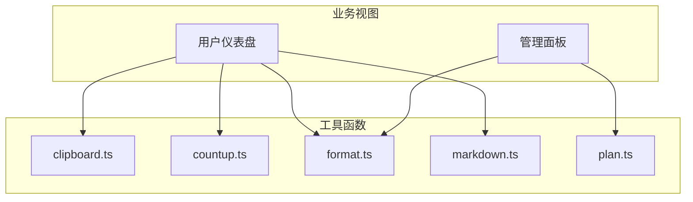
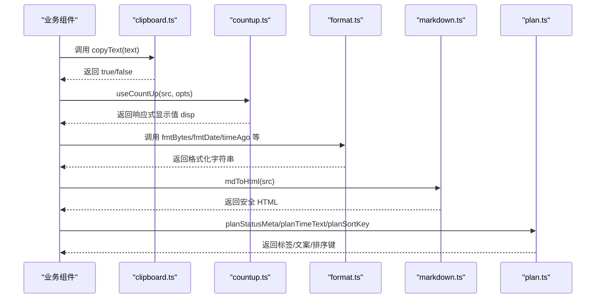
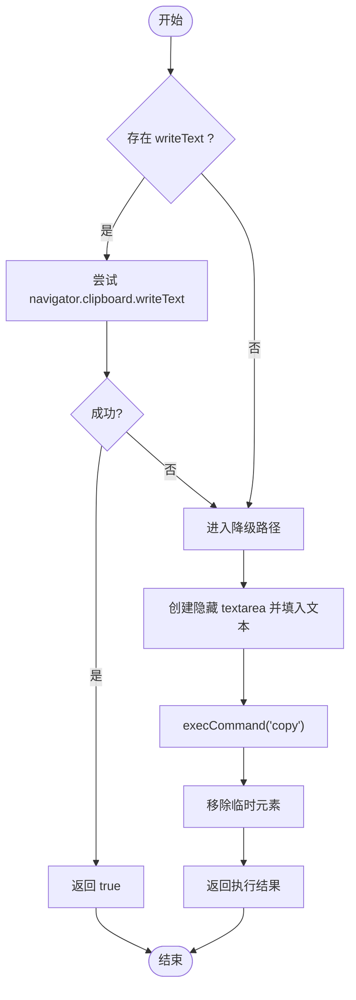
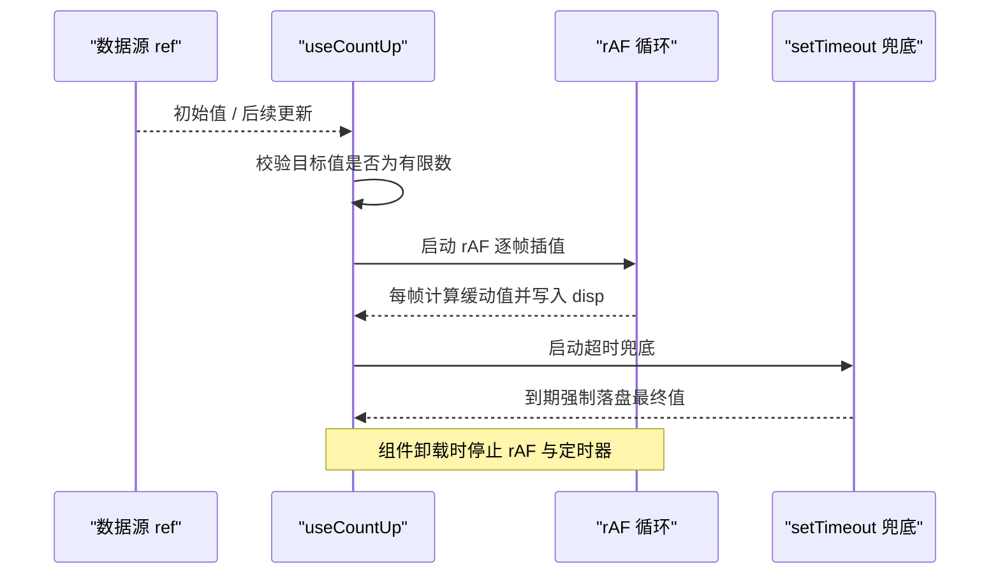
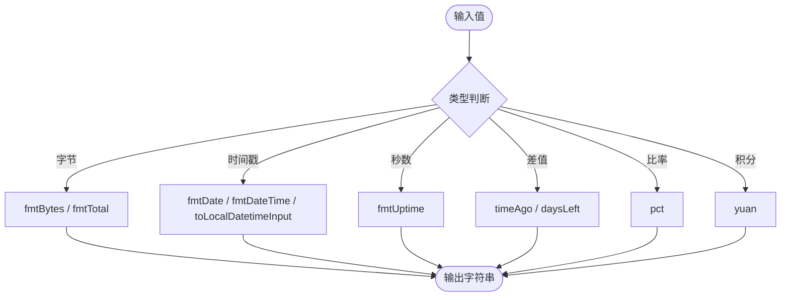
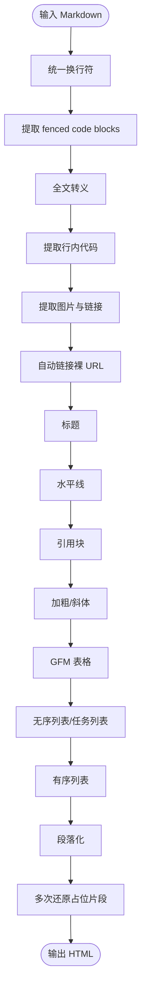
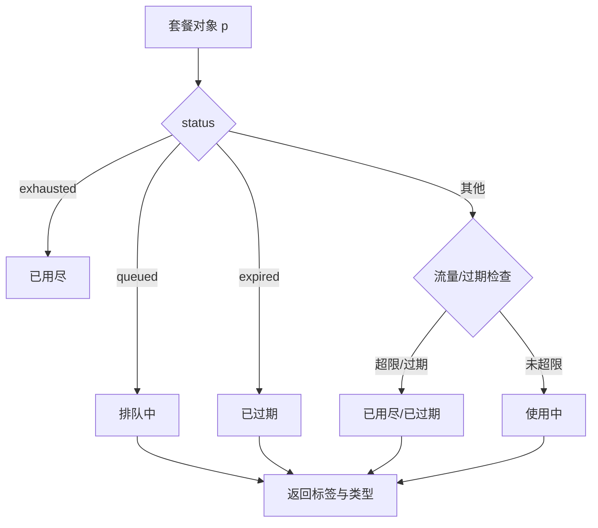
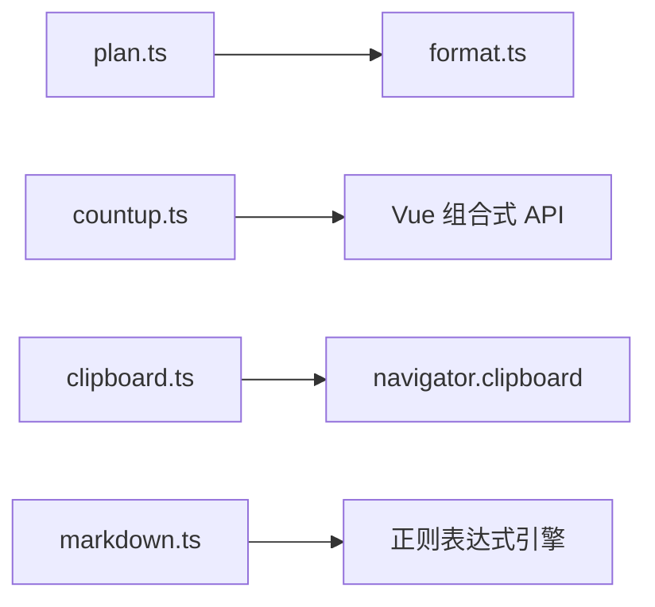

# 工具函数库

<cite>
**本文引用的文件**
- [frontend/src/utils/clipboard.ts](file://frontend/src/utils/clipboard.ts)
- [frontend/src/utils/countup.ts](file://frontend/src/utils/countup.ts)
- [frontend/src/utils/format.ts](file://frontend/src/utils/format.ts)
- [frontend/src/utils/markdown.ts](file://frontend/src/utils/markdown.ts)
- [frontend/src/utils/plan.ts](file://frontend/src/utils/plan.ts)
- [frontend/package.json](file://frontend/package.json)
</cite>

## 目录
1. [简介](#简介)
2. [项目结构](#项目结构)
3. [核心组件](#核心组件)
4. [架构总览](#架构总览)
5. [详细组件分析](#详细组件分析)
6. [依赖关系分析](#依赖关系分析)
7. [性能考虑](#性能考虑)
8. [故障排查指南](#故障排查指南)
9. [结论](#结论)
10. [附录](#附录)

## 简介
本仓库的前端工具函数库位于 frontend/src/utils，提供通用、可复用的前端能力，涵盖：
- 剪贴板操作：安全、兼容的文本复制能力
- 数字动画：基于 requestAnimationFrame 的数字滚动效果
- 格式化工具：字节、时间、百分比、时长等常用格式化
- Markdown 解析与渲染：轻量、安全的 GFM 子集转换
- 套餐相关计算与展示：状态、排序、时间文案等

这些工具函数以纯函数或 Vue 组合式 API 的形式暴露，便于在任意组件中按需引入使用。

## 项目结构
工具函数按职责划分到独立模块，便于维护与测试：
- clipboard.ts：剪贴板写入封装
- countup.ts：数字滚动动画 Hook
- format.ts：数值与时间格式化
- markdown.ts：Markdown → HTML 转换器（含 XSS 防护）
- plan.ts：套餐状态、时间与排序辅助

图表来源
- [frontend/src/utils/clipboard.ts:1-27](file://frontend/src/utils/clipboard.ts#L1-L27)
- [frontend/src/utils/countup.ts:1-56](file://frontend/src/utils/countup.ts#L1-L56)
- [frontend/src/utils/format.ts:1-73](file://frontend/src/utils/format.ts#L1-L73)
- [frontend/src/utils/markdown.ts:1-134](file://frontend/src/utils/markdown.ts#L1-L134)
- [frontend/src/utils/plan.ts:1-37](file://frontend/src/utils/plan.ts#L1-L37)

章节来源
- [frontend/src/utils/clipboard.ts:1-27](file://frontend/src/utils/clipboard.ts#L1-L27)
- [frontend/src/utils/countup.ts:1-56](file://frontend/src/utils/countup.ts#L1-L56)
- [frontend/src/utils/format.ts:1-73](file://frontend/src/utils/format.ts#L1-L73)
- [frontend/src/utils/markdown.ts:1-134](file://frontend/src/utils/markdown.ts#L1-L134)
- [frontend/src/utils/plan.ts:1-37](file://frontend/src/utils/plan.ts#L1-L37)

## 核心组件
本节对每个工具模块进行概览说明，后续章节将深入实现细节、参数说明与使用示例。

- 剪贴板操作：统一处理现代 Clipboard API 与降级方案，返回布尔结果以便调用方提示真实状态。
- 数字动画：Vue 组合式 Hook，支持缓动、四舍五入控制、减少动效偏好检测与后台标签页兜底。
- 格式化工具：提供字节、日期、相对时间、时长、百分比、金额近似值等格式化方法。
- Markdown 解析：轻量级、XSS 安全的 GFM 子集转换，支持代码块、链接、图片、标题、列表、表格等。
- 套餐逻辑：根据后端返回的状态字段生成标签类型、时间文案与排序键，保证前后端一致展示。

章节来源
- [frontend/src/utils/clipboard.ts:1-27](file://frontend/src/utils/clipboard.ts#L1-L27)
- [frontend/src/utils/countup.ts:1-56](file://frontend/src/utils/countup.ts#L1-L56)
- [frontend/src/utils/format.ts:1-73](file://frontend/src/utils/format.ts#L1-L73)
- [frontend/src/utils/markdown.ts:1-134](file://frontend/src/utils/markdown.ts#L1-L134)
- [frontend/src/utils/plan.ts:1-37](file://frontend/src/utils/plan.ts#L1-L37)

## 架构总览
工具函数之间保持低耦合，主要通过各自独立的导出被业务组件引用。Markdown 解析内部通过“占位保留”策略避免嵌套替换冲突；数字动画通过 Vue 响应式与 rAF 协同，确保性能与可访问性。

图表来源
- [frontend/src/utils/clipboard.ts:1-27](file://frontend/src/utils/clipboard.ts#L1-L27)
- [frontend/src/utils/countup.ts:1-56](file://frontend/src/utils/countup.ts#L1-L56)
- [frontend/src/utils/format.ts:1-73](file://frontend/src/utils/format.ts#L1-L73)
- [frontend/src/utils/markdown.ts:1-134](file://frontend/src/utils/markdown.ts#L1-L134)
- [frontend/src/utils/plan.ts:1-37](file://frontend/src/utils/plan.ts#L1-L37)

## 详细组件分析

### 剪贴板操作（clipboard.ts）
- 目标：在 HTTPS 或 localhost 下优先使用 navigator.clipboard.writeText；否则回退到 document.execCommand('copy')；始终返回布尔值表示是否成功。
- 关键行为：
  - 捕获异常并降级，避免抛出错误中断流程
  - 创建隐藏 textarea 并执行复制命令
  - 清理临时 DOM 节点
- 兼容性：
  - 在非安全上下文（如 HTTP 自托管）自动降级
  - 旧浏览器不支持时返回 false，由调用方提示失败
- 复杂度：O(1) 时间与空间
- 使用建议：
  - 调用方应根据返回值决定是否展示“已复制”提示
  - 可在按钮点击等用户手势触发处调用，提升成功率

图表来源
- [frontend/src/utils/clipboard.ts:1-27](file://frontend/src/utils/clipboard.ts#L1-L27)

章节来源
- [frontend/src/utils/clipboard.ts:1-27](file://frontend/src/utils/clipboard.ts#L1-L27)

### 数字动画（countup.ts）
- 目标：当源数据变化时，从当前显示值平滑过渡到新值，提供缓动与可访问性支持。
- 关键特性：
  - 使用 requestAnimationFrame 驱动动画，性能友好
  - 支持 duration 与 round 选项
  - 检测 prefers-reduced-motion，尊重系统动效偏好
  - 防抖与清理：组件卸载时取消 rAF 与定时器，避免内存泄漏
  - 后台标签页兜底：使用 setTimeout 确保最终值一定到达
- 复杂度：每帧 O(1)，整体动画期间 O(n) 帧数
- 使用建议：
  - 传入响应式数据源函数，自动监听变化
  - 对 CPU/内存等带小数的指标设置 round: false
  - 首帧从 0 起跳，适合 KPI 卡片入场动画

图表来源
- [frontend/src/utils/countup.ts:1-56](file://frontend/src/utils/countup.ts#L1-L56)

章节来源
- [frontend/src/utils/countup.ts:1-56](file://frontend/src/utils/countup.ts#L1-L56)

### 格式化工具（format.ts）
- 功能清单：
  - 字节格式化：fmtBytes、fmtTotal
  - 日期时间：fmtDate、fmtDateTime、toLocalDatetimeInput
  - 剩余天数：daysLeft
  - 金额近似：yuan（积分转人民币近似值）
  - 百分比：pct
  - 运行时长：fmtUptime
  - 相对时间：timeAgo
- 设计要点：
  - 统一处理 null/undefined/非正数边界情况
  - 本地化输入框时间格式避免 UTC 偏移问题
  - 百分比精度控制与上限限制
- 复杂度：各函数均为 O(1)

图表来源
- [frontend/src/utils/format.ts:1-73](file://frontend/src/utils/format.ts#L1-L73)

章节来源
- [frontend/src/utils/format.ts:1-73](file://frontend/src/utils/format.ts#L1-L73)

### Markdown 解析与渲染（markdown.ts）
- 目标：将 Markdown 转换为安全的 HTML，支持 GFM 表格、代码块、链接、图片、标题、列表、任务列表等。
- 安全性：
  - 对所有内容进行基础转义，防止注入
  - 链接与图片仅允许 https/http/mailto/相对路径
  - 属性值中的引号会被转义，避免属性逃逸
- 算法要点：
  - “占位保留”机制：先提取并保护复杂片段（代码块、行内代码、链接、表格），再对全文转义与段落化，最后逐步还原，避免嵌套替换冲突
  - 表格解析：识别表头与分隔行，构建<thead>/<tbody>
  - 段落化：双换行分割为段落，单换行转为  
- 复杂度：线性扫描为主，整体接近 O(n)
- 使用建议：
  - 用于帮助文档、公告、富文本内容展示
  - 如需更多语法扩展，可在现有正则基础上追加规则，注意保持安全约束

图表来源
- [frontend/src/utils/markdown.ts:1-134](file://frontend/src/utils/markdown.ts#L1-L134)

章节来源
- [frontend/src/utils/markdown.ts:1-134](file://frontend/src/utils/markdown.ts#L1-L134)

### 套餐相关计算与业务逻辑（plan.ts）
- 目标：将后端返回的套餐状态与时间信息转化为一致的展示语义。
- 能力：
  - planStatusMeta：根据 status、traffic_limit、used、expiry_at 等推导标签与类型
  - planTimeText：排队计划显示预计生效时间，活跃计划显示过期时间
  - planSortKey：排序键，使用中 > 排队中 > 已结束
- 复杂度：O(1)
- 使用建议：
  - 与 format.ts 的 fmtDate 配合使用，统一时间文案风格
  - 在用户仪表盘与管理员详情中复用，保证一致性

图表来源
- [frontend/src/utils/plan.ts:1-37](file://frontend/src/utils/plan.ts#L1-L37)

章节来源
- [frontend/src/utils/plan.ts:1-37](file://frontend/src/utils/plan.ts#L1-L37)

## 依赖关系分析
- 模块间依赖：
  - plan.ts 依赖 format.ts 的时间格式化（通过外部传入的 fmtDate）
  - 其余模块相互独立，无直接依赖
- 运行时依赖：
  - Vue 3 组合式 API（ref、watch、onScopeDispose）
  - 浏览器 Web APIs（navigator.clipboard、matchMedia、requestAnimationFrame、performance）
- 第三方包：
  - 前端工程依赖见 package.json，工具函数本身不引入额外运行时依赖

图表来源
- [frontend/src/utils/plan.ts:1-37](file://frontend/src/utils/plan.ts#L1-L37)
- [frontend/src/utils/format.ts:1-73](file://frontend/src/utils/format.ts#L1-L73)
- [frontend/src/utils/countup.ts:1-56](file://frontend/src/utils/countup.ts#L1-L56)
- [frontend/src/utils/clipboard.ts:1-27](file://frontend/src/utils/clipboard.ts#L1-L27)
- [frontend/src/utils/markdown.ts:1-134](file://frontend/src/utils/markdown.ts#L1-L134)
- [frontend/package.json:1-27](file://frontend/package.json#L1-L27)

章节来源
- [frontend/package.json:1-27](file://frontend/package.json#L1-L27)

## 性能考虑
- 剪贴板：
  - 优先使用原生 API，失败时快速降级，避免阻塞主线程
- 数字动画：
  - 使用 requestAnimationFrame 保证与屏幕刷新同步
  - 组件卸载时及时清理，避免无效渲染
  - 后台标签页使用 setTimeout 兜底，确保最终值正确
  - 支持 prefers-reduced-motion，降低不必要的动画开销
- 格式化：
  - 全部为常量时间复杂度，适合高频调用
- Markdown：
  - 采用单次扫描与占位保留，避免重复遍历
  - 严格白名单校验链接与图片，减少不必要的安全检查成本

[本节为通用指导，不直接分析具体文件]

## 故障排查指南
- 剪贴板复制失败：
  - 现象：返回 false 或无法复制
  - 原因：非安全上下文（HTTP）、用户未授权、旧浏览器不支持
  - 处理：提示失败并提供手动选择复制备选方案
- 数字动画不播放：
  - 现象：数值直接跳到终值或停留在起点
  - 原因：系统启用减少动效、后台标签页导致 rAF 暂停
  - 处理：尊重系统偏好；依赖 setTimeout 兜底确保终值到达
- Markdown 渲染异常：
  - 现象：表格缺失最后一行、链接未高亮、HTML 被转义
  - 原因：输入格式不规范、URL 不在白名单、占位还原次数不足
  - 处理：规范化输入；检查 URL 协议；确认解析流程完整
- 套餐状态不一致：
  - 现象：状态显示与预期不符
  - 原因：后端字段缺失或时间单位不一致
  - 处理：核对 status、traffic_limit、used、expiry_at 字段；确保传入正确的 Unix 秒级时间戳

章节来源
- [frontend/src/utils/clipboard.ts:1-27](file://frontend/src/utils/clipboard.ts#L1-L27)
- [frontend/src/utils/countup.ts:1-56](file://frontend/src/utils/countup.ts#L1-L56)
- [frontend/src/utils/markdown.ts:1-134](file://frontend/src/utils/markdown.ts#L1-L134)
- [frontend/src/utils/plan.ts:1-37](file://frontend/src/utils/plan.ts#L1-L37)

## 结论
该工具函数库以简洁、安全、高性能为目标，覆盖前端常见需求：
- 剪贴板操作具备良好兼容性与明确的成功反馈
- 数字动画兼顾性能与可访问性，并提供可靠的兜底机制
- 格式化工具统一了数值与时间的展示规范
- Markdown 解析在保证安全的前提下支持常用语法
- 套餐逻辑封装了跨页面一致的展示语义

建议在业务组件中按需引入，结合单元测试与回归测试保障稳定性。

[本节为总结，不直接分析具体文件]

## 附录

### 使用方法与参数说明
- 剪贴板
  - 函数：copyText(text)
  - 参数：text 字符串
  - 返回：Promise<boolean>，true 表示成功
  - 示例：在按钮点击事件中调用并根据返回值提示
- 数字动画
  - 函数：useCountUp(src, opts)
  - 参数：
    - src: () => number，响应式数据源
    - opts.duration?: number，动画时长（默认 650ms）
    - opts.round?: boolean，是否四舍五入（默认 true）
  - 返回：Ref<number>，显示值
- 格式化
  - fmtBytes(n): 字节格式化
  - fmtTotal(n): 总量格式化（0 或负数显示“不限”）
  - fmtDate(ts): 日期格式化（Unix 秒）
  - fmtDateTime(ts): 日期时间格式化
  - toLocalDatetimeInput(ts): 本地时间输入框格式
  - daysLeft(ts): 剩余天数
  - yuan(points, rate=10): 积分转人民币近似值
  - pct(used, total): 百分比（上限 100）
  - fmtUptime(seconds): 运行时长
  - timeAgo(ts): 相对时间
- Markdown
  - 函数：mdToHtml(src)
  - 参数：src 字符串
  - 返回：安全 HTML 字符串
- 套餐
  - planStatusMeta(p): 返回 { label, type }
  - planTimeText(p, fmtDate): 返回时间文案
  - planSortKey(p): 返回排序键

章节来源
- [frontend/src/utils/clipboard.ts:1-27](file://frontend/src/utils/clipboard.ts#L1-L27)
- [frontend/src/utils/countup.ts:1-56](file://frontend/src/utils/countup.ts#L1-L56)
- [frontend/src/utils/format.ts:1-73](file://frontend/src/utils/format.ts#L1-L73)
- [frontend/src/utils/markdown.ts:1-134](file://frontend/src/utils/markdown.ts#L1-L134)
- [frontend/src/utils/plan.ts:1-37](file://frontend/src/utils/plan.ts#L1-L37)

### 单元测试覆盖与用例建议
- 剪贴板
  - 用例：HTTPS 环境成功复制；HTTP 环境降级；非法输入；异常捕获
  - 断言：返回值布尔值；DOM 临时元素被清理
- 数字动画
  - 用例：数值变化触发动画；round 选项生效；减少动效偏好；后台标签页兜底；组件卸载清理
  - 断言：disp 值随时间变化；最终值等于目标；无残留定时器
- 格式化
  - 用例：边界值（null、undefined、0、负数）；不同单位换算；时间格式；百分比上限
  - 断言：输出字符串符合预期
- Markdown
  - 用例：代码块、行内代码、链接、图片、标题、列表、任务列表、表格、段落
  - 断言：输出 HTML 包含对应标签；危险字符被转义；非法 URL 不被渲染
- 套餐
  - 用例：各种状态组合；流量用尽；过期时间；排序顺序
  - 断言：标签、文案、排序键符合预期

[本节为测试建议，不直接分析具体文件]

### 浏览器兼容性处理
- 剪贴板：优先使用现代 API，失败时回退到 execCommand
- 数字动画：检测 prefers-reduced-motion，尊重系统设置；后台标签页使用 setTimeout 兜底
- 格式化：使用标准 Date API，注意时区与本地化差异
- Markdown：使用正则与 DOM 操作，兼容主流现代浏览器

章节来源
- [frontend/src/utils/clipboard.ts:1-27](file://frontend/src/utils/clipboard.ts#L1-L27)
- [frontend/src/utils/countup.ts:1-56](file://frontend/src/utils/countup.ts#L1-L56)
- [frontend/src/utils/format.ts:1-73](file://frontend/src/utils/format.ts#L1-L73)
- [frontend/src/utils/markdown.ts:1-134](file://frontend/src/utils/markdown.ts#L1-L134)

### 扩展方法与自定义开发指南
- 扩展 Markdown 语法：
  - 在现有正则链中插入新规则，遵循“先提取后转义”的顺序
  - 新增白名单协议时需同步更新 safeUrl 校验
- 扩展格式化：
  - 新增单位或语言环境时，保持接口一致，便于全局替换
- 扩展数字动画：
  - 可添加新的缓动曲线或交互模式，注意性能与可访问性
- 扩展套餐逻辑：
  - 新增状态或条件时，同步更新 planStatusMeta、planTimeText、planSortKey，保证一致性

[本节为通用指导，不直接分析具体文件]
