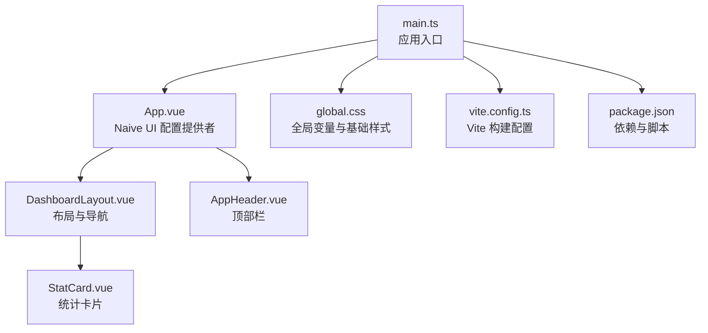
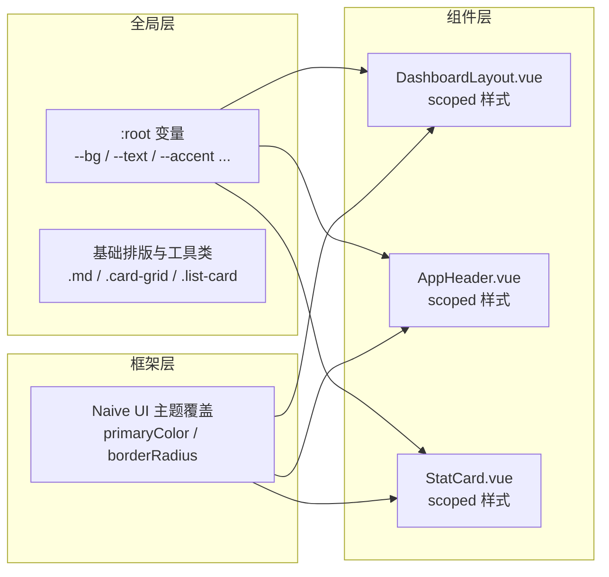
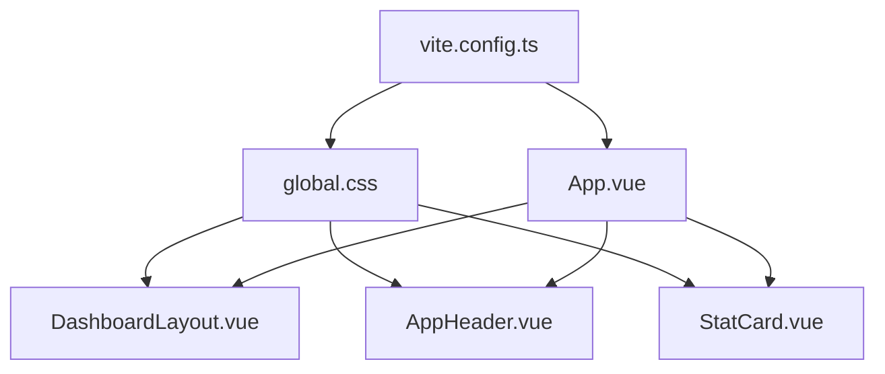

# 样式与主题

<cite>
**本文引用的文件**
- [frontend/src/styles/global.css](file://frontend/src/styles/global.css)
- [frontend/src/App.vue](file://frontend/src/App.vue)
- [frontend/src/main.ts](file://frontend/src/main.ts)
- [frontend/vite.config.ts](file://frontend/vite.config.ts)
- [frontend/package.json](file://frontend/package.json)
- [frontend/src/components/DashboardLayout.vue](file://frontend/src/components/DashboardLayout.vue)
- [frontend/src/components/AppHeader.vue](file://frontend/src/components/AppHeader.vue)
- [frontend/src/components/StatCard.vue](file://frontend/src/components/StatCard.vue)
</cite>

## 目录
1. [简介](#简介)
2. [项目结构](#项目结构)
3. [核心组件](#核心组件)
4. [架构总览](#架构总览)
5. [详细组件分析](#详细组件分析)
6. [依赖关系分析](#依赖关系分析)
7. [性能考量](#性能考量)
8. [故障排查指南](#故障排查指南)
9. [结论](#结论)
10. [附录](#附录)

## 简介
本文件面向样式与主题开发者，系统化说明前端样式架构、变量体系、主题定制、响应式策略、组件样式隔离与命名规范、构建与后处理流程、调试与性能优化、浏览器兼容与降级方案，以及重构与维护最佳实践。目标是帮助团队在统一的设计语言下高效协作，保证可维护性与一致性。

## 项目结构
前端采用 Vue 3 + Vite 工程化方案，样式以原生 CSS 为主，通过全局样式变量集中管理主题色板与基础排版；组件级样式使用 scoped 样式实现隔离；UI 框架 Naive UI 通过主题覆盖进行品牌化定制。

图表来源
- [frontend/src/main.ts:1-11](file://frontend/src/main.ts#L1-L11)
- [frontend/src/App.vue:1-30](file://frontend/src/App.vue#L1-L30)
- [frontend/src/styles/global.css:1-131](file://frontend/src/styles/global.css#L1-L131)
- [frontend/src/components/DashboardLayout.vue:1-249](file://frontend/src/components/DashboardLayout.vue#L1-L249)
- [frontend/src/components/AppHeader.vue:1-110](file://frontend/src/components/AppHeader.vue#L1-L110)
- [frontend/src/components/StatCard.vue:1-77](file://frontend/src/components/StatCard.vue#L1-L77)
- [frontend/vite.config.ts:1-32](file://frontend/vite.config.ts#L1-L32)
- [frontend/package.json:1-27](file://frontend/package.json#L1-L27)

章节来源
- [frontend/src/main.ts:1-11](file://frontend/src/main.ts#L1-L11)
- [frontend/vite.config.ts:1-32](file://frontend/vite.config.ts#L1-L32)
- [frontend/package.json:1-27](file://frontend/package.json#L1-L27)

## 核心组件
- 全局样式与主题变量：定义在根节点 CSS 变量中，涵盖背景、文字、强调色、危险/警告/信息色、阴影、圆角、字体栈等，作为全站点设计令牌。
- 基础排版与 Markdown 渲染：提供统一的标题、段落、列表、代码块、表格、图片等基础样式，确保内容可读性。
- 通用工具类：页面标题、工具栏、卡片网格、列表卡片、统计行等，提升页面搭建效率与一致性。
- 组件级样式隔离：各组件使用 scoped 样式，避免样式泄漏；对第三方组件（如 Naive UI）通过 :deep() 或选择器覆盖局部细节。
- 主题定制：通过 Naive UI 的 GlobalThemeOverrides 注入主色、悬停态、按下态、补充色与圆角，形成品牌化外观。

章节来源
- [frontend/src/styles/global.css:1-131](file://frontend/src/styles/global.css#L1-L131)
- [frontend/src/App.vue:16-24](file://frontend/src/App.vue#L16-L24)
- [frontend/src/components/StatCard.vue:35-77](file://frontend/src/components/StatCard.vue#L35-L77)
- [frontend/src/components/DashboardLayout.vue:192-249](file://frontend/src/components/DashboardLayout.vue#L192-L249)
- [frontend/src/components/AppHeader.vue:87-110](file://frontend/src/components/AppHeader.vue#L87-L110)

## 架构总览
样式架构遵循“全局变量 + 组件隔离 + 框架主题覆盖”的分层策略：
- 全局层：CSS 变量集中管理设计令牌，提供基础排版与通用工具类。
- 组件层：每个组件自带 scoped 样式，仅作用于自身 DOM，必要时通过 :deep() 微调第三方组件。
- 框架层：Naive UI 通过主题覆盖统一品牌化，避免散落的硬编码颜色。
- 构建层：Vite 负责开发服务器、代理与打包输出，无额外预处理器，保持轻量。

图表来源
- [frontend/src/styles/global.css:1-131](file://frontend/src/styles/global.css#L1-L131)
- [frontend/src/App.vue:16-24](file://frontend/src/App.vue#L16-L24)
- [frontend/src/components/DashboardLayout.vue:192-249](file://frontend/src/components/DashboardLayout.vue#L192-L249)
- [frontend/src/components/AppHeader.vue:87-110](file://frontend/src/components/AppHeader.vue#L87-L110)
- [frontend/src/components/StatCard.vue:35-77](file://frontend/src/components/StatCard.vue#L35-L77)

## 详细组件分析

### 全局样式与主题变量
- 设计令牌：通过 :root 定义背景、文字、强调色、状态色、阴影、圆角、字体栈等变量，便于统一替换与暗色模式扩展。
- 基础排版：body 字体、字号、行高、链接颜色；Markdown 渲染容器 .md 下的标题、段落、列表、代码块、引用、表格、图片等。
- 通用工具类：.page-title、.page-toolbar、.card-grid、.list-card、.stat-row、.stat-card 等，用于快速搭建页面结构与卡片。
- 响应式：针对移动端调整网格列数、间距与字号，保障小屏可用性。

章节来源
- [frontend/src/styles/global.css:1-131](file://frontend/src/styles/global.css#L1-L131)

### Naive UI 主题定制
- 通过 App.vue 中的 n-config-provider 注入 GlobalThemeOverrides，设置主色、悬停/按下态、补充色与圆角，使按钮、表单、菜单等组件呈现一致的品牌风格。
- 建议将主题变量与全局 CSS 变量对齐，减少重复定义。

章节来源
- [frontend/src/App.vue:1-30](file://frontend/src/App.vue#L1-L30)

### 布局与导航（DashboardLayout）
- 桌面端侧边栏 + 主内容区；移动端抽屉式导航，基于 matchMedia 动态切换。
- 头部区域包含面包屑/标题与用户操作下拉；内容区最大宽度限制与居中。
- 样式使用全局变量控制边框、背景、阴影与圆角，保持视觉一致性。

章节来源
- [frontend/src/components/DashboardLayout.vue:1-249](file://frontend/src/components/DashboardLayout.vue#L1-L249)

### 顶部栏（AppHeader）
- 品牌标识与站点名称；根据登录状态展示控制台与管理入口；用户下拉包含退出登录。
- 使用 backdrop-filter 与 sticky 定位营造悬浮感；图标与按钮尺寸统一。

章节来源
- [frontend/src/components/AppHeader.vue:1-110](file://frontend/src/components/AppHeader.vue#L1-L110)

### 统计卡片（StatCard）
- 支持标签、数值、副标题、徽章与点击态；入场动画与 hover 动效增强交互反馈。
- 尊重系统“减少动态效果”偏好，自动禁用不必要动画。

章节来源
- [frontend/src/components/StatCard.vue:1-77](file://frontend/src/components/StatCard.vue#L1-L77)

### 响应式设计与移动端适配
- 断点策略：常见断点包括 640px、768px、840px、900px、1080px，按内容密度与功能复杂度灵活选择。
- 网格布局：使用 auto-fill/auto-fit 与 minmax 实现自适应列数；窄屏退化为单列。
- 交互优化：移动端隐藏次要信息、调整内边距与字号，提升触控体验。

章节来源
- [frontend/src/styles/global.css:68-77](file://frontend/src/styles/global.css#L68-L77)
- [frontend/src/components/DashboardLayout.vue:80-89](file://frontend/src/components/DashboardLayout.vue#L80-L89)
- [frontend/src/components/DashboardLayout.vue:237-239](file://frontend/src/components/DashboardLayout.vue#L237-L239)

### 组件样式隔离与命名规范
- 隔离：所有组件样式使用 scoped，避免污染全局；对第三方组件使用 :deep() 精准覆盖。
- 命名：采用语义化类名（如 page-title、list-card、stat-card），结合业务前缀（如 qz-）区分自定义扩展，避免与框架冲突。
- 层级：优先复用全局工具类，再在组件内定义局部样式，降低重复与耦合。

章节来源
- [frontend/src/components/StatCard.vue:35-77](file://frontend/src/components/StatCard.vue#L35-L77)
- [frontend/src/components/DashboardLayout.vue:192-249](file://frontend/src/components/DashboardLayout.vue#L192-L249)
- [frontend/src/components/AppHeader.vue:87-110](file://frontend/src/components/AppHeader.vue#L87-L110)

### CSS 预处理器与后处理器
- 当前未引入 Sass/Less 等预处理器，直接编写原生 CSS，借助 CSS 变量与模块化组织维持可维护性。
- 构建由 Vite 完成，默认支持 CSS 模块、PostCSS（可按需启用）、压缩与按需加载。

章节来源
- [frontend/vite.config.ts:1-32](file://frontend/vite.config.ts#L1-L32)
- [frontend/package.json:1-27](file://frontend/package.json#L1-L27)

## 依赖关系分析
样式相关依赖与职责：
- global.css：全局变量与基础样式，被所有组件共享。
- App.vue：注入 Naive UI 主题覆盖，影响全局组件外观。
- 各组件：scoped 样式仅作用于自身 DOM，必要时通过 :deep() 覆盖第三方组件样式。
- Vite：负责开发服务器、代理与构建输出，不改变样式语法但影响打包产物。

图表来源
- [frontend/src/styles/global.css:1-131](file://frontend/src/styles/global.css#L1-L131)
- [frontend/src/App.vue:1-30](file://frontend/src/App.vue#L1-L30)
- [frontend/src/components/DashboardLayout.vue:1-249](file://frontend/src/components/DashboardLayout.vue#L1-L249)
- [frontend/src/components/AppHeader.vue:1-110](file://frontend/src/components/AppHeader.vue#L1-L110)
- [frontend/src/components/StatCard.vue:1-77](file://frontend/src/components/StatCard.vue#L1-L77)
- [frontend/vite.config.ts:1-32](file://frontend/vite.config.ts#L1-L32)

章节来源
- [frontend/src/styles/global.css:1-131](file://frontend/src/styles/global.css#L1-L131)
- [frontend/src/App.vue:1-30](file://frontend/src/App.vue#L1-L30)
- [frontend/vite.config.ts:1-32](file://frontend/vite.config.ts#L1-L32)

## 性能考量
- 减少重排重绘：避免频繁修改布局属性；使用 transform 与 opacity 做动画以提升合成层性能。
- 合理使用媒体查询：仅在必要时切换布局，避免过多断点导致样式膨胀。
- 控制选择器权重：优先使用语义化类名，避免深层嵌套与复杂选择器。
- 利用 CSS 变量：集中管理颜色与尺寸，减少重复计算与样式体积。
- 构建优化：Vite 生产构建会压缩与去重 CSS；按需引入 UI 组件可减少无用样式。

[本节为通用指导，无需特定文件来源]

## 故障排查指南
- 样式不生效
  - 检查是否被更高权重的选择器覆盖；确认 scoped 作用域是否正确。
  - 对第三方组件覆盖时，确认选择器优先级与注入顺序。
- 主题不一致
  - 核对 App.vue 中的主题覆盖是否与全局变量对齐；避免硬编码颜色。
- 移动端显示异常
  - 检查媒体查询断点与布局容器宽度；确认 flex/grid 的换行与溢出处理。
- 动画卡顿
  - 避免在高频动画中使用复杂滤镜或大阴影；启用 prefers-reduced-motion 降级。

章节来源
- [frontend/src/components/StatCard.vue:71-75](file://frontend/src/components/StatCard.vue#L71-L75)
- [frontend/src/components/DashboardLayout.vue:237-249](file://frontend/src/components/DashboardLayout.vue#L237-L249)

## 结论
本项目采用“全局变量 + 组件隔离 + 框架主题覆盖”的清晰分层，配合 Vite 构建与 Naive UI 主题定制，实现了可维护、可扩展且一致的样式体系。通过响应式策略与无障碍优化，兼顾多端体验与可访问性。建议在后续迭代中继续沉淀通用工具类、完善主题变量字典，并逐步引入自动化校验与可视化测试，进一步提升质量与效率。

[本节为总结性内容，无需特定文件来源]

## 附录

### 样式调试工具与技巧
- 浏览器开发者工具：使用元素面板查看最终计算样式与继承链；使用性能面板分析重排重绘。
- 主题调试：在 App.vue 中临时调整主题覆盖值，快速验证视觉效果。
- 响应式调试：使用设备模拟器与视口缩放，验证不同断点下的布局与交互。

[本节为通用指导，无需特定文件来源]

### 浏览器兼容性与降级方案
- 现代特性：backdrop-filter、CSS Grid、Flexbox 等广泛支持；如需更老浏览器兼容，可提供 polyfill 或降级样式。
- 动效降级：遵循 prefers-reduced-motion，自动禁用不必要的动画与过渡。
- 字体回退：字体栈中包含系统字体与中文常用字体，确保跨平台可读性。

章节来源
- [frontend/src/styles/global.css:20-32](file://frontend/src/styles/global.css#L20-L32)
- [frontend/src/components/StatCard.vue:71-75](file://frontend/src/components/StatCard.vue#L71-L75)

### 样式重构与维护最佳实践
- 变量先行：新增颜色或尺寸时，优先加入全局变量，避免散落硬编码。
- 组件边界：严格使用 scoped 样式，避免全局污染；对第三方组件使用最小必要覆盖。
- 命名约定：语义化类名 + 业务前缀，保持一致性与可检索性。
- 文档化：在样式文件中添加注释，说明用途与依赖关系；建立样式字典与设计令牌表。
- 渐进增强：先保证基础可用，再叠加高级特性与动效，确保降级路径稳定。

[本节为通用指导，无需特定文件来源]
