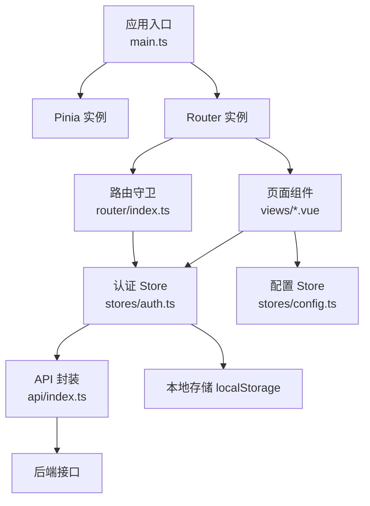
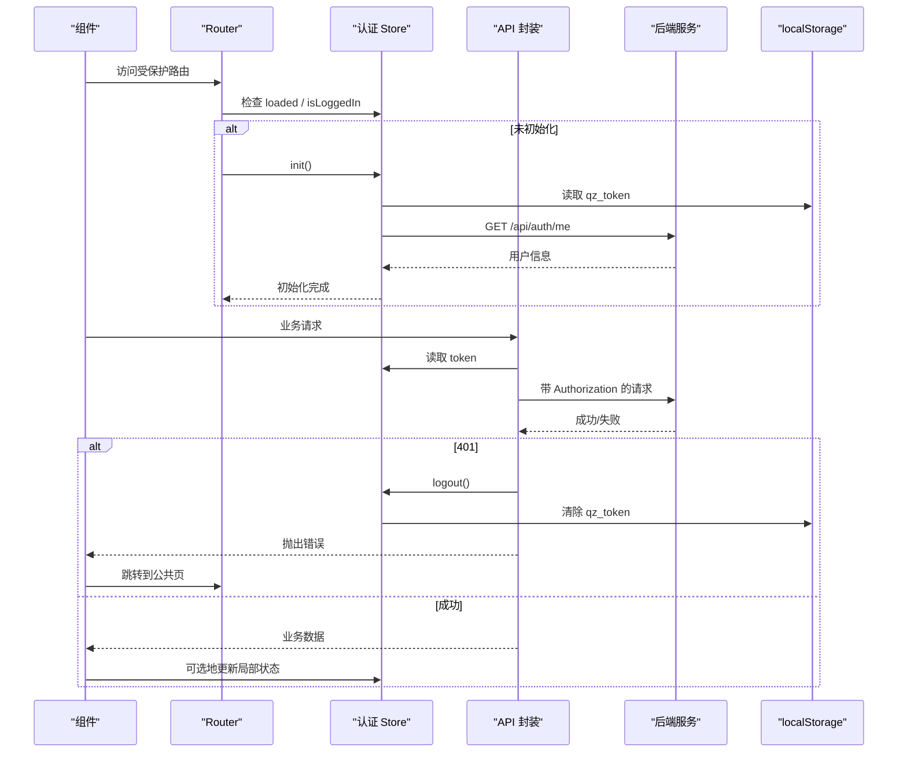
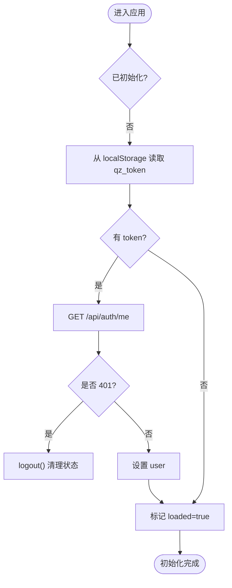
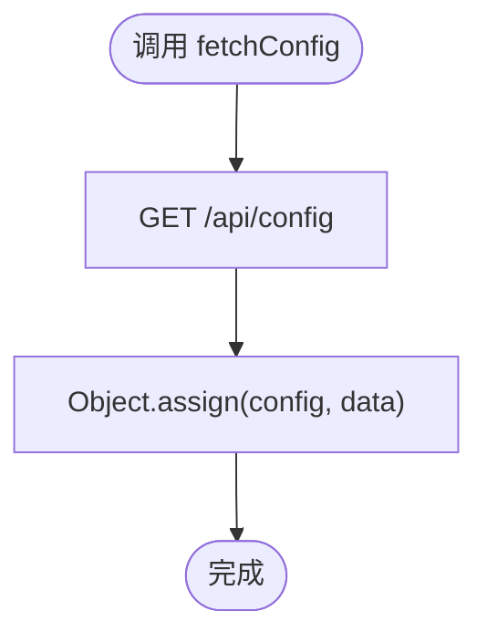
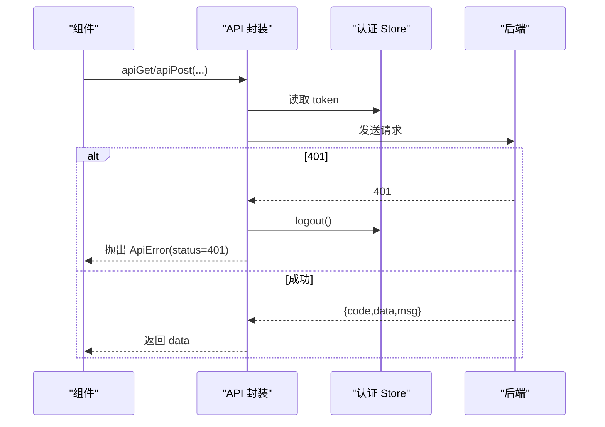
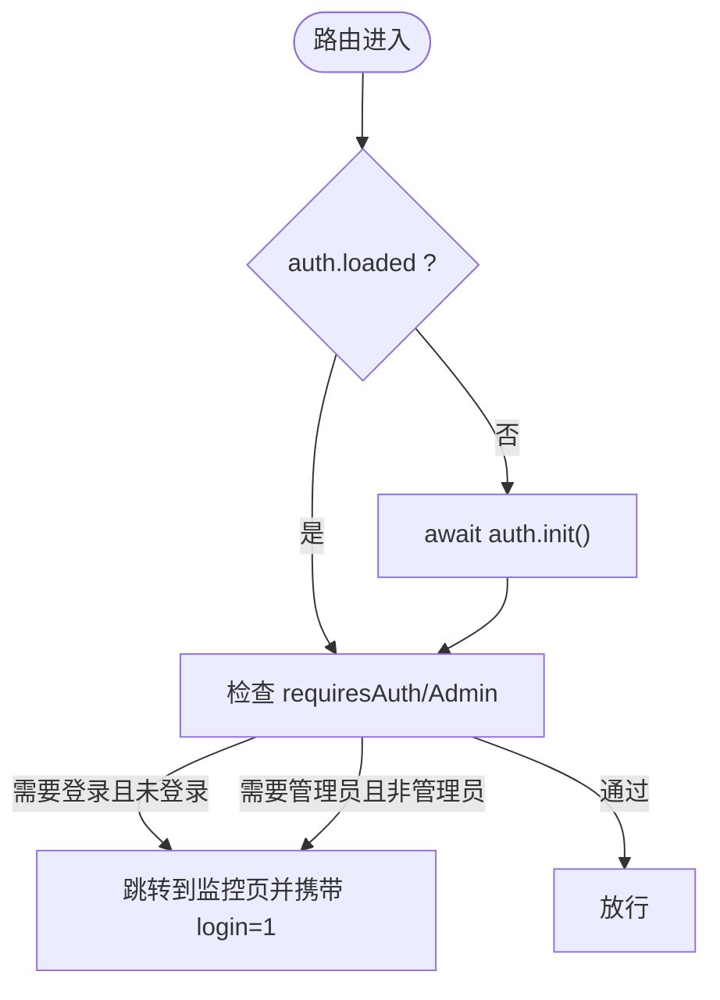
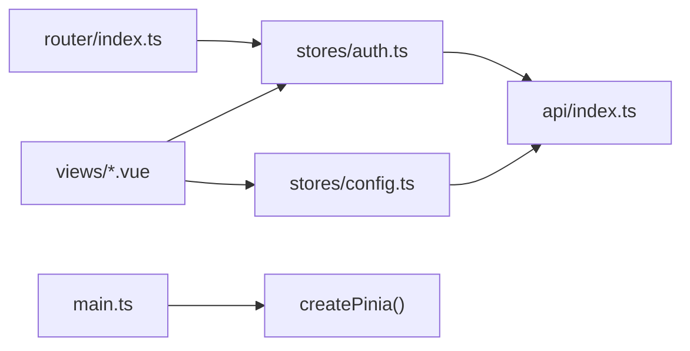

# 状态管理

<cite>
**本文引用的文件**
- [frontend/src/stores/auth.ts](file://frontend/src/stores/auth.ts)
- [frontend/src/stores/config.ts](file://frontend/src/stores/config.ts)
- [frontend/src/api/index.ts](file://frontend/src/api/index.ts)
- [frontend/src/router/index.ts](file://frontend/src/router/index.ts)
- [frontend/src/main.ts](file://frontend/src/main.ts)
- [frontend/package.json](file://frontend/package.json)
- [frontend/src/components/LoginDialog.vue](file://frontend/src/components/LoginDialog.vue)
- [frontend/src/views/UserDashboard.vue](file://frontend/src/views/UserDashboard.vue)
</cite>

## 目录
1. [简介](#简介)
2. [项目结构](#项目结构)
3. [核心组件](#核心组件)
4. [架构总览](#架构总览)
5. [详细组件分析](#详细组件分析)
6. [依赖关系分析](#依赖关系分析)
7. [性能考量](#性能考量)
8. [故障排查指南](#故障排查指南)
9. [结论](#结论)
10. [附录](#附录)

## 简介
本文件面向前端开发者，系统化梳理本项目基于 Pinia 的状态管理方案。内容涵盖：
- 全局状态的组织与模块划分（认证、站点配置）
- 用户认证状态的持久化与同步机制
- 配置状态的管理与更新策略
- 响应式更新与数据流管理
- 调试工具与开发技巧
- 持久化与缓存策略
- 最佳实践与性能优化建议

## 项目结构
前端采用 Vue 3 + TypeScript + Vite，使用 Pinia 作为状态管理库，Vue Router 进行路由守卫与权限控制，统一的 API 封装负责请求拦截与错误处理。

图表来源
- [frontend/src/main.ts:1-11](file://frontend/src/main.ts#L1-L11)
- [frontend/src/router/index.ts:1-66](file://frontend/src/router/index.ts#L1-L66)
- [frontend/src/stores/auth.ts:1-75](file://frontend/src/stores/auth.ts#L1-L75)
- [frontend/src/api/index.ts:1-124](file://frontend/src/api/index.ts#L1-L124)
- [frontend/src/stores/config.ts:1-37](file://frontend/src/stores/config.ts#L1-L37)

章节来源
- [frontend/src/main.ts:1-11](file://frontend/src/main.ts#L1-L11)
- [frontend/package.json:1-27](file://frontend/package.json#L1-L27)

## 核心组件
- 认证状态 store（auth）
  - 职责：维护登录态、用户信息、加载状态；提供登录/注册/登出/初始化等方法；计算派生状态（是否登录、是否管理员）。
  - 持久化：token 写入/读取 localStorage；首次启动时从本地恢复并拉取当前用户信息。
  - 防重入：init 通过 loaded 标志与 initPromise 保证只执行一次。
- 配置状态 store（config）
  - 职责：维护站点配置（站点名、注册模式、是否需要邮箱验证、积分汇率、首页模式等），提供获取配置的异步方法。
  - 更新策略：通过 apiGet 拉取后合并到现有配置对象，避免替换导致引用丢失。
- 统一 API 封装
  - 职责：自动注入 Authorization 头；统一错误处理；在 401 时触发登出并跳转公共页；对返回体做信封解包或原始返回。
  - 与认证联动：通过 useAuthStore 动态读取 token，并在 401 时调用 logout。
- 路由守卫
  - 职责：在进入需要认证的页面之前等待 auth 初始化完成；根据 requiresAuth/requiresAdmin 元信息进行鉴权跳转。

章节来源
- [frontend/src/stores/auth.ts:1-75](file://frontend/src/stores/auth.ts#L1-L75)
- [frontend/src/stores/config.ts:1-37](file://frontend/src/stores/config.ts#L1-L37)
- [frontend/src/api/index.ts:1-124](file://frontend/src/api/index.ts#L1-L124)
- [frontend/src/router/index.ts:1-66](file://frontend/src/router/index.ts#L1-L66)

## 架构总览
下图展示了从组件发起请求到状态更新、再到视图响应的完整数据流。

图表来源
- [frontend/src/router/index.ts:46-63](file://frontend/src/router/index.ts#L46-L63)
- [frontend/src/stores/auth.ts:16-73](file://frontend/src/stores/auth.ts#L16-L73)
- [frontend/src/api/index.ts:9-47](file://frontend/src/api/index.ts#L9-L47)

## 详细组件分析

### 认证状态（auth）
- 状态字段
  - token：字符串，来自 localStorage 的 qz_token
  - user：用户对象，包含角色、权限、积分等
  - loaded：布尔，标识初始化是否完成
  - 派生状态：isLoggedIn、isAdmin
- 关键方法
  - login/register：调用后端登录/注册接口，成功后设置 token 与 user，并持久化 token
  - fetchMe：当存在 token 时拉取当前用户信息；若 401 则触发登出
  - logout：调用后端登出接口（忽略失败），清空 token/user，移除本地 token
  - init：幂等初始化，防止重复拉取用户信息
- 数据流与副作用
  - 初始化阶段：从 localStorage 恢复 token，必要时拉取用户信息
  - 网络异常：401 时主动登出并清理本地状态
  - 权限判断：isLoggedIn/isAdmin 用于路由守卫与界面展示

图表来源
- [frontend/src/stores/auth.ts:16-73](file://frontend/src/stores/auth.ts#L16-L73)

章节来源
- [frontend/src/stores/auth.ts:1-75](file://frontend/src/stores/auth.ts#L1-L75)

### 配置状态（config）
- 状态字段
  - config：站点配置对象，包含站点名称、描述、注册模式、是否开放注册、邮箱验证要求、积分汇率、首页模式与地址等
- 关键方法
  - fetchConfig：调用 /api/config 获取配置，使用 Object.assign 合并到现有对象，保持响应式引用稳定
- 更新策略
  - 按需拉取，适合在应用启动或设置页刷新
  - 合并更新避免替换整个对象导致的订阅失效

图表来源
- [frontend/src/stores/config.ts:16-35](file://frontend/src/stores/config.ts#L16-L35)

章节来源
- [frontend/src/stores/config.ts:1-37](file://frontend/src/stores/config.ts#L1-L37)

### API 封装与错误处理
- 自动注入 Authorization 头：从 useAuthStore 读取 token
- 统一错误处理：非 2xx 时构造 ApiError 并抛出；401 时调用 logout 并尝试跳转到公共页
- 响应体解包：默认返回 {data} 中的 data；支持 raw 模式直接返回解析后的 body
- 下载能力：二进制下载通过 Blob + URL.createObjectURL 实现，兼容带认证头的场景

图表来源
- [frontend/src/api/index.ts:9-47](file://frontend/src/api/index.ts#L9-L47)

章节来源
- [frontend/src/api/index.ts:1-124](file://frontend/src/api/index.ts#L1-L124)

### 路由守卫与权限控制
- 前置守卫
  - 等待 auth 初始化完成（loaded）
  - 根据 meta.requiresAuth/requiresAdmin 决定是否允许进入
  - 未登录时跳转到监控页并附带登录提示参数
- 与状态联动
  - 依赖 auth.isLoggedIn/isAdmin 进行决策
  - 结合 API 401 处理，避免死循环

图表来源
- [frontend/src/router/index.ts:46-63](file://frontend/src/router/index.ts#L46-L63)
- [frontend/src/stores/auth.ts:16-73](file://frontend/src/stores/auth.ts#L16-L73)

章节来源
- [frontend/src/router/index.ts:1-66](file://frontend/src/router/index.ts#L1-L66)

### 组件使用示例
- 登录弹窗
  - 使用 useAuthStore 调用 login/register，成功后关闭弹窗并导航到控制台
  - 使用 useConfigStore 控制注册表单显示与校验规则（如邮箱必填）
- 控制台页面
  - 读取 auth.user 展示问候语与基本信息
  - 通过 API 拉取仪表盘数据，渲染用量、套餐、趋势等

章节来源
- [frontend/src/components/LoginDialog.vue:53-141](file://frontend/src/components/LoginDialog.vue#L53-L141)
- [frontend/src/views/UserDashboard.vue:145-303](file://frontend/src/views/UserDashboard.vue#L145-L303)

## 依赖关系分析
- 模块耦合
  - API 封装依赖认证 store 以注入 token，形成“请求层 -> 状态层”的双向协作
  - 路由守卫依赖认证 store 的初始化与派生状态
  - 组件通过组合式函数使用 store，低耦合、高内聚
- 外部依赖
  - Pinia：状态容器与响应式驱动
  - Vue Router：路由与守卫
  - Naive UI：UI 组件（非状态相关）

图表来源
- [frontend/src/stores/auth.ts:1-75](file://frontend/src/stores/auth.ts#L1-L75)
- [frontend/src/stores/config.ts:1-37](file://frontend/src/stores/config.ts#L1-L37)
- [frontend/src/api/index.ts:1-124](file://frontend/src/api/index.ts#L1-L124)
- [frontend/src/router/index.ts:1-66](file://frontend/src/router/index.ts#L1-L66)
- [frontend/src/main.ts:1-11](file://frontend/src/main.ts#L1-L11)

章节来源
- [frontend/src/main.ts:1-11](file://frontend/src/main.ts#L1-L11)
- [frontend/package.json:11-19](file://frontend/package.json#L11-L19)

## 性能考量
- 初始化防抖与幂等
  - auth.init 使用 loaded 标志与 initPromise 避免重复拉取用户信息，减少不必要网络请求
- 响应式更新最小化
  - 配置更新采用 Object.assign 合并，避免替换整个对象导致大量订阅重建
- 路由守卫延迟初始化
  - 仅在进入受保护路由时才等待 auth 初始化，缩短首屏阻塞时间
- 网络层优化
  - 统一错误处理减少重复逻辑；401 集中处理避免多处分支
- 建议
  - 对高频数据可考虑在 store 中增加本地缓存与过期策略
  - 大列表数据分页加载，避免一次性渲染过多节点
  - 对复杂计算使用 computed 缓存结果

[本节为通用性能建议，不直接分析具体文件]

## 故障排查指南
- 登录后仍被重定向到登录页
  - 检查 auth.init 是否正确执行，确认 localStorage 中是否存在 qz_token
  - 检查 /api/auth/me 是否返回 401，必要时查看 API 封装的错误处理路径
- 401 导致页面跳转死循环
  - 确认 API 封装在 401 时仅对非公共路由进行跳转，避免公共页重复跳转
- 配置未生效
  - 确认是否调用了 fetchConfig，以及后端 /api/config 是否正常返回
  - 检查组件是否正确读取 config.store.config 字段
- 路由守卫无效
  - 确认路由 meta 是否正确设置 requiresAuth/requiresAdmin
  - 确保在 beforeEach 中 await auth.init() 后再做判断

章节来源
- [frontend/src/stores/auth.ts:42-73](file://frontend/src/stores/auth.ts#L42-L73)
- [frontend/src/api/index.ts:28-47](file://frontend/src/api/index.ts#L28-L47)
- [frontend/src/router/index.ts:46-63](file://frontend/src/router/index.ts#L46-L63)

## 结论
本项目采用 Pinia 构建轻量、清晰的前端状态管理方案：
- 将认证与配置拆分为独立 store，职责单一、易于扩展
- 通过 API 封装集中处理鉴权与错误，降低组件复杂度
- 利用路由守卫与派生状态实现细粒度权限控制
- 借助 localStorage 与幂等初始化实现认证态持久化与稳定体验
整体设计简洁高效，具备良好的可维护性与可扩展性。

[本节为总结性内容，不直接分析具体文件]

## 附录

### 状态调试工具与开发技巧
- 浏览器 DevTools
  - 安装 Pinia Devtools 插件，可在“状态”面板查看各 store 的实时值与方法调用
- 断点与日志
  - 在 store 的方法（如 login/fetchMe/fetchConfig）与 API 封装的 request 处打断点，观察数据流转
- 模拟与测试
  - 使用 Mock 后端或拦截器模拟 401/成功等场景，验证路由跳转与错误处理
- 常用技巧
  - 在组件中使用 computed 派生状态，减少重复计算
  - 对耗时操作使用 onMounted/onUnmounted 管理生命周期
  - 对频繁更新的图表数据，使用节流/防抖或增量更新

[本节为通用开发建议，不直接分析具体文件]

### 状态持久化与缓存策略
- 持久化
  - 认证 token 使用 localStorage 持久化，应用启动时恢复
  - 如需更复杂的持久化（如用户偏好、主题），可引入持久化中间件或自行封装
- 缓存
  - 配置数据可按需拉取，建议在设置页或应用启动时刷新
  - 对热点数据可增加内存级缓存与过期时间，减少重复请求
- 一致性
  - 在登出时清理本地持久化数据，避免脏数据残留
  - 在网络异常或 401 时及时清理状态，保证前后端一致

[本节为通用策略建议，不直接分析具体文件]

### 最佳实践清单
- 将状态按领域拆分 store，避免单一大 store
- 使用 ref/computed 表达状态与派生状态，保持响应式
- 在 API 层统一处理鉴权与错误，组件专注业务
- 路由守卫集中处理权限，配合 store 的派生状态
- 对初始化过程做幂等与防重入处理
- 谨慎修改持久化数据，确保与后端状态一致
- 对大数据集进行分页与懒加载
- 使用 TypeScript 类型约束，提升可维护性

[本节为通用最佳实践，不直接分析具体文件]
