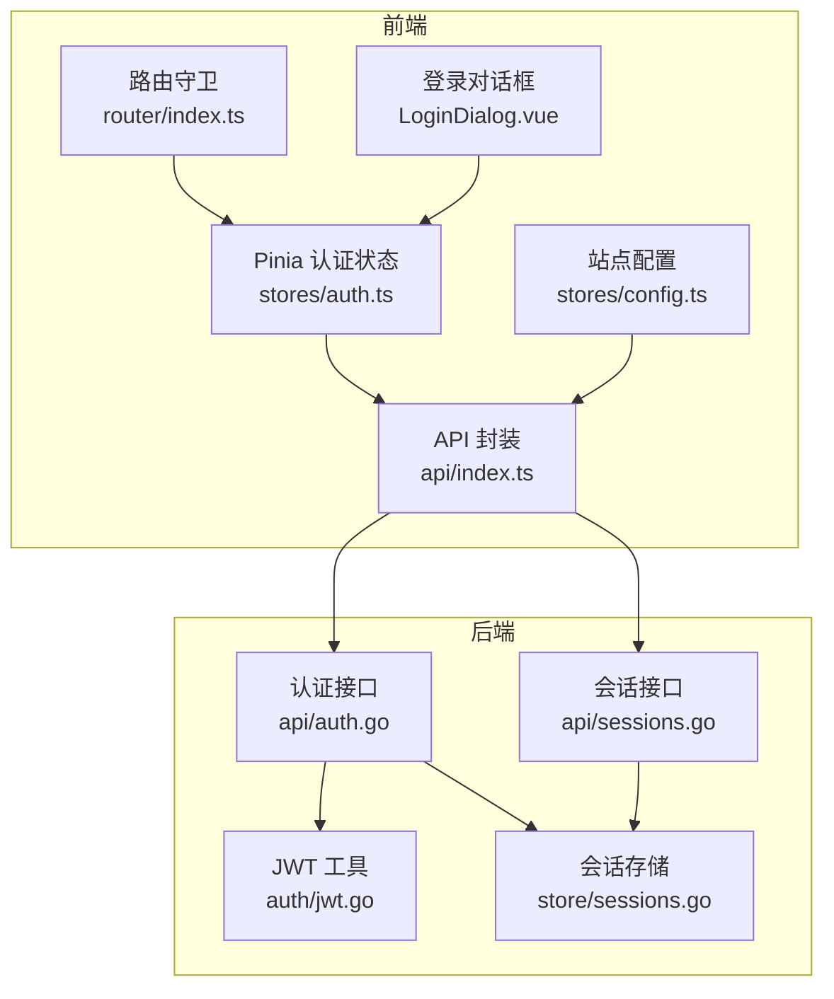
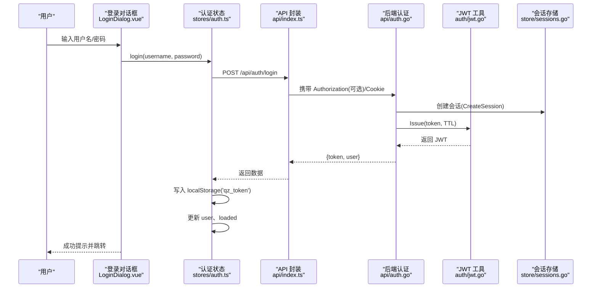
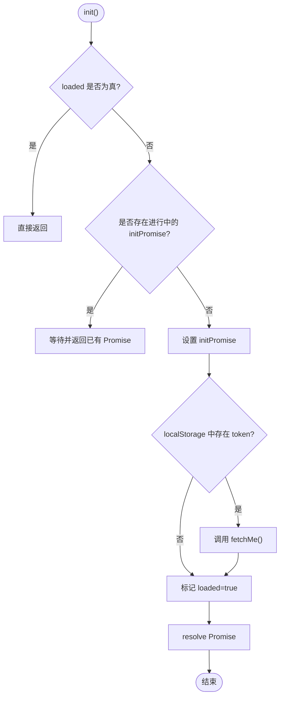
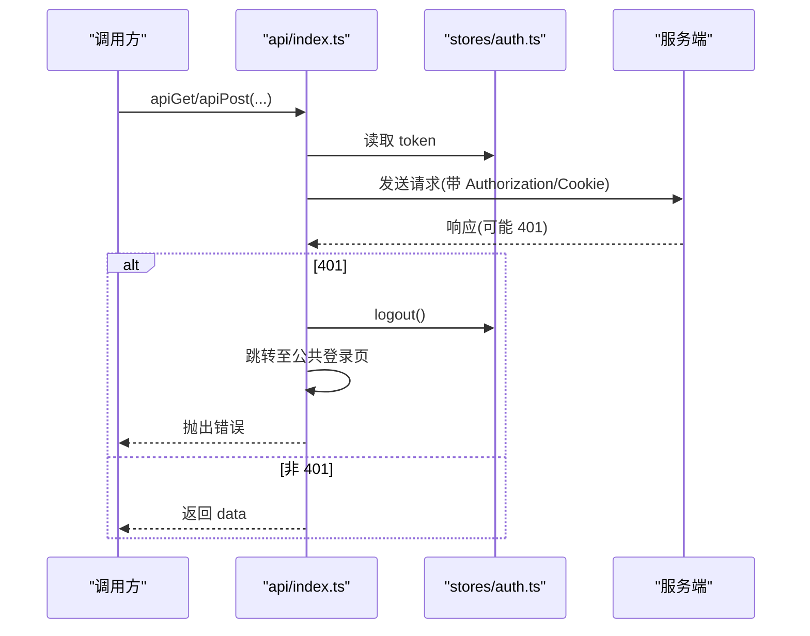
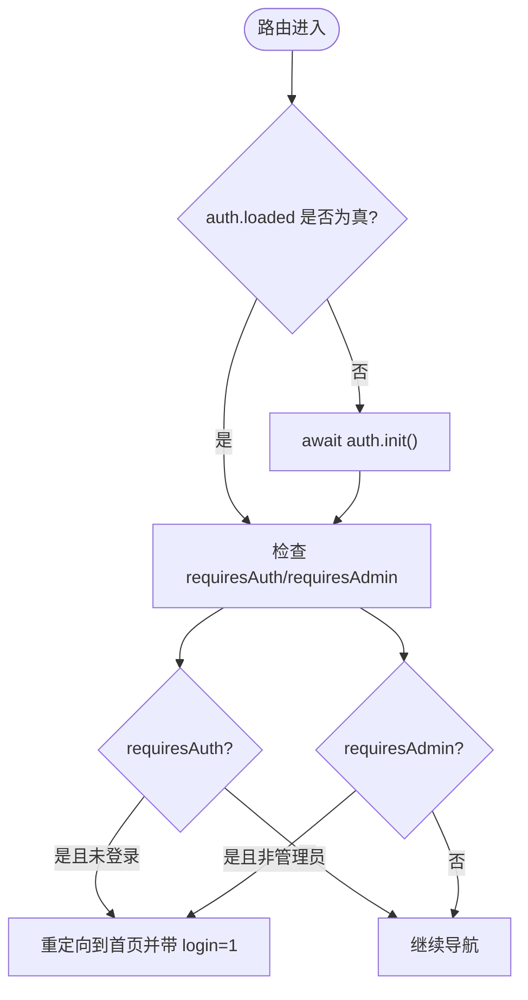
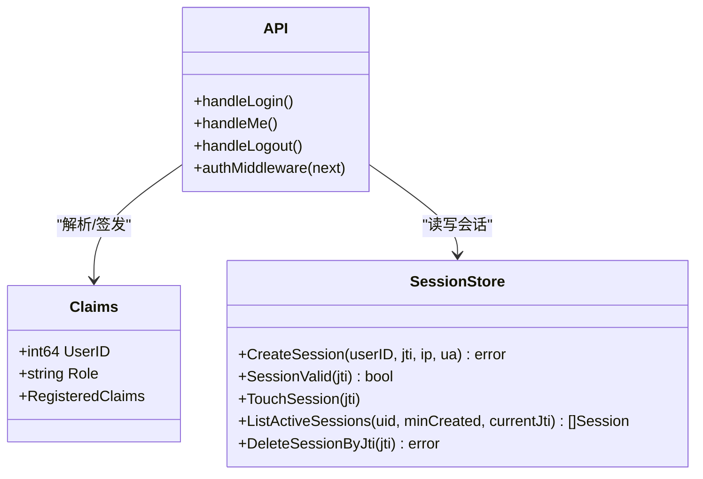
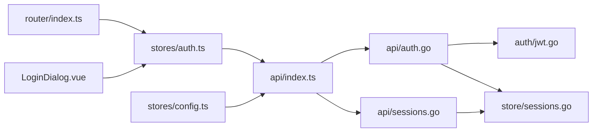

# 认证状态管理

<cite>
**本文引用的文件**
- [frontend/src/stores/auth.ts](file://frontend/src/stores/auth.ts)
- [frontend/src/api/index.ts](file://frontend/src/api/index.ts)
- [frontend/src/router/index.ts](file://frontend/src/router/index.ts)
- [frontend/src/components/LoginDialog.vue](file://frontend/src/components/LoginDialog.vue)
- [internal/api/auth.go](file://internal/api/auth.go)
- [internal/api/sessions.go](file://internal/api/sessions.go)
- [internal/auth/jwt.go](file://internal/auth/jwt.go)
- [internal/store/sessions.go](file://internal/store/sessions.go)
- [frontend/src/stores/config.ts](file://frontend/src/stores/config.ts)
</cite>

## 目录
1. [简介](#简介)
2. [项目结构](#项目结构)
3. [核心组件](#核心组件)
4. [架构总览](#架构总览)
5. [详细组件分析](#详细组件分析)
6. [依赖关系分析](#依赖关系分析)
7. [性能考量](#性能考量)
8. [故障排查指南](#故障排查指南)
9. [结论](#结论)
10. [附录](#附录)

## 简介
本文件面向认证模块开发者，系统化梳理基于 Pinia 的认证状态管理与前后端协作机制。内容涵盖：
- 用户登录、注册、登出等核心流程
- JWT 令牌的签发、校验与失效控制（含会话撤销）
- 用户信息的获取、缓存与同步策略
- 防重复初始化设计
- 认证状态的持久化方案
- 错误处理机制与调试技巧
- 最佳实践建议

## 项目结构
前端采用 Vue + Pinia 的状态管理，通过统一的 API 封装进行网络请求；后端提供认证相关接口与会话管理，使用 JWT 作为令牌载体，并通过数据库维护会话有效性。路由守卫在访问受保护页面时触发鉴权检查。

图表来源
- [frontend/src/stores/auth.ts:16-74](file://frontend/src/stores/auth.ts#L16-L74)
- [frontend/src/api/index.ts:9-48](file://frontend/src/api/index.ts#L9-L48)
- [frontend/src/router/index.ts:46-63](file://frontend/src/router/index.ts#L46-L63)
- [frontend/src/components/LoginDialog.vue:97-136](file://frontend/src/components/LoginDialog.vue#L97-L136)
- [frontend/src/stores/config.ts:16-35](file://frontend/src/stores/config.ts#L16-L35)
- [internal/api/auth.go:112-177](file://internal/api/auth.go#L112-L177)
- [internal/api/sessions.go:13-42](file://internal/api/sessions.go#L13-L42)
- [internal/auth/jwt.go:16-41](file://internal/auth/jwt.go#L16-L41)
- [internal/store/sessions.go:15-36](file://internal/store/sessions.go#L15-L36)

章节来源
- [frontend/src/stores/auth.ts:16-74](file://frontend/src/stores/auth.ts#L16-L74)
- [frontend/src/api/index.ts:9-48](file://frontend/src/api/index.ts#L9-L48)
- [frontend/src/router/index.ts:46-63](file://frontend/src/router/index.ts#L46-L63)
- [internal/api/auth.go:112-177](file://internal/api/auth.go#L112-L177)
- [internal/store/sessions.go:15-36](file://internal/store/sessions.go#L15-L36)

## 核心组件
- 认证状态（Pinia Store）
  - 负责 token、用户信息、加载状态的管理
  - 提供登录、注册、获取当前用户、登出、初始化等方法
  - 实现防重复初始化逻辑
- API 封装
  - 统一请求头注入 Authorization
  - 统一处理 401 并引导重新登录
  - 提供 GET/POST/PUT/DELETE 等便捷方法
- 路由守卫
  - 在进入需要认证的页面前等待认证初始化完成
  - 根据 requiresAuth/requiresAdmin 元信息进行跳转或放行
- 登录对话框
  - 提供登录、注册、找回密码入口
  - 调用认证状态方法并反馈结果
- 后端认证与会话
  - 签发 JWT、解析验证、设置 Cookie
  - 维护会话记录，支持单设备去重、过期清理、远程注销
  - 提供 /api/auth/login、/api/auth/register、/api/auth/me、/api/auth/logout 等接口

章节来源
- [frontend/src/stores/auth.ts:16-74](file://frontend/src/stores/auth.ts#L16-L74)
- [frontend/src/api/index.ts:9-48](file://frontend/src/api/index.ts#L9-L48)
- [frontend/src/router/index.ts:46-63](file://frontend/src/router/index.ts#L46-L63)
- [frontend/src/components/LoginDialog.vue:97-136](file://frontend/src/components/LoginDialog.vue#L97-L136)
- [internal/api/auth.go:112-177](file://internal/api/auth.go#L112-L177)
- [internal/api/sessions.go:13-42](file://internal/api/sessions.go#L13-L42)
- [internal/store/sessions.go:15-36](file://internal/store/sessions.go#L15-L36)

## 架构总览
下图展示了从浏览器发起认证请求到后端签发/校验 JWT 的完整链路，以及前端如何基于状态驱动 UI 和路由。

图表来源
- [frontend/src/components/LoginDialog.vue:97-109](file://frontend/src/components/LoginDialog.vue#L97-L109)
- [frontend/src/stores/auth.ts:25-30](file://frontend/src/stores/auth.ts#L25-L30)
- [frontend/src/api/index.ts:9-48](file://frontend/src/api/index.ts#L9-L48)
- [internal/api/auth.go:112-149](file://internal/api/auth.go#L112-L149)
- [internal/auth/jwt.go:16-28](file://internal/auth/jwt.go#L16-L28)
- [internal/store/sessions.go:15-23](file://internal/store/sessions.go#L15-L23)

## 详细组件分析

### 认证状态（Pinia Store）
- 状态字段
  - token：从 localStorage 恢复，用于后续请求携带
  - user：当前用户信息对象
  - loaded：标记是否已完成首次初始化
- 计算属性
  - isLoggedIn：token 与 user 均存在时为真
  - isAdmin：user.is_admin 为真时为管理员
- 关键方法
  - login：调用后端登录接口，成功后持久化 token 并更新 user
  - register：调用后端注册接口，成功后持久化 token 并更新 user
  - fetchMe：当存在 token 时拉取当前用户信息，401 时触发登出
  - logout：调用后端登出接口，清空本地状态与 token
  - init：防重复初始化，若已加载则直接返回；否则执行一次 token 恢复与 fetchMe，并标记 loaded

图表来源
- [frontend/src/stores/auth.ts:60-71](file://frontend/src/stores/auth.ts#L60-L71)

章节来源
- [frontend/src/stores/auth.ts:16-74](file://frontend/src/stores/auth.ts#L16-L74)

### API 封装与全局错误处理
- 自动注入 Authorization 头
- 统一处理响应体信封，提取 data
- 401 时触发登出并跳转到公共登录页（避免死循环）
- 下载接口特殊处理二进制流与文件名

图表来源
- [frontend/src/api/index.ts:9-48](file://frontend/src/api/index.ts#L9-L48)
- [frontend/src/stores/auth.ts:51-58](file://frontend/src/stores/auth.ts#L51-L58)

章节来源
- [frontend/src/api/index.ts:9-48](file://frontend/src/api/index.ts#L9-L48)

### 路由守卫与权限控制
- 进入受保护路由前等待认证初始化完成
- 根据 meta.requiresAuth/requiresAdmin 判断是否需要登录或管理员权限
- 未满足条件时重定向到首页并附带登录提示参数

图表来源
- [frontend/src/router/index.ts:46-63](file://frontend/src/router/index.ts#L46-L63)
- [frontend/src/stores/auth.ts:22-24](file://frontend/src/stores/auth.ts#L22-L24)

章节来源
- [frontend/src/router/index.ts:46-63](file://frontend/src/router/index.ts#L46-L63)

### 登录对话框与用户交互
- 表单校验：用户名、密码、邮箱格式、邀请码（按配置显示）
- 登录/注册成功后提示并跳转
- 失败时展示错误消息
- 支持“找回密码”入口

章节来源
- [frontend/src/components/LoginDialog.vue:72-136](file://frontend/src/components/LoginDialog.vue#L72-L136)

### 后端认证与会话管理
- 登录流程
  - 校验用户名与密码
  - 创建会话（合并同设备的重复登录）
  - 签发 JWT（包含用户ID、角色、jti、TTL）
  - 设置 Cookie，返回 token 与用户视图
- 鉴权中间件
  - 从 Authorization 或 Cookie 中获取 token
  - 解析 JWT，校验签名与有效期
  - 校验会话仍存在（支持远程撤销）
  - 更新 last_seen（节流）
  - 将用户ID、角色、jti 注入上下文
- 登出流程
  - 删除对应 jti 的会话
  - 清除 Cookie
- 会话列表与撤销
  - 列出活跃会话（按设备去重）
  - 撤销指定会话

图表来源
- [internal/auth/jwt.go:10-41](file://internal/auth/jwt.go#L10-L41)
- [internal/api/auth.go:179-202](file://internal/api/auth.go#L179-L202)
- [internal/store/sessions.go:15-36](file://internal/store/sessions.go#L15-L36)

章节来源
- [internal/api/auth.go:112-177](file://internal/api/auth.go#L112-L177)
- [internal/api/sessions.go:13-42](file://internal/api/sessions.go#L13-L42)
- [internal/auth/jwt.go:16-41](file://internal/auth/jwt.go#L16-L41)
- [internal/store/sessions.go:15-36](file://internal/store/sessions.go#L15-L36)

### 用户信息的获取、缓存与同步策略
- 首次初始化：从 localStorage 恢复 token，调用 /api/auth/me 获取用户信息
- 后续请求：API 封装自动携带 Authorization，无需重复拉取
- 失效处理：401 时触发登出并跳转，保证状态一致性
- 配置同步：站点配置通过独立 store 获取，影响登录/注册界面行为

章节来源
- [frontend/src/stores/auth.ts:42-49](file://frontend/src/stores/auth.ts#L42-L49)
- [frontend/src/api/index.ts:9-48](file://frontend/src/api/index.ts#L9-L48)
- [frontend/src/stores/config.ts:16-35](file://frontend/src/stores/config.ts#L16-L35)

### 防重复初始化的实现方案
- 使用 loaded 标志与 initPromise 双重保障
- 已加载直接返回；进行中返回同一 Promise；否则创建新任务并标记完成

章节来源
- [frontend/src/stores/auth.ts:60-71](file://frontend/src/stores/auth.ts#L60-L71)

### 认证状态的持久化方案
- 前端：token 持久化到 localStorage 键 qz_token
- 后端：同时设置 HttpOnly Cookie 以增强安全性；登录/注册后返回 token 供前端保存
- 登出：前端移除本地 token，后端删除会话并清除 Cookie

章节来源
- [frontend/src/stores/auth.ts:17-18](file://frontend/src/stores/auth.ts#L17-L18)
- [frontend/src/stores/auth.ts:25-30](file://frontend/src/stores/auth.ts#L25-L30)
- [frontend/src/stores/auth.ts:51-58](file://frontend/src/stores/auth.ts#L51-L58)
- [internal/api/auth.go:51-65](file://internal/api/auth.go#L51-L65)
- [internal/api/auth.go:165-177](file://internal/api/auth.go#L165-L177)

### 错误处理机制
- 前端统一捕获 401，触发登出并跳转公共登录页
- 登录/注册失败时展示错误消息
- 后端对非法请求、未登录、会话失效等情况返回明确状态码与消息

章节来源
- [frontend/src/api/index.ts:28-41](file://frontend/src/api/index.ts#L28-L41)
- [frontend/src/components/LoginDialog.vue:97-136](file://frontend/src/components/LoginDialog.vue#L97-L136)
- [internal/api/auth.go:112-177](file://internal/api/auth.go#L112-L177)

## 依赖关系分析
- 前端依赖
  - Pinia 状态管理：stores/auth.ts、stores/config.ts
  - 路由守卫：router/index.ts
  - 组件：LoginDialog.vue
  - API 封装：api/index.ts
- 后端依赖
  - 认证接口：api/auth.go
  - 会话接口：api/sessions.go
  - JWT 工具：auth/jwt.go
  - 会话存储：store/sessions.go

图表来源
- [frontend/src/stores/auth.ts:16-74](file://frontend/src/stores/auth.ts#L16-L74)
- [frontend/src/api/index.ts:9-48](file://frontend/src/api/index.ts#L9-L48)
- [frontend/src/router/index.ts:46-63](file://frontend/src/router/index.ts#L46-L63)
- [frontend/src/components/LoginDialog.vue:97-136](file://frontend/src/components/LoginDialog.vue#L97-L136)
- [frontend/src/stores/config.ts:16-35](file://frontend/src/stores/config.ts#L16-L35)
- [internal/api/auth.go:112-177](file://internal/api/auth.go#L112-L177)
- [internal/api/sessions.go:13-42](file://internal/api/sessions.go#L13-L42)
- [internal/auth/jwt.go:16-41](file://internal/auth/jwt.go#L16-L41)
- [internal/store/sessions.go:15-36](file://internal/store/sessions.go#L15-L36)

章节来源
- [frontend/src/stores/auth.ts:16-74](file://frontend/src/stores/auth.ts#L16-L74)
- [frontend/src/api/index.ts:9-48](file://frontend/src/api/index.ts#L9-L48)
- [frontend/src/router/index.ts:46-63](file://frontend/src/router/index.ts#L46-L63)
- [frontend/src/components/LoginDialog.vue:97-136](file://frontend/src/components/LoginDialog.vue#L97-L136)
- [frontend/src/stores/config.ts:16-35](file://frontend/src/stores/config.ts#L16-L35)
- [internal/api/auth.go:112-177](file://internal/api/auth.go#L112-L177)
- [internal/api/sessions.go:13-42](file://internal/api/sessions.go#L13-L42)
- [internal/auth/jwt.go:16-41](file://internal/auth/jwt.go#L16-L41)
- [internal/store/sessions.go:15-36](file://internal/store/sessions.go#L15-L36)

## 性能考量
- 防重复初始化：避免多次并发初始化导致重复请求
- 会话 last_seen 节流：每分钟内最多更新一次，降低写放大
- 设备去重：同 IP+UA 的重复登录合并为一条会话，减少冗余
- 过期清理：列出会话时主动清理过期记录，保持数据整洁
- 前端 401 快速失败：尽早退出无效请求链，提升用户体验

章节来源
- [frontend/src/stores/auth.ts:60-71](file://frontend/src/stores/auth.ts#L60-L71)
- [internal/store/sessions.go:32-36](file://internal/store/sessions.go#L32-L36)
- [internal/store/sessions.go:15-23](file://internal/store/sessions.go#L15-L23)
- [internal/api/sessions.go:13-27](file://internal/api/sessions.go#L13-L27)
- [frontend/src/api/index.ts:28-41](file://frontend/src/api/index.ts#L28-L41)

## 故障排查指南
- 登录后仍被重定向到登录页
  - 检查 localStorage 中 qz_token 是否正确写入
  - 确认 /api/auth/me 是否返回 200
  - 查看路由守卫是否等待了 auth.init()
- 频繁出现 401
  - 检查 Authorization 头是否正确注入
  - 确认后端会话是否有效（未被撤销或过期）
  - 查看是否触发了全局 401 处理逻辑
- 多设备登录显示异常
  - 检查会话列表接口是否返回正确数据
  - 确认设备去重逻辑是否生效
- 登出不彻底
  - 确认前端清除了本地 token
  - 确认后端删除了对应 jti 的会话并清除了 Cookie

章节来源
- [frontend/src/stores/auth.ts:17-18](file://frontend/src/stores/auth.ts#L17-L18)
- [frontend/src/stores/auth.ts:42-49](file://frontend/src/stores/auth.ts#L42-L49)
- [frontend/src/router/index.ts:46-63](file://frontend/src/router/index.ts#L46-L63)
- [frontend/src/api/index.ts:28-41](file://frontend/src/api/index.ts#L28-L41)
- [internal/api/sessions.go:13-42](file://internal/api/sessions.go#L13-L42)
- [internal/api/auth.go:165-177](file://internal/api/auth.go#L165-L177)

## 结论
该认证系统通过 Pinia 集中管理认证状态，结合前端路由守卫与 API 封装实现了完整的鉴权流程；后端使用 JWT 与会话表配合，既保证了无状态校验又支持会话级撤销与审计。整体设计简洁、可维护性强，适合中小型应用快速迭代。建议在后续版本中考虑增加刷新令牌机制与更细粒度的权限控制。

## 附录
- 最佳实践
  - 始终在路由进入受保护页面前等待认证初始化完成
  - 使用统一的 API 封装处理 401，避免分散的错误处理逻辑
  - 利用设备去重与会话清理，保持会话数据健康
  - 敏感操作前再次校验权限（如管理员操作）
- 调试技巧
  - 打开浏览器控制台查看请求头与响应体
  - 检查 localStorage 中 qz_token 的值与生命周期
  - 在后端日志中追踪会话创建、更新与删除
  - 使用路由守卫断点确认跳转逻辑是否符合预期
