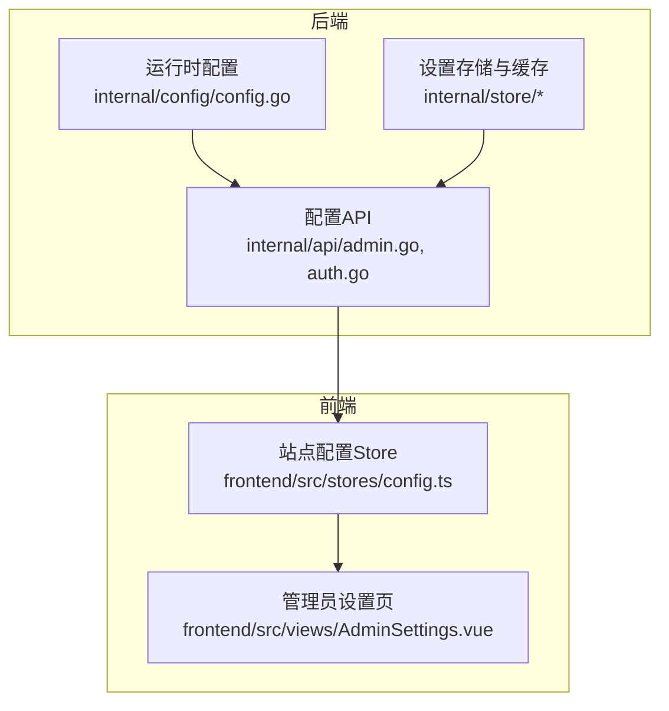
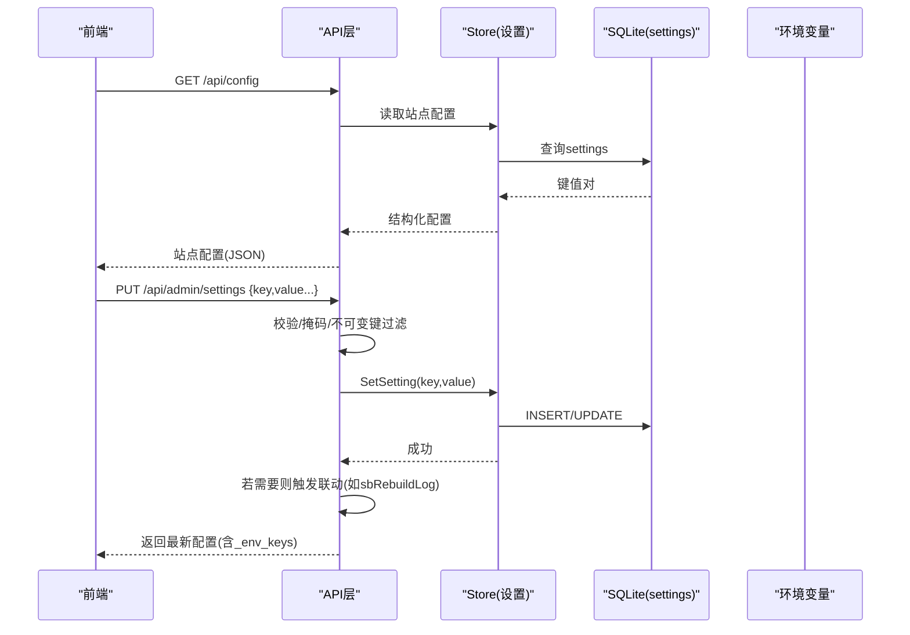
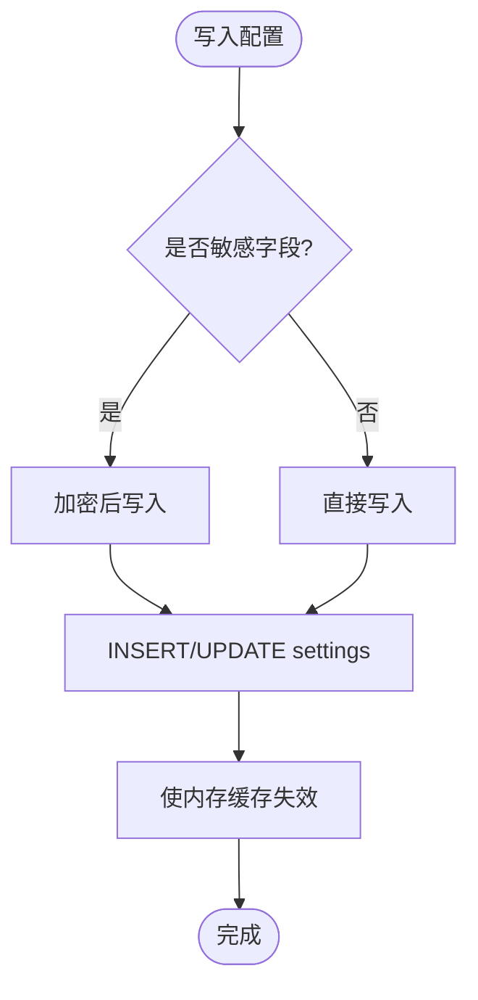
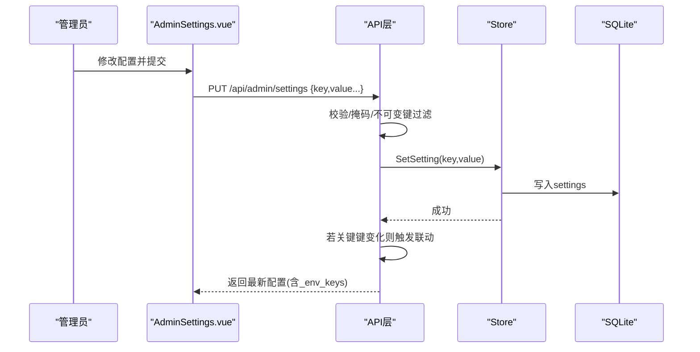
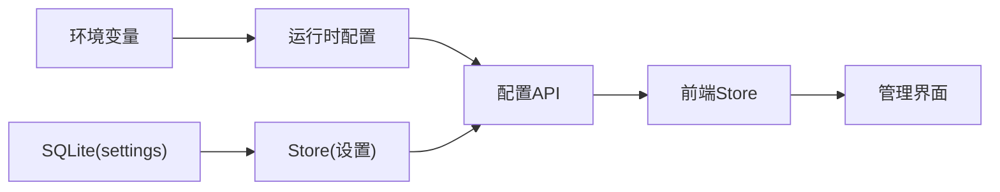
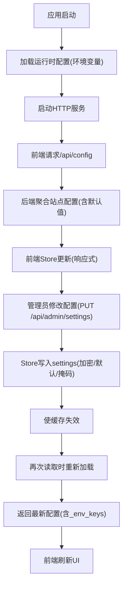

# 配置状态管理

<cite>
**本文引用的文件**
- [internal/config/config.go](file://internal/config/config.go)
- [internal/store/store.go](file://internal/store/store.go)
- [internal/store/settings.go](file://internal/store/settings.go)
- [internal/store/crypto.go](file://internal/store/crypto.go)
- [internal/api/admin.go](file://internal/api/admin.go)
- [internal/api/auth.go](file://internal/api/auth.go)
- [frontend/src/stores/config.ts](file://frontend/src/stores/config.ts)
- [frontend/src/views/AdminSettings.vue](file://frontend/src/views/AdminSettings.vue)
- [internal/updater/rollback.go](file://internal/updater/rollback.go)
</cite>

## 目录
1. [简介](#简介)
2. [项目结构](#项目结构)
3. [核心组件](#核心组件)
4. [架构总览](#架构总览)
5. [详细组件分析](#详细组件分析)
6. [依赖关系分析](#依赖关系分析)
7. [性能考量](#性能考量)
8. [故障排查指南](#故障排查指南)
9. [结论](#结论)
10. [附录](#附录)

## 简介
本文件面向“轻舟”面板的配置状态管理，系统性说明：
- 运行时配置与持久化配置的来源、加载、缓存与热更新机制
- 配置项的数据结构与类型定义（后端与前端）
- 配置变更的响应式更新与数据同步策略
- 配置版本管理与回滚机制（二进制版本回滚）
- 配置验证与默认值处理
- 最佳实践与性能优化建议
- 为配置模块开发者提供完整技术参考

## 项目结构
配置相关代码主要分布在以下层次：
- 运行时配置：通过环境变量加载，供进程启动阶段使用
- 持久化配置：基于 SQLite 的 settings 表，提供键值型配置读写、加密存储与内存缓存
- API 层：暴露读取/写入配置的接口，并实现安全掩码与环境变量覆盖展示
- 前端 Store：Pinia 维护站点级配置，拉取 /api/config 并在 UI 中响应式更新
- 管理界面：AdminSettings.vue 提供可视化编辑与提示（如环境变量锁定、模板内置默认等）
- 版本与回滚：updater 提供本地二进制回滚能力，保障升级失败可恢复

**图表来源**
- [internal/config/config.go:1-37](file://internal/config/config.go#L1-L37)
- [internal/store/store.go:1-71](file://internal/store/store.go#L1-L71)
- [internal/store/settings.go:1-139](file://internal/store/settings.go#L1-L139)
- [internal/api/admin.go:1-134](file://internal/api/admin.go#L1-L134)
- [internal/api/auth.go:70-110](file://internal/api/auth.go#L70-L110)
- [frontend/src/stores/config.ts:1-37](file://frontend/src/stores/config.ts#L1-L37)
- [frontend/src/views/AdminSettings.vue:1-200](file://frontend/src/views/AdminSettings.vue#L1-L200)

**章节来源**
- [internal/config/config.go:1-37](file://internal/config/config.go#L1-L37)
- [internal/store/store.go:1-71](file://internal/store/store.go#L1-L71)
- [internal/store/settings.go:1-139](file://internal/store/settings.go#L1-L139)
- [internal/api/admin.go:1-134](file://internal/api/admin.go#L1-L134)
- [internal/api/auth.go:70-110](file://internal/api/auth.go#L70-L110)
- [frontend/src/stores/config.ts:1-37](file://frontend/src/stores/config.ts#L1-L37)
- [frontend/src/views/AdminSettings.vue:1-200](file://frontend/src/views/AdminSettings.vue#L1-L200)

## 核心组件
- 运行时配置（进程级）
  - 从环境变量加载，包含监听地址、数据库路径、管理员账号密码等
  - 提供默认值，便于开箱即用；可通过环境变量覆盖
- 持久化配置（键值型）
  - settings 表存储所有业务配置项
  - 支持布尔、整数、字符串等类型转换读取
  - 敏感字段落盘加密，读取时透明解密
  - 全表内存缓存，写操作后失效，保证一致性
- 配置API
  - GET /api/config：返回前端所需站点配置（注册模式、邮箱校验、积分汇率、首页模式等）
  - GET /api/admin/settings：返回全部非敏感配置，自动合并环境变量覆盖，并对敏感字段掩码
  - PUT /api/admin/settings：批量写入配置，支持“留空用内置模板”语义，特殊键触发联动重建
- 前端配置Store
  - 使用 Pinia 维护站点配置，首次拉取 /api/config 后响应式更新
- 管理界面
  - 提供表单编辑、环境变量锁定提示、模板内置默认载入与清空、节点出口安全开关等

**章节来源**
- [internal/config/config.go:1-37](file://internal/config/config.go#L1-L37)
- [internal/store/settings.go:1-139](file://internal/store/settings.go#L1-L139)
- [internal/api/admin.go:47-134](file://internal/api/admin.go#L47-L134)
- [internal/api/auth.go:70-110](file://internal/api/auth.go#L70-L110)
- [frontend/src/stores/config.ts:1-37](file://frontend/src/stores/config.ts#L1-L37)
- [frontend/src/views/AdminSettings.vue:1-200](file://frontend/src/views/AdminSettings.vue#L1-L200)

## 架构总览
配置状态在系统中的流转如下：
- 启动期：进程从环境变量加载运行时配置
- 运行期：
  - 前端调用 /api/config 获取站点配置，存入 Pinia Store
  - 管理员通过 AdminSettings.vue 修改配置，提交到 /api/admin/settings
  - API 层校验并写入 settings 表，必要时触发联动（如 sing-box 路由重建）
  - 读路径对 settings 表进行内存缓存，写路径使缓存失效
  - 敏感字段按规则加密存储与透明解密
  - 环境变量覆盖在读取时生效，并在返回结果中标注受控字段

**图表来源**
- [internal/api/auth.go:70-110](file://internal/api/auth.go#L70-L110)
- [internal/api/admin.go:47-134](file://internal/api/admin.go#L47-L134)
- [internal/store/settings.go:1-139](file://internal/store/settings.go#L1-L139)

**章节来源**
- [internal/api/auth.go:70-110](file://internal/api/auth.go#L70-L110)
- [internal/api/admin.go:47-134](file://internal/api/admin.go#L47-L134)
- [internal/store/settings.go:1-139](file://internal/store/settings.go#L1-L139)

## 详细组件分析

### 运行时配置（进程级）
- 数据结构
  - 包含监听地址、数据库路径、管理员用户名与密码
- 加载机制
  - 通过环境变量 QZ_* 覆盖默认值
  - 未设置时使用合理默认，确保开箱可用
- 用途
  - 服务启动、数据库连接、初始管理员账户等

**章节来源**
- [internal/config/config.go:1-37](file://internal/config/config.go#L1-L37)

### 持久化配置（settings 表）
- 数据结构与类型
  - 以 key-value 形式存储，提供 GetSetting/SetSetting
  - 布尔：GetSettingBool/SetSettingBool
  - 整数：GetSettingInt64(key, def)
  - 字符串：GetSetting/SetSetting
- 缓存与一致性
  - 首次读取时加载整张 settings 表至内存 map
  - 任何写操作后使缓存失效，下次读取重新加载
- 加密存储
  - 指定密钥列表的字段落盘加密，读取时透明解密
  - 提供计数检测不可解密条目，用于启动自检
- 默认值与缺失处理
  - 读取时若不存在或解析失败，返回调用方提供的默认值
  - 模板类字段“留空用内置”，写入时若等于内置默认则存为空，保留未来默认升级效果

**图表来源**
- [internal/store/settings.go:73-95](file://internal/store/settings.go#L73-L95)
- [internal/store/crypto.go:14-46](file://internal/store/crypto.go#L14-L46)

**章节来源**
- [internal/store/settings.go:1-139](file://internal/store/settings.go#L1-L139)
- [internal/store/crypto.go:1-130](file://internal/store/crypto.go#L1-L130)
- [internal/store/store.go:1-71](file://internal/store/store.go#L1-L71)

### 配置API（读取/写入）
- 读取站点配置（/api/config）
  - 聚合 register_mode、registration_open、email_verify_required、points_per_cny、site_name/description、homepage_mode/url 等
  - 缺失时提供默认值，保证前端渲染稳定
- 读取全部设置（/api/admin/settings）
  - 返回除敏感字段外的所有设置
  - 合并环境变量覆盖，并在返回体中标注受环境变量控制的键集合
  - 模板字段为空时回填内置默认，便于管理员编辑
- 写入设置（/api/admin/settings）
  - 过滤 UI 专用字段与不可变字段
  - 对敏感字段，若值为“***”或空则保持原值
  - 模板字段等于内置默认时存为空，保留“留空用内置”语义
  - 特定键（如阻断内网出口）保存后触发联动重建

**图表来源**
- [internal/api/admin.go:47-134](file://internal/api/admin.go#L47-L134)
- [frontend/src/views/AdminSettings.vue:1-200](file://frontend/src/views/AdminSettings.vue#L1-L200)

**章节来源**
- [internal/api/admin.go:47-134](file://internal/api/admin.go#L47-L134)
- [frontend/src/views/AdminSettings.vue:1-200](file://frontend/src/views/AdminSettings.vue#L1-L200)

### 前端配置Store（Pinia）
- 数据结构 SiteConfig
  - site_name、site_description、register_mode、registration_open、email_verify_required、points_per_cny、homepage_mode、homepage_url
- 数据流
  - 应用初始化时调用 fetchConfig 拉取 /api/config
  - 将后端返回对象合并到本地 ref(config)，驱动视图响应式更新
- 错误处理
  - 请求失败时静默忽略，保持默认值显示，避免阻塞页面

**章节来源**
- [frontend/src/stores/config.ts:1-37](file://frontend/src/stores/config.ts#L1-L37)
- [internal/api/auth.go:70-110](file://internal/api/auth.go#L70-L110)

### 环境变量覆盖与可见性
- 覆盖范围
  - 部分设置项可由环境变量覆盖（如 SMTP、public_base 等）
- 可见性
  - 读取全部设置时，会将环境变量覆盖后的有效值注入返回体，并附带 _env_keys 指示哪些字段由环境变量控制
- 界面提示
  - 当某字段被环境变量固定时，管理界面会显示锁定提示，防止误改

**章节来源**
- [internal/api/admin.go:34-76](file://internal/api/admin.go#L34-L76)
- [frontend/src/views/AdminSettings.vue:35-50](file://frontend/src/views/AdminSettings.vue#L35-L50)

### 配置版本管理与回滚机制
- 二进制版本回滚
  - 支持在 Linux 上回滚到上一个已安装的二进制
  - 回滚前进行浅检查与完整内容校验，确保可执行文件完整性
  - 回滚过程不改动数据库，仅替换二进制并重启
- 适用场景
  - 新版本异常时快速恢复，无需网络下载
  - 降级/升级均可通过同一流程管理

**章节来源**
- [internal/updater/rollback.go:1-131](file://internal/updater/rollback.go#L1-L131)

## 依赖关系分析
- 运行时配置依赖环境变量，影响服务监听与数据库路径
- 持久化配置依赖 SQLite，并通过内存缓存提升读性能
- API 层依赖 Store 与子模块（如模板默认值），并协调环境变量覆盖
- 前端 Store 依赖 API 提供站点配置，驱动 UI 渲染
- 管理界面依赖 API 与 Store，提供可视化编辑与提示

**图表来源**
- [internal/config/config.go:1-37](file://internal/config/config.go#L1-L37)
- [internal/store/store.go:1-71](file://internal/store/store.go#L1-L71)
- [internal/store/settings.go:1-139](file://internal/store/settings.go#L1-L139)
- [internal/api/admin.go:1-134](file://internal/api/admin.go#L1-L134)
- [frontend/src/stores/config.ts:1-37](file://frontend/src/stores/config.ts#L1-L37)

**章节来源**
- [internal/config/config.go:1-37](file://internal/config/config.go#L1-L37)
- [internal/store/store.go:1-71](file://internal/store/store.go#L1-L71)
- [internal/store/settings.go:1-139](file://internal/store/settings.go#L1-L139)
- [internal/api/admin.go:1-134](file://internal/api/admin.go#L1-L134)
- [frontend/src/stores/config.ts:1-37](file://frontend/src/stores/config.ts#L1-L37)

## 性能考量
- 读多写少场景优化
  - settings 表整体缓存于内存，减少频繁磁盘IO
  - 写操作后统一失效缓存，避免脏读
- 并发与锁
  - 使用读写锁保护缓存，读路径无阻塞
  - SQLite 启用 WAL 与小连接池，缓解嵌套事务死锁风险
- 模板默认值
  - 空模板回填内置默认，减少前端空白渲染与重复请求
- 环境变量覆盖
  - 仅在读取时合并，避免每次写都计算覆盖逻辑

[本节为通用性能指导，不直接分析具体文件]

## 故障排查指南
- 无法解密敏感字段
  - 检查密钥是否正确设置，启动时可统计不可解密条目数量
  - 若密钥变更，需重新生成或迁移受影响配置
- 环境变量覆盖导致配置“看似未生效”
  - 查看返回体中的 _env_keys，确认字段是否由环境变量覆盖
  - 如需在面板内修改，移除对应环境变量并重启
- 模板字段“留空用内置”语义不符预期
  - 确认写入时是否为内置默认值；若是，实际存储为空，后续升级内置模板仍会生效
- 节点出口安全变更后未立即生效
  - 该键保存后会触发联动重建，等待构建完成后再验证

**章节来源**
- [internal/store/crypto.go:79-130](file://internal/store/crypto.go#L79-L130)
- [internal/api/admin.go:34-76](file://internal/api/admin.go#L34-L76)
- [internal/api/admin.go:95-118](file://internal/api/admin.go#L95-L118)

## 结论
本系统的配置状态管理采用“运行时配置 + 持久化键值配置 + 内存缓存 + 环境变量覆盖”的组合方案，兼顾了易用性、安全性与性能。通过清晰的 API 契约与前端 Store 的响应式更新，实现了配置的热更新与即时反馈。同时，二进制回滚机制为版本迭代提供了可靠的安全网。建议在新增配置项时遵循现有约定：明确类型、提供默认值、标注是否敏感、考虑环境变量覆盖与联动行为。

[本节为总结性内容，不直接分析具体文件]

## 附录

### 配置项数据结构与类型定义
- 后端（运行时配置）
  - ListenAddr: string
  - DBPath: string
  - AdminUsername: string
  - AdminPassword: string
- 后端（持久化配置，示例）
  - register_mode: string（open/code/closed）
  - registration_open: boolean
  - email_verify_required: boolean
  - points_per_cny: int64
  - site_name: string
  - site_description: string
  - homepage_mode: string
  - homepage_url: string
  - smtp_host/port/user/pass/from/from_name/security: string
  - cf_api_token: string（加密存储）
  - sub_clash_template/sub_singbox_template: string（留空用内置）
- 前端（站点配置）
  - site_name: string
  - site_description: string
  - register_mode: string
  - registration_open: boolean
  - email_verify_required: boolean
  - points_per_cny: number
  - homepage_mode: string
  - homepage_url: string

**章节来源**
- [internal/config/config.go:5-28](file://internal/config/config.go#L5-L28)
- [internal/api/auth.go:70-110](file://internal/api/auth.go#L70-L110)
- [frontend/src/stores/config.ts:5-35](file://frontend/src/stores/config.ts#L5-L35)

### 配置加载、缓存与热更新流程图

**图表来源**
- [internal/config/config.go:14-29](file://internal/config/config.go#L14-L29)
- [internal/api/auth.go:70-110](file://internal/api/auth.go#L70-L110)
- [internal/api/admin.go:47-134](file://internal/api/admin.go#L47-L134)
- [internal/store/settings.go:1-139](file://internal/store/settings.go#L1-L139)
- [frontend/src/stores/config.ts:16-35](file://frontend/src/stores/config.ts#L16-L35)
