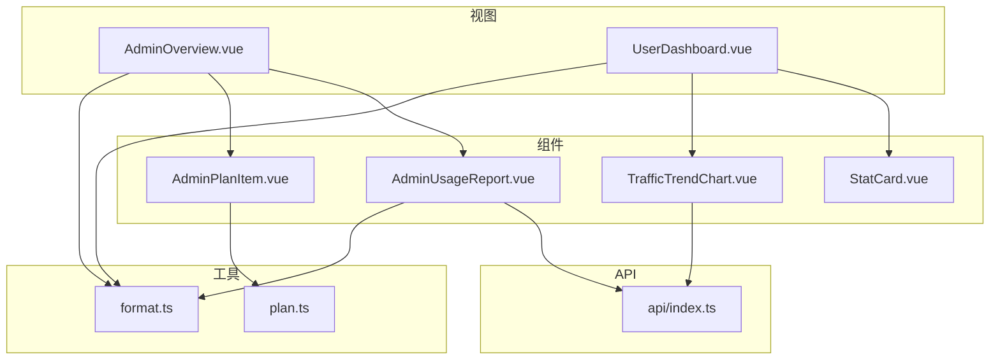
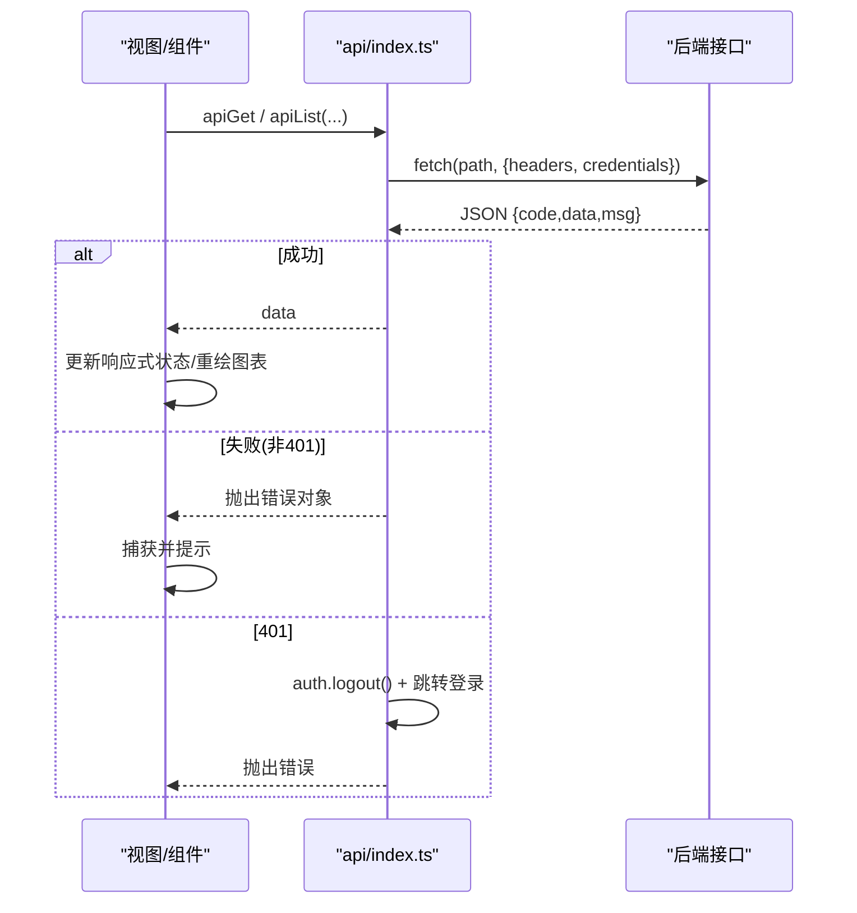
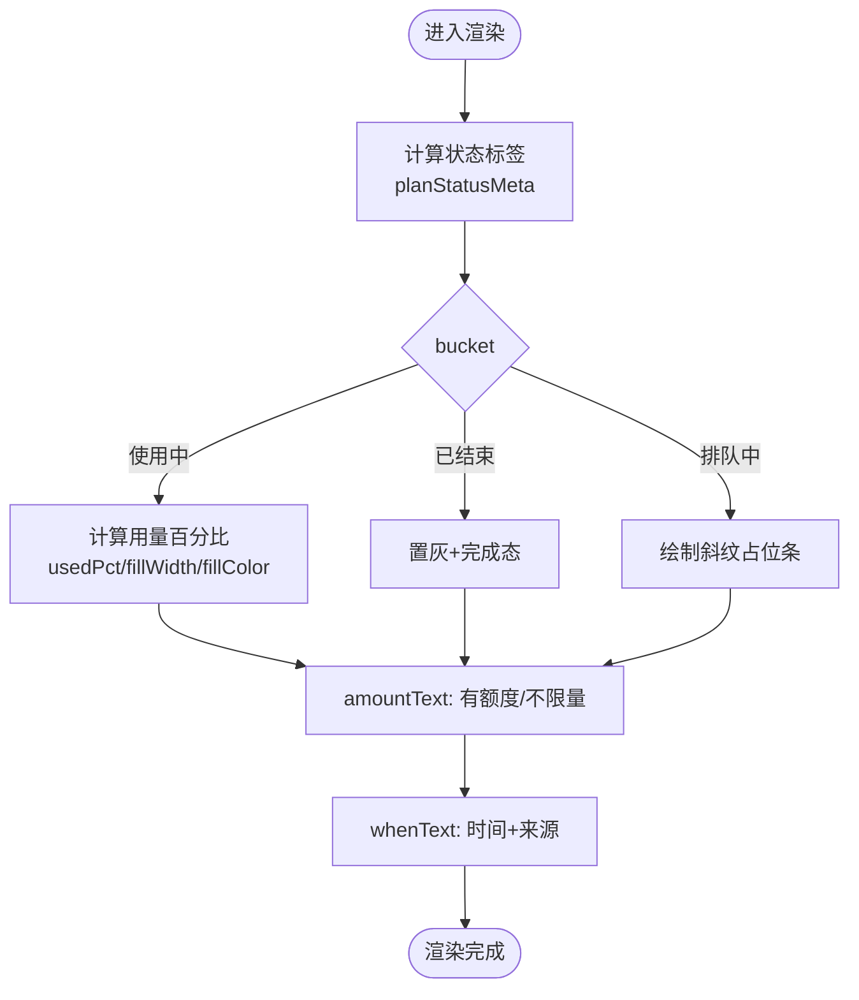
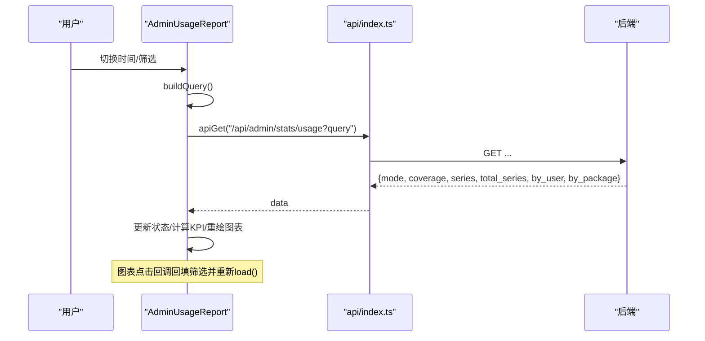
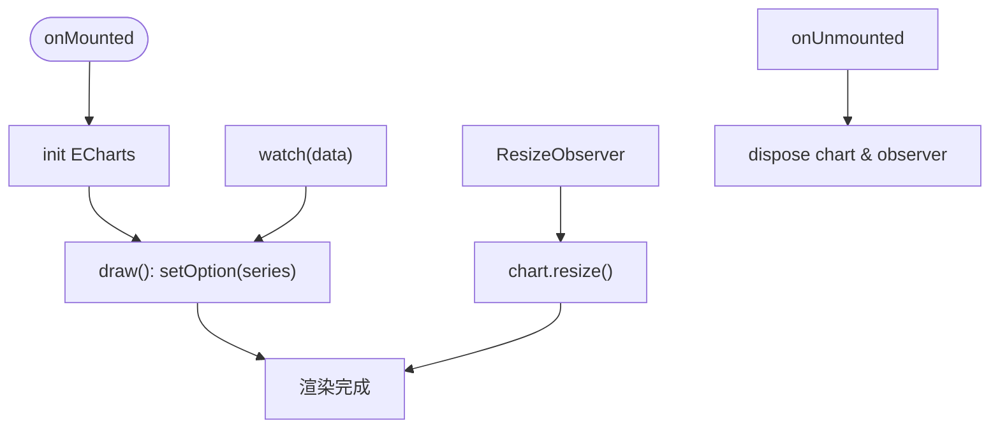
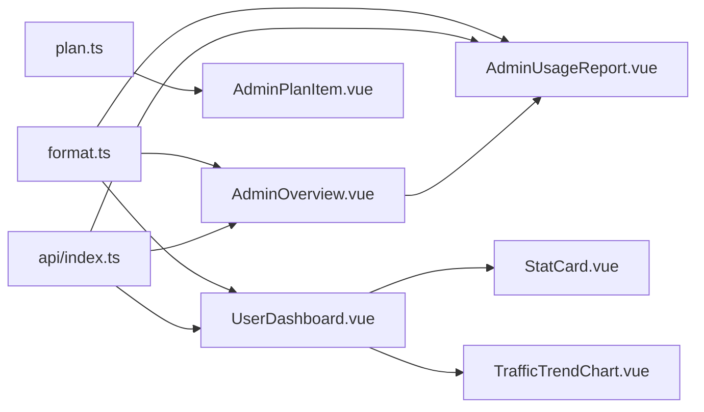

# 业务组件

<cite>
**本文引用的文件**
- [AdminPlanItem.vue](file://frontend/src/components/AdminPlanItem.vue)
- [AdminUsageReport.vue](file://frontend/src/components/AdminUsageReport.vue)
- [StatCard.vue](file://frontend/src/components/StatCard.vue)
- [TrafficTrendChart.vue](file://frontend/src/components/TrafficTrendChart.vue)
- [api/index.ts](file://frontend/src/api/index.ts)
- [utils/format.ts](file://frontend/src/utils/format.ts)
- [utils/plan.ts](file://frontend/src/utils/plan.ts)
- [views/AdminOverview.vue](file://frontend/src/views/AdminOverview.vue)
- [views/UserDashboard.vue](file://frontend/src/views/UserDashboard.vue)
</cite>

## 目录
1. [简介](#简介)
2. [项目结构](#项目结构)
3. [核心组件](#核心组件)
4. [架构总览](#架构总览)
5. [详细组件分析](#详细组件分析)
6. [依赖关系分析](#依赖关系分析)
7. [性能考虑](#性能考虑)
8. [故障排查指南](#故障排查指南)
9. [结论](#结论)
10. [附录](#附录)

## 简介
本文件聚焦前端业务组件，覆盖套餐项展示、用量报告、统计卡片、流量趋势图表等关键能力。文档从数据模型、状态管理、计算逻辑、API 集成与数据流、业务规则与错误处理、性能优化与缓存策略、以及复用组合方式等方面展开，帮助读者快速理解并正确使用这些组件。

## 项目结构
- 组件层：位于 frontend/src/components，包含 AdminPlanItem、AdminUsageReport、StatCard、TrafficTrendChart 等业务组件。
- 视图层：位于 frontend/src/views，聚合多个组件形成页面（如 AdminOverview、UserDashboard）。
- API 封装：frontend/src/api/index.ts，统一请求、鉴权、错误处理与下载。
- 工具函数：frontend/src/utils/format.ts、utils/plan.ts，提供格式化、百分比、计划状态等通用能力。
- 状态与路由：通过 Vue 响应式状态与 Router 驱动交互；认证信息来自 stores/auth（由 api 封装自动注入）。

**图示来源**
- [views/AdminOverview.vue:136-141](file://frontend/src/views/AdminOverview.vue#L136-L141)
- [views/UserDashboard.vue:33-59](file://frontend/src/views/UserDashboard.vue#L33-L59)
- [components/AdminUsageReport.vue:167-173](file://frontend/src/components/AdminUsageReport.vue#L167-L173)
- [components/TrafficTrendChart.vue:5-12](file://frontend/src/components/TrafficTrendChart.vue#L5-L12)
- [components/AdminPlanItem.vue:26-33](file://frontend/src/components/AdminPlanItem.vue#L26-L33)
- [api/index.ts:9-48](file://frontend/src/api/index.ts#L9-L48)

**章节来源**
- [views/AdminOverview.vue:1-141](file://frontend/src/views/AdminOverview.vue#L1-L141)
- [views/UserDashboard.vue:1-160](file://frontend/src/views/UserDashboard.vue#L1-L160)
- [components/AdminUsageReport.vue:1-173](file://frontend/src/components/AdminUsageReport.vue#L1-L173)
- [components/TrafficTrendChart.vue:1-12](file://frontend/src/components/TrafficTrendChart.vue#L1-L12)
- [components/AdminPlanItem.vue:1-33](file://frontend/src/components/AdminPlanItem.vue#L1-L33)
- [api/index.ts:1-48](file://frontend/src/api/index.ts#L1-L48)

## 核心组件
- AdminPlanItem：渲染“一份额度”的行，展示名称、标签、用量进度、时间信息与操作按钮；根据后端状态决定样式与文案。
- AdminUsageReport：管理员用量分析面板，支持时间口径切换、用户/套餐筛选、KPI、流量趋势、套餐分布、用户排行与明细导出。
- StatCard：可复用的统计卡片，支持标签、徽章、点击行为、入场动画与可访问性。
- TrafficTrendChart：基于 ECharts 的流量趋势折线面积图，支持堆叠、提示框合计、自适应尺寸。

**章节来源**
- [components/AdminPlanItem.vue:1-89](file://frontend/src/components/AdminPlanItem.vue#L1-L89)
- [components/AdminUsageReport.vue:1-607](file://frontend/src/components/AdminUsageReport.vue#L1-L607)
- [components/StatCard.vue:1-77](file://frontend/src/components/StatCard.vue#L1-L77)
- [components/TrafficTrendChart.vue:1-102](file://frontend/src/components/TrafficTrendChart.vue#L1-L102)

## 架构总览
- 数据获取：组件通过 api/index.ts 的 apiGet/apiList 发起请求，自动携带 Authorization 头并在 401 时跳转登录。
- 状态管理：使用 Vue 响应式 ref/computed 维护本地状态；图表实例在组件内缓存，避免重复初始化。
- 计算逻辑：大量使用 computed 派生 KPI、排序、占比、颜色等；工具函数负责字节、日期、百分比等格式化。
- 业务规则：套餐状态、用量阈值、累计/区间口径、未归属流量等在前端进行解释与展示。
- 错误处理：统一在 api 层抛错，组件层捕获并提示；401 自动登出并重定向。

**图示来源**
- [api/index.ts:9-48](file://frontend/src/api/index.ts#L9-L48)
- [components/AdminUsageReport.vue:494-514](file://frontend/src/components/AdminUsageReport.vue#L494-L514)
- [views/UserDashboard.vue:282-296](file://frontend/src/views/UserDashboard.vue#L282-L296)

## 详细组件分析

### AdminPlanItem（套餐项）
- 数据模型
  - 输入 props.plan：包含 name/id、status、traffic_limit、used、created_at、order_id、kind、package_id 等字段。
  - 通过 planStatusMeta 与 planTimeText 将后端状态映射为标签与时间文案。
- 状态与计算
  - bucket：active/queued/finished，用于控制进度条与样式。
  - usedPct/fillWidth/fillColor：按 traffic_limit 与已用比例计算进度条宽度与颜色。
  - amountText/whenText：格式化用量与时间信息，区分不限量场景。
- 业务规则
  - 排队中份显示斜纹而非 0% 进度条，避免误导。
  - 无订单号的份标注来源（流量包余额/管理员额度/注册赠送/管理员分配）。
- 事件
  - remove：触发父组件移除逻辑。
- 错误处理
  - 该组件为纯展示，错误由上层处理。

**图示来源**
- [components/AdminPlanItem.vue:35-68](file://frontend/src/components/AdminPlanItem.vue#L35-L68)
- [utils/plan.ts:9-28](file://frontend/src/utils/plan.ts#L9-L28)

**章节来源**
- [components/AdminPlanItem.vue:1-89](file://frontend/src/components/AdminPlanItem.vue#L1-L89)
- [utils/plan.ts:1-37](file://frontend/src/utils/plan.ts#L1-L37)

### AdminUsageReport（用量报告）
- 数据模型
  - 查询参数：preset（累计/7d/30d/90d/custom）、from/to、users、packages。
  - 返回数据：mode、coverage、series（用户维度每日）、total_series（全站每日）、by_user、by_package。
- 状态与计算
  - 筛选：selected（用户多选）、selectedPkgs（套餐多选），联动图表与表格。
  - KPI：总流量、上下行、日均、峰值，均基于 by_user/total_series 计算。
  - 明细表：按 up/down/total 排序，占比以最大行基准展示。
  - 图表：趋势（多用户堆叠或全站上行/下行）、套餐分布（环图）、用户排行（柱状图）。
- 业务规则
  - 累计口径：账户开通至今全部流量；区间口径：自首次记录起，更早无法归属到套餐的数据单列为“未记录套餐（升级前）”。
  - 环图点击套餐名回填筛选；柱状图点击用户回填筛选。
- API 集成
  - 加载用量：GET /api/admin/stats/usage?query
  - 加载用户/套餐选项：GET /api/admin/stats/usage/users?limit=300、GET /api/admin/stats/usage/packages
- 错误处理
  - 捕获网络错误并提示；自定义日期未选择时不发起请求，避免口径不一致。
- 性能优化
  - ECharts 实例缓存，仅在容器可见时 init；resize 防抖；按需渲染；大数据量下仅取 Top N 排行。

**图示来源**
- [components/AdminUsageReport.vue:482-514](file://frontend/src/components/AdminUsageReport.vue#L482-L514)
- [components/AdminUsageReport.vue:428-443](file://frontend/src/components/AdminUsageReport.vue#L428-L443)
- [api/index.ts:50-59](file://frontend/src/api/index.ts#L50-L59)

**章节来源**
- [components/AdminUsageReport.vue:1-607](file://frontend/src/components/AdminUsageReport.vue#L1-L607)
- [api/index.ts:50-59](file://frontend/src/api/index.ts#L50-L59)

### StatCard（统计卡片）
- 数据模型
  - props：label、value、sub、badge、badgeColor、valueColor、clickable、delay。
- 状态与计算
  - 无复杂计算，主要做展示与事件转发。
- 业务规则
  - 可点击卡片带箭头与高亮动效；支持延迟入场动画，便于同排卡片依次出现。
- 错误处理
  - 无外部依赖，无错误分支。
- 复用建议
  - 作为 KPI 卡片基础单元，可在 Dashboard 中组合使用。

**章节来源**
- [components/StatCard.vue:1-77](file://frontend/src/components/StatCard.vue#L1-L77)

### TrafficTrendChart（流量趋势图表）
- 数据模型
  - props.data：数组，每项含 date、up、down。
- 状态与计算
  - 使用 ECharts 绘制双系列堆叠面积图；tooltip 汇总当日总量；X 轴按日期切片。
- 业务规则
  - 悬停时强调当前系列，便于区分堆叠中的两条线。
- 错误处理
  - 容器不可见时跳过绘制；ResizeObserver 监听尺寸变化后重绘。
- 性能优化
  - 实例缓存；watch 深度监听数据变化；销毁时释放资源。

**图示来源**
- [components/TrafficTrendChart.vue:21-76](file://frontend/src/components/TrafficTrendChart.vue#L21-L76)
- [components/TrafficTrendChart.vue:80-96](file://frontend/src/components/TrafficTrendChart.vue#L80-L96)

**章节来源**
- [components/TrafficTrendChart.vue:1-102](file://frontend/src/components/TrafficTrendChart.vue#L1-L102)

### 视图级组合示例
- UserDashboard：组合 StatCard、TrafficTrendChart，展示剩余流量、生效套餐、积分、用量趋势；通过 api/user/dashboard 与 /api/user/stats/traffic 获取数据。
- AdminOverview：组合 AdminUsageReport 与其他图表，提供运营视角的流量、收入、注册、套餐分析。

**章节来源**
- [views/UserDashboard.vue:33-160](file://frontend/src/views/UserDashboard.vue#L33-L160)
- [views/AdminOverview.vue:136-141](file://frontend/src/views/AdminOverview.vue#L136-L141)

## 依赖关系分析
- 组件对工具函数的依赖
  - format.ts：fmtBytes、fmtDate、fmtDateTime、pct、yuan、timeAgo 等。
  - plan.ts：planStatusMeta、planTimeText、planSortKey。
- 组件对 API 的依赖
  - api/index.ts：统一请求封装、鉴权、错误处理、下载。
- 组件间耦合
  - AdminOverview 嵌入 AdminUsageReport，并通过 ref 调用 refresh。
  - UserDashboard 组合 StatCard 与 TrafficTrendChart。

**图示来源**
- [components/AdminUsageReport.vue:167-173](file://frontend/src/components/AdminUsageReport.vue#L167-L173)
- [components/AdminPlanItem.vue:26-33](file://frontend/src/components/AdminPlanItem.vue#L26-L33)
- [views/AdminOverview.vue:234-241](file://frontend/src/views/AdminOverview.vue#L234-L241)
- [views/UserDashboard.vue:145-160](file://frontend/src/views/UserDashboard.vue#L145-L160)
- [api/index.ts:50-59](file://frontend/src/api/index.ts#L50-L59)

**章节来源**
- [utils/format.ts:1-73](file://frontend/src/utils/format.ts#L1-L73)
- [utils/plan.ts:1-37](file://frontend/src/utils/plan.ts#L1-L37)
- [api/index.ts:1-124](file://frontend/src/api/index.ts#L1-L124)

## 性能考虑
- 图表性能
  - ECharts 实例缓存，避免重复初始化；仅在容器可见时绘制；resize 防抖；及时 dispose。
  - 大数据集限制：用户排行仅取 Top 10；套餐分布按名称聚合减少扇区数量。
- 渲染优化
  - 使用 computed 派生值，减少重复计算；条件渲染隐藏空数据区域。
  - 列表排序与过滤在内存中进行，避免频繁请求。
- 网络优化
  - 批量并行请求：AdminOverview 同时加载 overview、traffic、distribution、packages、users。
  - 分页与限参：用户列表分页加载；用量报告用户下拉限制 limit=300。
- 缓存方案
  - 前端内存缓存：ECharts 实例、局部状态；无服务端缓存策略。
  - 浏览器缓存：通过标准 fetch 与后端协商；下载附件使用临时 URL 并延迟释放。

[本节为通用指导，不直接分析具体代码文件]

## 故障排查指南
- 401 未授权
  - 现象：请求失败并跳转到登录页。
  - 原因：token 过期或无效；api 封装会调用 logout 并跳转。
  - 处理：重新登录后重试；检查会话是否被其他操作清理。
- 图表空白或宽度异常
  - 现象：图表不显示或保持 0 宽。
  - 原因：容器初始宽度为 0；标签页切换导致隐藏。
  - 处理：确保容器可见后再绘制；监听 resize 或使用 ResizeObserver；切回标签页时重绘。
- 用量数据为空
  - 现象：用量报告无数据。
  - 原因：自定义日期未选择；或区间无流量记录。
  - 处理：选择有效日期范围；等待首次流量统计；查看 coverage.first 说明。
- CSV 导出乱码
  - 现象：Excel 打开中文列名乱码。
  - 原因：缺少 BOM。
  - 处理：组件已添加 BOM；若仍乱码，确认 Excel 编码设置。

**章节来源**
- [api/index.ts:28-48](file://frontend/src/api/index.ts#L28-L48)
- [components/AdminUsageReport.vue:494-514](file://frontend/src/components/AdminUsageReport.vue#L494-L514)
- [components/TrafficTrendChart.vue:80-96](file://frontend/src/components/TrafficTrendChart.vue#L80-L96)

## 结论
本项目的前端业务组件围绕“套餐项展示、用量报告、统计卡片、流量趋势图表”构建，采用清晰的职责划分与统一的 API 封装。通过响应式状态、计算属性与工具函数实现高效的数据处理与展示；借助 ECharts 实例管理与按需渲染保障性能。建议在新增业务需求时遵循现有模式：明确数据模型、使用 computed 派生、统一错误处理、合理拆分组件并复用。

[本节为总结性内容，不直接分析具体代码文件]

## 附录
- 常用工具函数路径
  - 字节/日期/百分比格式化：[utils/format.ts](file://frontend/src/utils/format.ts)
  - 套餐状态与时间文案：[utils/plan.ts](file://frontend/src/utils/plan.ts)
- 关键 API 路径
  - 用量统计：/api/admin/stats/usage
  - 用量用户/套餐选项：/api/admin/stats/usage/users、/api/admin/stats/usage/packages
  - 用户仪表盘：/api/user/dashboard、/api/user/stats/traffic
  - 管理概览：/api/admin/stats/overview、/api/admin/stats/traffic、/api/admin/stats/distribution、/api/admin/stats/packages

[本节为参考信息，不直接分析具体代码文件]
