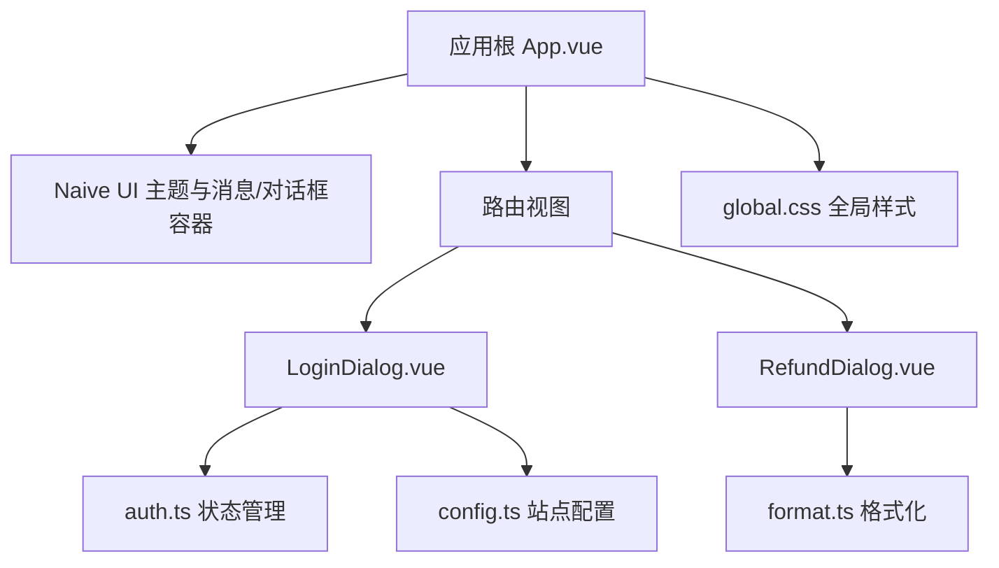
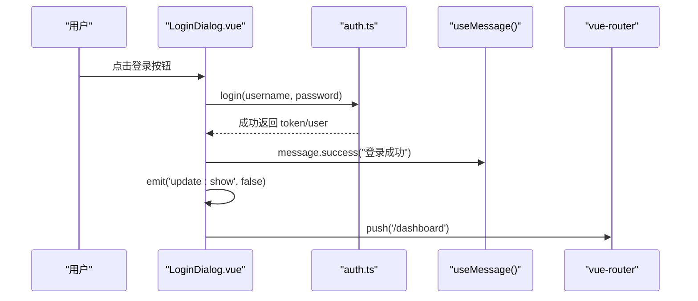
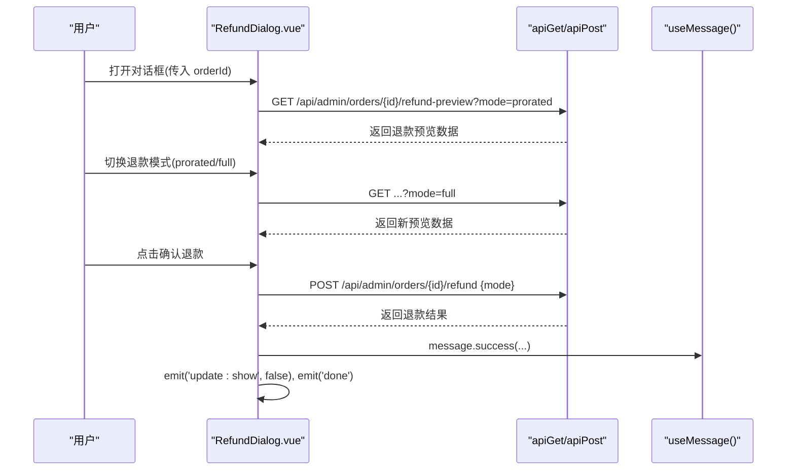
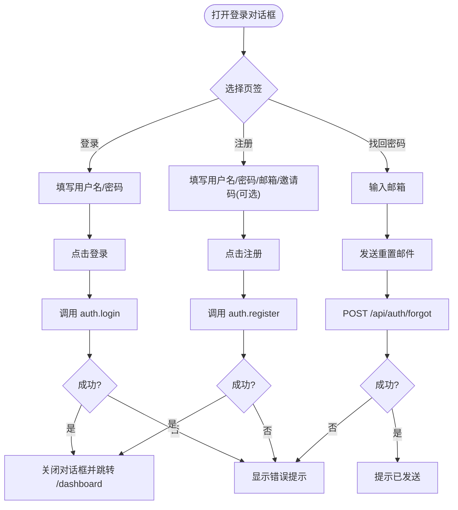
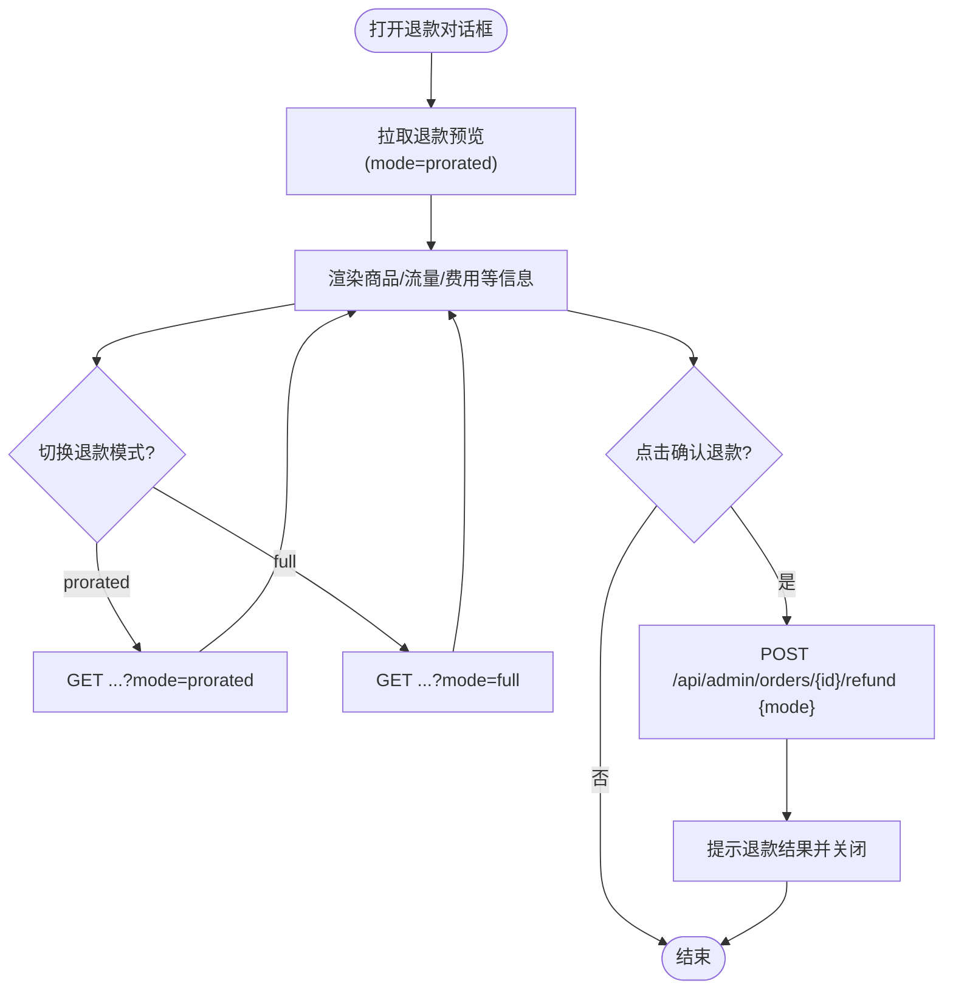
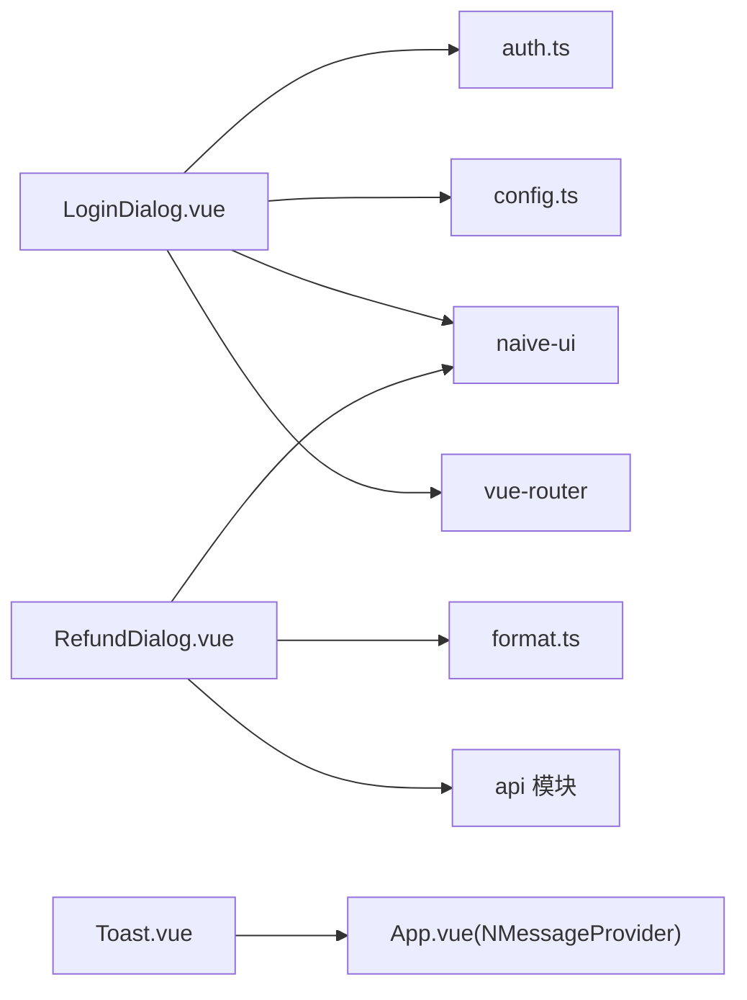

# 基础组件

<cite>
**本文引用的文件**
- [frontend/src/components/Toast.vue](file://frontend/src/components/Toast.vue)
- [frontend/src/components/LoginDialog.vue](file://frontend/src/components/LoginDialog.vue)
- [frontend/src/components/RefundDialog.vue](file://frontend/src/components/RefundDialog.vue)
- [frontend/src/App.vue](file://frontend/src/App.vue)
- [frontend/src/stores/auth.ts](file://frontend/src/stores/auth.ts)
- [frontend/src/stores/config.ts](file://frontend/src/stores/config.ts)
- [frontend/src/utils/format.ts](file://frontend/src/utils/format.ts)
- [frontend/src/styles/global.css](file://frontend/src/styles/global.css)
</cite>

## 目录
1. [简介](#简介)
2. [项目结构](#项目结构)
3. [核心组件总览](#核心组件总览)
4. [架构概览](#架构概览)
5. [详细组件分析](#详细组件分析)
6. [依赖关系分析](#依赖关系分析)
7. [性能与可访问性](#性能与可访问性)
8. [测试与调试指南](#测试与调试指南)
9. [扩展与定制指南](#扩展与定制指南)
10. [结论](#结论)

## 简介
本章节面向开发者，系统化梳理前端基础交互组件：Toast 通知、登录对话框、退款对话框。文档覆盖每个组件的 Props 接口、事件处理、样式定制选项、使用示例与最佳实践、可访问性与响应式实现、测试与调试方法，以及扩展与自定义指导。

## 项目结构
这些基础组件位于 frontend/src/components 目录下，配合全局主题配置（App.vue）、状态管理（stores）与工具函数（utils）共同工作。全局样式在 styles/global.css 中定义，提供一致的视觉基线与响应式网格工具类。

图表来源
- [frontend/src/App.vue:1-30](file://frontend/src/App.vue#L1-L30)
- [frontend/src/components/LoginDialog.vue:1-142](file://frontend/src/components/LoginDialog.vue#L1-L142)
- [frontend/src/components/RefundDialog.vue:1-116](file://frontend/src/components/RefundDialog.vue#L1-L116)
- [frontend/src/stores/auth.ts:1-75](file://frontend/src/stores/auth.ts#L1-L75)
- [frontend/src/stores/config.ts:1-37](file://frontend/src/stores/config.ts#L1-L37)
- [frontend/src/utils/format.ts:1-73](file://frontend/src/utils/format.ts#L1-L73)
- [frontend/src/styles/global.css:1-131](file://frontend/src/styles/global.css#L1-L131)

章节来源
- [frontend/src/App.vue:1-30](file://frontend/src/App.vue#L1-L30)
- [frontend/src/styles/global.css:1-131](file://frontend/src/styles/global.css#L1-L131)

## 核心组件总览
- Toast 通知：基于 Naive UI 的全局消息系统，通过 NMessageProvider 提供统一的消息提示能力。
- 登录对话框：封装登录、注册、找回密码流程，支持表单校验、错误提示与路由跳转。
- 退款对话框：展示订单退款预览与确认，支持按剩余比例或全额退款模式切换，并调用后端接口完成退款。

章节来源
- [frontend/src/components/Toast.vue:1-9](file://frontend/src/components/Toast.vue#L1-L9)
- [frontend/src/components/LoginDialog.vue:1-142](file://frontend/src/components/LoginDialog.vue#L1-L142)
- [frontend/src/components/RefundDialog.vue:1-116](file://frontend/src/components/RefundDialog.vue#L1-L116)

## 架构概览
以下序列图展示了登录对话框从用户操作到状态更新与页面跳转的关键流程；退款对话框则遵循“打开时拉取预览 -> 切换模式刷新预览 -> 提交退款”的流程。

图表来源
- [frontend/src/components/LoginDialog.vue:97-109](file://frontend/src/components/LoginDialog.vue#L97-L109)
- [frontend/src/stores/auth.ts:25-30](file://frontend/src/stores/auth.ts#L25-L30)

图表来源
- [frontend/src/components/RefundDialog.vue:68-103](file://frontend/src/components/RefundDialog.vue#L68-L103)

## 详细组件分析

### Toast 通知
- 职责说明：作为占位容器，实际由 App.vue 中的 NMessageProvider 提供全局消息能力。
- Props 接口：无公开 Props（组件本身为空容器）。
- 事件处理：无事件。
- 样式定制：通过 Naive UI 主题与全局 CSS 变量控制外观。
- 使用方式：在任意组件中通过 useMessage() 调用 success/error/warning/info 等方法显示通知。
- 可访问性：由 Naive UI 的 NMessageProvider 负责语义与焦点管理。
- 响应式：自动适配移动端宽度与布局。

章节来源
- [frontend/src/components/Toast.vue:1-9](file://frontend/src/components/Toast.vue#L1-L9)
- [frontend/src/App.vue:1-30](file://frontend/src/App.vue#L1-L30)
- [frontend/src/styles/global.css:1-131](file://frontend/src/styles/global.css#L1-L131)

### 登录对话框 LoginDialog
- 职责说明：提供登录、注册、找回密码的统一入口，包含表单校验、加载态、错误提示与路由跳转。
- Props 接口：
  - show: boolean — 控制对话框显隐（双向绑定 update:show）。
- 事件：
  - update:show: (value: boolean) — 父组件用于关闭对话框。
- 内部状态：
  - tab: 'login' | 'register' | 'forgot'
  - loading: boolean
  - loginForm/regForm/forgotEmail
- 表单规则：
  - 用户名必填、密码必填且长度限制、邮箱格式校验（受站点配置影响）。
- 业务逻辑：
  - 登录：调用 auth.login，成功后提示并跳转至 /dashboard。
  - 注册：根据 config.registration_open 决定是否显示注册页签；调用 auth.register。
  - 找回密码：调用 /api/auth/forgot 发送重置邮件。
- 样式定制：
  - 最大宽度 max-width: 400px；标题区域含品牌标识。
  - 颜色与圆角等由 Naive UI 主题与 global.css 变量驱动。
- 可访问性：
  - 使用 n-modal 承载模态框；表单元素具备 label 与 placeholder；键盘 Enter 触发登录。
- 响应式：
  - 基于 Naive UI 的 Modal 自适应；在小屏下保持可读性。

图表来源
- [frontend/src/components/LoginDialog.vue:10-49](file://frontend/src/components/LoginDialog.vue#L10-L49)
- [frontend/src/components/LoginDialog.vue:97-136](file://frontend/src/components/LoginDialog.vue#L97-L136)
- [frontend/src/stores/auth.ts:25-40](file://frontend/src/stores/auth.ts#L25-L40)

章节来源
- [frontend/src/components/LoginDialog.vue:1-142](file://frontend/src/components/LoginDialog.vue#L1-L142)
- [frontend/src/stores/auth.ts:1-75](file://frontend/src/stores/auth.ts#L1-L75)
- [frontend/src/stores/config.ts:1-37](file://frontend/src/stores/config.ts#L1-L37)

### 退款对话框 RefundDialog
- 职责说明：展示订单退款预览信息，支持按剩余比例或全额退款，确认后调用后端完成退款。
- Props 接口：
  - show: boolean — 控制对话框显隐（双向绑定 update:show）。
  - orderId: number | null — 当前订单 ID。
- 事件：
  - update:show: (v: boolean) — 关闭对话框。
  - done: () — 退款完成后回调，供父组件刷新列表等。
- 内部状态：
  - q: any — 退款预览数据。
  - loading/submitting: boolean — 加载与提交态。
  - mode: 'prorated' | 'full' — 退款模式。
- 业务逻辑：
  - 打开时根据 mode 拉取预览数据；切换模式重新拉取。
  - 确认退款时调用 POST /api/admin/orders/{orderId}/refund，成功后提示并触发 done。
- 样式定制：
  - 卡片宽度 440px，最大宽度 92vw；行项 rr 采用左右对齐布局；总计行高亮显示应退积分。
  - 警告文案使用 warning 色。
- 可访问性：
  - 使用 n-card role="dialog" 明确语义；按钮具备禁用态与加载态。
- 响应式：
  - 最大宽度 92vw 保证小屏可用；内容纵向堆叠。

图表来源
- [frontend/src/components/RefundDialog.vue:68-103](file://frontend/src/components/RefundDialog.vue#L68-L103)

章节来源
- [frontend/src/components/RefundDialog.vue:1-116](file://frontend/src/components/RefundDialog.vue#L1-L116)
- [frontend/src/utils/format.ts:1-73](file://frontend/src/utils/format.ts#L1-L73)

## 依赖关系分析
- LoginDialog 依赖：
  - stores/auth.ts：登录、注册、获取用户信息。
  - stores/config.ts：读取站点配置（是否开放注册、是否需要邮箱验证等）。
  - naive-ui：NModal、NTabs、NForm、NInput、NButton 等。
  - vue-router：登录后跳转。
- RefundDialog 依赖：
  - utils/format.ts：格式化字节、总量、百分比等。
  - naive-ui：NModal、NCard、NSpin、NRadioGroup、NButton 等。
  - api 模块：GET/POST 请求退款预览与执行退款。
- Toast 通知依赖：
  - App.vue 中的 NMessageProvider 提供全局消息能力。
  - 各组件通过 useMessage() 调用。

图表来源
- [frontend/src/components/LoginDialog.vue:53-68](file://frontend/src/components/LoginDialog.vue#L53-L68)
- [frontend/src/components/RefundDialog.vue:53-66](file://frontend/src/components/RefundDialog.vue#L53-L66)
- [frontend/src/App.vue:1-30](file://frontend/src/App.vue#L1-L30)

章节来源
- [frontend/src/components/LoginDialog.vue:1-142](file://frontend/src/components/LoginDialog.vue#L1-L142)
- [frontend/src/components/RefundDialog.vue:1-116](file://frontend/src/components/RefundDialog.vue#L1-L116)
- [frontend/src/App.vue:1-30](file://frontend/src/App.vue#L1-L30)

## 性能与可访问性
- 性能
  - 登录/注册仅在提交时发起网络请求，避免频繁重绘。
  - 退款预览在打开与模式切换时拉取，减少不必要的数据获取。
  - 使用 Naive UI 内置组件优化渲染与交互体验。
- 可访问性
  - 表单字段具备 label 与 placeholder，提升屏幕阅读器友好度。
  - 退款对话框使用 role="dialog" 明确语义。
  - 键盘支持：Enter 触发登录；按钮具备禁用态与加载态反馈。
- 响应式
  - 登录对话框最大宽度 400px，退款对话框最大宽度 92vw，适配移动端。
  - 全局样式提供 card-grid 等响应式网格工具类，便于后续扩展。

章节来源
- [frontend/src/components/LoginDialog.vue:1-142](file://frontend/src/components/LoginDialog.vue#L1-L142)
- [frontend/src/components/RefundDialog.vue:1-116](file://frontend/src/components/RefundDialog.vue#L1-L116)
- [frontend/src/styles/global.css:63-77](file://frontend/src/styles/global.css#L63-L77)

## 测试与调试指南
- 单元测试建议
  - 登录对话框：
    - 模拟表单校验：空用户名/密码、无效邮箱格式。
    - 模拟登录失败：捕获错误并显示 message.error。
    - 模拟注册：根据 config.registration_open 控制可见性。
  - 退款对话框：
    - 模拟预览接口返回不同模式数据，验证 UI 渲染。
    - 模拟提交退款：检查是否调用正确接口与参数，是否触发 done 事件。
- 集成测试建议
  - 使用 Vue Test Utils + Vite/Vitest 进行端到端场景测试。
  - 模拟 Pinia store（auth.ts、config.ts）以隔离外部依赖。
- 调试技巧
  - 利用浏览器控制台查看 message 输出与网络请求。
  - 在关键分支添加 console.log 或使用断点调试。
  - 检查全局主题与 CSS 变量对组件样式的影响。

[本节为通用指导，不直接分析具体文件]

## 扩展与定制指南
- 主题定制
  - 通过 App.vue 的 themeOverrides 调整主色、圆角等全局样式。
  - 使用 global.css 中的 CSS 变量（如 --accent、--text、--border）统一风格。
- 组件扩展
  - 登录对话框：
    - 新增第三方登录：在 NTabs 中添加新页签，接入对应 API。
    - 增强校验：扩展 FormRules，增加更多字段校验规则。
  - 退款对话框：
    - 新增退款策略：扩展 mode 类型与后端接口，动态计算应退积分。
    - 增加备注字段：在 footer 前插入文本域，提交时附带备注。
- 可访问性增强
  - 为所有交互元素添加 aria-* 属性（如 aria-label、aria-describedby）。
  - 确保焦点顺序合理，模态框打开时聚焦首个可交互元素。
- 响应式优化
  - 在小屏设备上考虑折叠次要信息，提升可读性。
  - 使用全局 card-grid 与 stat-row 等工具类快速构建响应式布局。

章节来源
- [frontend/src/App.vue:16-24](file://frontend/src/App.vue#L16-L24)
- [frontend/src/styles/global.css:1-33](file://frontend/src/styles/global.css#L1-L33)
- [frontend/src/components/LoginDialog.vue:10-49](file://frontend/src/components/LoginDialog.vue#L10-L49)
- [frontend/src/components/RefundDialog.vue:24-48](file://frontend/src/components/RefundDialog.vue#L24-L48)

## 结论
本项目的基础组件围绕 Naive UI 构建，结合 Pinia 状态管理与工具函数，提供了稳定、易用的交互能力。Toast 通知通过全局 Provider 统一管理；登录对话框整合了认证流程与站点配置；退款对话框实现了灵活的退款预览与确认。通过主题变量与全局样式，组件具备良好的可扩展性与一致性。建议在后续迭代中持续完善可访问性与响应式细节，并通过测试保障质量。
