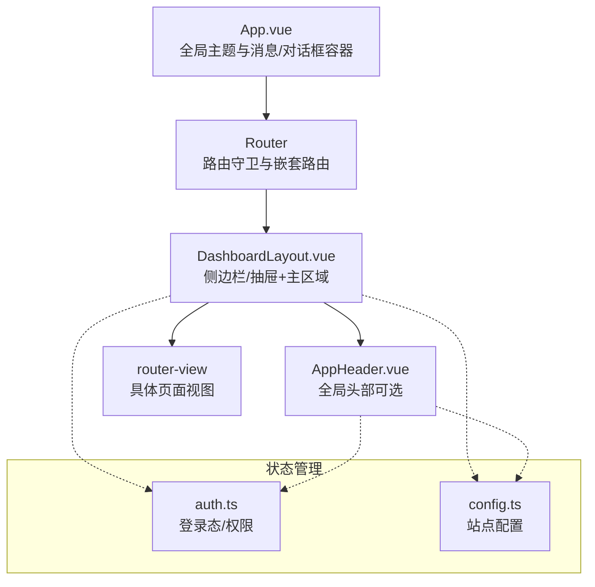
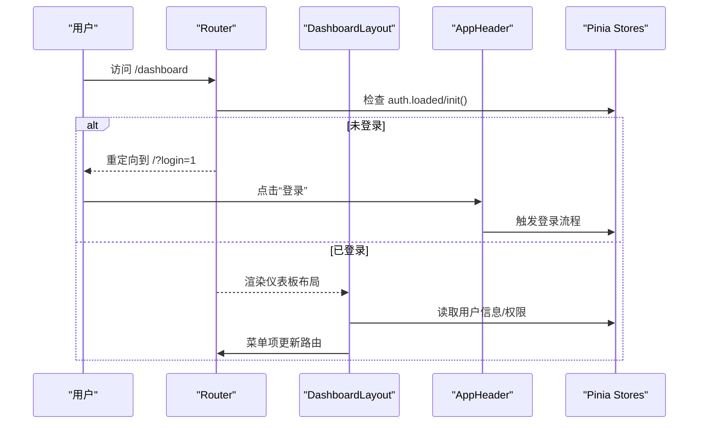
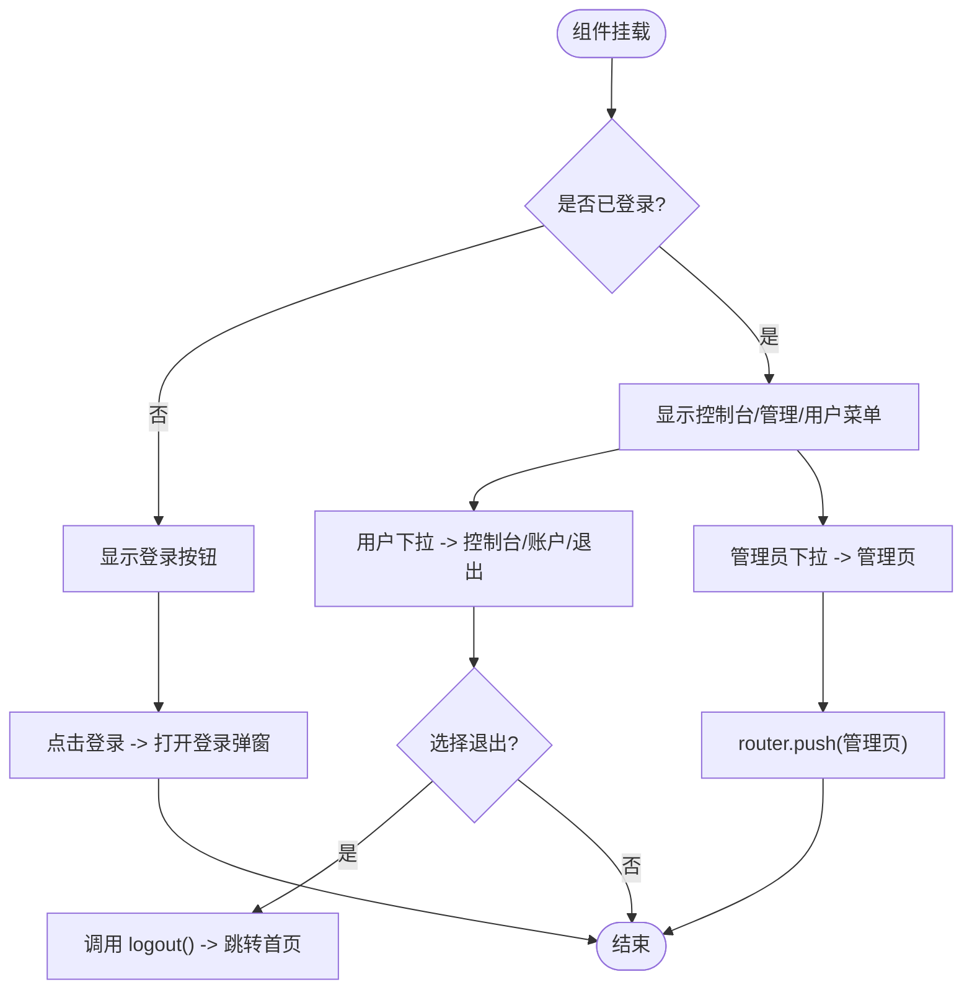
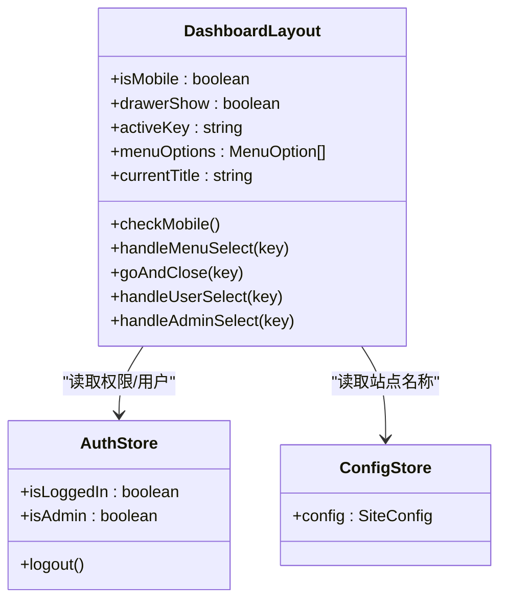
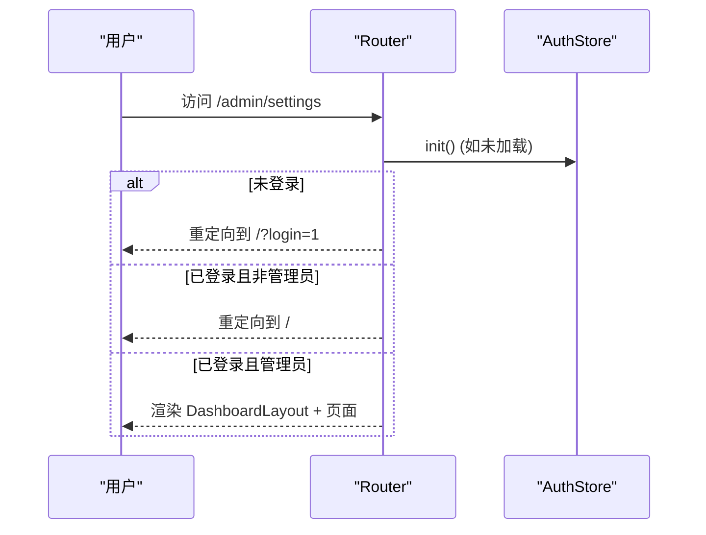
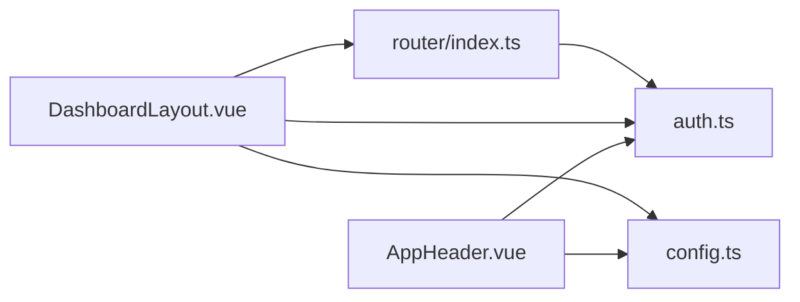

# 布局组件

<cite>
**本文引用的文件**
- [AppHeader.vue](file://frontend/src/components/AppHeader.vue)
- [DashboardLayout.vue](file://frontend/src/components/DashboardLayout.vue)
- [App.vue](file://frontend/src/App.vue)
- [index.ts](file://frontend/src/router/index.ts)
- [auth.ts](file://frontend/src/stores/auth.ts)
- [config.ts](file://frontend/src/stores/config.ts)
- [global.css](file://frontend/src/styles/global.css)
</cite>

## 目录
1. [简介](#简介)
2. [项目结构](#项目结构)
3. [核心组件](#核心组件)
4. [架构总览](#架构总览)
5. [详细组件分析](#详细组件分析)
6. [依赖关系分析](#依赖关系分析)
7. [性能考量](#性能考量)
8. [故障排查指南](#故障排查指南)
9. [结论](#结论)
10. [附录](#附录)

## 简介
本文件聚焦前端布局体系，围绕应用头部组件与仪表板布局组件展开，系统说明其结构设计、响应式适配、导航集成、状态管理与路由联动、主题定制与样式覆盖方案，以及 SEO 优化和无障碍访问支持。同时提供扩展与自定义指导，帮助开发者在现有基础上快速构建一致的页面骨架与交互体验。

## 项目结构
前端采用 Vue 3 + Naive UI + Vue Router + Pinia 的组合：
- 应用根组件负责全局主题与国际化配置，并挂载路由视图。
- 路由定义将受保护的页面统一嵌套在仪表板布局下，实现统一的侧边栏/顶部栏与内容区。
- 两个核心布局组件：
  - 应用头部 AppHeader：用于全局品牌展示、用户菜单、登录入口等。
  - 仪表板布局 DashboardLayout：包含桌面端侧边栏、移动端抽屉、页面标题栏与内容区。

图表来源
- [App.vue:1-30](file://frontend/src/App.vue#L1-L30)
- [index.ts:1-66](file://frontend/src/router/index.ts#L1-L66)
- [DashboardLayout.vue:1-249](file://frontend/src/components/DashboardLayout.vue#L1-L249)
- [AppHeader.vue:1-110](file://frontend/src/components/AppHeader.vue#L1-L110)
- [auth.ts:1-75](file://frontend/src/stores/auth.ts#L1-L75)
- [config.ts:1-37](file://frontend/src/stores/config.ts#L1-L37)

章节来源
- [App.vue:1-30](file://frontend/src/App.vue#L1-L30)
- [index.ts:1-66](file://frontend/src/router/index.ts#L1-L66)

## 核心组件
- 应用头部 AppHeader
  - 功能：品牌标识、控制台入口、管理员快捷菜单、用户下拉菜单、登录弹窗触发。
  - 状态：读取 auth 登录态与角色、读取 config 站点名称；监听路由变化以根据 query 打开登录弹窗。
  - 导航：通过 router.push 跳转至控制台或各管理页；退出登录调用 auth.logout。
  - 样式：粘性定位、毛玻璃背景、主题色渐变 Logo。

- 仪表板布局 DashboardLayout
  - 功能：桌面端侧边栏菜单、移动端抽屉菜单、页面标题栏、内容区渲染。
  - 响应式：基于 matchMedia 判断移动端，自动切换侧边栏与抽屉；窗口尺寸变化时同步状态。
  - 导航：菜单项与路由 path 绑定，选中态由 activeKey 计算属性驱动；移动端选择后自动关闭抽屉。
  - 权限：根据 auth.isAdmin 动态显示“管理后台”分组与右上角管理快捷菜单。
  - 标题：根据 route.path 映射到中文标题，未匹配时回退到站点名称。

章节来源
- [AppHeader.vue:1-110](file://frontend/src/components/AppHeader.vue#L1-L110)
- [DashboardLayout.vue:1-249](file://frontend/src/components/DashboardLayout.vue#L1-L249)

## 架构总览
整体布局遵循“壳层 + 内容”的模式：
- 根组件提供全局主题与消息/对话框能力。
- 路由守卫确保进入受保护路由前完成鉴权初始化，并在需要时重定向到首页并携带登录提示参数。
- 仪表板布局作为受保护页面的统一外壳，承载侧边栏/抽屉与页面标题栏。
- 头部组件可独立使用于非仪表板页面，提供一致的品牌与用户操作入口。

图表来源
- [index.ts:46-63](file://frontend/src/router/index.ts#L46-L63)
- [DashboardLayout.vue:73-90](file://frontend/src/components/DashboardLayout.vue#L73-L90)
- [AppHeader.vue:46-56](file://frontend/src/components/AppHeader.vue#L46-L56)
- [auth.ts:16-74](file://frontend/src/stores/auth.ts#L16-L74)

## 详细组件分析

### 应用头部 AppHeader
- 结构与职责
  - 左侧：Logo 与站点名称，点击返回首页。
  - 右侧：已登录状态下显示控制台按钮、管理员菜单、用户下拉菜单；未登录显示登录按钮。
  - 登录弹窗：通过 v-model 控制显示，路由查询参数 login=1 时自动弹出。
- 状态与数据流
  - 从 auth store 获取 isLoggedIn/isAdmin/user 信息。
  - 从 config store 获取 site_name。
  - 使用 router.afterEach 监听路由变化，当目标路由带有 login=1 时打开登录弹窗，并在卸载时移除监听避免重复。
- 导航与权限
  - 用户菜单：控制台、账户设置、退出登录。
  - 管理员菜单：概览、用户、套餐、节点、sing-box、服务器、监控、订单、设置。
  - 退出登录调用 auth.logout 并跳转首页。
- 样式与主题
  - 粘性定位、毛玻璃背景、主题变量 --accent/--border 等。
  - Logo 使用渐变背景，品牌名使用主题文本色。

图表来源
- [AppHeader.vue:8-34](file://frontend/src/components/AppHeader.vue#L8-L34)
- [AppHeader.vue:58-84](file://frontend/src/components/AppHeader.vue#L58-L84)
- [auth.ts:51-58](file://frontend/src/stores/auth.ts#L51-L58)

章节来源
- [AppHeader.vue:1-110](file://frontend/src/components/AppHeader.vue#L1-L110)
- [auth.ts:16-74](file://frontend/src/stores/auth.ts#L16-L74)
- [config.ts:16-35](file://frontend/src/stores/config.ts#L16-L35)

### 仪表板布局 DashboardLayout
- 结构与职责
  - 桌面端：固定宽度侧边栏，包含品牌区与多级菜单。
  - 移动端：隐藏侧边栏，通过左侧抽屉展示相同菜单。
  - 顶部栏：移动端显示汉堡菜单按钮，页面标题来自路由映射，右侧为用户与管理快捷入口。
  - 内容区：router-view 渲染当前路由对应的页面。
- 响应式适配
  - 使用 window.matchMedia('(max-width: 768px)') 判定移动端。
  - 窗口 resize 事件监听，保持 isMobile 与抽屉状态同步。
  - 移动端抽屉打开时 block-scroll 阻止背景滚动。
- 导航与路由联动
  - activeKey 由 route.path 计算得到，菜单高亮与路由保持一致。
  - 菜单项按分组组织：常用、商城、信息、账户设置；管理员可见“管理后台”分组。
  - 选择菜单项后调用 router.push 进行导航；移动端选择后自动关闭抽屉。
- 标题与元信息
  - 维护 titleMap 将路由路径映射为中文标题，未匹配时回退到站点名称。
- 权限控制
  - 仅管理员可见“管理后台”分组与右上角管理快捷菜单。
- 无障碍与可访问性
  - 汉堡按钮提供 aria-label="菜单"，便于屏幕阅读器识别。
  - 菜单项使用语义化标签与键盘可操作的 Naive UI 组件。

图表来源
- [DashboardLayout.vue:57-190](file://frontend/src/components/DashboardLayout.vue#L57-L190)
- [auth.ts:16-24](file://frontend/src/stores/auth.ts#L16-L24)
- [config.ts:16-35](file://frontend/src/stores/config.ts#L16-L35)

章节来源
- [DashboardLayout.vue:1-249](file://frontend/src/components/DashboardLayout.vue#L1-L249)
- [index.ts:6-44](file://frontend/src/router/index.ts#L6-L44)

### 路由与守卫
- 路由结构
  - 根路由 / 对应监控页。
  - 受保护路由以 DashboardLayout 为父级，子路由包括用户域与管理域页面。
- 前置守卫
  - 首次进入时等待 auth.init() 完成，恢复本地 token 并拉取用户信息。
  - requiresAuth 路由若未登录，重定向到首页并附加 query.login=1，以便头部组件打开登录弹窗。
  - requiresAdmin 路由若非管理员，重定向到首页。

图表来源
- [index.ts:46-63](file://frontend/src/router/index.ts#L46-L63)
- [auth.ts:60-71](file://frontend/src/stores/auth.ts#L60-L71)

章节来源
- [index.ts:1-66](file://frontend/src/router/index.ts#L1-L66)
- [auth.ts:16-74](file://frontend/src/stores/auth.ts#L16-L74)

### 主题定制与样式覆盖
- 全局主题
  - 根组件通过 Naive UI 的 NConfigProvider 注入主题覆盖，设置主色调、圆角等。
  - 全局 CSS 变量集中定义颜色、阴影、字体族等，供布局组件复用。
- 布局样式
  - 头部与布局均使用粘性定位与毛玻璃效果，提升视觉层次。
  - 侧边栏与内容区通过 Flexbox 布局，保证自适应与稳定高度。
  - 移动端针对标题与内容区调整内边距，提升小屏可读性。
- 覆盖策略
  - 优先使用 CSS 变量与 Naive UI 主题覆盖，避免直接修改组件源码。
  - 对第三方组件样式使用 :deep 选择器进行局部覆盖（如菜单分组标签）。

章节来源
- [App.vue:11-29](file://frontend/src/App.vue#L11-L29)
- [global.css:1-33](file://frontend/src/styles/global.css#L1-L33)
- [DashboardLayout.vue:192-249](file://frontend/src/components/DashboardLayout.vue#L192-L249)
- [AppHeader.vue:87-110](file://frontend/src/components/AppHeader.vue#L87-L110)

### SEO 优化与无障碍访问
- SEO
  - 当前路由历史模式为 Hash 模式，不利于搜索引擎抓取；建议在生产环境切换为 History 模式并配合后端重写规则。
  - 建议在页面组件中设置 document.title 与 meta 描述，结合站点配置动态更新。
- 无障碍
  - 汉堡按钮提供 aria-label，提升屏幕阅读器可用性。
  - 菜单与按钮使用语义化标签与键盘可操作组件，确保焦点顺序合理。
  - 颜色对比度遵循 WCAG AA 标准，文本与背景对比清晰。

章节来源
- [index.ts:1-5](file://frontend/src/router/index.ts#L1-L5)
- [DashboardLayout.vue:29-35](file://frontend/src/components/DashboardLayout.vue#L29-L35)
- [global.css:1-21](file://frontend/src/styles/global.css#L1-L21)

## 依赖关系分析
- 组件依赖
  - AppHeader 依赖 auth、config 与 LoginDialog，使用 Naive UI 组件与图标库。
  - DashboardLayout 依赖 auth、config，使用 Naive UI 的 Drawer、Menu、Dropdown 等。
- 路由依赖
  - 路由守卫依赖 auth.store 的 init 与状态，控制访问权限。
- 样式依赖
  - 布局组件依赖全局 CSS 变量与工具类，确保风格一致。

图表来源
- [AppHeader.vue:37-49](file://frontend/src/components/AppHeader.vue#L37-L49)
- [DashboardLayout.vue:57-76](file://frontend/src/components/DashboardLayout.vue#L57-L76)
- [index.ts:1-66](file://frontend/src/router/index.ts#L1-L66)

章节来源
- [AppHeader.vue:1-110](file://frontend/src/components/AppHeader.vue#L1-L110)
- [DashboardLayout.vue:1-249](file://frontend/src/components/DashboardLayout.vue#L1-L249)
- [index.ts:1-66](file://frontend/src/router/index.ts#L1-L66)

## 性能考量
- 路由懒加载：页面组件按需导入，减少首屏体积。
- 响应式计算：activeKey 与 menuOptions 使用 computed，避免不必要的重渲染。
- 事件监听：移动端尺寸监听在卸载时移除，防止内存泄漏。
- 主题与样式：使用 CSS 变量与局部覆盖，减少全局样式冲突与重绘。

[本节为通用性能建议，不直接分析具体文件]

## 故障排查指南
- 登录后仍被重定向到首页
  - 检查路由守卫是否正确处理 requiresAuth 与 requiresAdmin。
  - 确认 auth.init() 已完成并正确恢复 token 与用户信息。
- 移动端菜单无法关闭
  - 检查 goAndClose 是否在路由跳转后重置 drawerShow。
  - 确认 n-drawer 的 v-model:show 绑定正确。
- 管理员菜单不显示
  - 确认 auth.isAdmin 计算属性返回 true。
  - 检查路由 meta.requiresAdmin 与守卫逻辑。
- 标题未更新
  - 检查 titleMap 是否包含当前 route.path。
  - 确认 currentTitle 计算属性依赖 route.path。

章节来源
- [index.ts:46-63](file://frontend/src/router/index.ts#L46-L63)
- [DashboardLayout.vue:78-90](file://frontend/src/components/DashboardLayout.vue#L78-L90)
- [DashboardLayout.vue:158-166](file://frontend/src/components/DashboardLayout.vue#L158-L166)
- [auth.ts:16-24](file://frontend/src/stores/auth.ts#L16-L24)

## 结论
该布局体系通过 AppHeader 与 DashboardLayout 实现了统一的品牌展示、导航与内容框架，具备完善的响应式适配、权限控制与主题定制能力。结合路由守卫与状态管理，保证了受保护页面的安全与一致性。建议在后续迭代中进一步优化 SEO（切换 History 模式）、增强无障碍细节，并提供更灵活的菜单与主题扩展点。

[本节为总结性内容，不直接分析具体文件]

## 附录
- 扩展与自定义指导
  - 新增菜单项：在 DashboardLayout 的 menuOptions 中添加项，并确保路由存在。
  - 新增页面：在路由文件中注册新路由，必要时添加 requiresAuth 或 requiresAdmin 元信息。
  - 主题定制：通过 App.vue 的 themeOverrides 与全局 CSS 变量调整色彩与圆角。
  - 响应式行为：如需调整断点，修改 matchMedia 条件与移动端样式。
  - 无障碍增强：为交互元素补充 aria-* 属性与键盘操作支持。

[本节为通用指导，不直接分析具体文件]
