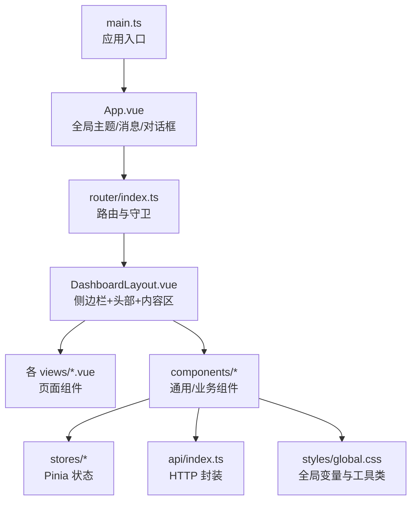
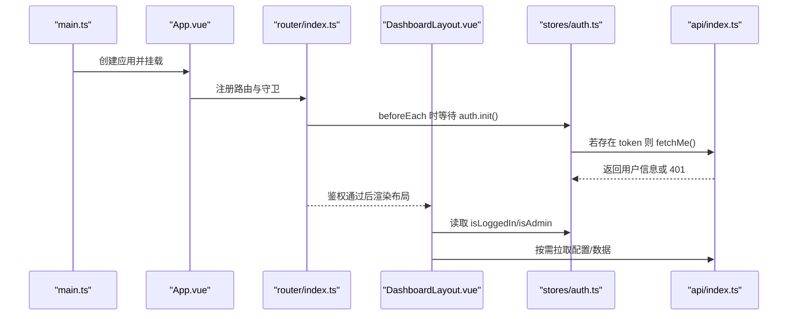
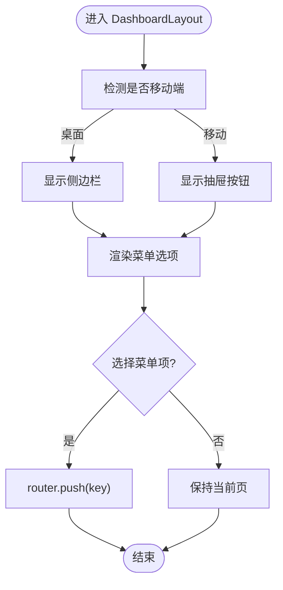
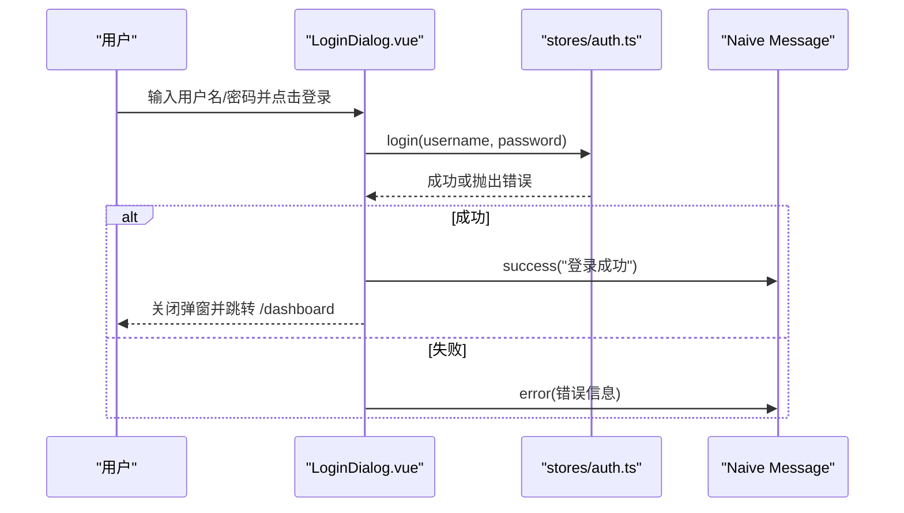
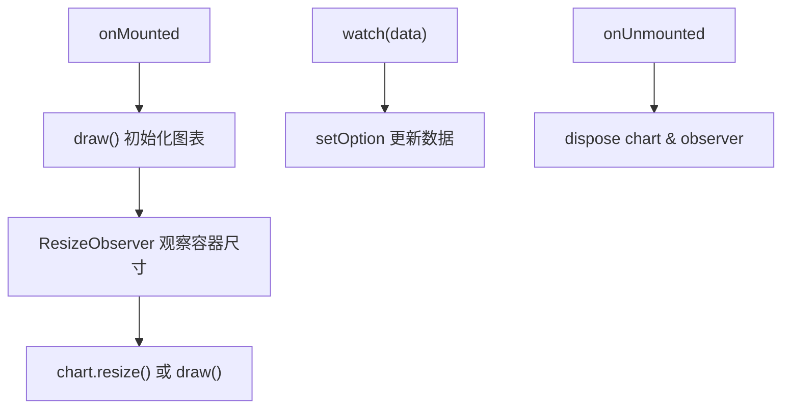
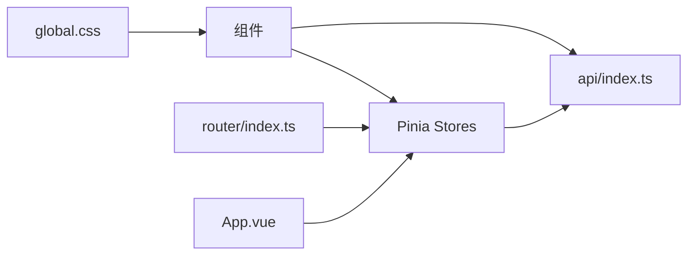

# 组件系统

<cite>
**本文引用的文件**
- [frontend/src/main.ts](file://frontend/src/main.ts)
- [frontend/src/App.vue](file://frontend/src/App.vue)
- [frontend/src/router/index.ts](file://frontend/src/router/index.ts)
- [frontend/src/components/DashboardLayout.vue](file://frontend/src/components/DashboardLayout.vue)
- [frontend/src/components/AppHeader.vue](file://frontend/src/components/AppHeader.vue)
- [frontend/src/components/LoginDialog.vue](file://frontend/src/components/LoginDialog.vue)
- [frontend/src/components/StatCard.vue](file://frontend/src/components/StatCard.vue)
- [frontend/src/components/TrafficTrendChart.vue](file://frontend/src/components/TrafficTrendChart.vue)
- [frontend/src/stores/auth.ts](file://frontend/src/stores/auth.ts)
- [frontend/src/stores/config.ts](file://frontend/src/stores/config.ts)
- [frontend/src/api/index.ts](file://frontend/src/api/index.ts)
- [frontend/src/styles/global.css](file://frontend/src/styles/global.css)
- [frontend/package.json](file://frontend/package.json)
</cite>

## 目录
1. [简介](#简介)
2. [项目结构](#项目结构)
3. [核心组件](#核心组件)
4. [架构总览](#架构总览)
5. [详细组件分析](#详细组件分析)
6. [依赖关系分析](#依赖关系分析)
7. [性能考量](#性能考量)
8. [故障排查指南](#故障排查指南)
9. [结论](#结论)
10. [附录](#附录)

## 简介
本文件面向前端开发者，系统化梳理本项目基于 Vue 3 的组件化体系与最佳实践。内容涵盖：
- 组件分类与职责边界（基础 UI、业务组件、页面组件）
- 组件通信机制（props、事件、Pinia 状态共享）
- 样式隔离与主题定制方案
- 开发规范、命名约定、测试策略与调试方法
- 可复用策略与扩展点

## 项目结构
前端采用 Vite + Vue 3 + TypeScript + Pinia + Vue Router + Naive UI 的技术栈。组件按“布局/通用/业务”分层组织，视图按“用户域/管理域”划分，状态集中在 Pinia Store，API 请求统一封装。

图表来源
- [frontend/src/main.ts:1-11](file://frontend/src/main.ts#L1-L11)
- [frontend/src/App.vue:1-30](file://frontend/src/App.vue#L1-L30)
- [frontend/src/router/index.ts:1-66](file://frontend/src/router/index.ts#L1-L66)
- [frontend/src/components/DashboardLayout.vue:1-249](file://frontend/src/components/DashboardLayout.vue#L1-L249)

章节来源
- [frontend/src/main.ts:1-11](file://frontend/src/main.ts#L1-L11)
- [frontend/src/App.vue:1-30](file://frontend/src/App.vue#L1-L30)
- [frontend/src/router/index.ts:1-66](file://frontend/src/router/index.ts#L1-L66)
- [frontend/package.json:1-27](file://frontend/package.json#L1-L27)

## 核心组件
- DashboardLayout：应用壳层，负责响应式侧边栏/抽屉、顶部标题、用户与管理快捷菜单、路由出口。
- AppHeader：轻量头部（非壳层场景），提供品牌、导航、登录弹窗入口。
- LoginDialog：登录/注册/找回密码弹窗，表单校验与流程编排。
- StatCard：统计卡片，支持点击态、徽章、入场动画与无障碍提示。
- TrafficTrendChart：基于 ECharts 的趋势图，处理数据更新、尺寸变化与销毁。
- Toast：占位组件，实际由 Naive UI 的全局消息容器承载。

章节来源
- [frontend/src/components/DashboardLayout.vue:1-249](file://frontend/src/components/DashboardLayout.vue#L1-L249)
- [frontend/src/components/AppHeader.vue:1-110](file://frontend/src/components/AppHeader.vue#L1-L110)
- [frontend/src/components/LoginDialog.vue:1-142](file://frontend/src/components/LoginDialog.vue#L1-L142)
- [frontend/src/components/StatCard.vue:1-77](file://frontend/src/components/StatCard.vue#L1-L77)
- [frontend/src/components/TrafficTrendChart.vue:1-102](file://frontend/src/components/TrafficTrendChart.vue#L1-L102)
- [frontend/src/components/Toast.vue:1-9](file://frontend/src/components/Toast.vue#L1-L9)

## 架构总览
应用启动后，创建 Vue 实例并挂载 Pinia 与 Router；App 注入 Naive UI 主题与全局消息/对话框；路由根据元信息执行鉴权守卫；DashboardLayout 作为布局容器渲染子路由；页面组件通过 Pinia 获取状态，调用 API 完成数据交互。

图表来源
- [frontend/src/main.ts:1-11](file://frontend/src/main.ts#L1-L11)
- [frontend/src/App.vue:1-30](file://frontend/src/App.vue#L1-L30)
- [frontend/src/router/index.ts:46-63](file://frontend/src/router/index.ts#L46-L63)
- [frontend/src/stores/auth.ts:16-75](file://frontend/src/stores/auth.ts#L16-L75)
- [frontend/src/api/index.ts:9-48](file://frontend/src/api/index.ts#L9-L48)

## 详细组件分析

### 布局组件：DashboardLayout
- 职责：构建应用骨架（侧边栏/移动端抽屉、头部、内容区），维护当前激活菜单项与标题映射，响应式切换。
- 通信：通过 Pinia 读取认证与站点配置；通过 router 进行导航；使用 Naive UI 的 Drawer/Menu/Dropdown。
- 关键点：
  - 移动端检测与抽屉开关
  - 动态菜单分组与图标渲染
  - 标题映射与站点名称兜底
  - 用户下拉与管理员快捷菜单

图表来源
- [frontend/src/components/DashboardLayout.vue:78-189](file://frontend/src/components/DashboardLayout.vue#L78-L189)

章节来源
- [frontend/src/components/DashboardLayout.vue:1-249](file://frontend/src/components/DashboardLayout.vue#L1-L249)

### 头部组件：AppHeader
- 职责：展示品牌、用户/管理员菜单、登录入口；监听路由参数自动弹出登录框。
- 通信：通过 Pinia 控制登录态；通过 router 跳转；内嵌 LoginDialog。
- 关键点：
  - afterEach 钩子中根据 query 打开登录弹窗
  - 退出登录逻辑与跳转

章节来源
- [frontend/src/components/AppHeader.vue:1-110](file://frontend/src/components/AppHeader.vue#L1-L110)

### 登录弹窗：LoginDialog
- 职责：提供登录/注册/找回密码三合一弹窗，含表单校验与错误提示。
- 通信：v-model:show 双向绑定；调用 auth.login/register/fetchMe；使用 message 反馈结果。
- 关键点：
  - 表单规则与邮箱校验
  - 注册模式与邀请码条件渲染
  - 失败时的错误提示与 loading 状态

图表来源
- [frontend/src/components/LoginDialog.vue:97-136](file://frontend/src/components/LoginDialog.vue#L97-L136)
- [frontend/src/stores/auth.ts:25-40](file://frontend/src/stores/auth.ts#L25-L40)

章节来源
- [frontend/src/components/LoginDialog.vue:1-142](file://frontend/src/components/LoginDialog.vue#L1-L142)
- [frontend/src/stores/auth.ts:16-75](file://frontend/src/stores/auth.ts#L16-L75)

### 统计卡片：StatCard
- 职责：展示指标值、标签、徽章与副文本；支持可点击态与入场动画延迟。
- 通信：props 传入 label/value/sub/badge 等；clickable 时触发 click 事件。
- 关键点：
  - 语义化 button/div 切换
  - 可访问性：aria-hidden 与 focus-visible
  - 减少动效偏好适配

章节来源
- [frontend/src/components/StatCard.vue:1-77](file://frontend/src/components/StatCard.vue#L1-L77)

### 趋势图：TrafficTrendChart
- 职责：渲染上行/下行流量堆叠面积图，支持数据更新与容器尺寸变化。
- 通信：接收 data 数组；内部维护 ECharts 实例与 ResizeObserver。
- 关键点：
  - 数据驱动重绘（watch deep）
  - 生命周期内初始化与销毁
  - tooltip 自定义合计行

图表来源
- [frontend/src/components/TrafficTrendChart.vue:21-96](file://frontend/src/components/TrafficTrendChart.vue#L21-L96)

章节来源
- [frontend/src/components/TrafficTrendChart.vue:1-102](file://frontend/src/components/TrafficTrendChart.vue#L1-L102)

### 全局消息：Toast
- 职责：占位组件，实际由 App.vue 中的 NMessageProvider 提供全局消息能力。
- 说明：无需额外逻辑，所有组件通过 useMessage 即可弹出消息。

章节来源
- [frontend/src/components/Toast.vue:1-9](file://frontend/src/components/Toast.vue#L1-L9)
- [frontend/src/App.vue:1-30](file://frontend/src/App.vue#L1-L30)

## 依赖关系分析
- 运行时依赖：Vue 3、Vue Router、Pinia、Naive UI、ECharts、图标库。
- 模块耦合：
  - 组件依赖 Pinia Store 获取认证与站点配置
  - 组件通过 api/index.ts 发起 HTTP 请求，统一处理鉴权头与错误
  - 路由守卫在 beforeEach 中协调认证初始化与权限控制
  - 全局样式与主题变量集中管理，组件通过 CSS 变量与 Naive 主题覆盖实现一致风格

图表来源
- [frontend/src/components/DashboardLayout.vue:57-76](file://frontend/src/components/DashboardLayout.vue#L57-L76)
- [frontend/src/stores/auth.ts:1-75](file://frontend/src/stores/auth.ts#L1-L75)
- [frontend/src/stores/config.ts:1-37](file://frontend/src/stores/config.ts#L1-L37)
- [frontend/src/api/index.ts:1-124](file://frontend/src/api/index.ts#L1-L124)
- [frontend/src/router/index.ts:1-66](file://frontend/src/router/index.ts#L1-L66)
- [frontend/src/styles/global.css:1-131](file://frontend/src/styles/global.css#L1-L131)

章节来源
- [frontend/package.json:1-27](file://frontend/package.json#L1-L27)
- [frontend/src/api/index.ts:1-124](file://frontend/src/api/index.ts#L1-L124)
- [frontend/src/router/index.ts:1-66](file://frontend/src/router/index.ts#L1-L66)

## 性能考量
- 懒加载路由：路由组件采用动态 import，减少首屏体积。
- 图表优化：ECharts 仅在可见且尺寸稳定时绘制，使用 ResizeObserver 避免频繁重绘；数据更新使用 setOption(true) 增量更新。
- 列表与菜单：使用虚拟滚动或分页（如需要）避免大量 DOM 节点。
- 资源清理：组件卸载时释放 ResizeObserver 与 ECharts 实例，防止内存泄漏。
- 主题与样式：通过 CSS 变量与 Naive 主题覆盖，减少重复样式与计算开销。

[本节为通用指导，不直接分析具体文件]

## 故障排查指南
- 401 未授权：
  - 现象：接口返回 401，自动登出并跳转至首页带登录参数。
  - 定位：检查 api/request 中对 401 的处理与路由守卫逻辑。
  - 参考路径：[frontend/src/api/index.ts:28-41](file://frontend/src/api/index.ts#L28-L41)、[frontend/src/router/index.ts:46-63](file://frontend/src/router/index.ts#L46-L63)
- 登录弹窗不关闭：
  - 现象：登录成功后弹窗仍显示。
  - 定位：确认 emit('update:show', false) 是否被调用。
  - 参考路径：[frontend/src/components/LoginDialog.vue:97-108](file://frontend/src/components/LoginDialog.vue#L97-L108)
- 图表不更新或不自适应：
  - 现象：数据变化无刷新或容器缩放后图表错位。
  - 定位：检查 watch(data) 与 ResizeObserver 是否正确触发。
  - 参考路径：[frontend/src/components/TrafficTrendChart.vue:78-96](file://frontend/src/components/TrafficTrendChart.vue#L78-L96)
- 主题不一致：
  - 现象：组件颜色与预期不符。
  - 定位：检查 App.vue 的 themeOverrides 与 global.css 的 CSS 变量。
  - 参考路径：[frontend/src/App.vue:16-24](file://frontend/src/App.vue#L16-L24)、[frontend/src/styles/global.css:1-21](file://frontend/src/styles/global.css#L1-L21)

章节来源
- [frontend/src/api/index.ts:28-41](file://frontend/src/api/index.ts#L28-L41)
- [frontend/src/router/index.ts:46-63](file://frontend/src/router/index.ts#L46-L63)
- [frontend/src/components/LoginDialog.vue:97-108](file://frontend/src/components/LoginDialog.vue#L97-L108)
- [frontend/src/components/TrafficTrendChart.vue:78-96](file://frontend/src/components/TrafficTrendChart.vue#L78-L96)
- [frontend/src/App.vue:16-24](file://frontend/src/App.vue#L16-L24)
- [frontend/src/styles/global.css:1-21](file://frontend/src/styles/global.css#L1-L21)

## 结论
本项目以清晰的组件分层、统一的 API 封装与 Pinia 状态管理构建了可扩展的前端组件系统。通过路由守卫保障安全，通过全局主题与 CSS 变量保证视觉一致性，通过合理的生命周期管理与资源清理确保性能与稳定性。遵循本文的开发规范与实践，可在现有基础上快速扩展新的业务组件与页面。

[本节为总结性内容，不直接分析具体文件]

## 附录

### 组件分类与职责
- 基础 UI 组件：StatCard、Toast（承载于全局 Provider）、以及基于 Naive UI 的原子控件组合。
- 业务组件：LoginDialog（登录/注册/找回密码流程）、TrafficTrendChart（可视化）。
- 布局/页面组件：DashboardLayout（应用壳层）、各 views/*.vue（按用户域/管理域划分）。

章节来源
- [frontend/src/components/StatCard.vue:1-77](file://frontend/src/components/StatCard.vue#L1-L77)
- [frontend/src/components/LoginDialog.vue:1-142](file://frontend/src/components/LoginDialog.vue#L1-L142)
- [frontend/src/components/TrafficTrendChart.vue:1-102](file://frontend/src/components/TrafficTrendChart.vue#L1-L102)
- [frontend/src/components/DashboardLayout.vue:1-249](file://frontend/src/components/DashboardLayout.vue#L1-L249)

### 组件通信机制
- Props：用于单向传递配置与数据（如 StatCard 的 label/value/badge）。
- 事件：子组件通过 $emit 触发事件（如 StatCard.click、LoginDialog.update:show）。
- 状态共享：通过 Pinia Store（auth、config）在组件间共享认证与站点配置。
- 路由通信：通过 router 进行页面级导航与参数传递（如登录后跳转、查询参数触发弹窗）。

章节来源
- [frontend/src/components/StatCard.vue:20-33](file://frontend/src/components/StatCard.vue#L20-L33)
- [frontend/src/components/LoginDialog.vue:62-69](file://frontend/src/components/LoginDialog.vue#L62-L69)
- [frontend/src/stores/auth.ts:16-75](file://frontend/src/stores/auth.ts#L16-L75)
- [frontend/src/stores/config.ts:16-37](file://frontend/src/stores/config.ts#L16-L37)
- [frontend/src/router/index.ts:46-63](file://frontend/src/router/index.ts#L46-L63)

### 开发规范与命名约定
- 组件命名：PascalCase，文件名与组件名一致（如 StatCard.vue）。
- 目录组织：components（通用/业务）、views（页面）、stores（状态）、api（请求）、styles（全局样式）。
- 类型定义：优先使用 TypeScript，接口与类型就近声明。
- 样式：优先使用 CSS 变量与 scoped，避免全局污染。
- 路由：按功能域分组，必要时使用 meta 标注权限要求。

章节来源
- [frontend/src/components/StatCard.vue:1-77](file://frontend/src/components/StatCard.vue#L1-L77)
- [frontend/src/components/LoginDialog.vue:1-142](file://frontend/src/components/LoginDialog.vue#L1-L142)
- [frontend/src/router/index.ts:1-66](file://frontend/src/router/index.ts#L1-L66)
- [frontend/src/styles/global.css:1-131](file://frontend/src/styles/global.css#L1-L131)

### 测试策略与调试方法
- 单元测试：对纯函数与工具方法（如格式化、Markdown 处理）编写用例。
- 组件测试：对关键交互（登录、图表渲染）进行快照或行为测试。
- 集成测试：验证路由守卫与 API 拦截器行为。
- 调试技巧：
  - 使用浏览器 Network 面板查看请求与响应
  - 使用 Vue DevTools 检查组件状态与事件流
  - 针对 401 与网络异常，结合 api/index.ts 的错误分支定位问题

[本节为通用指导，不直接分析具体文件]

### 样式隔离与主题定制
- 全局主题：通过 App.vue 的 Naive 主题覆盖与 global.css 的 CSS 变量统一管理色彩、圆角与阴影。
- 组件样式：使用 scoped 限制作用域，避免样式泄漏。
- 响应式：利用媒体查询与 CSS Grid/Flexbox 实现多端适配。
- 可访问性：关注焦点样式与减少动效偏好。

章节来源
- [frontend/src/App.vue:16-24](file://frontend/src/App.vue#L16-L24)
- [frontend/src/styles/global.css:1-131](file://frontend/src/styles/global.css#L1-L131)

### 最佳实践清单
- 将复杂交互下沉到独立组件，保持页面简洁。
- 使用 Pinia 管理跨组件状态，避免 props drilling。
- 统一 API 封装与错误处理，减少重复代码。
- 合理使用懒加载与按需引入，优化首屏性能。
- 为关键组件编写文档与示例，便于团队协作。

[本节为通用指导，不直接分析具体文件]
