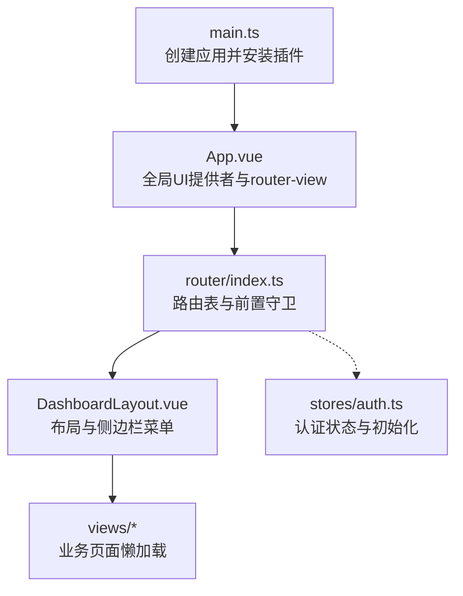
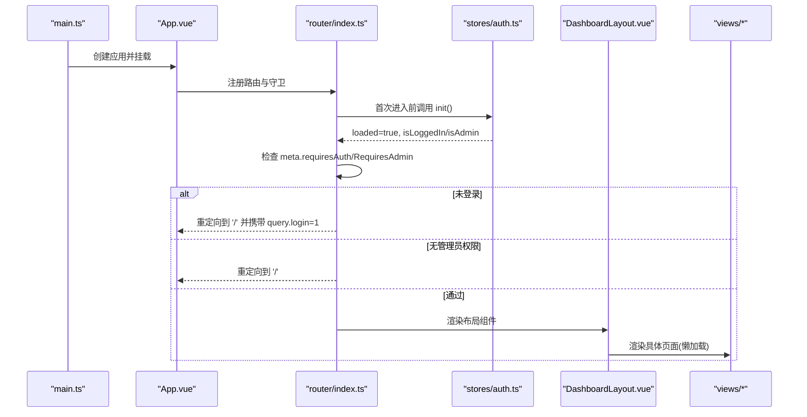
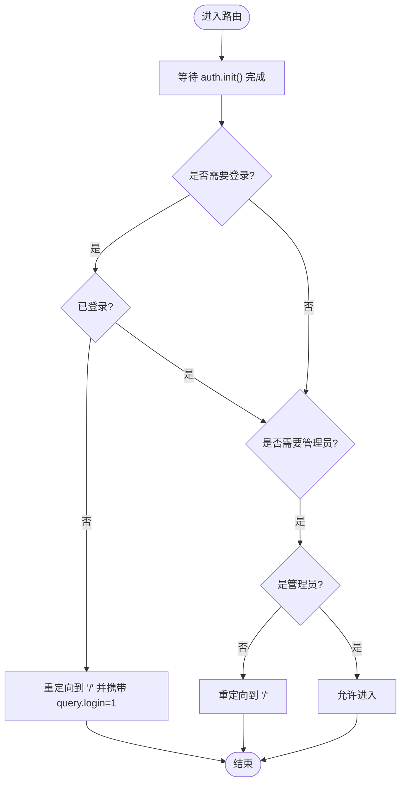
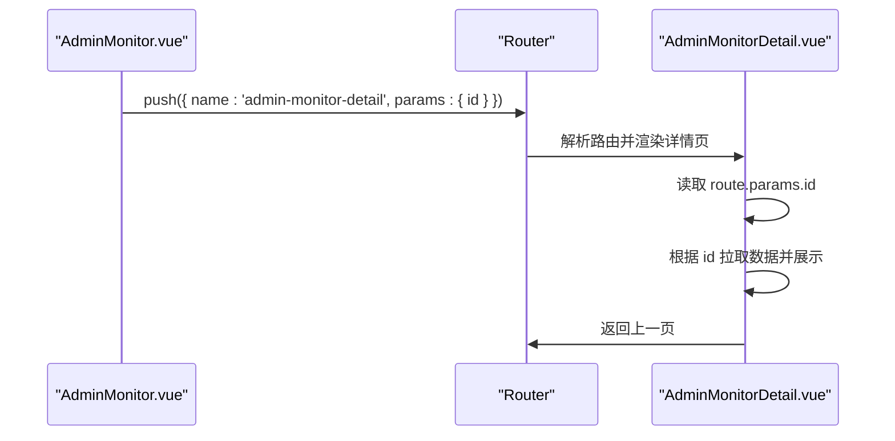
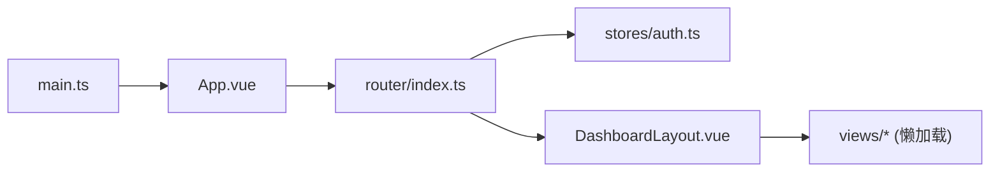

# 路由与导航

<cite>
**本文引用的文件**
- [frontend/src/router/index.ts](file://frontend/src/router/index.ts)
- [frontend/src/main.ts](file://frontend/src/main.ts)
- [frontend/src/App.vue](file://frontend/src/App.vue)
- [frontend/src/stores/auth.ts](file://frontend/src/stores/auth.ts)
- [frontend/src/components/DashboardLayout.vue](file://frontend/src/components/DashboardLayout.vue)
- [frontend/src/views/AdminMonitorDetail.vue](file://frontend/src/views/AdminMonitorDetail.vue)
</cite>

## 目录
1. [简介](#简介)
2. [项目结构](#项目结构)
3. [核心组件](#核心组件)
4. [架构总览](#架构总览)
5. [详细组件分析](#详细组件分析)
6. [依赖关系分析](#依赖关系分析)
7. [性能考虑](#性能考虑)
8. [故障排查指南](#故障排查指南)
9. [结论](#结论)
10. [附录](#附录)

## 简介
本章节面向前端开发者，系统化梳理本项目基于 Vue Router 的路由与导航实现。内容覆盖：
- 路由配置、历史模式与懒加载
- 路由守卫与权限控制（登录态、管理员）
- 动态路由生成与菜单绑定
- 页面间导航的参数传递与状态保持
- 路由懒加载与性能优化策略
- 路由调试工具与错误处理方案
- 面包屑导航与标签页管理（现状与建议）
- 最佳实践与常见问题

## 项目结构
前端采用 Vue 3 + TypeScript + Pinia + Vue Router 的组合，路由定义集中在 router 模块，通过 App 根组件挂载，并在 main.ts 中初始化应用。

图表来源
- [frontend/src/main.ts:1-11](file://frontend/src/main.ts#L1-L11)
- [frontend/src/App.vue:1-30](file://frontend/src/App.vue#L1-L30)
- [frontend/src/router/index.ts:1-66](file://frontend/src/router/index.ts#L1-L66)
- [frontend/src/components/DashboardLayout.vue:1-249](file://frontend/src/components/DashboardLayout.vue#L1-L249)
- [frontend/src/stores/auth.ts:1-75](file://frontend/src/stores/auth.ts#L1-L75)

章节来源
- [frontend/src/main.ts:1-11](file://frontend/src/main.ts#L1-L11)
- [frontend/src/App.vue:1-30](file://frontend/src/App.vue#L1-L30)
- [frontend/src/router/index.ts:1-66](file://frontend/src/router/index.ts#L1-L66)

## 核心组件
- 路由实例与历史模式
  - 使用 createWebHashHistory，适合静态部署或需要兼容的环境。
  - 路由表集中维护，子路由统一包裹在 DashboardLayout 下，便于共享布局与权限控制。
- 路由守卫
  - beforeEach 中等待 auth 初始化完成，再根据 meta.requiresAuth / requiresAdmin 进行跳转拦截。
  - 未登录时重定向到首页并附带查询参数以触发登录弹窗；非管理员访问管理路由时重定向至首页。
- 状态与权限
  - 通过 Pinia store 管理 token、用户信息、登录态与管理员标识，并提供 init/fetchMe/logout 等方法。
- 菜单与导航
  - 侧边栏菜单基于当前路由高亮，点击调用 router.push 进行导航。
  - 移动端使用抽屉菜单，关闭后同样执行导航。
- 动态路由与参数传递
  - 监控详情路由包含路径参数 id，详情页通过 useRoute.params 获取并请求数据。
  - 列表页通过命名路由与 params 跳转到详情页。

章节来源
- [frontend/src/router/index.ts:1-66](file://frontend/src/router/index.ts#L1-L66)
- [frontend/src/stores/auth.ts:1-75](file://frontend/src/stores/auth.ts#L1-L75)
- [frontend/src/components/DashboardLayout.vue:1-249](file://frontend/src/components/DashboardLayout.vue#L1-L249)
- [frontend/src/views/AdminMonitorDetail.vue:1-206](file://frontend/src/views/AdminMonitorDetail.vue#L1-L206)

## 架构总览
下图展示了从应用启动到页面渲染的完整流程，包括路由守卫、权限校验与懒加载。

图表来源
- [frontend/src/main.ts:1-11](file://frontend/src/main.ts#L1-L11)
- [frontend/src/App.vue:1-30](file://frontend/src/App.vue#L1-L30)
- [frontend/src/router/index.ts:1-66](file://frontend/src/router/index.ts#L1-L66)
- [frontend/src/stores/auth.ts:1-75](file://frontend/src/stores/auth.ts#L1-L75)
- [frontend/src/components/DashboardLayout.vue:1-249](file://frontend/src/components/DashboardLayout.vue#L1-L249)

## 详细组件分析

### 路由配置与懒加载
- 历史模式：createWebHashHistory，避免服务端路由配置。
- 路由组织：
  - 根路径为监控页（无需登录）。
  - 带布局的子路由统一放在 DashboardLayout 下，并通过 meta.requiresAuth 标记需登录。
  - 管理后台相关路由额外标记 meta.requiresAdmin。
- 懒加载：所有视图组件均使用动态 import，按需加载，减少首屏体积。

章节来源
- [frontend/src/router/index.ts:1-66](file://frontend/src/router/index.ts#L1-L66)

### 路由守卫与权限控制
- 初始化顺序：beforeEach 中先等待 auth.init() 完成，确保从 localStorage 恢复 token 并拉取用户信息。
- 权限判断：
  - requiresAuth：未登录则重定向到首页并附加 query.login=1，用于触发登录弹窗。
  - requiresAdmin：非管理员则重定向到首页。
- 状态持久化：token 保存在 localStorage，刷新后可自动恢复登录态。

图表来源
- [frontend/src/router/index.ts:46-63](file://frontend/src/router/index.ts#L46-L63)
- [frontend/src/stores/auth.ts:16-74](file://frontend/src/stores/auth.ts#L16-L74)

章节来源
- [frontend/src/router/index.ts:46-63](file://frontend/src/router/index.ts#L46-L63)
- [frontend/src/stores/auth.ts:16-74](file://frontend/src/stores/auth.ts#L16-L74)

### 动态路由生成与菜单绑定
- 菜单数据来源：DashboardLayout 内根据角色与功能分组构建菜单选项。
- 高亮逻辑：activeKey 基于当前 route.path，与菜单项 key 匹配。
- 导航行为：点击菜单项调用 router.push(key) 进行导航；移动端抽屉关闭后再导航。
- 可扩展性：如需后端下发菜单，可将 menuOptions 改为从接口获取并按权限过滤。

章节来源
- [frontend/src/components/DashboardLayout.vue:58-189](file://frontend/src/components/DashboardLayout.vue#L58-L189)

### 页面间导航与参数传递
- 命名路由与路径参数：
  - 列表页通过命名路由 admin-monitor-detail 并以 params.id 跳转到详情页。
  - 详情页通过 useRoute.params.id 获取参数并请求对应数据。
- 查询参数：
  - 未登录访问受保护路由时，重定向到首页并携带 query.login=1，用于触发登录弹窗。
- 返回导航：
  - 详情页提供“返回”按钮，使用 router.push({ name: 'admin-monitor' }) 回到列表。

图表来源
- [frontend/src/views/AdminMonitorDetail.vue:83-114](file://frontend/src/views/AdminMonitorDetail.vue#L83-L114)
- [frontend/src/router/index.ts:34-35](file://frontend/src/router/index.ts#L34-L35)

章节来源
- [frontend/src/views/AdminMonitorDetail.vue:83-114](file://frontend/src/views/AdminMonitorDetail.vue#L83-L114)
- [frontend/src/router/index.ts:34-35](file://frontend/src/router/index.ts#L34-L35)

### 路由懒加载与性能优化
- 懒加载：所有视图组件使用动态 import，仅在访问时加载，降低首屏包体。
- 建议优化：
  - 对超大组件进一步拆分或使用 Suspense 配合异步组件。
  - 结合浏览器缓存与 CDN 提升资源加载速度。
  - 对频繁切换的页面可考虑预加载关键路由。

章节来源
- [frontend/src/router/index.ts:6-43](file://frontend/src/router/index.ts#L6-L43)

### 面包屑导航与标签页管理
- 现状：
  - 当前布局未实现面包屑导航与多标签页（Tabs）功能。
  - 标题通过 titleMap 映射显示，仅支持单页标题。
- 建议实现：
  - 面包屑：基于路由层级与 meta.title 自动生成，支持点击跳转。
  - 标签页：使用 Pinia 维护打开的标签集合，结合 keep-alive 缓存页面状态，支持关闭与限制最大数量。

[本节为概念性说明，不直接分析具体文件]

## 依赖关系分析
- 入口依赖：
  - main.ts 引入 App.vue 与 router，并安装 Pinia 与 Router。
- 路由依赖：
  - router/index.ts 依赖 stores/auth.ts 进行权限判断。
- 组件依赖：
  - DashboardLayout.vue 依赖 vue-router 与 naive-ui 组件库，同时消费 auth store。
  - 各视图组件按需懒加载，减少初始依赖。

图表来源
- [frontend/src/main.ts:1-11](file://frontend/src/main.ts#L1-L11)
- [frontend/src/App.vue:1-30](file://frontend/src/App.vue#L1-L30)
- [frontend/src/router/index.ts:1-66](file://frontend/src/router/index.ts#L1-L66)
- [frontend/src/stores/auth.ts:1-75](file://frontend/src/stores/auth.ts#L1-L75)
- [frontend/src/components/DashboardLayout.vue:1-249](file://frontend/src/components/DashboardLayout.vue#L1-L249)

章节来源
- [frontend/src/main.ts:1-11](file://frontend/src/main.ts#L1-L11)
- [frontend/src/router/index.ts:1-66](file://frontend/src/router/index.ts#L1-L66)
- [frontend/src/stores/auth.ts:1-75](file://frontend/src/stores/auth.ts#L1-L75)
- [frontend/src/components/DashboardLayout.vue:1-249](file://frontend/src/components/DashboardLayout.vue#L1-L249)

## 性能考虑
- 首屏优化：
  - 使用 Hash 历史模式，避免服务端路由配置开销。
  - 视图组件全部懒加载，显著减小首屏体积。
- 运行时优化：
  - 路由守卫中延迟初始化 auth，避免阻塞首次导航。
  - 菜单与标题计算使用 computed，减少重复计算。
- 建议：
  - 对大图表或重型组件使用按需加载与虚拟滚动。
  - 合理使用 keep-alive 缓存常用页面，减少重复渲染。

[本节提供通用指导，不直接分析具体文件]

## 故障排查指南
- 登录后仍被重定向到首页
  - 检查 auth.init() 是否成功恢复 token 并拉取用户信息。
  - 确认路由 meta.requiresAuth 是否正确设置。
- 管理员路由无法访问
  - 检查用户 is_admin 字段是否正确返回。
  - 确认路由 meta.requiresAdmin 是否添加。
- 详情页参数为空
  - 检查跳转时是否传入正确的命名路由与 params。
  - 确认详情页是否正确读取 route.params.id。
- 登录弹窗未触发
  - 检查重定向时是否携带 query.login=1。
  - 确认首页或头部组件是否监听该查询参数并弹出登录框。

章节来源
- [frontend/src/router/index.ts:46-63](file://frontend/src/router/index.ts#L46-L63)
- [frontend/src/stores/auth.ts:42-74](file://frontend/src/stores/auth.ts#L42-L74)
- [frontend/src/views/AdminMonitorDetail.vue:83-114](file://frontend/src/views/AdminMonitorDetail.vue#L83-L114)

## 结论
本项目基于 Vue Router 实现了清晰的路由结构与完善的权限控制机制，通过懒加载与合理的守卫设计保障了用户体验与安全性。后续可在现有基础上扩展面包屑与标签页能力，进一步提升导航效率与信息密度。

[本节为总结性内容，不直接分析具体文件]

## 附录
- 路由调试工具
  - 浏览器开发者工具的 Network 面板：查看路由跳转与 API 请求。
  - Vue DevTools：观察路由变化与组件状态。
  - 控制台日志：在路由守卫与页面组件中添加必要日志辅助定位问题。
- 常见最佳实践
  - 将敏感路由统一通过 meta 标记，并在守卫中集中校验。
  - 使用命名路由与 params 进行页面间传参，提高可读性与可维护性。
  - 对大型页面实施懒加载，并结合骨架屏提升感知性能。
  - 对跨页面状态使用 Pinia 管理，避免 props 透传过深。

[本节为通用指导，不直接分析具体文件]
