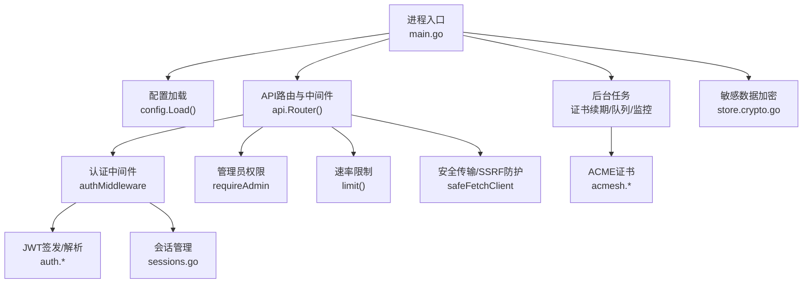
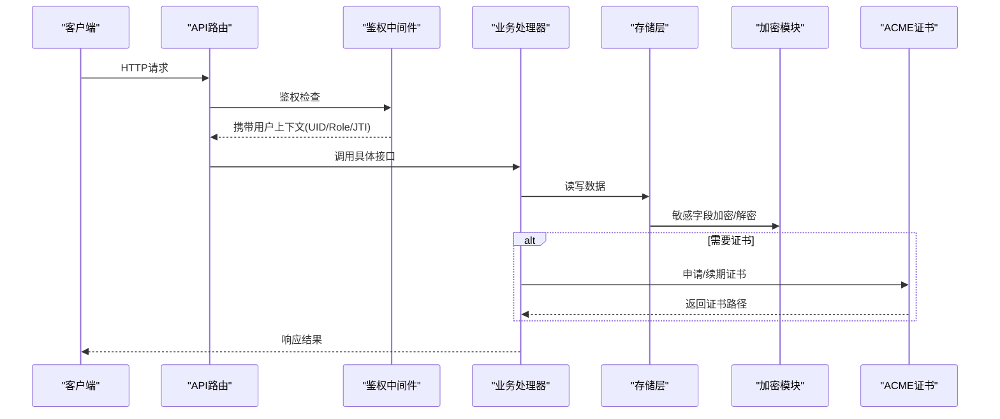
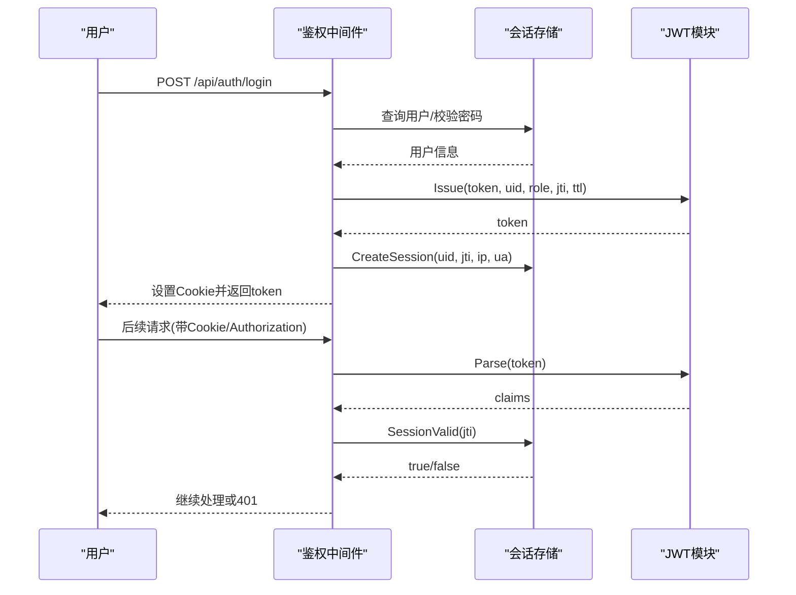
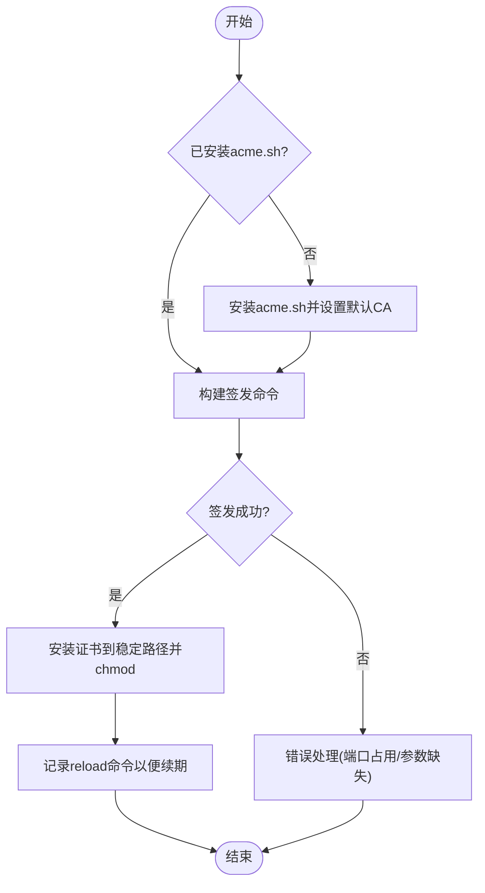
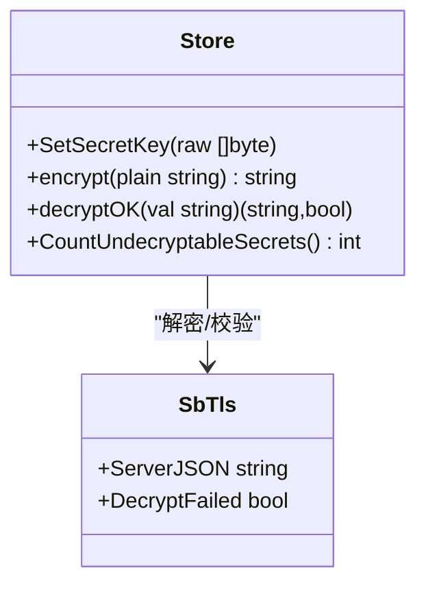
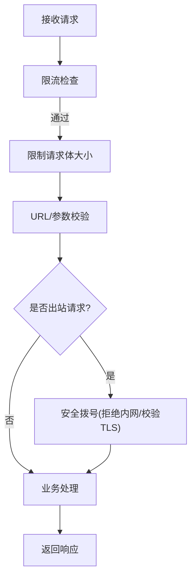
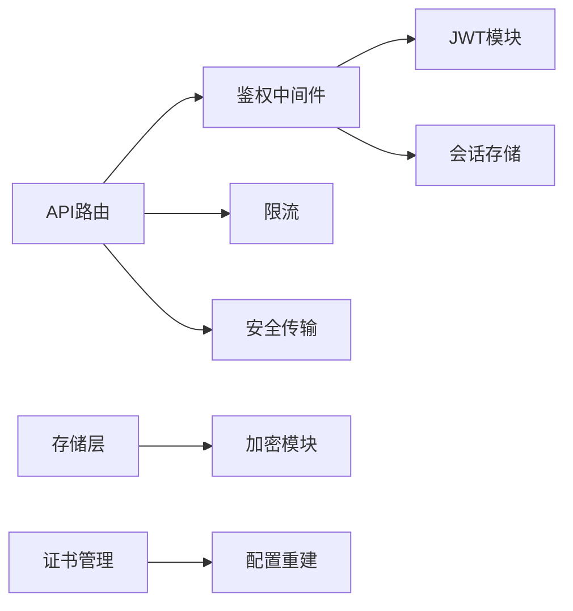

# 安全设计

<cite>
**本文引用的文件**
- [main.go](file://main.go)
- [internal/config/config.go](file://internal/config/config.go)
- [internal/api/router.go](file://internal/api/router.go)
- [internal/api/auth.go](file://internal/api/auth.go)
- [internal/api/sessions.go](file://internal/api/sessions.go)
- [internal/api/safehttp.go](file://internal/api/safehttp.go)
- [internal/api/ratelimit.go](file://internal/api/ratelimit.go)
- [internal/api/admin.go](file://internal/api/admin.go)
- [internal/api/server_admin.go](file://internal/api/server_admin.go)
- [internal/auth/jwt.go](file://internal/auth/jwt.go)
- [internal/auth/password.go](file://internal/auth/password.go)
- [internal/store/crypto.go](file://internal/store/crypto.go)
- [internal/store/singbox.go](file://internal/store/singbox.go)
- [internal/acmesh/acmesh.go](file://internal/acmesh/acmesh.go)
</cite>

## 目录
1. [简介](#简介)
2. [项目结构](#项目结构)
3. [核心组件](#核心组件)
4. [架构总览](#架构总览)
5. [详细组件分析](#详细组件分析)
6. [依赖关系分析](#依赖关系分析)
7. [性能与安全权衡](#性能与安全权衡)
8. [故障排查指南](#故障排查指南)
9. [结论](#结论)
10. [附录：配置与审计清单](#附录配置与审计清单)

## 简介
本文件面向安全工程师与开发者，系统化梳理系统的安全设计，覆盖认证授权、会话管理、令牌生命周期、密码存储、HTTPS/TLS/ACME证书自动化、敏感数据加密与密钥管理、网络安全防护（SSRF/XSS/注入等）、权限控制模型、安全配置最佳实践、安全审计方法与事件响应流程。文档基于代码实现进行说明，并提供可视化图示帮助理解。

## 项目结构
- 后端入口与启动流程：负责加载配置、初始化数据库、设置JWT签名密钥与数据加密密钥、启动HTTP服务、后台任务（证书续期、队列推进、监控任务等）。
- API路由与中间件：统一请求限流、最大请求体限制、超时、恢复、压缩、鉴权中间件、管理员权限校验。
- 认证与授权：JWT签发与解析、Cookie安全设置、登录/登出、设备会话列表与吊销、防枚举时序攻击。
- 数据存储与加密：敏感设置与TLS/Reality配置在库中按字段或JSON块加密存储；提供解密失败检测与告警。
- 证书管理：通过acme.sh集成Let's Encrypt，支持HTTP-01、Webroot、DNS-01（Cloudflare）三种验证方式，自动安装并定期续期。
- 网络安全：出站请求强制TLS校验并拒绝内网地址（防SSRF/DNS重绑定），输入URL白名单校验，请求体大小限制。

图表来源
- [main.go:25-142](file://main.go#L25-L142)
- [internal/api/router.go:132-386](file://internal/api/router.go#L132-L386)
- [internal/api/auth.go:179-213](file://internal/api/auth.go#L179-L213)
- [internal/api/safehttp.go:27-56](file://internal/api/safehttp.go#L27-L56)
- [internal/acmesh/acmesh.go:193-240](file://internal/acmesh/acmesh.go#L193-L240)
- [internal/store/crypto.go:17-77](file://internal/store/crypto.go#L17-L77)

章节来源
- [main.go:25-142](file://main.go#L25-L142)
- [internal/api/router.go:132-386](file://internal/api/router.go#L132-L386)

## 核心组件
- 认证与授权
  - JWT令牌：HS256签名，包含用户ID、角色、唯一标识（jti）、签发时间、过期时间；支持从Cookie或Authorization头读取。
  - 密码存储：bcrypt默认强度哈希；登录失败时采用dummy比较以恒定耗时，防止用户名枚举。
  - 会话管理：登录创建会话记录（IP+UA去重），支持列出当前在线设备、吊销指定设备；登出清理Cookie并删除会话。
- 数据传输安全
  - HTTPS/TLS：通过ACME自动签发与安装证书，支持多种验证方式；面板自身建议置于反向代理后启用HTTPS。
  - 出站安全：自定义http.Client强制TLS校验，拨号前解析域名并拒绝内网/回环/CGNAT地址，避免DNS重绑定。
- 敏感数据加密与密钥管理
  - 使用AES-GCM对敏感设置（如SMTP密码、Cloudflare Token）和sing-box TLS/Reality配置进行落盘加密；支持“失败即空”的关闭路径，避免明文泄露。
  - 密钥来源：优先QZ_SECRET_KEY环境变量，否则回退到jwt_secret；启动时统计不可解密条目数量，异常则阻断下发。
- 网络安全防护
  - SSRF防护：仅允许http/https协议，禁止file/gopher等危险协议；出站连接拒绝访问内网地址。
  - 请求体限制：全局最大请求体限制，防止内存压力。
  - 速率限制：针对认证、邮件重发、探针上报、订阅地址切换等接口实施每IP/每用户的固定窗口限流。
- 权限控制
  - 基于角色的访问控制：普通用户与管理员分离；管理员接口需额外校验role=admin。
  - 敏感设置保护：部分设置键不可写（如update_repo、jwt_secret），防止通过API篡改更新源或签名密钥。

章节来源
- [internal/auth/jwt.go:10-42](file://internal/auth/jwt.go#L10-L42)
- [internal/auth/password.go:5-23](file://internal/auth/password.go#L5-L23)
- [internal/api/auth.go:49-65](file://internal/api/auth.go#L49-L65)
- [internal/api/auth.go:112-149](file://internal/api/auth.go#L112-L149)
- [internal/api/auth.go:165-213](file://internal/api/auth.go#L165-L213)
- [internal/api/sessions.go:10-42](file://internal/api/sessions.go#L10-L42)
- [internal/api/safehttp.go:12-86](file://internal/api/safehttp.go#L12-L86)
- [internal/api/ratelimit.go:9-65](file://internal/api/ratelimit.go#L9-L65)
- [internal/api/admin.go:13-32](file://internal/api/admin.go#L13-L32)
- [internal/store/crypto.go:17-130](file://internal/store/crypto.go#L17-L130)
- [internal/acmesh/acmesh.go:59-77](file://internal/acmesh/acmesh.go#L59-L77)

## 架构总览
下图展示从请求进入、鉴权、业务处理到数据落盘与证书管理的整体安全链路。

图表来源
- [internal/api/router.go:132-386](file://internal/api/router.go#L132-L386)
- [internal/api/auth.go:179-213](file://internal/api/auth.go#L179-L213)
- [internal/store/crypto.go:17-77](file://internal/store/crypto.go#L17-L77)
- [internal/acmesh/acmesh.go:193-240](file://internal/acmesh/acmesh.go#L193-L240)

## 详细组件分析

### 认证与授权（JWT + 会话）
- 登录流程
  - 校验用户名是否存在并进行恒定耗时的密码比对，防止枚举。
  - 成功后创建会话（记录IP、UA、JTI），签发JWT（HS256），设置HttpOnly Cookie（根据是否HTTPS决定Secure标志）。
- 鉴权流程
  - 从Authorization头或Cookie提取Token，解析并校验签名与有效期。
  - 校验会话仍存在（支持远程注销/吊销），刷新会话时间戳。
  - 将UID、Role、JTI注入上下文供后续处理器使用。
- 会话管理
  - 列出当前在线设备（去重IP+UA，清理过期会话）。
  - 吊销指定设备会话，立即失效对应JTI。
  - 登出删除会话并清空Cookie。

图表来源
- [internal/api/auth.go:112-149](file://internal/api/auth.go#L112-L149)
- [internal/api/auth.go:179-213](file://internal/api/auth.go#L179-L213)
- [internal/api/sessions.go:10-42](file://internal/api/sessions.go#L10-L42)
- [internal/auth/jwt.go:16-42](file://internal/auth/jwt.go#L16-L42)

章节来源
- [internal/api/auth.go:112-149](file://internal/api/auth.go#L112-L149)
- [internal/api/auth.go:165-213](file://internal/api/auth.go#L165-L213)
- [internal/api/sessions.go:10-42](file://internal/api/sessions.go#L10-L42)
- [internal/auth/jwt.go:16-42](file://internal/auth/jwt.go#L16-L42)
- [internal/auth/password.go:5-23](file://internal/auth/password.go#L5-L23)

### 数据传输安全（HTTPS/TLS/ACME）
- ACME集成
  - 支持HTTP-01、Webroot、DNS-01（Cloudflare）三种验证方式。
  - 自动安装acme.sh并固定版本，设置默认CA为Let's Encrypt。
  - 签发后将证书与私钥写入稳定路径，设置严格权限（目录700、私钥600）。
  - 通过记录的reload命令实现自动续期与热重载。
- 证书引用
  - 面板内置证书中心，可被TLS配置引用；引用后由构建时注入PEM，避免路径不一致问题。
  - 若证书无法解密（密钥不匹配），拒绝生成配置，防止降级为明文入站。

图表来源
- [internal/acmesh/acmesh.go:91-124](file://internal/acmesh/acmesh.go#L91-L124)
- [internal/acmesh/acmesh.go:126-173](file://internal/acmesh/acmesh.go#L126-L173)
- [internal/acmesh/acmesh.go:189-240](file://internal/acmesh/acmesh.go#L189-L240)

章节来源
- [internal/acmesh/acmesh.go:59-77](file://internal/acmesh/acmesh.go#L59-L77)
- [internal/acmesh/acmesh.go:91-124](file://internal/acmesh/acmesh.go#L91-L124)
- [internal/acmesh/acmesh.go:189-240](file://internal/acmesh/acmesh.go#L189-L240)

### 敏感数据加密与密钥管理
- 加密策略
  - 对敏感设置（smtp_pass、cf_api_token等）与sing-box TLS/Reality JSON块进行AES-GCM加密存储。
  - 密文带有前缀标识，便于识别与兼容历史明文。
  - 解密失败返回空值且标记失败，调用方必须检查，避免静默降级。
- 密钥来源与自检
  - 优先使用QZ_SECRET_KEY环境变量；未设置时回退到jwt_secret并给出警告。
  - 启动时统计不可解密条目数量，非零则提示操作者恢复正确密钥。
- 输出保护
  - 返回给前端的服务器凭据会被掩码（***），防止敏感信息外泄。

图表来源
- [internal/store/crypto.go:17-130](file://internal/store/crypto.go#L17-L130)
- [internal/store/singbox.go:15-38](file://internal/store/singbox.go#L15-L38)
- [internal/api/server_admin.go:21-37](file://internal/api/server_admin.go#L21-L37)

章节来源
- [internal/store/crypto.go:17-130](file://internal/store/crypto.go#L17-L130)
- [internal/store/singbox.go:15-38](file://internal/store/singbox.go#L15-L38)
- [internal/api/server_admin.go:21-37](file://internal/api/server_admin.go#L21-L37)

### 网络安全防护（SSRF/XSS/注入/限流）
- SSRF防护
  - 出站请求强制TLS校验，拨号前解析域名并拒绝内网/回环/CGNAT地址，直接连接首个合法IP以避免DNS重绑定。
  - 用户提供的fetch URL仅允许http/https，拒绝其他危险协议。
- 输入与资源限制
  - 全局最大请求体限制，防止恶意大POST导致内存压力。
  - 对认证、邮件重发、探针上报、订阅地址切换等接口实施固定窗口限流。
- XSS与注入防护
  - 前端模板渲染与后端API输出遵循最小暴露原则；敏感字段不回显明文。
  - 建议在前端对用户输入进行转义与校验（结合框架能力），后端对关键参数进行类型与范围校验。

图表来源
- [internal/api/safehttp.go:27-86](file://internal/api/safehttp.go#L27-L86)
- [internal/api/ratelimit.go:9-65](file://internal/api/ratelimit.go#L9-L65)
- [internal/api/router.go:144-147](file://internal/api/router.go#L144-L147)

章节来源
- [internal/api/safehttp.go:27-86](file://internal/api/safehttp.go#L27-L86)
- [internal/api/ratelimit.go:9-65](file://internal/api/ratelimit.go#L9-L65)
- [internal/api/router.go:144-147](file://internal/api/router.go#L144-L147)

### 权限控制模型与访问控制策略
- 角色分离
  - 普通用户：访问个人数据、订阅、节点管理等。
  - 管理员：访问设置、节点管理、证书中心、重建配置等。
- 中间件保障
  - 所有受保护路由均经过鉴权中间件，管理员路由额外校验role=admin。
- 敏感设置保护
  - 某些设置键不可通过API修改（如update_repo、jwt_secret），防止越权篡改。

章节来源
- [internal/api/auth.go:204-213](file://internal/api/auth.go#L204-L213)
- [internal/api/admin.go:13-32](file://internal/api/admin.go#L13-L32)
- [internal/api/router.go:177-375](file://internal/api/router.go#L177-L375)

## 依赖关系分析
- 组件耦合
  - API路由依赖鉴权中间件、限流、安全传输等通用能力。
  - 存储层依赖加密模块对敏感数据进行加解密。
  - 证书管理独立于业务逻辑，通过回调触发配置重建。
- 外部依赖
  - acme.sh用于证书签发与续期。
  - bcrypt用于密码哈希。
  - JWT库用于令牌签发与解析。

图表来源
- [internal/api/router.go:132-386](file://internal/api/router.go#L132-L386)
- [internal/api/auth.go:179-213](file://internal/api/auth.go#L179-L213)
- [internal/store/crypto.go:17-130](file://internal/store/crypto.go#L17-L130)
- [internal/acmesh/acmesh.go:193-240](file://internal/acmesh/acmesh.go#L193-L240)

章节来源
- [internal/api/router.go:132-386](file://internal/api/router.go#L132-L386)
- [internal/api/auth.go:179-213](file://internal/api/auth.go#L179-L213)
- [internal/store/crypto.go:17-130](file://internal/store/crypto.go#L17-L130)
- [internal/acmesh/acmesh.go:193-240](file://internal/acmesh/acmesh.go#L193-L240)

## 性能与安全权衡
- 请求体限制与压缩：在保证带宽收益的同时限制最大请求体，避免内存滥用。
- 会话活跃检测：定期清理过期会话，减少存储膨胀与无效计数。
- 证书续期：后台定时任务与acme.sh cron协同，确保证书不过期且无需人工干预。
- 限流策略：平衡用户体验与抗暴力破解/短信轰炸能力，按IP/用户维度精细化控制。

[本节为通用指导，不直接分析具体文件]

## 故障排查指南
- 登录失败
  - 检查用户名是否存在与密码是否正确；注意系统采用恒定耗时比较，错误提示一致。
  - 检查会话是否被吊销或过期。
- 证书问题
  - 确认acme.sh已安装且默认CA设置为Let's Encrypt。
  - 检查端口占用（HTTP-01需80端口空闲），必要时改用Webroot或DNS-01。
  - 查看日志中的错误输出，定位具体失败原因。
- 敏感数据解密失败
  - 检查QZ_SECRET_KEY是否与加密时一致；若变更，恢复原值或重新加密受影响数据。
  - 关注启动日志中的不可解密条目数量，及时修复。
- 出站请求失败
  - 检查目标是否为内网地址或被拒绝；确认DNS解析结果与TLS校验。

章节来源
- [internal/api/auth.go:112-149](file://internal/api/auth.go#L112-L149)
- [internal/acmesh/acmesh.go:189-240](file://internal/acmesh/acmesh.go#L189-L240)
- [internal/store/crypto.go:79-130](file://internal/store/crypto.go#L79-L130)
- [internal/api/safehttp.go:27-56](file://internal/api/safehttp.go#L27-L56)

## 结论
系统在认证授权、会话管理、密码存储、HTTPS/TLS/ACME证书自动化、敏感数据加密与密钥管理、网络安全防护等方面具备完善的设计与实现。通过严格的中间件、限流、SSRF防护与权限控制，有效降低了常见安全风险。建议在生产环境中遵循最佳实践配置，并建立持续的安全审计与事件响应机制。

[本节为总结性内容，不直接分析具体文件]

## 附录：配置与审计清单
- 安全配置最佳实践
  - 设置QZ_SECRET_KEY环境变量，避免与jwt_secret混用。
  - 将面板置于反向代理后，启用HTTPS并配置强TLS策略。
  - 使用ACME DNS-01方式签发通配符证书，减少端口占用风险。
  - 限制监听地址与端口，仅暴露必要服务。
  - 启用请求体大小限制与超时配置。
- 安全审计方法
  - 定期检查不可解密条目数量，确保密钥一致性。
  - 审计登录失败次数与IP分布，识别潜在暴力破解。
  - 审查管理员操作日志，关注敏感设置变更。
  - 验证证书有效期与续期状态，确保无中断风险。
- 安全漏洞修复与事件响应流程
  - 发现漏洞后，优先隔离受影响服务，回滚至已知安全版本。
  - 评估影响范围，修补代码或配置，重新部署并验证。
  - 记录事件时间线、根因分析与改进措施，更新应急预案。
  - 通知相关干系人，必要时对外公告。

[本节为通用指导，不直接分析具体文件]
