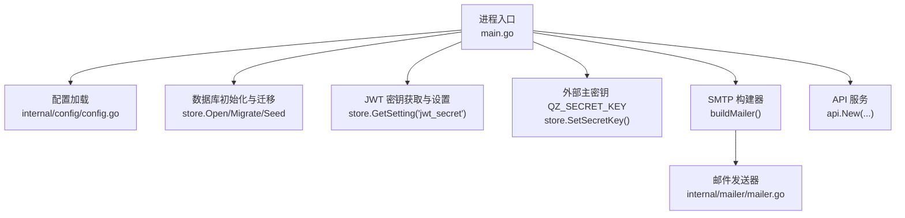
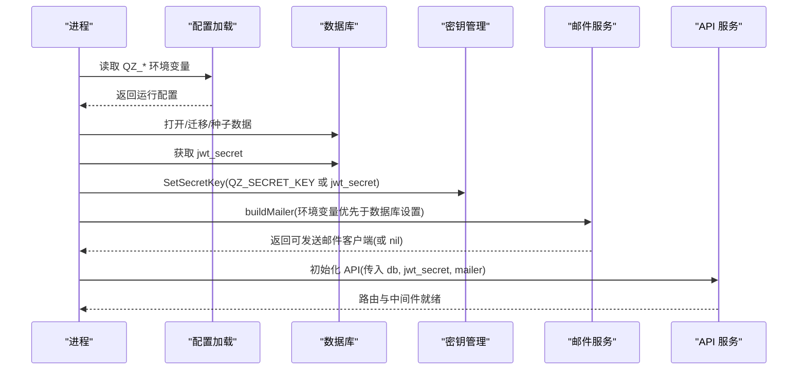
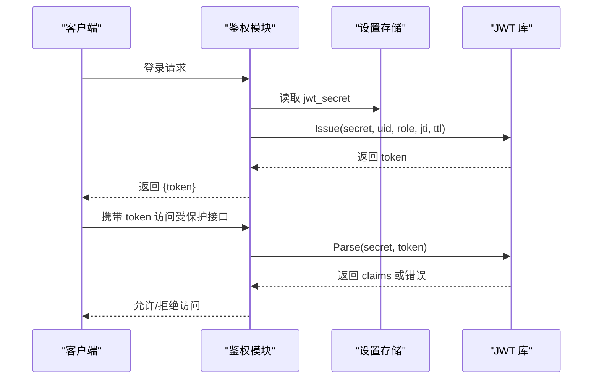
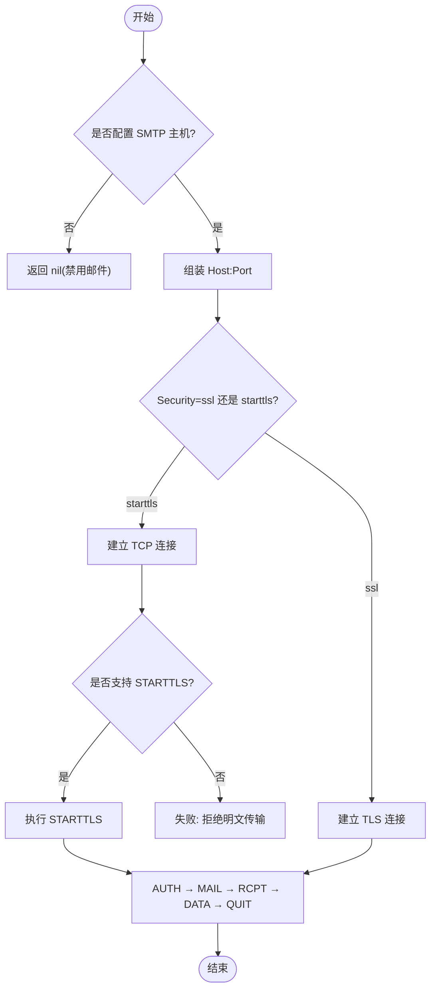
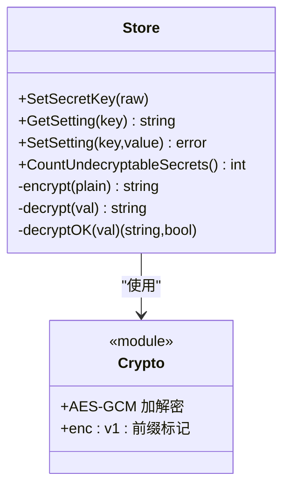
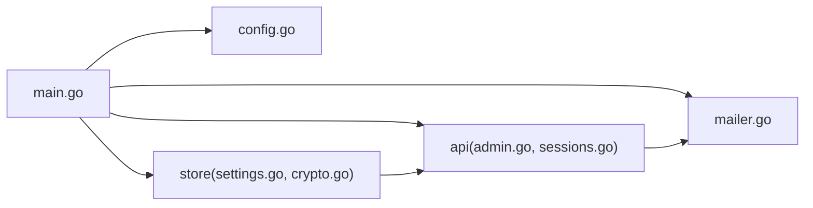

# 安全配置管理

<cite>
**本文引用的文件**
- [main.go](file://main.go)
- [config.go](file://internal/config/config.go)
- [qingzhou.env.example](file://deploy/qingzhou.env.example)
- [jwt.go](file://internal/auth/jwt.go)
- [mailer.go](file://internal/mailer/mailer.go)
- [settings.go](file://internal/store/settings.go)
- [crypto.go](file://internal/store/crypto.go)
- [admin.go](file://internal/api/admin.go)
- [sessions.go](file://internal/api/sessions.go)
</cite>

## 目录
1. [简介](#简介)
2. [项目结构](#项目结构)
3. [核心组件](#核心组件)
4. [架构总览](#架构总览)
5. [详细组件分析](#详细组件分析)
6. [依赖关系分析](#依赖关系分析)
7. [性能与安全考量](#性能与安全考量)
8. [故障排查指南](#故障排查指南)
9. [结论](#结论)
10. [附录：生产环境模板与最佳实践](#附录生产环境模板与最佳实践)

## 简介
本文件面向“安全配置管理”，覆盖以下主题：
- 环境变量优先级与加载机制（QZ_* 系列）
- JWT 密钥、数据库连接、邮件服务凭证等敏感信息管理
- 配置文件加密存储与动态更新
- 默认值与推荐配置（密码策略、会话超时、日志级别等）
- 配置校验与合法性保障
- 生产环境安全配置模板与最佳实践
- 配置审计与变更追踪

## 项目结构
本项目将运行时配置集中在启动阶段，通过环境变量注入；敏感设置持久化到数据库并支持可选的外部主密钥进行落盘加密；邮件发送器按 SMTP 参数构建并强制使用 TLS/STARTTLS。

**图表来源**
- [main.go:25-80](file://main.go#L25-L80)
- [config.go:14-29](file://internal/config/config.go#L14-L29)
- [settings.go:7-22](file://internal/store/settings.go#L7-L22)
- [crypto.go:17-22](file://internal/store/crypto.go#L17-L22)
- [mailer.go:22-58](file://internal/mailer/mailer.go#L22-L58)

**章节来源**
- [main.go:25-142](file://main.go#L25-L142)
- [config.go:14-29](file://internal/config/config.go#L14-L29)

## 核心组件
- 配置加载与环境变量
  - 监听地址、数据库路径、管理员账号等由环境变量 QZ_* 覆盖，未设置时使用内置默认值。
- JWT 认证
  - 使用 HS256 签名，签发与解析均依赖密钥；密钥从数据库设置项读取。
- 邮件服务
  - 支持隐式 TLS(465) 与 STARTTLS(587/25)，强制要求加密通道，拒绝明文降级。
- 敏感数据加密
  - 支持外部主密钥 QZ_SECRET_KEY；若未设置则回退到 jwt_secret。对指定设置项（如 smtp_pass）进行 AES-GCM 落盘加密。
- 会话管理
  - 基于 JWT 的登录会话，支持列出当前设备与会话撤销。

**章节来源**
- [config.go:14-29](file://internal/config/config.go#L14-L29)
- [jwt.go:16-42](file://internal/auth/jwt.go#L16-L42)
- [mailer.go:22-110](file://internal/mailer/mailer.go#L22-L110)
- [crypto.go:17-22](file://internal/store/crypto.go#L17-L22)
- [sessions.go:10-42](file://internal/api/sessions.go#L10-L42)

## 架构总览
下图展示了启动时配置加载、敏感信息处理与服务初始化的整体流程。

**图表来源**
- [main.go:25-80](file://main.go#L25-L80)
- [config.go:14-29](file://internal/config/config.go#L14-L29)
- [settings.go:7-22](file://internal/store/settings.go#L7-L22)
- [crypto.go:17-22](file://internal/store/crypto.go#L17-L22)
- [mailer.go:144-169](file://internal/mailer/mailer.go#L144-L169)

## 详细组件分析

### 环境变量与配置加载
- 优先级规则
  - 环境变量 QZ_* 优先于数据库设置项；当环境变量存在时，面板会将其视为生效值并在设置页标注受环境变量控制。
- 关键变量
  - QZ_LISTEN：监听地址，默认 0.0.0.0:8081；测试用例确保该默认值可被访问。
  - QZ_DB：SQLite 数据库路径。
  - QZ_ADMIN_USER/QZ_ADMIN_PASS：首次运行的管理员账户；若未设置密码，系统生成随机密码并记录日志。
  - QZ_PUBLIC_BASE：面板对外访问地址，用于订阅链接、探针安装、邮件链接等。
  - QZ_SMTP_*：SMTP 主机、端口、用户、密码、发件人、安全方式等。
  - QZ_SINGBOX_*：sing-box 控制器相关配置（配置路径、systemd unit、监听地址等）。
  - QZ_UPDATE_REPO/QZ_UPDATE_GITHUB_TOKEN：在线更新仓库与 GitHub Token。
  - QZ_PROBE_DIR：探针二进制目录。
  - QZ_WEB_DIR：开发模式前端资源目录。
  - QZ_EGRESS_TEST_PROXY：测试用代理环境变量。
- 行为说明
  - 所有 QZ_* 在启动时读取；部分设置项（如 SMTP）同时可从数据库设置项回退。
  - 设置页会合并环境变量覆盖后的有效值，并对敏感字段打码显示。

**章节来源**
- [config.go:14-29](file://internal/config/config.go#L14-L29)
- [config_test.go:5-25](file://internal/config/config_test.go#L5-L25)
- [qingzhou.env.example:1-43](file://deploy/qingzhou.env.example#L1-L43)
- [main.go:144-169](file://main.go#L144-L169)
- [admin.go:47-77](file://internal/api/admin.go#L47-L77)

### JWT 密钥与令牌生命周期
- 密钥来源
  - 启动后从数据库设置项读取 jwt_secret；若缺失则终止启动。
- 令牌签发与验证
  - 使用 HS256 算法签发包含用户 ID、角色、过期时间等的声明；解析时严格限定签名方法为 HMAC。
- 安全建议
  - 生产环境务必保证 jwt_secret 的安全性与保密性；定期轮换并避免泄露。

**图表来源**
- [main.go:51-63](file://main.go#L51-L63)
- [jwt.go:16-42](file://internal/auth/jwt.go#L16-L42)

**章节来源**
- [main.go:51-63](file://main.go#L51-L63)
- [jwt.go:16-42](file://internal/auth/jwt.go#L16-L42)

### 邮件服务凭证与传输安全
- 配置来源
  - 优先读取 QZ_SMTP_* 环境变量；若为空则回退到数据库设置项。
- 安全策略
  - 强制使用隐式 TLS(465) 或 STARTTLS(587/25)；若服务器不支持 STARTTLS，直接中止以避免明文传输。
  - 支持 PlainAuth 认证；未配置认证时仍会尝试启用加密。
- 超时与可靠性
  - 每个网络阶段与整个 SMTP 对话设置固定超时，防止阻塞与资源泄漏。

**图表来源**
- [main.go:144-169](file://main.go#L144-L169)
- [mailer.go:22-110](file://internal/mailer/mailer.go#L22-L110)

**章节来源**
- [main.go:144-169](file://main.go#L144-L169)
- [mailer.go:22-110](file://internal/mailer/mailer.go#L22-L110)

### 敏感数据加密与主密钥管理
- 主密钥来源
  - 优先使用 QZ_SECRET_KEY；若未设置，回退到 jwt_secret。
  - 未设置外部主密钥时会输出警告，提示风险。
- 加密范围
  - 特定设置项（如 smtp_pass）在写入时自动加密，读取时透明解密。
  - 证书与 sing-box TLS 配置中的敏感字段同样参与解密检查。
- 启动自检
  - 统计无法解密的密文数量；若大于零，提示可能因主密钥变更导致，受影响入站不会降级为明文。

**图表来源**
- [main.go:56-71](file://main.go#L56-L71)
- [crypto.go:17-22](file://internal/store/crypto.go#L17-L22)
- [crypto.go:24-77](file://internal/store/crypto.go#L24-L77)
- [crypto.go:79-121](file://internal/store/crypto.go#L79-L121)
- [settings.go:7-22](file://internal/store/settings.go#L7-L22)
- [settings.go:73-85](file://internal/store/settings.go#L73-L85)

**章节来源**
- [main.go:56-71](file://main.go#L56-L71)
- [crypto.go:17-22](file://internal/store/crypto.go#L17-L22)
- [crypto.go:24-77](file://internal/store/crypto.go#L24-L77)
- [crypto.go:79-121](file://internal/store/crypto.go#L79-L121)
- [settings.go:7-22](file://internal/store/settings.go#L7-L22)
- [settings.go:73-85](file://internal/store/settings.go#L73-L85)

### 会话管理与超时
- 会话列表与撤销
  - 提供查询当前在线设备与撤销指定设备的接口；清理过期会话以反映真实在线状态。
- 超时策略
  - 会话有效期与令牌 TTL 一致；过期即失效。
- 安全建议
  - 建议定期清理过期会话；在密码变更后主动注销其他设备。

**章节来源**
- [sessions.go:10-42](file://internal/api/sessions.go#L10-L42)

### 配置校验与合法性保障
- 环境变量覆盖可见性
  - 设置页会合并环境变量覆盖后的有效值，并标注受环境变量控制的字段。
- 安全降级防护
  - 邮件发送拒绝明文降级；证书与 TLS 配置无法解密时拒绝写回或部署，避免明文下发。
- 默认值与边界
  - 监听地址默认值经过测试用例约束；SMTP 端口默认回退到 587；sing-box 基础配置有内置默认模板。

**章节来源**
- [admin.go:47-77](file://internal/api/admin.go#L47-L77)
- [mailer.go:95-110](file://internal/mailer/mailer.go#L95-L110)
- [config_test.go:5-25](file://internal/config/config_test.go#L5-L25)

## 依赖关系分析
- 启动阶段依赖
  - main.go 依赖 config.Load 获取运行参数；依赖 store 完成数据库初始化、迁移与种子数据；依赖 api.New 构建 HTTP 服务。
- 敏感信息链
  - jwt_secret 用于 JWT；QZ_SECRET_KEY 用于敏感设置加密；两者共同影响认证与数据安全。
- 邮件链路
  - buildMailer 组合环境变量与数据库设置；mailer.Mailer 负责实际 SMTP 通信。

**图表来源**
- [main.go:25-80](file://main.go#L25-L80)
- [config.go:14-29](file://internal/config/config.go#L14-L29)
- [settings.go:7-22](file://internal/store/settings.go#L7-L22)
- [crypto.go:17-22](file://internal/store/crypto.go#L17-L22)
- [admin.go:47-77](file://internal/api/admin.go#L47-L77)
- [sessions.go:10-42](file://internal/api/sessions.go#L10-L42)
- [mailer.go:22-58](file://internal/mailer/mailer.go#L22-L58)

**章节来源**
- [main.go:25-80](file://main.go#L25-L80)
- [config.go:14-29](file://internal/config/config.go#L14-L29)
- [settings.go:7-22](file://internal/store/settings.go#L7-L22)
- [crypto.go:17-22](file://internal/store/crypto.go#L17-L22)
- [admin.go:47-77](file://internal/api/admin.go#L47-L77)
- [sessions.go:10-42](file://internal/api/sessions.go#L10-L42)
- [mailer.go:22-58](file://internal/mailer/mailer.go#L22-L58)

## 性能与安全考量
- 网络超时
  - 邮件发送全程设置固定超时，避免阻塞与资源泄漏。
- 最小权限与默认值
  - 监听地址默认开放以便开箱即用，但生产应限制为内网或反代绑定；管理员密码首次运行随机生成并提示修改。
- 加密与降级防护
  - 敏感设置采用 AES-GCM 加密；无法解密时拒绝明文降级，确保安全。
- 日志级别
  - 内置 sing-box 基础配置默认日志级别为 warn，减少噪声同时保留必要告警。

[本节为通用指导，不直接分析具体文件]

## 故障排查指南
- 无法解密设置
  - 现象：启动时提示存在无法解密的密文；SMTP 或 sing-box TLS 配置不可用。
  - 原因：QZ_SECRET_KEY 变更或丢失。
  - 处理：恢复之前的 QZ_SECRET_KEY 或重新加密相关设置。
- 邮件发送失败
  - 现象：SMTP 未提供 STARTTLS 时报错；或认证失败。
  - 处理：确认端口与安全方式匹配；检查用户名与密码；必要时改用隐式 TLS。
- 登录与令牌问题
  - 现象：令牌无效或签名方法不被接受。
  - 处理：检查 jwt_secret 是否正确；确保服务端与客户端时间同步。
- 会话残留
  - 现象：设备列表显示已离线但仍存在。
  - 处理：调用清理接口或等待过期；必要时撤销对应会话。

**章节来源**
- [main.go:56-71](file://main.go#L56-L71)
- [mailer.go:95-110](file://internal/mailer/mailer.go#L95-L110)
- [jwt.go:30-42](file://internal/auth/jwt.go#L30-L42)
- [sessions.go:10-42](file://internal/api/sessions.go#L10-L42)

## 结论
本项目通过环境变量优先的配置加载、严格的传输安全策略、落盘加密与启动自检，构建了较为完善的安全配置管理体系。生产环境应遵循最小暴露面原则，使用外部主密钥保护敏感设置，并定期轮换密钥与密码，配合会话管理与日志策略，确保系统稳定与安全。

[本节为总结，不直接分析具体文件]

## 附录：生产环境模板与最佳实践
- 环境变量模板
  - 参考示例文件，按需启用并填写 QZ_* 变量；确保 QZ_SECRET_KEY 独立于数据库保存。
- 推荐配置
  - 监听地址：仅对内网或反代开放；使用反向代理统一出口。
  - 管理员密码：首次登录后立即修改；避免使用弱口令。
  - 邮件服务：启用 STARTTLS 或隐式 TLS；配置合理的超时与重试。
  - 会话策略：合理设置令牌 TTL；定期清理过期会话。
  - 日志级别：保持 warn 级别；根据运维需求调整。
- 配置审计与变更追踪
  - 设置页会标注受环境变量控制的字段；建议在部署平台记录环境变量变更历史。
  - 对敏感设置的变更应纳入变更审批与审计流程；备份 QZ_SECRET_KEY 与数据库。

**章节来源**
- [qingzhou.env.example:1-43](file://deploy/qingzhou.env.example#L1-L43)
- [admin.go:47-77](file://internal/api/admin.go#L47-L77)
