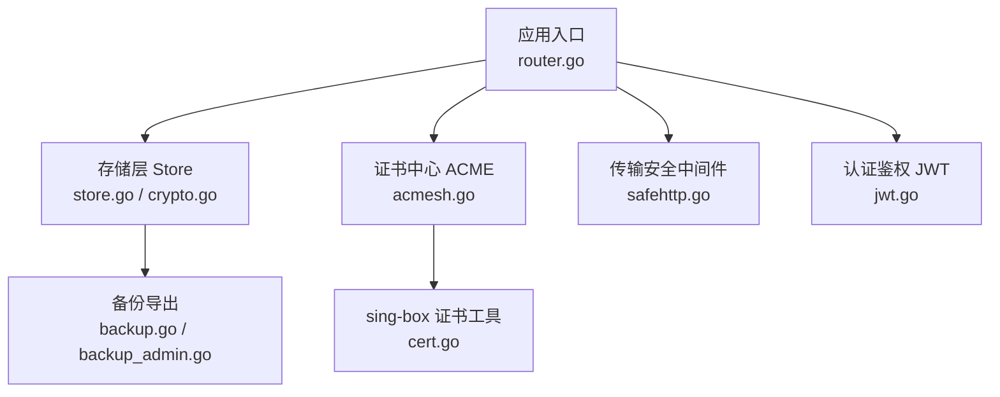
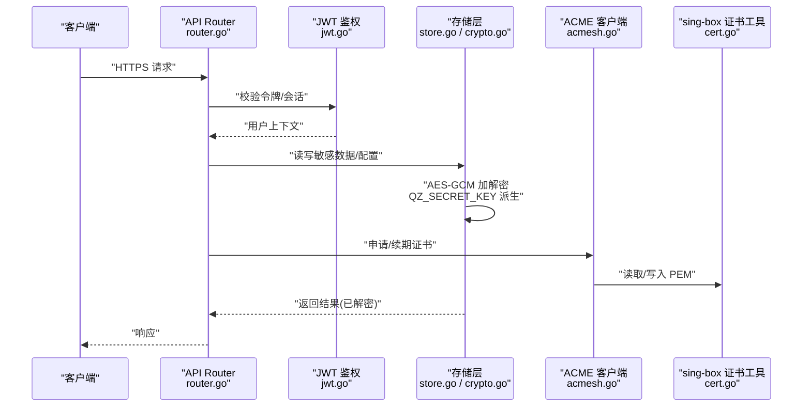
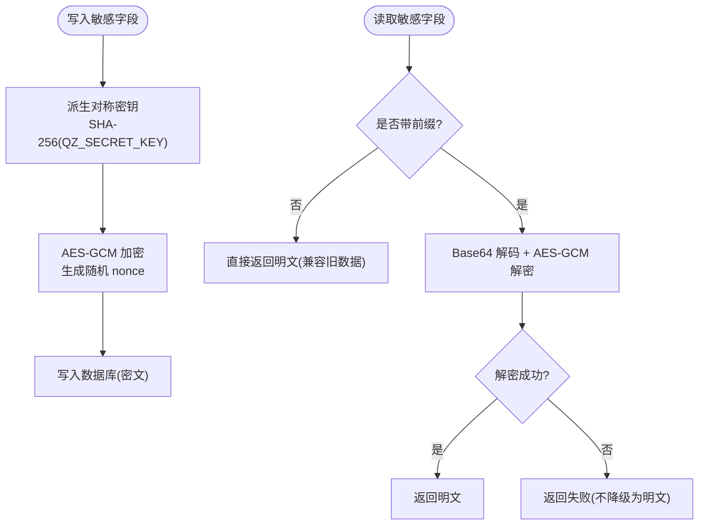
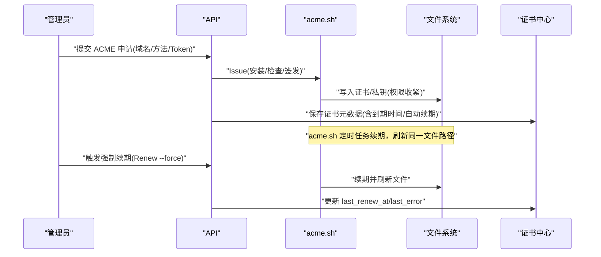
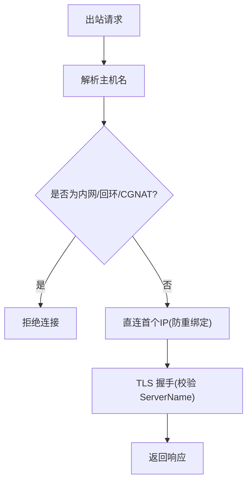
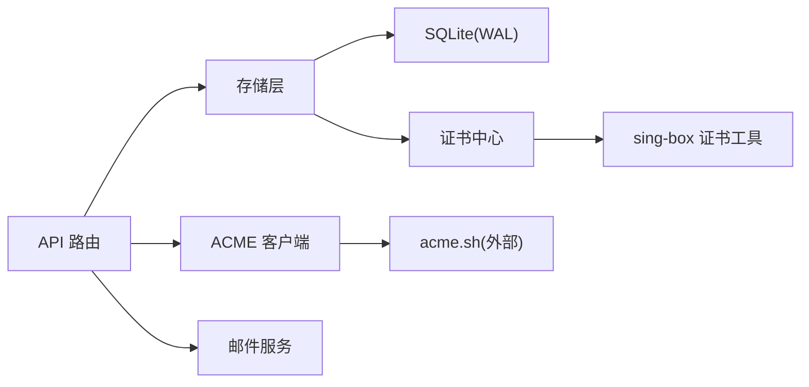

# 数据安全保护

<cite>
**本文引用的文件**
- [internal/config/config.go](file://internal/config/config.go)
- [internal/store/crypto.go](file://internal/store/crypto.go)
- [internal/store/certs.go](file://internal/store/certs.go)
- [internal/acmesh/acmesh.go](file://internal/acmesh/acmesh.go)
- [internal/singbox/cert.go](file://internal/singbox/cert.go)
- [internal/api/safehttp.go](file://internal/api/safehttp.go)
- [internal/auth/jwt.go](file://internal/auth/jwt.go)
- [internal/store/store.go](file://internal/store/store.go)
- [internal/store/backup.go](file://internal/store/backup.go)
- [internal/api/backup_admin.go](file://internal/api/backup_admin.go)
- [deploy/qingzhou.env.example](file://deploy/qingzhou.env.example)
- [internal/api/router.go](file://internal/api/router.go)
</cite>

## 目录
1. [简介](#简介)
2. [项目结构](#项目结构)
3. [核心组件](#核心组件)
4. [架构总览](#架构总览)
5. [详细组件分析](#详细组件分析)
6. [依赖关系分析](#依赖关系分析)
7. [性能与安全权衡](#性能与安全权衡)
8. [故障排查指南](#故障排查指南)
9. [结论](#结论)
10. [附录](#附录)

## 简介
本文件面向运维与开发，系统性说明本项目在“数据静态加密、密钥管理、证书生命周期、传输安全、数据库安全、备份与恢复、隐私与防泄露”等方面的实现与最佳实践。内容基于代码仓库中的实际实现进行梳理，并给出可操作的部署建议与排障指引。

## 项目结构
与安全相关的关键模块分布如下：
- 配置与环境变量：用于加载监听地址、数据库路径、管理员凭据、主密钥等
- 存储层：SQLite 数据持久化、WAL 模式、参数化查询、敏感字段加密
- 证书中心：ACME 自动签发（acme.sh）、自签证书、导入证书、到期续期
- 传输安全：HTTP 中间件、SSRF 防护、请求体大小限制
- 认证鉴权：JWT 签发与校验、会话与会话撤销
- 备份恢复：一致性快照导出、临时目录隔离、下载头控制

**图表来源**
- [internal/api/router.go:132-386](file://internal/api/router.go#L132-L386)
- [internal/store/store.go:27-57](file://internal/store/store.go#L27-L57)
- [internal/store/crypto.go:17-77](file://internal/store/crypto.go#L17-L77)
- [internal/acmesh/acmesh.go:193-240](file://internal/acmesh/acmesh.go#L193-L240)
- [internal/singbox/cert.go:76-139](file://internal/singbox/cert.go#L76-L139)
- [internal/api/backup_admin.go:23-76](file://internal/api/backup_admin.go#L23-L76)

**章节来源**
- [internal/api/router.go:132-386](file://internal/api/router.go#L132-L386)
- [internal/store/store.go:27-57](file://internal/store/store.go#L27-L57)

## 核心组件
- 敏感数据加密存储：使用 AES-GCM 对敏感设置和证书私钥进行静态加密；通过独立的主密钥 QZ_SECRET_KEY 派生对称密钥；提供解密失败检测与计数能力，防止降级为明文。
- 密钥管理策略：主密钥来自环境变量且不在数据库中；首次运行可生成随机管理员密码；支持按环境覆盖默认值。
- 数据传输安全：内置 SSRF 防护、请求体大小限制、仅允许 http/https 的 URL 校验；通过反向代理或外部 TLS 终止保障 HTTPS。
- 证书管理：集成 acme.sh 实现 ACME 自动申请与安装，支持 DNS-01、HTTP-01、Webroot 三种验证方式；支持自签与导入；到期自动续期与强制续期；证书文件权限收紧。
- 数据库安全：SQLite WAL 模式、外键约束、事务锁策略；所有 SQL 使用参数化查询，避免注入；备份通过 VACUUM INTO 获取一致快照。
- 备份与恢复：提供一致的数据库快照导出接口，临时目录隔离、禁止缓存、清理回收。
- 隐私与防泄露：前端展示时对 IP/域名进行打码；敏感信息不随日志输出；备份包含加密列但需相同主密钥才能还原。

**章节来源**
- [internal/store/crypto.go:17-77](file://internal/store/crypto.go#L17-L77)
- [internal/config/config.go:14-29](file://internal/config/config.go#L14-L29)
- [internal/api/safehttp.go:27-85](file://internal/api/safehttp.go#L27-L85)
- [internal/acmesh/acmesh.go:193-240](file://internal/acmesh/acmesh.go#L193-L240)
- [internal/store/store.go:27-57](file://internal/store/store.go#L27-L57)
- [internal/store/backup.go:10-51](file://internal/store/backup.go#L10-L51)
- [internal/api/backup_admin.go:23-76](file://internal/api/backup_admin.go#L23-L76)

## 架构总览
下图展示了从 HTTP 请求到数据落盘与证书管理的整体流程，以及关键的安全控制点。

**图表来源**
- [internal/api/router.go:132-386](file://internal/api/router.go#L132-L386)
- [internal/auth/jwt.go:16-42](file://internal/auth/jwt.go#L16-L42)
- [internal/store/crypto.go:17-77](file://internal/store/crypto.go#L17-L77)
- [internal/acmesh/acmesh.go:193-240](file://internal/acmesh/acmesh.go#L193-L240)
- [internal/singbox/cert.go:76-139](file://internal/singbox/cert.go#L76-L139)

## 详细组件分析

### 敏感数据加密存储与完整性
- 算法选择：采用 AES-GCM 提供机密性与完整性保护；每个密文附带随机 nonce，确保相同明文多次加密结果不同。
- 密钥管理：通过 SHA-256 将主密钥（QZ_SECRET_KEY）转换为固定长度对称密钥；主密钥必须置于数据库之外（环境变量），避免与数据同库存放。
- 受保护字段：包括 SMTP 密码、Cloudflare API Token 等；证书中心的 cert_pem/key_pem 同样加密存储。
- 解密失败处理：提供 decryptOK 严格模式，当无法解密时返回失败而非空串，调用方不得将其误判为“无值”，从而避免回退到明文。
- 启动自检：CountUndecryptableSecrets 扫描受影响记录，便于在密钥变更时快速发现并告警。

**图表来源**
- [internal/store/crypto.go:17-77](file://internal/store/crypto.go#L17-L77)

**章节来源**
- [internal/store/crypto.go:17-77](file://internal/store/crypto.go#L17-L77)
- [internal/store/certs.go:52-66](file://internal/store/certs.go#L52-L66)
- [internal/store/certs.go:98-122](file://internal/store/certs.go#L98-L122)

### 密钥管理策略与轮换
- 主密钥来源：QZ_SECRET_KEY 环境变量，推荐由系统级密钥管理服务注入；不在数据库中保存。
- 首次运行：管理员密码可为空，首次登录时生成随机密码并记录日志，便于初始访问。
- 轮换建议：
  - 停止服务 -> 更新 QZ_SECRET_KEY -> 重新导入或重新生成需要保护的凭据 -> 重启服务。
  - 利用 CountUndecryptableSecrets 在新密钥下统计不可解密数量，确认影响范围。
  - 对证书私钥与敏感设置执行“先写新密文、再切换引用”的两阶段操作，降低停机时间。

**章节来源**
- [internal/config/config.go:14-29](file://internal/config/config.go#L14-L29)
- [internal/store/crypto.go:17-22](file://internal/store/crypto.go#L17-L22)
- [internal/store/crypto.go:79-121](file://internal/store/crypto.go#L79-L121)
- [deploy/qingzhou.env.example:27-34](file://deploy/qingzhou.env.example#L27-L34)

### 证书管理流程（ACME、续期、轮换）
- ACME 集成：通过 acme.sh 完成证书申请与安装，支持 DNS-01（Cloudflare）、HTTP-01、Webroot 三种挑战方式；DNS-01 支持通配符。
- 安装与权限：证书目录权限设置为 700，私钥文件权限设置为 600，避免被其他用户读取。
- 续期机制：acme.sh 自带定时任务负责续期；面板可通过 Renew 触发强制续期；续期后文件原地刷新，服务重载即可生效。
- 证书中心：集中管理证书资源，支持粘贴导入、自签、ACME 签发；到期时间与自动续期标记持久化；引用该证书的入站会在构建时注入最新 PEM。
- 自签证书：提供 ECDSA P-256 自签能力，适用于特定协议场景（如 Reality/TUIC/Hysteria2 配合 pin）。

**图表来源**
- [internal/acmesh/acmesh.go:193-240](file://internal/acmesh/acmesh.go#L193-L240)
- [internal/acmesh/acmesh.go:258-283](file://internal/acmesh/acmesh.go#L258-L283)
- [internal/store/certs.go:98-122](file://internal/store/certs.go#L98-L122)
- [internal/singbox/cert.go:76-139](file://internal/singbox/cert.go#L76-L139)

**章节来源**
- [internal/acmesh/acmesh.go:193-240](file://internal/acmesh/acmesh.go#L193-L240)
- [internal/acmesh/acmesh.go:258-283](file://internal/acmesh/acmesh.go#L258-L283)
- [internal/store/certs.go:98-122](file://internal/store/certs.go#L98-L122)
- [internal/singbox/cert.go:76-139](file://internal/singbox/cert.go#L76-L139)

### 数据传输安全措施
- SSRF 防护：对外发起请求时使用 safeFetchClient，解析目标 IP 并拒绝内网/回环/链路本地/CGNAT 地址，且在拨号阶段直连首个解析 IP，规避 DNS 重绑定窗口。
- URL 白名单：仅允许 http/https 方案，拒绝 file/gopher 等危险方案。
- 请求体限制：全局中间件限制最大请求体大小，防止内存耗尽攻击。
- 反向代理与 HTTPS：建议通过 Nginx/Caddy 等反代启用 HTTPS 并强制跳转；面板监听地址可通过环境变量限定为 127.0.0.1 以缩小暴露面。

**图表来源**
- [internal/api/safehttp.go:27-56](file://internal/api/safehttp.go#L27-L56)
- [internal/api/safehttp.go:71-85](file://internal/api/safehttp.go#L71-L85)

**章节来源**
- [internal/api/safehttp.go:27-85](file://internal/api/safehttp.go#L27-L85)
- [internal/config/config.go:14-29](file://internal/config/config.go#L14-L29)

### 数据库安全配置
- 引擎与模式：SQLite 开启 WAL 模式，提升并发读性能；启用外键约束；事务锁策略设为 immediate，减少升级锁导致的繁忙错误。
- 参数化查询：所有 SQL 使用占位符传参，避免字符串拼接导致注入风险。
- 备份一致性：通过 VACUUM INTO 在 SQLite 内部创建一致快照，避免复制 WAL 文件导致的不一致问题。
- 注意：当前未启用数据库层 TLS（SQLite 为本地文件数据库），若迁移至远程数据库应启用连接加密。

**章节来源**
- [internal/store/store.go:27-57](file://internal/store/store.go#L27-L57)
- [internal/store/userplans.go:1135-1158](file://internal/store/userplans.go#L1135-L1158)
- [internal/store/backup.go:10-51](file://internal/store/backup.go#L10-L51)

### 备份与恢复策略
- 备份接口：提供 /api/admin/backup 下载一致快照；临时目录隔离于数据库同级目录，避免 tmpfs 占用内存；响应头禁用缓存。
- 恢复要点：备份文件包含加密列，恢复时需保持相同的 QZ_SECRET_KEY；建议在维护窗口执行恢复并在恢复后验证业务功能。
- 版本回滚：更新器支持本地二进制回滚，保留上一版本以便快速恢复。

**章节来源**
- [internal/api/backup_admin.go:23-76](file://internal/api/backup_admin.go#L23-L76)
- [internal/store/backup.go:10-51](file://internal/store/backup.go#L10-L51)
- [internal/updater/rollback.go:170-192](file://internal/updater/rollback.go#L170-L192)

### 隐私保护与数据泄露防护
- 前端脱敏：在拓扑图等界面中对 IP/域名进行打码显示，避免截图分享泄露真实地址。
- 最小化日志：敏感字段不落日志；错误消息不包含完整凭据。
- 访问控制：管理员接口受鉴权与角色限制；订阅链接与探针上报具备速率限制。

**章节来源**
- [frontend/src/views/AdminSingbox.vue:990-1001](file://frontend/src/views/AdminSingbox.vue#L990-L1001)
- [internal/api/router.go:94-130](file://internal/api/router.go#L94-L130)

## 依赖关系分析
- 组件耦合：
  - API 路由依赖存储层、邮件、控制器、更新器等；存储层封装了加密、备份、证书管理等能力。
  - ACME 模块通过 Runner 抽象可在本地或远端执行命令，便于扩展。
  - sing-box 证书工具提供自签与指纹计算，供 TLS/Reality 配置使用。
- 外部依赖：
  - acme.sh：外部命令行工具，用于 ACME 协议交互与证书安装。
  - SQLite：本地数据库，WAL 模式与参数化查询保障一致性与安全性。
- 潜在风险：
  - 若 QZ_SECRET_KEY 丢失或变更，所有加密数据不可用；需提前规划密钥管理与轮换流程。
  - 若通过反向代理暴露面板，需确保仅信任可信代理的 X-Forwarded-For/X-Real-IP。

**图表来源**
- [internal/api/router.go:132-386](file://internal/api/router.go#L132-L386)
- [internal/store/store.go:27-57](file://internal/store/store.go#L27-L57)
- [internal/acmesh/acmesh.go:193-240](file://internal/acmesh/acmesh.go#L193-L240)
- [internal/singbox/cert.go:76-139](file://internal/singbox/cert.go#L76-L139)

**章节来源**
- [internal/api/router.go:132-386](file://internal/api/router.go#L132-L386)
- [internal/store/store.go:27-57](file://internal/store/store.go#L27-L57)

## 性能与安全权衡
- 并发与一致性：WAL 模式允许多读一写，结合 busy_timeout 与 immediate 事务锁，降低死锁与繁忙错误概率。
- 请求体限制：全局限制 8MiB，兼顾大配置上传与内存保护。
- 证书文件权限：目录 700、私钥 600，最小权限原则降低越权读取风险。
- 网络出站限制：仅允许 http/https，拒绝内网地址，有效缓解 SSRF 风险。

[本节为通用指导，无需具体文件引用]

## 故障排查指南
- 证书无法解密：
  - 现象：TLS 配置构建失败或节点无法拉起。
  - 排查：检查 QZ_SECRET_KEY 是否正确；使用 CountUndecryptableSecrets 统计受影响条目；必要时重新导入凭据或重新签发证书。
- ACME 申请失败：
  - 现象：80 端口占用或 DNS 记录未生效。
  - 排查：优先使用 DNS-01；若使用 HTTP-01/Webroot，确保 Web 服务器正确放行 challenge 路径；查看 acme.sh 输出定位错误。
- 备份下载失败或损坏：
  - 现象：下载中断或恢复时报错。
  - 排查：确认磁盘空间充足；检查临时目录权限；确保使用 VACUUM INTO 生成的快照；恢复时保持相同 QZ_SECRET_KEY。
- 数据库繁忙：
  - 现象：写入时报 SQLITE_BUSY。
  - 排查：检查并发写入峰值；确认 WAL 模式与 busy_timeout 配置；避免长事务阻塞。

**章节来源**
- [internal/store/crypto.go:79-121](file://internal/store/crypto.go#L79-L121)
- [internal/acmesh/acmesh.go:214-239](file://internal/acmesh/acmesh.go#L214-L239)
- [internal/api/backup_admin.go:23-76](file://internal/api/backup_admin.go#L23-L76)
- [internal/store/store.go:27-57](file://internal/store/store.go#L27-L57)

## 结论
本项目在数据静态加密、密钥管理、证书生命周期、传输安全、数据库安全、备份恢复等方面提供了较为完善的能力。建议在生产环境中：
- 始终使用 QZ_SECRET_KEY 管理敏感数据，并纳入密钥管理系统。
- 通过反向代理启用 HTTPS，限制面板监听地址，仅信任可信代理。
- 优先使用 ACME DNS-01 方式签发证书，并启用自动续期。
- 定期执行备份并演练恢复流程，确保在灾难场景下可快速恢复。
- 关注解密失败计数与证书到期时间，建立监控与告警。

[本节为总结性内容，无需具体文件引用]

## 附录
- 环境变量参考：
  - QZ_LISTEN：面板监听地址，生产建议 127.0.0.1:8081 并由反代暴露。
  - QZ_DB：数据库文件路径。
  - QZ_ADMIN_USER/QZ_ADMIN_PASS：首次管理员账号与密码（为空则自动生成）。
  - QZ_SECRET_KEY：主密钥，务必保存在数据库之外。
  - SMTP 相关：QZ_SMTP_HOST/PORT/USER/PASS/FROM/SECURITY。

**章节来源**
- [deploy/qingzhou.env.example:1-43](file://deploy/qingzhou.env.example#L1-L43)
