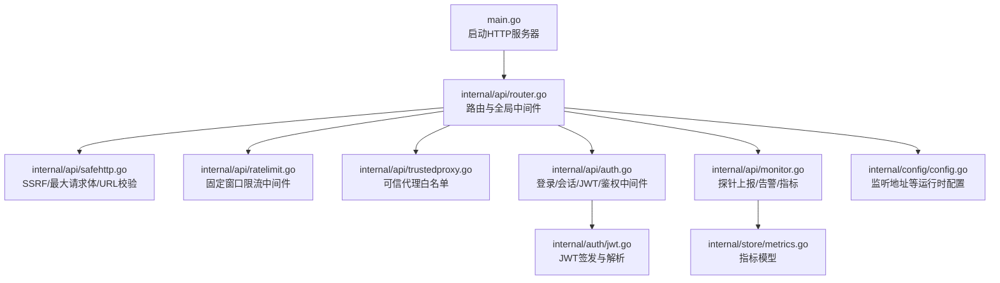
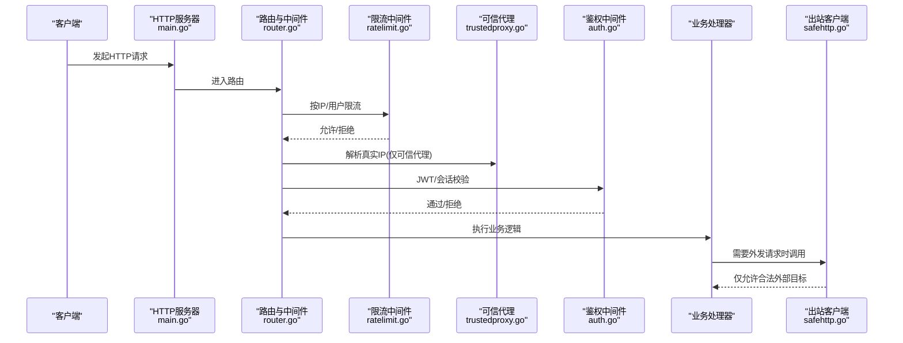
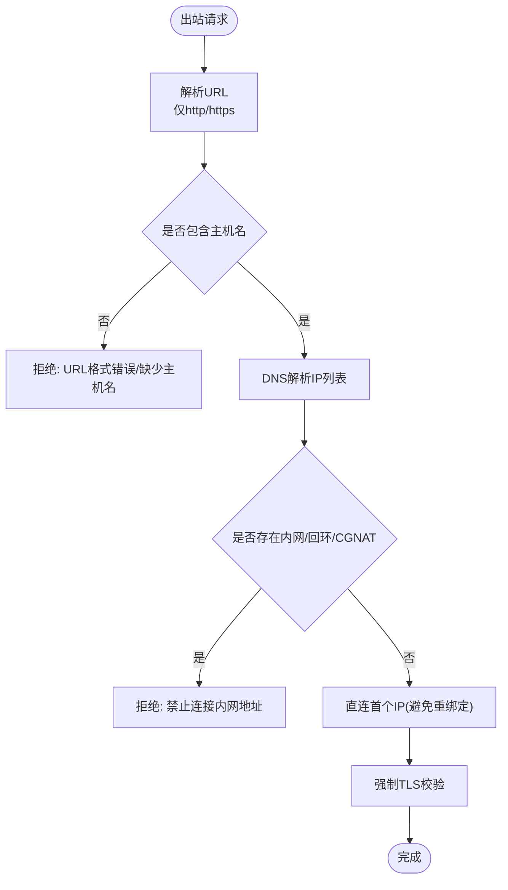
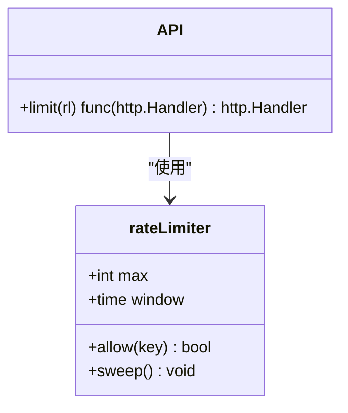
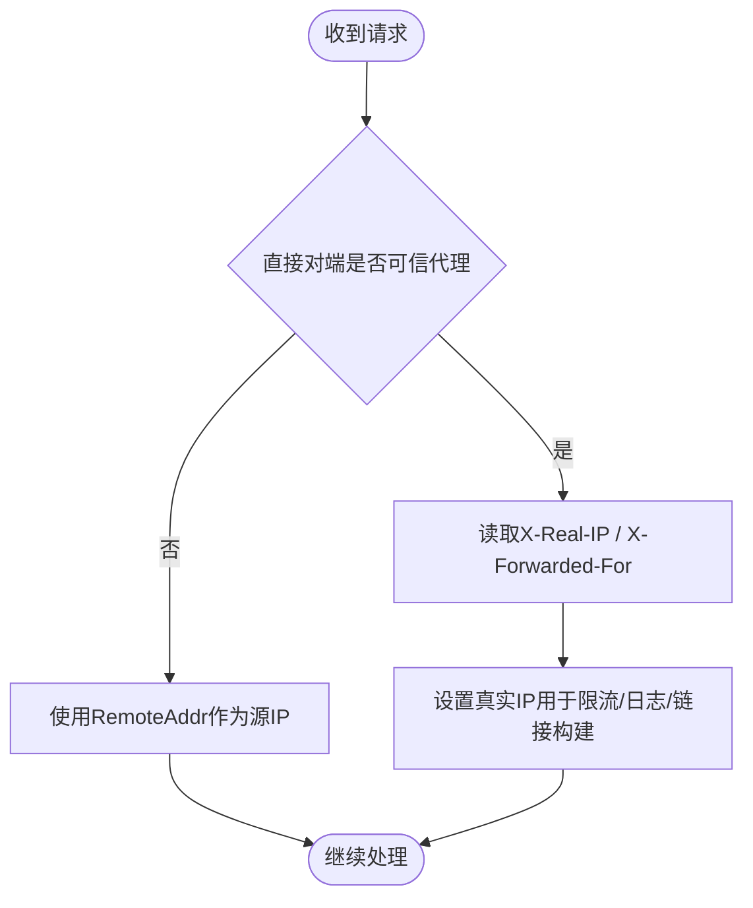
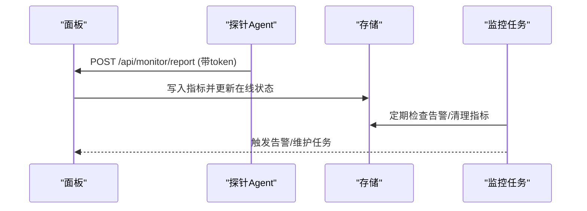
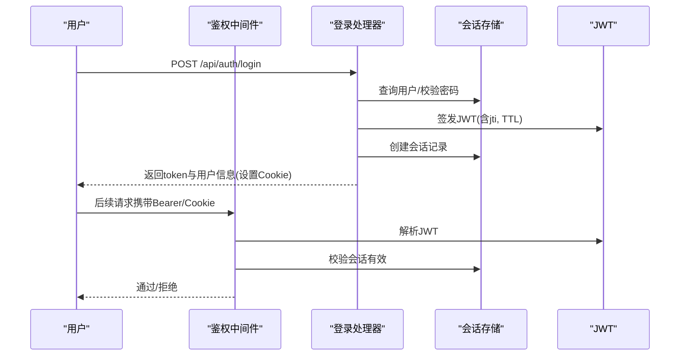
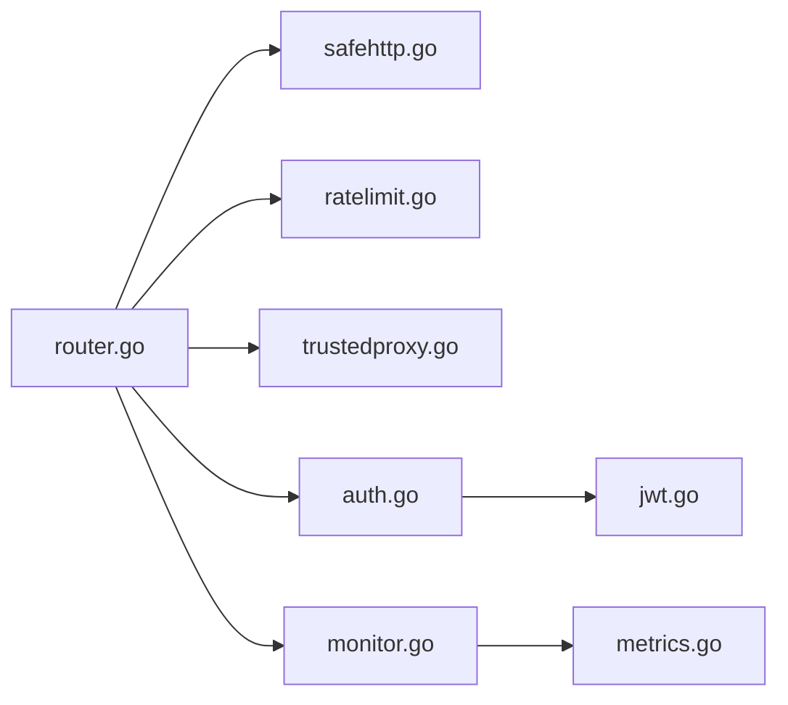

# 网络安全防护

<cite>
**本文引用的文件**
- [main.go](file://main.go)
- [router.go](file://internal/api/router.go)
- [safehttp.go](file://internal/api/safehttp.go)
- [ratelimit.go](file://internal/api/ratelimit.go)
- [trustedproxy.go](file://internal/api/trustedproxy.go)
- [auth.go](file://internal/api/auth.go)
- [jwt.go](file://internal/auth/jwt.go)
- [config.go](file://internal/config/config.go)
- [monitor.go](file://internal/api/monitor.go)
- [metrics.go](file://internal/store/metrics.go)
</cite>

## 目录
1. [简介](#简介)
2. [项目结构](#项目结构)
3. [核心组件](#核心组件)
4. [架构总览](#架构总览)
5. [详细组件分析](#详细组件分析)
6. [依赖关系分析](#依赖关系分析)
7. [性能与安全考量](#性能与安全考量)
8. [故障排查指南](#故障排查指南)
9. [结论](#结论)
10. [附录：配置与最佳实践清单](#附录配置与最佳实践清单)

## 简介
本文件面向“轻舟”面板的网络安全防护，聚焦以下方面：输入验证与过滤、XSS/CSRF防护策略、速率限制（IP级/用户级/API频率）、代理信任链（反向代理识别、真实IP获取、请求来源验证）、DDoS防护（连接数/请求大小/异常流量检测），以及网络层安全配置与监控告警策略。文档同时给出常见攻击的防护方案与应急响应流程，帮助运维与开发快速定位与加固。

## 项目结构
本项目采用分层组织：入口在 main.go；HTTP路由与中间件集中在 internal/api；认证与令牌在 internal/auth；配置读取在 internal/config；监控指标与告警在 internal/api/monitor.go 与 internal/store/metrics.go。

**图表来源**
- [main.go:108-121](file://main.go#L108-L121)
- [router.go:132-147](file://internal/api/router.go#L132-L147)
- [safehttp.go:27-85](file://internal/api/safehttp.go#L27-L85)
- [ratelimit.go:9-64](file://internal/api/ratelimit.go#L9-L64)
- [trustedproxy.go:10-64](file://internal/api/trustedproxy.go#L10-L64)
- [auth.go:28-64](file://internal/api/auth.go#L28-L64)
- [jwt.go:16-41](file://internal/auth/jwt.go#L16-L41)
- [monitor.go:18-54](file://internal/api/monitor.go#L18-L54)
- [metrics.go:9-33](file://internal/store/metrics.go#L9-L33)
- [config.go:14-28](file://internal/config/config.go#L14-L28)

**章节来源**
- [main.go:25-142](file://main.go#L25-L142)
- [router.go:132-147](file://internal/api/router.go#L132-L147)

## 核心组件
- HTTP服务器与超时控制：设置读/写/空闲超时，避免慢连接耗尽资源。
- 全局中间件：请求ID、恢复、压缩、超时、最大请求体限制。
- 可信代理与真实IP：仅信任来自可信代理的转发头，防止伪造源IP绕过限流。
- 速率限制：基于固定窗口的每IP/每用户限流，覆盖登录、注册、重置密码、探针上报、订阅地址切换等关键路径。
- SSRF防护：出站客户端强制TLS并拒绝内网/回环/CGNAT地址，DNS解析后直连首个IP，避免重绑定。
- 认证与会话：JWT+会话表，支持注销与撤销；登录失败时间恒定，防枚举。
- 监控与告警：探针定时上报系统指标，后台任务定期清理数据并检查告警。

**章节来源**
- [main.go:108-121](file://main.go#L108-L121)
- [router.go:132-147](file://internal/api/router.go#L132-L147)
- [ratelimit.go:22-64](file://internal/api/ratelimit.go#L22-L64)
- [safehttp.go:27-85](file://internal/api/safehttp.go#L27-L85)
- [auth.go:112-149](file://internal/api/auth.go#L112-L149)
- [jwt.go:16-41](file://internal/auth/jwt.go#L16-L41)
- [monitor.go:892-919](file://internal/api/monitor.go#L892-L919)

## 架构总览
下图展示请求从进入HTTP服务器到经过中间件、鉴权、限流、业务处理的全链路，以及出站访问的安全约束。

**图表来源**
- [main.go:108-121](file://main.go#L108-L121)
- [router.go:132-147](file://internal/api/router.go#L132-L147)
- [ratelimit.go:54-64](file://internal/api/ratelimit.go#L54-L64)
- [trustedproxy.go:48-64](file://internal/api/trustedproxy.go#L48-L64)
- [auth.go:179-201](file://internal/api/auth.go#L179-L201)
- [safehttp.go:27-56](file://internal/api/safehttp.go#L27-L56)

## 详细组件分析

### 输入验证与过滤机制
- 请求体大小限制：通过全局中间件将请求体包装为最大字节数读取器，超过阈值直接返回错误，避免内存压力。
- URL合法性校验：对外部可配置的“fetch URL”进行严格校验，仅允许 http/https，且必须包含主机名。
- SSRF防护：出站客户端在拨号前解析域名，若解析到回环、私有、未指定、链路本地或CGNAT地址则拒绝；解析后直接连接首个IP，避免DNS重绑定窗口。

**图表来源**
- [safehttp.go:58-85](file://internal/api/safehttp.go#L58-L85)
- [safehttp.go:27-56](file://internal/api/safehttp.go#L27-L56)

**章节来源**
- [router.go:144-147](file://internal/api/router.go#L144-L147)
- [safehttp.go:58-85](file://internal/api/safehttp.go#L58-L85)
- [safehttp.go:27-56](file://internal/api/safehttp.go#L27-L56)

### XSS攻击防护
- 服务端输出：API统一以JSON响应，默认不渲染HTML，降低注入风险。
- 前端页面：管理端与用户端为单页应用，由前端框架负责渲染；敏感内容应遵循前端XSS防护规范（如转义、CSP）。
- 建议：对任何用户可控的富文本输出启用白名单过滤与转义，并在HTTP头中设置合适的Content-Type与CSP策略。

[本节为通用安全建议，不直接分析具体代码文件]

### CSRF防护策略
- 当前实现未显式引入CSRF Token；由于主要交互为JSON API且使用Cookie/Bearer Token，建议：
  - 对状态变更接口（POST/PUT/DELETE）启用SameSite Cookie策略。
  - 对表单提交类接口增加CSRF Token或使用双提交Cookie模式。
  - 对敏感操作要求二次确认或额外凭据。

[本节为通用安全建议，不直接分析具体代码文件]

### 速率限制实现
- IP级限流：登录、注册、忘记密码、重置密码等接口按IP固定窗口限流，防止暴力破解与邮件轰炸。
- 用户级限流：订阅地址切换等接口按用户维度限流，避免频繁切换导致订阅失效。
- API调用频率控制：探针上报接口按IP限流，防止滥用。
- 限流算法：固定窗口计数器，周期结束后自动清理过期条目。

**图表来源**
- [ratelimit.go:9-64](file://internal/api/ratelimit.go#L9-L64)
- [router.go:94-105](file://internal/api/router.go#L94-L105)

**章节来源**
- [ratelimit.go:22-64](file://internal/api/ratelimit.go#L22-L64)
- [router.go:94-105](file://internal/api/router.go#L94-L105)
- [router.go:155-168](file://internal/api/router.go#L155-L168)

### 代理信任链配置
- 可信代理白名单：默认信任本机回环地址段；可通过环境变量追加其他CIDR。
- 真实IP获取：仅当直接TCP对端属于可信代理时，才信任X-Real-IP/X-Forwarded-For；否则使用实际对端IP，防止伪造源IP绕过限流。
- 请求来源验证：Host与协议相关头仅在可信代理场景下被采纳，避免链接生成被污染。

**图表来源**
- [trustedproxy.go:22-41](file://internal/api/trustedproxy.go#L22-L41)
- [trustedproxy.go:48-64](file://internal/api/trustedproxy.go#L48-L64)
- [auth.go:28-47](file://internal/api/auth.go#L28-L47)

**章节来源**
- [trustedproxy.go:22-64](file://internal/api/trustedproxy.go#L22-L64)
- [auth.go:28-47](file://internal/api/auth.go#L28-L47)

### DDoS防护措施
- 连接数限制：通过HTTP服务器的ReadTimeout/WriteTimeout/IdleTimeout限制长连接占用，避免慢连接耗尽资源。
- 请求大小限制：全局最大请求体限制，阻止超大POST导致内存压力。
- 异常流量检测：结合探针上报的CPU、内存、磁盘、负载、TCP连接数等指标，周期性检查并生成告警；后台任务定期清理历史指标，避免数据库膨胀。

**图表来源**
- [monitor.go:18-54](file://internal/api/monitor.go#L18-L54)
- [monitor.go:892-919](file://internal/api/monitor.go#L892-L919)
- [metrics.go:9-33](file://internal/store/metrics.go#L9-L33)

**章节来源**
- [main.go:108-121](file://main.go#L108-L121)
- [router.go:144-147](file://internal/api/router.go#L144-L147)
- [monitor.go:892-919](file://internal/api/monitor.go#L892-L919)

### 认证与会话安全
- 登录流程：校验用户名与密码，失败时消耗相同时间，防止枚举；封禁账号直接拒绝。
- 会话与令牌：登录后创建会话记录并签发JWT，支持注销与撤销；鉴权中间件校验JWT有效性与会话存在性。
- Cookie安全：登录成功后设置HttpOnly Cookie，注销时清空。

**图表来源**
- [auth.go:112-149](file://internal/api/auth.go#L112-L149)
- [auth.go:179-201](file://internal/api/auth.go#L179-L201)
- [jwt.go:16-41](file://internal/auth/jwt.go#L16-L41)

**章节来源**
- [auth.go:112-149](file://internal/api/auth.go#L112-L149)
- [auth.go:179-201](file://internal/api/auth.go#L179-L201)
- [jwt.go:16-41](file://internal/auth/jwt.go#L16-L41)

## 依赖关系分析
- 路由层依赖全局中间件提供安全基线（超时、压缩、最大请求体、恢复）。
- 限流模块依赖clientIP解析，后者依赖可信代理判断。
- 认证模块依赖JWT库与会话存储。
- 监控模块依赖存储层指标模型与后台任务。

**图表来源**
- [router.go:132-147](file://internal/api/router.go#L132-L147)
- [safehttp.go:27-85](file://internal/api/safehttp.go#L27-L85)
- [ratelimit.go:22-64](file://internal/api/ratelimit.go#L22-L64)
- [trustedproxy.go:22-64](file://internal/api/trustedproxy.go#L22-L64)
- [auth.go:112-201](file://internal/api/auth.go#L112-L201)
- [jwt.go:16-41](file://internal/auth/jwt.go#L16-L41)
- [monitor.go:18-54](file://internal/api/monitor.go#L18-L54)
- [metrics.go:9-33](file://internal/store/metrics.go#L9-L33)

**章节来源**
- [router.go:132-147](file://internal/api/router.go#L132-L147)
- [monitor.go:18-54](file://internal/api/monitor.go#L18-L54)

## 性能与安全考量
- 性能：启用gzip压缩减少带宽；合理设置HTTP超时避免资源泄漏；限流保护后端免受突发流量冲击。
- 安全：最小化信任面（仅可信代理转发头）；出站访问严格白名单；请求体大小限制；JWT短生命周期与会话绑定。
- 可扩展性：限流器简单高效，适合单机部署；如需分布式限流可替换为Redis-backed实现。

[本节提供通用指导，不直接分析具体文件]

## 故障排查指南
- 无法获取真实IP：检查反向代理是否位于可信代理白名单内；确认QZ_TRUSTED_PROXIES配置正确。
- 登录频繁失败：查看是否触发IP级限流；检查是否被封禁；核对密码策略。
- 出站请求被拒：确认目标URL为http/https且非内网地址；检查DNS解析结果。
- 监控无数据：确认探针Token有效；检查上报接口是否被限流；查看后台任务是否正常执行。

**章节来源**
- [trustedproxy.go:22-64](file://internal/api/trustedproxy.go#L22-L64)
- [ratelimit.go:54-64](file://internal/api/ratelimit.go#L54-L64)
- [safehttp.go:71-85](file://internal/api/safehttp.go#L71-L85)
- [monitor.go:18-54](file://internal/api/monitor.go#L18-L54)

## 结论
本项目在网络层提供了较为完善的安全基线：可信代理识别与真实IP获取、严格的出站访问控制、全局请求体限制、关键接口的IP/用户级限流、JWT与会话管理、以及监控告警与数据清理。建议在部署时配合反向代理（如nginx/Caddy）进一步实施WAF、IP黑白名单、TLS终止与HSTS等策略，形成纵深防御。

[本节总结性内容，不直接分析具体文件]

## 附录：配置与最佳实践清单
- 监听与暴露
  - 通过环境变量设置监听地址，生产环境建议仅暴露给反向代理。
  - 参考：[config.go:14-28](file://internal/config/config.go#L14-L28)
- 反向代理信任链
  - 将反向代理所在IP或网段加入QZ_TRUSTED_PROXIES，确保仅信任可信代理的转发头。
  - 参考：[trustedproxy.go:22-41](file://internal/api/trustedproxy.go#L22-L41)
- 速率限制
  - 登录/注册/重置密码等接口已按IP限流；订阅地址切换按用户限流；探针上报按IP限流。
  - 参考：[router.go:94-105](file://internal/api/router.go#L94-L105), [router.go:155-168](file://internal/api/router.go#L155-L168)
- 请求大小与超时
  - 全局最大请求体限制；HTTP读写/空闲超时已设置。
  - 参考：[router.go:144-147](file://internal/api/router.go#L144-L147), [main.go:108-121](file://main.go#L108-L121)
- 出站安全
  - 仅允许http/https；拒绝内网/回环/CGNAT；DNS解析后直连首个IP。
  - 参考：[safehttp.go:27-85](file://internal/api/safehttp.go#L27-L85)
- 认证与会话
  - 使用JWT+会话；支持注销与撤销；登录失败时间恒定。
  - 参考：[auth.go:112-201](file://internal/api/auth.go#L112-L201), [jwt.go:16-41](file://internal/auth/jwt.go#L16-L41)
- 监控告警
  - 探针上报指标；后台任务定期清理与检查告警。
  - 参考：[monitor.go:18-54](file://internal/api/monitor.go#L18-L54), [monitor.go:892-919](file://internal/api/monitor.go#L892-L919)

**章节来源**
- [config.go:14-28](file://internal/config/config.go#L14-L28)
- [trustedproxy.go:22-41](file://internal/api/trustedproxy.go#L22-L41)
- [router.go:94-105](file://internal/api/router.go#L94-L105)
- [router.go:144-147](file://internal/api/router.go#L144-L147)
- [main.go:108-121](file://main.go#L108-L121)
- [safehttp.go:27-85](file://internal/api/safehttp.go#L27-L85)
- [auth.go:112-201](file://internal/api/auth.go#L112-L201)
- [jwt.go:16-41](file://internal/auth/jwt.go#L16-L41)
- [monitor.go:18-54](file://internal/api/monitor.go#L18-L54)
- [monitor.go:892-919](file://internal/api/monitor.go#L892-L919)
