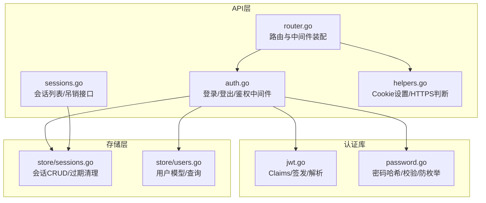
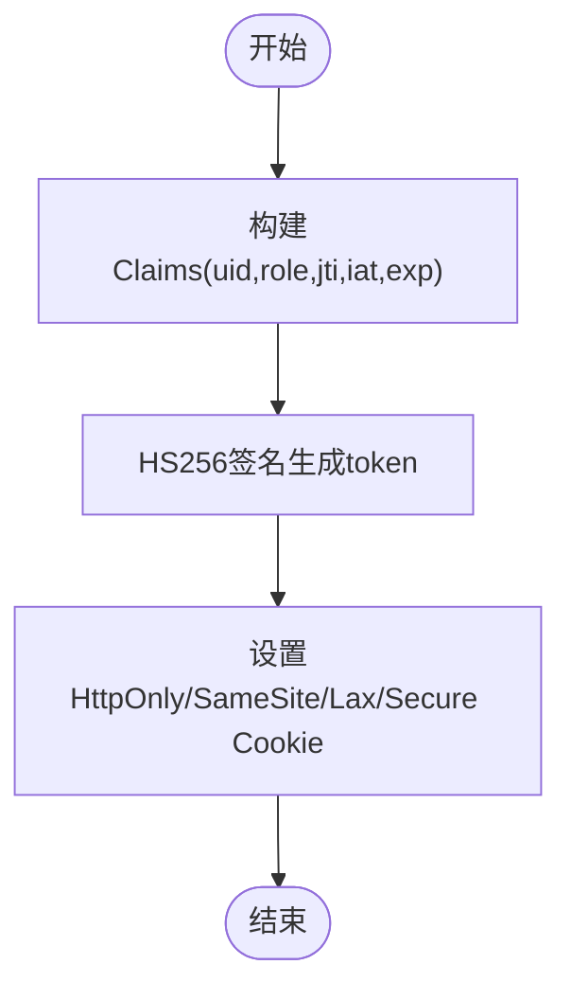
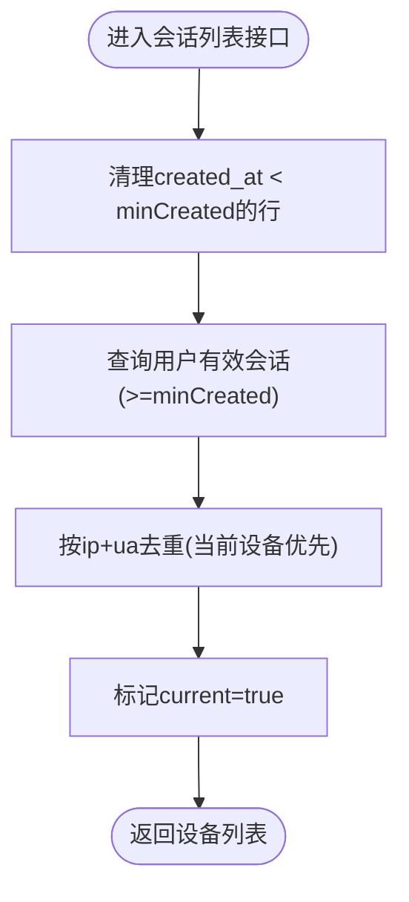
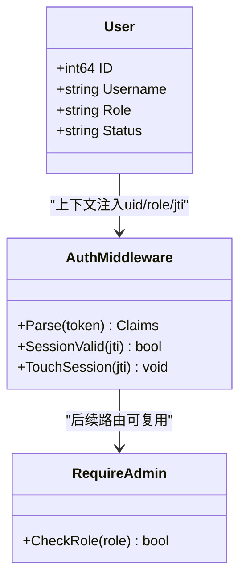
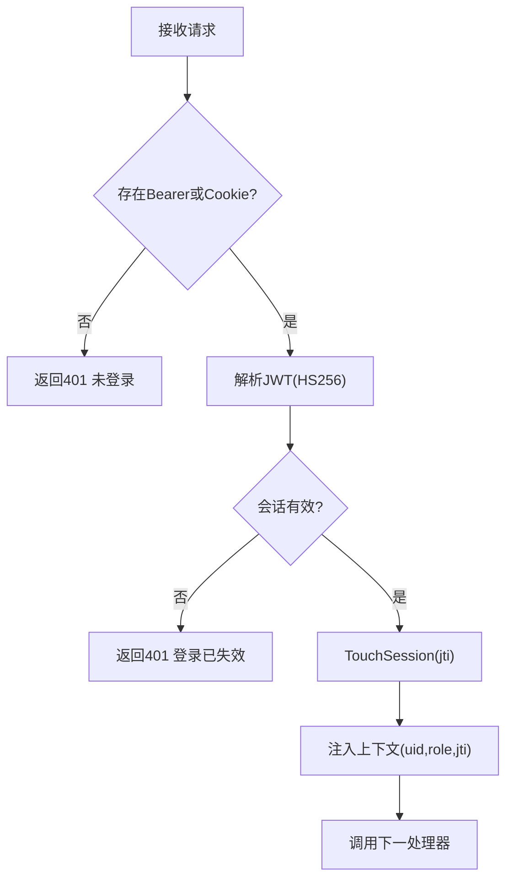
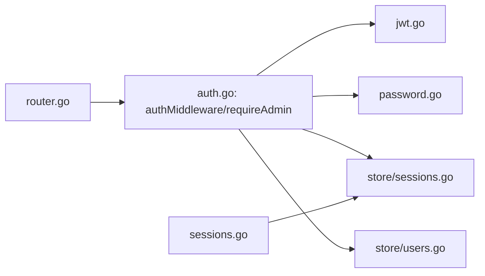

# 认证授权机制

<cite>
**本文引用的文件**
- [internal/auth/jwt.go](file://internal/auth/jwt.go)
- [internal/auth/password.go](file://internal/auth/password.go)
- [internal/api/auth.go](file://internal/api/auth.go)
- [internal/api/sessions.go](file://internal/api/sessions.go)
- [internal/store/sessions.go](file://internal/store/sessions.go)
- [internal/store/users.go](file://internal/store/users.go)
- [internal/api/router.go](file://internal/api/router.go)
- [internal/api/helpers.go](file://internal/api/helpers.go)
</cite>

## 目录
1. [简介](#简介)
2. [项目结构](#项目结构)
3. [核心组件](#核心组件)
4. [架构总览](#架构总览)
5. [详细组件分析](#详细组件分析)
6. [依赖关系分析](#依赖关系分析)
7. [性能考量](#性能考量)
8. [故障排查指南](#故障排查指南)
9. [结论](#结论)

## 简介
本文件系统性说明该项目的认证与授权机制，覆盖以下方面：
- JWT 令牌的签发、校验与会话绑定（含 Claims 设计、HS256 签名、有效期管理）
- 密码加密存储方案（哈希算法、盐值策略、登录时序防枚举）
- 会话管理机制（创建、过期清理、并发控制、设备去重）
- 用户权限模型（角色定义、访问控制策略）
- 认证中间件实现细节与安全最佳实践
- 常见安全问题防护与故障排查方法

## 项目结构
认证授权相关代码主要分布在以下模块：
- internal/auth：JWT 签发/解析、密码哈希/校验
- internal/api：HTTP 路由、认证中间件、登录/登出/会话接口
- internal/store：会话持久化、用户数据存取



图表来源
- [internal/api/auth.go:179-202](file://internal/api/auth.go#L179-L202)
- [internal/api/sessions.go:13-42](file://internal/api/sessions.go#L13-L42)
- [internal/api/router.go:177-213](file://internal/api/router.go#L177-L213)
- [internal/api/helpers.go:115-125](file://internal/api/helpers.go#L115-L125)
- [internal/auth/jwt.go:10-42](file://internal/auth/jwt.go#L10-L42)
- [internal/auth/password.go:5-23](file://internal/auth/password.go#L5-L23)
- [internal/store/sessions.go:15-133](file://internal/store/sessions.go#L15-L133)
- [internal/store/users.go:22-51](file://internal/store/users.go#L22-L51)

章节来源
- [internal/api/router.go:177-213](file://internal/api/router.go#L177-L213)
- [internal/api/auth.go:179-202](file://internal/api/auth.go#L179-L202)

## 核心组件
- JWT 令牌
  - Claims 包含用户ID、角色、标准时间字段及唯一标识（jti）
  - 使用 HS256 对称签名
  - 默认有效期为 7 天
- 密码安全
  - 使用 bcrypt 进行哈希存储与校验
  - 提供 dummy compare 以防御用户名枚举的时序侧信道
- 会话管理
  - 登录时生成 jti 并写入 sessions 表，记录 IP、UA、创建与最后活跃时间
  - 每次鉴权成功会更新 last_seen（限频至每分钟一次）
  - 支持按 jti 删除、按用户删除、批量清理过期会话
- 权限模型
  - 基于角色的访问控制（RBAC），当前仅区分 admin 与普通用户
  - 管理员路由通过 requireAdmin 中间件保护

章节来源
- [internal/auth/jwt.go:10-42](file://internal/auth/jwt.go#L10-L42)
- [internal/auth/password.go:5-23](file://internal/auth/password.go#L5-L23)
- [internal/store/sessions.go:15-133](file://internal/store/sessions.go#L15-L133)
- [internal/api/auth.go:204-213](file://internal/api/auth.go#L204-L213)

## 架构总览
下图展示了从登录到受保护资源访问的完整流程，包括 JWT 签发、Cookie 设置、中间件校验与会话有效性检查。

```mermaid
sequenceDiagram
participant C as "客户端"
participant API as "API服务"
participant ST as "存储(会话/用户)"
participant JWT as "JWT库"
C->>API : POST /api/auth/login (username,password)
API->>ST : 根据用户名查询用户
ST-->>API : 用户信息(含密码哈希,角色)
API->>API : DummyCompare(防枚举)
API->>API : CheckPassword(校验密码)
API->>ST : CreateSession(jti,ip,ua)
API->>JWT : Issue(secret,uid,role,jti,ttl)
JWT-->>API : token
API->>C : Set-Cookie(qz_token=token; HttpOnly; Secure; SameSite=Lax; Expires=+7d)
C->>API : GET /api/user/... (携带 Cookie/Authorization)
API->>JWT : Parse(token) -> Claims
API->>ST : SessionValid(jti)
ST-->>API : true/false
API->>ST : TouchSession(jti)
API-->>C : 业务响应
```

图表来源
- [internal/api/auth.go:112-149](file://internal/api/auth.go#L112-L149)
- [internal/api/auth.go:179-202](file://internal/api/auth.go#L179-L202)
- [internal/auth/jwt.go:16-42](file://internal/auth/jwt.go#L16-L42)
- [internal/store/sessions.go:15-36](file://internal/store/sessions.go#L15-L36)
- [internal/api/helpers.go:115-125](file://internal/api/helpers.go#L115-L125)

## 详细组件分析

### JWT 令牌：签发、验证与刷新
- Claims 设计
  - 自定义字段：用户ID、角色
  - 标准字段：jti（令牌唯一标识）、iat（签发时间）、exp（过期时间）
- 签名算法
  - 强制使用 HMAC（HS256），在解析时校验签名方法，拒绝非预期算法
- 有效期管理
  - 统一 TTL 为 7 天；Cookie 的 Expires 与 JWT exp 保持一致
  - 刷新策略：当前未实现服务端“无感刷新”端点；可通过重新登录或前端在到期前主动刷新获取新令牌
- 令牌撤销
  - 通过删除对应 jti 的会话行实现即时失效（登出、吊销设备）



图表来源
- [internal/auth/jwt.go:16-28](file://internal/auth/jwt.go#L16-L28)
- [internal/api/auth.go:51-65](file://internal/api/auth.go#L51-L65)
- [internal/api/helpers.go:115-125](file://internal/api/helpers.go#L115-L125)

章节来源
- [internal/auth/jwt.go:10-42](file://internal/auth/jwt.go#L10-L42)
- [internal/api/auth.go:51-65](file://internal/api/auth.go#L51-L65)
- [internal/api/helpers.go:115-125](file://internal/api/helpers.go#L115-L125)

### 密码加密存储与强度验证
- 哈希算法
  - 使用 bcrypt 默认成本因子进行哈希存储
- 盐值策略
  - bcrypt 内部自动处理盐值，无需外部管理
- 登录时序防护
  - 当用户不存在时执行 dummy compare，使响应时间与真实比较相近，避免用户名枚举
- 密码强度验证规则
  - 当前代码未实现显式密码复杂度校验逻辑；可在注册/改密入口增加规则（长度、字符集等）

章节来源
- [internal/auth/password.go:5-23](file://internal/auth/password.go#L5-L23)
- [internal/api/auth.go:122-137](file://internal/api/auth.go#L122-L137)

### 会话管理机制
- 会话创建
  - 登录成功后生成随机 jti，写入 sessions 表（user_id, jti, ip, user_agent, created_at, last_seen）
  - 同一设备的重复登录会先删除旧行再插入新行，避免重复计数
- 过期处理
  - 列出会话前先清理 created_at 早于 tokenTTL 的过期行
  - 鉴权时若 jti 不存在则视为无效
- 并发控制
  - TouchSession 限制每分钟最多更新一次 last_seen，降低写放大
  - 会话删除操作均带条件（如按 jti、按用户），保证幂等
- 设备去重
  - 列出会话时按 ip + user_agent 去重，保留最近活跃的一行，当前设备优先标记



图表来源
- [internal/api/sessions.go:13-27](file://internal/api/sessions.go#L13-L27)
- [internal/store/sessions.go:56-99](file://internal/store/sessions.go#L56-L99)

章节来源
- [internal/store/sessions.go:15-133](file://internal/store/sessions.go#L15-L133)
- [internal/api/sessions.go:13-42](file://internal/api/sessions.go#L13-L42)

### 用户权限模型与访问控制
- 角色定义
  - 用户角色存储在用户记录的 role 字段，默认 user，管理员为 admin
- 权限分配
  - 管理员能力由 requireAdmin 中间件保障，仅允许 role=admin 的请求进入
- 访问控制策略
  - 所有受保护路由统一经 authMiddleware 校验 JWT 与会话有效性
  - 管理员路由额外经 requireAdmin 校验角色



图表来源
- [internal/store/users.go:22-51](file://internal/store/users.go#L22-L51)
- [internal/api/auth.go:179-213](file://internal/api/auth.go#L179-L213)

章节来源
- [internal/api/auth.go:179-213](file://internal/api/auth.go#L179-L213)
- [internal/store/users.go:22-51](file://internal/store/users.go#L22-L51)

### 认证中间件实现细节
- 令牌来源
  - 优先读取 Authorization: Bearer <token>
  - 否则读取 Cookie qz_token
- 校验流程
  - 解析 JWT，强制要求 HS256
  - 校验 jti 对应的会话是否存在（支持远程注销/吊销）
  - 命中后更新 last_seen（限频）
  - 将 uid、role、jti 注入请求上下文供后续处理器使用
- 错误处理
  - 未携带令牌：401 未登录
  - 令牌无效或会话不存在：401 提示重新登录



图表来源
- [internal/api/auth.go:179-202](file://internal/api/auth.go#L179-L202)
- [internal/auth/jwt.go:30-42](file://internal/auth/jwt.go#L30-L42)

章节来源
- [internal/api/auth.go:179-202](file://internal/api/auth.go#L179-L202)

## 依赖关系分析
- API 层依赖
  - auth.go 依赖 jwt.go（签发/解析）、password.go（密码校验）、store/sessions.go（会话持久化）、store/users.go（用户查询）
  - router.go 装配 authMiddleware 与 requireAdmin，限定不同路由组的访问级别
  - helpers.go 提供安全的 Cookie 设置（HttpOnly、SameSite、Secure）
- 存储层
  - sessions.go 提供会话的创建、查询、清理、删除等操作，支撑登录态管理与设备列表展示
  - users.go 提供用户模型与查询，承载角色与状态信息



图表来源
- [internal/api/router.go:177-213](file://internal/api/router.go#L177-L213)
- [internal/api/auth.go:179-213](file://internal/api/auth.go#L179-L213)
- [internal/api/sessions.go:13-42](file://internal/api/sessions.go#L13-L42)
- [internal/auth/jwt.go:16-42](file://internal/auth/jwt.go#L16-L42)
- [internal/auth/password.go:5-23](file://internal/auth/password.go#L5-L23)
- [internal/store/sessions.go:15-133](file://internal/store/sessions.go#L15-L133)
- [internal/store/users.go:22-51](file://internal/store/users.go#L22-L51)

章节来源
- [internal/api/router.go:177-213](file://internal/api/router.go#L177-L213)
- [internal/api/auth.go:179-213](file://internal/api/auth.go#L179-L213)

## 性能考量
- 会话写放大控制
  - TouchSession 限制每分钟最多更新一次 last_seen，减少高频请求带来的数据库压力
- 会话列表优化
  - 列出会话前清理过期行，避免脏数据影响统计
  - 按 ip + user_agent 去重，减少结果集大小
- Cookie 传输开销
  - 使用 HttpOnly、SameSite=Lax、Secure 提升安全性，同时保持浏览器自动携带，减少额外头部
- 速率限制
  - 登录等敏感接口具备每IP限速，防止暴力破解与邮件轰炸

章节来源
- [internal/store/sessions.go:32-36](file://internal/store/sessions.go#L32-L36)
- [internal/api/sessions.go:13-27](file://internal/api/sessions.go#L13-L27)
- [internal/api/router.go:155-162](file://internal/api/router.go#L155-L162)

## 故障排查指南
- 无法登录
  - 检查用户名是否存在与密码是否正确；注意 dummy compare 的存在不会泄露用户是否存在
  - 确认 Cookie 是否被浏览器拦截（需 HTTPS 且 SameSite 配置正确）
- 登录后立即失效
  - 检查会话是否被手动吊销或删除；确认鉴权中间件对 jti 的有效性检查
- 多设备显示异常
  - 检查会话去重逻辑（ip + user_agent）；确认当前设备标记逻辑
- 管理员权限不足
  - 确认用户角色是否为 admin；检查 requireAdmin 中间件是否生效
- 令牌相关问题
  - 确认签名方法为 HS256；检查 exp 是否过期；核对 jti 是否在会话表中存在

章节来源
- [internal/api/auth.go:112-149](file://internal/api/auth.go#L112-L149)
- [internal/api/auth.go:179-202](file://internal/api/auth.go#L179-L202)
- [internal/store/sessions.go:56-99](file://internal/store/sessions.go#L56-L99)

## 结论
本项目采用“JWT + 会话绑定”的认证模式，结合 RBAC 的角色访问控制，实现了较为完善的登录、鉴权与会话管理能力。关键安全特性包括：
- 强制 HS256 签名与标准时间字段
- 会话级令牌撤销与设备管理
- 登录时序防枚举
- 安全的 Cookie 设置与速率限制

建议后续增强：
- 增加密码强度校验规则（注册/改密路径）
- 引入刷新令牌机制以提升用户体验
- 扩展角色粒度（细粒度权限）以满足更复杂的访问控制需求
