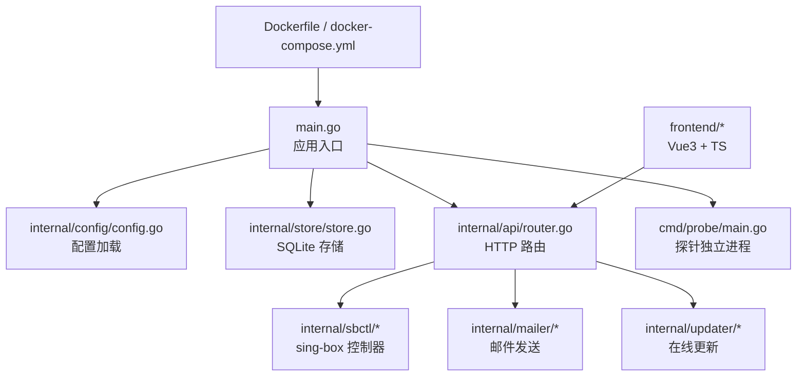
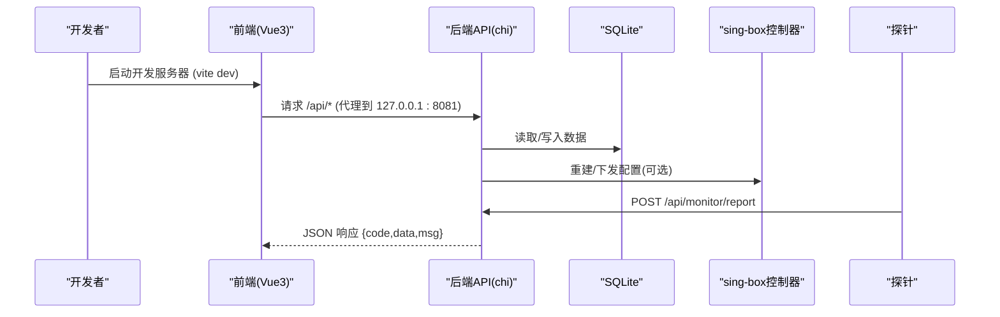
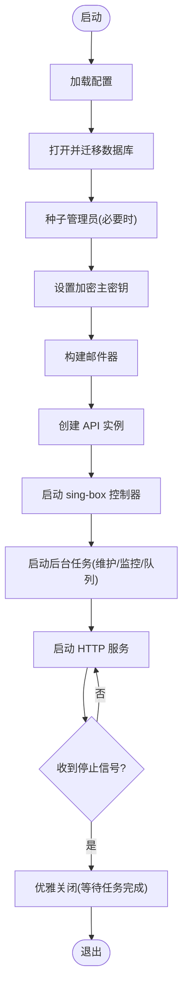
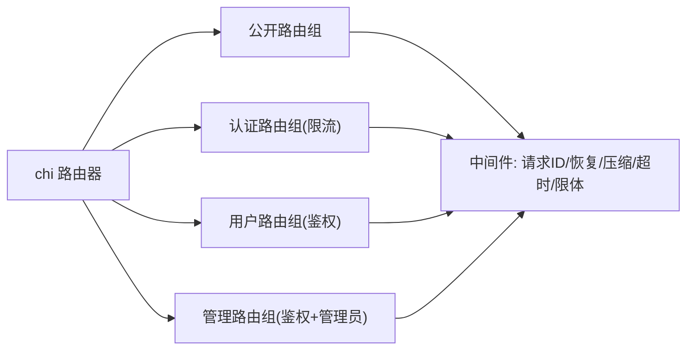
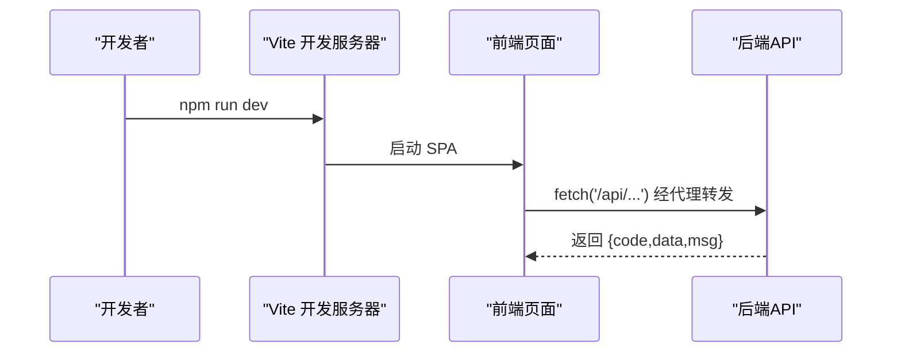
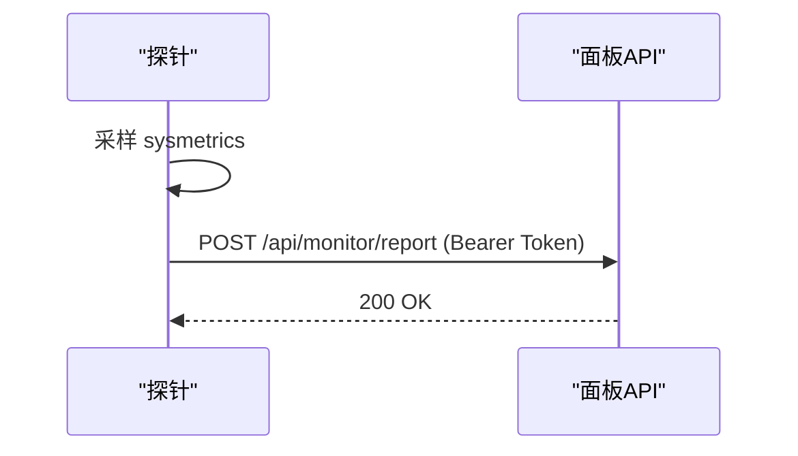
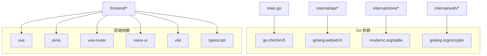

# 开发指南

<cite>
**本文引用的文件**
- [main.go](file://main.go)
- [go.mod](file://go.mod)
- [frontend/package.json](file://frontend/package.json)
- [frontend/tsconfig.json](file://frontend/tsconfig.json)
- [Dockerfile](file://Dockerfile)
- [docker-compose.yml](file://docker-compose.yml)
- [deploy/qingzhou.env.example](file://deploy/qingzhou.env.example)
- [internal/config/config.go](file://internal/config/config.go)
- [internal/api/router.go](file://internal/api/router.go)
- [internal/store/store.go](file://internal/store/store.go)
- [.github/workflows/ci.yml](file://.github/workflows/ci.yml)
- [install.sh](file://install.sh)
- [cmd/probe/main.go](file://cmd/probe/main.go)
- [frontend/src/main.ts](file://frontend/src/main.ts)
- [frontend/vite.config.ts](file://frontend/vite.config.ts)
- [frontend/src/api/index.ts](file://frontend/src/api/index.ts)
- [docs/部署与配置手册.md](file://docs/部署与配置手册.md)
</cite>

## 目录
1. [简介](#简介)
2. [项目结构](#项目结构)
3. [核心组件](#核心组件)
4. [架构总览](#架构总览)
5. [详细组件分析](#详细组件分析)
6. [依赖关系分析](#依赖关系分析)
7. [性能注意事项](#性能注意事项)
8. [故障排查指南](#故障排查指南)
9. [结论](#结论)
10. [附录](#附录)

## 简介
本指南面向贡献者与开发者，提供从环境搭建、代码规范、模块组织、工具链与 IDE 配置，到提交规范、调试排错、新功能开发与最佳实践的全流程说明。项目由 Go 后端（单二进制 + 内嵌前端）与 Vue+TypeScript 前端组成，使用 SQLite 作为数据持久化，支持 Docker 与 systemd 部署，并提供探针监控能力。

## 项目结构
- 根目录
  - main.go：应用入口，负责加载配置、初始化存储、启动 HTTP 服务、编排后台任务与 sing-box 控制器。
  - go.mod：Go 模块定义与依赖。
  - Dockerfile：多阶段构建镜像（前端构建 → Go 交叉编译 → 最小运行镜像）。
  - docker-compose.yml：本地快速启动示例。
  - install.sh：一键安装/升级脚本（Linux + systemd）。
  - deploy/qingzhou.env.example：环境变量模板。
  - .github/workflows/ci.yml：CI 流水线（Go 构建/测试、Shell 脚本语法检查、前端构建）。
- internal/*：后端核心逻辑
  - api/*：HTTP 路由与处理器（基于 chi），包含鉴权、限流、管理端点等。
  - store/*：SQLite 数据访问层（WAL、连接池、设置缓存等）。
  - config/config.go：运行时配置加载（QZ_* 环境变量）。
  - sbctl/sbproc/sbstats/singbox/acmesh 等：sing-box 控制、进程管理、统计采集、证书与链接生成等。
  - mailer/updater/sshctl/sysmetrics 等：邮件、在线更新、SSH 管理、系统指标等。
- frontend/*：Vue3 + TypeScript 前端
  - src/*：页面、组件、状态、路由、API 封装等。
  - vite.config.ts：Vite 开发服务器代理与构建配置。
  - tsconfig.json：TS 编译选项与路径别名。
  - package.json：依赖与脚本。
- cmd/probe/*：轻量探针程序，定时上报系统指标至面板。

**图示来源**
- [main.go:25-142](file://main.go#L25-L142)
- [internal/config/config.go:14-29](file://internal/config/config.go#L14-L29)
- [internal/store/store.go:27-58](file://internal/store/store.go#L27-L58)
- [internal/api/router.go:132-386](file://internal/api/router.go#L132-L386)
- [cmd/probe/main.go:34-92](file://cmd/probe/main.go#L34-L92)
- [Dockerfile:9-55](file://Dockerfile#L9-L55)
- [docker-compose.yml:10-37](file://docker-compose.yml#L10-L37)

**章节来源**
- [main.go:25-142](file://main.go#L25-L142)
- [go.mod:1-26](file://go.mod#L1-L26)
- [frontend/package.json:1-27](file://frontend/package.json#L1-L27)
- [frontend/tsconfig.json:1-25](file://frontend/tsconfig.json#L1-L25)
- [Dockerfile:9-55](file://Dockerfile#L9-L55)
- [docker-compose.yml:10-37](file://docker-compose.yml#L10-L37)
- [internal/config/config.go:14-29](file://internal/config/config.go#L14-L29)
- [internal/api/router.go:132-386](file://internal/api/router.go#L132-L386)
- [internal/store/store.go:27-58](file://internal/store/store.go#L27-L58)
- [cmd/probe/main.go:34-92](file://cmd/probe/main.go#L34-L92)

## 核心组件
- 应用生命周期（main）
  - 加载配置、打开并迁移数据库、种子管理员账号、设置加密密钥、构建邮件器、创建 API 实例、启动 sing-box 控制器与后台任务、启动 HTTP 服务、优雅关闭。
- HTTP 路由与中间件
  - 基于 chi 的路由分组：公开接口、认证接口、管理端点；内置请求 ID、恢复、压缩、超时、最大请求体限制；按 IP 的速率限制用于登录/注册/重置/探针上报等。
- 数据存储
  - SQLite（modernc/sqlite），启用 WAL、外键、同步策略、事务锁优化；连接池大小 8；设置表内存缓存并在写时失效。
- 配置与环境变量
  - 通过 QZ_* 环境变量覆盖默认值（监听地址、数据库路径、管理员账号、公共访问地址、探针目录、更新源等）。
- 探针
  - 独立可执行，定时采集 CPU/内存/磁盘/网络/负载/进程指标，POST 到面板 /api/monitor/report。

**章节来源**
- [main.go:25-142](file://main.go#L25-L142)
- [internal/api/router.go:132-386](file://internal/api/router.go#L132-L386)
- [internal/store/store.go:27-58](file://internal/store/store.go#L27-L58)
- [internal/config/config.go:14-29](file://internal/config/config.go#L14-L29)
- [cmd/probe/main.go:34-92](file://cmd/probe/main.go#L34-L92)

## 架构总览

**图示来源**
- [frontend/vite.config.ts:12-26](file://frontend/vite.config.ts#L12-L26)
- [internal/api/router.go:149-175](file://internal/api/router.go#L149-L175)
- [internal/store/store.go:27-58](file://internal/store/store.go#L27-L58)
- [cmd/probe/main.go:75-92](file://cmd/probe/main.go#L75-L92)

## 详细组件分析

### 后端：应用入口与生命周期
- 职责
  - 加载配置、初始化存储、种子管理员、设置加密密钥、构建邮件器、创建 API、启动 sing-box 控制器与后台任务、启动 HTTP 服务、优雅关闭。
- 关键点
  - 敏感配置主密钥优先来自环境变量 QZ_SECRET_KEY，未设置时使用 JWT 密钥并发出警告。
  - 控制器循环与队列推进在关闭时需等待完成，避免与数据库关闭竞争。
  - 健康检查与日志输出便于运维观测。

**图示来源**
- [main.go:25-142](file://main.go#L25-L142)

**章节来源**
- [main.go:25-142](file://main.go#L25-L142)

### 后端：HTTP 路由与中间件
- 分组
  - 公开接口：健康检查、配置、验证、订阅、监控公开页。
  - 认证接口：登录、注册、忘记密码、重置密码（带 IP 级限流）。
  - 用户接口：仪表盘、套餐、订阅、流量统计、会话管理等。
  - 管理接口：设置、备份、节点/入站/出站/TLS/Reality、证书中心、服务器管理、监控看板、公告、套餐/订单/退款、用量分析等。
- 中间件
  - RequestID、Recoverer、Compress、Timeout、最大请求体限制、受信任代理的客户端 IP 解析。
- 速率限制
  - 登录/注册/重置、探针上报、订阅地址切换等均有独立的限流器。

**图示来源**
- [internal/api/router.go:132-386](file://internal/api/router.go#L132-L386)

**章节来源**
- [internal/api/router.go:132-386](file://internal/api/router.go#L132-L386)

### 后端：数据存储（SQLite）
- 设计要点
  - 使用 modernc/sqlite（纯 Go，无 CGO），开启 WAL 模式提升并发读能力。
  - 连接池大小 8，避免嵌套读死锁。
  - 设置表全量缓存于内存，写时失效，减少高频读取开销。
  - 事务锁策略与 busy_timeout 降低竞态失败概率。
- 扩展点
  - 新增表或索引需配合迁移逻辑；敏感字段建议通过加密层保护。

**章节来源**
- [internal/store/store.go:27-58](file://internal/store/store.go#L27-L58)

### 前端：工程与开发工作流
- 技术栈
  - Vue 3 + TypeScript + Vite + Pinia + Naive UI + ECharts。
- 开发服务器
  - 端口 5173，自动将 /api 和 /sub 代理到后端 127.0.0.1:8081。
- 构建产物
  - 构建输出到 frontend/dist，被 Go 二进制嵌入后随面板一起发布。
- 类型与路径
  - 启用严格模式，路径别名 @/* 指向 src。

**图示来源**
- [frontend/vite.config.ts:12-26](file://frontend/vite.config.ts#L12-L26)
- [frontend/src/api/index.ts:9-48](file://frontend/src/api/index.ts#L9-L48)

**章节来源**
- [frontend/package.json:1-27](file://frontend/package.json#L1-L27)
- [frontend/tsconfig.json:1-25](file://frontend/tsconfig.json#L1-L25)
- [frontend/vite.config.ts:1-32](file://frontend/vite.config.ts#L1-L32)
- [frontend/src/main.ts:1-11](file://frontend/src/main.ts#L1-L11)
- [frontend/src/api/index.ts:1-124](file://frontend/src/api/index.ts#L1-L124)

### 探针：监控数据采集与上报
- 功能
  - 定时采集系统指标，POST 到面板 /api/monitor/report，支持命令行参数与环境变量两种方式配置。
- 安全
  - 推荐通过 systemd EnvironmentFile 注入 token，避免命令历史泄露。
  - 支持跳过 TLS 校验仅用于本地测试。

**图示来源**
- [cmd/probe/main.go:34-92](file://cmd/probe/main.go#L34-L92)
- [internal/api/router.go:164-175](file://internal/api/router.go#L164-L175)

**章节来源**
- [cmd/probe/main.go:34-92](file://cmd/probe/main.go#L34-L92)

## 依赖关系分析
- Go 依赖
  - 路由：go-chi/chi/v5
  - 鉴权：golang-jwt/jwt/v5
  - UUID：google/uuid
  - 加密/网络：golang.org/x/crypto, golang.org/x/net
  - YAML：gopkg.in/yaml.v3
  - 数据库：modernc.org/sqlite（纯 Go，无 CGO）
- 前端依赖
  - Vue、Pinia、Router、Naive UI、ECharts、Vite、TypeScript。

**图示来源**
- [go.mod:5-13](file://go.mod#L5-L13)
- [frontend/package.json:11-25](file://frontend/package.json#L11-L25)

**章节来源**
- [go.mod:1-26](file://go.mod#L1-L26)
- [frontend/package.json:1-27](file://frontend/package.json#L1-L27)

## 性能注意事项
- 数据库
  - 使用 WAL 与合理连接池，避免读写阻塞；设置表缓存减少重复查询。
- HTTP
  - 启用 gzip 压缩对 JSON 与静态资源收益明显；设置合理的超时与最大请求体大小。
- 限流
  - 针对认证、探针上报、订阅地址切换等关键路径实施 IP/用户维度限流，防止滥用。
- 构建
  - 使用 -trimpath 与 -ldflags 去除调试信息，减小体积；多阶段构建分离前端与后端。

[本节为通用指导，不直接分析具体文件]

## 故障排查指南
- 无法访问面板
  - 检查 QZ_LISTEN 是否为回环地址且未配置反代；参考一键安装脚本提示与安全组/防火墙放行。
- 修改配置不生效
  - 面板会触发 sing-box 配置重建；若某节点失败，可在“链路拓扑”查看原因并重试下发。
- 流量统计为 0
  - 确认落地机安装了带 v2ray_api 的 sing-box；核对 QZ_SINGBOX_V2RAY 与配置一致。
- 探针上报失败
  - 检查 QZ_PROBE_SERVER/QZ_PROBE_TOKEN 是否正确；确认面板 /api/monitor/report 可达。
- 在线更新失败
  - 可通过“在线更新”页进行回滚；也可指定历史版本重新安装。

**章节来源**
- [docs/部署与配置手册.md:237-261](file://docs/部署与配置手册.md#L237-L261)
- [install.sh:353-406](file://install.sh#L353-L406)

## 结论
本项目采用清晰的模块化设计与稳健的运行期保障（限流、超时、优雅关闭、WAL 数据库、探针监控）。遵循本指南的环境搭建、代码规范与协作流程，可高效开展新功能开发与问题定位。建议在新增功能时同步完善测试与文档，确保可维护性与可观测性。

## 附录

### 开发环境搭建
- Go 环境
  - 版本：1.25（见 CI 与 go.mod）。
  - 依赖：go mod download。
- Node.js 环境
  - 版本：20（见 CI 与 Dockerfile）。
  - 安装依赖：cd frontend && npm ci。
- 数据库
  - SQLite（WAL），无需外部服务；首次启动会自动迁移与种子。
- 环境变量
  - 参考 deploy/qingzhou.env.example 与 docs/部署与配置手册.md 中的常用项（QZ_LISTEN、QZ_DB、QZ_PUBLIC_BASE、QZ_SECRET_KEY、QZ_ADMIN_USER/PASS、QZ_PROBE_DIR、SMTP 相关等）。

**章节来源**
- [go.mod:3-3](file://go.mod#L3-L3)
- [.github/workflows/ci.yml:15-39](file://.github/workflows/ci.yml#L15-L39)
- [Dockerfile:10-34](file://Dockerfile#L10-L34)
- [deploy/qingzhou.env.example:1-43](file://deploy/qingzhou.env.example#L1-L43)
- [docs/部署与配置手册.md:92-131](file://docs/部署与配置手册.md#L92-L131)

### 代码规范与命名约定
- Go 代码风格
  - 遵循标准库与社区惯例；包名小写、函数/类型首字母大写按需暴露；错误处理显式返回；注释清晰。
- TypeScript 规范
  - 启用严格模式；统一使用 ESNext 模块；路径别名 @/*；保持类型安全与最小副作用。
- Git 工作流
  - 分支模型：feature/xxx、fix/xxx、release/xxx；PR 前确保 CI 通过（Go vet/test -race、前端构建、Shell 脚本语法检查）。
  - 提交信息：语义化（feat/fix/chore/docs），描述变更影响范围。

**章节来源**
- [.github/workflows/ci.yml:15-69](file://.github/workflows/ci.yml#L15-L69)
- [frontend/tsconfig.json:1-25](file://frontend/tsconfig.json#L1-L25)

### 模块组织原则
- 后端
  - internal 下按领域划分：api（HTTP）、store（数据）、config（配置）、sbctl/sbproc/sbstats（sing-box 控制与统计）、mailer/updater/sshctl（辅助能力）。
- 前端
  - src 下按功能划分：views（页面）、components（组件）、stores（状态）、router（路由）、utils（工具）、styles（样式）。

**章节来源**
- [internal/api/router.go:132-386](file://internal/api/router.go#L132-L386)
- [frontend/src/main.ts:1-11](file://frontend/src/main.ts#L1-L11)

### 开发工具链与 IDE 建议
- 后端
  - 使用 go build 与 go test -race 进行构建与并发检测；VS Code 推荐 Go 插件与 linter。
- 前端
  - 使用 Vite 开发服务器与 vue-tsc 类型检查；VS Code 推荐 Vue 与 TypeScript 插件。
- 容器化
  - 使用 Dockerfile 多阶段构建；docker-compose 快速启动。

**章节来源**
- [.github/workflows/ci.yml:15-69](file://.github/workflows/ci.yml#L15-L69)
- [Dockerfile:9-55](file://Dockerfile#L9-L55)
- [docker-compose.yml:10-37](file://docker-compose.yml#L10-L37)

### 代码审查流程与提交规范
- 审查要点
  - 安全性：鉴权、限流、输入校验、敏感配置加密。
  - 可靠性：错误处理、超时、重试、优雅关闭。
  - 可维护性：模块化、注释、测试覆盖。
- 提交流程
  - 本地先跑 go vet、go test -race、npm run build；提交 PR 后等待 CI 全部通过。

**章节来源**
- [.github/workflows/ci.yml:15-69](file://.github/workflows/ci.yml#L15-L69)

### 调试技巧与故障排查
- 后端
  - 使用日志观察启动流程与错误；通过 /api/health 检查服务健康；journalctl 查看 systemd 日志。
- 前端
  - 浏览器 Network 面板查看请求与响应；利用统一的 API 封装错误处理跳转登录。
- 探针
  - 检查 QZ_PROBE_SERVER/QZ_PROBE_TOKEN；确认 /api/monitor/report 可达；必要时临时使用 -insecure 调试。

**章节来源**
- [main.go:25-142](file://main.go#L25-L142)
- [frontend/src/api/index.ts:9-48](file://frontend/src/api/index.ts#L9-L48)
- [cmd/probe/main.go:34-92](file://cmd/probe/main.go#L34-L92)

### 新功能开发流程与最佳实践
- 需求分析与设计
  - 明确输入/输出、权限边界、错误场景与性能要求。
- 实现
  - 后端：新增路由与处理器，复用鉴权与限流中间件；数据访问走 store 层；必要时触发 sing-box 重建。
  - 前端：新增视图/组件/状态，封装 API 调用，统一错误处理。
- 测试
  - 编写单元测试与集成测试；确保并发安全（-race）；前端类型检查通过。
- 文档与部署
  - 更新相关文档与示例；在 CI 中验证构建与测试；必要时更新环境变量与部署脚本。

[本节为通用指导，不直接分析具体文件]
