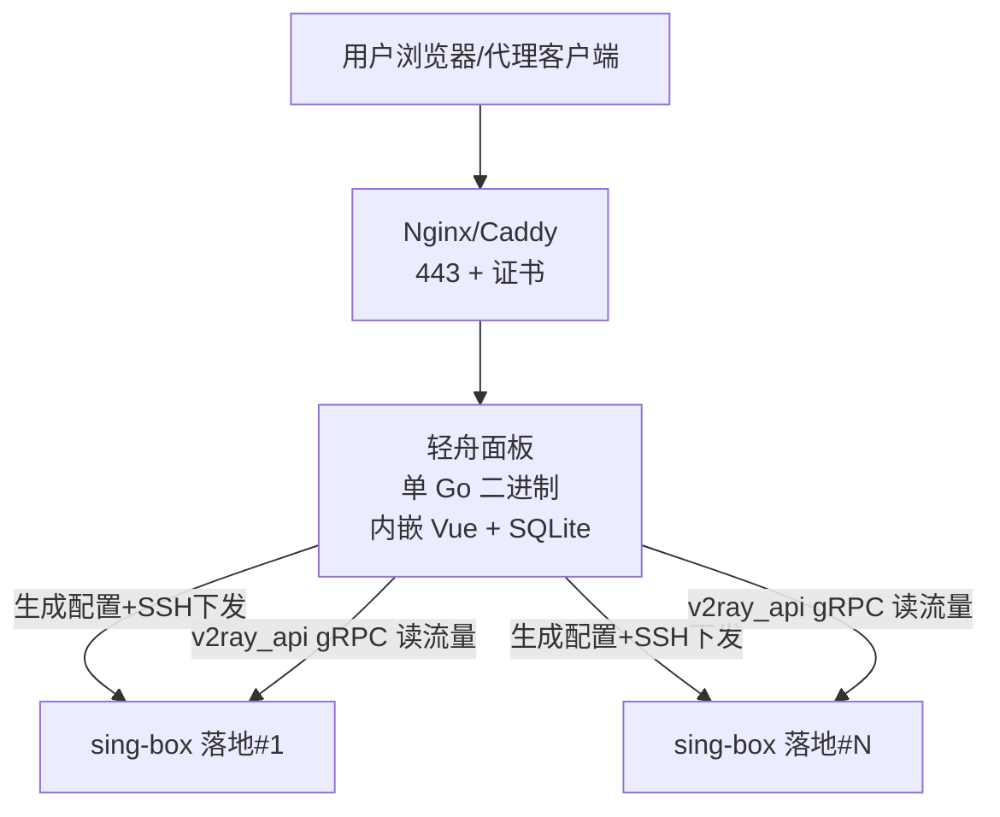

# 快速开始

<cite>
**本文引用的文件**
- [README.md](file://README.md)
- [install.sh](file://install.sh)
- [Dockerfile](file://Dockerfile)
- [docker-compose.yml](file://docker-compose.yml)
- [deploy/qingzhou.env.example](file://deploy/qingzhou.env.example)
- [main.go](file://main.go)
- [internal/config/config.go](file://internal/config/config.go)
- [go.mod](file://go.mod)
- [deploy/qingzhou.service](file://deploy/qingzhou.service)
- [docs/部署与配置手册.md](file://docs/部署与配置手册.md)
</cite>

## 目录
1. [简介](#简介)
2. [环境准备](#环境准备)
3. [安装方式](#安装方式)
4. [初始配置](#初始配置)
5. [基本使用示例](#基本使用示例)
6. [常见问题与排错](#常见问题与排错)
7. [架构概览](#架构概览)
8. [依赖关系分析](#依赖关系分析)
9. [性能与安全建议](#性能与安全建议)
10. [结论](#结论)

## 简介
轻舟是一个面向终端用户的轻量级多用户代理订阅管理面板，单文件部署、自管原生 sing-box，把“人/钱/节点/订阅/统计”一站式管起来。它适合在小型机器上同时运行面板与落地节点，提供可视化后台、订阅链接生成、流量统计与运维能力。

## 环境准备
- 操作系统
  - Linux amd64 / arm64（一键脚本与在线更新仅支持 Linux；其他系统可用 Docker 或源码构建）
- Go 版本
  - 仅编译时需要 Go 1.25+；使用 release 二进制或 Docker 则不需要
- 客户端 sing-box 版本
  - 若使用 sing-box 格式订阅，客户端需 ≥ 1.12（旧 DNS 写法在 1.14 已移除）
- 可选
  - 域名 + HTTPS 证书（生产强烈建议）
  - SMTP 服务器（用于邮箱验证/找回密码）
- 运行时依赖
  - systemd（Linux 服务管理）
  - curl 或 wget（下载与校验）
  - SQLite（WAL 模式，纯 Go 实现，无 CGO）

章节来源
- [README.md:125-135](file://README.md#L125-L135)
- [go.mod:1-13](file://go.mod#L1-L13)
- [docs/部署与配置手册.md:237-261](file://docs/部署与配置手册.md#L237-L261)

## 安装方式
以下三种方式任选其一：一键脚本（推荐）、手动安装、Docker 容器化。

### 一、一键安装脚本（Linux 裸机推荐）
- 执行命令后会自动识别架构、下载最新 release、SHA-256 校验、交互式引导配置（监听地址/访问地址/管理员账号，密钥自动生成）、写入 systemd 并启动；已安装则原地升级（配置与数据库不动，二进制原子替换）。
- 常用参数
  - --version vX.Y.Z 指定版本
  - --force 同版本强制重装
  - --proxy https://mirror.ghproxy.com/ 国内加速
- 卸载
  - 安装时脚本会保存自身到 /opt/qingzhou/install.sh，卸载命令为 bash /opt/qingzhou/install.sh uninstall

预期输出要点
- 安装完成后提示面板地址、管理员用户名、首次随机密码（如未设置 QZ_ADMIN_PASS）
- 若启用防火墙（ufw/firewalld），会提示放行端口
- 当前为明文 HTTP，建议尽快套 nginx/caddy + 证书

章节来源
- [README.md:137-160](file://README.md#L137-L160)
- [install.sh:136-149](file://install.sh#L136-L149)
- [install.sh:151-193](file://install.sh#L151-L193)
- [install.sh:195-215](file://install.sh#L195-L215)
- [install.sh:217-311](file://install.sh#L217-L311)
- [install.sh:313-407](file://install.sh#L313-L407)

### 二、手动安装流程
- 将二进制放置到 /opt/qingzhou/qingzhou（chmod +x）
- 编写环境变量配置文件 /opt/qingzhou/qingzhou.env（chmod 600），常用项包括监听地址、数据库路径、对外访问地址、敏感加密主密钥、sing-box 相关路径与服务名等
- 安装 systemd 服务单元 deploy/qingzhou.service，并启用与启动
- 前置 Nginx/Caddy 反代到 QZ_LISTEN，配置 HTTPS（转发 Host 与 X-Forwarded-*）
- 备份：可使用仓库提供的 backup.sh 或面板内“在线更新”页的一键导出整库快照

预期输出要点
- systemctl enable --now qingzhou 成功后可通过浏览器访问 http://服务器IP:8081（或配置的域名）
- 首次启动自动初始化数据库并创建管理员账户

章节来源
- [README.md:211-242](file://README.md#L211-L242)
- [deploy/qingzhou.env.example:1-43](file://deploy/qingzhou.env.example#L1-L43)
- [deploy/qingzhou.service:1-22](file://deploy/qingzhou.service#L1-L22)
- [docs/部署与配置手册.md:92-132](file://docs/部署与配置手册.md#L92-L132)

### 三、Docker 容器化部署
- 使用 docker-compose 快速拉起
  - 修改 QZ_PUBLIC_BASE 与 QZ_SECRET_KEY（建议使用 openssl rand -hex 32）
  - 执行 docker compose up -d
  - 首启日志会打印随机管理员密码（未设置 QZ_ADMIN_PASS 时）
- 或使用镜像直接运行
  - docker run -d -p 8081:8081 -e QZ_SECRET_KEY=$(openssl rand -hex 32) -v qingzhou-data:/data ghcr.io/mllt992/qing-zhou:latest
- 升级方式
  - 拉新镜像并重建容器

预期输出要点
- 容器健康检查通过后可通过映射端口访问面板
- 数据持久化到命名卷 qingzhou-data

章节来源
- [README.md:161-173](file://README.md#L161-L173)
- [docker-compose.yml:1-37](file://docker-compose.yml#L1-L37)
- [Dockerfile:1-55](file://Dockerfile#L1-L55)

## 初始配置
- 环境变量优先级
  - 启动时读取的环境变量优先于面板内“系统设置”
  - SMTP 相关改后即时生效，其余环境变量改动需重启服务
- 关键环境变量说明
  - QZ_LISTEN：监听地址，默认 0.0.0.0:8081（明文 HTTP，建议尽快套反代+证书；有反代时改为 127.0.0.1:8081）
  - QZ_DB：SQLite 数据库文件路径（相对路径基于进程工作目录）
  - QZ_PUBLIC_BASE：面板对外访问地址（订阅链接、探针安装、邮件链接、sing-box 安装命令均使用）
  - QZ_TRUSTED_PROXIES：受信任反代的 IP/CIDR（反代不在本机时必须设）
  - QZ_PROBE_DIR：探针二进制目录（二进制部署须设为绝对目录）
  - QZ_WEB_DIR：从磁盘读前端资源（生产留空用内嵌资源）
  - QZ_ADMIN_USER / QZ_ADMIN_PASS：初始管理员账户（仅首次 seed 生效）
  - QZ_SECRET_KEY：加密库内敏感配置的主密钥（建议 openssl rand -hex 32，置环境变量不入库）
  - QZ_UPDATE_REPO / QZ_UPDATE_GITHUB_TOKEN：在线更新仓库与 GitHub Token（可选）
  - QZ_SINGBOX_BIN / QZ_SINGBOX_CONFIG / QZ_SINGBOX_UNIT / QZ_SINGBOX_V2RAY / QZ_SINGBOX_STATS_INTERVAL：sing-box 控制与统计相关
  - QZ_SMTP_*：SMTP 配置（也可在面板设置页填写，密码加密存储）
- 数据库初始化与管理员账户
  - 首次启动会自动初始化数据库并创建管理员账户
  - 未设置 QZ_ADMIN_PASS 时会随机生成密码并打印到启动日志（登录后请立即修改）
  - JWT 密钥由程序首次启动自动生成并存入数据库

章节来源
- [README.md:267-291](file://README.md#L267-L291)
- [internal/config/config.go:5-29](file://internal/config/config.go#L5-L29)
- [main.go:25-63](file://main.go#L25-L63)
- [deploy/qingzhou.env.example:1-43](file://deploy/qingzhou.env.example#L1-L43)

## 基本使用示例
以下为“添加第一个节点、配置基础功能”的推荐顺序与操作要点：

- 登录后台后按顺序配置
  1) 服务器
     - 单机落地用默认值即可；多落地则在“服务器”新增，填一键脚本输出的 host/SSH/路径
  2) TLS / Reality
     - 一键生成 Reality 密钥对 + short_id，借用域名（抗封锁且无需自有证书）
     - 需要真实证书时，去“证书管理”一键 ACME 签发（Let's Encrypt，Cloudflare DNS-01）或粘贴已有证书
  3) 入站（节点）
     - 选协议建入站并绑定上一步的 TLS；同机可建多协议入站，订阅会自动聚成“锁定 IP·切协议”优选组
     - 需要中转时在入站的“落地/中转”里选一个落地入站；想让某入站从购买的静态 IP 出网，则在“代理出口”页录入 SOCKS5/HTTP 代理并在入站上选择
  4) 分组
     - 把节点归类（免费/高级…），订阅与套餐都按分组授权；可在“设置”里指定免费分组
  5) 套餐（商品）
     - 建流量包/订阅套餐并绑定可访问的分组
  6) 机场订阅源（可选）
     - 粘贴外部机场订阅链接，定时抓取聚合进来

- 普通用户流程
  - 注册 →（用积分购买套餐，或由管理员开通）→ 打开“订阅管理”复制链接或扫码 → 导入客户端
  - 同一条链接通用所有客户端，自动返回对应格式（Clash/sing-box/Surge/base64）

预期输出要点
- 成功创建入站后，可在“链路拓扑”查看客户端→入站→(中转→落地)→互联网的链路
- 订阅链接支持多端自适应，浏览器打开会显示可读信息页（剩余流量/到期/节点数+一键复制）

章节来源
- [README.md:246-264](file://README.md#L246-L264)
- [docs/部署与配置手册.md:135-209](file://docs/部署与配置手册.md#L135-L209)

## 常见问题与排错
- 面板装完打不开
  - 检查 QZ_LISTEN 是否为回环地址且未配反代；修复命令参考一键脚本提示
  - 检查云服务器安全组与本機防火墙是否放行端口
- 改完不生效
  - 面板每次改动会重建配置；后台也有约 1 分钟的定时重建
- 某落地下发失败
  - 到“sing-box → 链路拓扑”，失败的机器下方会显示原因（SSH 连不上、节点上 sing-box check 不过等）
  - 查看“服务器”页该机版本是否标红（低于最低版本会停止下发配置），必要时一键重装
- 统计无数据（所有人都是 0）
  - 多半是装了官方版 sing-box（不含 with_v2ray_api）；在落地机执行 sing-box version | grep with_v2ray_api 确认
  - 检查 QZ_SINGBOX_V2RAY 与配置中 experimental.v2ray_api.listen 是否一致
- sing-box 启动失败
  - journalctl -u sing-box -n 50 或 sing-box check -c /etc/sing-box/config.json
- 客户端导入 sing-box 订阅报错/加载失败
  - 客户端需 ≥ 1.12；旧 DNS 写法在 1.14 已移除，面板下发时会改写自定义模板为新写法
- 升级后面板起不来
  - “在线更新”页点回滚——用的是升级时留在本机的旧二进制，不联网、不重新下载

章节来源
- [docs/部署与配置手册.md:237-261](file://docs/部署与配置手册.md#L237-L261)
- [README.md:211-242](file://README.md#L211-L242)

## 架构概览
轻舟作为中心机，负责业务、订阅、统计与管理；通过 SSH 向多台落地 sing-box 下发配置，并通过 v2ray_api gRPC 采集每用户流量。面板与 sing-box 可同机或分离部署。

图表来源
- [README.md:99-121](file://README.md#L99-L121)

章节来源
- [README.md:99-121](file://README.md#L99-L121)

## 依赖关系分析
- 后端技术栈
  - Go 1.25，路由 go-chi/v5，鉴权 golang-jwt/v5
  - 数据库 SQLite（modernc.org/sqlite，纯 Go 免 CGO，WAL 模式）
- 前端技术栈
  - Vue 3 + Vite 单页应用，构建产物嵌入二进制
- 与 sing-box 对接
  - internal/singbox（配置生成/分享链接/Reality 密钥）
  - sbproc（写→check→原子替换→reload）
  - sbstats（手写 gRPC-over-h2c 读 v2ray 统计）
  - sbctl（编排）
  - sshctl（多机下发）
  - acmesh（ACME 证书签发/续期）
- 订阅转换
  - internal/subconv：vless/vmess/ss/trojan/hysteria2/tuic ↔ base64/Clash/sing-box/Surge，注入优选组与分流模板

章节来源
- [README.md:295-304](file://README.md#L295-L304)
- [go.mod:1-26](file://go.mod#L1-L26)

## 性能与安全建议
- 性能
  - 使用 WAL 模式的 SQLite，纯 Go 无 CGO，内存占用低，适合小机器
  - 合理设置 QZ_SINGBOX_STATS_INTERVAL 以平衡统计频率与负载
  - 使用 Brutal/Mux/TCP Fast Open/MPTCP 等传输层优化（两端对称才生效）
- 安全
  - 生产务必套 HTTPS（Nginx/Caddy），并将 QZ_LISTEN 设置为 127.0.0.1:8081
  - 设置 QZ_SECRET_KEY 作为敏感配置主密钥，避免泄露
  - 反代不在本机时设置 QZ_TRUSTED_PROXIES，确保限流与链接生成拿到真实客户端 IP
  - 生成的节点配置默认阻断私网出口（内网段/127.0.0.1/云元数据），防止内网探测

章节来源
- [README.md:267-291](file://README.md#L267-L291)
- [docs/部署与配置手册.md:237-261](file://docs/部署与配置手册.md#L237-L261)

## 结论
通过一键脚本、手动安装或 Docker 容器化，您可以在最短时间内完成轻舟面板的部署与初始配置。按照推荐的配置顺序（服务器→TLS/Reality→入站→分组→套餐→订阅源），即可快速上线并提供稳定的订阅服务。遇到问题时，可依据常见问题与排错指南定位并解决。
