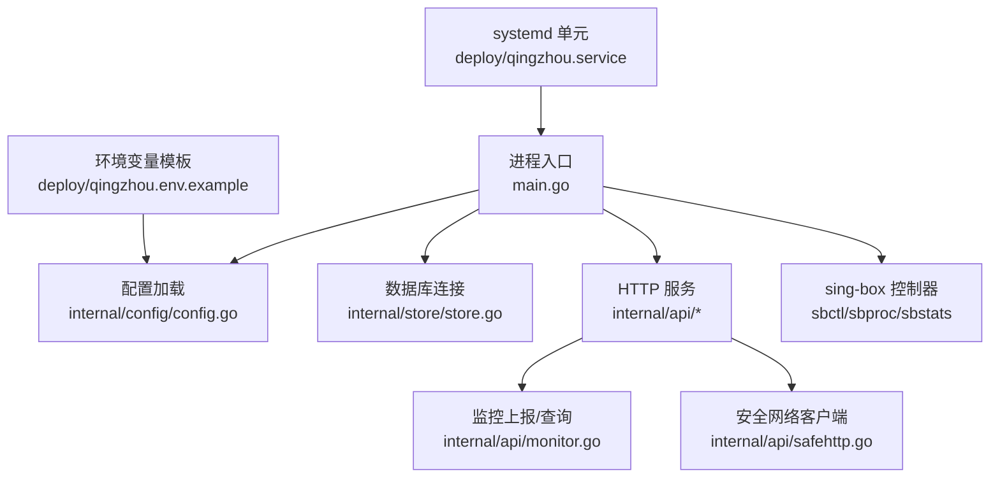
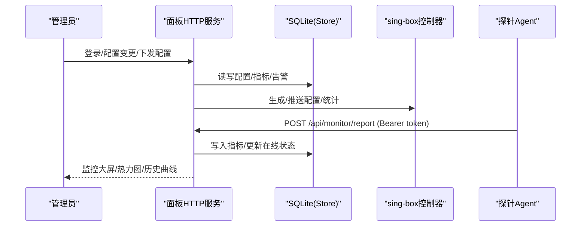
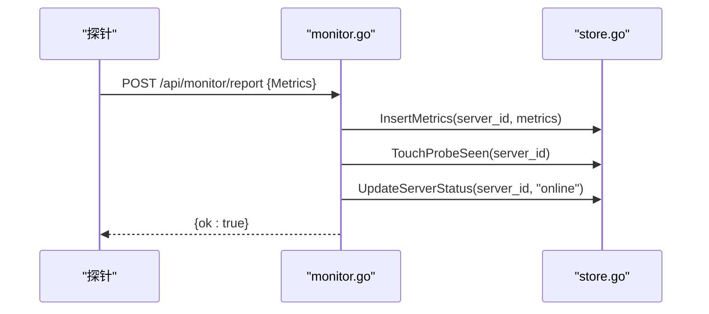
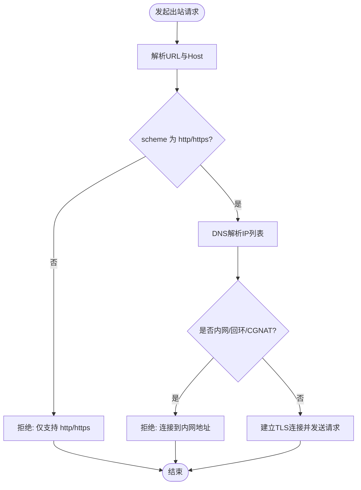
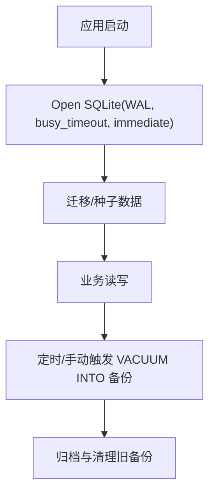
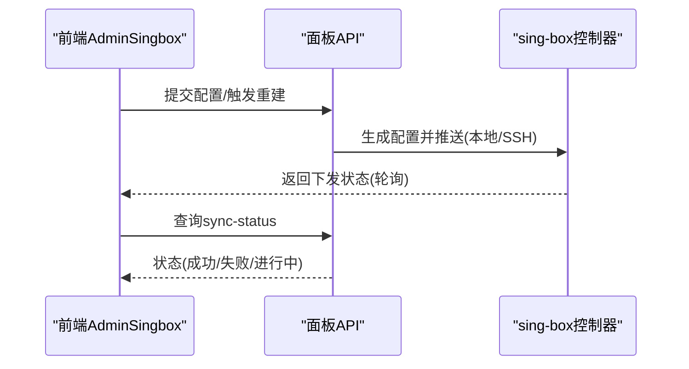
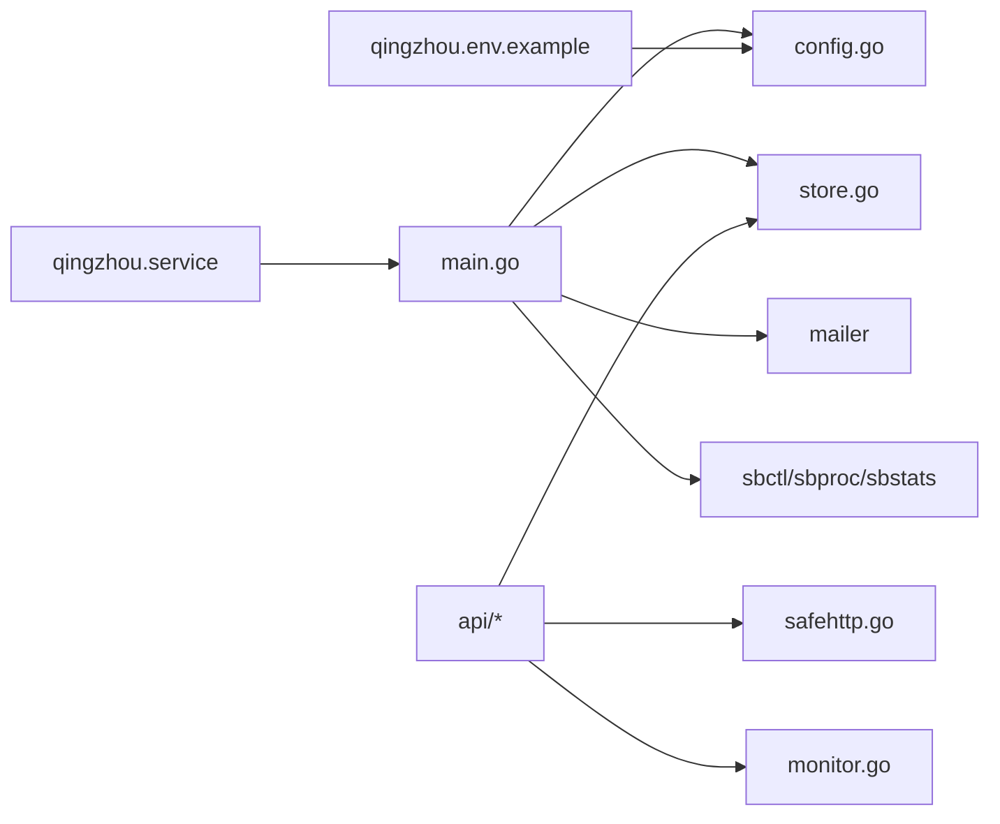

# 故障排查

<cite>
**本文引用的文件**
- [main.go](file://main.go)
- [config.go](file://internal/config/config.go)
- [qingzhou.env.example](file://deploy/qingzhou.env.example)
- [backup.sh](file://deploy/backup.sh)
- [qingzhou.service](file://deploy/qingzhou.service)
- [store.go](file://internal/store/store.go)
- [monitor.go](file://internal/api/monitor.go)
- [sysmetrics.go](file://internal/sysmetrics/sysmetrics.go)
- [safehttp.go](file://internal/api/safehttp.go)
- [respond.go](file://internal/api/respond.go)
- [AdminServers.vue](file://frontend/src/views/AdminServers.vue)
- [AdminSingbox.vue](file://frontend/src/views/AdminSingbox.vue)
</cite>

## 目录
1. [简介](#简介)
2. [项目结构](#项目结构)
3. [核心组件](#核心组件)
4. [架构总览](#架构总览)
5. [详细组件分析](#详细组件分析)
6. [依赖关系分析](#依赖关系分析)
7. [性能注意事项](#性能注意事项)
8. [故障排查指南](#故障排查指南)
9. [结论](#结论)
10. [附录](#附录)

## 简介
本指南面向运维与用户，提供轻舟面板的常见故障定位、日志分析方法、性能与数据库问题诊断、网络连通性排查、资源监控与瓶颈识别、备份恢复与数据完整性校验、以及已知问题的临时解决方案。内容基于代码实现与部署脚本，确保可操作、可追溯。

## 项目结构
- 服务入口与生命周期：主进程负责加载配置、打开数据库、初始化邮件与 sing-box 控制器、启动后台任务（队列推进、证书续期、监控任务等）、启动 HTTP 服务并优雅关闭。
- 配置与环境变量：通过环境变量覆盖默认监听地址、数据库路径、管理员账号、公开访问基址、探针目录、更新仓库、SMTP 等。
- 监控与指标：支持探针上报系统指标（CPU/内存/磁盘/网络/负载/TCP连接数等），并提供仪表盘、热力图与历史曲线。
- 安全与网络：对外部请求进行内网地址拦截、URL 白名单校验、最大请求体限制，防止 SSRF 与恶意请求。
- 存储层：SQLite 使用 WAL 模式与立即事务锁，优化并发读写；提供热备接口与 VACUUM INTO 备份。
- 部署与服务：systemd 单元文件定义运行参数与安全加固；提供一键安装脚本与探针下载。

**图表来源**
- [main.go:25-142](file://main.go#L25-L142)
- [config.go:14-29](file://internal/config/config.go#L14-L29)
- [store.go:27-57](file://internal/store/store.go#L27-L57)
- [monitor.go:20-55](file://internal/api/monitor.go#L20-L55)
- [safehttp.go:27-56](file://internal/api/safehttp.go#L27-L56)
- [qingzhou.service:5-18](file://deploy/qingzhou.service#L5-L18)
- [qingzhou.env.example:3-43](file://deploy/qingzhou.env.example#L3-L43)

**章节来源**
- [main.go:25-142](file://main.go#L25-L142)
- [config.go:14-29](file://internal/config/config.go#L14-L29)
- [store.go:27-57](file://internal/store/store.go#L27-L57)
- [monitor.go:20-55](file://internal/api/monitor.go#L20-L55)
- [safehttp.go:27-56](file://internal/api/safehttp.go#L27-L56)
- [qingzhou.service:5-18](file://deploy/qingzhou.service#L5-L18)
- [qingzhou.env.example:3-43](file://deploy/qingzhou.env.example#L3-L43)

## 核心组件
- 进程与生命周期管理：启动时完成 DB 迁移、种子数据、密钥设置、邮件器构建、sing-box 控制器初始化、后台任务调度；退出时等待后台任务收尾并关闭 HTTP 服务。
- 配置与环境：统一从环境变量读取，支持运行时覆盖；提供默认值保证开箱即用。
- 监控子系统：探针通过 Bearer Token 认证上报指标；面板聚合展示在线状态、CPU/内存/磁盘/网络趋势与可用性热力图。
- 安全网络：外部出站请求仅允许 http/https，拒绝内网/回环/CGNAT 地址，避免 SSRF；请求体大小受限。
- 存储层：WAL + 立即事务锁，减少快照冲突；连接池适度放大以容纳嵌套读；VACUUM INTO 用于热备。
- 部署与运维：systemd 守护进程，最小权限与只读 /usr；提供探针一键安装脚本与二进制下载。

**章节来源**
- [main.go:25-142](file://main.go#L25-L142)
- [config.go:14-29](file://internal/config/config.go#L14-L29)
- [monitor.go:20-55](file://internal/api/monitor.go#L20-L55)
- [safehttp.go:27-56](file://internal/api/safehttp.go#L27-L56)
- [store.go:27-57](file://internal/store/store.go#L27-L57)
- [qingzhou.service:5-18](file://deploy/qingzhou.service#L5-L18)

## 架构总览

**图表来源**
- [main.go:80-106](file://main.go#L80-L106)
- [monitor.go:20-55](file://internal/api/monitor.go#L20-L55)
- [store.go:27-57](file://internal/store/store.go#L27-L57)

## 详细组件分析

### 监控与指标采集
- 探针上报流程：携带 Authorization: Bearer <token> 的请求被接收，校验 token 并解析服务器，写入指标，标记最近可见时间并更新在线状态。
- 指标字段：包含 CPU 百分比、内存/交换分区使用量、磁盘使用量、网络收发字节、负载均值、TCP 连接数、进程数、运行时长、主机名、平台、内核、架构等。
- 可视化：提供仪表盘汇总、服务器列表、历史曲线、可用性热力图（按时间桶聚合，阈值分类）。

**图表来源**
- [monitor.go:20-55](file://internal/api/monitor.go#L20-L55)
- [store.go:27-57](file://internal/store/store.go#L27-L57)

**章节来源**
- [monitor.go:20-55](file://internal/api/monitor.go#L20-L55)
- [sysmetrics.go:16-38](file://internal/sysmetrics/sysmetrics.go#L16-L38)

### 安全网络与SSRF防护
- 出站请求强制 TLS 校验，并在拨号阶段解析 IP，若命中内网/回环/CGNAT 则拒绝，防止 DNS 重绑定与重定向攻击。
- 仅允许 http/https 协议，拒绝 file/gopher 等危险方案；对请求体大小施加上限，避免内存耗尽。

**图表来源**
- [safehttp.go:27-56](file://internal/api/safehttp.go#L27-L56)
- [safehttp.go:71-85](file://internal/api/safehttp.go#L71-L85)

**章节来源**
- [safehttp.go:27-56](file://internal/api/safehttp.go#L27-L56)
- [safehttp.go:58-69](file://internal/api/safehttp.go#L58-L69)
- [safehttp.go:71-85](file://internal/api/safehttp.go#L71-L85)

### 数据库与备份
- 连接与一致性：启用 WAL、busy_timeout、外键约束、同步级别 NORMAL，并使用 _txlock=immediate 避免读后写升级导致的快照冲突。
- 连接池：最大并发连接数与空闲连接数设置为较小值，兼顾嵌套读与写序列化。
- 备份：提供 VACUUM INTO 热备能力；同时提供 shell 脚本每日备份并保留 7 天。

**图表来源**
- [store.go:27-57](file://internal/store/store.go#L27-L57)
- [backup.go:34-51](file://internal/store/backup.go#L34-L51)
- [backup.sh:1-15](file://deploy/backup.sh#L1-L15)

**章节来源**
- [store.go:27-57](file://internal/store/store.go#L27-L57)
- [backup.go:34-51](file://internal/store/backup.go#L34-L51)
- [backup.sh:1-15](file://deploy/backup.sh#L1-L15)

### sing-box 控制器与节点下发
- 本地进程管理：自动探测 sing-box 二进制路径，通过 systemd 重载配置；远程节点通过 SSH 管理，首次连接记录主机指纹。
- 前端交互：链路拓扑页面显示下发状态（待下发/下发中/已同步/失败），支持“重新下发”与错误原因查看。

**图表来源**
- [main.go:171-207](file://main.go#L171-L207)
- [AdminSingbox.vue:702-755](file://frontend/src/views/AdminSingbox.vue#L702-L755)

**章节来源**
- [main.go:171-207](file://main.go#L171-L207)
- [AdminSingbox.vue:162-223](file://frontend/src/views/AdminSingbox.vue#L162-L223)
- [AdminSingbox.vue:702-755](file://frontend/src/views/AdminSingbox.vue#L702-L755)

## 依赖关系分析
- 主进程依赖配置、存储、邮件、sing-box 控制器与进程管理、统计抓取、SSH 控制。
- API 层依赖 store 进行数据持久化，依赖 safehttp 进行安全网络访问，依赖 monitor 处理监控上报与查询。
- 部署层通过 systemd 单元文件管理进程生命周期与环境变量。

**图表来源**
- [main.go:25-142](file://main.go#L25-L142)
- [config.go:14-29](file://internal/config/config.go#L14-L29)
- [store.go:27-57](file://internal/store/store.go#L27-L57)
- [monitor.go:20-55](file://internal/api/monitor.go#L20-L55)
- [safehttp.go:27-56](file://internal/api/safehttp.go#L27-L56)
- [qingzhou.service:5-18](file://deploy/qingzhou.service#L5-L18)
- [qingzhou.env.example:3-43](file://deploy/qingzhou.env.example#L3-L43)

**章节来源**
- [main.go:25-142](file://main.go#L25-L142)
- [config.go:14-29](file://internal/config/config.go#L14-L29)
- [store.go:27-57](file://internal/store/store.go#L27-L57)
- [monitor.go:20-55](file://internal/api/monitor.go#L20-L55)
- [safehttp.go:27-56](file://internal/api/safehttp.go#L27-L56)
- [qingzhou.service:5-18](file://deploy/qingzhou.service#L5-L18)
- [qingzhou.env.example:3-43](file://deploy/qingzhou.env.example#L3-L43)

## 性能注意事项
- 数据库并发：WAL + 立即事务锁降低快照冲突风险；连接池大小适中，避免死锁。
- 监控采样间隔：可通过环境变量调整 sing-box 统计轮询周期，平衡实时性与开销。
- 请求体限制：全局最大请求体限制防止大体积请求导致内存压力。
- 网络超时：HTTP 服务设置读写与空闲超时，避免长连接占用资源。

[本节为通用指导，不直接分析具体文件]

## 故障排查指南

### 常见问题与快速定位
- 面板无法访问
  - 检查监听地址与端口：确认 QZ_LISTEN 或 systemd 暴露的端口是否正确。
  - 检查防火墙/安全组：确保 8081 或反代端口开放。
  - 检查 systemd 状态：查看服务是否运行、是否因崩溃重启。
- 探针无法上报
  - 检查探针 Token 与服务端是否匹配。
  - 检查面板公网可达性与反向代理配置。
  - 查看探针安装脚本输出与 journal 日志。
- sing-box 配置下发失败
  - 在链路拓扑页面查看下发状态与错误信息，点击“重新下发”。
  - 检查远程节点 SSH 可达性与主机指纹是否变化。
  - 检查节点上 sing-box 二进制是否存在且可执行。
- 数据库相关
  - 关注 WAL 模式与 busy_timeout 配置，避免长时间锁定。
  - 定期执行 VACUUM 或热备，保持数据库健康。
- 网络出站异常
  - 确认目标 URL 为 http/https，非内网地址。
  - 检查 DNS 解析结果是否命中内网段。

**章节来源**
- [config.go:14-29](file://internal/config/config.go#L14-L29)
- [monitor.go:20-55](file://internal/api/monitor.go#L20-L55)
- [AdminSingbox.vue:702-755](file://frontend/src/views/AdminSingbox.vue#L702-L755)
- [store.go:27-57](file://internal/store/store.go#L27-L57)
- [safehttp.go:27-56](file://internal/api/safehttp.go#L27-L56)

### 日志分析与关键位置
- 服务日志
  - 使用 systemd 查看：journalctl -u qingzhou -f
  - 关注启动、监听地址、SMTP 启用、sing-box 控制器、后台任务与关闭过程。
- 探针日志
  - 使用 systemd 查看：journalctl -u qingzhou-probe -f
  - 关注下载、安装、启动与上报错误。
- API 响应格式
  - 统一成功信封：{code:0, msg:"", data:...}
  - 统一失败信封：{code:状态码, msg:"错误信息", data:nil}
- 监控数据
  - 通过面板监控页面查看在线状态、CPU/内存/磁盘/网络趋势与热力图。

**章节来源**
- [qingzhou.service:5-18](file://deploy/qingzhou.service#L5-L18)
- [monitor.go:75-179](file://internal/api/monitor.go#L75-L179)
- [respond.go:11-25](file://internal/api/respond.go#L11-L25)
- [monitor.go:183-241](file://internal/api/monitor.go#L183-L241)

### 性能问题诊断与调优
- 指标采集
  - 查看 CPU/内存/磁盘/网络/负载/TCP 连接数，识别瓶颈。
  - 使用热力图观察高负载时段与服务器分布。
- 数据库调优
  - 确认 WAL 与 busy_timeout 生效；必要时调整连接池大小。
  - 定期 VACUUM 与备份，避免碎片增长。
- 网络调优
  - 检查出站请求是否被安全策略拦截；确认 DNS 解析正常。
  - 合理设置 HTTP 超时与连接复用。
- 前端交互
  - 下发配置失败时，查看错误详情并重新下发；注意并发探测提示与延迟统计。

**章节来源**
- [sysmetrics.go:16-38](file://internal/sysmetrics/sysmetrics.go#L16-L38)
- [monitor.go:323-360](file://internal/api/monitor.go#L323-L360)
- [monitor.go:541-647](file://internal/api/monitor.go#L541-L647)
- [store.go:27-57](file://internal/store/store.go#L27-L57)
- [AdminSingbox.vue:162-223](file://frontend/src/views/AdminSingbox.vue#L162-L223)

### 数据库问题排查步骤
- 现象：购买/退款/积分调整失败
  - 检查是否出现 SQLITE_BUSY_SNAPSHOT；确认 _txlock=immediate 与 busy_timeout 生效。
- 现象：备份失败或损坏
  - 检查 VACUUM INTO 目标路径权限与空间；失败时清理半写文件。
- 建议
  - 定期热备与离线备份；监控数据库文件大小与增长趋势。
  - 避免长时间事务与跨进程共享同一连接。

**章节来源**
- [store.go:27-57](file://internal/store/store.go#L27-L57)
- [backup.go:34-51](file://internal/store/backup.go#L34-L51)

### 网络连接故障排除
- 出站请求被拒
  - 检查 URL scheme 是否为 http/https；目标 IP 是否命中内网/回环/CGNAT。
- 探针安装失败
  - 检查 curl/wget 可用性与网络连通；确认面板公网地址与端口正确。
- 反向代理问题
  - 确认 QZ_PUBLIC_BASE 与 Host 头一致；订阅链接与探针安装命令使用正确域名。

**章节来源**
- [safehttp.go:27-56](file://internal/api/safehttp.go#L27-L56)
- [monitor.go:75-179](file://internal/api/monitor.go#L75-L179)
- [qingzhou.env.example:10-13](file://deploy/qingzhou.env.example#L10-L13)

### 系统资源监控与瓶颈识别
- 指标含义
  - CPU 百分比、内存使用率、磁盘使用率、网络速率、负载均值、TCP 连接数、进程数、运行时长。
- 阈值参考
  - 热力图将 CPU/内存/磁盘 ≥70% 标记为高负载，≥90% 标记为离线级负载。
- 工具与方法
  - 使用面板监控页面查看趋势与热力图；结合系统工具（top、vmstat、iostat）定位瓶颈。

**章节来源**
- [sysmetrics.go:16-38](file://internal/sysmetrics/sysmetrics.go#L16-L38)
- [monitor.go:541-647](file://internal/api/monitor.go#L541-L647)

### 备份恢复与数据完整性检查
- 热备
  - 使用 VACUUM INTO 将数据库复制到指定路径；失败时清理半写文件。
- 定时备份
  - 使用 backup.sh 每日备份并保留 7 天；确保 cron 任务正常运行。
- 恢复
  - 停止服务后替换数据库文件；或使用 sqlite3 .restore 恢复。
- 完整性
  - 检查备份文件大小与时间戳；必要时校验 checksum。

**章节来源**
- [backup.go:34-51](file://internal/store/backup.go#L34-L51)
- [backup.sh:1-15](file://deploy/backup.sh#L1-L15)

### 已知问题与临时 workaround
- sing-box 控制器统计间隔
  - 可通过环境变量调整统计轮询周期，降低高频采集带来的开销。
- 探针安装 ETXTBSY
  - 安装脚本采用原子替换（先写入临时文件再 rename），避免覆盖正在运行的二进制。
- 二进制更新替换
  - 使用 rename() 替换运行中的二进制，Linux 下安全；失败时清理临时文件。
- SSH 主机指纹变化
  - 若主机重装/迁移导致指纹变化，可在服务器管理页清除并重新信任；核对新指纹后再重新下发配置。

**章节来源**
- [main.go:209-217](file://main.go#L209-L217)
- [monitor.go:75-179](file://internal/api/monitor.go#L75-L179)
- [updater.go:546-556](file://internal/updater/updater.go#L546-L556)
- [AdminServers.vue:149-173](file://frontend/src/views/AdminServers.vue#L149-L173)

## 结论
本指南基于代码与部署脚本，提供了从进程、配置、监控、安全、存储到部署的全链路故障排查方法。建议在日常运维中结合面板监控、日志与备份机制，形成闭环的稳定性保障体系。

## 附录
- 环境变量清单（示例）
  - QZ_LISTEN：监听地址
  - QZ_DB：数据库路径
  - QZ_PUBLIC_BASE：面板公网访问地址
  - QZ_PROBE_DIR：探针二进制目录
  - QZ_UPDATE_REPO：更新仓库
  - QZ_UPDATE_GITHUB_TOKEN：GitHub Token
  - QZ_ADMIN_USER/QZ_ADMIN_PASS：首次管理员账号与密码
  - QZ_SECRET_KEY：敏感设置加密主密钥
  - SMTP 相关：QZ_SMTP_HOST/PORT/USER/PASS/FROM/SECURITY
- 常用命令
  - 查看服务日志：journalctl -u qingzhou -f
  - 查看探针日志：journalctl -u qingzhou-probe -f
  - 备份数据库：bash /opt/qingzhou/backup.sh
  - 测试服务器连接：在服务器管理页点击“测试连接”
  - 重新下发配置：在链路拓扑页点击“重新下发”

**章节来源**
- [qingzhou.env.example:3-43](file://deploy/qingzhou.env.example#L3-L43)
- [AdminServers.vue:130-133](file://frontend/src/views/AdminServers.vue#L130-L133)
- [AdminSingbox.vue:702-755](file://frontend/src/views/AdminSingbox.vue#L702-L755)
- [backup.sh:1-15](file://deploy/backup.sh#L1-L15)
