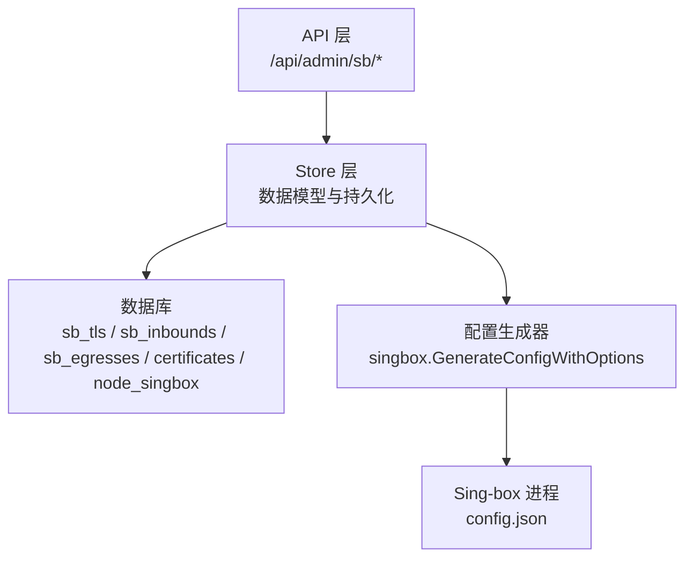
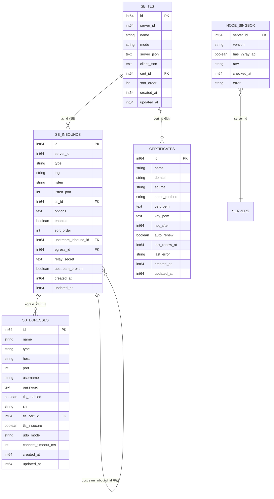
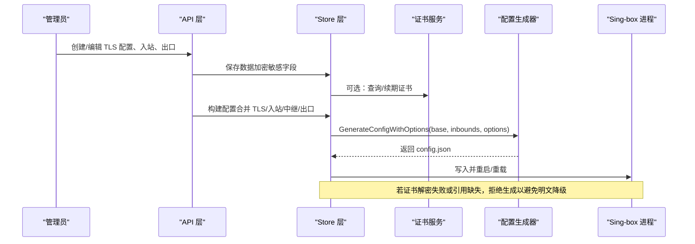
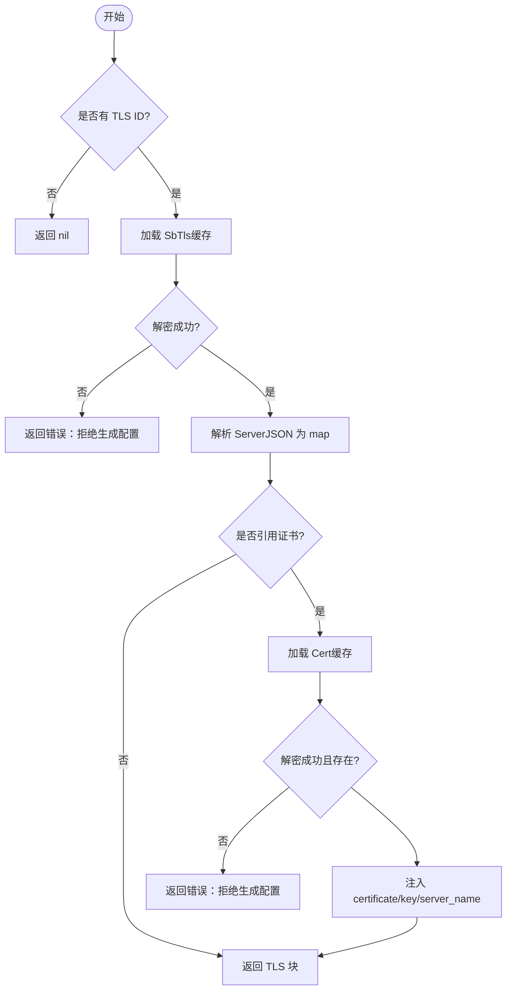
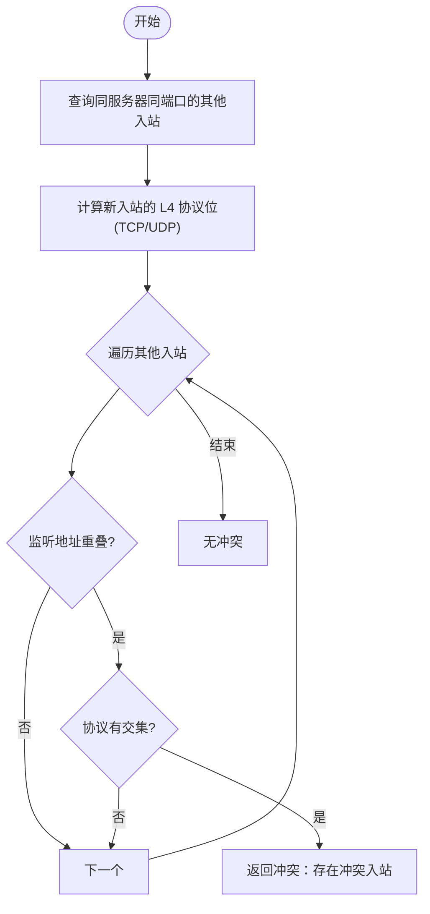
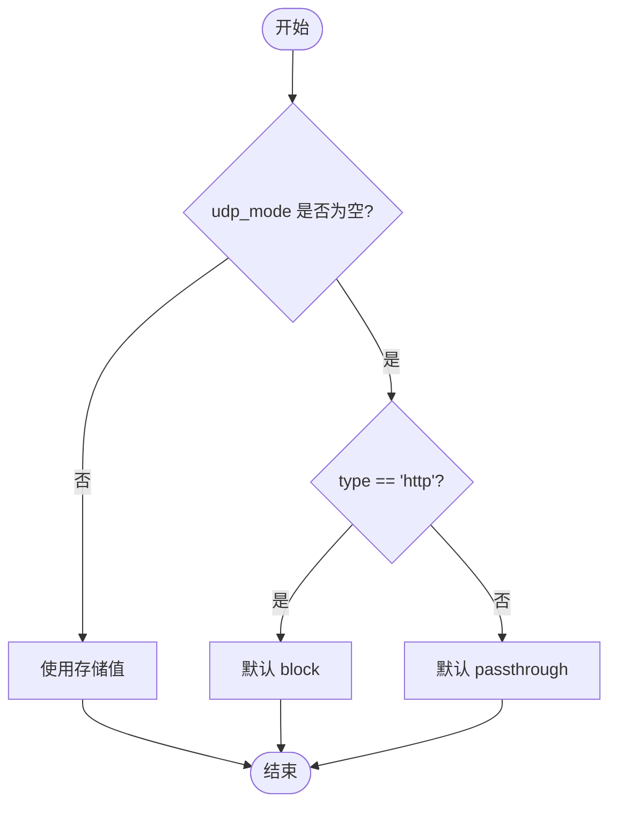
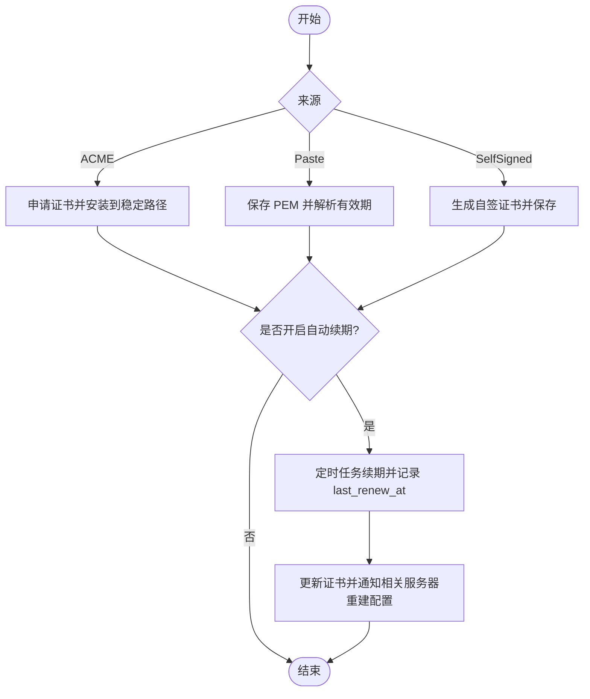
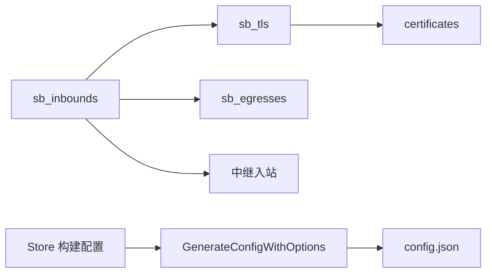
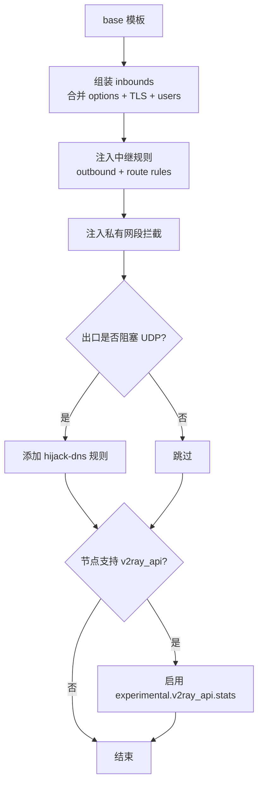

# Sing-box管理模型

<cite>
**本文引用的文件**
- [internal/store/singbox.go](file://internal/store/singbox.go)
- [internal/store/certs.go](file://internal/store/certs.go)
- [internal/store/egress.go](file://internal/store/egress.go)
- [internal/store/nodesingbox.go](file://internal/store/nodesingbox.go)
- [internal/store/crypto.go](file://internal/store/crypto.go)
- [internal/singbox/generate.go](file://internal/singbox/generate.go)
- [internal/singbox/cert.go](file://internal/singbox/cert.go)
- [internal/api/sb_admin.go](file://internal/api/sb_admin.go)
</cite>

## 目录
1. [简介](#简介)
2. [项目结构](#项目结构)
3. [核心数据模型](#核心数据模型)
4. [架构总览](#架构总览)
5. [详细组件分析](#详细组件分析)
6. [依赖关系分析](#依赖关系分析)
7. [性能与扩展性](#性能与扩展性)
8. [故障排查指南](#故障排查指南)
9. [结论](#结论)
10. [附录：配置生成器与模板系统](#附录配置生成器与模板系统)

## 简介
本文件面向“轻舟”面板中 Sing-box 管理相关的数据模型与实现，重点说明以下能力：
- TLS 配置（sb_tls）：支持 Reality 与证书模式，支持引用受管证书（certificates），并加密存储敏感字段。
- 入站配置（sb_inbounds）：协议类型、监听地址/端口、TLS 绑定、中继链路、代理出口、端口冲突检测等。
- 出站配置（sb_egresses）：第三方代理出口（SOCKS5/HTTP）、TLS 到代理、UDP 行为控制、连接超时等。
- 证书管理（certificates）：ACME/粘贴/自签证书的生命周期、自动续期、到期时间、错误记录。
- 流量统计：通过 v2ray_api 暴露的 per-user 统计接入点。
- 安全与加密：基于 AES-GCM 的静态加密，密钥由环境变量注入；解密失败时拒绝降级为明文。
- 版本管理与回滚：节点 sing-box 版本探测、是否支持 v2ray_api 的记录；更新与回滚机制在其它模块中协同。
- 配置生成器与模板：基于 base 模板拼装 inbounds/outbounds/route/experimental，并注入中继规则、私有网段拦截、DNS 劫持保护等。

## 项目结构
围绕 Sing-box 管理的代码主要分布在 store（持久化）、singbox（配置生成）、api（管理接口）三个层次：
- store 层定义数据模型与数据库操作，负责加解密、约束校验、关联删除保护等。
- singbox 层负责将内存中的模型组装为最终可被 sing-box 进程加载的 JSON 配置。
- api 层提供管理员操作的 HTTP 接口，调用 store 完成读写，并在必要时触发配置重建与推送。

图表来源
- [internal/api/sb_admin.go:34-221](file://internal/api/sb_admin.go#L34-L221)
- [internal/store/singbox.go:562-679](file://internal/store/singbox.go#L562-L679)
- [internal/singbox/generate.go:137-295](file://internal/singbox/generate.go#L137-L295)

章节来源
- [internal/api/sb_admin.go:34-221](file://internal/api/sb_admin.go#L34-L221)
- [internal/store/singbox.go:562-679](file://internal/store/singbox.go#L562-L679)
- [internal/singbox/generate.go:137-295](file://internal/singbox/generate.go#L137-L295)

## 核心数据模型
本节聚焦四个核心表及其关联关系：sb_tls、sb_inbounds、sb_egresses、certificates，以及节点信息表 node_singbox。

- sb_tls（TLS/Reality 配置）
  - 关键字段：id, server_id, name, mode(reality|tls), server_json(加密), client_json, cert_id(引用 certificates.id), sort_order, created_at, updated_at, decrypt_failed(运行时标记)。
  - 行为要点：
    - server_json 包含 sing-box 的 tls/reality 块，落地前加密存储；读取时解密，若失败则设置 decrypt_failed，构建配置时拒绝降级为明文。
    - mode=tls 时可引用 certificates 表中的受管证书；mode=reality 使用内嵌私钥与 short_id。
    - 删除保护：若有入站引用该 TLS 配置，禁止删除。

- sb_inbounds（入站配置）
  - 关键字段：id, server_id, type, tag, listen, listen_port, tls_id, options(JSON), enabled, sort_order, upstream_inbound_id(中继落地), egress_id(代理出口), relay_secret(落地认证密钥), upstream_broken(链路失效标记), created_at, updated_at。
  - 行为要点：
    - 支持多种协议类型（如 vless/vmess/trojan/hysteria2/tuic/shadowsocks/mixed/anytls 等）。
    - 端口冲突检测：根据协议特性判断 TCP/UDP 占用，避免同服务器同端口同协议的冲突。
    - 中继链路：upstream_inbound_id 指向同一或不同机器的落地入站；删除落地会标记上游 broken，需重新配置或确认。
    - 代理出口：egress_id 指向第三方代理出口，替代直出。
    - Tag 变更会级联更新自建节点的 inbound_tag 与显示名。

- sb_egresses（代理出口）
  - 关键字段：id, name, type(socks|http), host, port, username, password(加密), tls_enabled, sni, tls_cert_id, tls_insecure, udp_mode(passthrough|block), connect_timeout_ms, created_at, updated_at。
  - 行为要点：
    - 密码等敏感字段加密存储；解密失败时返回特定错误，提示管理员重新保存。
    - UDP 行为：http 类型默认 block；socks 默认 passthrough；可通过 udp_mode 显式控制。
    - TLS 到代理：仅 http outbound 支持；可指定 SNI 与信任锚证书（tls_cert_id）。
    - 删除保护：若有入站引用该出口，禁止删除。

- certificates（受管证书）
  - 关键字段：id, name, domain, source(acme|paste|selfsigned), acme_method, cert_pem(加密), key_pem(加密), not_after, auto_renew, last_renew_at, last_error, created_at, updated_at, decrypt_failed。
  - 行为要点：
    - ACME/DNS-Cloudflare/HTTP-01/Webroot 等方式申请；粘贴或自签也可入库。
    - 自动续期开关与最近续期时间、错误信息记录。
    - 删除保护：若有 TLS 配置引用该证书，禁止删除。
    - 迁移：可将历史 inline PEM 的 TLS 配置迁移为受管证书并建立引用。

- node_singbox（节点 sing-box 观测）
  - 关键字段：server_id, version, has_v2ray_api, raw, checked_at, error。
  - 行为要点：记录节点 sing-box 版本及是否支持 v2ray_api，用于决定是否启用 per-user 统计。

图表来源
- [internal/store/singbox.go:15-73](file://internal/store/singbox.go#L15-L73)
- [internal/store/egress.go:10-102](file://internal/store/egress.go#L10-L102)
- [internal/store/certs.go:14-36](file://internal/store/certs.go#L14-L36)
- [internal/store/nodesingbox.go:19-31](file://internal/store/nodesingbox.go#L19-L31)

章节来源
- [internal/store/singbox.go:15-73](file://internal/store/singbox.go#L15-L73)
- [internal/store/egress.go:10-102](file://internal/store/egress.go#L10-L102)
- [internal/store/certs.go:14-36](file://internal/store/certs.go#L14-L36)
- [internal/store/nodesingbox.go:19-31](file://internal/store/nodesingbox.go#L19-L31)

## 架构总览
从管理员操作到最终生效的配置，整体流程如下：

图表来源
- [internal/api/sb_admin.go:34-221](file://internal/api/sb_admin.go#L34-L221)
- [internal/store/singbox.go:562-679](file://internal/store/singbox.go#L562-L679)
- [internal/singbox/generate.go:137-295](file://internal/singbox/generate.go#L137-L295)

章节来源
- [internal/api/sb_admin.go:34-221](file://internal/api/sb_admin.go#L34-L221)
- [internal/store/singbox.go:562-679](file://internal/store/singbox.go#L562-L679)
- [internal/singbox/generate.go:137-295](file://internal/singbox/generate.go#L137-L295)

## 详细组件分析

### TLS 配置（sb_tls）
- 设计要点
  - 支持两种模式：reality 与 tls。reality 使用内嵌私钥与 short_id；tls 可引用受管证书（certificates）。
  - server_json 加密存储，client_json 用于客户端侧参数（如 utls fingerprint、insecure 等）。
  - 构建配置时，若引用了 certificates，则注入 certificate/key/server_name，并清理旧路径字段，确保单源可信。
  - 解密失败时设置 DecryptFailed，构建配置直接报错，防止静默降级为明文。

- 关键流程（解析 TLS 块）

图表来源
- [internal/store/singbox.go:184-239](file://internal/store/singbox.go#L184-L239)
- [internal/store/certs.go:87-122](file://internal/store/certs.go#L87-L122)

章节来源
- [internal/store/singbox.go:184-239](file://internal/store/singbox.go#L184-L239)
- [internal/store/certs.go:87-122](file://internal/store/certs.go#L87-L122)

### 入站配置（sb_inbounds）
- 设计要点
  - 每个入站携带协议类型、tag、监听地址/端口、TLS 绑定、额外 options(JSON)、是否启用、排序。
  - 中继链路：upstream_inbound_id 指向落地入站；删除落地会标记 upstream_broken，需重新配置或确认。
  - 代理出口：egress_id 指向第三方代理出口，替代直出。
  - 端口冲突检测：根据协议特性判断 TCP/UDP 占用，避免同服务器同端口同协议的冲突。
  - Tag 变更级联：更新自建节点的 inbound_tag 与显示名，保持订阅与分组匹配一致。

- 端口冲突检测流程

图表来源
- [internal/store/singbox.go:442-527](file://internal/store/singbox.go#L442-L527)

章节来源
- [internal/store/singbox.go:241-400](file://internal/store/singbox.go#L241-L400)
- [internal/store/singbox.go:442-527](file://internal/store/singbox.go#L442-L527)

### 出站配置（sb_egresses）
- 设计要点
  - 支持 SOCKS5/HTTP 代理；HTTP 支持 TLS 到代理并可指定 SNI 与信任锚证书。
  - 密码等敏感字段加密存储；解密失败返回明确错误，要求管理员重新保存。
  - UDP 行为：http 类型默认 block；socks 默认 passthrough；可通过 udp_mode 显式控制。
  - 连接超时：connect_timeout_ms 限制到代理的 TCP 握手超时，避免长时间挂起。
  - 删除保护：若有入站引用该出口，禁止删除。

- 有效 UDP 模式解析

图表来源
- [internal/store/egress.go:121-143](file://internal/store/egress.go#L121-L143)

章节来源
- [internal/store/egress.go:10-102](file://internal/store/egress.go#L10-L102)
- [internal/store/egress.go:121-143](file://internal/store/egress.go#L121-L143)
- [internal/store/egress.go:191-214](file://internal/store/egress.go#L191-L214)

### 证书管理（certificates）
- 设计要点
  - 支持 ACME(DNS-Cloudflare/HTTP-01/Webroot)、粘贴、自签三种来源。
  - 自动续期开关与最近续期时间、错误信息记录。
  - 证书与私钥加密存储；解析证书提取有效期；删除保护（若有 TLS 配置引用则禁止删除）。
  - 迁移：可将历史 inline PEM 的 TLS 配置迁移为受管证书并建立引用，保留原 inline 以便回滚。

- 生命周期管理

图表来源
- [internal/store/certs.go:14-36](file://internal/store/certs.go#L14-L36)
- [internal/store/certs.go:98-122](file://internal/store/certs.go#L98-L122)
- [internal/store/certs.go:166-216](file://internal/store/certs.go#L166-L216)
- [internal/api/sb_admin.go:146-221](file://internal/api/sb_admin.go#L146-L221)

章节来源
- [internal/store/certs.go:14-36](file://internal/store/certs.go#L14-L36)
- [internal/store/certs.go:98-122](file://internal/store/certs.go#L98-L122)
- [internal/store/certs.go:166-216](file://internal/store/certs.go#L166-L216)
- [internal/api/sb_admin.go:146-221](file://internal/api/sb_admin.go#L146-L221)

### 节点信息与版本管理（node_singbox）
- 设计要点
  - 记录节点 sing-box 版本、是否支持 v2ray_api、原始输出、检查时间与错误信息。
  - 用于决定是否在配置中启用 experimental.v2ray_api.stats 以采集 per-user 流量统计。
  - 删除节点时清理对应观测记录。

章节来源
- [internal/store/nodesingbox.go:19-31](file://internal/store/nodesingbox.go#L19-L31)
- [internal/store/nodesingbox.go:37-63](file://internal/store/nodesingbox.go#L37-L63)
- [internal/store/nodesingbox.go:65-91](file://internal/store/nodesingbox.go#L65-L91)

## 依赖关系分析
- 入站与 TLS：sb_inbounds.tls_id → sb_tls.id；若 sb_tls.cert_id ≠ 0，则进一步引用 certificates.id。
- 入站与中继：sb_inbounds.upstream_inbound_id → 另一条入站（可能跨服务器），形成多级中转。
- 入站与出口：sb_inbounds.egress_id → sb_egresses.id，将流量导出至第三方代理。
- 配置生成：store.BuildSingboxConfig* 组合 inbounds + TLS + relays + egresses，调用 singbox.GenerateConfigWithOptions 生成最终 JSON。
- 统计接入：当节点 has_v2ray_api=true 时，配置中启用 experimental.v2ray_api.stats.users，按用户名称聚合流量。

图表来源
- [internal/store/singbox.go:562-679](file://internal/store/singbox.go#L562-L679)
- [internal/singbox/generate.go:137-295](file://internal/singbox/generate.go#L137-L295)

章节来源
- [internal/store/singbox.go:562-679](file://internal/store/singbox.go#L562-L679)
- [internal/singbox/generate.go:137-295](file://internal/singbox/generate.go#L137-L295)

## 性能与扩展性
- 配置生成优化
  - 使用缓存减少重复解密与查询：TLS 与证书在单次构建中使用缓存，避免重复 IO。
  - 用户列表排序保证配置字节确定性，便于进程管理器跳过不必要的重载。
- 端口冲突检测
  - 基于协议特性快速判断 TCP/UDP 占用，避免不必要的全量扫描。
- 代理出口 UDP 行为
  - 对不支持 UDP 的出口采用 block，避免无效尝试与日志噪音；同时为客户端生成 NoUDP 标记，提升用户体验。
- 可扩展点
  - 新增协议类型可在 inboundTransports 中声明其 L4 占用，自动参与冲突检测。
  - 新增出口类型需在 EffectiveUDPMode 中设定默认行为。

[本节为通用指导，不直接分析具体文件]

## 故障排查指南
- 证书解密失败
  - 现象：构建配置时报错，拒绝生成以避免明文降级。
  - 原因：QZ_SECRET_KEY 变更或不匹配。
  - 处理：确认密钥一致后重新保存证书/TLS 配置。
  - 参考
    - [internal/store/singbox.go:204-206](file://internal/store/singbox.go#L204-L206)
    - [internal/store/certs.go:124-130](file://internal/store/certs.go#L124-L130)
    - [internal/store/crypto.go:79-121](file://internal/store/crypto.go#L79-L121)

- 入站端口冲突
  - 现象：保存入站时报冲突。
  - 原因：同服务器同端口且 L4 协议有交集。
  - 处理：调整监听地址或端口，或更换协议组合。
  - 参考
    - [internal/store/singbox.go:501-527](file://internal/store/singbox.go#L501-L527)

- 中继链路失效
  - 现象：入站标记 upstream_broken，拓扑显示“落地已失效”。
  - 原因：落地入站被删除。
  - 处理：重新配置落地或代理出口，或确认接受直出。
  - 参考
    - [internal/store/singbox.go:353-400](file://internal/store/singbox.go#L353-L400)

- 代理出口密码无法解密
  - 现象：保存/克隆出口时报错，提示需要重新编辑保存。
  - 原因：QZ_SECRET_KEY 变更导致密文不可读。
  - 处理：重新输入密码并保存。
  - 参考
    - [internal/store/egress.go:110-115](file://internal/store/egress.go#L110-L115)
    - [internal/store/egress.go:224-246](file://internal/store/egress.go#L224-L246)

章节来源
- [internal/store/singbox.go:204-206](file://internal/store/singbox.go#L204-L206)
- [internal/store/certs.go:124-130](file://internal/store/certs.go#L124-L130)
- [internal/store/crypto.go:79-121](file://internal/store/crypto.go#L79-L121)
- [internal/store/singbox.go:501-527](file://internal/store/singbox.go#L501-L527)
- [internal/store/singbox.go:353-400](file://internal/store/singbox.go#L353-L400)
- [internal/store/egress.go:110-115](file://internal/store/egress.go#L110-L115)
- [internal/store/egress.go:224-246](file://internal/store/egress.go#L224-L246)

## 结论
本模型通过清晰的分层与严格的约束，实现了：
- 安全的 TLS/Reality 配置管理，支持受管证书与生命周期自动化。
- 灵活的入站编排，支持中继链路与代理出口，具备端口冲突检测与链路失效保护。
- 可靠的代理出口管理，支持 TLS 到代理、UDP 行为控制与连接超时。
- 完整的证书中心，覆盖 ACME/粘贴/自签，支持自动续期与错误追踪。
- 安全的加密存储与解密失败保护，避免静默降级为明文。
- 版本感知与统计接入，基于节点能力动态启用 per-user 流量统计。
- 强大的配置生成器，结合模板与规则注入，保障安全性与兼容性。

[本节为总结，不直接分析具体文件]

## 附录：配置生成器与模板系统
- 模板基础
  - 默认 base 模板包含 log/dns/route/outbounds 的基础结构；管理员可自定义 sb_base_config，但会被清理掉过时字段以保证兼容。
- 组装过程
  - 遍历启用的入站，合并 options 与 TLS 块，注入用户列表，生成 inbounds。
  - 注入中继规则：为每个中继添加 outbound 与 route rule，将本地入站流量导向落地。
  - 注入私有网段拦截：阻止访问本机私有网络与云元数据，增强安全性。
  - 注入 DNS 劫持：当出口阻塞 UDP 时，自动为 DNS 请求添加 hijack-dns 规则，避免客户端因 DNS 丢失而误判网络。
  - 注入 v2ray_api：当节点支持时，启用 experimental.v2ray_api.stats 并按用户名称统计流量。

图表来源
- [internal/singbox/generate.go:137-295](file://internal/singbox/generate.go#L137-L295)
- [internal/singbox/generate.go:297-372](file://internal/singbox/generate.go#L297-L372)
- [internal/singbox/generate.go:407-468](file://internal/singbox/generate.go#L407-L468)

章节来源
- [internal/singbox/generate.go:137-295](file://internal/singbox/generate.go#L137-L295)
- [internal/singbox/generate.go:297-372](file://internal/singbox/generate.go#L297-L372)
- [internal/singbox/generate.go:407-468](file://internal/singbox/generate.go#L407-L468)
