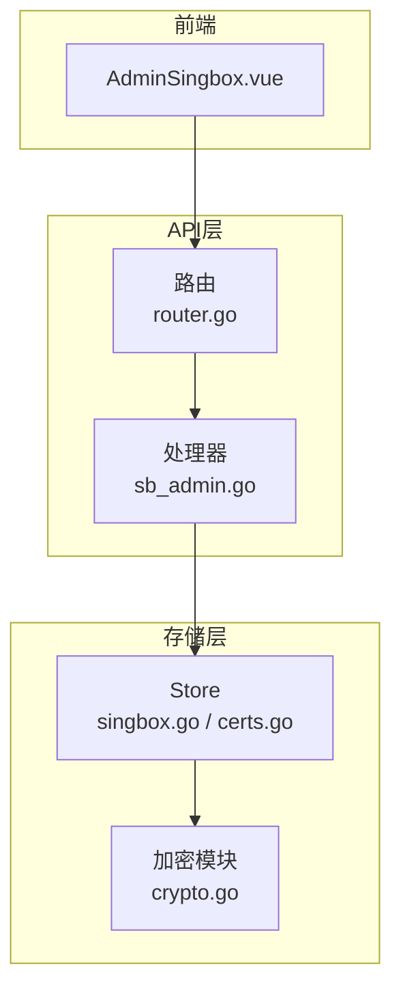
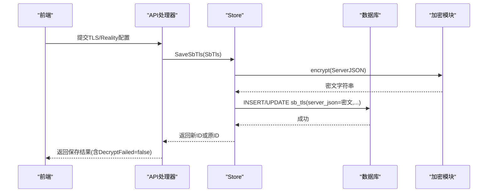
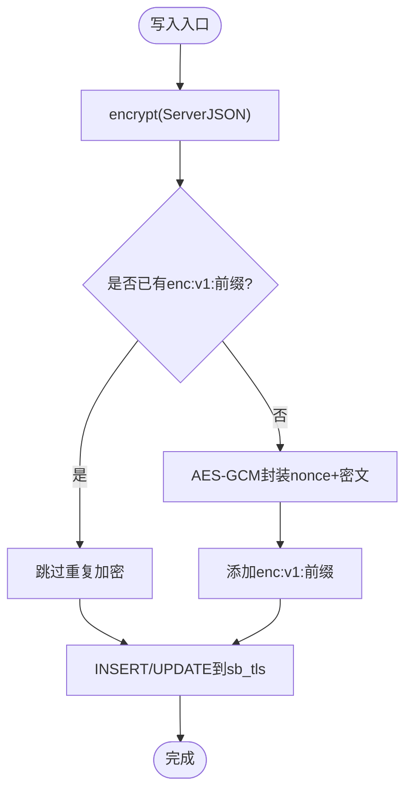
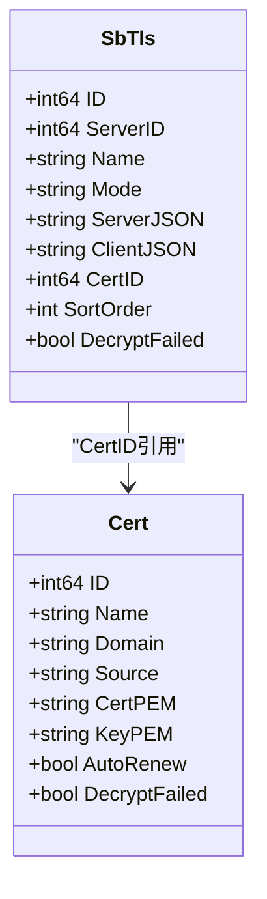

# TLS配置模型

<cite>
**本文引用的文件**
- [internal/store/singbox.go](file://internal/store/singbox.go)
- [internal/store/crypto.go](file://internal/store/crypto.go)
- [internal/store/certs.go](file://internal/store/certs.go)
- [internal/api/sb_admin.go](file://internal/api/sb_admin.go)
- [internal/api/router.go](file://internal/api/router.go)
- [frontend/src/views/AdminSingbox.vue](file://frontend/src/views/AdminSingbox.vue)
</cite>

## 目录
1. [简介](#简介)
2. [项目结构](#项目结构)
3. [核心组件](#核心组件)
4. [架构总览](#架构总览)
5. [详细组件分析](#详细组件分析)
6. [依赖关系分析](#依赖关系分析)
7. [性能考虑](#性能考虑)
8. [故障排查指南](#故障排查指南)
9. [结论](#结论)
10. [附录：API示例](#附录api示例)

## 简介
本文件面向SbTls数据模型与TLS/Reality配置管理，系统性说明字段设计、加密存储机制、证书生命周期管理、排序功能以及完整的创建/更新/删除API流程。文档同时解释DecryptFailed状态的含义与安全处理策略，确保在密钥变更等异常场景下不会降级为明文传输。

## 项目结构
- 数据模型与持久化：internal/store/singbox.go（SbTls定义与CRUD）、internal/store/certs.go（证书模型与生命周期）、internal/store/crypto.go（AES-GCM加解密）
- API路由与处理器：internal/api/router.go（路由注册）、internal/api/sb_admin.go（TLS/Reality配置创建、更新、删除、排序）
- 前端交互：frontend/src/views/AdminSingbox.vue（列表展示、排序、调用后端接口）

图表来源
- [internal/api/router.go:257-268](file://internal/api/router.go#L257-L268)
- [internal/api/sb_admin.go:442-473](file://internal/api/sb_admin.go#L442-L473)
- [internal/store/singbox.go:15-37](file://internal/store/singbox.go#L15-L37)
- [internal/store/crypto.go:17-77](file://internal/store/crypto.go#L17-L77)

章节来源
- [internal/api/router.go:257-268](file://internal/api/router.go#L257-L268)
- [internal/store/singbox.go:15-37](file://internal/store/singbox.go#L15-L37)

## 核心组件
- SbTls：表示一个TLS或Reality入站配置文件，包含ID、ServerID、Name、Mode、ServerJSON、ClientJSON、CertID、SortOrder、时间戳及DecryptFailed标记。
- Cert：受管证书资源，支持ACME/粘贴/自签，证书PEM与私钥PEM以密文存储，支持自动续期与引用计数保护删除。
- Store加密能力：基于AES-GCM的enc:v1:前缀密文格式，提供encrypt/decryptOK/countUndecryptableSecrets等方法，保证失败时不泄露明文。

章节来源
- [internal/store/singbox.go:15-37](file://internal/store/singbox.go#L15-L37)
- [internal/store/certs.go:14-36](file://internal/store/certs.go#L14-L36)
- [internal/store/crypto.go:17-77](file://internal/store/crypto.go#L17-L77)

## 架构总览
SbTls的ServerJSON在写入数据库前会被加密；读取时尝试解密并设置DecryptFailed标志。当使用受管证书（mode=tls且CertID非0）时，构建配置阶段会从证书表注入真实证书内容，并校验其可解密性，拒绝生成明文入站。

图表来源
- [internal/api/sb_admin.go:661-789](file://internal/api/sb_admin.go#L661-L789)
- [internal/store/singbox.go:116-134](file://internal/store/singbox.go#L116-L134)
- [internal/store/crypto.go:24-46](file://internal/store/crypto.go#L24-L46)

## 详细组件分析

### SbTls数据模型与字段语义
- ID：主键，用于标识一条TLS/Reality配置。
- ServerID：所属服务器节点ID，用于按机器分组展示与推送配置。
- Name：管理员可读名称。
- Mode：取值reality或tls，决定配置类型与行为分支。
- ServerJSON：服务端侧TLS块（含Reality私钥等敏感信息），落库前加密。
- ClientJSON：客户端侧参数（如utls指纹、short_id等）。
- CertID：当mode=tls时，引用受管证书（certificates.id）；0表示未引用（可能为内联PEM或路径模式）。
- SortOrder：全局显示顺序，仅通过ReorderSbTls修改，避免编辑覆盖导致列表跳变。
- CreatedAt/UpdatedAt：审计时间戳。
- DecryptFailed：读取出错标记，指示ServerJSON无法解密（通常QZ_SECRET_KEY变更），构建器应拒绝下发该入站。

章节来源
- [internal/store/singbox.go:15-37](file://internal/store/singbox.go#L15-L37)
- [internal/store/singbox.go:77-114](file://internal/store/singbox.go#L77-L114)

### 加密存储机制与流程
- 加密算法：AES-GCM，密文带enc:v1:前缀，便于识别与兼容历史明文。
- 写入流程：SaveSbTls对ServerJSON执行encrypt后再落库；新增记录时SortOrder取当前最大值+1，避免插入到中间位置打乱手动排序。
- 读取流程：ListSbTls/GetSbTls读取后调用decryptOK，若失败则设置DecryptFailed=true，上层必须据此拒绝生成明文配置。
- 安全兜底：CountUndecryptableSecrets统计不可解密条目数，启动自检告警。

图表来源
- [internal/store/crypto.go:24-46](file://internal/store/crypto.go#L24-L46)
- [internal/store/singbox.go:116-134](file://internal/store/singbox.go#L116-L134)

章节来源
- [internal/store/crypto.go:17-77](file://internal/store/crypto.go#L17-L77)
- [internal/store/singbox.go:116-134](file://internal/store/singbox.go#L116-L134)

### 证书管理与生命周期（CertID）
- 受管证书表certificates：存储name/domain/source/acme_method/cert_pem/key_pem/not_after/auto_renew/last_renew_at/last_error等，PEM与私钥均加密存储。
- 引用关系：SbTls.CertID指向证书id；当mode=tls且CertID非0时，构建器会注入真实证书并锁定SNI为证书域名，同时禁止跳过验证（除非是自签）。
- 删除保护：DeleteCert检查是否有TLS配置引用，若有则拒绝删除，防止误删导致在线入站失去TLS。
- 迁移：backfillCerts将旧版内联PEM的TLS配置迁移为受管证书，并回填CertID，保持向后兼容。

图表来源
- [internal/store/singbox.go:15-37](file://internal/store/singbox.go#L15-L37)
- [internal/store/certs.go:14-36](file://internal/store/certs.go#L14-L36)
- [internal/store/certs.go:132-142](file://internal/store/certs.go#L132-L142)

章节来源
- [internal/store/certs.go:14-36](file://internal/store/certs.go#L14-L36)
- [internal/store/certs.go:132-142](file://internal/store/certs.go#L132-L142)
- [internal/store/certs.go:166-217](file://internal/store/certs.go#L166-L217)

### 排序功能SortOrder的实现与用途
- 目的：维护管理员在面板中的TLS列表顺序，便于批量拖拽调整。
- 实现：ReorderSbTls接收完整ID序列，按位置更新sort_order；新增记录默认置于末尾；编辑不覆盖sort_order，避免意外置顶。
- 查询：ListSbTls按sort_order,id排序返回，前端据此渲染。

章节来源
- [internal/store/singbox.go:77-80](file://internal/store/singbox.go#L77-L80)
- [internal/store/singbox.go:116-142](file://internal/store/singbox.go#L116-L142)
- [internal/api/sb_admin.go:442-460](file://internal/api/sb_admin.go#L442-L460)
- [frontend/src/views/AdminSingbox.vue:830-859](file://frontend/src/views/AdminSingbox.vue#L830-L859)

### DecryptFailed状态的处理逻辑与恢复
- 触发条件：ServerJSON或证书PEM/KeyPEM被加密存储但无法用当前密钥解密（例如QZ_SECRET_KEY变更）。
- 影响范围：
  - 读取SbTls时设置DecryptFailed=true，构建器应拒绝生成该入站，避免退化为明文。
  - 证书导出/续期等操作也会检查DecryptFailed并返回错误提示。
- 恢复方式：修正QZ_SECRET_KEY后重新加载服务，使decryptOK成功；必要时重新导入证书或重建TLS配置。

章节来源
- [internal/store/singbox.go:98-114](file://internal/store/singbox.go#L98-L114)
- [internal/store/crypto.go:79-121](file://internal/store/crypto.go#L79-L121)
- [internal/api/certs_admin.go:303-315](file://internal/api/certs_admin.go#L303-L315)

## 依赖关系分析
- API路由到处理器：router.go注册了TLS相关的所有端点，包括创建、更新、删除、排序、Reality专用接口等。
- 处理器到存储：sb_admin.go调用store.SbTls/Cert方法完成读写；遇到错误统一fail响应。
- 存储到加密：singbox.go与certs.go通过crypto.go进行加解密；读取时设置DecryptFailed。
- 前端到API：AdminSingbox.vue负责列表、排序、弹窗与请求调用。

图表来源
- [internal/api/router.go:257-268](file://internal/api/router.go#L257-L268)
- [internal/api/sb_admin.go:442-473](file://internal/api/sb_admin.go#L442-L473)
- [internal/store/singbox.go:116-142](file://internal/store/singbox.go#L116-L142)
- [internal/store/certs.go:98-122](file://internal/store/certs.go#L98-L122)
- [internal/store/crypto.go:24-77](file://internal/store/crypto.go#L24-L77)
- [frontend/src/views/AdminSingbox.vue:830-859](file://frontend/src/views/AdminSingbox.vue#L830-L859)

章节来源
- [internal/api/router.go:257-268](file://internal/api/router.go#L257-L268)
- [internal/api/sb_admin.go:442-473](file://internal/api/sb_admin.go#L442-L473)

## 性能考虑
- 列表查询按sort_order,id排序，适合分页与快速渲染。
- 新增TLS时自动计算最大sort_order+1，避免全表扫描重排。
- 读取时解密开销可控；大量TLS配置时可考虑缓存解密结果（当前实现每次读取解密，符合安全要求）。
- 证书续期仅向引用该证书的服务节点推送配置，减少不必要的全量重建。

[本节为通用指导，不直接分析具体文件]

## 故障排查指南
- 现象：TLS配置保存后无法下发或节点报握手错误。
  - 检查DecryptFailed：若为true，确认QZ_SECRETKEY是否与加密时一致。
  - 检查证书引用：若CertID非0，确认对应证书存在且可解密。
- 现象：删除证书失败。
  - 检查是否有TLS配置引用该证书；需先解绑或删除引用。
- 现象：排序无效。
  - 确认前端提交了完整ids数组；后端ReorderSbTls仅更新sort_order，不影响配置内容。

章节来源
- [internal/store/singbox.go:98-114](file://internal/store/singbox.go#L98-L114)
- [internal/store/certs.go:132-142](file://internal/store/certs.go#L132-L142)
- [internal/api/sb_admin.go:442-460](file://internal/api/sb_admin.go#L442-L460)

## 结论
SbTls模型通过Mode区分Reality与TLS两种入站类型，并以加密存储保障敏感字段安全；CertID引入受管证书统一管理，提升复用性与生命周期管理能力；SortOrder提供稳定的管理员排序体验；DecryptFailed机制确保在密钥异常时绝不降级为明文，保障整体安全性。配合完善的API与前端交互，形成闭环的TLS/Reality配置管理体系。

## 附录：API示例
以下列出TLS配置相关的常用API端点与用途（实际请求体字段请参考处理器实现）：

- 创建/更新TLS（普通TLS，支持内联PEM或引用受管证书）
  - POST /api/admin/sb/tls/cert
  - PUT /api/admin/sb/tls/cert/{id}
  - 说明：支持设置server_name、alpn、min_version、max_version、insecure、fingerprint；当cert_id非0时，服务端会注入真实证书并锁定SNI。

- 创建/更新Reality TLS
  - POST /api/admin/sb/tls/reality
  - PUT /api/admin/sb/tls/reality/{id}
  - 说明：支持handshake server/port、short_id列表、utls指纹等。

- 列表与排序
  - GET /api/admin/sb/tls
  - POST /api/admin/sb/tls/reorder
  - 说明：列表按sort_order,id排序；排序接口接收ids数组，仅更新显示顺序。

- 删除
  - DELETE /api/admin/sb/tls/{id}
  - 说明：若被其他资源引用会返回错误；删除后触发配置重建日志。

- 辅助接口
  - POST /api/admin/sb/tls/self-signed
  - POST /api/admin/sb/tls/quick-selfsigned
  - POST /api/admin/sb/tls/acme
  - 说明：用于快速生成自签证书或通过ACME申请证书。

章节来源
- [internal/api/router.go:257-268](file://internal/api/router.go#L257-L268)
- [internal/api/sb_admin.go:442-473](file://internal/api/sb_admin.go#L442-L473)
- [internal/api/sb_admin.go:661-789](file://internal/api/sb_admin.go#L661-L789)
- [internal/api/sb_admin.go:475-659](file://internal/api/sb_admin.go#L475-L659)
