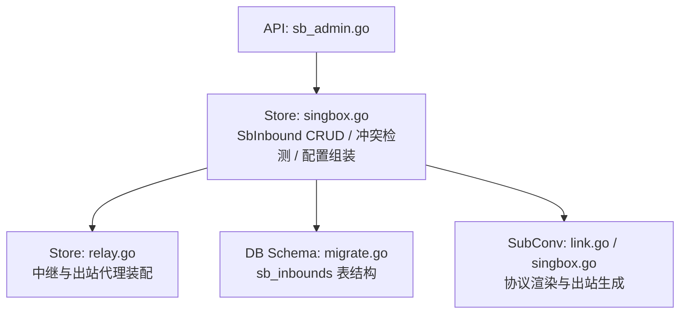
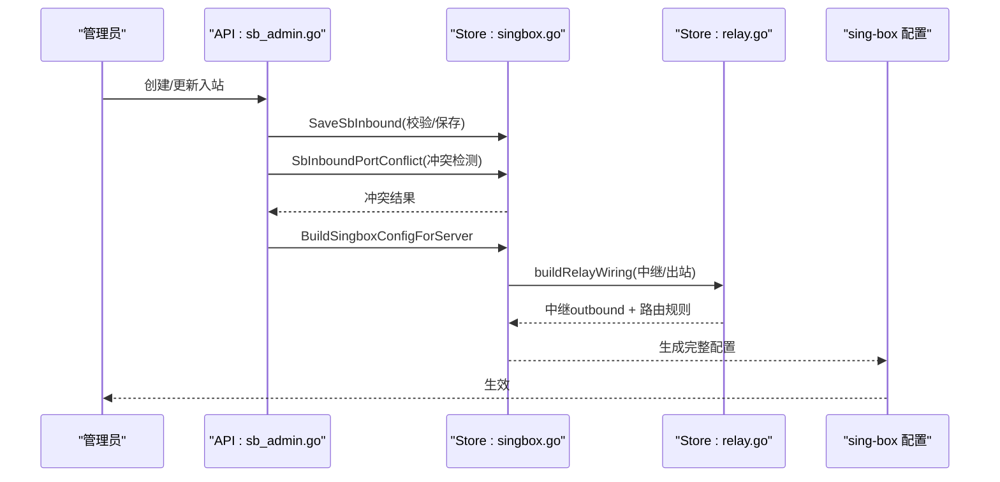
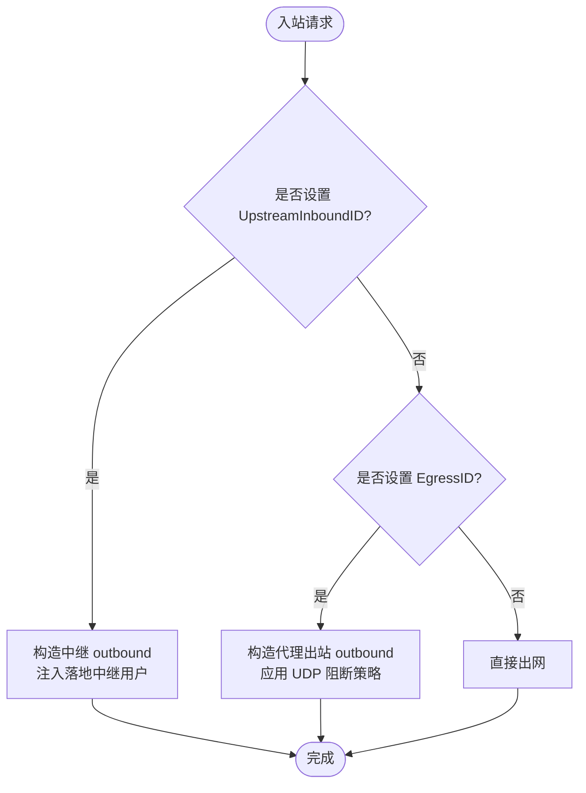
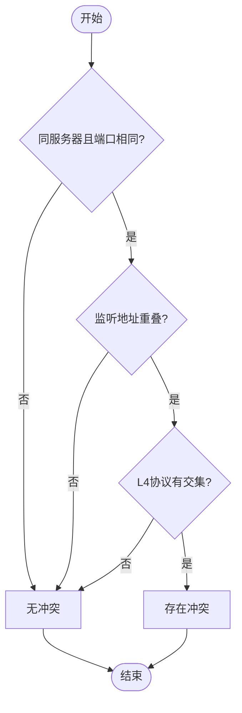
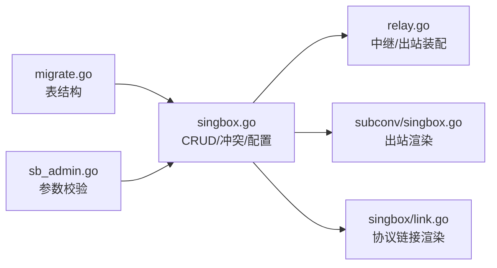

# 入站配置模型

<cite>
**本文引用的文件**
- [internal/store/singbox.go](file://internal/store/singbox.go)
- [internal/store/relay.go](file://internal/store/relay.go)
- [internal/store/migrate.go](file://internal/store/migrate.go)
- [internal/api/sb_admin.go](file://internal/api/sb_admin.go)
- [internal/store/portconflict_test.go](file://internal/store/portconflict_test.go)
- [internal/subconv/link.go](file://internal/singbox/link.go)
- [internal/subconv/singbox.go](file://internal/subconv/singbox.go)
</cite>

## 目录
1. [简介](#简介)
2. [项目结构](#项目结构)
3. [核心组件](#核心组件)
4. [架构总览](#架构总览)
5. [详细组件分析](#详细组件分析)
6. [依赖关系分析](#依赖关系分析)
7. [性能考量](#性能考量)
8. [故障排查指南](#故障排查指南)
9. [结论](#结论)
10. [附录](#附录)

## 简介
本文件围绕 SbInbound（轻舟管理的原生 sing-box 入站）数据模型与相关机制，系统性说明其字段含义、支持的协议类型、入站间关系映射（中继与出站代理）、端口冲突检测、中继认证与状态管理，以及完整的生命周期操作示例。目标是帮助读者在不深入代码的前提下，准确理解并安全地配置与管理入站。

## 项目结构
SbInbound 的核心定义、持久化、冲突检测、中继与出站代理的装配逻辑主要位于 store 层；API 层负责参数校验与业务约束；子转换模块负责将入站配置渲染为客户端订阅链接或 sing-box 出站配置。

图表来源
- [internal/store/singbox.go:40-73](file://internal/store/singbox.go#L40-L73)
- [internal/store/relay.go:15-35](file://internal/store/relay.go#L15-L35)
- [internal/store/migrate.go:302-317](file://internal/store/migrate.go#L302-L317)
- [internal/singbox/link.go:293-369](file://internal/singbox/link.go#L293-L369)
- [internal/subconv/singbox.go:232-272](file://internal/subconv/singbox.go#L232-L272)

章节来源
- [internal/store/singbox.go:40-73](file://internal/store/singbox.go#L40-L73)
- [internal/store/migrate.go:302-317](file://internal/store/migrate.go#L302-L317)

## 核心组件
- 数据模型：SbInbound（入站实体），包含 ID、ServerID、Type、Tag、Listen、ListenPort、TlsID、Options、Enabled、SortOrder、UpstreamInboundID、EgressID、RelaySecret、UpstreamBroken 等字段。
- 存储与查询：ListSbInbounds、GetSbInbound、SaveSbInbound、DeleteSbInbound、AckUpstreamBroken。
- 冲突检测：SbInboundPortConflict（按服务器维度、监听地址重叠与 L4 协议交集判断）。
- 中继与出站：buildRelayWiring、relayOutbound、egressOutbound（将入站流量转发到落地入站或第三方代理出口）。
- 配置组装：BuildSingboxConfig / BuildSingboxConfigForServer（合并 TLS、Options、中继/出站路由规则）。

章节来源
- [internal/store/singbox.go:40-73](file://internal/store/singbox.go#L40-L73)
- [internal/store/singbox.go:243-278](file://internal/store/singbox.go#L243-L278)
- [internal/store/singbox.go:280-340](file://internal/store/singbox.go#L280-L340)
- [internal/store/singbox.go:353-400](file://internal/store/singbox.go#L353-L400)
- [internal/store/singbox.go:501-527](file://internal/store/singbox.go#L501-L527)
- [internal/store/relay.go:69-177](file://internal/store/relay.go#L69-L177)
- [internal/store/relay.go:236-357](file://internal/store/relay.go#L236-L357)

## 架构总览
SbInbound 在系统中的作用是承载 sing-box 的入站监听与用户接入点，同时通过 UpstreamInboundID 实现“线路机→落地机”的中继，或通过 EgressID 将流量经第三方代理出口出网。配置构建时，系统会：
- 读取所有启用的入站，合并 TLS 与 Options。
- 计算中继与出站代理的 outbound 与路由规则。
- 注入落地入站的“中继用户”，使线路机可凭中继凭证连接落地入站。
- 输出最终 sing-box 配置供节点运行。

图表来源
- [internal/api/sb_admin.go:1542-1580](file://internal/api/sb_admin.go#L1542-L1580)
- [internal/store/singbox.go:562-679](file://internal/store/singbox.go#L562-L679)
- [internal/store/relay.go:69-177](file://internal/store/relay.go#L69-L177)

## 详细组件分析

### 数据模型与字段语义
- ID：自增主键，唯一标识一个入站。
- ServerID：所属服务器标识，用于多机部署时的隔离。
- Type：入站协议类型，如 vless、vmess、trojan、shadowsocks、hysteria2、tuic、anytls、mixed 等。
- Tag：入站标签，作为分组与订阅匹配的关键键。
- Listen：监听地址，支持通配符（空、::、::0、0.0.0.0）表示绑定所有接口。
- ListenPort：监听端口。
- TlsID：关联的 TLS/Reality 配置 ID，0 表示无 TLS。
- Options：JSON 字符串，存放入站扩展字段（传输、拥塞控制、伪装等）。
- Enabled：是否启用。
- SortOrder：显示顺序，不影响运行时行为。
- UpstreamInboundID：中继目标入站 ID，非 0 表示该入站为“线路机”，流量转发至指定“落地机”。
- EgressID：出站代理 ID，非 0 表示该入站流量经第三方代理（SOCKS5/HTTP）出网，与 UpstreamInboundID 互斥。
- RelaySecret：落地入站的中继认证密钥，首次被中继使用时惰性生成并持久化。
- UpstreamBroken：当落地入站被删除导致中继链路断裂时置位，提示当前实际已降级为直出。

章节来源
- [internal/store/singbox.go:40-73](file://internal/store/singbox.go#L40-L73)
- [internal/store/migrate.go:302-317](file://internal/store/migrate.go#L302-L317)

### 支持的入站类型与协议特性
- vless、vmess、trojan、mixed：基于 TCP 的传输，支持多种传输封装（ws/grpc/httpupgrade 等）与 TLS/Reality。
- shadowsocks：默认同时绑定 TCP/UDP，可通过 Options.network 限制为仅 TCP 或仅 UDP。
- hysteria2、tuic、hysteria：基于 QUIC/UDP 的协议，占用 UDP。
- anytls：TLS 隧道协议，需携带 TLS 配置。

这些类型的 L4 协议占用由 inboundTransports 判定，用于端口冲突检测。

章节来源
- [internal/store/singbox.go:442-486](file://internal/store/singbox.go#L442-L486)
- [internal/subconv/singbox.go:232-272](file://internal/subconv/singbox.go#L232-L272)
- [internal/singbox/link.go:293-369](file://internal/singbox/link.go#L293-L369)

### 入站间关系映射：中继与出站代理
- 中继（UpstreamInboundID）：
  - 线路机入站将流量转发到落地入站，落地入站再访问互联网。
  - 落地入站会注入一个“中继用户”，其凭据由落地入站的 RelaySecret 派生，确保线路机与落地端一致。
  - 若落地入站被删除，线路机的 UpstreamInboundID 会被清空，并标记 UpstreamBroken 以提示链路降级。
- 出站代理（EgressID）：
  - 入站流量经第三方代理（SOCKS5/HTTP）出网，适用于静态 IP 等场景。
  - 出站代理与中继互斥；若引用了不存在的 egress，则跳过该入站的出站规则，流量走默认路由。

图表来源
- [internal/store/relay.go:69-177](file://internal/store/relay.go#L69-L177)
- [internal/store/relay.go:236-357](file://internal/store/relay.go#L236-L357)
- [internal/store/singbox.go:562-679](file://internal/store/singbox.go#L562-L679)

章节来源
- [internal/store/relay.go:69-177](file://internal/store/relay.go#L69-L177)
- [internal/store/relay.go:236-357](file://internal/store/relay.go#L236-L357)
- [internal/store/singbox.go:562-679](file://internal/store/singbox.go#L562-L679)

### 端口冲突检测机制
- 检测范围：同一 ServerID 下的入站。
- 冲突条件：
  - 监听地址重叠（通配地址与具体地址视为重叠）。
  - L4 协议有交集（TCP/UDP）。例如 hysteria2（UDP）与 vless（TCP）共享 443 是合法的，不会冲突。
  - shadowsocks 默认同时绑定 TCP/UDP，除非 Options.network 明确限制。
- 排除自身：编辑现有入站时不应报告与自身的冲突。
- 跨服务器：不同 ServerID 的同端口不冲突。

图表来源
- [internal/store/singbox.go:488-527](file://internal/store/singbox.go#L488-L527)
- [internal/store/portconflict_test.go:21-141](file://internal/store/portconflict_test.go#L21-L141)

章节来源
- [internal/store/singbox.go:488-527](file://internal/store/singbox.go#L488-L527)
- [internal/store/portconflict_test.go:21-141](file://internal/store/portconflict_test.go#L21-L141)

### 中继认证机制与 UpstreamBroken 状态管理
- 中继认证：
  - 落地入站首次被中继使用时，惰性生成 RelaySecret 并持久化。
  - 线路机与落地入站均使用从 RelaySecret 派生的凭据（UUID/Password），保证双方一致。
- UpstreamBroken：
  - 当落地入站被删除时，所有指向它的线路机会被清空 UpstreamInboundID，并标记 UpstreamBroken，提示链路已降级为直出。
  - 管理员可通过 AckUpstreamBroken 确认并接受直出状态，或在后续重新设置中继/出站后自动清除。

章节来源
- [internal/store/relay.go:42-67](file://internal/store/relay.go#L42-L67)
- [internal/store/singbox.go:342-351](file://internal/store/singbox.go#L342-L351)
- [internal/store/singbox.go:353-400](file://internal/store/singbox.go#L353-L400)

### 入站配置的完整生命周期管理示例
以下示例展示从创建到删除的常见操作流程，涵盖校验、冲突检测、中继/出站配置与状态管理。

- 创建入站
  - 输入：Type、Tag、Listen、ListenPort、TlsID、Options、Enabled、SortOrder、UpstreamInboundID/EgressID。
  - 校验：
    - Options 必须为合法 JSON；shadowsocks 若无密码则自动生成 PSK。
    - UpstreamInboundID 与 EgressID 互斥；若选择 EgressID，需验证其存在。
    - 中继目标必须存在且不同于自身，避免环路。
  - 冲突检测：调用 SbInboundPortConflict，若冲突则拒绝创建。
  - 保存：SaveSbInbound 写入数据库，必要时级联更新自构建节点的 tag 引用。

- 启用/禁用
  - 通过 SaveSbInbound 修改 Enabled；不影响中继/出站链路的完整性。
  - 若之前存在 UpstreamBroken，仅在重新设置中继/出站时清除；否则保留提示。

- 删除入站
  - DeleteSbInbound 会：
    - 删除与该入站绑定的自构建节点及其组关系。
    - 清空所有指向该入站的线路机的 UpstreamInboundID，并标记 UpstreamBroken。
    - 返回受影响的服务器列表，以便重建配置。

- 中继/出站变更
  - 若将入站从直出改为中继或出站，UpstreamBroken 自动清除。
  - 若移除中继/出站，入站恢复直出，可能触发 UpstreamBroken 提示（如果曾存在中继链路）。

章节来源
- [internal/api/sb_admin.go:1542-1580](file://internal/api/sb_admin.go#L1542-L1580)
- [internal/store/singbox.go:280-340](file://internal/store/singbox.go#L280-L340)
- [internal/store/singbox.go:353-400](file://internal/store/singbox.go#L353-L400)
- [internal/store/singbox.go:501-527](file://internal/store/singbox.go#L501-L527)

## 依赖关系分析
- Store 层依赖 DB schema（migrate.go）进行持久化。
- Store 层依赖 subconv/singbox 与 singbox/link 将入站配置渲染为客户端链接或出站配置。
- API 层对入站参数进行强校验，确保中继/出站配置的安全性与一致性。
- 中继与出站装配逻辑集中在 relay.go，确保多入站共享出站、统一路由规则。

图表来源
- [internal/store/migrate.go:302-317](file://internal/store/migrate.go#L302-L317)
- [internal/store/singbox.go:562-679](file://internal/store/singbox.go#L562-L679)
- [internal/store/relay.go:69-177](file://internal/store/relay.go#L69-L177)
- [internal/subconv/singbox.go:232-272](file://internal/subconv/singbox.go#L232-L272)
- [internal/singbox/link.go:293-369](file://internal/singbox/link.go#L293-L369)

章节来源
- [internal/store/singbox.go:562-679](file://internal/store/singbox.go#L562-L679)
- [internal/store/relay.go:69-177](file://internal/store/relay.go#L69-L177)

## 性能考量
- 配置构建缓存：TLS 与证书在单次构建中缓存，避免重复解密与查询。
- 出站共享：多个入站可共享同一个出站代理或中继出站，减少冗余配置。
- 超时控制：出站代理连接超时有限制，避免长时间挂起影响用户体验。
- UDP 阻断策略：当出站代理不支持 UDP 时，入站侧会强制 TCP-only，降低客户端等待时间。

[本节提供通用指导，无需特定文件分析]

## 故障排查指南
- 端口冲突：
  - 检查是否存在同服务器、同端口且 L4 协议重叠的入站。
  - 注意 shadowsocks 默认占用 TCP/UDP，如需共存请通过 Options.network 限制。
- 中继失效：
  - 若出现 UpstreamBroken，检查落地入站是否被删除或禁用。
  - 重新设置中继或出站可清除该标志；也可通过 AckUpstreamBroken 确认直出。
- 出站代理不可用：
  - 检查 EgressID 是否存在且有效；若不存在，入站将回退到直出。
  - 关注连接超时与 TLS 信任锚配置，避免握手失败。

章节来源
- [internal/store/singbox.go:501-527](file://internal/store/singbox.go#L501-L527)
- [internal/store/singbox.go:342-351](file://internal/store/singbox.go#L342-L351)
- [internal/store/relay.go:179-234](file://internal/store/relay.go#L179-L234)

## 结论
SbInbound 提供了灵活且安全的入站管理能力，支持多种协议类型、精细的端口冲突检测、可靠的中继与出站代理机制，以及完善的状态管理与生命周期操作。通过合理的配置与运维实践，可实现高效、稳定的网络接入与流量转发。

[本节总结性内容，无需特定文件分析]

## 附录
- 常用协议与 L4 占用：
  - TCP：vless、vmess、trojan、mixed、anytls
  - UDP：hysteria2、tuic、hysteria
  - shadowsocks：默认 TCP+UDP，可通过 Options.network 限制
- 中继与出站互斥：UpstreamInboundID 与 EgressID 不能同时非零。
- 监听地址通配：空、::、::0、0.0.0.0 视为通配，与其他地址视为重叠。

[本节为补充信息，无需特定文件分析]
