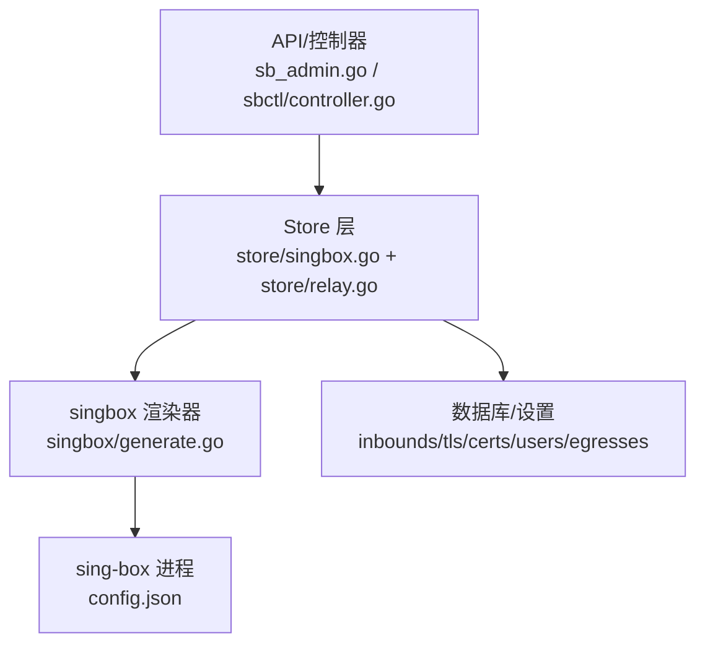
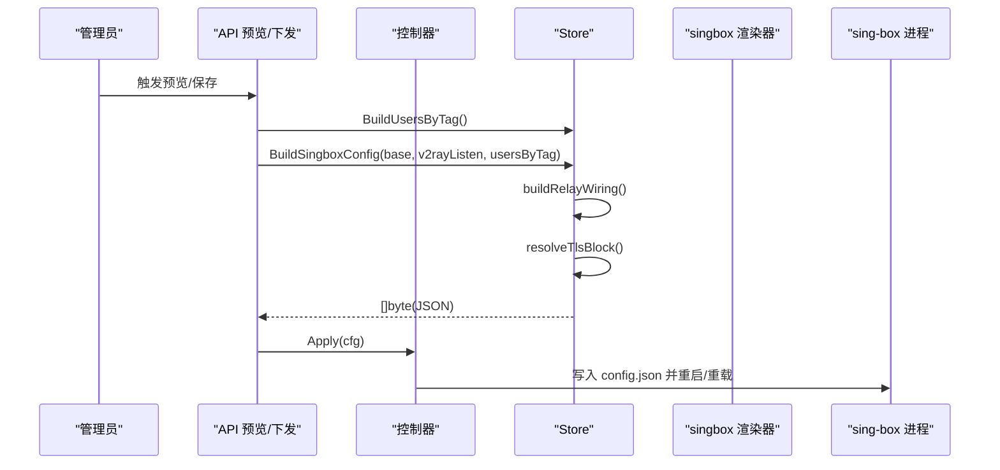
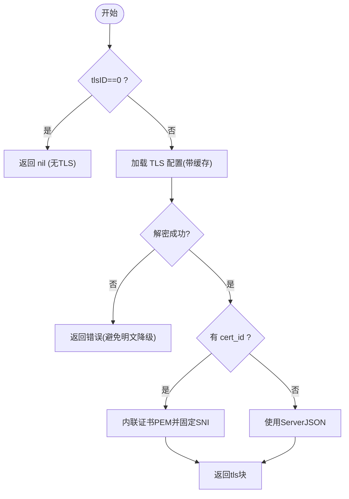
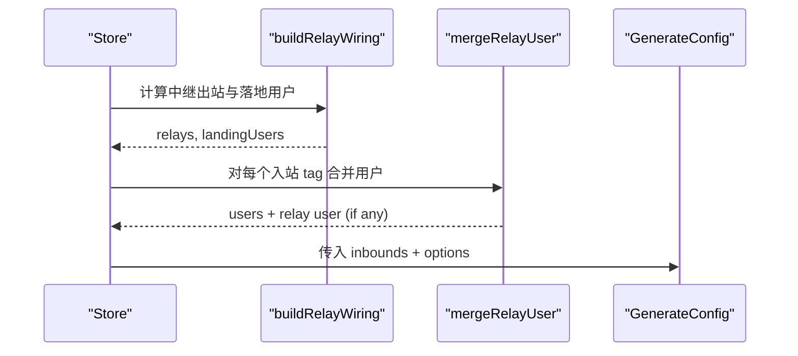
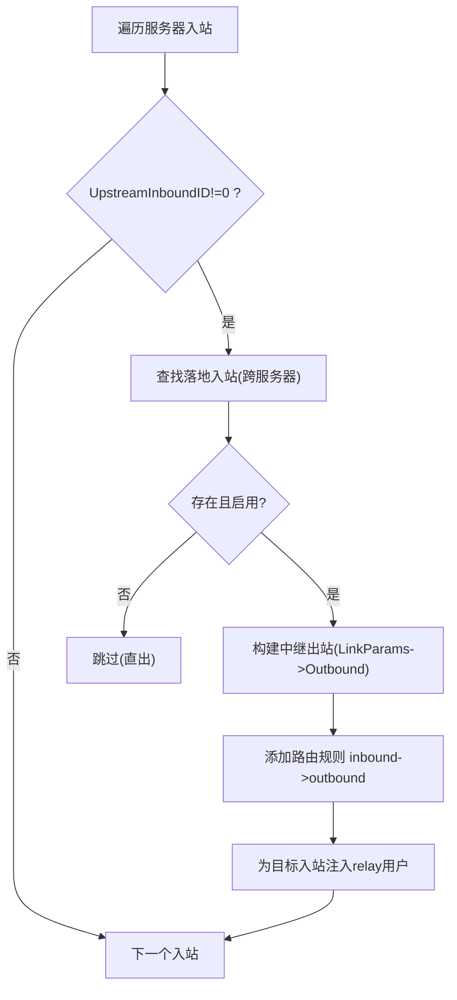
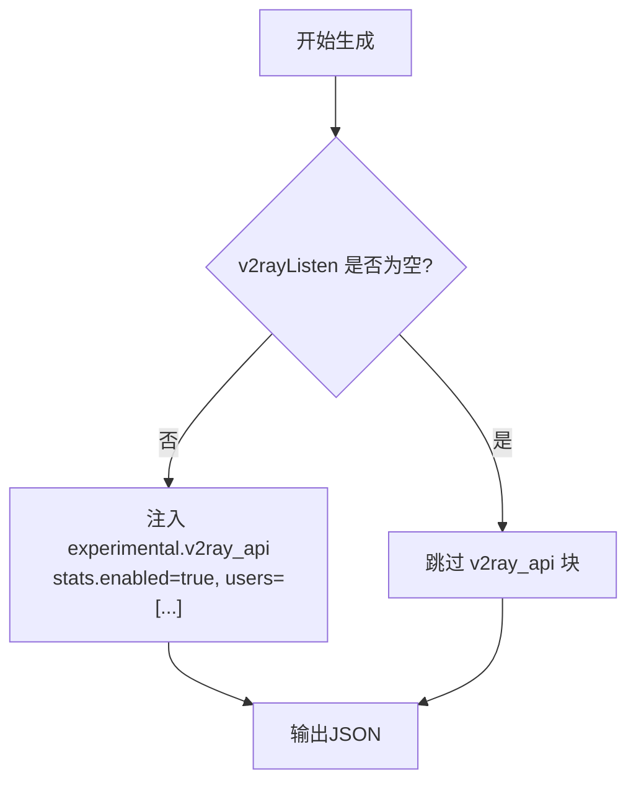
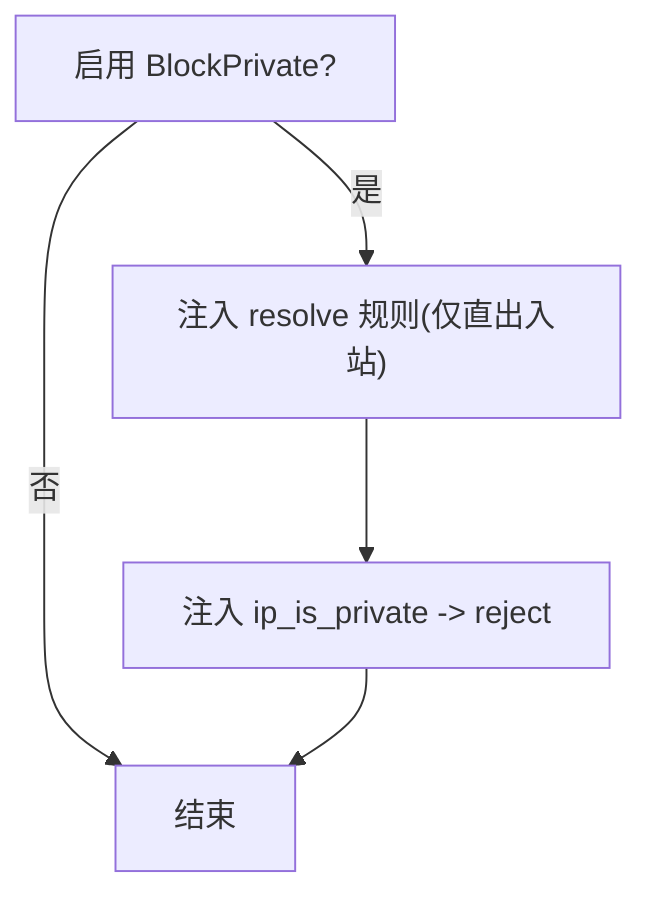
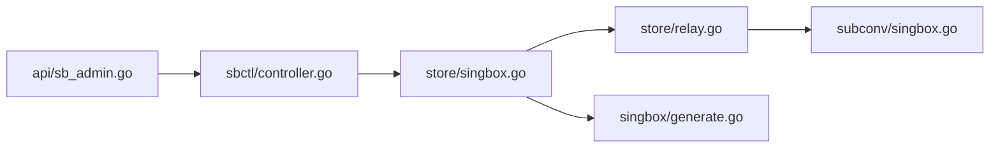

# 配置生成器

<cite>
**本文引用的文件**   
- [internal/singbox/generate.go](file://internal/singbox/generate.go)
- [internal/store/singbox.go](file://internal/store/singbox.go)
- [internal/store/relay.go](file://internal/store/relay.go)
- [internal/api/sb_admin.go](file://internal/api/sb_admin.go)
- [internal/sbctl/controller.go](file://internal/sbctl/controller.go)
- [internal/subconv/singbox.go](file://internal/subconv/singbox.go)
- [frontend/src/views/AdminSettings.vue](file://frontend/src/views/AdminSettings.vue)
- [.github/workflows/release.yml](file://.github/workflows/release.yml)
</cite>

## 目录
1. [简介](#简介)
2. [项目结构](#项目结构)
3. [核心组件](#核心组件)
4. [架构总览](#架构总览)
5. [详细组件分析](#详细组件分析)
6. [依赖关系分析](#依赖关系分析)
7. [性能与缓存](#性能与缓存)
8. [故障排查](#故障排查)
9. [结论](#结论)
10. [附录：端到端示例](#附录端到端示例)

## 简介
本文件面向“轻舟”面板中的 Sing-box 配置生成子系统，系统性说明从数据库到最终 sing-box JSON 的完整生成流程。重点覆盖以下主题：
- BuildSingboxConfig 与 BuildSingboxConfigForServer 的实现原理
- 入站配置组装、TLS 块解析、用户权限合并
- 中继链路构建 buildRelayWiring 与落地用户的注入机制
- 配置模板 base 参数使用与变量替换机制
- V2Ray API 集成的条件编译与远程节点兼容性处理
- 私有网络访问控制 blockPrivateEgress 与安全策略
- 配置缓存机制与性能优化策略
- 完整的配置生成示例（从数据库到 JSON）

## 项目结构
配置生成涉及三层协作：
- Store 层（数据与装配）：负责读取入站、TLS、证书、用户授权、中继与出口配置，并拼装为 sing-box.Inbound 列表与 Relay 路由规则。
- singbox 包（渲染与输出）：将 Inbound 列表与 Options 渲染为最终的 sing-box JSON，包含 v2ray_api、私有网络阻断、DNS 劫持等全局逻辑。
- API/控制器层（调用与下发）：根据当前服务器或远端节点能力选择是否启用 v2ray_api，并将生成的配置下发到 sing-box 进程。

图表来源
- [internal/api/sb_admin.go:1687-1719](file://internal/api/sb_admin.go#L1687-L1719)
- [internal/sbctl/controller.go:353-389](file://internal/sbctl/controller.go#L353-L389)
- [internal/store/singbox.go:562-679](file://internal/store/singbox.go#L562-L679)
- [internal/singbox/generate.go:137-295](file://internal/singbox/generate.go#L137-L295)

章节来源
- [internal/api/sb_admin.go:1687-1719](file://internal/api/sb_admin.go#L1687-L1719)
- [internal/sbctl/controller.go:353-389](file://internal/sbctl/controller.go#L353-L389)
- [internal/store/singbox.go:562-679](file://internal/store/singbox.go#L562-L679)
- [internal/singbox/generate.go:137-295](file://internal/singbox/generate.go#L137-L295)

## 核心组件
- Store.BuildSingboxConfig：按本地（server_id=0）聚合所有启用的入站，计算中继与落地用户，组装 TLS 块与用户列表，调用 singbox.GenerateConfigWithOptions 输出 JSON。
- Store.BuildSingboxConfigForServer：同 BuildSingboxConfig，但可按 serverID 过滤入站；v2rayListen 由调用方决定（支持远端节点无插件场景）。
- Store.resolveTlsBlock：解析并注入 TLS/Reality 块，引用受管证书时内联 PEM 并固定 SNI；解密失败直接拒绝生成以避免明文降级。
- Store.buildRelayWiring：计算中继出站与路由规则，并为被中继的目标入站注入匹配的 relay 用户。
- singbox.GenerateConfigWithOptions：渲染最终 JSON，注入 v2ray_api（可选）、私有网络阻断、DNS hijack、legacy 字段清理等。

章节来源
- [internal/store/singbox.go:562-679](file://internal/store/singbox.go#L562-L679)
- [internal/store/singbox.go:184-239](file://internal/store/singbox.go#L184-L239)
- [internal/store/relay.go:69-177](file://internal/store/relay.go#L69-L177)
- [internal/singbox/generate.go:137-295](file://internal/singbox/generate.go#L137-L295)

## 架构总览
下图展示一次配置生成与下发的时序：

图表来源
- [internal/api/sb_admin.go:1687-1719](file://internal/api/sb_admin.go#L1687-L1719)
- [internal/store/singbox.go:562-679](file://internal/store/singbox.go#L562-L679)
- [internal/singbox/generate.go:137-295](file://internal/singbox/generate.go#L137-L295)

## 详细组件分析

### BuildSingboxConfig 与 BuildSingboxConfigForServer
- 两者均执行相同的主流程：
  - 获取当前服务器（或全部）的入站列表
  - 计算中继链路与落地用户
  - 遍历每个入站，组装 Base（type/tag/listen/listen_port），合并 Options，解析 TLS 块
  - 合并用户：mergeRelayUser(usersByTag[tag], landingUsers, tag)
  - 调用 singbox.GenerateConfigWithOptions(base, inbounds, options)
- 差异：
  - BuildSingboxConfig 默认针对本地（server_id=0）
  - BuildSingboxConfigForServer 支持按 serverID 过滤；v2rayListen 由调用方传入空串以跳过 v2ray_api（用于远端节点可能未编译该插件的场景）

章节来源
- [internal/store/singbox.go:562-679](file://internal/store/singbox.go#L562-L679)

### 入站配置组装与 TLS 块解析
- 入站基础字段来自 SbInbound（type/tag/listen/listen_port），Options 为额外 JSON 片段，会合并进 Base。
- TLS 块通过 resolveTlsBlock 解析：
  - 若 tlsID=0 则无 TLS
  - 若引用了受管证书（cert_id!=0），则内联 certificate/key，并固定 server_name 为证书域名
  - 若解密失败（密钥不匹配或证书不可用），直接返回错误，避免静默降级为明文

图表来源
- [internal/store/singbox.go:184-239](file://internal/store/singbox.go#L184-L239)

章节来源
- [internal/store/singbox.go:184-239](file://internal/store/singbox.go#L184-L239)

### 用户权限合并与落地用户注入
- 用户来源：BuildUsersByTag 基于用户套餐/流量池/分组策略，为每个入站 tag 产出 singbox.User 列表。
- 中继落地用户注入：
  - buildRelayWiring 会为所有被中继的目标入站生成一个 relay 用户（UUID+Password 由 landing 的 relay_secret 派生）
  - mergeRelayUser 将该 relay 用户追加到目标入站的 users[]，使中继出站能以该身份认证到落地入站

图表来源
- [internal/store/relay.go:69-177](file://internal/store/relay.go#L69-L177)
- [internal/store/singbox.go:562-679](file://internal/store/singbox.go#L562-L679)

章节来源
- [internal/store/relay.go:60-67](file://internal/store/relay.go#L60-L67)
- [internal/store/singbox.go:1012-1119](file://internal/store/singbox.go#L1012-L1119)

### 中继链路构建 buildRelayWiring
- 功能：
  - 为每个启用的中继入站（UpstreamInboundID != 0）构造一个出站（指向落地入站），并添加路由规则将其流量导向该出站
  - 为被中继的目标入站注入一个 relay 用户，确保中继侧可认证
  - 同时支持第三方代理出口（EgressID），将入站流量导出到购买的 SOCKS5/HTTP 代理
- 关键点：
  - 中继出站通过 LinkParams 重建客户端链接，再转换为 sing-box outbound
  - 复用同一落地出站的多个中继入站共享一个出站对象
  - 若落地协议不支持或上游缺失/禁用，则跳过该中继，不影响整体构建

图表来源
- [internal/store/relay.go:69-177](file://internal/store/relay.go#L69-L177)

章节来源
- [internal/store/relay.go:69-177](file://internal/store/relay.go#L69-L177)

### 配置模板系统 base 参数与变量替换
- base 是 sing-box 的全局模板 JSON（log/dns/route/outbounds），可由管理员自定义或通过设置项提供；未设置时使用内置 DefaultBaseConfig。
- 生成过程：
  - 先反序列化 base 到 map[string]interface{}
  - 随后注入 inbounds、experimental.v2ray_api、route rules、outbounds 等
  - 最后清理旧版 domain_strategy 等已弃用字段，保证兼容新版 sing-box
- 变量替换：
  - 本实现采用“键值合并”而非字符串模板替换；base 中已有的 key 会被后续步骤安全覆盖或扩展
  - 对于 DNS，若未显式配置 hijack-dns，会在 UDP 阻断场景自动注入 hijack-dns 规则，并确保 default_domain_resolver 指向可用 DNS

章节来源
- [internal/singbox/generate.go:18-33](file://internal/singbox/generate.go#L18-L33)
- [internal/singbox/generate.go:164-295](file://internal/singbox/generate.go#L164-L295)
- [internal/singbox/generate.go:297-372](file://internal/singbox/generate.go#L297-L372)

### V2Ray API 集成与远程节点兼容性
- 当 v2rayListen 非空时，GenerateConfigWithOptions 会注入 experimental.v2ray_api 块，并列出所有用户名称以便按用户统计流量。
- 远端节点可能未编译 with_v2ray_api，此时应传入空 v2rayListen 以跳过该块，避免 sing-box check 失败导致无法下发。
- 控制器在 Rebuild 时会根据各节点的构建标签探测是否支持 v2ray_api，仅对支持的节点传入其监听地址。

图表来源
- [internal/singbox/generate.go:280-291](file://internal/singbox/generate.go#L280-L291)
- [internal/sbctl/controller.go:92-121](file://internal/sbctl/controller.go#L92-L121)

章节来源
- [internal/singbox/generate.go:280-291](file://internal/singbox/generate.go#L280-L291)
- [internal/sbctl/controller.go:92-121](file://internal/sbctl/controller.go#L92-L121)
- [.github/workflows/release.yml:115-157](file://.github/workflows/release.yml#L115-L157)

### 私有网络访问控制 blockPrivateEgress 与安全策略
- 开关：通过设置项 sb_block_private 控制，默认开启（值为空或不为"0"即生效）。
- 行为：
  - 注入两条规则：先 resolve（将域名解析为 IP），再 reject 私有地址（包括云元数据地址 169.254.169.254）
  - 仅对“直出”入站应用该规则（中继入站不在本机解析，避免 CDN 就近解析导致的偏差）
  - 若 base 中已有同类规则，则去重避免重复增长
- 前端界面提供开关与说明，建议保持开启以保护落地机内网与云凭据。

图表来源
- [internal/singbox/generate.go:374-468](file://internal/singbox/generate.go#L374-L468)
- [internal/store/singbox.go:550-560](file://internal/store/singbox.go#L550-L560)
- [frontend/src/views/AdminSettings.vue:175-190](file://frontend/src/views/AdminSettings.vue#L175-L190)

章节来源
- [internal/singbox/generate.go:374-468](file://internal/singbox/generate.go#L374-L468)
- [internal/store/singbox.go:550-560](file://internal/store/singbox.go#L550-L560)
- [frontend/src/views/AdminSettings.vue:175-190](file://frontend/src/views/AdminSettings.vue#L175-L190)

## 依赖关系分析
- Store 依赖 singbox 包进行最终渲染；同时依赖 subconv 将中继出站链接转为 sing-box outbound。
- API 层依赖 Store 生成配置；控制器层负责并发调度与状态追踪。
- 工作流中多处使用缓存（TLS、证书、服务器信息、出口信息等）以降低 DB 查询与加解密开销。

图表来源
- [internal/api/sb_admin.go:1687-1719](file://internal/api/sb_admin.go#L1687-L1719)
- [internal/sbctl/controller.go:353-389](file://internal/sbctl/controller.go#L353-L389)
- [internal/store/singbox.go:562-679](file://internal/store/singbox.go#L562-L679)
- [internal/store/relay.go:69-177](file://internal/store/relay.go#L69-L177)
- [internal/singbox/generate.go:137-295](file://internal/singbox/generate.go#L137-L295)
- [internal/subconv/singbox.go:10-45](file://internal/subconv/singbox.go#L10-L45)

章节来源
- [internal/api/sb_admin.go:1687-1719](file://internal/api/sb_admin.go#L1687-L1719)
- [internal/sbctl/controller.go:353-389](file://internal/sbctl/controller.go#L353-L389)
- [internal/store/singbox.go:562-679](file://internal/store/singbox.go#L562-L679)
- [internal/store/relay.go:69-177](file://internal/store/relay.go#L69-L177)
- [internal/singbox/generate.go:137-295](file://internal/singbox/generate.go#L137-L295)
- [internal/subconv/singbox.go:10-45](file://internal/subconv/singbox.go#L10-L45)

## 性能与缓存
- 构建期缓存：
  - TLS 配置与证书：resolveTlsBlock 使用 per-build 缓存，避免重复解密与查询
  - 中继出站：按落地入站 ID 去重，多个中继共享同一出站
  - 服务器信息与出口：在 buildRelayWiring 中使用 byID/serverCache/egCache 减少重复查询
- 渲染期优化：
  - 用户列表排序以保证字节确定性，便于进程管理器检测变更并跳过不必要重载
  - 清理 legacy 字段（domain_strategy）避免新版本 sing-box 校验失败
- 远端能力探测：
  - 控制器缓存各节点是否支持 v2ray_api，避免无效连接与日志噪音

章节来源
- [internal/store/singbox.go:184-239](file://internal/store/singbox.go#L184-L239)
- [internal/store/relay.go:103-177](file://internal/store/relay.go#L103-L177)
- [internal/singbox/generate.go:192-223](file://internal/singbox/generate.go#L192-L223)
- [internal/singbox/generate.go:500-531](file://internal/singbox/generate.go#L500-L531)
- [internal/sbctl/controller.go:92-121](file://internal/sbctl/controller.go#L92-L121)

## 故障排查
- TLS 解密失败：
  - 现象：生成配置时报错，提示 TLS 配置无法解密
  - 原因：QZ_SECRET_KEY 不一致或证书存储损坏
  - 处理：检查密钥一致性，重新导入证书
- 中继链路失效：
  - 现象：中继入站流量不再转发至落地入站，而是直出
  - 原因：落地入站被删除或未启用，或中继协议不支持
  - 处理：恢复落地入站或调整中继配置；查看拓扑中的 upstream_broken 标记
- v2ray_api 不可用：
  - 现象：远端节点无法上报流量统计
  - 原因：节点未编译 with_v2ray_api
  - 处理：控制器会跳过 v2ray_api 块；如需统计需重新编译节点二进制
- 私有网络阻断误拦：
  - 现象：用户无法访问内网资源
  - 原因：blockPrivateEgress 开启
  - 处理：确认业务需求后决定是否关闭；注意安全风险

章节来源
- [internal/store/singbox.go:184-239](file://internal/store/singbox.go#L184-L239)
- [internal/store/singbox.go:353-420](file://internal/store/singbox.go#L353-L420)
- [internal/sbctl/controller.go:92-121](file://internal/sbctl/controller.go#L92-L121)
- [internal/singbox/generate.go:374-468](file://internal/singbox/generate.go#L374-L468)

## 结论
本配置生成器通过 Store 层的数据装配与 singbox 包的渲染引擎，实现了：
- 灵活的入站与 TLS 配置组装
- 可靠的中继链路构建与落地用户注入
- 安全的私有网络访问控制
- 条件化的 v2ray_api 集成以适配不同节点能力
- 完善的缓存与性能优化策略
整体设计兼顾安全性、可扩展性与运维友好性，适合多服务器、多协议的复杂部署场景。

## 附录：端到端示例
以下示例展示从数据库到最终 JSON 的转换过程（概念性流程，不含具体代码内容）：
- 准备阶段：
  - 数据库中定义入站（类型、监听地址、端口、选项）
  - 配置 TLS 配置文件（mode=tls/reality，可选引用受管证书）
  - 为用户分配套餐/流量池，确定入站归属
- 生成阶段：
  - API 调用 BuildUsersByTag 计算每个入站的用户列表
  - Store.BuildSingboxConfig/ForServer 读取入站、计算中继、解析 TLS、合并用户
  - singbox.GenerateConfigWithOptions 渲染 JSON，注入 v2ray_api（可选）、私有网络阻断、DNS 规则等
- 下发阶段：
  - 控制器根据节点能力决定是否启用 v2ray_api
  - 将 JSON 写入节点配置文件并触发 sing-box 重载

章节来源
- [internal/api/sb_admin.go:1687-1719](file://internal/api/sb_admin.go#L1687-L1719)
- [internal/store/singbox.go:562-679](file://internal/store/singbox.go#L562-L679)
- [internal/singbox/generate.go:137-295](file://internal/singbox/generate.go#L137-L295)
