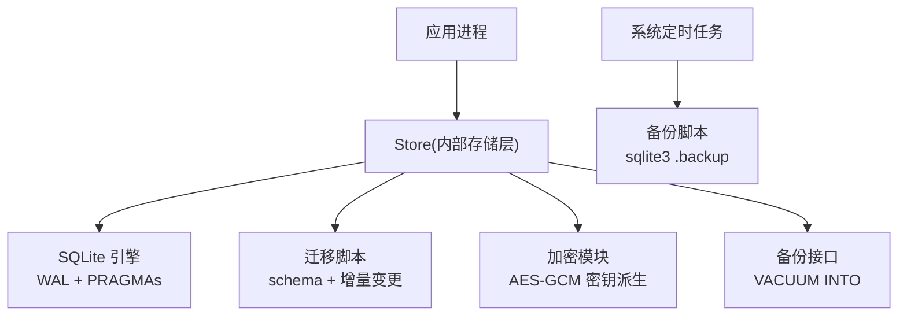
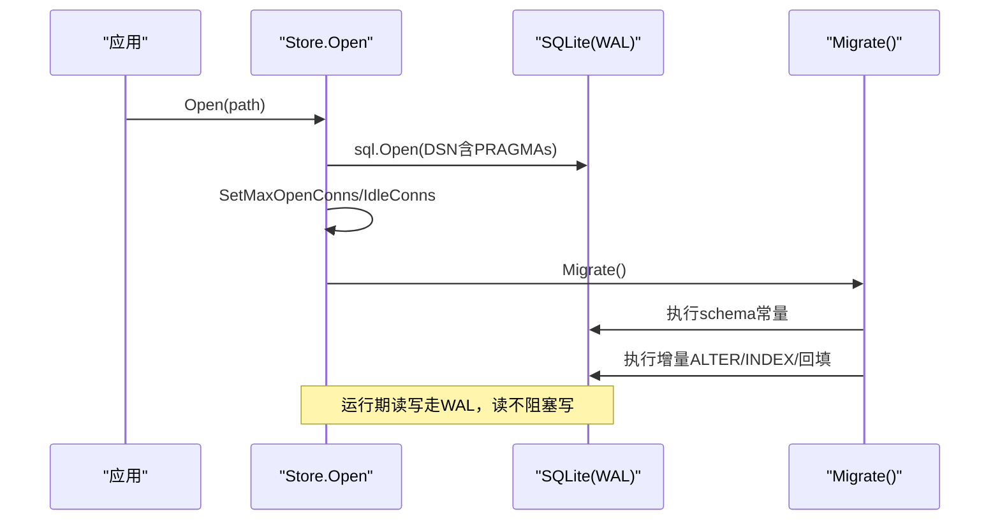
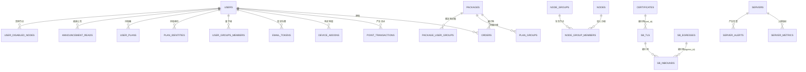
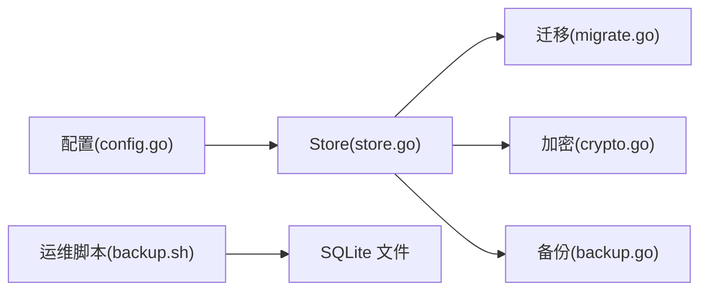
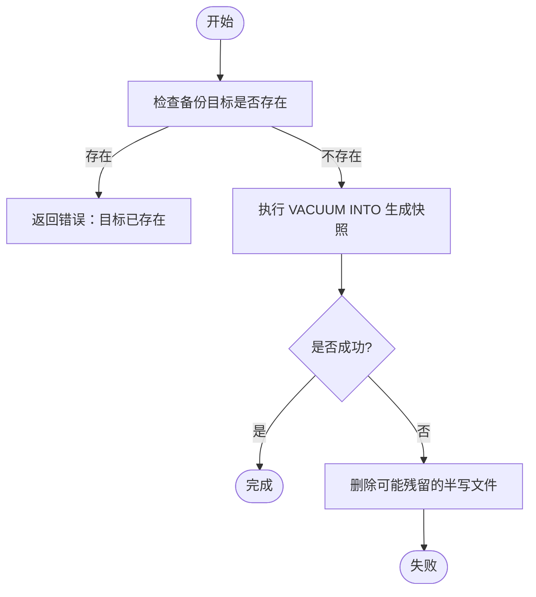

# 数据库设计

<cite>
**本文引用的文件**
- [store.go](file://internal/store/store.go)
- [migrate.go](file://internal/store/migrate.go)
- [crypto.go](file://internal/store/crypto.go)
- [backup.go](file://internal/store/backup.go)
- [config.go](file://internal/config/config.go)
- [backup.sh](file://deploy/backup.sh)
</cite>

## 目录
1. [简介](#简介)
2. [项目结构](#项目结构)
3. [核心组件](#核心组件)
4. [架构总览](#架构总览)
5. [详细组件分析](#详细组件分析)
6. [依赖关系分析](#依赖关系分析)
7. [性能考虑](#性能考虑)
8. [故障排查指南](#故障排查指南)
9. [结论](#结论)
10. [附录](#附录)

## 简介
本文件面向数据库管理员与开发者，系统化说明轻舟（qingzhou）基于 SQLite 的数据库设计。内容涵盖整体结构与表关系、字段定义与约束、索引设计、实体关系图、主外键关联、数据迁移策略与版本管理、备份恢复流程、性能优化方案、数据访问模式与查询优化建议、数据安全与隐私合规要求，以及建模最佳实践与扩展指导。

## 项目结构
- 数据存储层位于 internal/store，负责 SQLite 连接、初始化、迁移、加密、备份等。
- 配置通过环境变量注入数据库路径等参数，默认使用 qingzhou.db。
- 运维脚本 deploy/backup.sh 提供在线热备与保留策略。

图表来源
- [store.go:27-57](file://internal/store/store.go#L27-L57)
- [migrate.go:8-530](file://internal/store/migrate.go#L8-L530)
- [crypto.go:17-77](file://internal/store/crypto.go#L17-L77)
- [backup.go:10-51](file://internal/store/backup.go#L10-L51)
- [backup.sh:1-14](file://deploy/backup.sh#L1-L14)

章节来源
- [store.go:27-57](file://internal/store/store.go#L27-L57)
- [config.go:14-28](file://internal/config/config.go#L14-L28)
- [backup.sh:1-14](file://deploy/backup.sh#L1-L14)

## 核心组件
- Store：封装 sqlite.DB 连接、PRAGMA 设置、连接池、路径暴露、关闭。
- 迁移器：启动时幂等执行 schema 与增量 ALTER/INDEX/回填逻辑。
- 加密：对敏感字段（如 SMTP 密码、CF Token、TLS 配置、证书 PEM/Key、代理密码等）进行 AES-GCM 加密存储与读取校验。
- 备份：通过 VACUUM INTO 生成一致快照；外部脚本使用 sqlite3 .backup 做在线热备。

章节来源
- [store.go:10-71](file://internal/store/store.go#L10-L71)
- [migrate.go:532-743](file://internal/store/migrate.go#L532-L743)
- [crypto.go:17-130](file://internal/store/crypto.go#L17-L130)
- [backup.go:10-51](file://internal/store/backup.go#L10-L51)

## 架构总览
轻舟采用单进程 SQLite 部署，开启 WAL 模式以支持多读一写并发；通过 PRAGMA 设置 busy_timeout、foreign_keys、synchronous 等保证一致性与可用性；所有表与索引在启动时通过 migrate.go 中的常量 schema 与增量语句创建或补齐；敏感数据统一经 crypto.go 加密落盘；备份由应用内 BackupTo 与外部 backup.sh 共同保障。

图表来源
- [store.go:27-57](file://internal/store/store.go#L27-L57)
- [migrate.go:532-743](file://internal/store/migrate.go#L532-L743)

## 详细组件分析

### 数据库连接与运行时参数
- 连接字符串包含 PRAGMA：busy_timeout(5000)、journal_mode=WAL、foreign_keys=1、synchronous=NORMAL、_txlock=immediate。
- 连接池大小：最大打开连接数与空闲连接数均为 8，避免嵌套事务导致的死锁。
- 数据库路径从配置加载，默认 qingzhou.db。

章节来源
- [store.go:27-57](file://internal/store/store.go#L27-L57)
- [config.go:14-28](file://internal/config/config.go#L14-L28)

### 表结构与字段定义
以下为主要业务表及其关键字段、类型、约束与用途说明（仅列出关键信息，完整建表语句见迁移常量）。

- settings：系统设置键值对，key 为主键。
- users：用户主表，username/email 唯一，role/status/points/设备限制/流量限制/到期时间/凭证重置时间等。
- packages：商品/套餐，type/name/description/highlights/price_points/traffic_bytes/device_add/duration_days/duration_options/stock/enabled/sort_order。
- orders：订单，user_id/package_id/package_snapshot/price_points/status/created_at。
- point_transactions：积分流水，user_id/amount/type/balance_after/ref_id/note/operator_id/created_at。
- device_addons：设备槽位附加包，user_id/slots/order_id/purchased_at/expires_at。
- email_tokens：邮箱验证/重置令牌，user_id/token(purpose)/expires_at/used/created_at。
- nodes / node_groups / node_group_members：节点及分组关系。
- plan_groups / user_groups / user_group_members / package_user_groups / reg_code_user_groups：购买权限与分组控制。
- reg_codes / reg_code_uses：注册码及使用记录。
- user_disabled_nodes：用户级节点屏蔽。
- sessions：会话，user_id/jti/ip/user_agent/created_at/last_seen。
- announcements / announcement_reads：公告与已读标记。
- node_sources：节点源抓取配置。
- help_docs：帮助文档。
- sb_tls：sing-box TLS/Reality 配置，server_json 加密存储，client_json 用于生成分享链接。
- certificates：托管证书，cert_pem/key_pem 加密存储，自动续期与引用计数。
- sb_inbounds：入站配置，tag 唯一，可关联 tls_id/server_id/egress_id/upstream_inbound_id/relay_secret/upstream_broken。
- sb_egresses：出站代理（SOCKS/HTTP），password 加密，可选 TLS 到代理。
- user_plans：按“桶”计量订阅与流量池，kind(plan/pool)，独立配额与过期时间。
- plan_identities：每份订阅的客户端身份（client_name/uuid/secret）与混合代理凭据。
- traffic_samples：用户流量时序采样（up/down 为增量）。
- traffic_daily：按天聚合的用量报表（day,user_id,bucket_id,package_id,up,down）。
- servers：被管服务器元信息（SSH/探针/可见性/到期等）。
- server_metrics：服务器指标时序（CPU/内存/磁盘/网络/负载/进程/uptime/主机信息等）。
- node_singbox：各节点 sing-box 探测结果（version/v2ray_api/raw/checked_at/error）。
- server_alerts：告警事件（离线/高负载/磁盘满/到期等），episode 模型合并持续状态。

章节来源
- [migrate.go:10-530](file://internal/store/migrate.go#L10-L530)

### 索引设计与查询优化
- 高频查询列建立索引：users.email、orders.user_id、point_transactions.user_id、device_addons(user_id, expires_at)、email_tokens(token)、nodes(enabled)、node_group_members(group_id/node_id)、plan_groups(package_id)、user_group_members(group_id/user_id)、package_user_groups(package_id/group_id)、reg_code_uses(code_id)、sessions(user_id/jti)、sb_tls(sort_order/id)、sb_inbounds(tag/server_id)、traffic_samples(user_id, ts)、traffic_samples(ts)、traffic_daily(user_id, day)、traffic_daily(day)、server_metrics(server_id, ts)、server_metrics(ts)、server_alerts(server_id, ts)、server_alerts(server_id, type, read)。
- 部分唯一索引：plan_identities(client_name)、plan_identities(proxy_username WHERE <> '')、orders(user_id, idempotency_key WHERE <> '')。
- 复合索引覆盖常见范围扫描：traffic_samples、traffic_daily、server_metrics 的时间序列查询。
- 排序与展示：sb_tls.sort_order、packages.sort_order、servers.sort_order 等用于列表顺序。

章节来源
- [migrate.go:43-530](file://internal/store/migrate.go#L43-L530)

### 实体关系图（ERD）

图表来源
- [migrate.go:10-530](file://internal/store/migrate.go#L10-L530)

### 主外键与一致性
- 启用 foreign_keys=1，确保引用完整性。
- 典型外键语义：orders.user_id/package_id、point_transactions.user_id、device_addons.user_id、node_group_members(node_id/group_id)、plan_groups(package_id/group_id)、user_group_members(user_id/group_id)、package_user_groups(package_id/group_id)、reg_code_user_groups(code_id/group_id)、reg_code_uses(code_id)、announcement_reads(user_id/announcement_id)、sb_inbounds(tls_id/cert_id/egress_id/server_id/upstream_inbound_id)、server_metrics(server_id)、server_alerts(server_id)。
- 唯一约束：users.username/email/sub_token、nodes.inbound_tag、sb_inbounds.tag、email_tokens.token、reg_codes.code、plan_identities(client_name/proxy_username)、traffic_daily(day,user_id,bucket_id) 等。

章节来源
- [store.go:38-39](file://internal/store/store.go#L38-L39)
- [migrate.go:10-530](file://internal/store/migrate.go#L10-L530)

### 数据迁移策略与版本管理
- 幂等 Schema：每次启动执行一次 CREATE TABLE IF NOT EXISTS 的全量 schema 常量，保证新库可用。
- 增量迁移：通过一系列 ALTER TABLE/CREATE INDEX/UPDATE 语句补齐历史库缺失的列与索引，错误中忽略“重复列/不存在列/不存在表”等预期异常。
- 数据回填：backfillProbeTokenHash、backfillUserPlans、backfillRetiredBuckets、backfillPlanIdentities、mergeDuplicatePlanBuckets、backfillFreeBuckets、backfillTrafficDaily、backfillCerts 等，确保升级后行为一致且可重跑。
- 版本演进原则：新增字段带默认值；旧列重命名兼容；历史数据迁移必须幂等且可回滚（通过只写不删或条件更新）。

章节来源
- [migrate.go:532-743](file://internal/store/migrate.go#L532-L743)

### 数据备份与恢复
- 应用内备份：BackupTo 使用 VACUUM INTO 生成单一自包含文件，基于读事务的一致性快照，不影响读写。
- 外部热备：deploy/backup.sh 使用 sqlite3 .backup 在线拷贝，保留 7 天。
- 恢复建议：停止写入或使用 VACUUM INTO 生成的快照文件直接替换；注意 WAL 模式下不要单独复制主文件。

章节来源
- [backup.go:10-51](file://internal/store/backup.go#L10-L51)
- [backup.sh:1-14](file://deploy/backup.sh#L1-L14)

### 安全与隐私合规
- 静态加密：敏感字段（SMTP 密码、Cloudflare API Token、TLS server_json、证书 PEM/Key、代理密码等）使用 AES-GCM 加密存储，密钥由 QZ_SECRET_KEY 派生。
- 解密失败保护：decryptOK 返回是否成功，调用方不得将失败降级为空值，防止明文下发。
- 启动自检：CountUndecryptableSecrets 统计不可解密条目数量，便于发现密钥变更问题。
- 传输安全：HTTPS/TLS 由上层服务与 sing-box 配置保障；面板登录与会话通过 JWT/Session 管理。
- 最小化暴露：敏感配置不落盘明文；备份文件应妥善保管并限制访问。

章节来源
- [crypto.go:17-130](file://internal/store/crypto.go#L17-L130)

### 数据访问模式与查询优化建议
- 读多写少：WAL 模式允许多读并发；热点读（settings、公告、节点列表）可结合缓存（如内存缓存 settings）。
- 时间序列：traffic_samples、server_metrics 增长快，需定期清理（滚动窗口）；查询优先使用 (user_id/ts) 或 (server_id/ts) 复合索引。
- 报表聚合：traffic_daily 作为预聚合表，减少复杂 JOIN 与 GROUP BY 开销。
- 事务隔离：_txlock=immediate 提前获取写锁，避免读后写升级导致 SQLITE_BUSY_SNAPSHOT。
- 连接池：适度增大 MaxOpenConns/MaxIdleConns 以避免嵌套事务死锁（当前为 8）。

章节来源
- [store.go:27-57](file://internal/store/store.go#L27-L57)
- [migrate.go:403-445](file://internal/store/migrate.go#L403-L445)

## 依赖关系分析
- Store 依赖 sqlite 驱动与 PRAGMA 配置。
- 迁移器依赖全量 schema 与增量语句集合。
- 加密模块依赖对称加密库与随机数源。
- 备份接口依赖 SQLite 的 VACUUM INTO 能力。
- 配置模块提供 DBPath 等运行时参数。

图表来源
- [config.go:14-28](file://internal/config/config.go#L14-L28)
- [store.go:27-57](file://internal/store/store.go#L27-L57)
- [migrate.go:532-743](file://internal/store/migrate.go#L532-L743)
- [crypto.go:17-130](file://internal/store/crypto.go#L17-L130)
- [backup.go:10-51](file://internal/store/backup.go#L10-L51)
- [backup.sh:1-14](file://deploy/backup.sh#L1-L14)

章节来源
- [store.go:27-57](file://internal/store/store.go#L27-L57)
- [migrate.go:532-743](file://internal/store/migrate.go#L532-L743)
- [crypto.go:17-130](file://internal/store/crypto.go#L17-L130)
- [backup.go:10-51](file://internal/store/backup.go#L10-L51)
- [config.go:14-28](file://internal/config/config.go#L14-L28)
- [backup.sh:1-14](file://deploy/backup.sh#L1-L14)

## 性能考虑
- WAL 模式：提升并发读性能，避免读阻塞写。
- 连接池：MaxOpenConns/MaxIdleConns=8，缓解嵌套事务竞争。
- 索引：针对高频过滤与排序列建立合适索引，避免全表扫描。
- 预聚合：traffic_daily 降低报表查询复杂度。
- 超时与重试：busy_timeout=5000ms 降低忙冲突失败概率。
- 日志与监控：server_metrics 与 server_alerts 支撑容量规划与瓶颈定位。

[本节为通用性能讨论，不直接分析具体文件]

## 故障排查指南
- 无法解密敏感字段：检查 QZ_SECRET_KEY 是否变更；使用 CountUndecryptableSecrets 统计受影响条目。
- 备份不一致：避免直接复制 qingzhou.db；使用 VACUUM INTO 或 sqlite3 .backup 在线热备。
- 迁移失败：关注迁移日志中非预期的错误（如语法错误、磁盘错误）；“重复列/不存在列”属预期忽略。
- 查询慢：确认是否命中索引；对大表（server_metrics、traffic_samples）增加时间范围过滤并使用复合索引。
- 告警堆积：server_alerts 采用 episode 模型，若出现大量未读告警，检查阈值与清理策略。

章节来源
- [crypto.go:79-130](file://internal/store/crypto.go#L79-L130)
- [backup.go:10-51](file://internal/store/backup.go#L10-L51)
- [migrate.go:690-705](file://internal/store/migrate.go#L690-L705)

## 结论
轻舟的数据库设计围绕 SQLite 的单进程场景，通过 WAL、PRAGMA、幂等迁移、严格索引与加密存储，兼顾了可靠性、可扩展性与安全性。配合应用内备份与外部脚本，形成完整的备份恢复体系。建议在后续演进中继续遵循幂等迁移、按需索引、预聚合与加密落盘的原则，并在容量增长时评估分片或归档策略。

[本节为总结性内容，不直接分析具体文件]

## 附录

### 备份恢复流程图

图表来源
- [backup.go:28-51](file://internal/store/backup.go#L28-L51)

### 数据建模最佳实践与扩展指导
- 字段设计：尽量使用 NOT NULL 与合理默认值；枚举类字段用 TEXT 并约定取值；时间戳统一使用 Unix 秒。
- 索引策略：先观察查询计划，再添加必要索引；复合索引优先覆盖常见过滤组合。
- 幂等迁移：所有增量变更必须幂等，允许重复执行。
- 安全：所有敏感字段统一加密存储；密钥管理与轮换纳入发布流程。
- 扩展：新增功能优先通过新增表与增量迁移实现，避免破坏既有行结构；必要时引入版本字段或特性开关。

[本节为通用指导，不直接分析具体文件]
