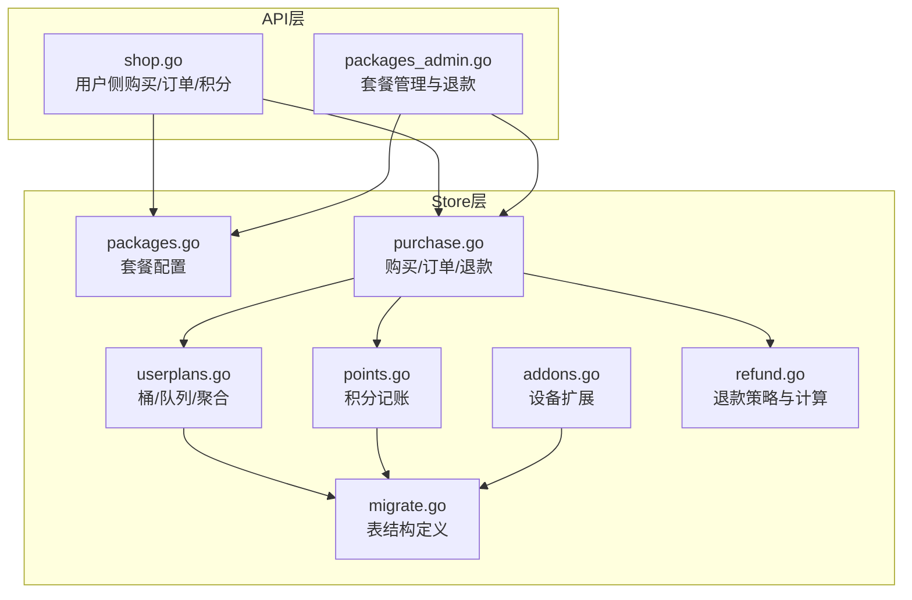
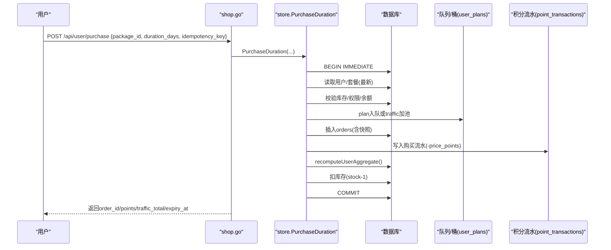
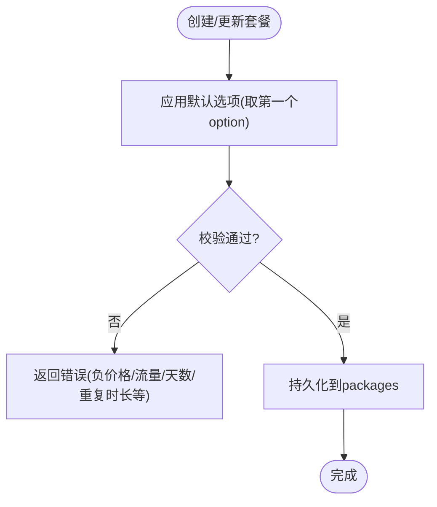
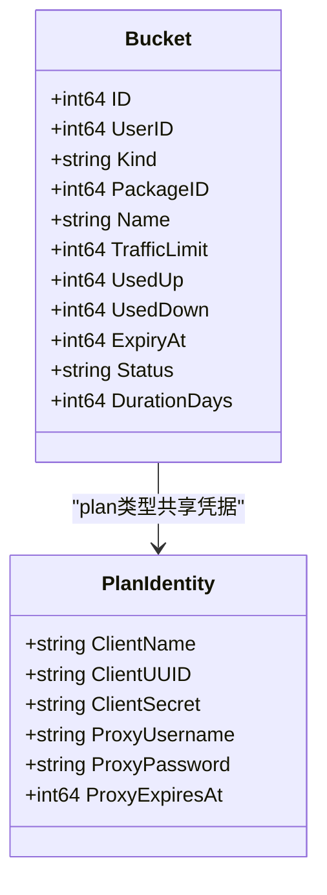
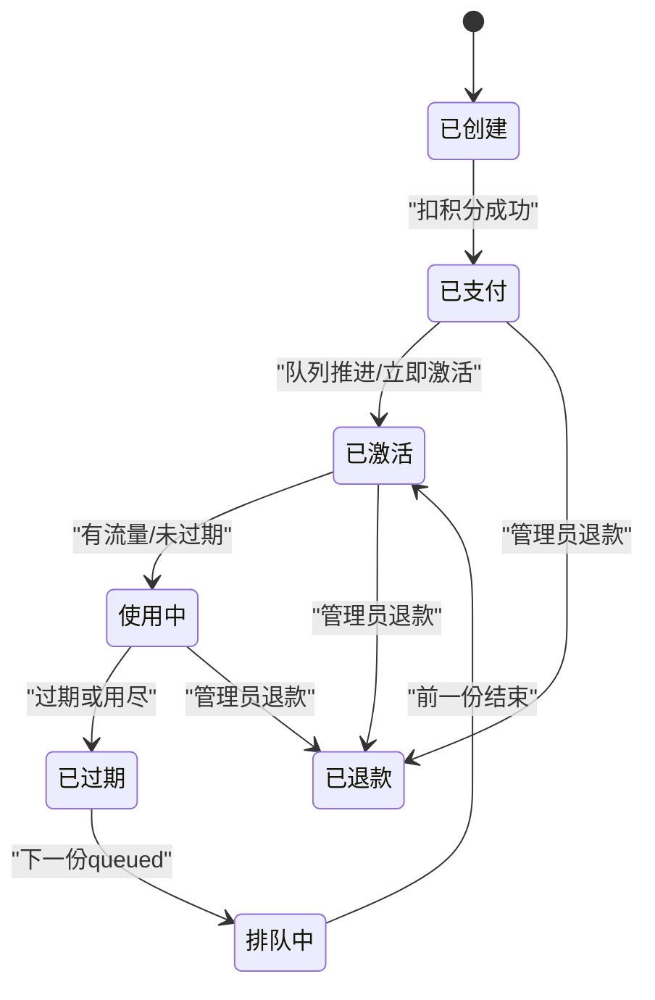
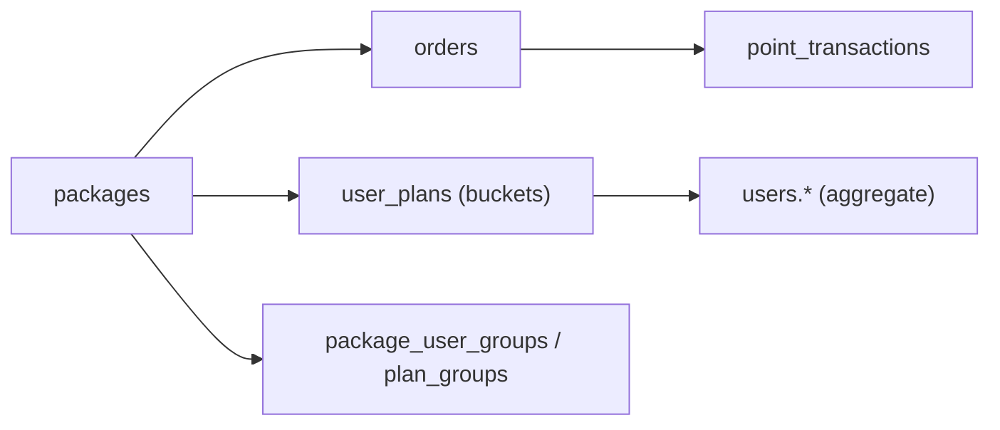

# 套餐订单实体

<cite>
**本文引用的文件**
- [migrate.go](file://internal/store/migrate.go)
- [packages.go](file://internal/store/packages.go)
- [purchase.go](file://internal/store/purchase.go)
- [points.go](file://internal/store/points.go)
- [addons.go](file://internal/store/addons.go)
- [userplans.go](file://internal/store/userplans.go)
- [refund.go](file://internal/store/refund.go)
- [shop.go](file://internal/api/shop.go)
- [packages_admin.go](file://internal/api/packages_admin.go)
</cite>

## 目录
1. [简介](#简介)
2. [项目结构](#项目结构)
3. [核心组件](#核心组件)
4. [架构总览](#架构总览)
5. [详细组件分析](#详细组件分析)
6. [依赖关系分析](#依赖关系分析)
7. [性能考量](#性能考量)
8. [故障排查指南](#故障排查指南)
9. [结论](#结论)
10. [附录：API与业务流程示例](#附录api与业务流程示例)

## 简介
本系统提供“套餐订单”能力，涵盖三类商品：流量包（traffic）、订阅计划（plan）、设备扩展（device）。用户通过积分购买套餐，系统以“桶（bucket）模型”管理配额与有效期，并通过队列机制实现订阅的自动续期与切换。订单全生命周期包括创建、支付（扣积分）、激活、过期、退款等；积分系统采用记账流水（point_transactions）记录所有增减。管理员可对套餐进行上架/下架、排序、限制可购买用户组，并对订单执行退款预览与实际退款。

## 项目结构
- 数据层（store）：定义数据库表结构与CRUD、事务性业务逻辑（购买、退款、队列推进、聚合重算等）。
- API层（api）：暴露HTTP接口，负责鉴权、参数校验、调用store并返回结果。
- 前端（frontend）：展示套餐列表、订单、积分流水、管理员操作界面（不在本文重点）。

图表来源
- [shop.go:11-125](file://internal/api/shop.go#L11-L125)
- [packages_admin.go:82-469](file://internal/api/packages_admin.go#L82-L469)
- [packages.go:171-390](file://internal/store/packages.go#L171-L390)
- [purchase.go:43-649](file://internal/store/purchase.go#L43-L649)
- [userplans.go:28-800](file://internal/store/userplans.go#L28-L800)
- [points.go:14-88](file://internal/store/points.go#L14-L88)
- [addons.go:5-30](file://internal/store/addons.go#L5-L30)
- [refund.go:12-274](file://internal/store/refund.go#L12-L274)
- [migrate.go:45-94](file://internal/store/migrate.go#L45-L94)

章节来源
- [migrate.go:45-94](file://internal/store/migrate.go#L45-L94)

## 核心组件
- 套餐配置（packages）：定义类型、名称、亮点、价格（积分）、流量额度、设备扩展数、有效期、可选时长、库存、是否上架、排序等。
- 订单记录（orders）：记录每次购买或管理员发放的订单快照、价格、状态、时间戳及退款信息。
- 积分交易（point_transactions）：记录所有积分变动（充值、购买、退款、调整），保证账目可追溯。
- 设备扩展（device_addons）：记录用户已购的设备槽位及其有效期。
- 桶与队列（user_plans + plan_identities）：每个套餐购买生成独立“桶”，订阅类套餐进入队列，到期或用尽后自动推进下一个。

章节来源
- [packages.go:17-41](file://internal/store/packages.go#L17-L41)
- [purchase.go:22-41](file://internal/store/purchase.go#L22-L41)
- [points.go:14-24](file://internal/store/points.go#L14-L24)
- [addons.go:5-9](file://internal/store/addons.go#L5-L9)
- [userplans.go:574-607](file://internal/store/userplans.go#L574-L607)

## 架构总览
系统采用“事务+队列+桶”的架构：
- 购买在单个事务中完成：校验库存/权限/余额 → 扣积分 → 写订单快照 → 写入桶（plan入队，traffic加池）→ 写积分流水 → 重算用户聚合 → 扣库存 → 回调外部同步（如sing-box）。
- 订阅类套餐使用队列：新购先入队，若无活跃头则立即激活；否则等待当前头过期或用尽后自动推进。
- 退款按策略计算比例，回滚对应桶贡献，更新订单为已退款，并写积分流水。

图表来源
- [shop.go:27-94](file://internal/api/shop.go#L27-L94)
- [purchase.go:53-250](file://internal/store/purchase.go#L53-L250)
- [userplans.go:28-53](file://internal/store/userplans.go#L28-L53)
- [points.go:26-65](file://internal/store/points.go#L26-L65)

## 详细组件分析

### 套餐配置（packages）
- 字段要点
  - type：traffic | plan | device（注意：当前购买流程仅支持 traffic 与 plan；device用于设备扩展权益）
  - price_points：售价（积分）
  - traffic_bytes：流量额度（字节）
  - duration_days：默认有效期（天），0表示不 expire
  - duration_options：JSON数组，支持多时长选项（仅plan）
  - stock：库存，-1表示无限量
  - enabled：是否上架
  - sort_order：排序
- 行为
  - 应用默认选项：当存在options时，将第一条option的值回填到默认字段，确保单值读取一致
  - 用户可见过滤：ListPackagesForUser仅显示enabled且stock>0或无限量，且对public或用户组允许的套餐可见
  - 删除保护：若有用户仍持有该套餐的桶，禁止删除，需先下架并退款清空

图表来源
- [packages.go:93-107](file://internal/store/packages.go#L93-L107)
- [packages.go:247-268](file://internal/store/packages.go#L247-L268)
- [packages_admin.go:19-80](file://internal/api/packages_admin.go#L19-L80)

章节来源
- [packages.go:17-41](file://internal/store/packages.go#L17-L41)
- [packages.go:171-245](file://internal/store/packages.go#L171-L245)
- [packages.go:247-312](file://internal/store/packages.go#L247-L312)
- [packages_admin.go:19-80](file://internal/api/packages_admin.go#L19-L80)

### 订单记录（orders）
- 字段要点
  - user_id, package_id, package_snapshot（保存购买时的套餐快照，避免后续修改影响历史）
  - price_points, status（success/refunded）
  - created_at, refunded_points, refunded_at, refund_ratio, refunded_traffic
- 行为
  - 幂等购买：通过idempotency_key防止重复扣款
  - 查询：支持用户维度与管理员全局查询，附带快照解析出的name/type
  - 删除：仅允许删除孤儿订单（用户已删除），正常订单应走退款

章节来源
- [purchase.go:22-41](file://internal/store/purchase.go#L22-L41)
- [purchase.go:369-410](file://internal/store/purchase.go#L369-L410)
- [purchase.go:569-649](file://internal/store/purchase.go#L569-L649)

### 积分交易（point_transactions）
- 字段要点
  - amount：正数为充值，负数为扣减
  - type：admin_recharge | purchase | signup_bonus | refund | adjust
  - balance_after：交易后余额
  - ref_id：关联ID（如订单ID）
  - note：备注
  - operator_id：操作者（管理员）
- 行为
  - AdjustPoints原子更新余额并写流水，不允许余额为负
  - 购买/退款均写流水，便于审计对账

章节来源
- [points.go:14-88](file://internal/store/points.go#L14-L88)
- [purchase.go:189-195](file://internal/store/purchase.go#L189-L195)
- [purchase.go:475-497](file://internal/store/purchase.go#L475-L497)

### 设备扩展（device_addons）
- 字段要点
  - slots：设备槽位数
  - expires_at：过期时间
- 行为
  - ListActiveDeviceAddons：返回用户当前有效的设备扩展（未过期）

章节来源
- [addons.go:5-30](file://internal/store/addons.go#L5-L30)

### 桶与队列（user_plans + plan_identities）
- 概念
  - Bucket：独立计量的配额单元，kind=plan或pool；携带流量限额、用量、过期时间、状态（active/queued/exhausted/expired）
  - Queue：同一用户的同一套餐可能有多份，active为当前生效份，queued为排队等待生效份
  - Identity：订阅类套餐的认证凭据绑定在subscription line（plan_identities），份切换不改变凭据
- 关键流程
  - enqueuePlanBucket：购买plan时创建queued份
  - advanceUserQueues：若无可用的active头，则将最老的queued提升为active，并设置expiry_at
  - reverseOrderBucket/reversePlanBucket：退款时回滚对应桶的贡献
  - addToPool/subFromPool：流量包直接增加/减少pool限额
  - recomputeUserAggregate：从桶聚合出users.*列，保持仪表板一致性

图表来源
- [userplans.go:574-607](file://internal/store/userplans.go#L574-L607)
- [userplans.go:102-139](file://internal/store/userplans.go#L102-L139)

章节来源
- [userplans.go:28-53](file://internal/store/userplans.go#L28-L53)
- [userplans.go:148-226](file://internal/store/userplans.go#L148-L226)
- [userplans.go:330-460](file://internal/store/userplans.go#L330-L460)
- [userplans.go:574-607](file://internal/store/userplans.go#L574-L607)

### 定价策略、库存管理与有效期控制
- 定价策略
  - 以积分计价（price_points），支持多时长选项（不同days对应不同price与traffic）
  - 管理员可配置退款策略（mode: prorated/full；basis: min/traffic/time；fee_percent）
- 库存管理
  - stock=-1表示无限量；>0时为有限库存，购买时原子扣减，并发下防超卖
- 有效期控制
  - plan：duration_days>0则设置expiry_at；0表示永久
  - traffic：pool无过期时间，仅受流量限额约束
  - 队列推进：active头过期或用尽后，自动推进下一份

章节来源
- [packages.go:17-41](file://internal/store/packages.go#L17-L41)
- [packages.go:119-139](file://internal/store/packages.go#L119-L139)
- [purchase.go:210-221](file://internal/store/purchase.go#L210-L221)
- [userplans.go:197-226](file://internal/store/userplans.go#L197-L226)
- [refund.go:12-47](file://internal/store/refund.go#L12-L47)

### 订单生命周期与状态流转
- 创建：POST /api/user/purchase 成功 → orders.status='success'
- 支付：事务内扣积分并写point_transactions.type='purchase'
- 激活：plan入队，若无active头则立即激活；否则等待
- 过期/用尽：active头过期或用尽后，队列推进下一份
- 退款：管理员触发 → 计算退款比例 → 回滚桶贡献 → orders.status='refunded' → 写point_transactions.type='refund'

图表来源
- [purchase.go:53-250](file://internal/store/purchase.go#L53-L250)
- [purchase.go:423-567](file://internal/store/purchase.go#L423-L567)
- [userplans.go:148-226](file://internal/store/userplans.go#L148-L226)

章节来源
- [purchase.go:53-250](file://internal/store/purchase.go#L53-L250)
- [purchase.go:423-567](file://internal/store/purchase.go#L423-L567)
- [userplans.go:148-226](file://internal/store/userplans.go#L148-L226)

### 积分系统的记账逻辑与交易流水
- 购买：amount = -price_points，type='purchase'，balance_after为新余额
- 管理员充值/调整：amount>0为充值，<0为调整，type分别为admin_recharge/adjust
- 退款：amount为正数（退回积分），type='refund'，note包含比例说明
- 查询：ListTransactions按用户拉取最近流水

章节来源
- [points.go:26-88](file://internal/store/points.go#L26-L88)
- [purchase.go:189-195](file://internal/store/purchase.go#L189-L195)
- [purchase.go:475-497](file://internal/store/purchase.go#L475-L497)

### 套餐与用户的关联关系
- 用户组限制：package_user_groups限定哪些用户组可购买；ListPackagesForUser据此过滤
- 节点组授权：plan_groups决定套餐授予哪些节点组（非本文重点）
- 订阅持有：user_plans记录用户持有的各套餐桶；PackagePlanHolders统计真实持有者

章节来源
- [packages.go:224-245](file://internal/store/packages.go#L224-L245)
- [packages.go:314-342](file://internal/store/packages.go#L314-L342)
- [migrate.go:137-172](file://internal/store/migrate.go#L137-L172)

### 订单查询统计与退款处理机制
- 查询
  - 用户：GET /api/user/orders
  - 管理员：GET /api/admin/orders?q=...
- 退款
  - 预览：GET /api/admin/orders/{id}/refund-preview?mode=
  - 执行：POST /api/admin/orders/{id}/refund?mode=
  - 策略：prorated基于min/traffic/time，full全额退；支持手续费扣除

章节来源
- [shop.go:96-125](file://internal/api/shop.go#L96-L125)
- [packages_admin.go:318-469](file://internal/api/packages_admin.go#L318-L469)
- [refund.go:85-274](file://internal/store/refund.go#L85-L274)

## 依赖关系分析
- API层依赖store层方法，store内部通过SQL事务保证一致性
- packages与orders强耦合：订单快照保存购买时套餐信息，避免后续变更影响历史
- user_plans作为权威计量源，users.*列为衍生聚合，任何变更后必须recompute
- point_transactions与orders联动：每笔订单对应至少一条购买/退款流水

图表来源
- [migrate.go:45-94](file://internal/store/migrate.go#L45-L94)
- [migrate.go:137-172](file://internal/store/migrate.go#L137-L172)
- [userplans.go:436-460](file://internal/store/userplans.go#L436-L460)

章节来源
- [migrate.go:45-94](file://internal/store/migrate.go#L45-L94)
- [userplans.go:436-460](file://internal/store/userplans.go#L436-L460)

## 性能考量
- 幂等键：idempotency_key避免网络重试导致重复扣款
- 事务隔离：BEGIN IMMEDIATE串行化并发购买，防止超卖与竞态
- 队列推进批量：AdvanceAllQueues按用户分组事务，失败不中断整体扫描
- 聚合重算：仅在必要时recompute，避免频繁写users.*
- 索引优化：orders.user_id、point_transactions.user_id、device_addons(user_id, expires_at)等索引加速查询

[本节为通用指导，不直接分析具体文件]

## 故障排查指南
- 购买失败常见原因
  - 所选时长不可用：ErrOptionNotFound（套餐编辑后原时长下架）
  - 积分不足：ErrInsufficientFunds
  - 商品已下架：ErrPackageDisabled
  - 仅限指定用户组：ErrPackageNotAllowed
  - 库存不足：ErrOutOfStock
  - 用户不存在：ErrUserNotFound
- 退款失败
  - 订单不存在：ErrOrderNotFound
  - 已退款：ErrAlreadyRefunded
- 队列推进异常
  - 检查是否有可用active头（过期/用尽）
  - 查看advanceOne失败日志，确认事务提交情况
- 仪表板数据不一致
  - 确认是否调用了recomputeUserAggregate
  - 核对user_plans与users.*是否同步

章节来源
- [shop.go:61-83](file://internal/api/shop.go#L61-L83)
- [packages_admin.go:426-469](file://internal/api/packages_admin.go#L426-L469)
- [userplans.go:244-302](file://internal/store/userplans.go#L244-L302)

## 结论
本系统通过“套餐配置 + 订单快照 + 桶队列 + 积分流水”的组合，实现了灵活的定价、严格的库存与有效期控制、可靠的订阅续期与退款机制。管理员可通过API完成套餐管理、订单查询与退款；用户可自助购买与查看订单/积分流水。建议在生产环境关注幂等、事务与队列推进的健壮性，并结合监控告警保障服务可用性。

[本节为总结，不直接分析具体文件]

## 附录：API与业务流程示例

### 用户侧API
- 获取可售套餐
  - GET /api/user/packages
  - 响应：当前用户可见的上架套餐列表（已过滤用户组限制）
- 购买套餐
  - POST /api/user/purchase
  - 请求体：{package_id, duration_days?, idempotency_key}
  - 响应：{order_id, points, traffic_total, expiry_at}
- 查看订单
  - GET /api/user/orders
- 查看积分与流水
  - GET /api/user/points
  - 响应：{balance, transactions[]}

章节来源
- [shop.go:11-125](file://internal/api/shop.go#L11-L125)

### 管理员侧API
- 套餐管理
  - 列表：GET /api/admin/packages
  - 创建：POST /api/admin/packages
  - 更新：PUT /api/admin/packages/{id}
  - 删除：DELETE /api/admin/packages/{id}（有订阅者时禁止删除）
  - 下架：POST /api/admin/packages/{id}/retire（对所有持有者退款并清空套餐）
  - 上架：POST /api/admin/packages/{id}/enable
  - 排序：POST /api/admin/packages/reorder
- 用户积分
  - 充值/调整：POST /api/admin/users/{id}/points
- 订单管理
  - 全局查询：GET /api/admin/orders?q=
  - 用户订单：GET /api/admin/users/{id}/orders
  - 退款预览：GET /api/admin/orders/{id}/refund-preview?mode=
  - 执行退款：POST /api/admin/orders/{id}/refund?mode=

章节来源
- [packages_admin.go:82-469](file://internal/api/packages_admin.go#L82-L469)

### 典型业务流程
- 套餐购买
  - 用户选择套餐与时长 → 调用购买API → 系统扣积分、写订单与流水、入队/加池、重算聚合 → 返回结果
- 订阅续期
  - 当前头过期或用尽 → 队列推进下一份 → 重新计算聚合 → 配置刷新
- 退款
  - 管理员预览退款金额 → 确认执行 → 系统回滚桶贡献、标记订单为已退款、返还积分、写流水

章节来源
- [purchase.go:53-250](file://internal/store/purchase.go#L53-L250)
- [userplans.go:148-226](file://internal/store/userplans.go#L148-L226)
- [refund.go:85-274](file://internal/store/refund.go#L85-L274)
