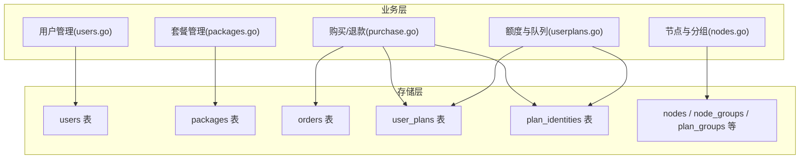
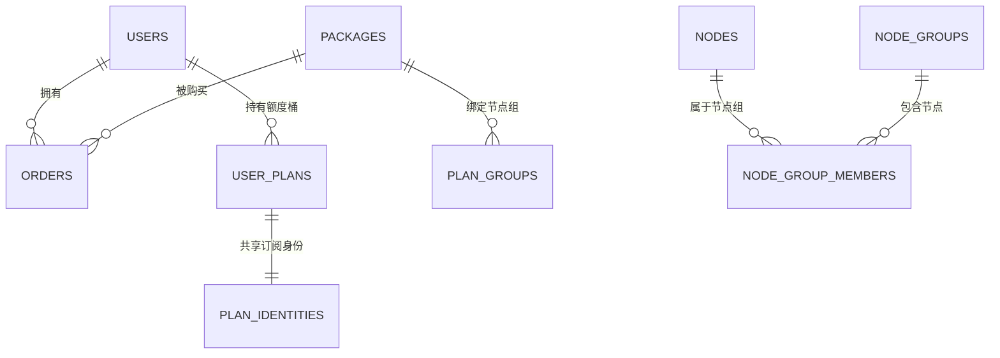
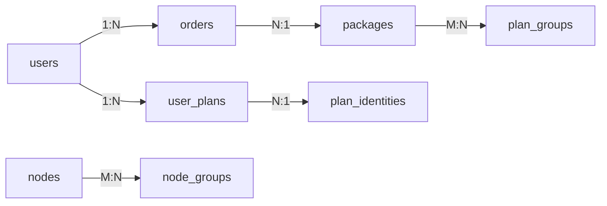
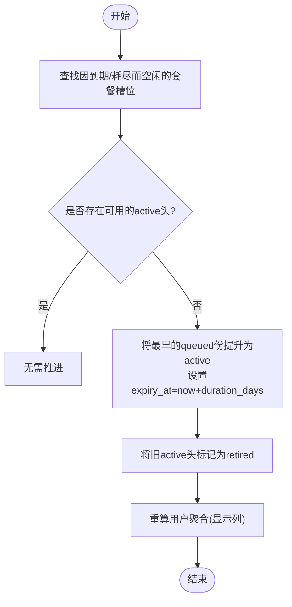

# 核心实体模型

<cite>
**本文引用的文件**
- [migrate.go](file://internal/store/migrate.go)
- [users.go](file://internal/store/users.go)
- [packages.go](file://internal/store/packages.go)
- [purchase.go](file://internal/store/purchase.go)
- [userplans.go](file://internal/store/userplans.go)
- [nodes.go](file://internal/store/nodes.go)
</cite>

## 目录
1. [简介](#简介)
2. [项目结构](#项目结构)
3. [核心组件](#核心组件)
4. [架构总览](#架构总览)
5. [详细组件分析](#详细组件分析)
6. [依赖关系分析](#依赖关系分析)
7. [性能考虑](#性能考虑)
8. [故障排查指南](#故障排查指南)
9. [结论](#结论)
10. [附录](#附录)

## 简介
本文件面向开发者，系统化梳理轻舟系统的核心业务实体与数据模型，重点覆盖用户(users)、节点(nodes)、套餐(packages)、订单(orders)，以及支撑计费与访问控制的额度桶(user_plans)和订阅身份(plan_identities)。文档包含：
- 表结构与字段定义、数据类型、约束与索引
- 主键策略与引用完整性（含唯一性约束）
- 实体间关联关系与业务语义
- 数据验证规则与业务逻辑约束
- ER图、关键流程时序图与流程图
- 扩展指导与常见问题定位

## 项目结构
核心数据模型定义集中在存储层 internal/store 中，通过迁移脚本在启动时创建/升级数据库；业务实体在对应 store 文件中以 Go struct 映射并实现 CRUD 与业务方法。



图表来源
- [migrate.go:10-530](file://internal/store/migrate.go#L10-L530)
- [users.go:22-56](file://internal/store/users.go#L22-L56)
- [packages.go:23-44](file://internal/store/packages.go#L23-L44)
- [purchase.go:22-36](file://internal/store/purchase.go#L22-L36)
- [userplans.go:577-607](file://internal/store/userplans.go#L577-L607)
- [nodes.go:11-25](file://internal/store/nodes.go#L11-L25)

章节来源
- [migrate.go:10-530](file://internal/store/migrate.go#L10-L530)

## 核心组件
- 用户(users)：账户、凭据、角色、状态、流量限额、设备数、用量、过期时间、订阅令牌、客户端标识等。
- 套餐(packages)：商品元数据、价格、流量、时长、库存、可见性与排序，支持多时长选项。
- 订单(orders)：购买/管理员发放的审计记录，包含快照、金额、状态、退款信息、幂等键。
- 额度桶(user_plans)：按“份”独立计量的配额单元，分为计划(plan)、通用池(pool)、免费(free)三类，承载用量、有效期、状态与队列推进。
- 订阅身份(plan_identities)：每个用户-套餐组合的稳定认证身份，避免切换“份”时影响客户端连接。
- 节点(nodes)与分组：自建或外部节点，节点分组与套餐-分组绑定决定用户可访问的入站集合。

章节来源
- [users.go:22-56](file://internal/store/users.go#L22-L56)
- [packages.go:23-44](file://internal/store/packages.go#L23-L44)
- [purchase.go:22-36](file://internal/store/purchase.go#L22-L36)
- [userplans.go:577-607](file://internal/store/userplans.go#L577-L607)
- [nodes.go:11-25](file://internal/store/nodes.go#L11-L25)

## 架构总览
下图展示核心实体间的关系与关键约束：



图表来源
- [migrate.go:16-70](file://internal/store/migrate.go#L16-L70)
- [migrate.go:107-141](file://internal/store/migrate.go#L107-L141)
- [migrate.go:353-399](file://internal/store/migrate.go#L353-L399)
- [migrate.go:45-60](file://internal/store/migrate.go#L45-L60)

## 详细组件分析

### 用户(users)
- 主键：自增整数 id
- 关键字段
  - username：唯一，登录名
  - email：可选，唯一
  - password_hash：密码哈希
  - role/status：角色与状态（如 user/admin，active/banned）
  - points：积分余额
  - client_id/name/uuid/secret：sing-box 客户端标识（用于统计与配置）
  - sub_token：订阅地址令牌（唯一）
  - current_plan_id：当前活跃套餐ID（历史兼容列，实际以 user_plans 为准）
  - traffic_limit/device_limit：流量与设备上限（由 bucket 聚合重算）
  - used_up/used_down：累计上下行字节（由 bucket 聚合重算）
  - expiry_at：过期时间戳（由 bucket 聚合重算）
  - creds_reset_at：节点凭据最后旋转时间（冷却控制）
  - last_online_at：最近在线（代理侧心跳）
- 约束与索引
  - username/email/sub_token 唯一
  - 索引：email, client_name
- 业务含义
  - 用户维度显示与鉴权；真实配额与用量来自 user_plans 聚合
  - 订阅令牌用于生成订阅链接；节点凭据旋转受冷却限制

章节来源
- [migrate.go:16-43](file://internal/store/migrate.go#L16-L43)
- [users.go:22-56](file://internal/store/users.go#L22-L56)

### 套餐(packages)
- 主键：自增整数 id
- 关键字段
  - type：traffic/plan/device（仅 traffic/plan 参与购买）
  - name/description/highlights：名称、描述、卖点（JSON数组）
  - price_points/traffic_bytes/device_add：价格、流量、设备位增量
  - duration_days/duration_options：默认时长与可选时长（JSON数组）
  - stock：库存（-1 表示无限）
  - enabled/sort_order：是否上架与排序
- 约束与索引
  - 无额外唯一约束；sort_order 控制展示顺序
- 业务含义
  - 商品定义；购买时选择具体时长选项，落库订单快照
  - 与节点组绑定，决定购买后可访问的入站集合

章节来源
- [migrate.go:45-60](file://internal/store/migrate.go#L45-L60)
- [packages.go:23-44](file://internal/store/packages.go#L23-L44)

### 订单(orders)
- 主键：自增整数 id
- 关键字段
  - user_id/package_id：关联用户与套餐
  - package_snapshot：购买时的套餐快照（JSON），保留改名/下架后的可读性
  - price_points/status：支付积分与状态（success/refunded）
  - refunded_points/refunded_at/refund_ratio/refunded_traffic：退款明细
  - idempotency_key：幂等键（唯一索引，非空时生效）
- 约束与索引
  - 索引：user_id
  - 唯一索引：(user_id, idempotency_key) WHERE idempotency_key <> ''
- 业务含义
  - 购买/管理员发放的审计凭证；退款基于快照计算比例与流量回扣

章节来源
- [migrate.go:62-71](file://internal/store/migrate.go#L62-L71)
- [purchase.go:22-36](file://internal/store/purchase.go#L22-L36)

### 额度桶(user_plans)与订阅身份(plan_identities)
- user_plans（额度桶）
  - 主键：自增整数 id
  - 关键字段
    - user_id/kind/package_id/name：归属用户、类型(plan/pool/free)、套餐ID、快照名
    - client_name/client_uuid/client_secret：sing-box 统计身份（唯一）
    - traffic_limit/used_up/used_down：配额与用量
    - expiry_at/last_online_at/order_id：过期、在线、订单关联
    - status/duration_days：队列状态(active/queued/retired)与时长
    - proxy_username/password/expires_at：混合代理账号与过期
  - 约束与索引
    - 唯一索引：client_name
    - 部分唯一索引：proxy_username WHERE <> ''
    - 索引：user_id
- plan_identities（订阅身份）
  - 主键：(user_id, package_id)
  - 关键字段：client_name/uuid/secret/proxy_*，稳定身份，跨“份”不变
  - 约束与索引
    - 唯一索引：client_name
    - 部分唯一索引：proxy_username WHERE <> ''
- 业务含义
  - 每笔购买生成一份独立的 metered 桶，同套餐多次购买形成队列；仅 head 为 active 并计量
  - 订阅身份与份分离，确保切换份不影响客户端认证

章节来源
- [migrate.go:353-401](file://internal/store/migrate.go#L353-L401)
- [userplans.go:577-607](file://internal/store/userplans.go#L577-L607)

### 节点(nodes)与分组
- nodes
  - 主键：自增整数 id
  - 关键字段：type(self_built/external)/name/protocol/inbound_tag/share_link/source_id/enabled/sort_order/created_at
  - 约束与索引：enabled 索引；source_id 索引
- node_groups/node_group_members
  - 节点分组与成员关系（复合主键）
- plan_groups
  - 套餐与节点组的绑定，决定购买后可访问的入站集合
- 业务含义
  - 自建节点通过 inbound_tag 与 sing-box 入站匹配；外部节点通过 share_link 导入
  - 用户可访问的节点 = free_group ∪ 其所有未过期且未耗尽的计划桶对应的套餐-分组集合

章节来源
- [migrate.go:107-141](file://internal/store/migrate.go#L107-L141)
- [nodes.go:11-25](file://internal/store/nodes.go#L11-L25)

## 依赖关系分析
- 用户与订单：一对多（一个用户有多条订单）
- 订单与套餐：多对一（订单快照保留套餐信息）
- 用户与额度桶：一对多（一个用户有多个桶）
- 额度桶与订阅身份：一对一（plan 类型的桶共享同一订阅身份）
- 套餐与节点组：多对多（通过 plan_groups）
- 节点与节点组：多对多（通过 node_group_members）



图表来源
- [migrate.go:16-70](file://internal/store/migrate.go#L16-L70)
- [migrate.go:107-141](file://internal/store/migrate.go#L107-L141)
- [migrate.go:353-399](file://internal/store/migrate.go#L353-L399)

章节来源
- [migrate.go:16-70](file://internal/store/migrate.go#L16-L70)
- [migrate.go:107-141](file://internal/store/migrate.go#L107-L141)
- [migrate.go:353-399](file://internal/store/migrate.go#L353-L399)

## 性能考虑
- 高频写入路径（购买、用量上报、队列推进）使用事务保证一致性，减少锁竞争
- 关键查询均建立索引：users(email, client_name)、orders(user_id, idempotency_key)、user_plans(user_id, client_name)、nodes(enabled, source_id)
- 用量与报表采用样本表(traffic_samples)与日级汇总(traffic_daily)分离，避免大表扫描
- 队列推进批量扫描 due 用户，失败不中断整体推进，降低单点阻塞风险

[本节为通用性能建议，不直接分析特定文件]

## 故障排查指南
- 购买重复扣款
  - 检查 orders.idempotency_key 唯一约束是否生效；确认幂等键是否一致
  - 参考购买事务中的幂等检查与回滚逻辑
- 退款后额度异常
  - 确认 reverseOrderBucket/reversePlanBucket 是否正确执行；检查 user_plans 状态与用量
  - 核对 orders.refunded_* 字段与 point_transactions 流水
- 用户无法访问节点
  - 检查 AccessibleGroupIDs 计算：free_group_id 设置、用户持有的计划桶是否有效（未过期、未耗尽）
  - 确认套餐-节点组绑定 plan_groups 是否存在
- 节点凭据旋转频繁失败
  - 检查 users.creds_reset_at 冷却限制；必要时使用 NoCredsResetCooldown 跳过（仅限运维路径）

章节来源
- [purchase.go:423-567](file://internal/store/purchase.go#L423-L567)
- [userplans.go:148-226](file://internal/store/userplans.go#L148-L226)
- [nodes.go:294-326](file://internal/store/nodes.go#L294-L326)
- [users.go:167-296](file://internal/store/users.go#L167-L296)

## 结论
轻舟的数据模型以“用户-套餐-订单-额度桶-订阅身份-节点分组”为核心，采用“每份独立计量+队列激活”的设计，既保证了并发购买的安全与公平，又实现了稳定的客户端认证与灵活的访问控制。通过迁移脚本与幂等设计，系统具备良好的演进能力与可维护性。

[本节为总结性内容，不直接分析特定文件]

## 附录

### ER图（核心实体）
```mermaid
erDiagram
USERS {
integer id PK
text username UK
text email UK
text password_hash
text role
text status
integer points
text sub_token UK
integer current_plan_id
integer traffic_limit
integer device_limit
integer used_up
integer used_down
integer expiry_at
integer creds_reset_at
integer last_online_at
integer created_at
integer updated_at
}
PACKAGES {
integer id PK
text type
text name
text description
text highlights
integer price_points
integer traffic_bytes
integer device_add
integer duration_days
text duration_options
integer stock
integer enabled
integer sort_order
integer created_at
}
ORDERS {
integer id PK
integer user_id FK
integer package_id FK
text package_snapshot
integer price_points
text status
integer created_at
integer refunded_points
integer refunded_at
real refund_ratio
integer refunded_traffic
text idempotency_key
}
USER_PLANS {
integer id PK
integer user_id FK
text kind
integer package_id
text name
text client_name UK
text client_uuid
text client_secret
integer traffic_limit
integer used_up
integer used_down
integer expiry_at
integer last_online_at
integer order_id
integer created_at
integer updated_at
text status
integer duration_days
text proxy_username UK_PARTIAL
text proxy_password
integer proxy_expires_at
}
PLAN_IDENTITIES {
integer user_id PK
integer package_id PK
text client_name UK
text client_uuid
text client_secret
text proxy_username UK_PARTIAL
text proxy_password
integer proxy_expires_at
integer created_at
integer updated_at
}
NODES {
integer id PK
text type
text name
text protocol
text inbound_tag
text share_link
integer source_id
integer enabled
integer sort_order
integer created_at
}
NODE_GROUPS {
integer id PK
text name
text description
integer sort_order
integer created_at
}
NODE_GROUP_MEMBERS {
integer node_id FK
integer group_id FK
}
PLAN_GROUPS {
integer package_id FK
integer group_id FK
}
USERS ||--o{ ORDERS : "拥有"
USERS ||--o{ USER_PLANS : "持有"
PACKAGES ||--o{ ORDERS : "被购买"
PACKAGES ||--o{ PLAN_GROUPS : "绑定"
NODES ||--o{ NODE_GROUP_MEMBERS : "属于"
NODE_GROUPS ||--o{ NODE_GROUP_MEMBERS : "包含"
USER_PLANS ||--|| PLAN_IDENTITIES : "共享身份"
```

图表来源
- [migrate.go:16-70](file://internal/store/migrate.go#L16-L70)
- [migrate.go:107-141](file://internal/store/migrate.go#L107-L141)
- [migrate.go:353-399](file://internal/store/migrate.go#L353-L399)

### 购买流程时序图（含幂等与队列推进）
```mermaid
sequenceDiagram
participant Client as "客户端"
participant API as "API层"
participant Store as "Store(事务)"
participant DB as "数据库"
Client->>API : POST 购买(package, days, idemKey)
API->>Store : PurchaseDuration(userID, pkg, days, idemKey, sync)
Store->>DB : BEGIN IMMEDIATE
Store->>DB : 检查幂等键(idemKey)
alt 已存在订单
Store-->>Client : 返回已有订单
else 新订单
Store->>DB : 读取最新套餐(内事务)
Store->>DB : 校验启用/库存/用户组权限
Store->>DB : 扣减用户积分
Store->>DB : 写入订单(含快照)
Store->>DB : 创建/追加额度桶(plan→队列; traffic→池)
Store->>DB : 推进队列(advanceUserQueues)
Store->>DB : 写入积分流水(point_transactions)
Store->>DB : 重算用户聚合(traffic_limit/used_*/expiry_at)
Store->>DB : 扣库存(若有限)
Store->>API : 回调sync更新外部系统
Store->>DB : COMMIT
Store-->>Client : 返回订单与用户快照
end
```

图表来源
- [purchase.go:53-250](file://internal/store/purchase.go#L53-L250)
- [userplans.go:148-226](file://internal/store/userplans.go#L148-L226)

### 队列推进流程图（计划桶激活）


图表来源
- [userplans.go:148-226](file://internal/store/userplans.go#L148-L226)

### 示例数据（示意）
- users
  - id=1, username="alice", email="alice@example.com", role="user", status="active", points=1000, sub_token="sub_xxx", traffic_limit=10737418240, device_limit=3, used_up=0, used_down=0, expiry_at=1767225600
- packages
  - id=10, type="plan", name="月度计划", price_points=500, traffic_bytes=10737418240, duration_days=30, stock=-1, enabled=1
- orders
  - id=100, user_id=1, package_id=10, package_snapshot={"name":"月度计划","type":"plan"}, price_points=500, status="success", created_at=1735689600
- user_plans
  - id=200, user_id=1, kind="plan", package_id=10, name="月度计划", client_name="qz_alice_p100", traffic_limit=10737418240, used_up=0, used_down=0, expiry_at=1738368000, status="active", order_id=100
- plan_identities
  - user_id=1, package_id=10, client_name="qz_alice_s10", client_uuid="u10", client_secret="s10"
- nodes / node_groups / plan_groups
  - node_groups: id=1, name="国内高速"
  - nodes: id=1, type="self_built", name="北京A", inbound_tag="vless-beijing-a", enabled=1
  - plan_groups: package_id=10, group_id=1

[以上为概念性示例，便于理解关系与字段取值范围]

### 扩展指导
- 新增套餐字段
  - 在 migrate.go 的 schema 中添加列，并在 packages.go 的 scan/update 中同步读写
  - 注意 JSON 字段的编解码（如 highlights、duration_options）
- 新增节点属性
  - 在 nodes.go 的 Node struct 与 nodeCols 中增加字段，并在迁移脚本中 ADD COLUMN
  - 如需索引，请在迁移中 CREATE INDEX
- 引入新的额度类型
  - 在 user_plans.kind 中扩展枚举值，并在 recomputeUserAggregate 与 Active/HasQuota 等逻辑中处理
  - 注意与 plan_identities 的关系及代理凭据的继承规则
- 订单幂等与退款
  - 严格使用 idempotency_key 防止重复扣费
  - 退款需同时回退额度与积分，并记录 point_transactions

[本节为通用扩展建议，不直接分析特定文件]
