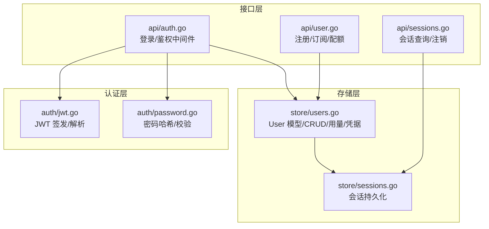
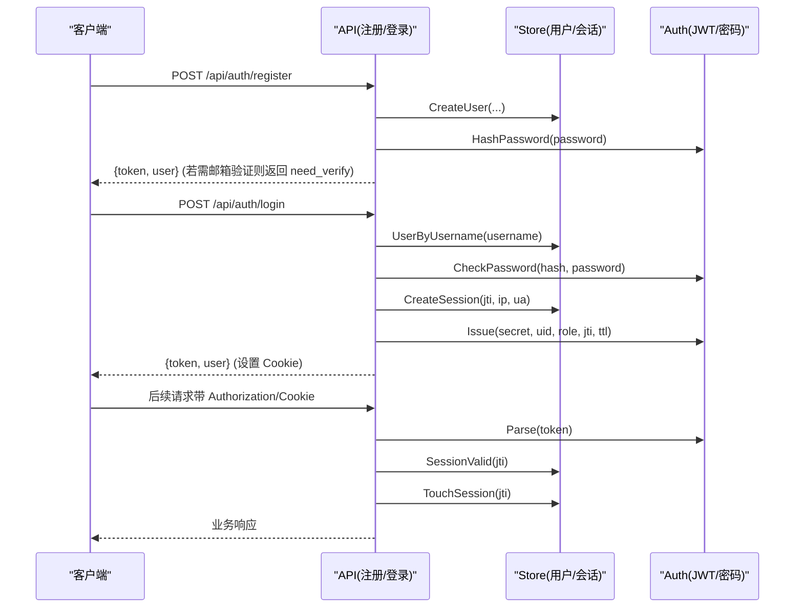
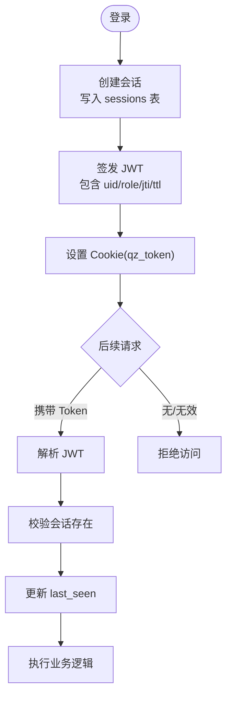
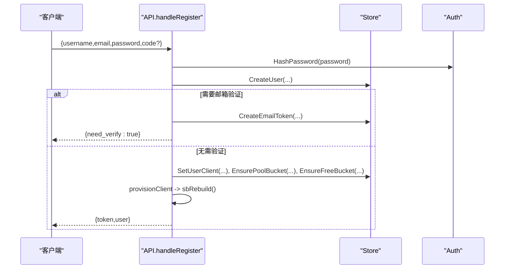
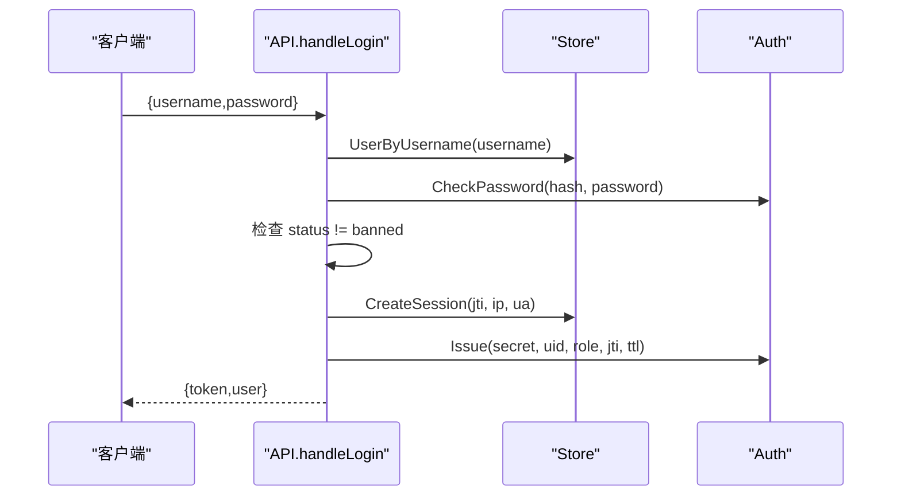
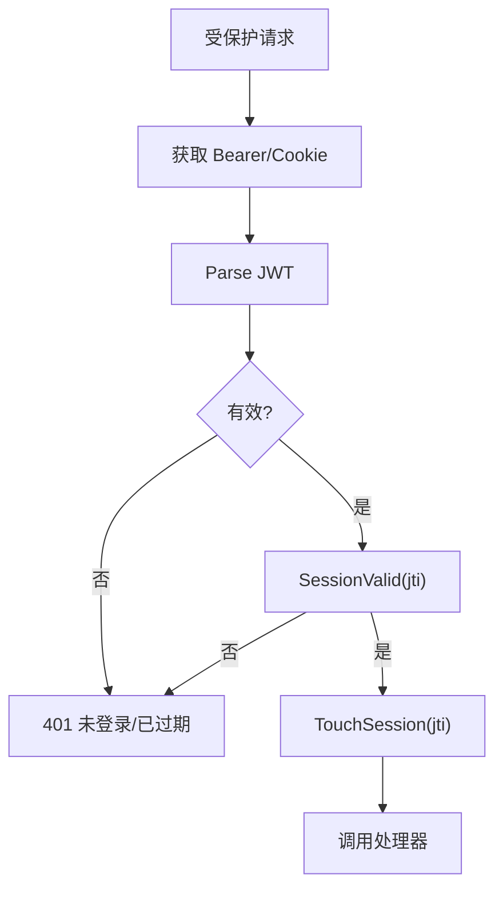
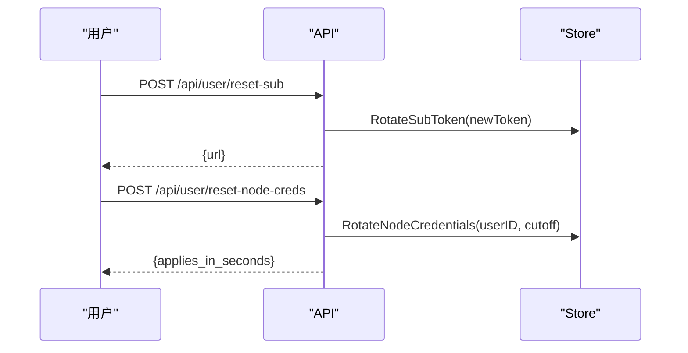
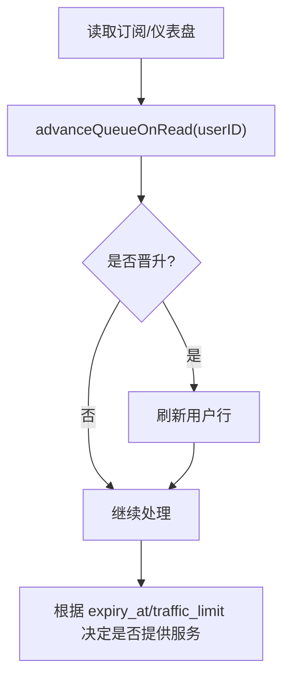
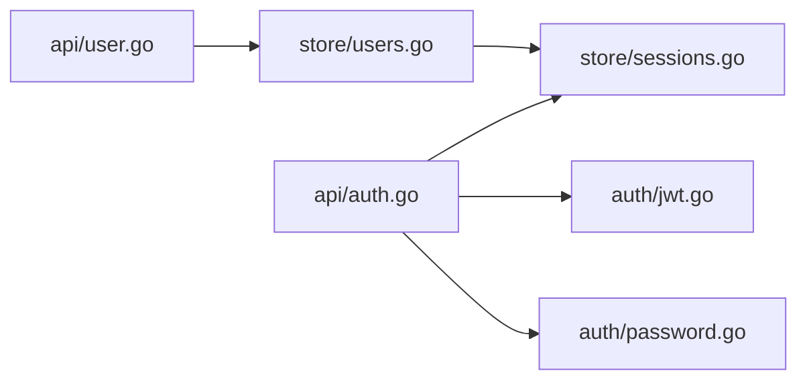

# 用户管理实体

<cite>
**本文引用的文件**
- [internal/store/users.go](file://internal/store/users.go)
- [internal/api/user.go](file://internal/api/user.go)
- [internal/api/auth.go](file://internal/api/auth.go)
- [internal/auth/jwt.go](file://internal/auth/jwt.go)
- [internal/auth/password.go](file://internal/auth/password.go)
- [internal/store/sessions.go](file://internal/store/sessions.go)
- [internal/api/sessions.go](file://internal/api/sessions.go)
</cite>

## 目录
1. [简介](#简介)
2. [项目结构](#项目结构)
3. [核心组件](#核心组件)
4. [架构总览](#架构总览)
5. [详细组件分析](#详细组件分析)
6. [依赖关系分析](#依赖关系分析)
7. [性能考虑](#性能考虑)
8. [故障排查指南](#故障排查指南)
9. [结论](#结论)
10. [附录：API与数据库操作模式](#附录api与数据库操作模式)

## 简介
本文件聚焦“用户管理实体”，围绕 users 表结构与相关能力进行系统化说明，覆盖用户基本信息、权限控制、认证字段、订阅与用量统计、状态机、角色权限模型与会话机制；并给出注册、登录、权限校验的完整流程、数据验证规则与安全约束，以及常用 API 与数据库操作模式的参考路径。

## 项目结构
与用户管理相关的代码主要分布在以下模块：
- 存储层（store）：定义 User 模型、CRUD、会话、额度/用量更新等。
- 接口层（api）：注册、登录、订阅、重置凭据、管理员操作等 HTTP 端点。
- 认证层（auth）：JWT 签发/解析、密码哈希/校验。
- 会话管理（store + api）：登录设备列表、踢出、清理过期会话。

图表来源
- [internal/api/user.go:25-173](file://internal/api/user.go#L25-L173)
- [internal/api/auth.go:112-201](file://internal/api/auth.go#L112-L201)
- [internal/store/users.go:22-121](file://internal/store/users.go#L22-L121)
- [internal/store/sessions.go:15-36](file://internal/store/sessions.go#L15-L36)
- [internal/auth/jwt.go:16-41](file://internal/auth/jwt.go#L16-L41)
- [internal/auth/password.go:5-23](file://internal/auth/password.go#L5-L23)

章节来源
- [internal/store/users.go:22-121](file://internal/store/users.go#L22-L121)
- [internal/api/user.go:25-173](file://internal/api/user.go#L25-L173)
- [internal/api/auth.go:112-201](file://internal/api/auth.go#L112-L201)
- [internal/auth/jwt.go:16-41](file://internal/auth/jwt.go#L16-L41)
- [internal/auth/password.go:5-23](file://internal/auth/password.go#L5-L23)
- [internal/store/sessions.go:15-36](file://internal/store/sessions.go#L15-L36)

## 核心组件
- 用户模型（User）：包含用户名、邮箱、密码哈希、角色、状态、邮箱验证标记、客户端标识、订阅令牌、套餐/流量/设备限制、用量统计、有效期、创建/更新时间、最近在线、凭据重置时间等。
- 会话（Session）：记录登录设备、IP、UA、创建与最后活跃时间，支持按 JTI 失效与批量清理。
- 认证（JWT + 密码）：使用 bcrypt 哈希密码，JWT 携带用户ID、角色、JTI 与过期时间，配合会话存在性校验实现可撤销登录。
- 订阅与凭据：为每个用户生成订阅令牌与 sing-box 客户端凭据（UUID/Secret），支持轮换与冷却期保护。
- 用量与配额：维护 used_up/used_down、traffic_limit、device_limit、expiry_at，并在购买/退款/管理员调整时同步。

章节来源
- [internal/store/users.go:22-56](file://internal/store/users.go#L22-L56)
- [internal/store/sessions.go:5-13](file://internal/store/sessions.go#L5-L13)
- [internal/auth/jwt.go:10-41](file://internal/auth/jwt.go#L10-L41)
- [internal/auth/password.go:5-23](file://internal/auth/password.go#L5-L23)
- [internal/api/user.go:175-212](file://internal/api/user.go#L175-L212)

## 架构总览
下图展示了用户从注册到登录、鉴权访问的核心链路，以及与存储和认证的交互。

图表来源
- [internal/api/user.go:25-173](file://internal/api/user.go#L25-L173)
- [internal/api/auth.go:112-201](file://internal/api/auth.go#L112-L201)
- [internal/store/users.go:105-121](file://internal/store/users.go#L105-L121)
- [internal/store/sessions.go:15-36](file://internal/store/sessions.go#L15-L36)
- [internal/auth/jwt.go:16-41](file://internal/auth/jwt.go#L16-L41)
- [internal/auth/password.go:5-23](file://internal/auth/password.go#L5-L23)

## 详细组件分析

### 用户模型与数据库字段
- 基本信息：username、email、password_hash
- 权限控制：role（默认"user"）、status（active/banned/pending 等）
- 认证相关：email_verified、client_id、client_name、client_uuid、client_secret、sub_token
- 订阅管理：current_plan_id（历史兼容）、traffic_limit、device_limit
- 使用统计：used_up、used_down、expiry_at
- 其他：points、created_at、updated_at、last_online_at、creds_reset_at

这些字段由 User 结构体与 SQL 列名常量共同定义，并提供按用户名/邮箱/ID/订阅令牌查询的方法。

章节来源
- [internal/store/users.go:22-56](file://internal/store/users.go#L22-L56)
- [internal/store/users.go:76-90](file://internal/store/users.go#L76-L90)

### 用户状态机
- active：正常可用
- banned：封禁，登录与订阅均拒绝
- pending：待激活（如邮箱未验证）

登录与订阅入口会检查 status：
- 登录：banned 直接拒绝
- 订阅：banned 直接拒绝；同时结合 expiry_at 与 traffic_limit 判定是否可服务节点

章节来源
- [internal/api/auth.go:138-141](file://internal/api/auth.go#L138-L141)
- [internal/api/user.go:784-800](file://internal/api/user.go#L784-L800)

### 角色权限模型
- role 用于区分普通用户与管理员
- 鉴权中间件解析 JWT 后注入 ctxUserID、ctxRole、ctxJti
- requireAdmin 中间件仅允许 role=admin 访问管理端点

章节来源
- [internal/api/auth.go:179-213](file://internal/api/auth.go#L179-L213)
- [internal/api/auth.go:225-240](file://internal/api/auth.go#L225-L240)

### 会话管理机制
- 登录时创建会话（记录 IP、UA、创建时间、最后活跃时间），签发 JWT（含 JTI）
- 每次受保护请求校验 JWT 并检查会话是否存在（支持远程注销/撤销）
- 定期清理过期会话，列出当前设备并按设备去重（IP+UA）
- 支持单设备注销与全部登出

图表来源
- [internal/api/auth.go:49-65](file://internal/api/auth.go#L49-L65)
- [internal/api/auth.go:179-201](file://internal/api/auth.go#L179-L201)
- [internal/store/sessions.go:15-36](file://internal/store/sessions.go#L15-L36)
- [internal/store/sessions.go:56-99](file://internal/store/sessions.go#L56-L99)

### 用户注册流程
- 校验用户名格式、密码长度、邮箱唯一性
- 根据配置决定是否要求邮箱验证
- 如需验证：创建用户但不立即开通节点，发送验证邮件；验证通过后继续开通
- 否则：立即为用户生成订阅令牌、sing-box 客户端凭据，建立流量池与免费组桶，重建配置并返回登录态

图表来源
- [internal/api/user.go:25-173](file://internal/api/user.go#L25-L173)
- [internal/api/user.go:175-212](file://internal/api/user.go#L175-L212)
- [internal/store/users.go:105-121](file://internal/store/users.go#L105-L121)

### 用户登录流程
- 查找用户，比对密码（不存在时也做耗时比较以防御枚举）
- 检查状态是否为封禁
- 创建会话、签发 JWT、设置 Cookie，返回 token 与用户视图

图表来源
- [internal/api/auth.go:112-149](file://internal/api/auth.go#L112-L149)
- [internal/auth/password.go:5-23](file://internal/auth/password.go#L5-L23)
- [internal/store/sessions.go:15-23](file://internal/store/sessions.go#L15-L23)
- [internal/auth/jwt.go:16-28](file://internal/auth/jwt.go#L16-L28)

### 权限验证流程（鉴权中间件）
- 从 Authorization 或 Cookie 中取 Token
- 解析 JWT，校验签名与有效期
- 校验会话仍存在（支持远程注销）
- 将用户ID、角色、JTI 注入上下文供后续处理器使用

图表来源
- [internal/api/auth.go:179-201](file://internal/api/auth.go#L179-L201)
- [internal/auth/jwt.go:30-41](file://internal/auth/jwt.go#L30-L41)
- [internal/store/sessions.go:25-36](file://internal/store/sessions.go#L25-L36)

### 订阅与凭据管理
- 订阅令牌：首次注册时生成，支持更换地址（RotateSubToken）
- 节点凭据：sing-box 客户端 UUID/Secret，支持轮换（RotateNodeCredentials），具备冷却期与审计日志
- 订阅链接：基于用户的子令牌与格式参数生成，屏蔽被封禁用户与超量/过期用户

图表来源
- [internal/api/user.go:318-355](file://internal/api/user.go#L318-L355)
- [internal/api/user.go:387-412](file://internal/api/user.go#L387-L412)
- [internal/store/users.go:152-165](file://internal/store/users.go#L152-L165)
- [internal/store/users.go:191-296](file://internal/store/users.go#L191-L296)

### 用量与配额
- 用量来自 sing-box 上报，通过 UpdateUserUsage 写入 used_up/used_down
- 购买/退款/管理员调整通过 UpdateEntitlement 更新 traffic_limit/expiry_at
- 订阅接口在读取前推进队列（advanceQueueOnRead），确保到期套餐及时切换

图表来源
- [internal/api/user.go:225-265](file://internal/api/user.go#L225-L265)
- [internal/store/users.go:330-345](file://internal/store/users.go#L330-L345)

## 依赖关系分析
- API 层依赖 Store 进行数据读写，依赖 Auth 进行密码与 JWT 处理
- Store 层对数据库进行事务化更新（如凭据轮换、管理员编辑）
- 会话与用户强关联，删除用户时会级联清理其会话、令牌、计划等

图表来源
- [internal/api/user.go:25-173](file://internal/api/user.go#L25-L173)
- [internal/api/auth.go:112-201](file://internal/api/auth.go#L112-L201)
- [internal/store/users.go:105-121](file://internal/store/users.go#L105-L121)
- [internal/store/sessions.go:15-36](file://internal/store/sessions.go#L15-L36)
- [internal/auth/jwt.go:16-41](file://internal/auth/jwt.go#L16-L41)
- [internal/auth/password.go:5-23](file://internal/auth/password.go#L5-L23)

章节来源
- [internal/api/user.go:25-173](file://internal/api/user.go#L25-L173)
- [internal/api/auth.go:112-201](file://internal/api/auth.go#L112-L201)
- [internal/store/users.go:105-121](file://internal/store/users.go#L105-L121)
- [internal/store/sessions.go:15-36](file://internal/store/sessions.go#L15-L36)
- [internal/auth/jwt.go:16-41](file://internal/auth/jwt.go#L16-L41)
- [internal/auth/password.go:5-23](file://internal/auth/password.go#L5-L23)

## 性能考虑
- 登录防枚举：对用户不存在路径执行 dummy 哈希比较，避免时序泄露
- 会话去重：同一设备重复登录合并为一条会话，减少冗余
- 凭据轮换冷却：防止频繁重启 sing-box 影响全局连接
- 订阅读取前置推进队列：避免后台任务延迟导致用户感知卡顿
- 用量更新与配额调整采用独立方法，便于批处理与监控

[本节为通用指导，不直接分析具体文件]

## 故障排查指南
- 登录失败：检查用户名/密码、账号是否被封禁、会话是否被撤销
- 订阅不可用：检查 status、expiry_at、traffic_limit 与用量；必要时触发 advanceQueueOnRead
- 凭据轮换失败：确认冷却期是否满足，或尝试管理员路径绕过冷却
- 会话过多：清理过期会话，或在用户侧注销特定设备

章节来源
- [internal/api/auth.go:112-149](file://internal/api/auth.go#L112-L149)
- [internal/api/user.go:784-800](file://internal/api/user.go#L784-L800)
- [internal/api/user.go:387-412](file://internal/api/user.go#L387-L412)
- [internal/store/sessions.go:56-99](file://internal/store/sessions.go#L56-L99)

## 结论
本项目围绕 users 表构建了完整的用户生命周期管理能力：安全的注册与登录、细粒度的角色权限控制、健壮的会话管理、灵活的订阅与凭据轮换、以及准确的用量与配额统计。通过中间件与存储层的协作，实现了高可用、可扩展且安全的用户管理体系。

[本节为总结，不直接分析具体文件]

## 附录：API与数据库操作模式

### 关键 API 示例（路径与行为）
- 注册：POST /api/auth/register
  - 输入：username、email、password、可选 code
  - 行为：校验、创建用户、可选邮箱验证、生成订阅令牌与客户端凭据、返回 token
  - 参考路径：[internal/api/user.go:25-173](file://internal/api/user.go#L25-L173)

- 登录：POST /api/auth/login
  - 输入：username、password
  - 行为：校验、创建会话、签发 JWT、设置 Cookie
  - 参考路径：[internal/api/auth.go:112-149](file://internal/api/auth.go#L112-L149)

- 查看订阅：GET /api/user/sub
  - 行为：返回订阅 URL 与可用格式
  - 参考路径：[internal/api/user.go:460-492](file://internal/api/user.go#L460-L492)

- 重置订阅地址：POST /api/user/reset-sub
  - 行为：生成新 sub_token，刷新缓存链接
  - 参考路径：[internal/api/user.go:318-355](file://internal/api/user.go#L318-L355)

- 重置节点凭据：POST /api/user/reset-node-creds
  - 行为：轮换 sing-box 凭据（带冷却期），异步生效
  - 参考路径：[internal/api/user.go:387-412](file://internal/api/user.go#L387-L412)

- 会话管理：
  - GET /api/user/sessions：列出当前设备
  - POST /api/user/sessions/{id}/revoke：注销指定设备
  - 参考路径：[internal/api/sessions.go:10-42](file://internal/api/sessions.go#L10-L42)

### 数据库操作模式（参考路径）
- 创建用户：CreateUser
  - 参考路径：[internal/store/users.go:105-121](file://internal/store/users.go#L105-L121)

- 设置客户端凭据：SetUserClient
  - 参考路径：[internal/store/users.go:123-130](file://internal/store/users.go#L123-L130)

- 轮换订阅令牌：RotateSubToken
  - 参考路径：[internal/store/users.go:152-165](file://internal/store/users.go#L152-L165)

- 轮换节点凭据：RotateNodeCredentials（事务化，含冷却期与审计）
  - 参考路径：[internal/store/users.go:191-296](file://internal/store/users.go#L191-L296)

- 更新用量：UpdateUserUsage
  - 参考路径：[internal/store/users.go:339-345](file://internal/store/users.go#L339-L345)

- 更新配额：UpdateEntitlement
  - 参考路径：[internal/store/users.go:330-337](file://internal/store/users.go#L330-L337)

- 会话管理：
  - 创建/校验/触摸/清理/列出/删除
  - 参考路径：[internal/store/sessions.go:15-133](file://internal/store/sessions.go#L15-L133)
